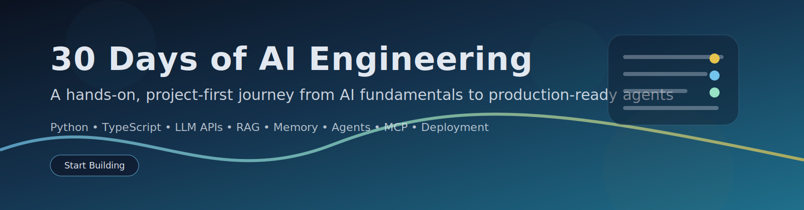

# 30 Days of AI Engineering



[](day_01/day_01_introduction_to_ai_engineering.md) [](day_01/day_01_introduction_to_ai_engineering.md) [](day_01/day_01_introduction_to_ai_engineering.md)

A free, practical, project-driven learning path for people who want to build real AI applications. **One capstone product (StudySpark)** grows across all 30 days. Every lesson uses the same structure and supports **Beginner, Intermediate, and Advanced** paths.

## Start Here

| Step | Link | Who |
| --- | --- | --- |
| 1 | [Day 0 — Getting Started](day_00/day_00_getting_started.md) | Everyone — setup and learning path |
| 2 | [SYLLABUS.md](SYLLABUS.md) | How to follow the course at your level |
| 3 | [Day 1](day_01/day_01_introduction_to_ai_engineering.md) | First lesson after setup |
| 4 | [projects/CAPSTONE.md](projects/CAPSTONE.md) | Update after every day |
| 5 | [projects/studyspark/](projects/studyspark/) | Runnable code (mock LLM works without API keys) |

## Choose Your Learning Path

| Path | Best for | Time per day |
| --- | --- | --- |
| **Beginner** | New to AI; learn theory + one example + easy exercises | 4–6 hours |
| **Intermediate** | Developers; focus on code + mini projects | 2–4 hours |
| **Advanced** | Experienced engineers; tradeoffs + capstone extensions | 1–3 hours |

Every lesson includes a **How to Use This Lesson** table with these paths. See [SYLLABUS.md](SYLLABUS.md) for full guidance.

## What This Repository Teaches

You will move from AI foundations to LLM APIs, retrieval, memory, agents, evaluation, guardrails, and deployment — while building **StudySpark**, a study assistant you extend daily.

## Learning Roadmap

### Week 1 - AI Foundations
| Day | Topic |
| --- | --- |
| 00 | [Getting Started](day_00/day_00_getting_started.md) |
| 01 | [Introduction to AI Engineering](day_01/day_01_introduction_to_ai_engineering.md) |
| 02 | [How Large Language Models Work](day_02/day_02_how_large_language_models_work.md) |
| 03 | [Tokens, Context Windows, and Embeddings](day_03/day_03_tokens_context_windows_and_embeddings.md) |
| 04 | [Prompt Engineering Fundamentals](day_04/day_04_prompt_engineering_fundamentals.md) |
| 05 | [Advanced Prompt Engineering](day_05/day_05_advanced_prompt_engineering.md) |
| 06 | [LLM APIs](day_06/day_06_llm_apis.md) |
| 07 | [Mini Project: Prompt Helper](day_07/day_07_mini_project_prompt_helper.md) |

### Week 2 - Building AI Applications
| Day | Topic |
| --- | --- |
| 08 | [OpenAI API](day_08/day_08_openai_api.md) |
| 09 | [Claude API](day_09/day_09_claude_api.md) |
| 10 | [Structured Outputs](day_10/day_10_structured_outputs.md) |
| 11 | [Tool Calling](day_11/day_11_tool_calling.md) |
| 12 | [Function Calling](day_12/day_12_function_calling.md) |
| 13 | [Streaming Responses](day_13/day_13_streaming_responses.md) |
| 14 | [Mini AI Assistant](day_14/day_14_mini_ai_assistant.md) |

### Week 3 - Retrieval and Memory
| Day | Topic |
| --- | --- |
| 15 | [Embeddings](day_15/day_15_embeddings.md) |
| 16 | [Vector Databases](day_16/day_16_vector_databases.md) |
| 17 | [RAG](day_17/day_17_rag.md) |
| 18 | [Hybrid Search](day_18/day_18_hybrid_search.md) |
| 19 | [Memory](day_19/day_19_memory.md) |
| 20 | [Long-Term Memory](day_20/day_20_long_term_memory.md) |
| 21 | [Knowledge Assistant Project](day_21/day_21_knowledge_assistant_project.md) |

### Week 4 - AI Agents
| Day | Topic |
| --- | --- |
| 22 | [What are AI Agents?](day_22/day_22_what_are_ai_agents.md) |
| 23 | [Planning](day_23/day_23_planning.md) |
| 24 | [Multi-Agent Systems](day_24/day_24_multi_agent_systems.md) |
| 25 | [Model Context Protocol (MCP)](day_25/day_25_model_context_protocol_mcp.md) |
| 26 | [LangChain](day_26/day_26_langchain.md) |
| 27 | [Evaluation](day_27/day_27_evaluation.md) |
| 28 | [Guardrails](day_28/day_28_guardrails.md) |
| 29 | [Deployment](day_29/day_29_deployment.md) |
| 30 | [Capstone Project](day_30/day_30_capstone_project.md) |

## Consistent Lesson Format

Every day follows the same sections so you always know what to read, run, and apply:

Introduction → Objectives → **How to Use This Lesson** → Prerequisites → Big Picture → Deep Theory → Visual Learning → Code Walkthrough → Exercises → Mini Project → **Cumulative Capstone Update** → Summary → Further Reading

Template: [.github/LESSON_TEMPLATE.md](.github/LESSON_TEMPLATE.md)

## How To Use This Repository

1. Complete [Day 0](day_00/day_00_getting_started.md) and pick your learning path.
2. Read each lesson in order; follow the path table at the top.
3. Trace at least one code example (Python or TypeScript).
4. Update [projects/CAPSTONE.md](projects/CAPSTONE.md) daily.
5. Run code in [projects/studyspark/](projects/studyspark/) from Week 2 onward.
6. Use [solutions/](solutions/) for rubrics and reference answers when available.

## Repository Structure

```
30-Days-Of-AI-Engineering/
├── README.md
├── SYLLABUS.md
├── day_00/ … day_30/
├── projects/
│   ├── CAPSTONE.md
│   └── studyspark/
├── solutions/
├── resources/
├── scripts/
├── images/
└── .github/
```

## Progress Table

Track your own progress in `projects/CAPSTONE.md` or below:

| Week | Focus | Capstone milestone |
| --- | --- | --- |
| 1 | Foundations | Prompt Helper spec |
| 2 | AI apps | StudySpark chat shell |
| 3 | Retrieval | Knowledge assistant + RAG |
| 4 | Agents & ship | Deployed capstone demo |

## Contribution Guide

Contributions are welcome. Please follow [.github/LESSON_TEMPLATE.md](.github/LESSON_TEMPLATE.md) and [.github/copilot-instructions.md](.github/copilot-instructions.md).

Good contributions: clearer explanations, runnable examples, diagrams, exercises, capstone slices, accessibility for beginners.

## License

This repository is intended to be free and open source. Add a license file before public release if you want a formal redistribution license.

## Acknowledgements

- Asabeneh Yetayeh for the clear, practical 30 Days learning format
- The open source AI community for tools and examples
- Documentation teams at OpenAI, Anthropic, LangChain, FastAPI, Hugging Face, and the broader ecosystem
