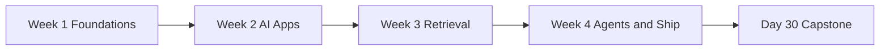

# Syllabus — 30 Days of AI Engineering

This syllabus explains how to use the course at **any skill level**, how days connect, and what consistent structure to expect in every lesson.

## Who This Course Is For

| Learner profile | You will get the most if you… |
| --- | --- |
| **Complete beginner** | Know basic programming (variables, functions). No AI background required. Start at [Day 0](day_00/day_00_getting_started.md). |
| **Software developer new to AI** | Have built apps or APIs before. Use the Intermediate path; skim theory you know, focus on Code Walkthrough and capstone. |
| **Experienced engineer** | Use the Advanced path; focus on tradeoffs, production patterns, Hard exercises, and extending mini projects. |
| **Team lead / educator** | Use lessons as workshop chapters; `projects/CAPSTONE.md` is your cumulative team project spec. |

## Three Learning Paths

Every lesson includes a **How to Use This Lesson** section with three paths:

### Beginner path (foundations first)
1. Read Introduction → Big Picture → Deep Theory in order.
2. Study every diagram before code.
3. Trace one Python **or** one TypeScript example (you do not need both languages).
4. Complete all **Easy** exercises and at least two **Medium** exercises.
5. Record one takeaway in your notes or `projects/CAPSTONE.md`.

**Typical time:** 4–6 hours per day (reading + exercises).

### Intermediate path (build faster)
1. Skim Learning Objectives and Big Picture.
2. Read Visual Learning and Code Walkthrough.
3. Complete **Medium** and **Hard** exercises.
4. Build the mini project at a basic level.
5. Apply the day's **Cumulative Capstone Update**.

**Typical time:** 2–4 hours per day.

### Advanced path (depth + production)
1. Read Deep Theory for tradeoffs, limitations, and alternatives.
2. Skip beginner examples unless teaching others.
3. Complete **Hard** and **Challenge** exercises.
4. Extend the mini project with tests, error handling, or observability.
5. Compare your design to case studies and interview questions.

**Typical time:** 1–3 hours per day.

## Consistent Lesson Structure

Every day follows the same skeleton so you always know where to look:

| Section | Purpose |
| --- | --- |
| Introduction | Why today matters |
| Learning Objectives | What you can do after today |
| How to Use This Lesson | Beginner / Intermediate / Advanced paths |
| Prerequisites | What to review if stuck |
| Big Picture | One-screen mental model |
| Deep Theory | Concepts from multiple angles |
| Visual Learning | Mermaid diagrams |
| Code Walkthrough | Python + TypeScript with explanations |
| Practical Examples | Beginner → company examples |
| Best Practices / Common Mistakes | Production habits |
| Performance / Security | When relevant |
| Exercises | Easy → Challenge + Reflection |
| Quizzes / Interview Questions | Self-check (expanded days) |
| Mini Project | Apply one bounded deliverable |
| Cumulative Capstone Update | Add one piece to the final app |
| Summary | Key takeaways |
| Further Reading | Official docs and primary sources |

## Four-Week Arc

| Week | Theme | Checkpoint project |
| --- | --- | --- |
| 1 | AI engineering mindset, LLMs, prompts, APIs | Day 7 — Prompt Helper spec |
| 2 | OpenAI/Claude, structure, tools, streaming | Day 14 — StudySpark assistant shell |
| 3 | Embeddings, vectors, RAG, memory | Day 21 — Knowledge assistant |
| 4 | Agents, MCP, eval, guardrails, deploy | Day 30 — Full capstone |

## One Capstone, Many Layers

You build **one product** across the course: **StudySpark** — a study assistant that grows each week.

- Track progress in [`projects/CAPSTONE.md`](projects/CAPSTONE.md).
- Runnable starter code lives in [`projects/studyspark/`](projects/studyspark/).
- Sample answers and rubrics go in [`solutions/`](solutions/).

Do not start a new project every week. Extend the same codebase and spec.

## How to Apply What You Learn

1. **Read** — understand why before how.
2. **Trace** — run or step through one code example.
3. **Write** — complete exercises in a notebook or your project.
4. **Build** — mini project or capstone slice each day.
5. **Check** — quizzes, reflection questions, evaluation checklists.

## If You Fall Behind

| Situation | What to do |
| --- | --- |
| Theory is hard | Stay on Beginner path; skip Challenge until later |
| Code is hard | Use one language only; Python is the default |
| No API budget | Use mock clients in `projects/studyspark/`; add real keys later |
| Short on time | Do Intermediate path: objectives + code + capstone update only |
| Lost in Week 3 | Review Day 15 (embeddings) and Day 16 (vector DB) before RAG |

## Estimated Cost and Setup

- **Setup:** [Day 0](day_00/day_00_getting_started.md) — tools, keys, folder layout.
- **API cost (full course):** roughly $5–25 USD with efficient models and caching; many exercises work with mocks.
- **Hardware:** any modern laptop; GPU not required.

## Lesson Depth Targets

The course aims for **5,000–7,000 words** per day with 8+ diagrams and 20+ exercises. Some days are still being expanded to that standard; structure and learner paths are consistent across all days.

## Navigation

- [README](README.md) — overview and roadmap table
- [Day 0 — Getting Started](day_00/day_00_getting_started.md)
- [Day 1](day_01/day_01_introduction_to_ai_engineering.md) — start here after setup
- [Capstone tracker](projects/CAPSTONE.md)
