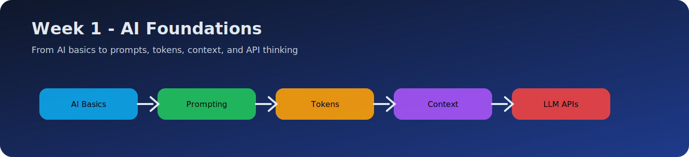
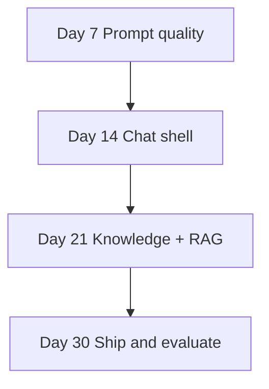

# Day 0 — Getting Started

[Next: Day 1 — Introduction to AI Engineering](../day_01/day_01_introduction_to_ai_engineering.md)

## Introduction

Day 0 is not part of the 30-day count. It prepares **every learner level** so Day 1 feels clear, not overwhelming.

You will set up tools, understand how to follow lessons, and know which learning path to use.



## Learning Objectives

By the end of Day 0, you should be able to:

- choose a learning path (Beginner, Intermediate, or Advanced)
- install the minimum tools for the course
- configure API keys safely
- open the capstone project folder and know what to update each day
- explain how the 30 days connect to one final product

## How to Use This Lesson

| Level | What to do |
| --- | --- |
| **Beginner** | Complete every step in order. Do not skip environment setup. |
| **Intermediate** | Skim concepts; verify Python/Node; clone structure; read [SYLLABUS.md](../SYLLABUS.md). |
| **Advanced** | Skim setup; focus on capstone architecture in `projects/CAPSTONE.md`; plan your extensions. |

**Time:** 1–2 hours.

## Pick Your Path

Answer honestly:

| Question | Mostly yes → |
| --- | --- |
| Have you never called an LLM API? | **Beginner** — full Week 1 pace |
| Have you built web or API apps but not AI products? | **Intermediate** — Week 1 at 2–3h/day |
| Have you shipped features with OpenAI/Claude/RAG? | **Advanced** — skim Week 1–2, deep Week 3–4 |

Write your path at the top of `projects/CAPSTONE.md`.

## What You Are Building

One capstone app: **StudySpark** — a study assistant that grows each week.



You are not building 30 separate toys. You are building one product in layers.

## Required Tools

### Everyone

| Tool | Purpose | Install |
| --- | --- | --- |
| **Git** | Clone and track work | [git-scm.com](https://git-scm.com/) |
| **Python 3.11+** | Most examples | [python.org](https://www.python.org/downloads/) |
| **Text editor** | VS Code or Cursor recommended | — |
| **Terminal** | Run examples | Built into your OS |

### Python environment

```bash
cd 30-Days-Of-AI-Engineering
python -m venv .venv

# Windows
.venv\Scripts\activate

# macOS / Linux
source .venv/bin/activate

pip install --upgrade pip
pip install openai anthropic pydantic python-dotenv httpx
```

### Optional but recommended

| Tool | Purpose |
| --- | --- |
| **Node.js 20+** | TypeScript examples |
| **Docker** | Deployment week |
| **API keys** | Real model calls (mocks work for many days) |

```bash
# Optional TypeScript
npm init -y
npm install typescript @types/node openai @anthropic-ai/sdk zod dotenv
npx tsc --init
```

## API Keys (Safe Setup)

Never commit secrets. Use environment variables.

1. Create a file named `.env` in the repo root (already in `.gitignore` if you add one).
2. Add keys only on your machine:

```bash
# .env — DO NOT COMMIT
OPENAI_API_KEY=sk-your-key-here
ANTHROPIC_API_KEY=sk-ant-your-key-here
OPENAI_MODEL=gpt-4.1-mini
ANTHROPIC_MODEL=claude-sonnet-4-20250514
LLM_PROVIDER=openai
```

3. Load in Python:

```python
import os
from dotenv import load_dotenv

load_dotenv()
api_key = os.environ.get("OPENAI_API_KEY")
if not api_key:
    print("No API key — use mock mode for this exercise")
```

### No budget yet?

Many Week 1–2 exercises work **without** live API calls. Use:

- `projects/studyspark/` mock client
- printed request/response objects in lessons
- paper specs for mini projects

Add real keys when you reach Week 2 Day 8.

## Repository Layout

```text
30-Days-Of-AI-Engineering/
├── day_00/          ← you are here
├── day_01 … day_30/ ← one lesson per folder
├── projects/
│   ├── CAPSTONE.md  ← update every day
│   └── studyspark/  ← runnable code grows here
├── solutions/       ← answer keys and rubrics
├── resources/       ← curated links by week
└── SYLLABUS.md      ← paths and consistency guide
```

## Daily Workflow (Same Every Day)

1. Open today's lesson (`day_XX/…`).
2. Read **How to Use This Lesson** and follow your path.
3. Check **Prerequisites** — review linked days if needed.
4. Trace at least **one** code example.
5. Complete exercises for your level.
6. Apply **Cumulative Capstone Update** → edit `projects/CAPSTONE.md` and code if ready.
7. Mark progress in README or your own tracker.

## Beginner Tips

- **One language:** Python only is fine. TypeScript is for comparison, not required.
- **One hour of theory, one hour of practice** beats reading six hours without coding.
- **Write in your own words** after each section — if you cannot explain it, re-read Big Picture.
- **Do not chase perfection** on mini projects; finish a small version first.

## Intermediate Tips

- Skim theory you know; spend time on **Code Walkthrough** and **capstone updates**.
- Compare Python and TypeScript examples — patterns matter more than syntax.
- Start committing to `projects/studyspark/` from Week 2 Day 8.

## Advanced Tips

- Read **limitations, alternatives, and interview questions** every day.
- Add tests and logging to capstone slices immediately.
- Use case studies to benchmark your design choices.

## Verify Your Setup

Run this check:

```python
# save as projects/studyspark/scripts/check_setup.py
import sys

print(f"Python: {sys.version}")

try:
    import pydantic
    import dotenv
    print("Packages: OK")
except ImportError as e:
    print(f"Missing package: {e}")

import os
from pathlib import Path

root = Path(__file__).resolve().parents[2]
capstone = root / "projects" / "CAPSTONE.md"
print(f"Capstone file exists: {capstone.exists()}")
print("Setup check complete.")
```

## Cumulative Capstone Update

Create your capstone tracker:

1. Open [`projects/CAPSTONE.md`](../projects/CAPSTONE.md).
2. Fill in your name, learning path, and target completion date.
3. Leave component checklists unchecked — you will update them daily.

## Exercises

### Easy
1. Write which learning path you chose and why.
2. List three tools you installed.
3. Explain why API keys must not be committed to Git.

### Medium
4. Create `.env` and load one variable in Python.
5. Run the setup check script.
6. Draw the four-week arc from memory.

### Reflection
7. What is one fear or gap you have starting this course?
8. How many hours per week can you realistically spend?

## Summary

Day 0 aligns **how** you learn with **what** you build. Pick a path, set up tools safely, and treat StudySpark as one growing product. Every lesson uses the same structure so you always know what to read, what to run, and what to apply.

[Next: Day 1 — Introduction to AI Engineering](../day_01/day_01_introduction_to_ai_engineering.md)

## Further Reading

- [SYLLABUS.md](../SYLLABUS.md)
- [projects/CAPSTONE.md](../projects/CAPSTONE.md)
- https://platform.openai.com/docs/quickstart
- https://docs.anthropic.com/en/docs/initial-setup
