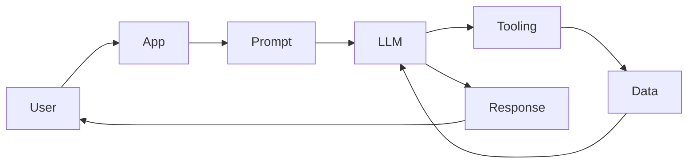
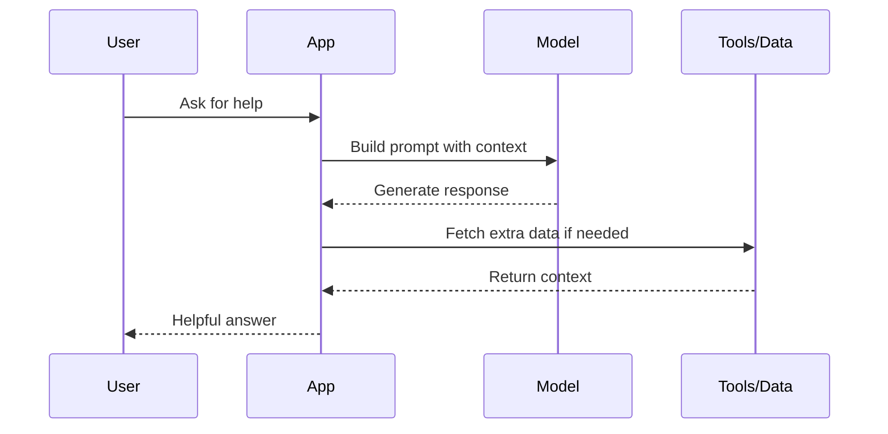
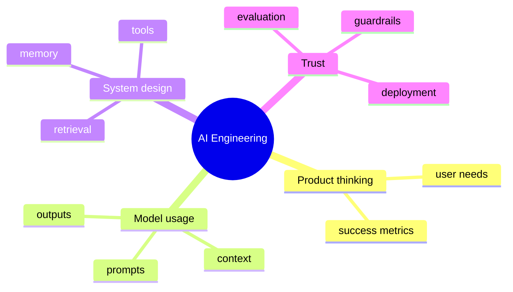

# Day 1 - Introduction to AI Engineering

[Next: Day 2 - How Large Language Models Work](../day_02/day_02_how_large_language_models_work.md)

## Introduction
Welcome to the course.

AI engineering is the practice of building software that uses AI models in reliable, useful, and testable ways. A good AI engineer does not only call a model API. They design prompts, control data flow, manage cost, add memory or retrieval when needed, and ship an experience that works for real users.


This course starts here because every later topic depends on this idea: AI capability is only valuable when it is shaped into a product that solves a real problem.

## Learning Objectives
By the end of this day, you should be able to:

- explain what AI engineering is and how it differs from machine learning and data science
- describe the basic parts of an AI application
- identify where an LLM fits into a software system
- understand why product thinking matters in AI work
- explain why prompts, retrieval, memory, tools, and evaluation belong to the application layer
- build a tiny AI-powered app concept from first principles

## Prerequisites
You do not need advanced AI knowledge for this lesson.

You should be comfortable with:

- basic programming ideas
- simple web or application concepts
- the idea that software takes input and returns output

If you are brand new to AI, that is fine. This lesson is designed to start from the beginning.

## Big Picture
AI engineering sits between model research and product development.

Research asks, "How do we make the model better?" AI engineering asks, "How do we make the model useful, safe, and dependable for a user?"

The core idea is simple:

- users bring a goal
- your app prepares context
- the model reasons over that context
- tools, retrieval, and rules improve the answer
- the app returns something helpful

A common mistake is to think the model is the whole product. In practice, the model is only one component. The surrounding software determines whether the experience is fast, affordable, accurate, and safe.



## Why AI Engineering Exists
AI models are powerful, but raw capability is not enough.

An AI application still needs to answer questions like:

- What should the model see?
- What should the model not see?
- When should the model use tools?
- How do we know the answer is good?
- What happens when the model is wrong?

AI engineering exists to answer those product and system questions.

## AI Engineering Versus Related Fields

### AI Engineering and Machine Learning
Machine learning often focuses on training models from data.

AI engineering focuses on using existing models inside software systems. The model may be trained by someone else, but you still need to build the experience around it.

### AI Engineering and Data Science
Data science often focuses on analysis, insight, and decision support.

AI engineering focuses on operationalizing AI behavior in a product. That means prompts, retrieval, APIs, tools, safety, and deployment matter a lot.

### AI Engineering and Software Engineering
Software engineering is the broader discipline of building reliable software.

AI engineering is a specialization inside it. You still need strong software fundamentals, but you also need to understand model behavior and uncertainty.

## Deep Theory

### What is the application layer?
The application layer is everything around the model that makes the experience useful.

It can include:

- prompt construction
- input validation
- retrieval of context
- tool calls
- memory management
- output formatting
- evaluation and safety checks

### Why the application layer matters
Without the application layer, even a strong model can produce a weak product.

For example:

- a model may answer correctly but without useful formatting
- a model may know the right idea but miss the user’s real intent
- a model may need external context to stay accurate
- a model may need guardrails to avoid unsafe behavior

### Advantages
- turns model capability into usable software
- makes systems easier to evaluate and improve
- supports real users instead of isolated demos
- creates room for safety, retrieval, and automation

### Limitations
- adds complexity beyond calling an API
- requires product judgment, not just technical skill
- must balance helpfulness, latency, cost, and safety

### Alternatives
- model-only demos, which are easy but fragile
- traditional software with no AI, which may be better for simple tasks
- batch offline analysis instead of interactive AI, when the problem does not need chat or generation

### When should you use AI engineering?
Use AI engineering when:

- the task involves language, reasoning, summarization, or classification
- the model can help but needs context or control
- you want a user-facing experience with AI behavior

### When should you not force AI into a problem?
Avoid AI when:

- a simple deterministic rule solves the problem
- correctness must be exact and explainable at all times
- the task is too small to justify the cost or risk

## Visual Learning

### AI System Flow


### Mental Model Map


## Code Walkthrough

The examples below show how a small AI feature is shaped by application code.

### Python Example
```python
from dataclasses import dataclass


@dataclass
class AIAppRequest:
    user_message: str
    context: str


def build_prompt(request: AIAppRequest) -> str:
    return (
        "You are a helpful assistant. "
        f"Use this context: {request.context}\n"
        f"Answer this question: {request.user_message}"
    )


request = AIAppRequest(
    user_message="What is AI engineering?",
    context="Teaching a beginner how AI apps are built.",
)
print(build_prompt(request))
```

#### Code Explanation
- `AIAppRequest` bundles user input and supporting context.
- `build_prompt` turns application state into a model prompt.
- the prompt is explicit so the model knows what role to play.

### TypeScript Example
```typescript
interface AIAppRequest {
  userMessage: string;
  context: string;
}

function buildPrompt(request: AIAppRequest): string {
  return `You are a helpful assistant. Use this context: ${request.context}\nAnswer this question: ${request.userMessage}`;
}

console.log(
  buildPrompt({
    userMessage: 'What is AI engineering?',
    context: 'Teaching a beginner how AI apps are built.',
  })
);
```

#### Code Explanation
- the TypeScript version expresses the same workflow with a typed interface.
- the application prepares structure before the model sees anything.

### Tiny Product Thinking Example
```python
problem = "Students need a faster way to understand lessons"
solution = "An AI study buddy that explains lessons in simpler language"

print(problem)
print(solution)
```

#### Code Explanation
- the problem statement comes before the tool choice.
- the solution is tied to a specific user need.

## Practical Examples

### Beginner Example: Study Buddy
A study buddy can help a learner explain concepts in simpler language, summarize notes, and answer practice questions.

Why this is a good AI use case:

- language matters
- context matters
- the output can be helpful without being perfect

### Intermediate Example: Support Draft Assistant
A support draft assistant can read a ticket and draft a response for a human reviewer.

Why this is stronger than a simple chatbot:

- it has a clear business workflow
- it can use context from the ticket
- it supports human decision-making instead of replacing it

### Professional Example: Knowledge Assistant
A knowledge assistant can search internal documents, retrieve relevant passages, and answer with citations.

Why professionals use this pattern:

- it grounds answers in data
- it reduces hallucination risk
- it creates a repeatable user experience

### Real-World Company Example
Teams often start with a narrow internal assistant before building a customer-facing product. That is because internal use cases are easier to control, measure, and improve.

## Best Practices
- start with a user problem, not a model choice
- keep prompts small and explicit
- log inputs and outputs for debugging
- measure quality with examples, not intuition alone
- design for fallback behavior when the model is uncertain
- keep the first version narrow and explainable

## Common Mistakes
- treating the model as magic
- skipping evaluation because the demo looks good
- sending too much irrelevant context
- ignoring latency and cost
- forgetting that users need clear, predictable behavior
- starting with architecture instead of the user problem

### Debugging Strategy
If an AI feature feels vague, ask these questions:

1. Who is the user?
2. What problem are they trying to solve?
3. What part is done by the model?
4. What part is done by application code?
5. How will you know the feature works?

## Performance
Even at the beginning of the course, it helps to think about performance.

### Latency
If the model or app is slow, the experience will feel worse.

### Cost
Every request may cost money, so usage should be intentional.

### Reliability
The app should fail gracefully when the model or supporting systems are unavailable.

## Security
Security starts early.

- do not hardcode secrets
- do not trust user input blindly
- do not assume the model will protect sensitive information
- keep future retrieval and tool use in mind even in simple prototypes

## Evaluation
You do not need a complex benchmark on Day 1, but you do need a way to tell if the idea works.

### What to measure
- does the feature solve the user problem?
- is the output understandable?
- is the behavior consistent enough to trust?
- is the cost reasonable for the value it provides?

## Exercises

### Easy
1. Define AI engineering in one paragraph.
2. Name one thing the model is not responsible for.
3. Identify one reason product thinking matters.
4. Describe one user problem that AI might help solve.

### Medium
5. Draw a simple AI app flow from user input to response.
6. Compare AI engineering with machine learning.
7. Explain why context matters to model behavior.
8. Describe one reason a model-only demo can fail.

### Hard
9. List three ways an AI app can fail even if the model is strong.
10. Explain why evaluation belongs in the application process.
11. Describe how retrieval or tools might improve the answer.
12. Explain why a fallback path is important.

### Challenge
13. Design a small AI feature for a productivity app and explain why AI is needed.
14. Write a one-paragraph product brief for a beginner AI app.
15. Describe what you would log to debug a prompt-based feature.
16. Explain when a traditional software solution would be better than AI.

## Mini Project
Create a one-page concept for an AI study buddy.

### Required Sections
- user problem
- model role
- input context
- output format
- fallback behavior
- one success metric

### Suggested structure
```text
study-buddy/
├── README.md
└── concept.md
```

### Project Steps
1. identify the learner you are helping
2. explain the problem in one sentence
3. define what the model should do
4. define what context the app will provide
5. describe what the output should look like
6. add one fallback when the model is uncertain

### What You Learn
- how to turn a vague AI idea into a concrete product
- how to describe the model’s role clearly
- how to separate user value from technical implementation

## Summary
AI engineering is about turning model capability into useful products.

The main job is not only generating text, but shaping the whole system around the model so it behaves well in the real world. In the rest of the course, you will learn how to build that system piece by piece.

[Next: Day 2 - How Large Language Models Work](../day_02/day_02_how_large_language_models_work.md)

## Additional Resources
- https://platform.openai.com/docs
- https://docs.anthropic.com/
- https://python.langchain.com/docs/
- https://www.deeplearning.ai/
