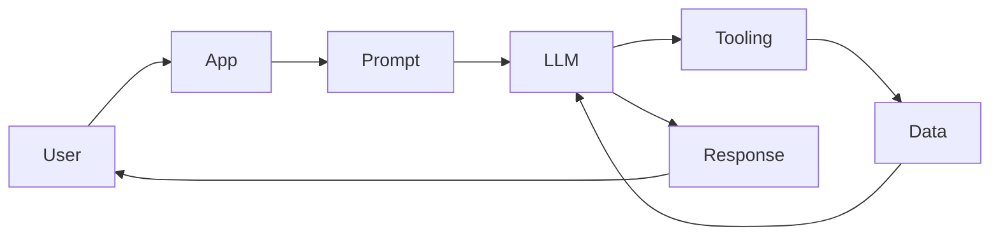

# Day 1 - Introduction to AI Engineering

[Next: Day 2 - How Large Language Models Work](../day_02/day_02_how_large_language_models_work.md)

## Introduction
AI engineering is the practice of building software that uses AI models in reliable, useful, and testable ways. A good AI engineer does not only call a model API. They design prompts, control data flow, manage cost, add memory or retrieval when needed, and ship an experience that works for real users.


## Learning Objectives
By the end of this day, you should be able to:

- explain what AI engineering is and how it differs from machine learning and data science
- describe the basic parts of an AI application
- identify where an LLM fits into a software system
- understand why product thinking matters in AI work
- build a tiny AI-powered app concept from first principles

## Theory
AI engineering sits between model research and product development. Research asks, "How do we make the model better?" AI engineering asks, "How do we make the model useful, safe, and dependable for a user?"

The core idea is simple:

- users bring a goal
- your app prepares context
- the model reasons over that context
- tools, retrieval, and rules improve the answer
- the app returns something helpful

A common mistake is to think the model is the whole product. In practice, the model is only one component. The surrounding software determines whether the experience is fast, affordable, accurate, and safe.

### Visual Diagram


## Code Examples

### Python
```python
from dataclasses import dataclass

@dataclass
class AIAppRequest:
    user_message: str
    context: str


def build_prompt(request: AIAppRequest) -> str:
    return (
        "You are a helpful assistant. "
        f"Use this context: {request.context}\n"
        f"Answer this question: {request.user_message}"
    )


request = AIAppRequest(
    user_message="What is AI engineering?",
    context="Teaching a beginner how AI apps are built.",
)
print(build_prompt(request))
```

### TypeScript
```typescript
interface AIAppRequest {
  userMessage: string;
  context: string;
}

function buildPrompt(request: AIAppRequest): string {
  return `You are a helpful assistant. Use this context: ${request.context}\nAnswer this question: ${request.userMessage}`;
}

console.log(
  buildPrompt({
    userMessage: 'What is AI engineering?',
    context: 'Teaching a beginner how AI apps are built.',
  })
);
```

## Best Practices
- start with a user problem, not a model choice
- keep prompts small and explicit
- log inputs and outputs for debugging
- measure quality with examples, not intuition alone
- design for fallback behavior when the model is uncertain

## Common Mistakes
- treating the model as magic
- skipping evaluation because the demo looks good
- sending too much irrelevant context
- ignoring latency and cost
- forgetting that users need clear, predictable behavior

## Exercises
- Easy: Define AI engineering in one paragraph.
- Medium: Draw a simple AI app flow from user input to response.
- Hard: List three ways an AI app can fail even if the model is strong.
- Challenge: Design a small AI feature for a productivity app and explain why AI is needed.

## Mini Project
Create a one-page concept for an AI study buddy. Include the user problem, the model role, the input context, the output format, and one fallback when the model is uncertain.

## Summary
AI engineering is about turning model capability into useful products. The main job is not only generating text, but shaping the whole system around the model so it behaves well in the real world.

[Next: Day 2 - How Large Language Models Work](../day_02/day_02_how_large_language_models_work.md)

## Additional Resources
- https://platform.openai.com/docs
- https://docs.anthropic.com/
- https://python.langchain.com/docs/
