# Day 1 - Introduction to AI Engineering

[Previous: Day 0 - Getting Started](../day_00/day_00_getting_started.md) | [Next: Day 2 - How Large Language Models Work](../day_02/day_02_how_large_language_models_work.md)

## Introduction

Welcome to Day 1. If you completed [Day 0](../day_00/day_00_getting_started.md), you already have your tools, your learning path, and your capstone folder open. Today we answer the question that everything else in this course builds on: **what is AI engineering, and why does it exist as its own discipline?**

Here is a Feynman-style explanation. Imagine you have a brilliant friend who has read almost every book in the world. They can explain ideas beautifully, draft emails, summarize articles, and brainstorm plans. But they also sometimes invent facts, forget what you told them five minutes ago, and have no idea what is in your company's internal wiki unless you hand them the pages. **AI engineering is the job of building the room, the rules, the notebooks, and the guardrails around that friend** so real people can rely on them in a product.

A language model is not a product. A chat window is not a product either. A product is a complete experience: a student gets a clearer explanation of a lecture, a support agent gets a draft they can edit, a team gets answers grounded in their own documents. The model provides capability. **Your application provides usefulness, safety, speed, and trust.**

This course follows one capstone product—**StudySpark**—from idea to deployable assistant. You will update [`projects/CAPSTONE.md`](../../projects/CAPSTONE.md) after every lesson and eventually implement code in [`projects/studyspark/`](../../projects/studyspark/). Day 1 is where you define *why* StudySpark should exist and *what problem* it solves before you write a single API call.


Every later topic—prompts, tokens, APIs, retrieval, agents, guardrails—assumes today's core idea: **AI capability becomes valuable only when shaped into software that solves a real problem for a real user.**

## Learning Objectives

By the end of this day, you should be able to:

- explain what AI engineering is and how it differs from machine learning, data science, and traditional software engineering
- describe the basic parts of an AI application using correct vocabulary
- identify where a large language model (LLM) fits inside a software system—and where it does *not* belong alone
- explain why product thinking (user problem, success metrics, fallbacks) matters as much as model choice
- list application-layer responsibilities: prompts, retrieval, memory, tools, evaluation, and guardrails
- sketch a one-page product concept for an AI study assistant
- connect Day 1 ideas to the StudySpark capstone tracker and Week 1 learning path in [SYLLABUS.md](../../SYLLABUS.md)

## How to Use This Lesson

This lesson is designed for **all skill levels**. Pick one path and follow it consistently.

| Level | Suggested approach | Time |
| --- | --- | --- |
| **Beginner** | Read Introduction → Big Picture → Deep Theory → trace one code example → Easy exercises | 4–6 hours |
| **Intermediate** | Skim objectives → Visual Learning → Code Walkthrough → Medium/Hard exercises → Mini project | 2–4 hours |
| **Advanced** | Deep Theory tradeoffs → Hard/Challenge exercises → extend mini project → capstone slice | 1–3 hours |

### Apply Today
Complete at least one item before moving to the next day:
- [ ] Trace one code example in **Python or TypeScript** (one language is enough)
- [ ] Complete exercises for your level (see Exercises section)
- [ ] Update [`projects/CAPSTONE.md`](../../projects/CAPSTONE.md) with today's capstone item
- [ ] Write one sentence in your own words explaining today's main idea.

> **Stuck?** Re-read Big Picture, review Prerequisites, or see [SYLLABUS.md](../../SYLLABUS.md) for path guidance.

## Prerequisites

You do not need prior AI experience for this lesson. If you are brand new, start with [Day 0](../day_00/day_00_getting_started.md) for environment setup and path selection.

You should be comfortable with:

- basic programming ideas (variables, functions, simple data structures)
- the idea that software takes input and returns output
- reading short code examples in Python or TypeScript

No API keys are required today. Every code example runs locally and models *application logic*, not live model calls.

## Big Picture

AI engineering sits between **model research** and **product development**.

- Research asks: *How do we train a better model?*
- Product asks: *What should the user experience feel like?*
- AI engineering asks: *How do we make an existing model useful, safe, affordable, and dependable inside real software?*

The core loop of almost every AI application looks like this:

1. A user arrives with a goal.
2. Your app validates input and gathers context (notes, history, retrieved documents).
3. Your app builds a prompt or message list from that context.
4. The model generates a candidate response.
5. Your app validates, formats, logs, and optionally retries or escalates.
6. The user receives something helpful—or a clear fallback when AI is not the right tool.

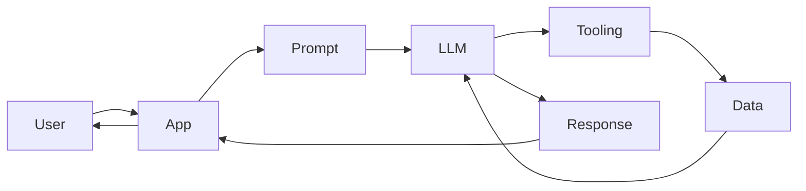

A common beginner mistake is to treat the model as the entire product. In practice, the model is one component—often 10–30% of the engineering work. The surrounding **application layer** determines whether users trust the feature.

### StudySpark preview

For the rest of this course, StudySpark is our running example: a study assistant that helps learners understand course material, summarize notes, and practice with quizzes. On Day 1 you only define the *product*; later days add prompts, APIs, retrieval, and deployment.

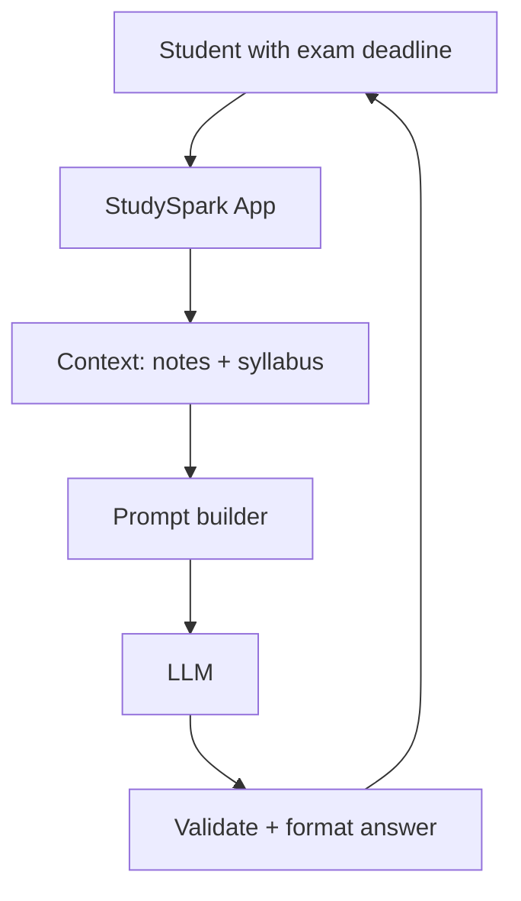

## Why AI Engineering Exists

Raw model capability is not enough for production software. Even a strong model leaves critical questions unanswered:

| Question | Who answers it |
| --- | --- |
| What should the model see? | Application (context assembly) |
| What must it never see? | Application (privacy, redaction) |
| When should it call a calculator or search tool? | Application (tool routing) |
| How do we know the answer is good? | Application (evaluation) |
| What happens when the model is wrong? | Application (fallbacks, human review) |
| How much does each request cost? | Application (budgets, caching) |

AI engineering exists because **models are probabilistic components inside deterministic systems**. Your bank app cannot say "the model felt confident." Your study app cannot silently invent quiz answers. Someone must design the system around uncertainty.

## AI Engineering Versus Related Fields

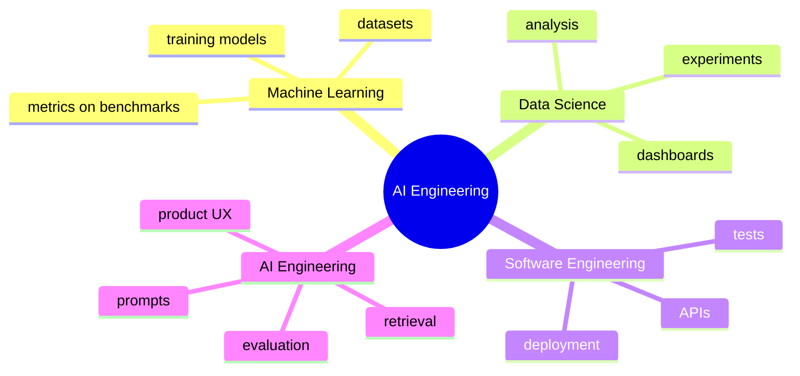

### AI Engineering and Machine Learning

Machine learning (ML) often focuses on **training** models: collecting data, choosing architectures, running experiments, and improving weights.

AI engineering focuses on **using** models that already exist—OpenAI, Anthropic, Google, open-weight models, or internal fine-tunes. You may never train a model in your job, but you will always shape how it behaves in software.

| ML engineer | AI engineer |
| --- | --- |
| Improves model weights | Improves user outcomes |
| Cares about loss curves | Cares about latency, cost, trust |
| Owns training pipelines | Owns prompts, retrieval, tools, evals |

### AI Engineering and Data Science

Data science explores data to produce insight: forecasts, segments, experiment analysis.

AI engineering **operationalizes** language and reasoning behavior in a product. Prompts, APIs, guardrails, and deployment matter daily.

### AI Engineering and Software Engineering

Software engineering is the broader discipline of building reliable systems. AI engineering is a specialization within it. You still need version control, tests, logging, and security—but you also design for **non-deterministic outputs** and **user-visible uncertainty**.

## Deep Theory

### What is the application layer?

The **application layer** is everything around the model that turns capability into a product feature.

It typically includes:

- **Prompt construction** — roles, instructions, examples, output format
- **Input validation** — length limits, profanity filters, schema checks
- **Retrieval** — fetching relevant documents (Week 3)
- **Memory** — short-term chat history and long-term user preferences (Week 3)
- **Tool calls** — calculators, search, database queries (Week 2)
- **Output formatting** — JSON, markdown, UI cards
- **Evaluation** — automated checks and human review samples (Week 4)
- **Guardrails** — refusals, PII redaction, injection defenses (Week 4)

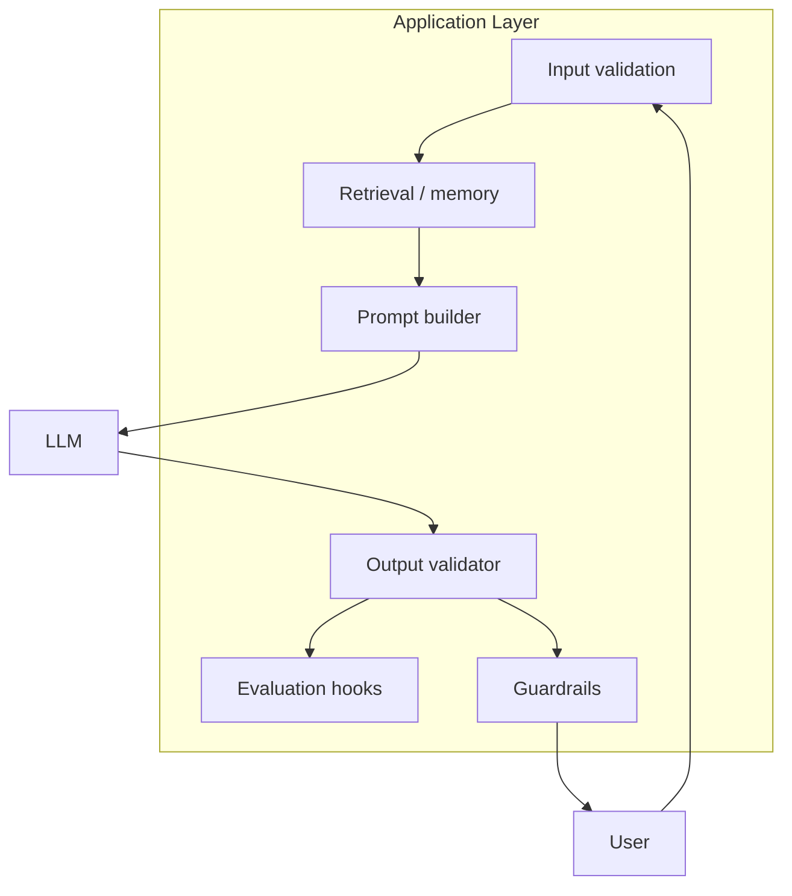

Without the application layer, even GPT-class models produce weak products: wrong tone, missing citations, no fallback when the API fails, no logging when users complain.

### Why the application layer matters — a concrete story

Suppose StudySpark receives: *"Explain polymorphism for my Java exam tomorrow."*

A model-only demo sends that string to the API and prints whatever comes back. An engineered application might:

1. Detect the subject (Java) and exam urgency.
2. Retrieve the student's uploaded lecture notes on OOP.
3. Instruct the model to use three bullet points and one code example under 15 lines.
4. Validate that the output mentions Java, not Python.
5. Log latency and token usage.
6. If the API times out, show a cached summary or a "try again" message.

Same model. Completely different user value.

### Advantages of AI engineering discipline

- Turns model capability into **repeatable features**, not one-off demos
- Makes quality **measurable** instead of "vibes-based"
- Enables **safety and privacy** controls appropriate to your domain
- Supports **cost and latency** budgets that products require

### Limitations

- Adds complexity beyond a single API call
- Requires product judgment, not only coding skill
- Forces tradeoffs among helpfulness, speed, cost, and safety
- Never fully eliminates model mistakes—you design for them

### Alternatives to building AI features

| Approach | When it fits |
| --- | --- |
| Model-only demo | Hackathons, early exploration |
| Traditional software (no AI) | Exact logic, forms, calculators |
| Search without generation | User needs links, not prose |
| Human-in-the-loop only | High-stakes decisions |
| Batch offline analysis | No interactive chat needed |

### When should you use AI engineering?

Use AI when:

- the task involves language, reasoning, summarization, classification, or drafting
- flexibility and natural interaction matter
- perfect correctness is not required, but helpfulness is—or correctness can be verified

### When should you *not* force AI?

Avoid AI when:

- a simple rule or SQL query solves the problem
- correctness must be exact and legally auditable every time
- the task is too small to justify cost, latency, and failure modes
- users need guaranteed reproducibility (same input → same output)

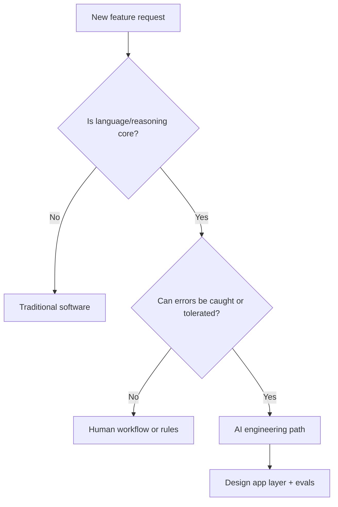

## Historical Background

AI engineering as a job title exploded after **hosted LLM APIs** made powerful models accessible without training your own. The story helps you see why the application layer dominates today.

### Before ChatGPT: ML in production was narrow

For years, "AI in production" meant recommendation systems, fraud scores, or computer vision pipelines. Teams needed ML engineers to train models, data engineers to feed features, and software engineers to serve predictions. Each use case was **custom-trained** and **narrow**.

### The GPT-3 inflection (2020)

OpenAI's API let developers send text and receive completions. Startups could prototype language features in hours. But early apps were fragile: no standard roles, little retrieval, minimal evaluation. Many were demos, not products.

### ChatGPT and the application explosion (2022–2023)

ChatGPT showed millions of users what conversational AI felt like. Within months, companies raced to embed similar experiences. The bottleneck shifted from *"can we access a model?"* to *"can we make it reliable in our workflow?"* Job postings for **prompt engineer**, **AI engineer**, and **LLM application developer** surged.

### Today: the stack matured

Production teams now expect: retrieval (RAG), tool use, structured outputs, eval suites, guardrails, multi-provider abstractions, and observability. That stack is **AI engineering**—not research, not a single prompt in a notebook.

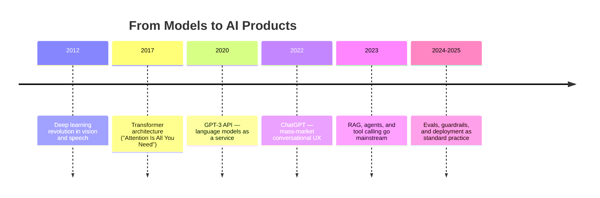

### Company snapshots

| Company | AI engineering in practice |
| --- | --- |
| **OpenAI** | Provides models and APIs; product teams still build apps on top |
| **Google** | Gemini powers Search, Docs, and Cloud; each product has its own retrieval and safety layer |
| **Microsoft** | Copilot wraps models with M365 context, permissions, and enterprise policies |
| **Notion / Stripe / Intercom** | Internal docs and support tickets feed retrieval; humans review high-risk outputs |
| **Khan Academy (Khanmigo)** | Tutoring prompts, safety rules, and pedagogical guardrails—not raw chat |

You do not need to work at these companies to use the same patterns. StudySpark is your miniature version.

## Visual Learning

### End-to-end sequence

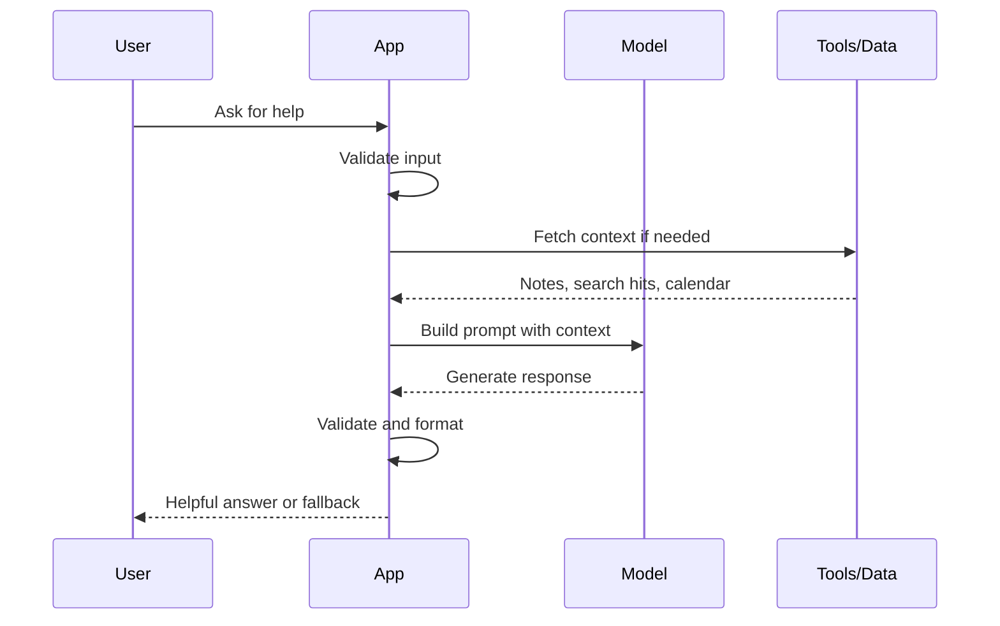

### Responsibility split

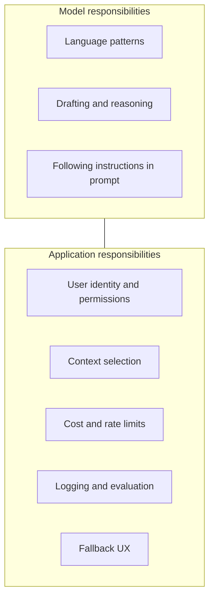

### Support draft workflow (intermediate pattern)

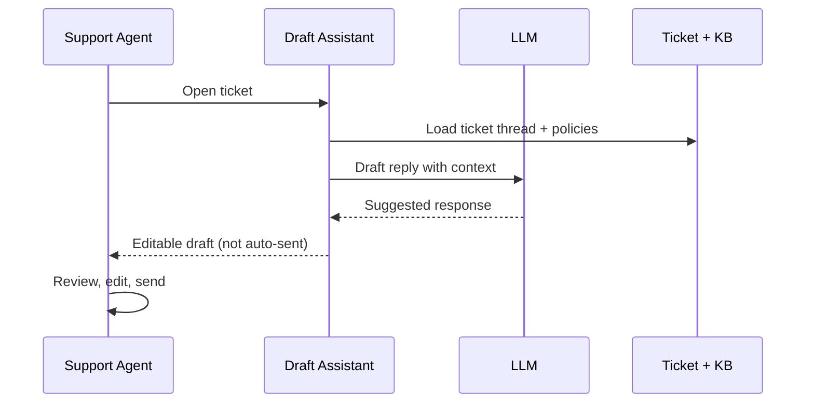

### Debugging mental model

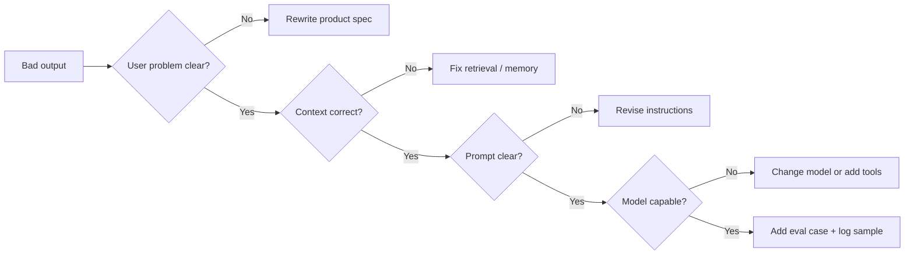

## Code Walkthrough

These examples run **without API keys**. They model how application code shapes AI behavior—the same patterns you will use in [`projects/studyspark/`](../../projects/studyspark/) starting Week 2.

### Example 1: Python — Bundle user input and context

```python
from dataclasses import dataclass


@dataclass
class AIAppRequest:
    user_message: str
    context: str


def build_prompt(request: AIAppRequest) -> str:
    return (
        "You are a helpful study assistant. "
        f"Use this context: {request.context}\n"
        f"Answer this question: {request.user_message}"
    )


request = AIAppRequest(
    user_message="What is AI engineering?",
    context="Teaching a beginner how AI apps are built.",
)
print(build_prompt(request))
```

#### Code Explanation
- `AIAppRequest` bundles everything the app knows before calling a model.
- `build_prompt` is **application code**—you control it, test it, and version it.
- Separating `user_message` from `context` prevents accidentally mixing instructions with data.

### Example 2: TypeScript — Same pattern with types

```typescript
interface AIAppRequest {
  userMessage: string;
  context: string;
}

function buildPrompt(request: AIAppRequest): string {
  return [
    'You are a helpful study assistant.',
    `Use this context: ${request.context}`,
    `Answer this question: ${request.userMessage}`,
  ].join('\n');
}

console.log(
  buildPrompt({
    userMessage: 'What is AI engineering?',
    context: 'Teaching a beginner how AI apps are built.',
  })
);
```

#### Code Explanation
- TypeScript interfaces document the contract between UI and prompt builder.
- Joining with `\n` keeps the prompt readable in logs.

### Example 3: Python — Problem before solution

```python
problem = "Students reread long lectures but still feel confused before exams"
solution = "StudySpark explains concepts in simpler language using their own notes"
non_goal = "Replace professors or guarantee exam scores"

print("Problem:", problem)
print("Solution:", solution)
print("Non-goal:", non_goal)
```

#### Code Explanation
- Strong AI products start with a **user problem**, not "use GPT."
- `non_goal` clarifies scope—critical for safety and expectations.

### Example 4: TypeScript — Problem before solution

```typescript
const productSpec = {
  problem: 'Students reread long lectures but still feel confused before exams',
  solution: 'StudySpark explains concepts using their own notes',
  nonGoal: 'Replace professors or guarantee exam scores',
};

console.log(productSpec);
```

#### Code Explanation
- A plain object can live in your capstone README or `CAPSTONE.md`.
- `nonGoal` prevents feature creep during later weeks.

### Example 5: Python — Application layer components

```python
from dataclasses import dataclass, field
from typing import Any


@dataclass
class ApplicationLayer:
    prompt: str
    retrieved_docs: list[str] = field(default_factory=list)
    tools_enabled: list[str] = field(default_factory=list)
    max_output_tokens: int = 500


def assemble_layer(user_question: str, notes: list[str]) -> ApplicationLayer:
    return ApplicationLayer(
        prompt=f"Answer briefly: {user_question}",
        retrieved_docs=notes[:3],
        tools_enabled=["calculator"],
        max_output_tokens=300,
    )


layer = assemble_layer("What is recursion?", ["Recursion is when a function calls itself."])
print(layer)
```

#### Code Explanation
- `ApplicationLayer` makes implicit demo code explicit.
- Truncating `notes[:3]` is a simple context budget—Day 3 covers tokens formally.

### Example 6: TypeScript — Application layer components

```typescript
type ApplicationLayer = {
  prompt: string;
  retrievedDocs: string[];
  toolsEnabled: string[];
  maxOutputTokens: number;
};

function assembleLayer(userQuestion: string, notes: string[]): ApplicationLayer {
  return {
    prompt: `Answer briefly: ${userQuestion}`,
    retrievedDocs: notes.slice(0, 3),
    toolsEnabled: ['calculator'],
    maxOutputTokens: 300,
  };
}

console.log(assembleLayer('What is recursion?', ['Recursion is when a function calls itself.']));
```

#### Code Explanation
- `slice(0, 3)` mirrors the Python context limit.
- Naming `toolsEnabled` prepares you for Week 2 tool calling.

### Example 7: Python — Fallback when model is uncertain

```python
def respond(user_question: str, model_confidence: float) -> str:
    if model_confidence < 0.4:
        return (
            "I'm not confident enough to answer that. "
            "Try rephrasing or check your course notes section on this topic."
        )
    return f"Here is a study explanation for: {user_question}"


print(respond("Explain entropy in thermodynamics", 0.25))
```

#### Code Explanation
- Production apps need a **fallback path** when confidence is low or the API fails.
- Even a placeholder confidence score teaches the pattern; later you use evals and logprobs.

### Example 8: TypeScript — Fallback behavior

```typescript
function respond(userQuestion: string, modelConfidence: number): string {
  if (modelConfidence < 0.4) {
    return "I'm not confident enough to answer that. Try rephrasing or review your notes.";
  }
  return `Here is a study explanation for: ${userQuestion}`;
}

console.log(respond('Explain entropy in thermodynamics', 0.25));
```

#### Code Explanation
- Same UX rule in both languages helps full-stack teams.
- Fallback copy should be written by product thinking, not left to the model.

### Example 9: Python — Logging for debugging

```python
import json
from datetime import datetime, timezone


def log_request(event: dict) -> None:
    record = {
        "timestamp": datetime.now(timezone.utc).isoformat(),
        **event,
    }
    print(json.dumps(record))


log_request({
    "feature": "studyspark_explain",
    "user_question_len": 42,
    "context_docs": 2,
    "model": "not_called_yet",
})
```

#### Code Explanation
- Logging inputs and metadata makes prompt debugging possible.
- Never log secrets or full private notes in production without policy review.

### Example 10: TypeScript — Logging for debugging

```typescript
function logRequest(event: Record<string, unknown>): void {
  const record = {
    timestamp: new Date().toISOString(),
    ...event,
  };
  console.log(JSON.stringify(record));
}

logRequest({
  feature: 'studyspark_explain',
  userQuestionLen: 42,
  contextDocs: 2,
  model: 'not_called_yet',
});
```

#### Code Explanation
- Structured JSON logs feed observability tools later.
- `feature` tags help filter StudySpark events in a multi-feature app.

### Example 11: Python — Success metrics as code

```python
success_criteria = {
    "understandability": "User rates explanation >= 4/5",
    "latency_p95_seconds": 8,
    "cost_per_session_usd": 0.05,
    "fallback_rate_max": 0.15,
}

def session_ok(metrics: dict) -> bool:
    return (
        metrics["rating"] >= 4
        and metrics["latency"] <= success_criteria["latency_p95_seconds"]
        and metrics["cost"] <= success_criteria["cost_per_session_usd"]
    )


print(session_ok({"rating": 5, "latency": 3.2, "cost": 0.02}))
```

#### Code Explanation
- Metrics turn "good enough" into something testable.
- StudySpark's Day 1 capstone asks for three success criteria—this shows how they might look in code later.

### Example 12: TypeScript — Validate output before showing UI

```typescript
type StudyAnswer = { text: string; subject: string };

function validateAnswer(raw: string, expectedSubject: string): StudyAnswer | null {
  if (raw.trim().length < 20) return null;
  if (!raw.toLowerCase().includes(expectedSubject.toLowerCase())) return null;
  return { text: raw, subject: expectedSubject };
}

const candidate = 'Polymorphism lets objects take many forms in Java.';
console.log(validateAnswer(candidate, 'Java'));
```

#### Code Explanation
- The app validates model output; never trust raw text blindly.
- Returning `null` triggers fallback UI instead of showing garbage.

## Practical Examples

### Beginner Example: StudySpark study buddy

A student uploads lecture notes and asks, *"Explain this like I'm new to programming."* StudySpark retrieves the relevant note chunk, instructs the model to use short sentences, and returns three bullet points.

Why AI helps: language adaptation and summarization. Why engineering matters: note retrieval, length limits, and a fallback if notes are empty.

### Intermediate Example: Support draft assistant

A support agent opens a ticket. The app loads thread history and policy docs, drafts a reply, and presents an **editable** draft—never auto-sending to customers.

Why stronger than a chatbot: clear workflow, human review, measurable time-saved metric.

### Advanced Example: Multi-step research assistant

An internal tool plans sub-questions, searches approved sources, synthesizes an answer with citations, and runs a policy check before display.

Why engineering-heavy: orchestration, retrieval, tool loops, evaluation gates.

### Production Example: Observability from day one

Production features log: request id, model name, token counts, latency, validation pass/fail, and user feedback thumbs. On-call engineers replay failing prompts without guessing.

StudySpark will grow into this pattern by Week 4.

### Company Example: Microsoft Copilot vs raw ChatGPT

Copilot adds M365 permissions (only docs you can access), tenant policies, and audit logs. The model is similar; the **application layer** is why enterprises trust it.

| Layer | Raw chat | Enterprise copilot |
| --- | --- | --- |
| Identity | Anonymous or personal | Org SSO + permissions |
| Context | Whatever user pastes | Approved files only |
| Logging | Minimal | Audit trail |
| Policy | Generic safety | Company rules |

## Comparison Tables

| Discipline | Primary question | Typical output |
| --- | --- | --- |
| ML engineering | How do we train a better model? | Weights, benchmarks |
| Data science | What does the data say? | Reports, insights |
| Software engineering | How do we ship reliable code? | Services, apps |
| AI engineering | How do we ship reliable AI features? | Products users trust |

| Component | Owned by app? | Owned by model? |
| --- | --- | --- |
| Prompt and context | Yes | No |
| Next-word prediction | No | Yes |
| User authentication | Yes | No |
| Factual grounding | App (retrieval/tools) | Partially from training |
| Cost tracking | Yes | No |

## Best Practices

- Start with a **user problem** and success metric, not a model name.
- Keep prompts **small, explicit, and testable**.
- Separate **instructions**, **context**, and **user input** in code structures.
- Log enough to reproduce failures without logging secrets.
- Design **fallbacks** for API errors, empty retrieval, and low-quality outputs.
- Ship a **narrow first version** (one workflow done well).
- Update [`projects/CAPSTONE.md`](../../projects/CAPSTONE.md) daily so design decisions compound.

## Common Mistakes

- Treating the model as magic or as the whole product
- Skipping evaluation because the demo "looks smart"
- Dumping entire documents into context with no budget
- Ignoring latency and cost until launch week
- Letting the model auto-send emails, refunds, or grades without review
- Starting with microservices before validating one user workflow

### Debugging Strategy

When an AI feature feels vague, ask:

1. Who is the user, and what decision are they trying to make?
2. What would success look like in their words?
3. What does the app supply vs what the model generates?
4. What happens on failure—silent bad output or clear fallback?
5. Can you reproduce the issue with a logged prompt?

## Performance

Even on Day 1, think about performance budgets:

| Dimension | Why it matters early |
| --- | --- |
| **Latency** | Students abandon slow tutors; support agents need drafts in seconds |
| **Cost** | Every token costs money at scale |
| **Reliability** | APIs fail; apps should degrade gracefully |
| **Throughput** | Exam season spikes traffic—design for queues and limits |

## Security

Security starts before your first API key:

- Never hardcode secrets; use environment variables (see Day 0).
- Treat user input as untrusted—**prompt injection** arrives in Week 4, but habits start now.
- Do not send private data to models without policy review and redaction.
- Plan permission boundaries before connecting StudySpark to real notes.

## Evaluation

You do not need a benchmark suite on Day 1. You need **clear success criteria**:

- Does the feature solve the stated user problem?
- Is output understandable to the target user?
- Is behavior consistent enough on similar inputs?
- Is cost acceptable for the value delivered?

Write three criteria in `CAPSTONE.md` today—you will automate checks later.

## Exercises

### Easy
1. Define AI engineering in one paragraph without using the word "magic."
2. Name three things the **application** owns that the **model** does not.
3. Explain why product thinking matters for AI features.
4. Describe one user problem StudySpark could solve.
5. List two reasons a model-only demo fails in production.

### Medium
6. Draw (on paper or Mermaid) a flow from user input to formatted response.
7. Compare AI engineering with machine learning in a table of three rows.
8. Explain why separating `context` from `user_message` in code is useful.
9. Give an example where traditional software beats AI.
10. Write three non-goals for StudySpark (what it will *not* do).

### Hard
11. List five ways an AI app can fail even if the base model is strong.
12. Explain why evaluation belongs in the application layer, not "after launch."
13. Describe how retrieval could improve StudySpark answers (preview of Week 3).
14. Design a fallback message for API timeout during an exam cram session.
15. Argue for or against auto-sending LLM drafts to customers—when is human review required?

### Challenge
16. Write a one-page product brief for StudySpark with problem, user, scope, and metrics.
17. Sketch logging fields for a `studyspark_explain` feature and explain each field.
18. Compare Khan Academy-style tutoring guardrails with a generic chatbot—what extra app layers appear?
19. Design an A/B test: model A vs model B for summarization—what do you measure?
20. Read [SYLLABUS.md](../../SYLLABUS.md) Week 1 and map each day to one StudySpark component.

### Reflection
21. What part of AI engineering excites you most: product, prompts, retrieval, or deployment?
22. What part feels intimidating? Identify one Day 0–7 lesson to review if stuck.
23. Write one sentence you will use to explain your capstone to a friend.
24. What ethical line should StudySpark never cross?
25. How would you explain "application layer" to a non-technical stakeholder?

## Quizzes

### Quiz 1
1. What discipline focuses on using existing models in software products?
2. Name two application-layer responsibilities.
3. Does the model alone know your private notes?
4. What file tracks the StudySpark capstone day by day?

**Answers:** 1. AI engineering  2. Any two of: prompts, retrieval, validation, logging, guardrails, tools  3. No, unless the app provides them  4. `projects/CAPSTONE.md`

### Quiz 2
1. What is the first step in good AI product design?
2. What is a fallback?
3. ML engineers primarily improve ____; AI engineers primarily improve ____.
4. Why log prompts and metadata?

**Answers:** 1. Define the user problem  2. A safe alternative when AI fails or is uncertain  3. models / user outcomes  4. Debugging, evaluation, and cost tracking

### Quiz 3
1. True or false: a larger model removes the need for an application layer.
2. Name one when-*not*-to-use-AI case.
3. What course project do we build cumulatively?
4. Which day covers environment setup?

**Answers:** 1. False  2. Any valid case: exact logic, tiny task, strict audit, etc.  3. StudySpark  4. Day 0

### Quiz 4
1. What is the difference between a demo and a product?
2. Why separate instructions from user data in prompts?
3. What is prompt injection (high level)?
4. What folder will hold StudySpark code?

**Answers:** 1. Products have evals, fallbacks, logging, and defined users; demos optimize for wow  2. Testability, clarity, and safer updates  3. User input that tries to override trusted instructions  4. `projects/studyspark/`

### Quiz 5
1. Name one company pattern where humans stay in the loop.
2. What three metrics might StudySpark track?
3. What syllabus file describes learning paths?
4. What comes tomorrow in Day 2?

**Answers:** 1. Support draft review, legal doc review, etc.  2. Any three: rating, latency, cost, fallback rate  3. `SYLLABUS.md`  4. How large language models work

## Interview Questions

### Conceptual
- What is AI engineering, and how is it different from ML engineering?
- Explain the application layer with a concrete example.
- When would you choose traditional software over an LLM?
- Why are fallbacks necessary in AI products?
- How do product metrics differ from model benchmarks?

### Practical
- Walk through how you would design a study assistant from problem statement to MVP.
- What would you log for an LLM feature on day one of production?
- How do you separate system instructions from user content in code?
- Describe a human-in-the-loop workflow for customer support AI.

### System Design
- Design a high-level architecture for an internal knowledge assistant.
- How would you handle model API outages without losing user trust?
- Where do retrieval, memory, and tools fit in the stack?
- How would you roll out an AI feature gradually (beta, eval gates)?

### Behavioral
- Tell me about a time you scoped a feature down to ship safely.
- How do you communicate model limitations to non-technical stakeholders?

## Mini Project

Create a one-page **StudySpark concept** document.

### Goal
Turn a vague "AI study app" idea into a concrete product spec you can build for 30 days.

### Required Sections
- user problem (one paragraph)
- target user persona
- model role (what the LLM does *not* do alone)
- input context (notes, syllabus, chat history)
- output format (bullets, quiz JSON, etc.)
- fallback behavior
- three success metrics
- three explicit non-goals

### Suggested structure
```text
studyspark/
├── README.md          # link to projects/studyspark later
└── concept.md         # your Day 1 deliverable
```

Or add sections directly to [`projects/CAPSTONE.md`](../../projects/CAPSTONE.md).

### Project Steps
1. Pick one learner persona (e.g., university student, bootcamp student).
2. Write the problem in one sentence a user would say aloud.
3. Define what StudySpark does in three bullet points.
4. Define what the model generates vs what the app validates.
5. Describe fallback UX when notes are missing or the API fails.
6. Add three measurable success criteria.
7. Share your one-sentence summary from **Apply Today**.

### What You Learn
- Product thinking before API calls
- Clear boundaries for model behavior
- A capstone document that every future day extends

## Cumulative Capstone Update

Start your capstone tracker in [`projects/CAPSTONE.md`](../../projects/CAPSTONE.md).

Add today:
- one-paragraph **problem statement** for StudySpark
- **target user** (e.g., university student preparing for exams)
- three **success criteria** for the finished product

Optional: create `concept.md` in [`projects/studyspark/`](../../projects/studyspark/) and link it from the capstone file.

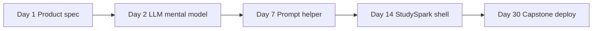

Check off **Day 1 — Problem statement and user persona written** in the Week 1 checklist when done.

## Summary

AI engineering is the discipline of turning model capability into **useful, testable, safe products**. The model predicts language; your application chooses context, enforces rules, measures quality, and protects users when the model is wrong or unavailable.

Tomorrow in [Day 2](../day_02/day_02_how_large_language_models_work.md), you will learn what the model is actually doing inside that loop—training, inference, tokens, and why fluent text is not the same as truth. That mental model makes every later engineering choice clearer.

[Previous: Day 0 - Getting Started](../day_00/day_00_getting_started.md) | [Next: Day 2 - How Large Language Models Work](../day_02/day_02_how_large_language_models_work.md)

## Further Reading

- [SYLLABUS.md](../../SYLLABUS.md) — learning paths and week overview
- [projects/CAPSTONE.md](../../projects/CAPSTONE.md) — StudySpark cumulative spec
- [Day 0 — Getting Started](../day_00/day_00_getting_started.md) — setup and paths
- https://platform.openai.com/docs/guides/production-best-practices — product patterns around models
- https://www.anthropic.com/research — research essays on safe, useful AI systems
- https://www.deeplearning.ai/ — short courses on LLM apps and chains
- *Designing Machine Learning Systems* (Chip Huyen) — ML systems thinking that transfers to AI engineering
