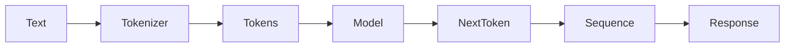

# Day 2 - How Large Language Models Work

## Introduction
Large language models are systems trained to predict the next token in a sequence. That simple training objective leads to surprisingly powerful behavior: writing, reasoning, summarizing, translating, and tool use. To build good AI applications, you need to understand the basic mechanics behind that behavior.


## Learning Objectives
By the end of this day, you should be able to:

- explain what a language model predicts
- describe the difference between training and inference
- understand why scale matters
- identify the role of attention at a high level
- explain why LLMs can sound confident even when they are wrong

## Theory
An LLM learns patterns from large amounts of text. During training, it repeatedly sees a partial sequence and tries to predict what comes next. Over time, it learns statistical and semantic structure in language.

At inference time, the model does not "look things up" the way a search engine does. It generates one token at a time based on the prompt and the tokens already produced. That is why prompt quality, context quality, and output constraints matter so much.

### Visual Diagram


## Code Examples

### Python
```python
prompt = "Explain photosynthesis in simple English."
context = ["Use short sentences.", "Avoid jargon."]

print("Prompt:", prompt)
print("Context:", context)
print("Model step:", "predict next token based on prompt + context")
```

### TypeScript
```typescript
const prompt = 'Explain photosynthesis in simple English.';
const context = ['Use short sentences.', 'Avoid jargon.'];

console.log({ prompt, context, modelStep: 'predict next token based on prompt + context' });
```

## Best Practices
- think in tokens, not just words
- keep prompts focused on one task
- assume the model may be wrong and verify important outputs
- use examples to steer behavior
- separate instruction, context, and output format clearly

## Common Mistakes
- expecting the model to know private or recent facts without context
- using vague prompts and then blaming the model
- forgetting that generation is probabilistic
- mixing multiple tasks in one prompt
- treating fluent language as proof of correctness

## Exercises
- Easy: Explain next-token prediction in your own words.
- Medium: Compare training and inference.
- Hard: Why can a model generate a wrong answer that still sounds convincing?
- Challenge: Sketch a conversation that shows how context changes model output.

## Mini Project
Write a short teaching prompt that asks an LLM to explain the same concept to a child, a teenager, and a developer. Compare the outputs and note the difference in style.

## Summary
LLMs are probabilistic sequence models. They are powerful because they learn language patterns at scale, but they are not guaranteed to be correct or up to date unless you design the application around them.

## Additional Resources
- https://arxiv.org/abs/1706.03762
- https://huggingface.co/learn
- https://www.youtube.com/@AndrejKarpathy
