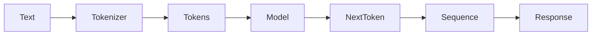
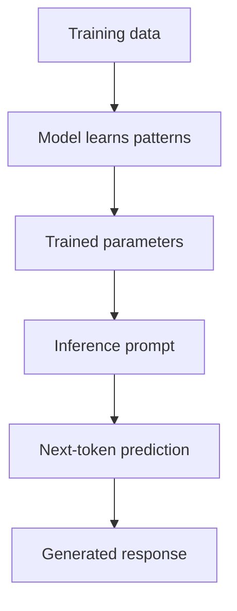
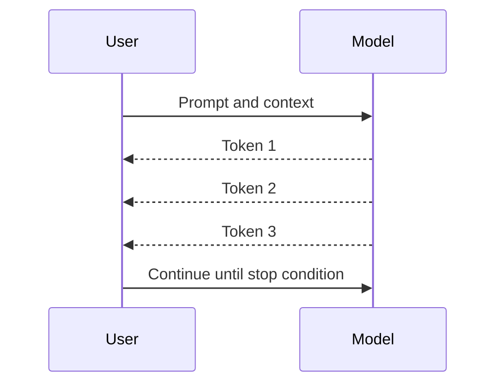
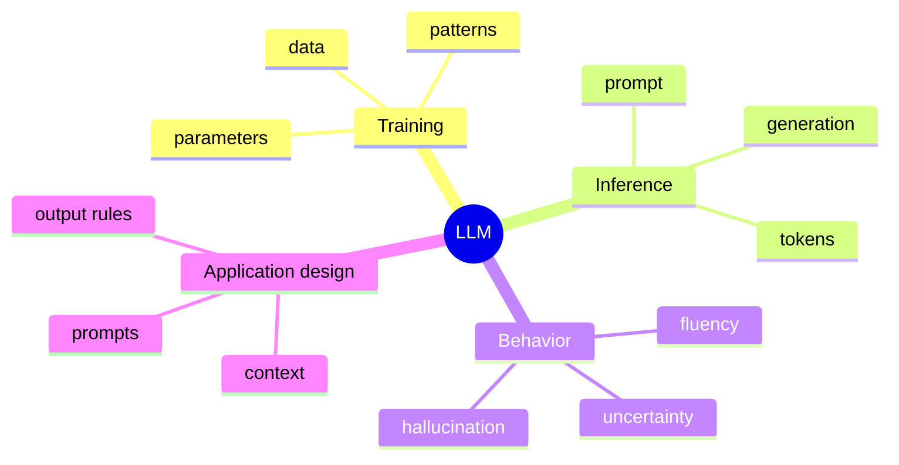

# Day 2 - How Large Language Models Work

[Previous: Day 1 - Introduction to AI Engineering](../day_01/day_01_introduction_to_ai_engineering.md) | [Next: Day 3 - Tokens, Context Windows, and Embeddings](../day_03/day_03_tokens_context_windows_and_embeddings.md)

## Introduction
Yesterday you learned what AI engineering is. Today you learn what the model inside that system is actually doing.

Large language models are systems trained to predict the next token in a sequence. That simple training objective leads to surprisingly powerful behavior: writing, reasoning, summarizing, translating, and tool use. To build good AI applications, you need to understand the basic mechanics behind that behavior.


This lesson gives you the mental model you will use for the rest of the course. If you understand how an LLM works at a high level, later topics like tokens, embeddings, retrieval, memory, and agents will make much more sense.

## Learning Objectives
By the end of this day, you should be able to:

- explain what a language model predicts
- describe the difference between training and inference
- understand why scale matters
- identify the role of attention at a high level
- explain why LLMs can sound confident even when they are wrong
- describe why prompting and context control behavior
- connect model behavior to application design

## Prerequisites
You should already understand:

- Day 1: AI engineering as a product discipline
- basic programming and application concepts

No advanced math is required for this lesson. The goal is conceptual understanding, not implementation of the full training process.

## Big Picture
A language model learns patterns in text and uses those patterns to generate the next token.

It does not think like a human, and it does not retrieve facts from a built-in database in the same way a search engine does. Instead, it predicts likely continuations based on the prompt and the tokens already produced.

That is why prompt quality, context quality, and output constraints matter so much.



## Why LLMs Matter
LLMs are useful because they can handle language tasks that used to require many separate rule-based systems.

Examples include:

- summarizing text
- answering questions
- extracting structure from unstructured input
- rewriting content for different audiences
- assisting with tools and workflows

The reason they are so flexible is that language itself contains a lot of structure. The model learns patterns that generalize across tasks.

## Deep Theory

### What does the model predict?
At each step, the model predicts the most likely next token given the current context.

A token may be a word, part of a word, punctuation, or another text fragment. The model keeps generating one token at a time until it reaches a stopping condition.

### Training versus inference
Training and inference are different phases.

During training, the model learns from large amounts of text by repeatedly guessing the next token and adjusting its internal parameters.

During inference, the trained model is used to generate output for a user prompt. It is no longer learning from the prompt in the same way; it is applying what it learned during training.

### Why scale matters
Scale matters because large models have more capacity to store and use patterns from language.

More data, more parameters, and more compute can lead to better generalization and stronger behavior across many tasks. But scale is not magic. A larger model still needs good prompts, good context, and good application design.

### Why attention matters
Attention helps the model decide which parts of the input are most relevant when generating the next token.

At a high level, attention lets the model weigh different pieces of context differently. This is one reason LLMs can connect information across long prompts.

### Why models sound confident
The model generates the most likely continuation, not the guaranteed true answer.

That means it can:

- sound fluent
- sound confident
- still be wrong

The output style is not the same as correctness.

### Advantages
- very flexible across many language tasks
- works with natural language, which is easy for users
- can generalize from patterns in text
- integrates well with prompts, tools, and retrieval

### Limitations
- can hallucinate or invent details
- does not automatically know private or recent information
- can be sensitive to prompt wording and context order
- may produce plausible but incorrect answers

### Alternatives
- rule-based NLP systems for narrow tasks
- search engines for factual lookup
- deterministic software for exact logic
- smaller specialized models for constrained workloads

### When should you use an LLM?
Use an LLM when:

- the task involves language understanding or generation
- flexibility matters more than exact symbolic rules
- the system can benefit from context-sensitive responses

### When should you not rely on an LLM alone?
Avoid relying on an LLM alone when:

- correctness must be exact
- the data must be current and verifiable
- the task can be solved more reliably with deterministic code

## Visual Learning

### Training and Inference


### Token Generation Loop


### LLM Mind Map


## Code Walkthrough

The examples below are not implementing a model. They are modeling the way application code prepares inputs for a model and interprets its behavior.

### Python Example
```python
prompt = "Explain photosynthesis in simple English."
context = ["Use short sentences.", "Avoid jargon."]

print("Prompt:", prompt)
print("Context:", context)
print("Model step:", "predict next token based on prompt + context")
```

#### Code Explanation
- `prompt` is the main instruction.
- `context` adds constraints or helpful background.
- the final line describes the model’s actual job: predict the next token.

### TypeScript Example
```typescript
const prompt = 'Explain photosynthesis in simple English.';
const context = ['Use short sentences.', 'Avoid jargon.'];

console.log({ prompt, context, modelStep: 'predict next token based on prompt + context' });
```

#### Code Explanation
- the structure makes prompt and context visible separately.
- application code can shape the request before it reaches the model.

### Python Example: Compare training and inference
```python
training_mode = "learn from many examples"
inference_mode = "generate an answer from a prompt"

print(training_mode)
print(inference_mode)
```

#### Code Explanation
- training builds the model.
- inference uses the model.
- keeping those phases separate prevents confusion later.

### TypeScript Example: Confidence is not correctness
```typescript
const answer = 'The capital of Australia is Sydney.';
const soundsConfident = true;
const isCorrect = false;

console.log({ answer, soundsConfident, isCorrect });
```

#### Code Explanation
- a response can sound polished while still being wrong.
- this is why evaluation and verification matter.

## Practical Examples

### Beginner Example: Explaining a concept
If you ask a model to explain photosynthesis in simple English, it can adjust the tone and vocabulary based on the prompt.

Why this is useful:

- the same core idea can be adapted to different audiences
- the model can rewrite information without changing the topic

### Intermediate Example: Summarization
A model can summarize a long article into a shorter version.

Why this works:

- the model learns patterns of importance and compression
- the application can control length and style with instructions

### Professional Example: Tool-assisted assistant
A model can draft an answer, then use a tool for updated data or calculations.

Why professionals like this pattern:

- the model handles language
- the tool handles exact or current data
- the app combines them into one workflow

### Real-World Company Example
Customer support, research, and internal knowledge tools often use LLMs because people already ask questions in natural language. The product then turns those questions into structured prompts, tool calls, and grounded answers.

## Best Practices
- think in tokens, not just words
- keep prompts focused on one task
- assume the model may be wrong and verify important outputs
- use examples to steer behavior
- separate instruction, context, and output format clearly
- compare answers across different prompts when testing

## Common Mistakes
- expecting the model to know private or recent facts without context
- using vague prompts and then blaming the model
- forgetting that generation is probabilistic
- mixing multiple tasks in one prompt
- treating fluent language as proof of correctness
- assuming a larger model automatically solves a bad product design

### Debugging Strategy
If an LLM output is not what you expected, ask:

1. Was the instruction clear?
2. Was the context relevant?
3. Was the output format specified?
4. Did the model have enough information?
5. Is the answer fluent but unsupported?

## Performance

### Speed
LLMs may take noticeable time to generate output, especially for longer prompts or longer responses.

### Cost
Every token has a cost, so prompt length and response length matter.

### Memory
The model can only pay attention to a limited amount of context at once, which is why context windows matter.

### Reliability
You should expect occasional mistakes, so the surrounding application must be designed for fallback behavior.

## Security
LLMs can be influenced by untrusted input, so security matters even at the model level.

- do not trust the model to protect secrets
- do not assume the prompt is private if it can be logged
- do not let unsafe outputs drive unsafe actions without checks

## Evaluation
LLM output should be evaluated on more than just style.

### What to measure
- correctness
- helpfulness
- consistency
- factual grounding
- latency
- cost

### Useful questions
- Does the model answer the right question?
- Is the answer supported by the available context?
- Is the behavior stable across similar prompts?
- Is the response fast enough and affordable enough?

## Exercises

### Easy
1. Explain next-token prediction in your own words.
2. Name one thing an LLM does not do like a search engine.
3. Describe the difference between training and inference.
4. Explain why fluency is not the same as correctness.

### Medium
5. Compare training and inference.
6. Explain why prompt quality matters.
7. Describe why scale helps but does not guarantee correctness.
8. Identify one role attention plays at a high level.

### Hard
9. Why can a model generate a wrong answer that still sounds convincing?
10. Explain why application design matters around the model.
11. Describe when an LLM should be combined with a tool.
12. Explain why evaluation is necessary even for a strong model.

### Challenge
13. Sketch a conversation that shows how context changes model output.
14. Compare a rule-based system and an LLM for one task.
15. Design a prompt that reduces ambiguity in a model answer.
16. Describe how you would test for hallucination in a simple app.

## Mini Project
Write a short teaching prompt that asks an LLM to explain the same concept to a child, a teenager, and a developer.

### Goal
Observe how one model changes tone, vocabulary, and structure for different audiences.

### Suggested structure
```text
llm-teaching-prompt/
├── prompt.txt
└── notes.md
```

### Project Steps
1. choose one simple concept
2. write one prompt with three audience variants
3. compare the outputs
4. note how style changes with the audience
5. identify what stays consistent across answers

### What You Learn
- how prompt wording changes output
- how audience affects tone and complexity
- how the same underlying model can behave differently in different contexts

## Summary
LLMs are probabilistic sequence models.

They are powerful because they learn language patterns at scale, but they are not guaranteed to be correct or up to date unless you design the application around them. That is why the rest of the course keeps returning to prompts, context, retrieval, memory, evaluation, and safety.

[Previous: Day 1 - Introduction to AI Engineering](../day_01/day_01_introduction_to_ai_engineering.md) | [Next: Day 3 - Tokens, Context Windows, and Embeddings](../day_03/day_03_tokens_context_windows_and_embeddings.md)

## Additional Resources
- https://arxiv.org/abs/1706.03762
- https://huggingface.co/learn
- https://www.youtube.com/@AndrejKarpathy
- https://jalammar.github.io/illustrated-transformer/
