# Day 2 - How Large Language Models Work

[Previous: Day 1 - Introduction to AI Engineering](../day_01/day_01_introduction_to_ai_engineering.md) | [Next: Day 3 - Tokens, Context Windows, and Embeddings](../day_03/day_03_tokens_context_windows_and_embeddings.md)

## Introduction

Yesterday you learned that AI engineering wraps models in software so users get reliable products. Today you learn **what the model actually is**—not as a mathematician, but as an engineer who needs to predict behavior, debug bad outputs, and design good prompts.

Here is the Feynman version. Imagine a autocomplete system on your phone, but trained on a huge slice of the internet and books. At every step it asks: *"Given everything so far, what text fragment is most likely to come next?"* It repeats that question hundreds of times until the answer feels complete. There is no little person inside reading for truth. There is a **pattern machine** that learned statistical relationships between words and ideas.

That single training goal—**predict the next token**—produces surprising abilities: writing, summarizing, translating, coding, and following instructions. It also produces predictable failures: confident wrong answers, invented citations, and sensitivity to how you phrase a question.


This lesson gives you the mental model for the rest of the course. When Day 3 discusses tokens, Day 4 discusses prompts, and Day 17 discusses retrieval, they all assume you understand today's core loop: **text → tokens → model → next token → response**.

Your StudySpark capstone will call LLMs every week. Today you document **when to trust** model output versus when your app must verify—and you connect that judgment to [`projects/CAPSTONE.md`](../../projects/CAPSTONE.md).

## Learning Objectives

By the end of this day, you should be able to:

- explain next-token prediction in plain language without hand-waving
- describe the difference between **training** and **inference**
- explain why scale (data, parameters, compute) helps—and what it does *not* fix
- describe attention at a high level and why it enables long-context reasoning
- explain why LLMs sound confident when wrong and why fluency ≠ correctness
- connect model behavior to application design: prompts, context, tools, evaluation
- identify two StudySpark user questions that need verification vs direct trust
- preview how tokens and context windows (Day 3) limit what you can send to a model

## How to Use This Lesson

This lesson is designed for **all skill levels**. Pick one path and follow it consistently.

| Level | Suggested approach | Time |
| --- | --- | --- |
| **Beginner** | Read Introduction → Big Picture → Deep Theory → trace one code example → Easy exercises | 4–6 hours |
| **Intermediate** | Skim objectives → Visual Learning → Code Walkthrough → Medium/Hard exercises → Mini project | 2–4 hours |
| **Advanced** | Deep Theory tradeoffs → Hard/Challenge exercises → extend mini project → capstone slice | 1–3 hours |

### Apply Today
Complete at least one item before moving to the next day:
- [ ] Trace one code example in **Python or TypeScript** (one language is enough)
- [ ] Complete exercises for your level (see Exercises section)
- [ ] Update [`projects/CAPSTONE.md`](../../projects/CAPSTONE.md) with today's capstone item
- [ ] Write one sentence in your own words explaining today's main idea.

> **Stuck?** Re-read Big Picture, review Prerequisites, or see [SYLLABUS.md](../../SYLLABUS.md) for path guidance.

## Prerequisites

You should already understand:

- [Day 1](../day_01/day_01_introduction_to_ai_engineering.md): AI engineering as product discipline and application layer
- basic programming (variables, loops, functions)
- optional: [Day 0](../day_00/day_00_getting_started.md) setup if you skipped it

No calculus, linear algebra, or GPU knowledge required. We build intuition, not a training cluster.

## Big Picture

A **large language model (LLM)** reads a sequence of tokens and outputs a probability distribution over what token could come next. It samples or selects from that distribution, appends the token, and repeats.

The model does **not**:

- look up facts in a database like Google Search
- execute your code unless the **application** connects tools
- know your private notes unless the **application** puts them in context
- guarantee truth—it guarantees *plausible continuation*

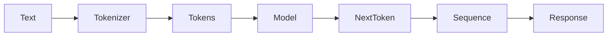

That is why **prompt quality**, **context quality**, and **output constraints** dominate AI engineering work. You are steering a powerful autocomplete engine, not interviewing an oracle.

## Why LLMs Matter

Before LLMs, language software was often a patchwork of rules, regex, and small classifiers—one system for spam, another for sentiment, another for summarization.

LLMs unify many language tasks behind one interface: *give text in, get text out*. Flexibility comes from language itself containing grammar, facts, code patterns, and reasoning templates mixed together.

| Task | Pre-LLM approach | LLM approach |
| --- | --- | --- |
| Summarization | Extractive algorithms + templates | Instruction: "Summarize in 5 bullets" |
| Translation | Statistical or neural MT systems | Same model, different prompt |
| Classification | Fine-tuned classifier | "Classify this ticket as billing or tech" |
| Q&A over docs | Search + snippet extraction | Retrieval + generation (Week 3) |

For StudySpark, one model can explain, quiz, and rewrite—if the application supplies context and guardrails.

## Deep Theory

### What does the model predict?

At each step the model outputs scores for every token in its vocabulary. A **token** might be a whole word, a subword piece, or punctuation—Day 3 covers tokenization in detail.

The model chooses one token, adds it to the sequence, and runs again until:

- a stop token or max length is hit
- the model emits an end-of-message pattern
- your app cuts generation (`max_tokens`)

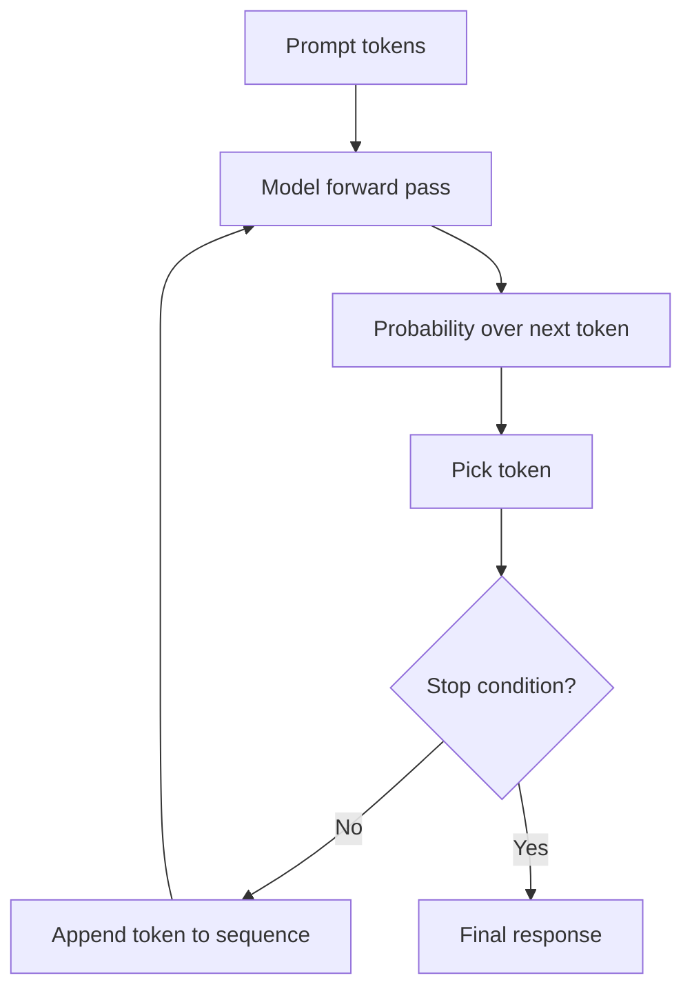

Think of it as **iterative autocomplete with memory of the whole sequence so far**.

### Training versus inference

**Training** is when the model learns from massive text corpora. For each position in a document, it tries to predict the next token, compares to the actual next token, and adjusts billions of internal parameters (weights). Training takes weeks on large GPU clusters and happens **before** your app exists.

**Inference** is when you use the finished model. You send a prompt; it generates tokens using fixed weights. It does **not** learn permanently from your chat unless the product explicitly fine-tunes or stores memory elsewhere.

| Phase | Who runs it | Cost | Updates weights? |
| --- | --- | --- | --- |
| Training | Model lab / platform | Very high | Yes |
| Inference | Your app via API | Per request | No (by default) |

Confusing these leads to bad product decisions—e.g., assuming the model "remembered" yesterday's user without a memory store.

### Why scale matters

**Scale** means more training data, more parameters, and more compute. Larger models can capture subtler patterns and follow complex instructions better.

Scale improves:

- fluency and coherence
- instruction following
- reasoning on harder tasks (up to a point)

Scale does **not** automatically fix:

- private or live data access
- arithmetic reliability
- hallucination
- bad prompts or missing context

A bigger model with a empty context still cannot summarize notes the user never uploaded.

### Why attention matters

Early sequence models struggled with long-range dependencies. The **Transformer** architecture (2017) introduced **attention**: a mechanism for each token to weigh which other tokens matter most when predicting the next one.

Feynman analogy: when you read *"The cat sat on the mat because it was tired,"* you know **it** refers to **cat**—attention helps the model link those positions.

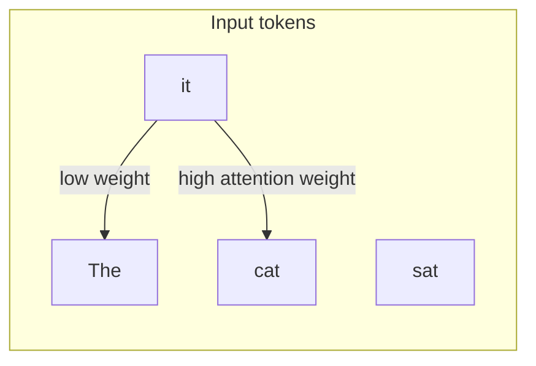

You do not implement attention in StudySpark. You **benefit** from it when placing important instructions where the model can attend to them—often at the beginning or end of context (Day 5 revisits this).

### Why models sound confident

The model is trained to produce **likely** text, not **verified** text. Fluent prose is a style learned from books and articles; those sources often sound authoritative.

Therefore:

- polished wording ≠ correct facts
- the model may invent citations, dates, or API names
- saying "I think" or "I'm not sure" is also a learned pattern—it does not prove calibration

**Application fix:** retrieval, tools, structured checks, and human review—not hope.

### Temperature and sampling (preview)

At inference, apps often set **temperature** to control randomness. Low temperature → safer, more repetitive choices. High temperature → more creative, more erratic.

You will configure this in API calls (Day 6–8). The key Day 2 insight: output is **sampled**, not deduced like a calculator.

### Advantages

- one interface for many language tasks
- natural interaction for users
- strong generalization from pretraining
- composes with prompts, tools, and retrieval

### Limitations

- hallucination and confabulation
- knowledge cutoff and no private data by default
- context limits (Day 3)
- sensitivity to prompt phrasing and example order
- cost and latency grow with length

### Alternatives

| Tool | Best for |
| --- | --- |
| Rule-based NLP | Fixed formats, compliance text |
| Search engine | Finding existing pages |
| Spreadsheet / SQL | Exact aggregates |
| Small specialized model | Cheap classification at scale |
| LLM + tools | Language + precise operations |

### When to use an LLM

Use when language understanding or generation is central, flexibility beats brittle rules, and mistakes can be caught or tolerated.

### When not to rely on an LLM alone

Avoid solo LLM use when correctness must be exact, facts must be current and cited, or deterministic code is simpler and cheaper.

## Historical Background

Understanding history prevents mythology. LLMs did not appear fully formed in ChatGPT—they are a stack of incremental ideas.

### From n-grams to neural language models

Early language models counted short word sequences (n-grams) to guess next words. They worked for autocomplete but failed at long coherence.

**Recurrent neural networks (RNNs)** learned richer representations but were slow and forgot distant context.

### The Transformer revolution (2017)

The paper *Attention Is All You Need* (Vaswani et al.) replaced recurrence with attention layers, enabling parallel training at scale. Modern LLMs are mostly Transformer variants.

### GPT line: generative pretraining

OpenAI's **GPT** series used generative pretraining: predict next token on huge text, then optional fine-tuning for instructions. **GPT-3** (2020) showed few-shot prompting—examples in the prompt steer behavior without retraining.

### Instruction tuning and RLHF

Raw next-token models did not always follow user intent. **Instruction tuning** trained on curated Q&A; **RLHF** (reinforcement learning from human feedback) aligned outputs with human preferences—more helpful, less toxic.

ChatGPT combined these with a simple UX and exploded public awareness.

### Open models and competition

Meta's **LLaMA**, Mistral, Google **Gemini**, Anthropic **Claude**, and others broadened access. AI engineering became provider-agnostic: similar chat APIs, different strengths.

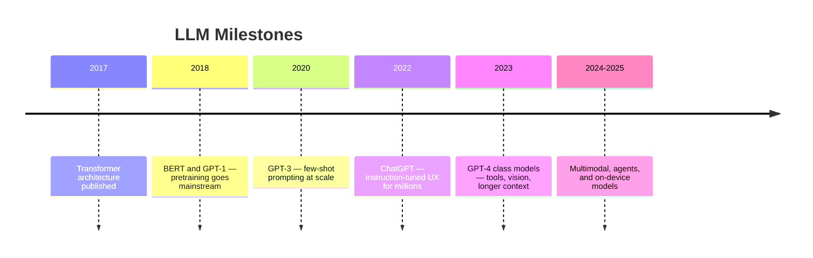

### Company snapshot: how labs vs apps split work

| Organization | Primary role |
| --- | --- |
| **OpenAI / Anthropic / Google DeepMind** | Train base models, safety research, host APIs |
| **Microsoft / Notion / Duolingo** | Application layer: context, UX, evals, enterprise policy |
| **Hugging Face** | Model hub, open weights, community tools |

StudySpark sits in the **application** row—you choose providers, not invent Transformers.

## Visual Learning

### Training pipeline (offline)

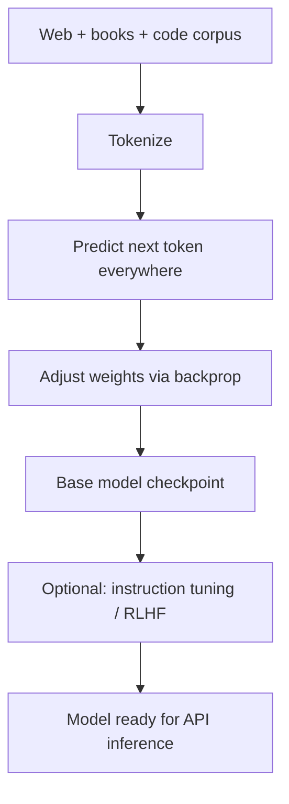

### Inference loop (online)

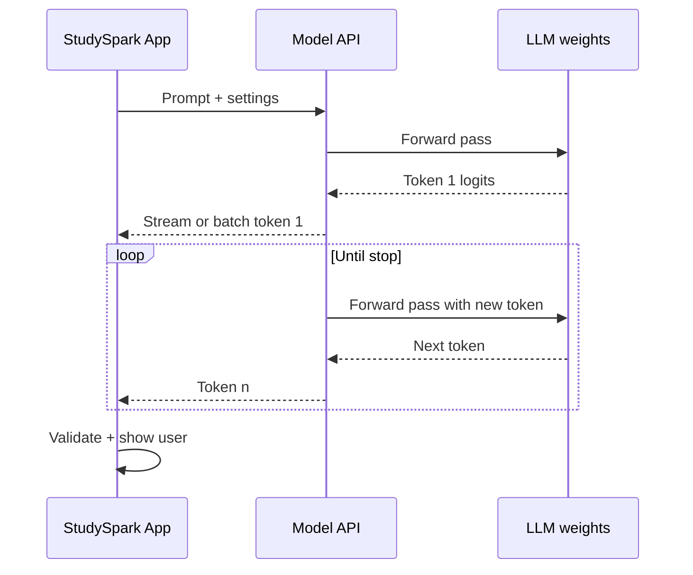

### Training vs inference mind map

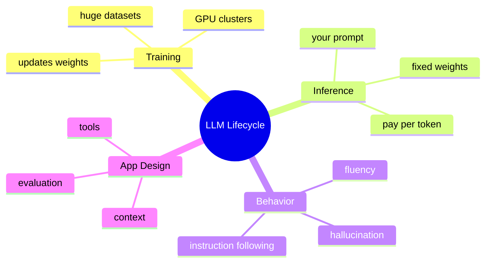

### Where LLM fits in StudySpark

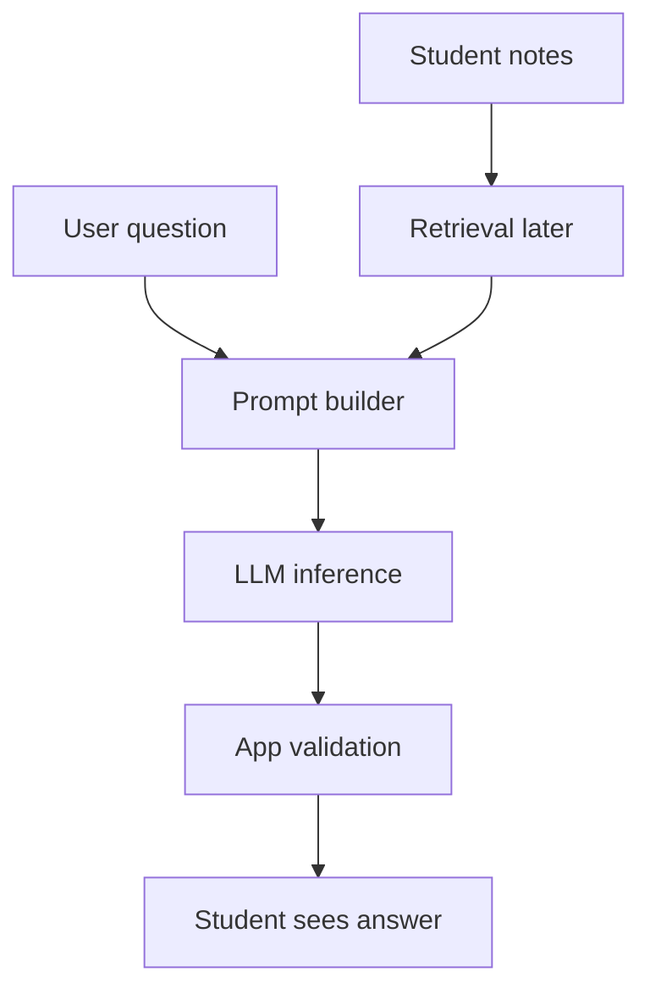

### Hallucination path

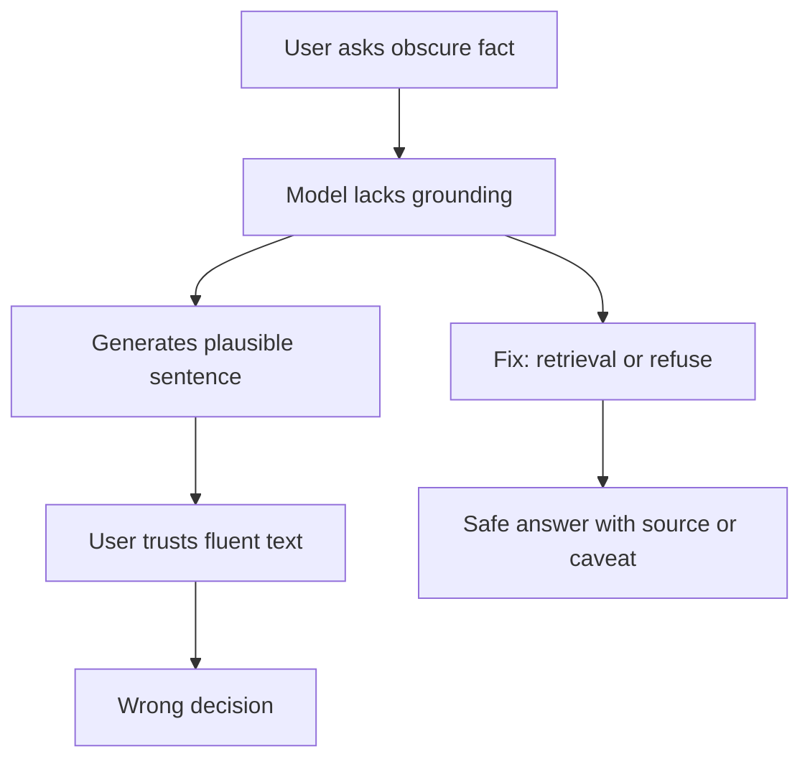

### Attention intuition (simplified)

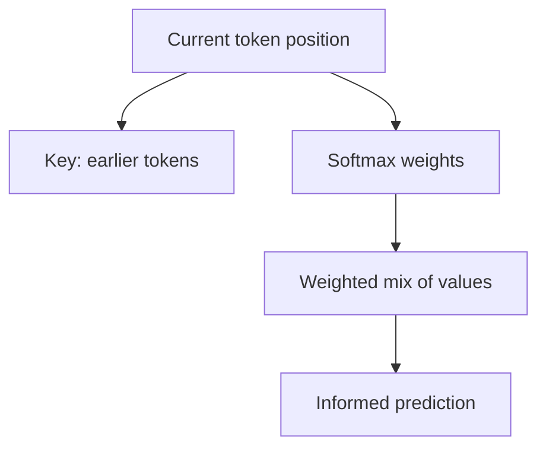

### Scale tradeoffs

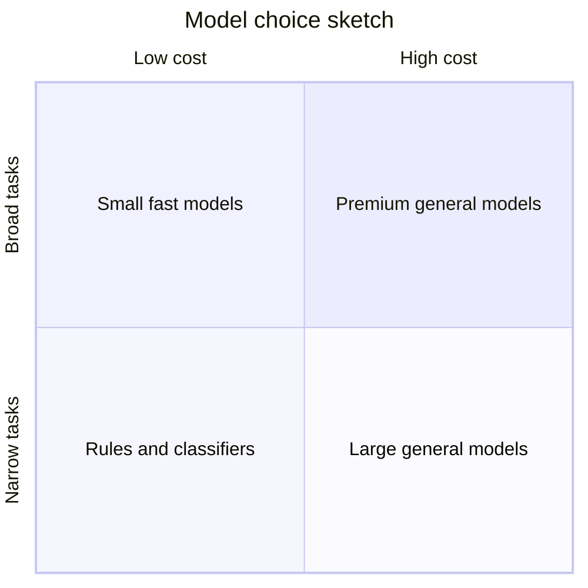

## Code Walkthrough

Examples simulate application behavior around a model—no API keys required. They mirror patterns in [`projects/studyspark/`](../../projects/studyspark/).

### Example 1: Python — Prompt and context separation

```python
prompt = "Explain photosynthesis in simple English."
context = ["Use short sentences.", "Avoid jargon.", "Max 120 words."]

full_instruction = {
    "task": prompt,
    "constraints": context,
    "model_job": "predict next token repeatedly until stop",
}

print(full_instruction)
```

#### Code Explanation
- `prompt` states the task; `context` holds rules—the app merges them before the API call.
- `model_job` reminds you what the model actually executes under the hood.

### Example 2: TypeScript — Prompt and context separation

```typescript
const prompt = 'Explain photosynthesis in simple English.';
const context = ['Use short sentences.', 'Avoid jargon.', 'Max 120 words.'];

const fullInstruction = {
  task: prompt,
  constraints: context,
  modelJob: 'predict next token repeatedly until stop',
};

console.log(fullInstruction);
```

#### Code Explanation
- Structuring instructions as data makes unit tests easy—you can snapshot expected prompts.

### Example 3: Python — Training vs inference modes

```python
class ModelPhase:
    TRAINING = "adjust weights on billions of examples"
    INFERENCE = "fixed weights; generate from your prompt"


def describe(phase: str) -> None:
    print(f"Phase: {phase}")


describe(ModelPhase.TRAINING)
describe(ModelPhase.INFERENCE)
```

#### Code Explanation
- Treating phases as explicit constants prevents "why didn't it learn my correction?" confusion.
- User corrections belong in memory stores or fine-tunes—not assumed during vanilla inference.

### Example 4: TypeScript — Training vs inference

```typescript
const ModelPhase = {
  TRAINING: 'adjust weights on billions of examples',
  INFERENCE: 'fixed weights; generate from your prompt',
} as const;

console.log(ModelPhase.TRAINING);
console.log(ModelPhase.INFERENCE);
```

#### Code Explanation
- `as const` preserves literal types for TypeScript discriminated unions later.

### Example 5: Python — Simulated token loop

```python
def generate_tokens(prompt: str, max_tokens: int = 5) -> list[str]:
    # Toy simulation — real APIs hide this loop
    fake_vocab = ["Photosynthesis", " uses", " sunlight", " to", " make", " sugar", "."]
    tokens = []
    for i in range(max_tokens):
        tokens.append(fake_vocab[i % len(fake_vocab)])
    return tokens


print(" ".join(generate_tokens("Explain photosynthesis")))
```

#### Code Explanation
- Real models choose tokens from tens of thousands of options per step.
- `max_tokens` is an app-controlled stop condition—critical for cost control.

### Example 6: TypeScript — Simulated token loop

```typescript
function generateTokens(maxTokens = 5): string[] {
  const fakeVocab = ['Photosynthesis', ' uses', ' sunlight', ' to', ' make', ' sugar', '.'];
  return Array.from({ length: maxTokens }, (_, i) => fakeVocab[i % fakeVocab.length]);
}

console.log(generateTokens().join(''));
```

#### Code Explanation
- Concatenating subword tokens reconstructs the visible string users read.

### Example 7: Python — Confidence is not correctness

```python
answer = "The capital of Australia is Sydney."
metadata = {
    "sounds_confident": True,
    "factually_correct": False,  # Canberra is the capital
    "action": "verify_before_display",
}

print(answer)
print(metadata)
```

#### Code Explanation
- StudySpark must not treat fluent biology explanations as exam guarantees without sources when stakes are high.

### Example 8: TypeScript — Confidence is not correctness

```typescript
const answer = 'The capital of Australia is Sydney.';
const metadata = {
  soundsConfident: true,
  factuallyCorrect: false,
  action: 'verify_before_display' as const,
};

console.log({ answer, metadata });
```

#### Code Explanation
- `action` encodes app policy—show, verify, or refuse.

### Example 9: Python — When to trust vs verify (StudySpark)

```python
TRUST_WITH_REVIEW = [
    "rewrite this paragraph more simply",
    "generate practice questions from my notes",
]
VERIFY_REQUIRED = [
    "what drug dosage applies to my condition",
    "will this exact code compile on my machine without testing",
]


def route(question: str) -> str:
    if any(k in question.lower() for k in ["dosage", "compile without"]):
        return "verify"
    return "trust_with_caveat"


print(route("rewrite this paragraph more simply"))
print(route("what drug dosage applies to my condition"))
```

#### Code Explanation
- Routing policy belongs in application code, not implied by the model.
- StudySpark capstone today: list your own trust/verify examples.

### Example 10: TypeScript — When to trust vs verify

```typescript
function route(question: string): 'verify' | 'trust_with_caveat' {
  const lower = question.toLowerCase();
  if (lower.includes('dosage') || lower.includes('compile without')) {
    return 'verify';
  }
  return 'trust_with_caveat';
}

console.log(route('rewrite this paragraph more simply'));
console.log(route('what drug dosage applies to my condition'));
```

#### Code Explanation
- Union return types document allowed policy outcomes for UI handling.

### Example 11: Python — Audience changes prompt, same model

```python
concept = "recursion"
audiences = {
    "child": f"Explain {concept} with a story about Russian nesting dolls.",
    "teen": f"Explain {concept} with one Python example under 10 lines.",
    "developer": f"Explain {concept} with stack frames and base cases.",
}

for audience, instruction in audiences.items():
    print(audience, "->", instruction)
```

#### Code Explanation
- Same underlying model; different **prompts** produce different tones—your mini project explores this.

### Example 12: TypeScript — Audience-specific instructions

```typescript
const concept = 'recursion';
const audiences: Record<string, string> = {
  child: `Explain ${concept} with a story about Russian nesting dolls.`,
  teen: `Explain ${concept} with one Python example under 10 lines.`,
  developer: `Explain ${concept} with stack frames and base cases.`,
};

Object.entries(audiences).forEach(([audience, instruction]) => {
  console.log(audience, '->', instruction);
});
```

#### Code Explanation
- StudySpark might store `audience_level` in user profile and select templates accordingly (Day 4+).

## Practical Examples

### Beginner Example: Explain like I'm five

Ask the model to explain photosynthesis with a plant metaphor. The model adjusts vocabulary—not because it "knows pedagogy," but because your instruction steers token probabilities toward simple sentences.

**App layer:** word limit, reading level selector, disclaimer that it's study help not a textbook replacement.

### Intermediate Example: Summarize lecture notes

StudySpark compresses 2,000 words of notes into ten bullets.

**Why it works:** summarization patterns exist in training data.

**App layer:** chunk long notes (Day 3), cite which paragraph each bullet came from (Day 17).

### Advanced Example: Tool-assisted math

Student asks for statistical significance calculation. Model drafts explanation; **Python tool** computes p-value.

**Why:** LLMs language; calculators math. Combining them reduces numeric hallucination.

### Production Example: Grounded answers only

Internal assistant must attach source links. If retrieval score is low, app responds *"I couldn't find that in your docs"* instead of guessing.

**Pattern:** RAG with abstention—Week 3.

### Company Examples

| Product | LLM role | App layer |
| --- | --- | --- |
| **Google Search AI Overviews** | Synthesize snippets | Search index + citations |
| **GitHub Copilot** | Complete code | IDE context + filters |
| **Duolingo Max** | Explain mistakes | Curriculum constraints |
| **OpenAI ChatGPT** | General chat | Memory, tools, moderation |
| **StudySpark (yours)** | Tutor language | Notes retrieval, quizzes, evals |

## Comparison Tables

| Concept | Human reader | LLM |
| --- | --- | --- |
| Goal | Understand meaning | Predict likely next token |
| Private notes | Reads if given | Only if app adds to prompt |
| Wrong answer | May doubt self | May sound equally fluent |
| Learning from chat | Remembers session | Needs memory feature |

| Setting | Effect |
| --- | --- |
| Low temperature | More deterministic wording |
| High temperature | More creative, less stable |
| Short prompt | Less guidance, more drift |
| Rich context | Better grounding if relevant |

## Best Practices

- Think in **tokens**, not just words (Day 3)—length affects cost and limits.
- Write **one clear task** per prompt; split multi-step work across calls or tools.
- Assume outputs may be wrong; **verify** high-stakes facts.
- Use **examples** in prompts to show format (Day 4–5).
- Separate **system policy**, **developer rules**, and **user text** (Day 6–8).
- Log prompts and outputs (redacted) when debugging behavior.
- Document **trust boundaries** in [`projects/CAPSTONE.md`](../../projects/CAPSTONE.md).

## Common Mistakes

- Expecting the model to know private or live facts without context
- Using vague prompts, then blaming "bad AI"
- Treating fluency as proof of correctness
- Assuming chat **trains** the base model during inference
- Picking the largest model to compensate for missing retrieval
- Ignoring stop conditions and burning tokens on runaway answers

### Debugging Strategy

If output surprises you, ask:

1. Was the instruction specific and single-purpose?
2. Was context relevant, recent, and within length limits?
3. Was output format specified (JSON, bullets, max words)?
4. Did the model have enough information—or did it fill gaps with guesses?
5. Would a search tool or calculator have helped?

## Performance

| Factor | Impact |
| --- | --- |
| Prompt length | More input tokens → higher cost and latency |
| Output length | Generation is sequential—long answers are slower |
| Model size | Larger models cost more; not always needed |
| Batching | Production systems batch requests for throughput |

StudySpark should set default `max_tokens` per feature (explain vs quiz vs summary).

## Security

LLMs inherit training data biases and can be manipulated by malicious prompts.

- Do not expose system prompts to untrusted users without review.
- Treat model output as untrusted when driving actions (SQL, shell, payments).
- Sanitize text before rendering in HTML to prevent injection in your UI—not just prompt injection in the model.

## Evaluation

Measure more than eloquence:

| Metric | Question |
| --- | --- |
| Correctness | Are facts right for the user's context? |
| Grounding | Does answer stick to provided notes? |
| Helpfulness | Did the student understand faster? |
| Consistency | Similar prompts → similar quality |
| Latency / cost | Acceptable during exam cram? |

Add two **golden questions** for StudySpark in capstone today—reuse them in Week 4 evals.

## Exercises

### Easy
1. Explain next-token prediction as if to a friend who knows phone autocomplete.
2. Name one thing an LLM does **not** do like a search engine.
3. What is the difference between training and inference?
4. Why is fluency not the same as correctness?
5. Where do user notes live if the model must use them?

### Medium
6. Draw the token generation loop (paper or Mermaid).
7. Explain why scale helps instruction following but not private data access.
8. Describe attention in one paragraph without math.
9. Give two StudySpark questions that should trigger verification.
10. Why should `max_tokens` match UI design?

### Hard
11. Why can wrong answers sound as polished as right ones?
12. Explain why application design matters given a fixed model API.
13. When should StudySpark call a tool instead of the LLM alone?
14. Design an abstention message when notes do not contain the answer.
15. Compare rule-based spam detection vs LLM classification—tradeoffs?

### Challenge
16. Write three prompt variants for one concept (child / teen / developer) and predict differences.
17. Sketch a hallucination test: 10 questions, which expect "I don't know."
18. Read the Transformer paper title and abstract—list three engineering implications.
19. Map each Week 1 day (1–7) to one LLM behavior risk and mitigation.
20. Draft two golden eval questions for StudySpark in [`projects/CAPSTONE.md`](../../projects/CAPSTONE.md).

### Reflection
21. What surprised you most about how LLMs work?
22. Which failure mode worries you most for StudySpark users?
23. When would you refuse to answer as an app, even if the model could guess?
24. How does today's lesson change how you read AI marketing claims?
25. Write one sentence summarizing today's main idea for your notes.

## Quizzes

### Quiz 1
1. What is the core training objective of most LLMs?
2. Does inference update model weights by default?
3. What is a token (one sentence)?
4. Why do models hallucinate?

**Answers:** 1. Predict the next token  2. No  3. A chunk of text the model reads/writes  4. They generate plausible continuations without guaranteed grounding

### Quiz 2
1. What architecture introduced attention at scale?
2. Name two things scale improves.
3. Name two things scale does not fix.
4. What is the capital of Australia (for hallucination demos)?

**Answers:** 1. Transformer  2. Any two: fluency, instruction following, reasoning breadth  3. Any two: private data, live facts, math reliability, bad prompts  4. Canberra (not Sydney)

### Quiz 3
1. What phase runs on GPU clusters for weeks?
2. What phase runs when StudySpark calls an API?
3. What setting controls randomness (preview)?
4. Who supplies user notes to the model?

**Answers:** 1. Training  2. Inference  3. Temperature  4. The application

### Quiz 4
1. True or false: LLMs look up answers in a structured world database during inference.
2. What is RLHF in plain terms?
3. Why log prompts during debugging?
4. What day covers token counting in depth?

**Answers:** 1. False  2. Training models to better match human preferences  3. Reproduce and fix behavior  4. Day 3

### Quiz 5
1. Give one trust-with-caveat StudySpark use case.
2. Give one verify-required use case.
3. What file tracks capstone trust policy?
4. What is the Feynman one-line summary of an LLM?

**Answers:** 1. e.g., simplify my paragraph  2. e.g., medical dosage  3. `projects/CAPSTONE.md`  4. Very advanced autocomplete / next-token predictor

## Interview Questions

### Conceptual
- Explain training vs inference to a product manager.
- Why do LLMs hallucinate, and how do apps mitigate it?
- What is attention, intuitively?
- Why does prompt wording change outputs?
- When would you not use an LLM?

### Practical
- How would you explain token costs to a finance stakeholder?
- Design trust tiers for a tutoring bot.
- How do you test whether a model "knows" your docs vs guessing?
- Walk through debugging a wrong but fluent answer.

### System Design
- Design StudySpark's inference path from notes upload to answer display.
- How would you combine LLMs with calculators and search?
- Design caching for repeated study questions without stale answers.
- How would you support multiple model providers behind one interface?

### Debugging
- Users report inconsistent summaries—what do you check first?
- Latency doubled after a prompt change—likely causes?
- Model answers ignore uploaded notes—what failed?
- Costs spiked during exam week—mitigations?

## Mini Project

Write a **teaching prompt pack** that asks an LLM to explain one concept to three audiences.

### Goal
Observe how the same model changes tone, vocabulary, and structure when instructions change—not when weights change.

### Choose one concept
Examples: recursion, photosynthesis, supply and demand, HTTP requests.

### Suggested structure
```text
llm-teaching-prompt/
├── prompt_child.txt
├── prompt_teen.txt
├── prompt_developer.txt
└── notes.md
```

### Project Steps
1. Pick one concept relevant to StudySpark users.
2. Write three prompts differing only in audience and constraints.
3. If you have API access, run all three; otherwise predict differences in `notes.md`.
4. Compare length, jargon, and use of examples.
5. Note what stayed consistent (topic coverage) vs what changed (style).
6. Add one **verification rule** the app should apply before showing each answer.

### Acceptance criteria
- three distinct prompts, same core fact goal
- `notes.md` lists at least four observed differences
- one paragraph on when StudySpark should refuse to simplify (e.g., medical misinformation)

### What You Learn
- Prompts steer behavior; models do not read minds
- Audience settings belong in product config, not ad hoc user typing
- Evaluation starts with side-by-side comparisons

## Cumulative Capstone Update

Add to [`projects/CAPSTONE.md`](../../projects/CAPSTONE.md):

- a short note on **when to trust** vs **verify** LLM output in StudySpark
- two example user questions the assistant must handle well (golden questions)
- one example question where StudySpark should abstain or ask for more context

Example format:

```markdown
### Day 2 — LLM mental model

**Trust with caveat:** "Explain this paragraph from my notes more simply."

**Verify or tool:** "Calculate the p-value for this dataset" → run stats code.

**Abstain:** "What will my professor put on the final exam?" → no guessing.

**Golden questions:**
1. ...
2. ...
```

Check off **Day 2 — LLM mental model doc** in the Week 1 checklist.

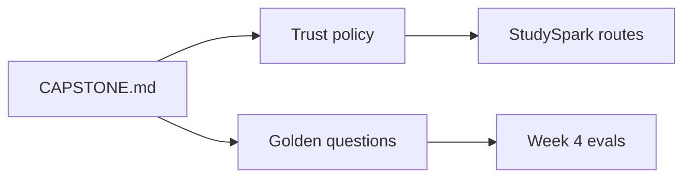

## Summary

Large language models are **probabilistic next-token predictors** trained at scale. Training builds patterns; inference applies them to your prompt. Attention helps models link distant context; it does not guarantee truth.

As an AI engineer, you do not retrain Transformers on Day 2—you **design context, prompts, tools, and verification** so StudySpark users get helpful study support instead of confident nonsense. Tomorrow, [Day 3](../day_03/day_03_tokens_context_windows_and_embeddings.md) makes the token and context window concrete—essential for cost, limits, and embeddings.

[Previous: Day 1 - Introduction to AI Engineering](../day_01/day_01_introduction_to_ai_engineering.md) | [Next: Day 3 - Tokens, Context Windows, and Embeddings](../day_03/day_03_tokens_context_windows_and_embeddings.md)

## Further Reading

- [Day 1 — Introduction to AI Engineering](../day_01/day_01_introduction_to_ai_engineering.md) — application layer context
- [SYLLABUS.md](../../SYLLABUS.md) — Week 1 path
- [projects/CAPSTONE.md](../../projects/CAPSTONE.md) — trust policy and golden questions
- https://arxiv.org/abs/1706.03762 — *Attention Is All You Need* (original Transformer paper)
- https://jalammar.github.io/illustrated-transformer/ — visual Transformer walkthrough
- https://huggingface.co/learn — NLP course modules on language modeling
- https://www.youtube.com/@AndrejKarpathy — intuitive ML/LLM explanations (Neural Networks: Zero to Hero series)
- https://platform.openai.com/docs/guides/latency-optimization — inference performance thinking from the application side
