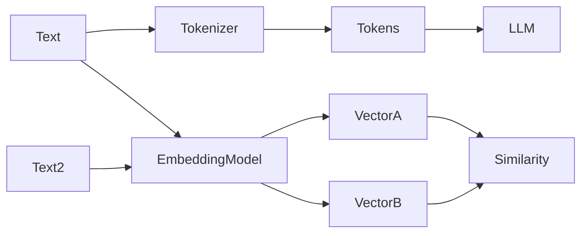

# Day 3 - Tokens, Context Windows, and Embeddings

## Introduction
Tokens are the units an LLM reads and writes. The context window is the amount of text the model can consider at one time. Embeddings are numerical representations of meaning. Together, these three ideas explain a lot of the practical limits and strengths of AI systems.


## Learning Objectives
By the end of this day, you should be able to:

- explain what a token is
- estimate why token count affects cost and latency
- describe the meaning of a context window
- explain embeddings at a high level
- understand when similarity search becomes useful

## Theory
A token is not always a word. It can be a word part, punctuation, or even a short symbol. Models process tokens, not characters or full words. That is why token counting matters for prompt design and budgeting.

A context window is the maximum number of tokens the model can pay attention to at once. If your prompt and conversation exceed that limit, older content may be truncated or summarized.

Embeddings turn text into vectors. Similar meanings produce vectors that are close together. This makes embeddings useful for search, clustering, and retrieval.

### Visual Diagram


## Code Examples

### Python
```python
text = "AI engineering is practical and iterative."
tokens = text.split()
print("Token estimate:", len(tokens))

embedding_a = [0.12, 0.88, 0.31]
embedding_b = [0.10, 0.85, 0.29]
print("Embeddings are close:", embedding_a, embedding_b)
```

### TypeScript
```typescript
const text = 'AI engineering is practical and iterative.';
const tokens = text.split(' ');
console.log('Token estimate:', tokens.length);

const embeddingA = [0.12, 0.88, 0.31];
const embeddingB = [0.1, 0.85, 0.29];
console.log('Embeddings are close:', embeddingA, embeddingB);
```

## Best Practices
- count tokens before sending long prompts
- reserve room for the model output
- use embeddings for meaning-based retrieval, not generation
- chunk long documents into manageable pieces
- normalize text before indexing when appropriate

## Common Mistakes
- assuming words and tokens are the same
- overfilling the context window
- storing raw text when a vector index would be better
- comparing embeddings with human intuition instead of a metric
- forgetting that embeddings encode meaning, not truth

## Exercises
- Easy: Count the tokens in a short sentence.
- Medium: Explain why a context window matters.
- Hard: Design a chunking strategy for a long document.
- Challenge: Describe a use case where embeddings are better than keywords.

## Mini Project
Build a simple semantic note search concept. Write down how a note would be turned into a vector and how a user query would find the closest note.

## Summary
Tokens affect cost and context size. Context windows limit what the model can see. Embeddings allow meaning-based search and retrieval, which becomes critical in real applications.

## Additional Resources
- https://platform.openai.com/tokenizer
- https://ai.google.dev/gemini-api/docs/embeddings
- https://www.pinecone.io/learn/series/faiss/
