# Day 3 - Tokens, Context Windows, and Embeddings

[Previous: Day 2 - How Large Language Models Work](../day_02/day_02_how_large_language_models_work.md) | [Next: Day 4 - Prompt Engineering Fundamentals](../day_04/day_04_prompt_engineering_fundamentals.md)

## Introduction
Yesterday you learned how LLMs generate text one token at a time. Today you learn the units and limits that shape that generation in real applications.

Think of an LLM like a chef working in a small kitchen with a fixed counter size. The chef can only spread out so many ingredients at once — that is the **context window**. Ingredients arrive in small packages, not always whole vegetables — those packages are **tokens**. And when you want to find the right recipe from a huge cookbook without reading every page, you need a way to match ideas, not just exact words — that preview is **embeddings**.

Tokens are the units an LLM reads and writes. The context window is the maximum amount of text the model can consider in a single request. Embeddings are numerical representations of meaning that power semantic search and retrieval. Together, these three ideas explain cost, latency, prompt design, and why retrieval-based AI systems exist.


This is one of the most important early lessons in the course. If you understand tokens, context windows, and embeddings at a practical level, you can reason about billing, design prompts that fit, and preview how StudySpark will later search your notes by meaning. **Day 15 goes deep on embeddings** — vectors, similarity metrics, indexing, and production retrieval. Today you build intuition so that day feels natural, not overwhelming.

By the end of today, you will count tokens, budget context, and explain why semantic search beats keyword matching for many learning apps — without needing an API key.

## Learning Objectives
By the end of this day, you should be able to:

- explain what a token is and why it is not always a whole word
- estimate token counts and explain why they affect cost and latency
- describe a context window and what happens when content exceeds it
- budget input and output tokens in application design
- explain embeddings at a high level and when similarity search helps
- distinguish keyword search from semantic search conceptually
- describe chunking as a response to context limits
- connect token and context limits to prompt engineering (Day 4)
- preview how embeddings enable retrieval in StudySpark (Days 15–17)
- debug common failures caused by oversized prompts or poor chunking

## How to Use This Lesson

This lesson is designed for **all skill levels**. Pick one path and follow it consistently.

| Level | Suggested approach | Time |
| --- | --- | --- |
| **Beginner** | Read Introduction → Big Picture → Deep Theory → trace one code example → Easy exercises | 4–6 hours |
| **Intermediate** | Skim objectives → Visual Learning → Code Walkthrough → Medium/Hard exercises → Mini project | 2–4 hours |
| **Advanced** | Deep Theory tradeoffs → Hard/Challenge exercises → extend mini project → capstone slice | 1–3 hours |

### Apply Today
Complete at least one item before moving to the next day:
- [ ] Trace one code example in **Python or TypeScript** (one language is enough)
- [ ] Complete exercises for your level (see Exercises section)
- [ ] Update [`projects/CAPSTONE.md`](../../projects/CAPSTONE.md) with today's capstone item
- [ ] Add today's component to `projects/studyspark/` or update `projects/CAPSTONE.md`.

> **Stuck?** Re-read Big Picture, review Prerequisites, or see [SYLLABUS.md](../../SYLLABUS.md) for path guidance.

## Prerequisites
You should already understand:

- Day 2: how LLMs predict the next token and generate text
- Day 1: what an AI application is and how prompts reach a model
- basic arithmetic and simple Python or TypeScript (for code walkthroughs)

No advanced linear algebra is required today. Embeddings are introduced as *meaning coordinates*, not matrix calculus. Save the math-heavy work for Day 15.

If Day 2 felt rushed, review the section on next-token prediction before continuing. Tokens are the currency of that process.

## Big Picture
Tokens, context windows, and embeddings sit between your application and the model. They define what you can send, what you can afford, and how you can find relevant information before sending anything at all.

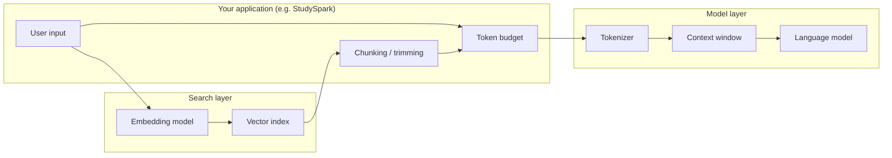

Three responsibilities emerge:

1. **Tokens** — how text is split and billed
2. **Context window** — how much text fits in one model call
3. **Embeddings** — how meaning is compared for search and retrieval (intro today; deep dive Day 15)

These ideas matter because AI systems are **constrained systems**, not infinite ones. Every product decision — prompt length, chat history, document upload, search quality — runs into these limits.

## Why These Concepts Matter
An LLM does not read raw text the way a human does. It operates on tokenized input inside a fixed context window. Your app must plan around that reality.

Without token awareness, teams discover limits through surprise bills and truncated answers. Without context planning, long conversations silently drop early details. Without embeddings (later combined with chunking), you either stuff entire documents into the prompt or miss relevant passages.

| Problem | Concept that helps |
| --- | --- |
| "Our API bill doubled" | Token counting and budgeting |
| "The model forgot what we said earlier" | Context window and history trimming |
| "Search only works for exact keywords" | Embeddings and semantic similarity |
| "We cannot fit the whole PDF in one prompt" | Chunking + retrieval (Days 15–17) |

StudySpark will eventually ingest study notes, embed them, and retrieve the best chunks before asking the model to explain a concept. Today you learn the vocabulary for that pipeline.

## Deep Theory

### What is a token?
A **token** is a small piece of text the model processes as one unit. Tokenization is the step that converts raw strings into token IDs before the model runs.

Tokens are not always words. A token can be:

- a whole word (`"hello"`)
- part of a word (`"ing"` in `"learning"`)
- punctuation (`"?"`)
- whitespace or symbols depending on the tokenizer
- a common multi-word fragment treated as one token

That is why **sentence length ≠ token count**. The phrase `"ChatGPT"` might be one token; `"unbelievable"` might split into multiple pieces; code and JSON often consume more tokens per line than plain English.

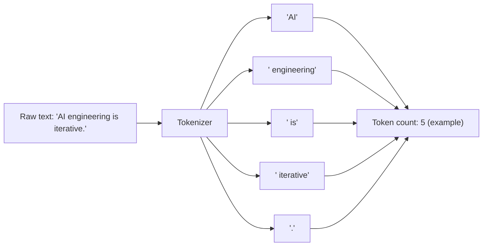

**Feynman version:** Imagine cutting a sentence into puzzle pieces the model has seen during training. The cuts follow statistical patterns, not your grammar textbook.

#### Why English is not the only surprise
Tokenizers are trained on large corpora. Implications:

- Common English phrases may pack efficiently
- Rare words, typos, and some languages produce **more tokens per idea**
- Code, URLs, and base64 inflate token counts quickly
- Repeated whitespace and formatting can waste tokens

For global products, token efficiency is a fairness and cost issue, not just a technical detail.

### Why token counts matter
Token counts affect **cost**, **latency**, and **fit**.

**Cost:** Most hosted APIs charge per token (input and output priced separately). Doubling prompt size roughly doubles input cost for that request. At scale, unbounded prompts become a budget problem.

**Latency:** More tokens to process usually means more compute time before the first response token and before completion. Long prompts feel slower even on fast models.

**Context fit:** Everything you send — system instructions, retrieved documents, chat history, tool results, and the user's message — must fit inside the context window together with the model's answer.

| Factor | Grows with tokens | Product impact |
| --- | --- | --- |
| API bill | Yes | Margin, pricing, feature gating |
| Time to first token | Often | Perceived responsiveness |
| Error risk (truncation) | When near window limit | Wrong or incomplete answers |
| Cache efficiency | Varies by provider | Repeated prefix cost |

**Rule of thumb for planning:** Count tokens *before* shipping a feature, not after reading the invoice.

### Counting tokens in practice
Exact counts depend on the tokenizer tied to each model family. Tools and libraries help:

- OpenAI Tokenizer (web tool) for OpenAI models
- `tiktoken` in Python for OpenAI-compatible counting
- Provider SDKs that return `usage` after each call

For early design, even a rough estimate beats ignorance. A common teaching approximation:

- ~4 characters per token for English prose (very rough)
- ~0.75 words per token on average for English (also rough)

Use approximations for brainstorming; use the real tokenizer for production budgets.

### What is a context window?
The **context window** (or context length) is the maximum number of tokens the model can attend to in **one forward pass** — input plus output together, depending on how the provider documents limits.

If your prompt, conversation history, retrieved chunks, and expected answer do not fit, something must give:

- older messages drop off (in rolling chat UIs)
- middle sections are summarized or compressed
- retrieval returns fewer or shorter chunks
- the request fails with a validation error
- the model sees a truncated input and may hallucinate missing context

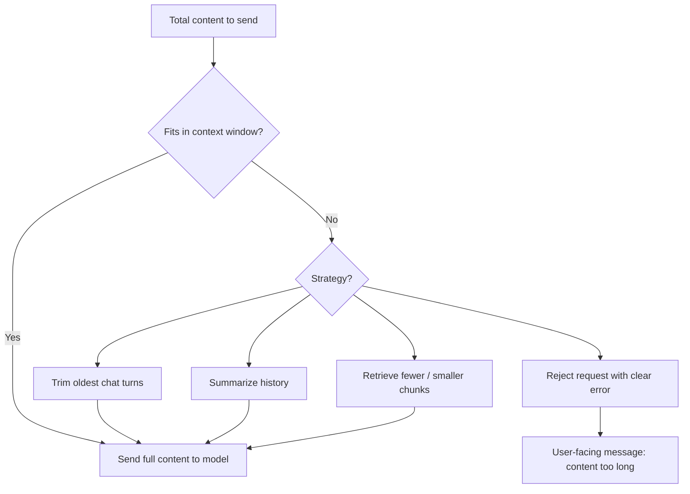

**Analogy:** The context window is a whiteboard of fixed size. You can write a lot, but when it is full, you must erase or summarize before adding more.

#### Input vs output budgeting
Smart applications reserve space for the answer. If the window is 8,000 tokens and you use 7,900 on input, the model has only 100 tokens to reply — enough for a sentence, not an essay.

A simple budget formula:

```text
input_tokens + max_output_tokens ≤ context_window_limit
```

StudySpark should enforce this in configuration (see capstone update below) so tutors never starve the model of answer space.

### Context window sizes change over time
Early GPT-era windows were a few thousand tokens. Modern models advertise 128k, 200k, or more. Larger windows help, but they do not remove engineering tradeoffs:

- bigger prompts still cost more and run slower
- models may not use all long context equally well ("lost in the middle" effects)
- retrieval quality still matters; dumping everything invites noise

Larger windows change **how** you design, not **whether** you design.

### Chunking: the standard response to long content
When a document exceeds the window, split it into **chunks** — sections small enough to embed, index, and retrieve selectively.

Good chunks:

- carry local meaning (a section, paragraph group, or note card)
- include metadata (title, page, date, course module)
- overlap slightly with neighbors when needed to preserve continuity

Bad chunks:

- arbitrary 500-character slices that split sentences mid-thought
- entire textbooks as one vector
- chunks with no metadata, making citations impossible

Chunking connects Day 3 to Day 17 (RAG). Today: understand *why* chunks exist. Later: optimize size and overlap with data.

### What are embeddings? (Introduction only)
An **embedding** is a list of numbers (a vector) that represents the meaning of text in a high-dimensional space. Texts with similar meaning tend to have vectors that are close together.

You do not need to compute embeddings by hand. An **embedding model** converts text to vectors; your application stores and searches them.

```mermaid
flowchart TD
    Q[User query: "How do I study neural nets?"] --> EQ[Embedding model]
    D1[Doc: "Backpropagation basics"] --> ED1[Embedding model]
    D2[Doc: "Weekly meal prep"] --> ED2[Embedding model]
    EQ --> VQ[Query vector]
    ED1 --> V1[Doc vector]
    ED2 --> V2[Doc vector]
    VQ --> Sim[Similarity scoring]
    V1 --> Sim
    V2 --> Sim
    Sim --> Rank["Rank: Doc 1 > Doc 2"]
```

**Similarity** is measured with metrics like cosine similarity or dot product. Higher similarity means closer meaning — not guaranteed factual correctness.

#### What embeddings are good for
- semantic search ("find notes about gradients" even if the word "gradient" never appears)
- clustering related content
- recommendations and deduplication
- retrieval before generation (RAG)

#### What embeddings are not
- they do not store truth — only statistical relationships learned from training data
- they are not a privacy mechanism — raw text may still be recoverable in some setups
- they do not replace logic — arithmetic and policy checks still need code
- they are not magic retrieval — bad chunks and bad metadata still fail

> **Go deeper on Day 15:** embedding models, vector dimensions, cosine vs dot product, batching, re-ranking, hybrid search, and building StudySpark's note index. Today: know *what* embeddings do and *when* to reach for them.

### Keyword search vs semantic search

| Approach | Matches on | Strength | Weakness |
| --- | --- | --- | --- |
| Keyword (BM25, exact) | Shared terms | Precise IDs, codes, names | Misses paraphrases |
| Semantic (embeddings) | Meaning similarity | Natural language questions | Can confuse related but different topics |
| Hybrid | Both | Production default for many apps | More moving parts |

Example: a user searches `"How do I ask the model better questions?"` Keyword search may miss a note titled `"Prompt engineering checklist"`. Semantic search can connect them.

### Advantages of thinking in tokens and context early
- makes cost and performance predictable
- forces explicit product limits (max upload size, max history)
- improves prompt design discipline before Day 4
- prepares you for retrieval architecture without panic later

### Limitations and honest tradeoffs
- tokenization is unintuitive across languages and formats
- context windows are finite even when marketing numbers grow
- embeddings approximate meaning; they do not understand like humans
- similarity can surface plausible-but-wrong documents (semantic false positives)
- over-reliance on large context can hide retrieval bugs

### Alternatives and complements
- **Keyword search** — exact SKU, error codes, legal citations
- **Rule-based truncation** — keep last N turns for simple chatbots
- **Summarization** — compress old history (costs tokens once, saves many later)
- **Structured databases** — when answers live in SQL, not prose
- **Fine-tuned routers** — classify queries before choosing search strategy

## Historical Background
Understanding how these constraints evolved helps you read documentation and marketing clearly.

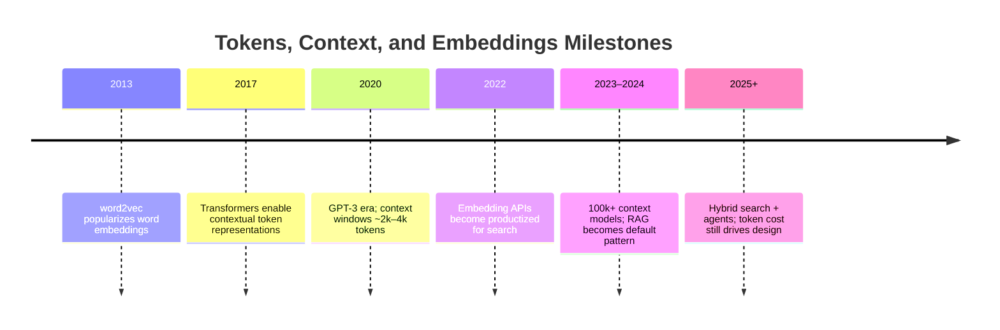

Early systems used bag-of-words and keyword search. Neural embeddings improved semantic matching. Large language models brought long contexts, but **RAG** — retrieve relevant chunks, then generate — remains standard because it is cheaper, more controllable, and easier to update than stuffing entire corpora into every prompt.

## Visual Learning

### Token lifecycle from user text to bill
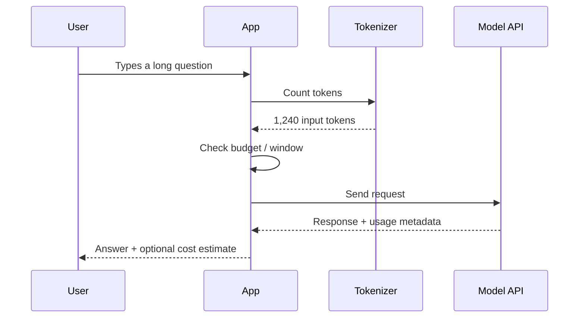

### Context window as a finite container
```mermaid
block-beta
    columns 1
    block:Context window (e.g. 8k tokens)
        SYS["System instructions"]
        HIST["Chat history"]
        RET["Retrieved chunks"]
        USER["User message"]
        OUT["Reserved for output"]
    end
```

### Chunking strategy overview
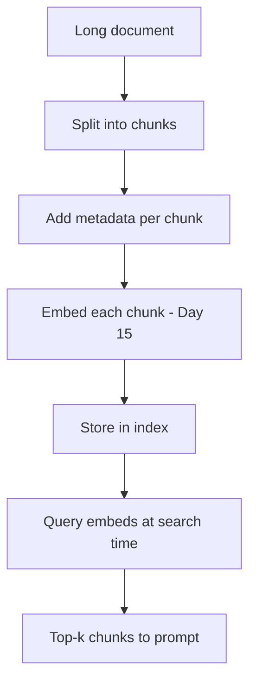

### StudySpark data path (preview)
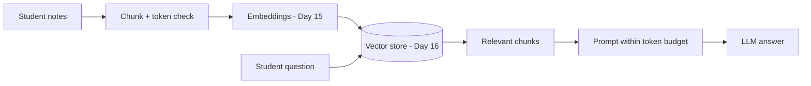

### Token budgeting decision tree
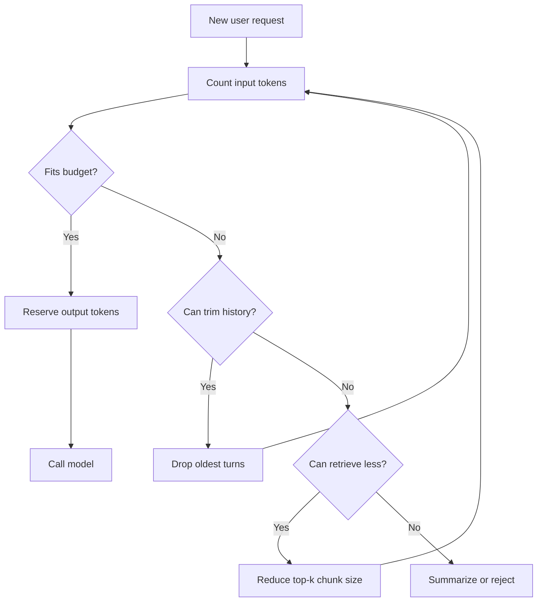

### Semantic vs keyword retrieval
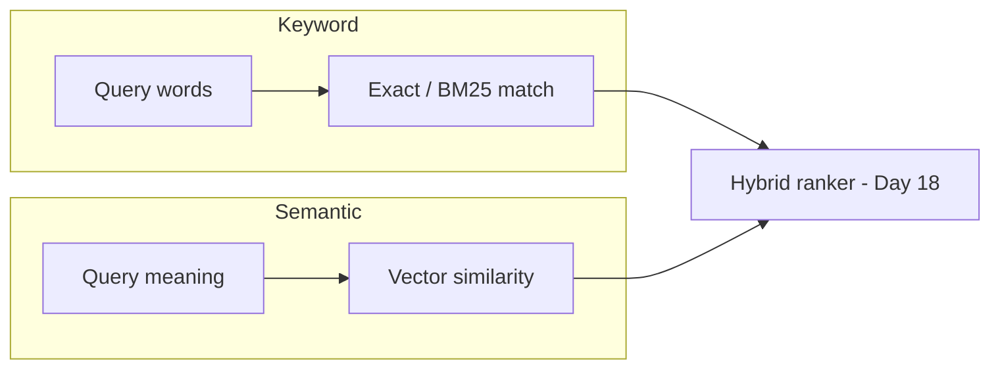

### Embedding space intuition (2D simplification)
```mermaid
quadrantChart
    title Simplified embedding space (conceptual)
    x-axis Low --> High "Math content"
    y-axis Low --> High "Study skills"
    quadrant-1 Math + study habits
    quadrant-2 Pure math
    quadrant-3 Unrelated
    quadrant-4 Pure study skills
    "Backprop note": [0.85, 0.35]
    "Pomodoro note": [0.20, 0.90]
    "Recipe blog": [0.10, 0.15]
```

### Cost drivers mind map
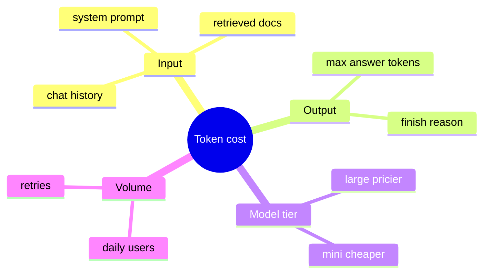

## Code Walkthrough

Examples use teaching approximations where noted. For production, use provider tokenizers and `usage` fields from API responses.

### Example 1: Python — rough token estimate for planning
```python
def rough_token_estimate(text: str) -> int:
    """Teaching helper only — not for billing."""
    words = text.split()
    return max(1, int(len(words) / 0.75))

sample = "AI engineering is practical, iterative, and budget-aware."
print("Rough tokens:", rough_token_estimate(sample))
```

#### Code Explanation
- `split()` approximates words; real tokenizers split differently.
- Dividing by `0.75` reflects the rough "words to tokens" heuristic for English.
- `max(1, ...)` avoids zero for tiny strings.
- Use this in spreadsheets and design docs, not invoices.

### Example 2: TypeScript — rough token estimate
```typescript
function roughTokenEstimate(text: string): number {
  const words = text.trim().split(/\s+/).filter(Boolean);
  return Math.max(1, Math.round(words.length / 0.75));
}

const sample = 'AI engineering is practical, iterative, and budget-aware.';
console.log('Rough tokens:', roughTokenEstimate(sample));
```

#### Code Explanation
- `trim()` and `/\s+/` handle extra whitespace cleanly.
- Same heuristic as Python keeps cross-language planning consistent.
- Document clearly that this is not provider-accurate.

### Example 3: Python — context budget check
```python
CONTEXT_WINDOW = 8_000
INPUT_TOKENS = 6_200
RESERVED_OUTPUT = 1_200

fits = INPUT_TOKENS + RESERVED_OUTPUT <= CONTEXT_WINDOW
remaining = CONTEXT_WINDOW - INPUT_TOKENS - RESERVED_OUTPUT

print("Fits:", fits)
print("Output headroom:", remaining)
```

#### Code Explanation
- `CONTEXT_WINDOW` should come from model config, not magic numbers in code.
- `RESERVED_OUTPUT` protects answer space — tie it to `max_tokens`.
- `remaining` shows how much output room you actually have.
- Negative `remaining` means you must trim input before calling the model.

### Example 4: TypeScript — context budget with guard
```typescript
const CONTEXT_WINDOW = 8000;
const inputTokens = 6200;
const reservedOutput = 1200;

const total = inputTokens + reservedOutput;
const fits = total <= CONTEXT_WINDOW;
const remaining = CONTEXT_WINDOW - inputTokens - reservedOutput;

if (!fits) {
  throw new Error(`Prompt too large: ${total} tokens > ${CONTEXT_WINDOW}`);
}

console.log({ fits, remaining });
```

#### Code Explanation
- Throwing early prevents silent truncation at the API layer.
- Surfacing numbers in errors helps debugging and support.
- Mirror this check in StudySpark before any paid API call.

### Example 5: Python — trim chat history by token budget
```python
def trim_history(messages: list[dict], max_tokens: int) -> list[dict]:
    """Keep newest messages until budget is exhausted (rough count)."""
    kept = []
    used = 0
    for message in reversed(messages):
        estimate = rough_token_estimate(message["content"])
        if used + estimate > max_tokens:
            break
        kept.append(message)
        used += estimate
    return list(reversed(kept))
```

#### Code Explanation
- `reversed(messages)` prioritizes recent turns — usually most relevant.
- This teaching version uses rough estimates; production uses real token counts.
- Always keep system instructions outside this trim loop.

### Example 6: TypeScript — chunking long text by character windows
```typescript
function chunkText(text: string, size: number, overlap: number): string[] {
  const chunks: string[] = [];
  let start = 0;
  while (start < text.length) {
    const end = Math.min(start + size, text.length);
    chunks.push(text.slice(start, end));
    if (end === text.length) break;
    start = end - overlap;
  }
  return chunks;
}

const note = 'Paragraph one.\n\nParagraph two with more detail.';
console.log(chunkText(note, 40, 10));
```

#### Code Explanation
- Fixed-size chunking is a starting point, not the final strategy.
- `overlap` preserves context across boundaries.
- Prefer sentence-aware chunking for StudySpark notes when you implement ingestion.

### Example 7: Python — cosine similarity between two vectors
```python
import math

def cosine_similarity(a: list[float], b: list[float]) -> float:
    dot = sum(x * y for x, y in zip(a, b))
    norm_a = math.sqrt(sum(x * x for x in a))
    norm_b = math.sqrt(sum(x * x for x in b))
    if norm_a == 0 or norm_b == 0:
        return 0.0
    return dot / (norm_a * norm_b)

query = [0.2, 0.8, 0.1]
doc_match = [0.18, 0.77, 0.12]
doc_miss = [0.9, 0.1, 0.05]

print("Match:", cosine_similarity(query, doc_match))
print("Miss:", cosine_similarity(query, doc_miss))
```

#### Code Explanation
- Cosine similarity ranges from -1 to 1; higher means closer direction in space.
- Real embeddings have hundreds or thousands of dimensions, not three.
- Day 15 covers when to normalize vectors and how providers compute similarity.

### Example 8: TypeScript — rank documents by similarity
```typescript
function cosineSimilarity(a: number[], b: number[]): number {
  const dot = a.reduce((sum, val, i) => sum + val * b[i], 0);
  const normA = Math.sqrt(a.reduce((sum, val) => sum + val * val, 0));
  const normB = Math.sqrt(b.reduce((sum, val) => sum + val * val, 0));
  if (normA === 0 || normB === 0) return 0;
  return dot / (normA * normB);
}

const query = [0.2, 0.8, 0.1];
const docs = [
  { id: 'backprop', vector: [0.18, 0.77, 0.12] },
  { id: 'cooking', vector: [0.9, 0.1, 0.05] },
];

const ranked = docs
  .map((d) => ({ ...d, score: cosineSimilarity(query, d.vector) }))
  .sort((a, b) => b.score - a.score);

console.log(ranked);
```

#### Code Explanation
- Sorting by `score` implements top-k retrieval.
- Production systems store vectors in a database (Day 16), not in-memory arrays.
- Always return `id` and metadata so the UI can cite sources.

### Example 9: Python — StudySpark-style request budget config
```python
STUDYSPARK_LIMITS = {
    "context_window": 8000,
    "max_input_tokens": 6000,
    "max_output_tokens": 1200,
    "max_retrieved_chunks": 5,
    "max_chunk_tokens": 400,
}

def validate_request(input_tokens: int, output_tokens: int) -> dict:
    ok = (
        input_tokens <= STUDYSPARK_LIMITS["max_input_tokens"]
        and output_tokens <= STUDYSPARK_LIMITS["max_output_tokens"]
        and input_tokens + output_tokens <= STUDYSPARK_LIMITS["context_window"]
    )
    return {"ok": ok, "limits": STUDYSPARK_LIMITS}
```

#### Code Explanation
- Central limits in config mirror what you will add to `projects/studyspark/app/config.py`.
- Separate caps for chunks prevent retrieval from eating the whole window.
- Returning structured results makes testing easy.

### Example 10: TypeScript — log token usage after a mock response
```typescript
type Usage = { prompt_tokens: number; completion_tokens: number; total_tokens: number };

function estimateCostUsd(usage: Usage, inputPerM: number, outputPerM: number): number {
  const inputCost = (usage.prompt_tokens / 1_000_000) * inputPerM;
  const outputCost = (usage.completion_tokens / 1_000_000) * outputPerM;
  return inputCost + outputCost;
}

const usage: Usage = { prompt_tokens: 900, completion_tokens: 220, total_tokens: 1120 };
console.log('Estimated USD:', estimateCostUsd(usage, 0.15, 0.6).toFixed(6));
```

#### Code Explanation
- `usage` mirrors API response fields you will log in production.
- Price constants should live in config and change without code edits.
- Logging per request makes cost regressions visible after prompt changes.

## Practical Examples

### Beginner Example: Why your prompt felt slow
You paste a five-page article into a chatbot and ask for a summary. The response takes noticeably longer than a one-sentence question.

Why:

- more input tokens take more time to process
- the model may generate a longer answer unless you cap it
- you are paying for every token in that article

**Better approach:** summarize in chunks, or retrieve only relevant sections (Days 15–17).

### Intermediate Example: Conversation "forgetfulness"
A student explains their project context in message one. Twenty messages later, the model ignores an constraint from early in the chat.

Why:

- the app may drop old messages when history exceeds the window
- even if kept, very long context can dilute important details

**Better approach:** rolling window with summaries; store durable facts in a database (Day 19–20 memory topics).

### Advanced Example: Token budget for RAG
A retrieval pipeline fetches five chunks of 400 tokens each, plus a 500-token system prompt, plus 200 tokens of user question. That is 2,700 input tokens before answer generation.

Engineering tasks:

- measure retrieval contribution to cost
- tune `max_chunk_tokens` and `top_k`
- A/B test answer quality vs spend

### Production Example: Hybrid search in a company wiki
Notion, Confluence, and internal doc tools often combine keyword filters with semantic ranking. A query for `"Q3 onboarding checklist"` might use keyword match on `"Q3"` and embeddings for `"new hire setup tasks"`.

Why professionals use hybrid search:

- codes and IDs need exact matches
- natural language needs paraphrase tolerance
- metadata filters (team, ACL) must apply before similarity

### Real-World Company Example: GitHub Copilot context limits
Copilot does not send your entire repository every keystroke. It selects relevant files and snippets within a token budget. The product feels magical because **retrieval and trimming** happen behind the scenes — not because the model has unlimited context.

## Best Practices
- count tokens before shipping features; log `usage` after every call
- reserve explicit output headroom; never fill the entire window with input
- keep system instructions stable and relatively short
- chunk long documents with meaningful boundaries and metadata
- prefer retrieval over stuffing when content exceeds a few thousand tokens
- treat embeddings as a search layer — validate retrieved text before generation
- document limits in user-facing copy (max file size, max message length)
- test with worst-case prompts: long chats, large uploads, empty queries
- plan for multilingual and code-heavy token inflation
- version your chunking and budget settings like any other config

## Common Mistakes
- assuming one word equals one token
- ignoring output tokens in context budgeting
- stuffing entire PDFs into prompts "because the window is huge"
- embedding huge documents without chunking
- comparing embedding similarity without inspecting the actual chunk text
- treating semantic similarity as truth or permission checks
- no metadata on chunks, making citations and debugging impossible
- changing chunk size without re-evaluating answer quality
- using rough token estimates for billing reconciliation
- forgetting that trimming chat history changes behavior

### Debugging Strategy
When outputs seem wrong, slow, or expensive, ask in order:

1. **How many input and output tokens did we use?** Check logs and `usage`.
2. **Did we exceed the context window or our own caps?** Look for truncation errors.
3. **What was retrieved?** Inspect chunk text, not just similarity scores.
4. **Are chunks too large or too small?** Oversized chunks waste budget; tiny ones lose meaning.
5. **Is the tokenizer inflating certain content?** Code, tables, and JSON are common culprits.
6. **Did we reserve enough tokens for the answer?** Starved outputs look like model failures.
7. **Are we solving the right problem?** Sometimes you need SQL or rules, not more context.

## Performance

### Cost
Token usage is the primary driver of variable LLM cost. Input-heavy features (long prompts, big retrieval) dominate spend for many apps. Output tokens often cost more per million than input on some tiers.

Mitigations: smaller models for routing, aggressive caching of prefixes, summarization, better retrieval precision (fewer chunks), lower `max_tokens`.

### Latency
Time to first token and total completion time grow with prompt size and output length. Network and queueing add overhead at scale.

Mitigations: trim history, parallelize non-LLM work, stream responses (Day 13), precompute embeddings offline.

### Memory and storage
Embedding indexes store vectors and metadata. Chat history storage grows with active users. Neither is free on mobile or self-hosted setups.

Mitigations: prune old vectors on document delete, compress metadata, tier storage by age.

### Scalability
Systems scale when budgets and retrieval are **config-driven** and observable. Hard-coded prompts that grow weekly do not.

## Security
Token and embedding layers touch sensitive data.

- **Data exposure:** Long prompts may include secrets; retrieval can surface documents the user should not see.
- **Access control:** Apply permissions before embedding and before returning chunks — not after generation.
- **Prompt injection via retrieved text:** Untrusted documents can contain instructions; sanitize and separate trusted system policy (Day 28 guardrails).
- **Logging:** Token counts are safe to log; full prompts may not be.
- **Embeddings are not encryption:** Store secrets in vaults, not in vector indexes.

## Evaluation

### What to measure
- input and output token counts per feature
- context utilization (% of window used)
- retrieval precision@k (did the right chunk appear in top results?)
- answer quality conditional on retrieved chunk (human or LLM-judge)
- cost per successful task
- latency p50 / p95 vs prompt size
- truncation and oversize error rate

### Evaluation checklist
1. Does the prompt fit within configured caps with output reserved?
2. Do retrieval queries return relevant chunks on a labeled test set?
3. Does trimming history preserve critical constraints?
4. Are token regressions visible after prompt or retrieval changes?
5. Do edge cases (empty input, huge paste, non-English) behave predictably?

### Simple offline test cases
- 50-token question vs 5,000-token paste — compare latency and cost estimates
- query paraphrased to miss keywords but match meaning semantically
- document set where wrong chunk is superficially similar (test false positives)
- chat with 30 turns — verify trimming policy keeps the right instructions

## Exercises

### Easy
1. In your own words, what is a token?
2. Why is a token not always the same as a word?
3. What is a context window?
4. Name two things that grow when you add more tokens.
5. What do embeddings represent at a high level?
6. Why might a five-page paste feel slower than a one-line question?
7. What is chunking and why does it exist?
8. True or false: larger context windows eliminate the need for retrieval. Explain.

### Medium
9. Estimate rough tokens for a 200-word email using the 0.75 words-per-token heuristic.
10. A model has an 8k window. Input is 7,500 tokens. How much room is left for output?
11. Explain the difference between keyword search and semantic search with one example each.
12. Why should applications reserve tokens for the model's answer?
13. List three metadata fields you would store with each StudySpark note chunk.
14. Describe what happens when chat history exceeds the context budget.
15. Why are embeddings useful but not the same as truth?
16. Compare trimming vs summarizing old chat history — pros and cons.

### Hard
17. Design a token budget table for StudySpark: system prompt, retrieval, user input, output.
18. Propose chunk sizes for lecture notes vs code snippets. Justify your choices.
19. Given similarity scores 0.82, 0.80, 0.79 for three chunks, why should you still read the text?
20. Explain "lost in the middle" and how it affects long-context prompting.
21. Write pseudocode for hybrid search: keyword filter first, then semantic rank.
22. A feature's cost tripled after adding retrieval. List five investigative steps.
23. Design an error message users see when their upload exceeds token limits.
24. When would you choose keyword-only search over embeddings?

### Challenge
25. Build a spreadsheet or script that estimates monthly cost from DAU, requests per user, and average tokens.
26. Implement sentence-aware chunking (split on `.` or newline) in Python or TypeScript.
27. Create a labeled set of ten query → expected document pairs for a fake course corpus.
28. Draft StudySpark `config` limits with comments explaining each field.
29. Explain how Day 4 prompt design will change if input tokens are expensive.
30. Sketch the pipeline from raw note to embedded chunk to prompt injection (no API required).

### Reflection Questions
31. Which matters more for your capstone right now: cost, speed, or answer quality? Why?
32. Where will you log token usage in StudySpark, and who will read those logs?
33. What content will you refuse to send to a hosted model in your jurisdiction or industry?
34. How will you explain context windows to a non-technical teammate in two sentences?
35. What do you want to learn on Day 15 about embeddings that you do not know today?

## Quizzes

### Quiz 1 — Tokens
1. What is a token in an LLM pipeline?
2. Why does `"unbelievable"` sometimes use more tokens than `"cat"`?
3. Name two product impacts of high token counts.
4. Is `len(text.split())` always equal to provider token count?

**Answers:** 1. A small piece of text the model processes as one unit  2. Tokenizers split rare/long words into subword pieces  3. Any two of: cost, latency, context fit  4. No — real tokenizers differ from whitespace splitting

### Quiz 2 — Context windows
1. What does the context window limit?
2. What should you reserve tokens for besides user input?
3. Name one strategy when content exceeds the window.
4. Does a larger window automatically mean better answers?

**Answers:** 1. Total tokens the model can handle in one request (input + output, per provider docs)  2. Model output / completion  3. Any of: trim history, summarize, chunk, retrieve less, reject  4. No — cost, latency, and noise still matter; long context can dilute focus

### Quiz 3 — Embeddings intro
1. What is an embedding vector?
2. What does high cosine similarity suggest?
3. Do embeddings guarantee factual correctness?
4. Which day goes deep on embeddings in this course?

**Answers:** 1. A numeric representation of text meaning  2. The texts are semantically similar  3. No — they capture meaning relationships, not truth  4. Day 15

### Quiz 4 — Chunking and retrieval
1. Why chunk long documents?
2. What is a semantic false positive?
3. Name one piece of metadata to store per chunk.
4. Keyword search is best for what kind of query?

**Answers:** 1. So they fit context limits and can be retrieved selectively  2. A chunk ranks high by similarity but is not actually relevant  3. Any of: title, source, page, course module, ACL  4. Exact IDs, codes, SKUs, error strings

### Quiz 5 — StudySpark and budgeting
1. What file in the repo tracks capstone progress?
2. What should `max_output_tokens` protect?
3. Name one config field you might add to `projects/studyspark/app/config.py` today.
4. Why log `prompt_tokens` and `completion_tokens` separately?

**Answers:** 1. `projects/CAPSTONE.md`  2. Enough space for the model to complete its answer  3. Any of: context window, max input, max chunk tokens, max retrieved chunks  4. Input and output are priced and optimized differently

## Interview Questions

### Conceptual
- Explain tokens to a product manager worried about API bills.
- What is the context window, and what happens when you exceed it?
- Compare keyword search, semantic search, and hybrid search.
- Why do production systems use RAG instead of stuffing full documents?
- What are embeddings, and what are their limitations?

### Practical
- How would you implement a token budget check before an API call?
- How would you trim chat history without losing system instructions?
- Walk through designing chunk size for a documentation site.
- How do you debug a retrieval system that returns plausible but wrong chunks?
- What metrics would you dashboard for token usage?

### System Design
- Design note ingestion and search for StudySpark within a fixed monthly token budget.
- Design a hybrid retrieval stack for a 10-million-document enterprise wiki with ACLs.
- How would you handle users pasting content that exceeds context limits?
- Design caching for repeated system prompts and retrieved corpora.

### Debugging
- Costs spiked 3x after a release. How do you investigate?
- Users report the model "forgot" constraints. What do you check?
- Latency grew after enabling retrieval. What are likely causes?
- Similarity scores look high but answers are wrong. What next?

## Mini Project
Build a **token and retrieval budget spec** for StudySpark — no API key required.

### Goal
Document how StudySpark will count tokens, enforce context limits, and prepare for semantic note search (embedding implementation on Day 15).

### Features
- define `context_window`, `max_input_tokens`, `max_output_tokens` in a config module or doc
- implement `rough_token_estimate` in Python or TypeScript
- implement `validate_request` that fails fast when limits are exceeded
- draft chunking rules for student notes (size, overlap, metadata)
- create three example notes and show how they would be split into chunks
- write five test queries: which chunks should retrieval return?

### Suggested Folder Structure
```text
projects/studyspark/
├── app/
│   └── config.py          # add STUDYSPARK_LIMITS today
├── docs/
│   └── day_03_token_budget.md
└── tests/
    └── test_token_budget.py   # optional
```

Or keep everything in `projects/CAPSTONE.md` if you are not coding yet — both paths are valid for Week 1.

### Project Steps
1. read [`projects/studyspark/README.md`](../../projects/studyspark/README.md) and [`projects/CAPSTONE.md`](../../projects/CAPSTONE.md)
2. add token limit constants to `app/config.py` (or your spec doc)
3. implement rough token counting and a budget validation function
4. write chunking rules for notes (target 300–500 tokens per chunk with overlap)
5. split two sample notes into chunks with metadata (`course`, `topic`, `source`)
6. for each test query, list which chunk IDs should rank highest and why
7. note one open question to answer on Day 15 about embeddings

### Acceptance Criteria
- limits are explicit numbers, not vague guidance
- validation returns structured errors with token counts
- chunking examples preserve sentence meaning (no mid-word splits in samples)
- you can explain why retrieval beats pasting whole notes into the prompt
- capstone checklist updated (see below)

### What You Learn
- how to turn abstract limits into config and code
- how chunking connects context windows to future RAG
- how to preview semantic search without building a vector database yet

## Cumulative Capstone Update

Add to [`projects/CAPSTONE.md`](../../projects/CAPSTONE.md):

- **token budget** guidelines for StudySpark prompts (max context per request)
- **chunk size notes** for future note ingestion (preview of Day 15)
- suggested config keys for `projects/studyspark/app/config.py`:
  - `CONTEXT_WINDOW`
  - `MAX_INPUT_TOKENS`
  - `MAX_OUTPUT_TOKENS`
  - `MAX_RETRIEVED_CHUNKS`
  - `MAX_CHUNK_TOKENS`
- a one-paragraph note: embeddings intro complete today; implementation deferred to Day 15

Example capstone architecture after Day 3:

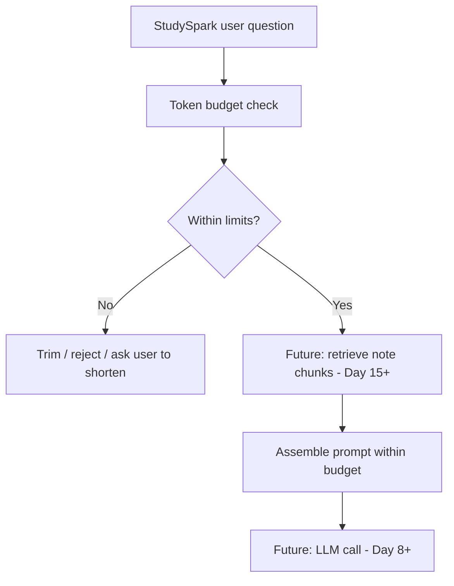

## Summary
Tokens are how models measure text; they drive cost, latency, and fit. Context windows cap what a single request can see — budget input and output together. Embeddings represent meaning for search and retrieval; they are introduced today and explored deeply on **Day 15**.

Understanding these limits early makes prompt engineering (Day 4), APIs (Days 6–9), and RAG (Days 15–17) much easier. StudySpark stays cheaper and more reliable when you count tokens before you send them.

[Previous: Day 2 - How Large Language Models Work](../day_02/day_02_how_large_language_models_work.md) | [Next: Day 4 - Prompt Engineering Fundamentals](../day_04/day_04_prompt_engineering_fundamentals.md)

## Further Reading
- [OpenAI Tokenizer](https://platform.openai.com/tokenizer) — visualize how text becomes tokens
- [tiktoken documentation](https://github.com/openai/tiktoken) — Python token counting for OpenAI models
- [Google Gemini embeddings overview](https://ai.google.dev/gemini-api/docs/embeddings) — provider embedding API shape (implement on Day 15)
- [Pinecone: What are embeddings?](https://www.pinecone.io/learn/series/faiss/) — gentle vector search primer
- [Hugging Face NLP Course — Tokenization](https://huggingface.co/learn/nlp-course/chapter6/1) — how tokenizers work under the hood
