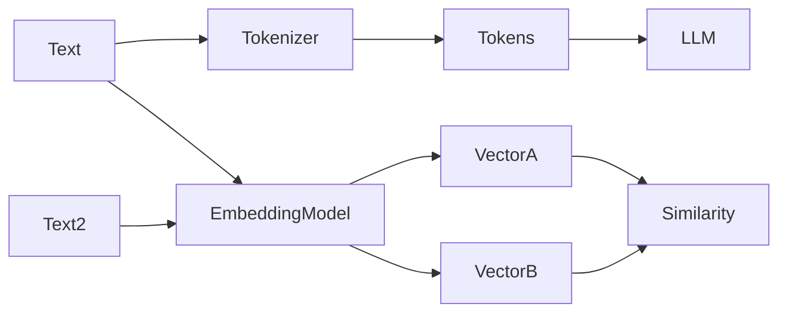
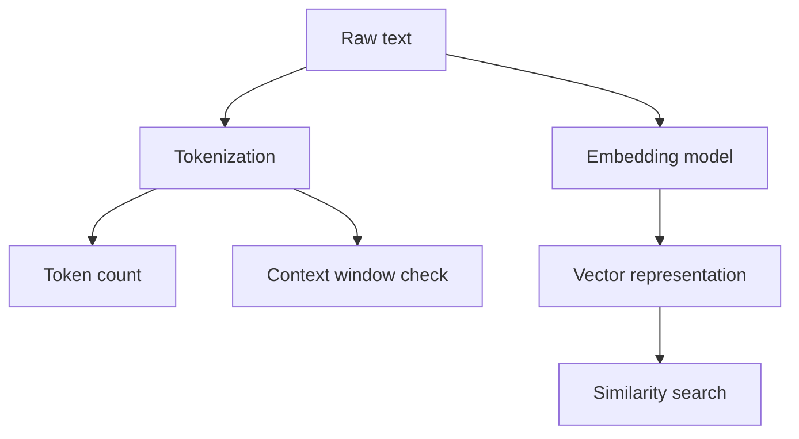
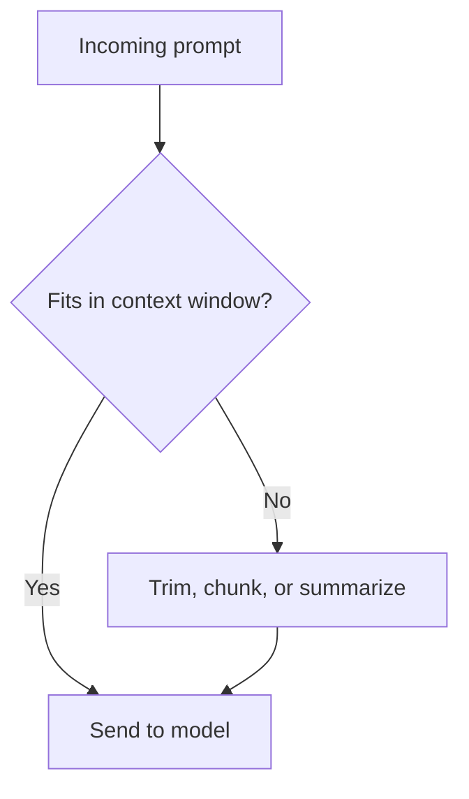
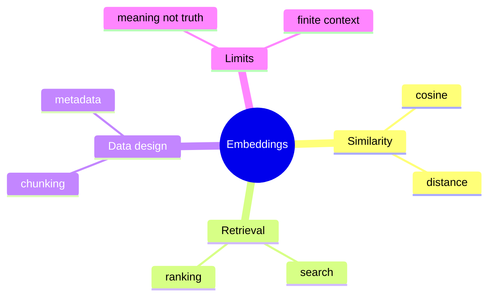

# Day 3 - Tokens, Context Windows, and Embeddings

[Previous: Day 2 - How Large Language Models Work](../day_02/day_02_how_large_language_models_work.md) | [Next: Day 4 - Prompt Engineering Fundamentals](../day_04/day_04_prompt_engineering_fundamentals.md)

## Introduction
Yesterday you learned how LLMs generate text. Today you learn the units and limits that shape that generation.

Tokens are the units an LLM reads and writes. The context window is the amount of text the model can consider at one time. Embeddings are numerical representations of meaning. Together, these three ideas explain a lot of the practical limits and strengths of AI systems.


If you understand tokens, context windows, and embeddings, you can reason about cost, latency, prompt design, semantic search, and retrieval. That makes this one of the most important early lessons in the course.

## Learning Objectives
By the end of this day, you should be able to:

- explain what a token is
- estimate why token count affects cost and latency
- describe the meaning of a context window
- explain embeddings at a high level
- understand when similarity search becomes useful
- describe why long prompts can fail or become expensive
- connect embeddings to retrieval-based AI systems

## Prerequisites
You should already understand:

- Day 2: how LLMs generate text
- basic prompt and application concepts from Day 1

No advanced linear algebra is required yet. This chapter focuses on intuition first.

## Big Picture
Tokens, context windows, and embeddings are part of the model’s operating environment.

- tokens control how the model reads text
- context windows control how much it can consider at once
- embeddings control how meaning can be compared mathematically

These ideas matter because AI systems are constrained systems, not infinite ones.



## Why These Concepts Matter
An LLM is not reading raw text the way a human does. It operates on tokenized input and limited context.

That means:

- longer prompts cost more
- long conversations may lose older details
- embeddings can help you search by meaning instead of exact wording
- retrieval systems depend on good chunking and embedding choices

## Deep Theory

### What is a token?
A token is a unit of text that the model processes.

It is not always a word. It can be:

- a word
- part of a word
- punctuation
- a symbol

That is why the sentence length and token length are not always the same.

### Why token counts matter
Token counts affect:

- cost, because many model APIs charge by token
- latency, because more tokens take longer to process
- context fit, because the model has a maximum window

### What is a context window?
The context window is the maximum amount of tokenized text the model can attend to at once.

If your prompt, conversation history, and retrieved documents exceed that limit, some information may be dropped or compressed.

### Why context windows matter in applications
The context window influences how you design the app.

You may need to:

- summarize older conversation history
- select only the most relevant documents
- chunk long files into smaller pieces
- reserve space for the model’s output

### What are embeddings?
Embeddings are numerical representations of text meaning.

Texts with similar meaning tend to have vectors that are close together in embedding space.

This makes embeddings useful for:

- semantic search
- clustering similar items
- recommendations
- retrieval for AI applications

### Why embeddings are useful
Exact keyword matching is often too narrow.

Embeddings let you match by meaning, so a query like "how do I ask the model better questions?" can still find a document about prompt engineering, even if the words are different.

### Advantages
- tokens make model limits measurable
- context windows make app design more explicit
- embeddings unlock semantic search and retrieval
- all three concepts help control real-world AI behavior

### Limitations
- tokenization can be unintuitive
- context windows are finite
- embeddings do not store truth, only meaning relationships
- semantic similarity can still surface irrelevant results if the data is poor

### Alternatives
- keyword search for exact matches
- rule-based truncation for simple contexts
- manual tagging instead of embeddings for tiny datasets

### When should you use embeddings?
Use embeddings when:

- you want meaning-based search
- your data has natural language content
- you need retrieval or similarity matching

### When should you not use embeddings alone?
Avoid embeddings alone when:

- exact matching matters more than meaning
- the dataset is tiny and simple
- the task needs strict symbolic logic

## Visual Learning

### Token, Context, and Embedding Flow


### Context Window Decision Flow


### Semantic Search Mind Map


## Code Walkthrough

The examples below show simple ways to reason about token count and vector similarity in application code.

### Python Example
```python
text = "AI engineering is practical and iterative."
tokens = text.split()
print("Token estimate:", len(tokens))

embedding_a = [0.12, 0.88, 0.31]
embedding_b = [0.10, 0.85, 0.29]
print("Embeddings are close:", embedding_a, embedding_b)
```

#### Code Explanation
- `split()` gives a rough token estimate for teaching purposes.
- the real tokenizer may count differently from whitespace splitting.
- the two embeddings are similar because their numbers are close.

### TypeScript Example
```typescript
const text = 'AI engineering is practical and iterative.';
const tokens = text.split(' ');
console.log('Token estimate:', tokens.length);

const embeddingA = [0.12, 0.88, 0.31];
const embeddingB = [0.1, 0.85, 0.29];
console.log('Embeddings are close:', embeddingA, embeddingB);
```

#### Code Explanation
- token counting is a practical budgeting step.
- embeddings are represented as vectors of numbers.
- closeness in vector space can be used for retrieval.

### Python Example: Context budget
```python
prompt_tokens = 1200
reserved_for_answer = 300
window_size = 1600

fits = prompt_tokens + reserved_for_answer <= window_size
print("Fits in context window:", fits)
```

#### Code Explanation
- the application should budget for both input and output.
- context planning helps avoid accidental truncation.

### TypeScript Example: Simple similarity intuition
```typescript
const queryVector = [0.2, 0.7, 0.1];
const documentVector = [0.18, 0.74, 0.12];

console.log({ queryVector, documentVector, looksSimilar: true });
```

#### Code Explanation
- the application may compare query and document vectors.
- semantic retrieval uses that closeness to rank results.

## Practical Examples

### Beginner Example: Estimating token usage
If you type a long prompt into a model, it may cost more and take longer.

Why this matters:

- even small prompt changes can affect budget
- long prompts can crowd out the answer space

### Intermediate Example: Chunking a long document
If you want to search a textbook, you cannot always send the whole thing to the model.

Instead, you split it into chunks, embed them, and retrieve only the relevant parts.

Why this works:

- smaller chunks are easier to search
- only relevant chunks need to be placed in the context window

### Professional Example: Semantic knowledge search
A company knowledge assistant can retrieve documents by meaning rather than exact keywords.

Why professionals use this pattern:

- users ask questions in natural language
- the exact query words may differ from the document words
- embeddings improve recall for related concepts

### Real-World Company Example
Search systems inside companies often combine keyword search and embeddings because exact terms matter for some queries while meaning matters for others.

## Best Practices
- count tokens before sending long prompts
- reserve room for the model output
- use embeddings for meaning-based retrieval, not generation
- chunk long documents into manageable pieces
- normalize text before indexing when appropriate
- store metadata alongside vectors so results can be filtered later

## Common Mistakes
- assuming words and tokens are the same
- overfilling the context window
- storing raw text when a vector index would be better
- comparing embeddings with human intuition instead of a metric
- forgetting that embeddings encode meaning, not truth
- embedding huge documents without chunking or metadata strategy

### Debugging Strategy
If retrieval or prompting behaves strangely, ask:

1. Did I count tokens correctly?
2. Did I leave enough room for the output?
3. Are the chunks too large or too small?
4. Are the embeddings being compared correctly?
5. Is the wrong document actually semantically similar?

## Performance

### Cost
More tokens usually mean more cost.

### Latency
Longer inputs and larger retrieval sets can slow the system down.

### Memory
Embedding indexes and conversation history can consume storage and runtime memory.

### Scalability
Good chunking, metadata, and indexing strategies make systems easier to scale.

## Security
Embedding-based search can expose the wrong content if access control is ignored.

- do not index private data without permissions
- do not assume similarity search respects user boundaries automatically
- do not treat embeddings as a privacy mechanism

## Evaluation
You should test both the retrieval layer and the prompt layer.

### What to measure
- token usage
- context fit
- retrieval relevance
- semantic similarity quality
- whether the right chunk was returned

### Useful questions
- Did the prompt fit in the context window?
- Did the retrieval result actually match the user’s intent?
- Did the system return enough context without too much noise?
- Is the semantic search finding relevant items consistently?

## Exercises

### Easy
1. Count the tokens in a short sentence.
2. Explain why a context window matters.
3. Name one reason embeddings are useful.
4. Describe one difference between a token and a word.

### Medium
5. Explain why token count affects cost and latency.
6. Describe what happens when content exceeds the context window.
7. Explain why embeddings help semantic search.
8. Describe why embeddings are not the same as truth.

### Hard
9. Design a chunking strategy for a long document.
10. Explain how you would reserve room for the model output.
11. Describe a scenario where semantic similarity could be misleading.
12. Explain how token budgeting changes prompt design.

### Challenge
13. Describe a use case where embeddings are better than keywords.
14. Compare keyword search and semantic search for one problem.
15. Design a retrieval workflow that uses embeddings and metadata.
16. Explain how context-window limits influence a chat assistant.

## Mini Project
Build a simple semantic note search concept.

### Goal
Write down how a note would be turned into a vector and how a user query would find the closest note.

### Suggested structure
```text
semantic-note-search/
├── notes.md
└── design.md
```

### Project Steps
1. choose a set of notes
2. split them into chunks if needed
3. describe how each note becomes a vector
4. describe how a query becomes a vector
5. explain how similarity is measured
6. describe how the closest note is returned

### What You Learn
- how semantic search works at a conceptual level
- why chunking and token budgeting matter
- how embeddings become the foundation for retrieval later in the course

## Summary
Tokens affect cost and context size. Context windows limit what the model can see. Embeddings allow meaning-based search and retrieval, which becomes critical in real applications.

Understanding these limits early will make the next lessons on prompt engineering and retrieval much easier.

[Previous: Day 2 - How Large Language Models Work](../day_02/day_02_how_large_language_models_work.md) | [Next: Day 4 - Prompt Engineering Fundamentals](../day_04/day_04_prompt_engineering_fundamentals.md)

## Additional Resources
- https://platform.openai.com/tokenizer
- https://ai.google.dev/gemini-api/docs/embeddings
- https://www.pinecone.io/learn/series/faiss/
- https://huggingface.co/learn/nlp-course/chapter6/1
