# Day 4 - Prompt Engineering Fundamentals

[Previous: Day 3 - Tokens, Context Windows, and Embeddings](../day_03/day_03_tokens_context_windows_and_embeddings.md) | [Next: Day 5 - Advanced Prompt Engineering](../day_05/day_05_advanced_prompt_engineering.md)

## Introduction
Day 3 taught you the ingredients: tokens, context windows, and a preview of embeddings. Today you learn the recipe: **prompt engineering**.

Prompt engineering is the skill of writing instructions and context so a language model produces useful, reliable output. It is less about magic phrases and more about clarity, structure, and making the model's job obvious. Think of a prompt like a brief you hand to a skilled contractor. The contractor can build many things — but if your brief says only "make it nice," you will get unpredictable results. If your brief says role, goal, constraints, materials, and deliverable format, you get something you can actually use.


This lesson is written for **beginners**. You do not need API keys, frameworks, or advanced math. You need curiosity, patience, and willingness to test. Every technique here transfers to StudySpark, your course capstone: summarize notes, generate quizzes, explain concepts — all start with well-written prompts.

Day 5 will cover advanced patterns (chain-of-thought, decomposition, self-critique). Today you master the foundation: one clear goal per prompt, separated instructions, explicit output shape, examples when helpful, and a habit of testing before you trust.

By the end of today, you will write prompts that a teammate could maintain, version, and debug — not just prompts that work once in a demo.

## Learning Objectives
By the end of this day, you should be able to:

- write a prompt with one main goal and unambiguous task language
- separate role, goal, context, constraints, and output format into distinct sections
- use 0-shot and few-shot examples appropriately for beginners
- request structured outputs (bullets, JSON, tables) that downstream code can parse
- explain why prompt clarity changes token probabilities and output quality
- iterate on prompts using test cases instead of gut feeling
- identify vague prompts and rewrite them with measurable constraints
- describe when prompt engineering is enough vs when you need retrieval or tools
- create three reusable prompt templates for StudySpark (summarize, quiz, explain)
- debug failing prompts using a structured checklist

## How to Use This Lesson

This lesson is designed for **all skill levels**. Pick one path and follow it consistently.

| Level | Suggested approach | Time |
| --- | --- | --- |
| **Beginner** | Read Introduction → Big Picture → Deep Theory → trace one code example → Easy exercises | 4–6 hours |
| **Intermediate** | Skim objectives → Visual Learning → Code Walkthrough → Medium/Hard exercises → Mini project | 2–4 hours |
| **Advanced** | Deep Theory tradeoffs → Hard/Challenge exercises → extend mini project → capstone slice | 1–3 hours |

### Apply Today
Complete at least one item before moving to the next day:
- [ ] Trace one code example in **Python or TypeScript** (one language is enough)
- [ ] Complete exercises for your level (see Exercises section)
- [ ] Update [`projects/CAPSTONE.md`](../../projects/CAPSTONE.md) with today's capstone item
- [ ] Add today's component to `projects/studyspark/` or update `projects/CAPSTONE.md`.

> **Stuck?** Re-read Big Picture, review Prerequisites, or see [SYLLABUS.md](../../SYLLABUS.md) for path guidance.

## Prerequisites
You should already understand:

- Day 3: tokens, context windows, and why prompts must fit a budget
- Day 2: models predict the next token from prior context
- Day 1: basic vocabulary (LLM, prompt, application)

Prompt engineering clicks faster when you remember: **the model does not "understand" instructions like a human — it continues text in a way that fits the pattern you gave it.** Short prompts save tokens (Day 3) but must still be specific enough to steer generation.

## Big Picture
A good prompt answers four questions for the model:

1. **Who are you pretending to be?** (role)
2. **What job must be done?** (goal)
3. **What information do you have?** (context)
4. **What should the answer look like?** (format and constraints)

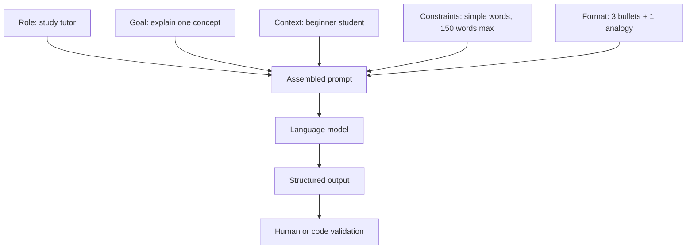

Weak prompts merge everything into one vague paragraph. Strong prompts read like a spec: short sections, bold boundaries, testable requirements.

StudySpark will store prompts as templates in code or config — not as one-off strings scattered in UI handlers. That discipline starts today.

## Why Prompt Engineering Exists
LLMs are flexible generalists. Flexibility without structure produces inconsistency.

Without deliberate prompts, applications commonly see:

- vague, rambling answers
- wrong tone (too formal, too casual, too confident)
- ignored constraints ("keep it short" → five paragraphs)
- inconsistent formatting (bullets sometimes, essays other times)
- hallucinated details when context was insufficient
- fragile demos that break on the next user input

Prompt engineering exists because **you can often improve quality without changing the model** — only the instructions. That is the highest-leverage skill in Week 1.

| Symptom | Likely prompt gap |
| --- | --- |
| Model adds unwanted opinion | Missing neutrality constraint |
| Output too long | No length limit or format |
| Wrong audience level | Role/context not specified |
| JSON breaks parsers | Format not explicit or no schema |
| Inconsistent across users | No examples or test cases |

Day 5 and later days add machinery (retrieval, tools, structured outputs). Those layers still depend on clear base prompts.

## Deep Theory

### What is a prompt?
A **prompt** is the input text (and sometimes images or other modalities) that conditions the model's response. In chat APIs, prompts are often **messages** with roles; in simpler interfaces, a single text box.

A complete prompt may include:

| Component | Purpose | Beginner example |
| --- | --- | --- |
| **Role** | Sets perspective and expertise | "You are a patient CS tutor." |
| **Goal** | States the task | "Explain what a token is." |
| **Context** | Background the model cannot infer | "The reader is on Day 3 of a beginner course." |
| **Constraints** | Limits and rules | "Use sentences under 15 words. No jargon." |
| **Output format** | Shape of the answer | "Return exactly 3 bullet points." |
| **Examples** | Demonstrate desired behavior | One sample input/output pair (few-shot) |

Not every prompt needs every section. A classification task might skip role; a creative brainstorm might relax format. **Beginners should default to including role, goal, and format** — then trim only when tests prove extra sections are unnecessary.

### Why prompts work (without mysticism)
From Day 2: the model predicts the next token given all prior tokens. Your prompt becomes part of that prior context. Phrases like "Return JSON" and "Use three bullets" raise the probability of continuations that match those patterns because similar patterns appeared in training data and fine-tuning.

Important corollaries:

- **Specific beats clever.** "Three bullet points, max 12 words each" beats "be concise please."
- **Later text still matters**, but critical rules should appear early (and in system/developer roles when using APIs on Day 6+).
- **Prompts are not guarantees.** They shift odds; validation and tests still required.
- **Conflicting instructions** confuse the distribution — the model may average between them poorly.

### Zero-shot, one-shot, and few-shot
- **Zero-shot:** instructions only, no examples. Fastest, fewest tokens. Good when the task is common ("summarize in 5 bullets").
- **One-shot:** one input/output example. Helps format-heavy tasks.
- **Few-shot:** several examples. Improves consistency; costs more tokens (Day 3 budget).

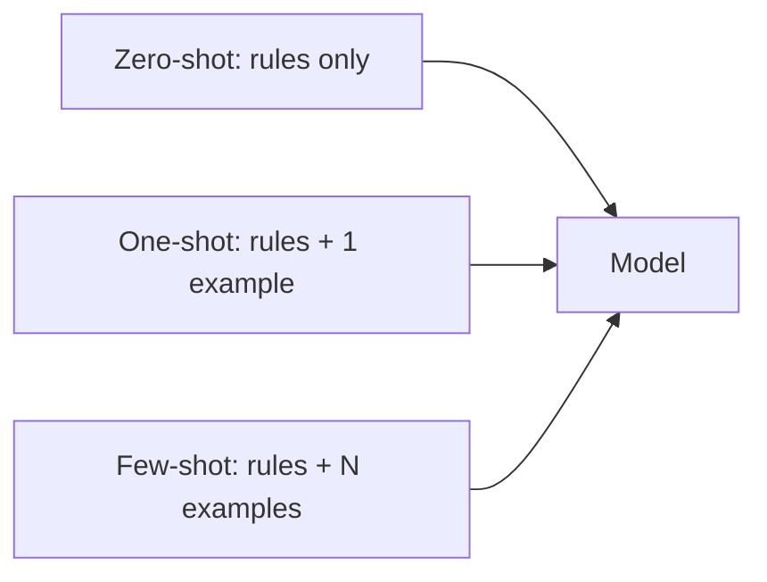

**Beginner rule:** start zero-shot with strong format instructions. Add **one** example if output shape drifts. Add more examples only when tests show clear benefit — each example consumes context.

### Separating instructions from user content
Applications should treat **trusted instructions** and **untrusted user input** differently.

Bad pattern (everything in one blob):

```text
Summarize the following in 3 bullets: {user_paste}
```

Better pattern:

```text
[System/instruction layer]
You summarize study notes for beginners. Return exactly 3 bullet points.

[User layer]
{user_paste}
```

Why it matters:

- easier to test instruction changes without touching user data
- reduces accidental instruction injection from user text (security, Day 28)
- cleaner versioning: `prompt_template_v3` vs raw strings

StudySpark should build prompts from templates in `app/` modules, not concatenate blindly in UI event handlers.

### Output format as a contract
Downstream code needs predictable shape. Ask explicitly:

- bullet count and max length
- JSON keys and types (Day 10 goes deeper)
- markdown headings vs plain text
- language and tone labels

Example constraint progression:

| Weak | Strong |
| --- | --- |
| "Format nicely" | "Return markdown with ## Summary and ## Key terms" |
| "Short answer" | "Maximum 120 words" |
| "JSON please" | 'Return JSON: `{"summary": string, "terms": string[]}`' |

### Prompt iteration loop
Prompt engineering is iterative like debugging code.

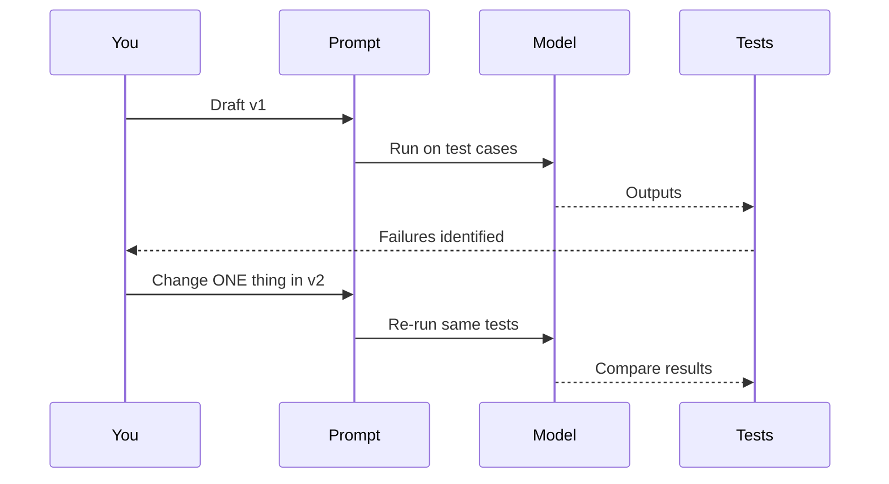

**Golden rules for iteration:**

1. Keep a fixed test set (5–20 inputs) before changing wording.
2. Change one variable at a time (format, role, temperature later on Day 6).
3. Record what improved and what regressed.
4. Stop when good enough on edge cases, not when wording sounds elegant.

### Advantages of deliberate prompt engineering
- improves quality without retraining or swapping models
- makes behavior reviewable by non-engineers
- enables A/B tests and versioning
- lowers token waste by stating limits upfront (Day 3)
- creates reusable assets (StudySpark templates)

### Limitations
- cannot add facts the model never saw (use retrieval, Day 17)
- brittle when prompts grow to thousands of tokens
- cannot alone enforce security or permissions
- multi-step reasoning may need decomposition (Day 5)
- highly numeric or symbolic tasks may need code tools (Days 11–12)

### Alternatives and complements
- **Retrieval (RAG):** inject fresh facts from your notes
- **Fine-tuning:** shift default behavior at scale
- **Structured outputs / schemas:** Day 10
- **Deterministic code:** date math, ID validation, pricing
- **Human review:** high-stakes workflows

### When is prompt engineering enough?
Enough when:

- the model already knows the domain reasonably well
- the task is primarily transformation (summarize, rewrite, explain, classify)
- you can state success criteria in a test set
- output length and format are moderate

Move beyond prompting when:

- answers must cite private documents → retrieval
- math must be exact → tools or code
- output must be machine-perfect JSON at scale → structured outputs
- prompts exceed your token budget → compress, retrieve, or summarize

## Historical Background
Prompt engineering as a discipline exploded with ChatGPT-era applications, but the ideas are older.

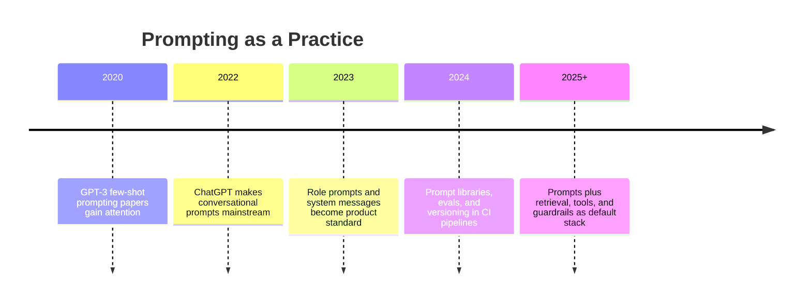

Early practitioners discovered that **examples and format instructions** often beat larger models. Teams learned prompts are **product artifacts** — not throwaway strings — and started versioning them beside application code.

## Visual Learning

### Prompt anatomy
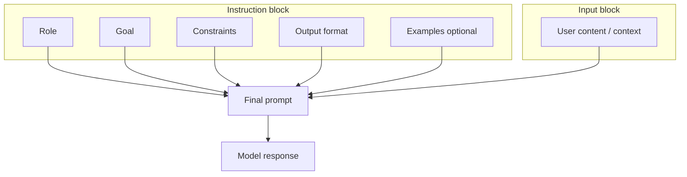

### From vague to specific
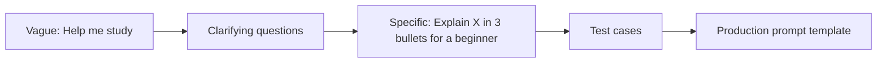

### Role and audience
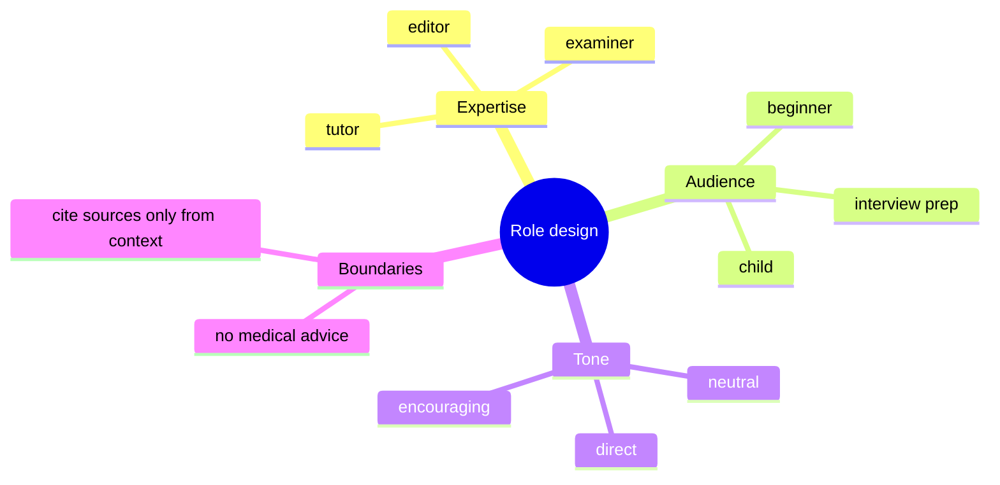

### StudySpark prompt templates
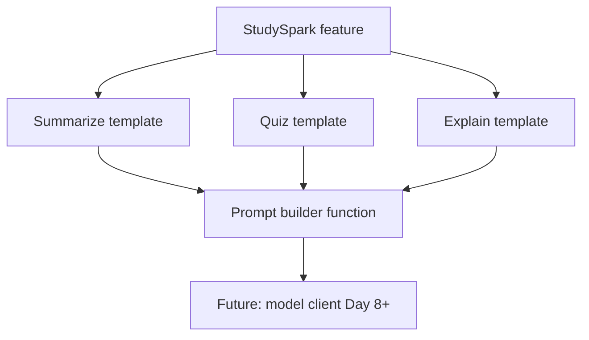

### Failure diagnosis flow
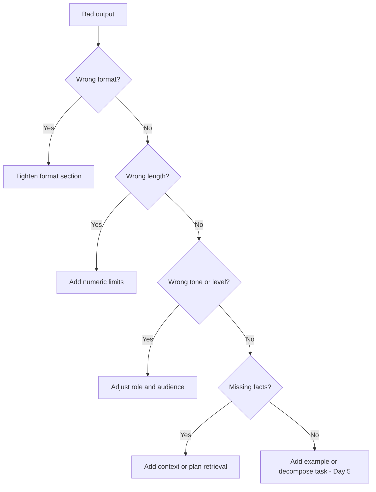

### Prompt length vs token budget (Day 3 link)
```mermaid
quadrantChart
    title Prompt design tradeoff
    x-axis Short prompt --> Long prompt
    y-axis Low clarity --> High clarity
    quadrant-1 Long but clear (watch tokens)
    quadrant-2 Short and clear (ideal)
    quadrant-3 Short but vague (avoid)
    quadrant-4 Long and vague (worst)
```

### Versioning workflow
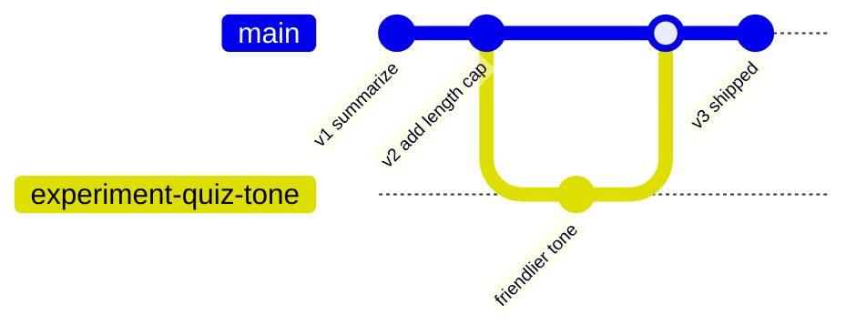

## Code Walkthrough

Examples use plain strings and small functions — no API keys. Patterns map directly to StudySpark modules later.

### Example 1: Python — minimal structured prompt
```python
prompt = """
You are a patient computer science tutor.
Explain what a token is in large language models.
Use simple English for a complete beginner.
Return exactly 3 bullet points and 1 everyday analogy.
"""
print(prompt.strip())
```

#### Code Explanation
- Line 2 sets **role** (tutor persona and patience).
- Line 3 sets **goal** (explain tokens).
- Line 4 sets **audience constraint** (beginner, simple English).
- Line 5 sets **output format** (3 bullets + analogy) — testable requirements.

### Example 2: TypeScript — same prompt for a frontend or Node service
```typescript
const prompt = `
You are a patient computer science tutor.
Explain what a token is in large language models.
Use simple English for a complete beginner.
Return exactly 3 bullet points and 1 everyday analogy.
`.trim();

console.log(prompt);
```

#### Code Explanation
- Template literals preserve multi-line prompts cleanly.
- `.trim()` removes accidental leading newline from formatting.
- Store this in `prompts/explain.ts` or similar, not inline in components.

### Example 3: Python — composable prompt builder
```python
def build_prompt(role: str, goal: str, constraints: str, output_format: str) -> str:
    sections = [role, goal, constraints, output_format]
    return "\n".join(section.strip() for section in sections if section.strip())

prompt = build_prompt(
    role="You are a study coach for university students.",
    goal="Summarize the following notes into key ideas.",
    constraints="Do not invent facts. Use only the provided notes.",
    output_format="Return markdown with headings: Summary, Key terms, Open questions.",
)
print(prompt)
```

#### Code Explanation
- `build_prompt` enforces section separation — easier to maintain than one f-string blob.
- Empty sections are skipped with `if section.strip()`.
- `constraints` includes a hallucination guard for summarization tasks.

### Example 4: TypeScript — typed template pieces
```typescript
type PromptParts = {
  role: string;
  goal: string;
  constraints: string;
  format: string;
};

function buildPrompt(parts: PromptParts): string {
  return [parts.role, parts.goal, parts.constraints, parts.format]
    .map((s) => s.trim())
    .filter(Boolean)
    .join('\n');
}

const summarizeParts: PromptParts = {
  role: 'You are a study coach for university students.',
  goal: 'Summarize the following notes into key ideas.',
  constraints: 'Do not invent facts. Use only the provided notes.',
  format: 'Return markdown with headings: Summary, Key terms, Open questions.',
};

console.log(buildPrompt(summarizeParts));
```

#### Code Explanation
- `PromptParts` makes required sections explicit at compile time.
- Reuse `summarizeParts` across CLI, API, and tests.
- Pair with user content separately at call time.

### Example 5: Python — few-shot example appended
```python
instruction = """
You convert messy notes into clean study bullets.
Return exactly 4 bullets. Use simple words.
"""

few_shot = """
Example input:
ml - gradient descent??? slow lr maybe

Example output:
- Gradient descent adjusts weights to reduce error.
- Learning rate controls step size each update.
- Small learning rate trains slowly but may be stable.
- Large learning rate can overshoot and fail to converge.
"""

full_prompt = instruction.strip() + "\n\n" + few_shot.strip()
print(full_prompt)
```

#### Code Explanation
- `instruction` defines rules; `few_shot` shows desired transformation.
- One example often fixes format drift for messy inputs.
- Monitor token count (Day 3) before adding many examples.

### Example 6: TypeScript — JSON output request
```typescript
const quizPrompt = `
You are an exam writer for introductory AI courses.
Create one multiple-choice question about prompt engineering.
Return JSON only with keys: question, options (array of 4 strings), correct_index (0-3).
Do not include markdown or explanation outside JSON.
`.trim();
```

#### Code Explanation
- "JSON only" reduces prose wrappers that break parsers.
- Key names become a contract for StudySpark quiz features.
- Day 10 adds schema validation; today you specify keys clearly.

### Example 7: Python — separate system and user content
```python
system_instructions = """
You are StudySpark's note summarizer.
Summarize provided notes for a beginner.
Return exactly 3 bullet points under 20 words each.
"""

user_notes = """
Tokens are not always words. Context windows limit input size.
"""

messages = [
    {"role": "system", "content": system_instructions.strip()},
    {"role": "user", "content": user_notes.strip()},
]

for message in messages:
    print(message["role"], ":", message["content"][:60], "...")
```

#### Code Explanation
- `system` holds trusted rules reused every call.
- `user` holds variable note content.
- This mirrors chat APIs you will call on Day 6 and Day 8.

### Example 8: TypeScript — prompt test harness
```typescript
const summarizeTemplate = `
Summarize the notes in 3 bullets for a beginner.
Notes:
{{NOTES}}
`.trim();

const testCases = [
  'Neural nets use layers. Training uses backprop.',
  '', // edge case: empty
  'A'.repeat(5000), // edge case: very long
];

for (const notes of testCases) {
  const prompt = summarizeTemplate.replace('{{NOTES}}', notes);
  console.log('--- case ---', prompt.slice(0, 120), '...');
}
```

#### Code Explanation
- `{{NOTES}}` placeholder documents where user content lands.
- Empty and long inputs reveal prompt weaknesses early.
- Run against a mock LLM (`projects/studyspark/app/clients/mock_llm.py`) before real APIs.

### Example 9: Python — rewrite vague prompt function
```python
VAGUE_PATTERNS = ["make it good", "help me", "fix this", "improve"]

def critique_prompt(text: str) -> list[str]:
    issues = []
    lowered = text.lower()
    if any(pattern in lowered for pattern in VAGUE_PATTERNS):
        issues.append("Goal is vague — state a measurable task.")
    if "bullet" not in lowered and "json" not in lowered and "word" not in lowered:
        issues.append("No explicit output format or length.")
    if "you are" not in lowered:
        issues.append("Consider adding a role for consistent tone.")
    return issues

print(critique_prompt("Help me with my notes"))
```

#### Code Explanation
- Automated critique is crude but teaches what to look for manually.
- Extend with token estimates (Day 3) for production linting.
- Use in CI to block new vague prompts merging to main.

### Example 10: TypeScript — StudySpark template registry
```typescript
export const STUDYSPARK_PROMPTS = {
  summarize: buildPrompt({
    role: 'You are StudySpark, a friendly study assistant.',
    goal: 'Summarize the user notes into essential review material.',
    constraints: 'Use only provided notes. Flag if notes are empty.',
    format: 'Return sections: Summary (3 bullets), Terms (up to 5), Study tip (1 sentence).',
  }),
  quiz: buildPrompt({
    role: 'You are StudySpark quiz generator for beginners.',
    goal: 'Create one practice question from the notes.',
    constraints: 'Question must be answerable from the notes alone.',
    format: 'Return JSON: { question, options, correct_index }.',
  }),
  explain: buildPrompt({
    role: 'You are StudySpark explainer for Day 1–5 learners.',
    goal: 'Explain the highlighted concept clearly.',
    constraints: 'Max 150 words. No advanced math.',
    format: 'Return: Definition, Analogy, Common mistake.',
  }),
} as const;
```

#### Code Explanation
- Central registry matches capstone requirement for three templates.
- `as const` preserves literal types for keys.
- Import `STUDYSPARK_PROMPTS.summarize` instead of duplicating strings.

## Practical Examples

### Beginner Example: Explain like I'm five
**Weak:** "Tell me about neural networks."

**Strong:**
```text
You are a kind science teacher for 12-year-olds.
Explain what a neural network is.
Use no formulas. Maximum 120 words.
Return: 1) Analogy 2) Three simple facts 3) One question to check understanding.
```

Why it works: role, audience, length cap, and format are all testable.

### Intermediate Example: Summarize lecture notes
Task: turn messy class notes into exam review.

Add:

- source-bound constraint ("only use provided notes")
- heading structure for flashcard apps
- fallback if notes are empty ("ask user to paste content")

StudySpark summarize template follows this pattern.

### Advanced Example: Support ticket rewriter
Product teams rewrite angry tickets into neutral summaries for routing.

Prompt sections:

- role: support operations assistant
- goal: extract issue, product area, urgency
- constraints: no invented policies; quote ticket phrases when unsure
- format: JSON for CRM ingestion (Day 10 validation)

Why professionals version these prompts: routing mistakes are expensive.

### Production Example: Eval-driven prompt updates
A team maintains `prompts/summarize_v4.txt` and a CSV of 50 note samples with human-rated scores. When v5 drops average length but raises hallucination rate, they roll back.

This is prompt engineering at scale — same principles as today, plus metrics.

### Real-World Company Example: Duolingo-style tone
Education products embed tone in system prompts: encouraging, never shaming, celebrate progress. Changing one adjective can shift user engagement. Prompts are **UX**, not just engineering.

## Best Practices
- **one main goal per prompt** — split multi-task requests into chains (Day 5)
- **state output format with numbers** — "3 bullets," "JSON keys: …"
- **put must-follow rules early** — role and format before long context
- **separate trusted instructions from user content**
- **add one example when format drifts** — do not start with ten
- **keep a test set** before editing wording
- **change one thing at a time** when iterating
- **respect token budgets** — shorter prompts leave room for answers (Day 3)
- **name and version templates** — `summarize_v2`, not `final_final2`
- **document failure modes** each template is known to have
- **use neutral, measurable language** — "max 120 words" not "keep it brief"
- **plan for empty, toxic, or off-topic inputs** with fallback instructions

## Common Mistakes
- multiple unrelated tasks in one prompt ("summarize, quiz me, and email my professor")
- vague superlatives ("make it amazing," "be smart")
- hiding format requirements at the end of a long prompt
- no test cases — optimizing for one cool demo input
- copying internet "magic prompts" without understanding the task
- changing role and format simultaneously during debugging
- stuffing retrieved documents without telling the model how to use them (preview Day 17)
- assuming politeness words improve quality ("please" is optional; clarity is not)
- no fallback when user input is empty
- treating prompt output as truth without validation

### Debugging Strategy
When output fails, inspect in order:

1. **Goal:** Can you restate the task in one sentence?
2. **Format:** Did you specify shape and limits with numbers?
3. **Role and audience:** Is reading level explicit?
4. **Context:** Did the model have the facts it needed?
5. **Conflicts:** Do two instructions contradict?
6. **Examples:** Would one example clarify the pattern?
7. **Token budget:** Was important context truncated? (Day 3)
8. **Test coverage:** Did you only test easy inputs?

Log prompts and outputs for failing cases (redact secrets). Compare to a passing case side by side.

## Performance

### Prompt length and tokens
Longer prompts cost more and can slow responses. Every few-shot example adds tokens. Trim boilerplate once templates stabilize.

### Output length
If you want short answers, specify **max words, bullets, or sentences**. Models otherwise ramble.

### Reliability
Structured prompts reduce variance across similar inputs — critical for StudySpark quiz generation where answer keys must be stable.

### Caching (preview)
Repeated system prompts may be cached by providers (Day 8+). Stable instruction blocks save money; putting variable content first can break cache — follow provider docs when optimizing.

## Security
Beginner apps still need basic prompt hygiene:

- **Prompt injection:** users may paste "ignore previous instructions." Separate system rules from user content; validate outputs.
- **Secrets:** never embed API keys or passwords in prompts.
- **PII:** minimize personal data in prompts sent to hosted models.
- **Retrieved text:** untrusted documents can contain malicious instructions (Day 17+).
- **Logging:** redact user content in logs when possible.

Prompt engineering is not a security boundary. It is one layer. Guardrails come on Day 28.

## Evaluation

### What to measure
- instruction following rate (format correct?)
- length compliance (within caps?)
- tone appropriateness for audience
- hallucination rate on source-bound tasks
- consistency across test set (same template, varied inputs)
- token usage per successful task (Day 3)

### Evaluation checklist
1. Does the output match the requested format on all test cases?
2. Are empty and garbage inputs handled gracefully?
3. Can a new teammate edit the prompt without breaking behavior?
4. Did changes improve the test set without regressing prior cases?
5. Is the prompt short enough for retrieval headroom later?

### Simple offline test cases
- empty user notes
- notes in another language
- notes with only URLs or code
- request for medical/legal advice (should refuse or defer per constraints)
- extremely long paste (should trigger trim or error from app, not silent failure)

## Exercises

### Easy
1. Rewrite "Help me study" as a specific prompt with role, goal, and format.
2. Identify role, goal, and constraint in a sample prompt provided by a friend or this lesson.
3. Why is "Return exactly 3 bullet points" stronger than "be concise"?
4. What is the difference between zero-shot and one-shot prompting?
5. Name one symptom of a vague prompt.
6. Why separate system instructions from user notes in StudySpark?
7. Add a max word count to any prompt you wrote this week.
8. True or false: politeness words are the most important part of a prompt. Explain.

### Medium
9. Write a zero-shot prompt that explains gradient descent to a beginner in 100 words max.
10. Add one few-shot example to exercise 9 for format consistency.
11. Write a prompt that requests JSON with keys `summary` and `terms` (no API call needed).
12. Create a test set of five messy note inputs for a summarizer.
13. List three constraints for a quiz-generation prompt grounded in user notes.
14. Rewrite a prompt that currently mixes summarize + quiz into two separate prompts.
15. Explain when you would remove the role section to save tokens.
16. Draft fallback behavior when user notes are empty.

### Hard
17. Design `build_prompt()` signatures for StudySpark's three templates.
18. Write a prompt critique checklist with at least eight items.
19. Given a failing output, document a one-variable iteration plan across three versions.
20. Explain when prompt engineering should stop and retrieval should start.
21. Create a prompt versioning scheme for a team of three engineers.
22. Design test expectations (not exact text) for the explain template.
23. How would you detect prompt injection in pasted notes before sending to the model?
24. Compare two prompts A and B with the same goal — which is more maintainable and why?

### Challenge
25. Implement `critique_prompt()` in Python or TypeScript with five rules.
26. Build a CSV or JSON file of ten test cases with expected format properties.
27. Write StudySpark's three templates in a `prompts` module with shared `buildPrompt`.
28. Run templates against `MockLLMClient` and document what a real model should improve.
29. Draft a one-page "prompt style guide" for StudySpark contributors.
30. Plan how Day 5 chain-of-thought would extend the explain template — when worth the token cost?

### Reflection Questions
31. Which StudySpark template will you use most as a learner — summarize, quiz, or explain?
32. What is the most common mistake you make when writing instructions for humans that also appears in prompts?
33. How will you know a prompt is "good enough" to ship?
34. What test input are you most afraid of — and what should the prompt do?
35. How does today's work connect to token budgets from Day 3?

## Quizzes

### Quiz 1 — Prompt basics
1. What is prompt engineering?
2. Name the four core prompt components taught today.
3. Why do specific format instructions work better than vague ones?
4. What is a zero-shot prompt?

**Answers:** 1. Designing instructions so LLMs produce useful, reliable outputs  2. Role, goal, context, constraints/format (accept reasonable variants)  3. They raise probability of continuations matching the desired pattern  4. Instructions only, no examples

### Quiz 2 — Structure and separation
1. Why separate trusted instructions from user content?
2. What message role holds global behavior in chat APIs?
3. What is one-shot prompting?
4. What is a common sign your prompt has multiple conflicting goals?

**Answers:** 1. Security, testability, and cleaner versioning  2. `system` (or developer for product rules)  3. One input/output example included with instructions  4. Inconsistent outputs or half-completed tasks

### Quiz 3 — Output and testing
1. Why request exact bullet counts?
2. What should you change one at a time during iteration?
3. Name two edge-case inputs every summarizer should test.
4. Does a strong prompt guarantee factual correctness?

**Answers:** 1. Makes outputs testable and consistent  2. One prompt variable (e.g., format OR role)  3. Any two of: empty, very long, non-English, code-only  4. No — validation and retrieval may still be needed

### Quiz 4 — Limits and complements
1. When is prompt engineering alone insufficient?
2. What Day 3 concept should you consider when adding few-shot examples?
3. Name one alternative to prompting for behavior change at scale.
4. What StudySpark file tracks capstone prompt work?

**Answers:** 1. When facts are missing, tools needed, or JSON must be machine-perfect at scale  2. Token budget / context window  3. Fine-tuning (or retrieval, tools, structured outputs)  4. `projects/CAPSTONE.md`

### Quiz 5 — StudySpark templates
1. Name the three reusable templates for today's capstone.
2. What should the quiz template's output shape be?
3. What constraint prevents hallucination in summarize tasks?
4. Where will templates eventually live in the StudySpark codebase?

**Answers:** 1. Summarize, quiz, explain  2. JSON with question, options, correct_index (or equivalent)  3. "Use only provided notes" / do not invent facts  4. `projects/studyspark/app/` prompt module (e.g., registry or `prompts/`)

## Interview Questions

### Conceptual
- What is prompt engineering, and why does it matter for product quality?
- Explain zero-shot vs few-shot prompting with tradeoffs.
- How do prompts interact with token probabilities (high level)?
- When would you use retrieval instead of a longer prompt?
- How do you version and test prompts in a team environment?

### Practical
- Walk through rewriting a vague user request into a production prompt.
- How would you separate system, developer, and user content?
- Design a test harness for a summarization prompt without calling an API.
- How do you debug a prompt that follows format but hallucinates content?
- What metrics would you track for a quiz-generation feature?

### System Design
- Design a prompt template system for multi-tenant StudySpark instances.
- How would you roll out prompt v2 with A/B testing and rollback?
- Design guardrails when user notes are untrusted free text.
- How do prompts fit into a RAG pipeline (Days 17+)?

### Debugging
- Users report quizzes are too hard. Which prompt sections do you adjust?
- Summaries grew from 3 bullets to essays. What failed?
- JSON parse errors spiked after a prompt edit. What do you inspect?
- Same prompt works in English but fails in Spanish. What hypotheses?

## Mini Project
Write and test **three StudySpark prompt templates**: summarize, quiz, and explain.

### Goal
Turn rough learner notes into review material, practice questions, and clear explanations using maintainable prompt templates — no API key required if you use the mock client or paper tests.

### Features
- three templates with role, goal, constraints, and explicit format
- `build_prompt()` or registry pattern in Python or TypeScript
- five test note inputs in `test-cases.md` or JSON
- expected output **properties** per test (e.g., "exactly 3 bullets," "valid JSON keys")
- one documented iteration: v1 → v2 with what changed and why
- optional: run against [`projects/studyspark/app/clients/mock_llm.py`](../../projects/studyspark/app/clients/mock_llm.py)

### Suggested Folder Structure
```text
projects/studyspark/
├── app/
│   └── prompts/
│       ├── __init__.py
│       ├── templates.py      # STUDYSPARK_PROMPTS registry
│       └── builder.py        # build_prompt()
├── docs/
│   ├── test-cases.md
│   └── prompt_changelog.md
└── tests/
    └── test_prompts.py         # optional format checks
```

### Project Steps
1. read [`projects/studyspark/README.md`](../../projects/studyspark/README.md) for project conventions
2. draft summarize, quiz, and explain templates on paper; critique with today's checklist
3. implement `builder.py` and `templates.py` (or TypeScript equivalent in docs only)
4. create five messy note samples in `test-cases.md`
5. for each template, define expected properties — not exact model wording
6. iterate one template once using a single-variable change
7. update `projects/CAPSTONE.md` with template names and test expectations
8. optional: wire templates to `MockLLMClient` for end-to-end dry runs

### Acceptance Criteria
- each template has measurable format rules (counts, JSON keys, or headings)
- summarize template includes anti-hallucination constraint
- quiz template specifies JSON shape and "answerable from notes only"
- explain template caps length and targets beginner audience
- test cases include at least one empty and one long input
- changelog documents v1 → v2 iteration with test results

### What You Learn
- how to treat prompts as maintainable code artifacts
- how to test instructions before paying for API calls
- how StudySpark features map directly to prompt templates

## Cumulative Capstone Update

Add to [`projects/CAPSTONE.md`](../../projects/CAPSTONE.md):

- three **reusable prompt templates** (summarize, quiz, explain)
- one test prompt with expected output shape for each template
- suggested paths:
  - `projects/studyspark/app/prompts/templates.py`
  - `projects/studyspark/docs/test-cases.md`
- note how templates respect **token budget** from Day 3 (keep system blocks stable and concise)

Example registry shape:

```python
STUDYSPARK_PROMPTS = {
    "summarize": {...},
    "quiz": {...},
    "explain": {...},
}
```

Capstone prompt flow:

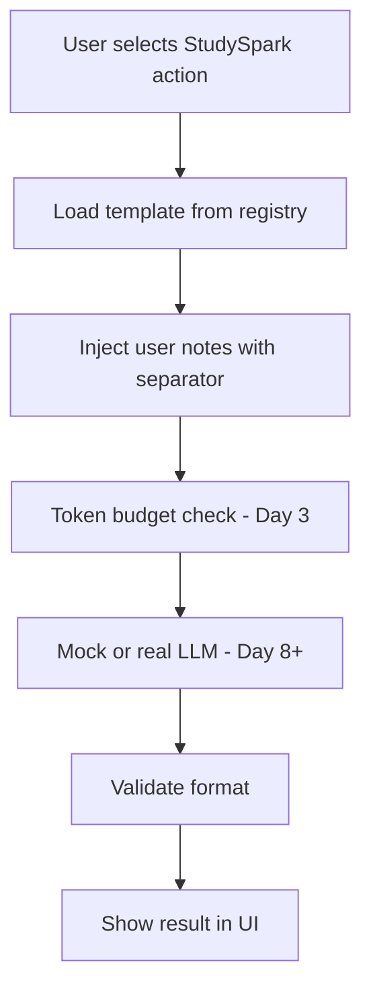

## Summary
Prompt engineering is how you make a general-purpose model behave like a purpose-built tool. Clarity beats clever wording: one goal, explicit format, separated instructions, and disciplined testing.

Today you built the beginner foundation StudySpark will use for summarize, quiz, and explain features. Day 5 adds advanced patterns; Day 8 makes these prompts live via APIs. Master today's structure and you will not rewrite from scratch later — you will iterate with confidence.

[Previous: Day 3 - Tokens, Context Windows, and Embeddings](../day_03/day_03_tokens_context_windows_and_embeddings.md) | [Next: Day 5 - Advanced Prompt Engineering](../day_05/day_05_advanced_prompt_engineering.md)

## Further Reading
- [Prompt Engineering Guide](https://www.promptingguide.ai/) — broad reference; focus on "basics" sections today
- [OpenAI: Prompt engineering](https://platform.openai.com/docs/guides/prompt-engineering) — provider-specific best practices
- [Anthropic: Prompt engineering](https://docs.anthropic.com/en/docs/build-with-claude/prompt-engineering) — role and example patterns
- [OpenAI Cookbook](https://cookbook.openai.com/) — practical notebooks for iteration and evaluation
