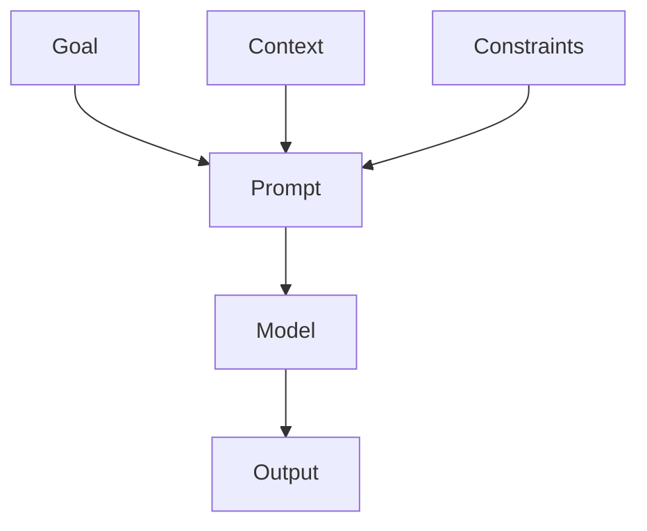

# Day 4 - Prompt Engineering Fundamentals

[Previous: Day 3 - Tokens, Context Windows, and Embeddings](../day_03/day_03_tokens_context_windows_and_embeddings.md) | [Next: Day 5 - Advanced Prompt Engineering](../day_05/day_05_advanced_prompt_engineering.md)

## Introduction
Prompt engineering is the skill of writing instructions and context so an LLM produces better results. It is less about tricks and more about clarity, structure, and controlling the task.


## Learning Objectives
By the end of this day, you should be able to:

- write clear prompts with one main goal
- separate instructions from context and output format
- use examples to shape behavior
- ask for structured outputs
- evaluate prompt quality with test cases

## Theory
A good prompt gives the model the right role, the right task, and the right constraints. If you only say "help me," the model has to guess too much. If you explain the task carefully, the output becomes more reliable.

A strong prompt often contains:

- role
- goal
- context
- constraints
- output format
- examples

### Visual Diagram


## Code Examples

### Python
```python
prompt = """
You are a teaching assistant.
Explain prompt engineering in 3 bullet points.
Use simple English.
"""
print(prompt.strip())
```

### TypeScript
```typescript
const prompt = `
You are a teaching assistant.
Explain prompt engineering in 3 bullet points.
Use simple English.
`;

console.log(prompt.trim());
```

## Best Practices
- make the first sentence describe the task clearly
- put the most important instruction first
- ask for a specific output shape
- provide one or two examples when needed
- keep prompts short unless the task truly needs more context

## Common Mistakes
- mixing multiple unrelated tasks in one prompt
- using vague language like "make it good"
- hiding critical constraints deep in the prompt
- forgetting to test prompts with edge cases
- assuming the first output is the best possible output

## Exercises
- Easy: Rewrite a vague prompt so it becomes specific.
- Medium: Create a prompt that returns JSON.
- Hard: Design a prompt for a beginner tutor.
- Challenge: Build a small prompt test set with three tricky inputs.

## Mini Project
Write a prompt for an AI note helper that rewrites messy notes into clean study notes. Include style, length, and output format constraints.

## Summary
Prompt engineering is about making the model's job easier. Clarity, examples, and constraints usually produce better results than clever wording.

[Previous: Day 3 - Tokens, Context Windows, and Embeddings](../day_03/day_03_tokens_context_windows_and_embeddings.md) | [Next: Day 5 - Advanced Prompt Engineering](../day_05/day_05_advanced_prompt_engineering.md)

## Additional Resources
- https://www.promptingguide.ai/
- https://platform.openai.com/docs/guides/prompt-engineering
- https://docs.anthropic.com/en/docs/build-with-claude/prompt-engineering
