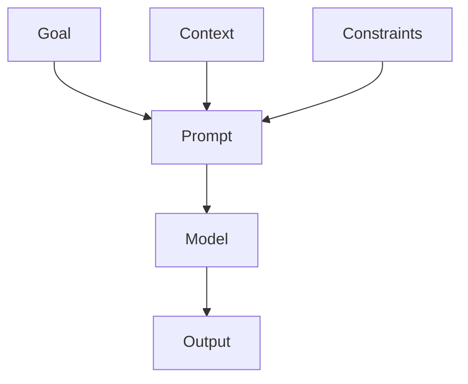
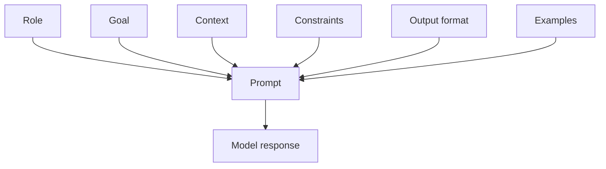
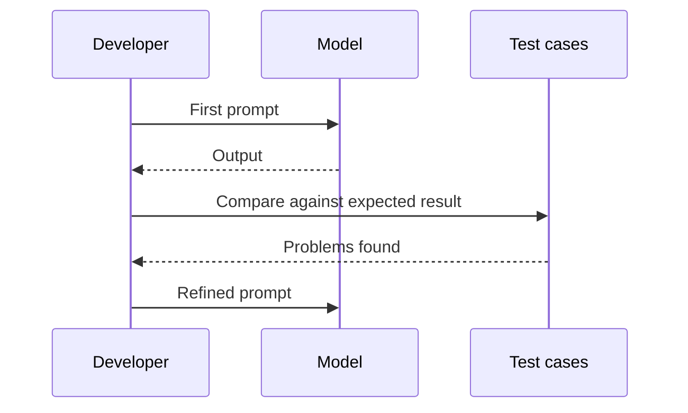
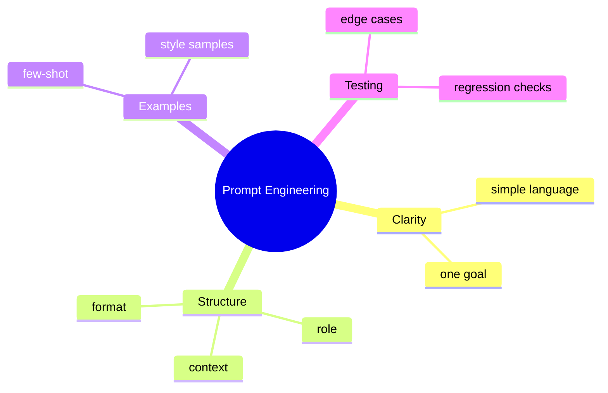

# Day 4 - Prompt Engineering Fundamentals

[Previous: Day 3 - Tokens, Context Windows, and Embeddings](../day_03/day_03_tokens_context_windows_and_embeddings.md) | [Next: Day 5 - Advanced Prompt Engineering](../day_05/day_05_advanced_prompt_engineering.md)

## Introduction
Tokens and context are the ingredients. Prompt engineering is the recipe.

Prompt engineering is the skill of writing instructions and context so an LLM produces better results. It is less about tricks and more about clarity, structure, and controlling the task.


This lesson teaches the foundation of working with models through language. If you can write a strong prompt, you can often improve an AI system before adding more complicated machinery.

## Learning Objectives
By the end of this day, you should be able to:

- write clear prompts with one main goal
- separate instructions from context and output format
- use examples to shape behavior
- ask for structured outputs
- evaluate prompt quality with test cases
- explain why prompt clarity affects output quality
- design prompts that are easier to maintain

## Prerequisites
You should already understand:

- Day 3: tokens, context windows, and embeddings
- Day 2: how LLMs generate text

Prompt engineering becomes much easier when you already know that prompts must fit within context limits and guide token-by-token generation.

## Big Picture
A good prompt gives the model the right role, the right task, and the right constraints.

If you only say "help me," the model has to guess too much. If you explain the task carefully, the output becomes more reliable.

A strong prompt often contains:

- role
- goal
- context
- constraints
- output format
- examples



## Why Prompt Engineering Exists
Prompt engineering exists because LLMs are flexible but not telepathic.

The model can only respond well if the application gives it the right information in the right shape.

Without good prompts, you may see:

- vague answers
- wrong tone
- missing constraints
- inconsistent formatting
- unnecessary hallucinations

## Deep Theory

### What is a prompt?
A prompt is the input that tells the model what to do.

It may include:

- a role or persona
- the user task
- background context
- boundaries and safety rules
- examples of desired outputs
- a format to follow

### Why prompts work
Prompts work because they influence the probability of different token sequences.

The model does not read your instruction like a human with common sense. It uses the prompt as context to decide what continuation is most likely and most useful.

### Prompt components

| Component | Purpose | Example |
| --- | --- | --- |
| Role | Sets the assistant identity | You are a teaching assistant |
| Goal | Defines the task | Explain prompt engineering in 3 bullets |
| Context | Adds background | For beginners in AI |
| Constraints | Limits behavior | Use simple English |
| Output format | Shapes the response | Return bullet points |
| Examples | Demonstrates desired output | Show a sample answer |

### Advantages
- improves reliability without changing the model
- makes behavior easier to test
- supports reusable workflows
- can be learned and maintained by developers

### Limitations
- prompts are not guarantees
- prompt quality can degrade with long or messy input
- highly complex tasks may need tools or retrieval, not just wording

### Alternatives
- fine-tuning, when you need model behavior changes at scale
- retrieval, when the task depends on external knowledge
- deterministic code, when the task is simple and exact

### When should you use prompt engineering?
Use it when:

- the model already has the right capability
- you need to shape behavior quickly
- you want a lightweight way to improve quality

### When should you move beyond prompt engineering?
Move beyond it when:

- the task requires external data
- the prompt is becoming too long or brittle
- you need more reliable structure than prompting alone can provide

## Visual Learning

### Prompt Anatomy


### Prompt Iteration Loop


### Prompt Mind Map


## Code Walkthrough

The code examples below show how prompts are structured in application code.

### Python Example
```python
prompt = """
You are a teaching assistant.
Explain prompt engineering in 3 bullet points.
Use simple English.
"""
print(prompt.strip())
```

#### Code Explanation
- the role tells the model how to behave.
- the task is specific and bounded.
- the style instruction keeps the language accessible.

### TypeScript Example
```typescript
const prompt = `
You are a teaching assistant.
Explain prompt engineering in 3 bullet points.
Use simple English.
`;

console.log(prompt.trim());
```

#### Code Explanation
- the same prompt structure works in TypeScript.
- application code often stores or generates prompts from templates.

### Python Example: Prompt template pieces
```python
role = "You are a teaching assistant."
goal = "Explain prompt engineering in 3 bullet points."
style = "Use simple English."

prompt = f"{role}\n{goal}\n{style}"
print(prompt)
```

#### Code Explanation
- separating the prompt into pieces makes it easier to maintain.
- each line has a different job.

### TypeScript Example: Structured output request
```typescript
const structuredPrompt = `
You are a teaching assistant.
Return your answer as JSON with keys: summary, example, and tip.
Use simple English.
`;

console.log(structuredPrompt.trim());
```

#### Code Explanation
- asking for structure improves downstream processing.
- the application can parse predictable output more easily.

### Python Example: Tiny prompt evaluation harness
```python
test_cases = [
        "Explain prompt engineering simply.",
        "Explain prompt engineering in JSON.",
        "Explain prompt engineering for a beginner.",
]

for case in test_cases:
        print("Test case:", case)
```

#### Code Explanation
- testing prompts against multiple cases helps expose weaknesses.
- one good output is not enough to prove the prompt is robust.

## Practical Examples

### Beginner Example: A tutoring prompt
You can ask the model to act as a tutor, explain the concept in simple words, and return a short list.

Why this works:

- the model knows the role
- the output is constrained
- the result is easier to read

### Intermediate Example: A summarization prompt
You can give the model a long note and ask for a short summary with bullet points.

What to add:

- length limit
- audience level
- tone
- forbidden content if any

### Professional Example: A reusable workflow prompt
A company may use a prompt template for rewriting support tickets into structured summaries.

Why professionals care:

- consistent output is easier to automate
- prompt templates reduce manual work
- test cases make regressions visible

### Real-World Company Example
Many organizations treat prompts as product assets. They version them, test them, and update them when user needs change.

## Best Practices
- make the first sentence describe the task clearly
- put the most important instruction first
- ask for a specific output shape
- provide one or two examples when needed
- keep prompts short unless the task truly needs more context
- isolate instructions from raw user content when possible
- test the prompt with real edge cases

## Common Mistakes
- mixing multiple unrelated tasks in one prompt
- using vague language like "make it good"
- hiding critical constraints deep in the prompt
- forgetting to test prompts with edge cases
- assuming the first output is the best possible output
- changing too many prompt parts at once during debugging

### Debugging Strategy
When a prompt fails, inspect it in this order:

1. Is the goal clear?
2. Are the constraints specific?
3. Is the output format unambiguous?
4. Is the context relevant?
5. Are you testing enough cases?

## Performance

### Prompt Length
Long prompts can be slower and more expensive.

### Output Length
If you want a short answer, say so explicitly.

### Reliability
Good prompt structure tends to reduce variance across similar requests.

## Security
Prompt engineering should be aware of untrusted input.

- do not allow user content to overwrite system instructions accidentally
- do not leak secrets in prompts
- be careful when combining instructions with retrieved content later in the course

## Evaluation
Prompts should be tested like software.

### What to measure
- does the model follow the instruction?
- is the output shape correct?
- is the tone appropriate?
- do edge cases break the prompt?

### Useful questions
- Did the prompt stay on task?
- Did it produce the right format?
- Is it easy to maintain?
- Does it work on more than one input?

## Exercises

### Easy
1. Rewrite a vague prompt so it becomes specific.
2. Identify the role, goal, and constraint in a prompt.
3. Explain why output format matters.
4. Describe one reason prompts should be tested.

### Medium
5. Create a prompt that returns JSON.
6. Separate instructions from context in a sample prompt.
7. Explain why examples improve prompt behavior.
8. Describe what makes a prompt maintainable.

### Hard
9. Design a prompt for a beginner tutor.
10. Explain how you would debug a prompt that gives too much detail.
11. Describe how you would test a prompt with edge cases.
12. Explain when prompt engineering is not enough.

### Challenge
13. Build a small prompt test set with three tricky inputs.
14. Write a prompt that handles both summaries and bullet lists.
15. Create a prompt that is reusable across multiple tasks.
16. Explain how you would version prompts in a team.

## Mini Project
Write a prompt for an AI note helper that rewrites messy notes into clean study notes.

### Goal
Turn rough notes into something a learner can review quickly.

### Required Constraints
- style
- length
- output format
- tone
- one fallback behavior if the notes are incomplete

### Suggested structure
```text
note-helper/
├── prompt.md
├── test-cases.md
└── notes.md
```

### Project Steps
1. define the user and task
2. write the instruction clearly
3. specify the output format
4. add one or two examples
5. create test cases for messy notes
6. compare outputs and refine the prompt

### What You Learn
- how structure improves model behavior
- how to specify outputs clearly
- how prompt testing helps you improve quality

## Summary
Prompt engineering is about making the model's job easier.

Clarity, examples, and constraints usually produce better results than clever wording. This lesson gives you the baseline skill you will keep using throughout the rest of the course.

[Previous: Day 3 - Tokens, Context Windows, and Embeddings](../day_03/day_03_tokens_context_windows_and_embeddings.md) | [Next: Day 5 - Advanced Prompt Engineering](../day_05/day_05_advanced_prompt_engineering.md)

## Additional Resources
- https://www.promptingguide.ai/
- https://platform.openai.com/docs/guides/prompt-engineering
- https://docs.anthropic.com/en/docs/build-with-claude/prompt-engineering
- https://cookbook.openai.com/
