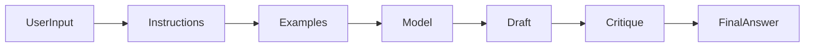

# Day 5 - Advanced Prompt Engineering

## Introduction
Advanced prompt engineering is about designing prompts that work reliably across different inputs, tasks, and failure cases. The goal is not only a good demo, but consistent behavior.


## Learning Objectives
By the end of this day, you should be able to:

- use few-shot prompting effectively
- design prompts with role and policy boundaries
- reduce hallucinations with better context design
- ask for self-checking and structured reasoning safely
- build prompt patterns for reusable workflows

## Theory
As prompts get more complex, you need more than one instruction sentence. You may need examples, rubrics, output schemas, and fallback instructions.

Common advanced patterns include:

- few-shot prompting
- chain-of-thought style task decomposition without exposing hidden reasoning to users
- critique and refine loops
- extraction with schemas
- role separation for system and user messages

### Visual Diagram


## Code Examples

### Python
```python
examples = [
    {"input": "2+2", "output": "4"},
    {"input": "3+5", "output": "8"},
]

prompt = "Use the examples to answer new math questions.\n"
for item in examples:
    prompt += f"Input: {item['input']} -> Output: {item['output']}\n"

print(prompt)
```

### TypeScript
```typescript
const examples = [
  { input: '2+2', output: '4' },
  { input: '3+5', output: '8' },
];

let prompt = 'Use the examples to answer new math questions.\n';
for (const item of examples) {
  prompt += `Input: ${item.input} -> Output: ${item.output}\n`;
}

console.log(prompt);
```

## Best Practices
- use examples that represent the real task, not toy edge cases only
- define success clearly with a rubric when possible
- separate system rules from user content
- ask for verification or citations when correctness matters
- keep sensitive reasoning internal and expose only the useful answer

## Common Mistakes
- making prompts so long that they become hard to maintain
- using examples that accidentally teach the wrong pattern
- asking the model to do too many transformations at once
- trusting self-checks without independent validation
- forgetting to preserve task constraints when refining outputs

## Exercises
- Easy: Write two few-shot examples for a classification task.
- Medium: Add a rubric to a prompt for summarization.
- Hard: Design a prompt that extracts structured fields from messy text.
- Challenge: Create a critique-and-rewrite prompt pair.

## Mini Project
Build a reusable prompt template for turning meeting notes into action items, owners, and deadlines.

## Summary
Advanced prompting is about consistency, not cleverness. Examples, rubrics, and clear boundaries make prompts more dependable in real-world use.

## Additional Resources
- https://www.promptingguide.ai/techniques/fewshot
- https://cookbook.openai.com/
- https://docs.anthropic.com/en/docs/build-with-claude/prompt-engineering/overview
