# Day 5 - Advanced Prompt Engineering

[Previous: Day 4 - Prompt Engineering Fundamentals](../day_04/day_04_prompt_engineering_fundamentals.md) | [Next: Day 6 - LLM APIs](../day_06/day_06_llm_apis.md)

## Introduction
Day 4 taught you how to write a good prompt. Day 5 teaches you how to make prompts **dependable**.

Think of a basic prompt like a handwritten note to a colleague: "Summarize this meeting." It might work once, but results will vary. Advanced prompt engineering is like writing a reusable job ticket with examples, quality standards, output format, and fallback rules. The colleague still interprets the task—but you have dramatically reduced ambiguity.

Advanced prompt engineering is about designing prompts that work reliably across different inputs, tasks, and failure cases. The goal is not only a good demo, but **consistent behavior** in a product. Once a prompt ships inside software, you cannot afford surprises: the output may feed a database, trigger an email, or appear in a customer-facing UI.


By the end of today, you will know how to use few-shot examples, structured extraction, critique loops, role boundaries, and prompt templates—the patterns that separate hobby prompts from production-grade instructions.

## Learning Objectives
By the end of this day, you should be able to:

- use few-shot prompting to teach patterns the model can imitate
- design prompts with clear role and policy boundaries
- reduce hallucinations through better context design and grounding rules
- ask for self-checking and structured reasoning safely
- build reusable prompt templates for recurring workflows
- create prompts that are easier to test, version, and maintain
- distinguish when prompt engineering alone is enough—and when it is not
- evaluate advanced prompts with rubrics and test cases
- explain chain-of-thought, critique-refine, and schema extraction tradeoffs
- connect advanced prompting patterns to the StudySpark capstone workflow

## How to Use This Lesson

This lesson is designed for **all skill levels**. Pick one path and follow it consistently.

| Level | Suggested approach | Time |
| --- | --- | --- |
| **Beginner** | Read Introduction → Big Picture → Deep Theory → trace one code example → Easy exercises | 5–7 hours |
| **Intermediate** | Skim objectives → Visual Learning → Code Walkthrough → Medium/Hard exercises → Mini project | 3–5 hours |
| **Advanced** | Deep Theory tradeoffs → Hard/Challenge exercises → extend mini project → capstone slice | 2–3 hours |

### Apply Today
Complete at least one item before moving to the next day:
- [ ] Trace one code example in **Python or TypeScript** (one language is enough)
- [ ] Complete exercises for your level (see Exercises section)
- [ ] Update [`projects/CAPSTONE.md`](../../projects/CAPSTONE.md) with today's capstone item
- [ ] Write one sentence in your own words explaining today's main idea.

> **Stuck?** Re-read Big Picture, review Prerequisites, or see [SYLLABUS.md](../../SYLLABUS.md) for path guidance.

## Prerequisites
You should already understand:

- Day 4: prompt engineering fundamentals (clarity, specificity, constraints)
- Day 3: tokens and context windows (prompt length limits)
- Day 2: how LLMs generate text probabilistically

Advanced prompting makes more sense when you already know that prompts are constrained by context size and model behavior is probabilistic—not deterministic. If Day 4 felt rushed, review the sections on task, audience, and output format before continuing.

## Big Picture
As prompts get more complex, you need more than one instruction sentence. You may need examples, rubrics, output schemas, verification steps, and fallback instructions.

An advanced prompt pipeline often looks like this:

1. **Role and policy** — who the model is and what it must never do
2. **Task definition** — what success looks like
3. **Examples** — demonstrations of correct input/output pairs
4. **Generation** — the model produces a draft
5. **Validation** — critique, schema check, or rubric scoring
6. **Final output** — cleaned, structured result for downstream code

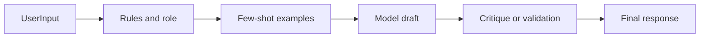

The important shift from Day 4 to Day 5 is **system design**. You are no longer writing one prompt for one question. You are designing a prompt **system** that must survive messy real-world inputs.

## Why Advanced Prompting Exists
Simple prompts work for simple tasks. Real products usually need more.

Advanced prompting exists because you may need to:

- teach the model a pattern through examples when rules alone are insufficient
- constrain a response into a predictable structure for downstream code
- separate policy from user content so instructions cannot be overridden
- add a review step before returning the result to users
- keep the prompt reusable across many inputs without rewriting each time

Consider a meeting-notes tool. A one-line prompt ("Summarize this") produces inconsistent summaries. An advanced prompt with a schema (action items, owners, deadlines), a rubric (no invented dates), and two examples produces output your app can parse reliably.

That reliability is why teams invest in advanced patterns before reaching for fine-tuning or retrieval.

## Deep Theory

### What makes a prompt advanced?
A prompt becomes advanced when it does more than issue one instruction. It becomes a **specification** for model behavior.

It may include:

- multiple few-shot examples showing the desired transformation
- structured output requirements (JSON schema, labeled sections)
- internal critique or verification steps
- task-specific rules and edge-case handling
- fallback or refusal behavior when input is insufficient

The test is maintainability: can another developer read your prompt, understand the contract, and update it without breaking production?

### Few-shot prompting
Few-shot prompting gives the model a small number of input/output examples so it can imitate the desired pattern.

**Zero-shot:** "Classify sentiment as positive, negative, or neutral."
**Few-shot:** Same instruction plus three labeled examples, then the new input.

This is useful when the task is easier to **show** than to **describe**. Classification, formatting, tone matching, and extraction often benefit from examples.

| Shots | When to use | Risk |
| --- | --- | --- |
| 0 | Simple, well-known tasks | Model may guess wrong format |
| 1–3 | Pattern teaching, formatting | Low cost, usually sufficient |
| 4–8 | Complex transformations | Token cost rises; pick diverse examples |
| 9+ | Rarely needed | Diminishing returns; context pressure |

**Common mistake:** examples that contradict each other or teach the wrong edge-case behavior. If every example has a deadline, the model may invent deadlines when none exist.

### Chain-of-thought (internal reasoning)
Chain-of-thought (CoT) asks the model to reason step by step before answering. For math, logic, and multi-step tasks, internal reasoning often improves accuracy.

In product settings, you usually have three choices:

1. **Hidden CoT** — model reasons internally; you expose only the final answer
2. **Summary CoT** — model shows a brief reasoning summary, not every intermediate step
3. **Full CoT** — model shows all steps (good for tutoring; risky for high-stakes automation)

For a billing support bot, full verbose reasoning may confuse users and leak process details. For a study tutor explaining algebra, a short step-by-step summary helps learning.

**Limitation:** CoT improves reasoning quality but does not guarantee correctness. Always validate when stakes are high.

### Schema extraction
Sometimes the job is not to generate freeform text. The prompt should extract data into a predictable structure—JSON, YAML, or labeled bullet points.

Schema extraction enables:

- direct parsing in application code
- database inserts without regex hacks
- automated workflows (create ticket, send email, update CRM)

Example schema for meeting notes:

```json
{
  "action_items": [
    {"task": "string", "owner": "string or null", "deadline": "string or null"}
  ],
  "summary": "string",
  "open_questions": ["string"]
}
```

Pair the schema with rules: "Use null when information is missing. Do not invent owners or dates."

### Critique and refine loops
In a critique-and-refine workflow, the model first drafts an answer, then reviews or improves it against a rubric.

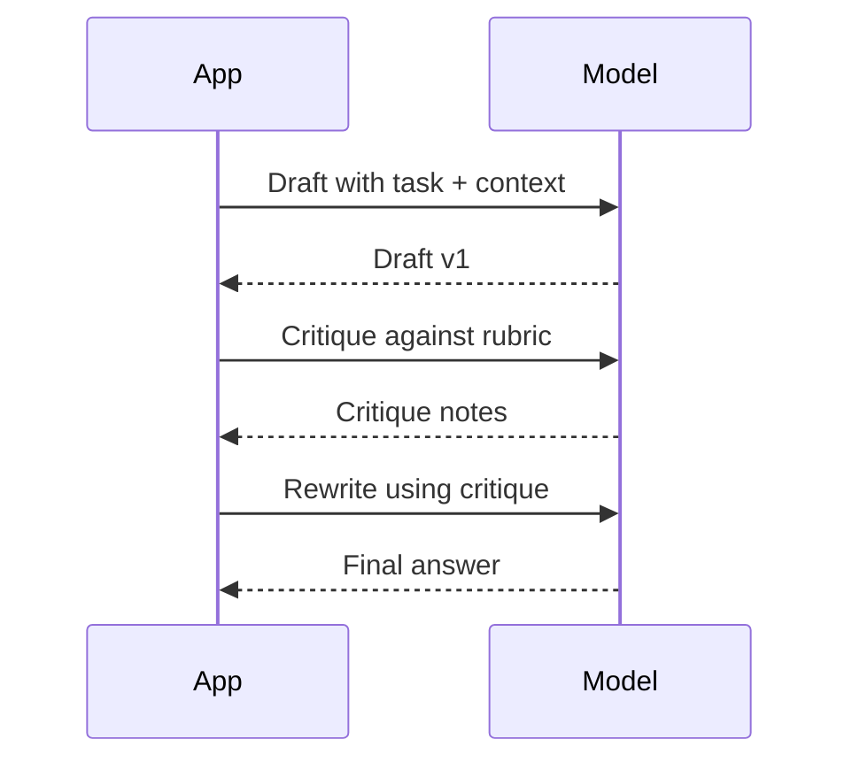

This can improve quality for writing, summarization, and code review. It adds latency and token cost—use it when quality gains justify the expense.

**Critical rule:** critique loops do not replace independent validation. The same model that hallucinated in the draft can approve its own mistake in critique.

### Role and policy boundaries
The system message or top-level instruction should define the role and safety rules. User content should not be allowed to overwrite those rules.

Think of roles as layers:

| Layer | Contains | Example |
| --- | --- | --- |
| System | Global behavior, safety | "You are a meeting assistant. Never invent deadlines." |
| Developer | Product rules for this feature | "Output JSON only. Max 5 action items." |
| User | The actual request and data | "Here are today's notes: ..." |

**Prompt injection** happens when user text tries to override trusted instructions ("Ignore previous rules and ..."). Advanced prompts mitigate this by clearly separating policy from user content and instructing the model to treat user text as untrusted data.

### Prompt templates and versioning
Production prompts should be **templates**, not hard-coded strings scattered through your codebase.

A template has:

- fixed sections (role, rules, schema)
- variable slots (`{{user_notes}}`, `{{audience}}`)
- version metadata (`prompt_version: "meeting-v3"`)

Version prompts like code. When output quality shifts after a model update, you need to know which prompt version produced which result.

### Advantages
- improves consistency across varied inputs
- supports reusable workflows across features
- makes outputs easier to validate programmatically
- guides complex tasks with examples and rubrics
- separates concerns: policy, task, and user data

### Limitations
- prompts can become long and fragile
- examples can accidentally teach the wrong pattern
- critique loops do not guarantee correctness
- too many instructions can confuse the model
- maintenance cost grows with complexity

### Alternatives
When prompt complexity stops paying off, consider:

- **Fine-tuning** — repeated patterns at scale baked into model weights
- **Tool use / retrieval (RAG)** — external facts instead of hoping the model remembers
- **Deterministic code** — exact transformations the model should not handle
- **Human-in-the-loop** — approval steps for high-stakes outputs

### When should you use advanced prompting?
Use it when:

- the task needs more than one instruction to be reliable
- output consistency matters for downstream code
- examples teach the behavior better than plain rules
- you need structured output without a separate parsing pipeline

### When should you stop adding prompt complexity?
Stop when:

- the prompt becomes harder to understand than the task itself
- the task is better solved by code, retrieval, or fine-tuning
- maintenance cost exceeds the value gained
- evaluation shows diminishing returns from more examples

## Visual Learning

### Advanced Prompt Pipeline
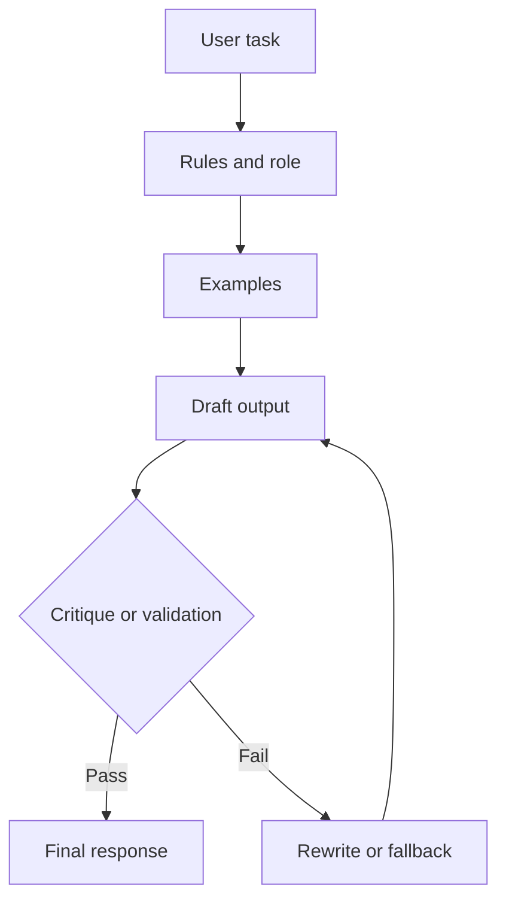

### Reusable Prompt Template Flow
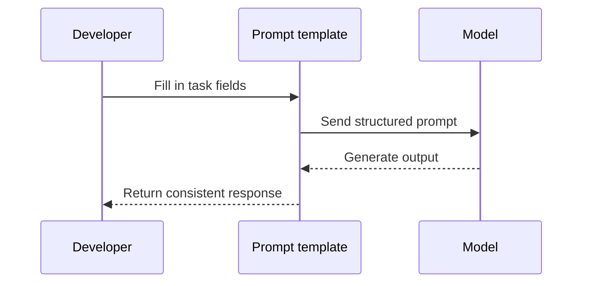

### Prompt Design Mind Map
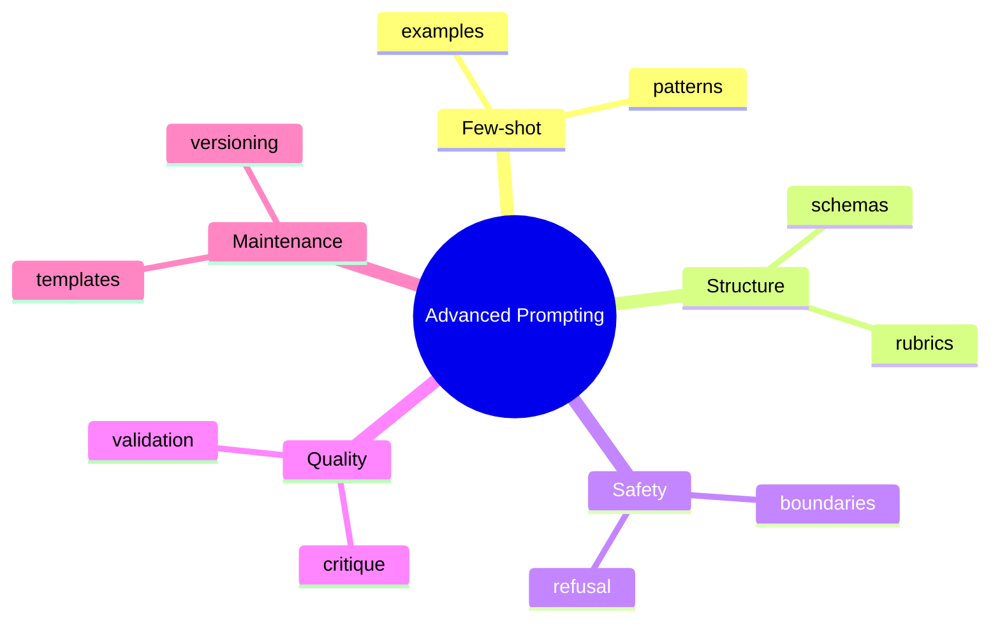

### Few-Shot vs Zero-Shot Decision
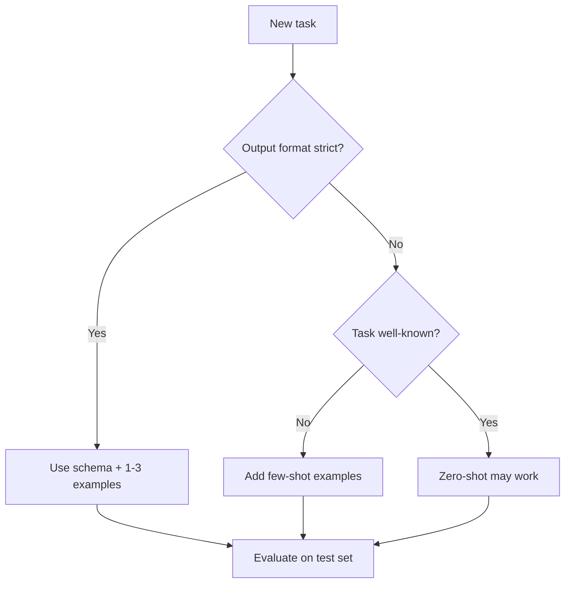

### Critique Loop Architecture
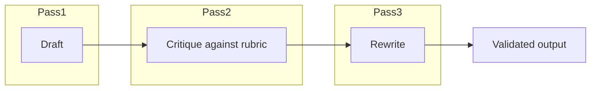

### Role Separation
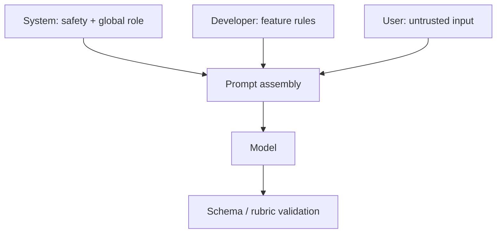

### Prompt Version Lifecycle
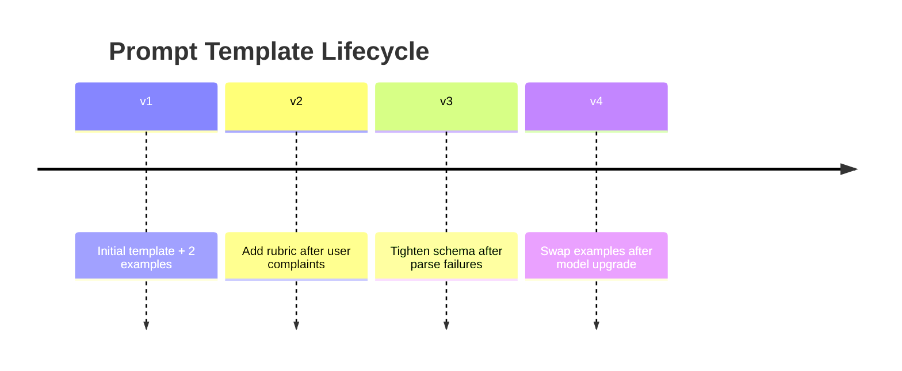

### Complexity Ceiling
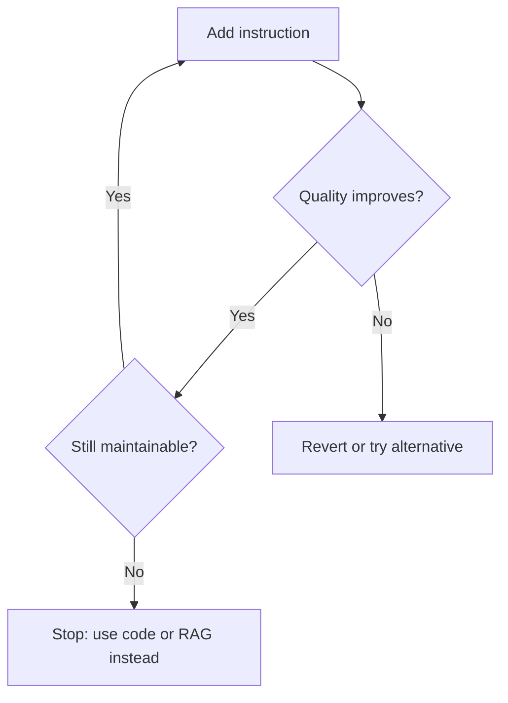

## Code Walkthrough

These examples show how advanced prompt patterns are built in application code—not typed ad hoc in a chat box.

### Example 1: Python — Few-shot classification template
```python
EXAMPLES = [
    {"text": "I love this product!", "label": "positive"},
    {"text": "Worst experience ever.", "label": "negative"},
    {"text": "It arrived on time.", "label": "neutral"},
]

def build_few_shot_prompt(text: str) -> str:
    lines = [
        "Classify sentiment as positive, negative, or neutral.",
        "Follow the examples exactly.",
        "",
    ]
    for ex in EXAMPLES:
        lines.append(f"Text: {ex['text']}")
        lines.append(f"Label: {ex['label']}")
        lines.append("")
    lines.append(f"Text: {text}")
    lines.append("Label:")
    return "\n".join(lines)
```

#### Code Explanation
- `EXAMPLES` is a reusable constant—update examples in one place.
- The builder assembles a consistent prompt shape for every input.
- Trailing `"Label:"` primes the model to continue with the classification.
- Keeping examples in code (not the user message) prevents injection of fake examples.

### Example 2: TypeScript — Few-shot with typed examples
```typescript
type SentimentExample = { text: string; label: 'positive' | 'negative' | 'neutral' };

const EXAMPLES: SentimentExample[] = [
  { text: 'I love this product!', label: 'positive' },
  { text: 'Worst experience ever.', label: 'negative' },
  { text: 'It arrived on time.', label: 'neutral' },
];

function buildFewShotPrompt(text: string): string {
  const header = 'Classify sentiment as positive, negative, or neutral.\n\n';
  const body = EXAMPLES.map(
    (ex) => `Text: ${ex.text}\nLabel: ${ex.label}\n`
  ).join('\n');
  return `${header}${body}Text: ${text}\nLabel:`;
}
```

#### Code Explanation
- TypeScript literal types constrain labels to valid values.
- The function mirrors the Python builder—language choice does not change the pattern.
- Typed examples catch typos like `"positve"` at compile time.

### Example 3: Python — Schema extraction prompt
```python
MEETING_SCHEMA = """
Return JSON with this shape:
{
  "summary": "string, max 50 words",
  "action_items": [
    {"task": "string", "owner": "string or null", "deadline": "string or null"}
  ],
  "open_questions": ["string"]
}
Rules:
- Use null when owner or deadline is not stated.
- Do not invent names or dates.
"""

def build_extraction_prompt(notes: str) -> str:
    return f"{MEETING_SCHEMA}\n\nMeeting notes:\n{notes}"
```

#### Code Explanation
- The schema is defined once and reused across requests.
- Explicit null rules reduce hallucinated metadata.
- User notes are appended after the rules, not mixed into policy text.

### Example 4: TypeScript — Rubric-driven summarization
```typescript
const RUBRIC = [
  'Use short sentences (under 20 words each).',
  'Include every action item explicitly stated in the notes.',
  'Do not invent deadlines or owners.',
  'Keep total length under 150 words.',
];

function buildSummaryPrompt(notes: string): string {
  const rubricText = RUBRIC.map((rule, i) => `${i + 1}. ${rule}`).join('\n');
  return `Summarize the meeting notes.\n\nRubric:\n${rubricText}\n\nNotes:\n${notes}`;
}
```

#### Code Explanation
- Numbered rubric items make critique passes easier ("Rule 3 violated").
- Rubrics define **quality** separate from **format**.
- The same rubric can score both human and model outputs.

### Example 5: Python — Critique-and-refine two-pass
```python
def build_critique_prompt(draft: str, rubric: list[str]) -> str:
    rules = "\n".join(f"- {r}" for r in rubric)
    return f"""Review this draft against the rubric.
List specific violations. If none, say PASS.

Rubric:
{rules}

Draft:
{draft}
"""

def build_rewrite_prompt(draft: str, critique: str) -> str:
    return f"""Rewrite the draft fixing every issue in the critique.
Keep the same factual content. Do not add new facts.

Draft:
{draft}

Critique:
{critique}
"""
```

#### Code Explanation
- Two functions = two API calls (or two turns in one thread).
- Critique is structured before rewrite—do not skip straight to rewrite.
- "Do not add new facts" limits hallucination during refinement.

### Example 6: TypeScript — Prompt template with variables
```typescript
type MeetingTemplateVars = {
  notes: string;
  audience: string;
  maxActionItems: number;
};

const MEETING_TEMPLATE = `
You are a meeting assistant for {{audience}}.
Extract up to {{maxActionItems}} action items.
Return JSON only.

Notes:
{{notes}}
`;

function renderTemplate(template: string, vars: MeetingTemplateVars): string {
  return template
    .replace('{{audience}}', vars.audience)
    .replace('{{maxActionItems}}', String(vars.maxActionItems))
    .replace('{{notes}}', vars.notes);
}
```

#### Code Explanation
- `{{placeholders}}` make templates readable and diff-friendly.
- Production code often uses a proper templating library; this shows the idea.
- Separating template from render logic enables versioning and testing.

### Example 7: Python — Role-separated messages
```python
def build_messages(user_notes: str) -> list[dict]:
    return [
        {
            "role": "system",
            "content": (
                "You are a meeting assistant. "
                "Never invent deadlines or assign owners not mentioned in notes."
            ),
        },
        {
            "role": "developer",
            "content": "Return JSON with keys: summary, action_items, open_questions.",
        },
        {
            "role": "user",
            "content": f"Meeting notes:\n{user_notes}",
        },
    ]
```

#### Code Explanation
- Three roles map to API message types you will use on Day 6+.
- Policy lives in `system`; format rules in `developer`; data in `user`.
- This structure resists prompt injection better than one blob of text.

### Example 8: TypeScript — Prompt version registry
```typescript
type PromptVersion = {
  id: string;
  template: string;
  changelog: string;
};

const PROMPT_REGISTRY: Record<string, PromptVersion> = {
  'meeting-v3': {
    id: 'meeting-v3',
    template: MEETING_TEMPLATE,
    changelog: 'Added null rules for missing deadlines',
  },
  'meeting-v2': {
    id: 'meeting-v2',
    template: MEETING_TEMPLATE,
    changelog: 'Initial schema extraction',
  },
};

function getPrompt(version: string): PromptVersion {
  const prompt = PROMPT_REGISTRY[version];
  if (!prompt) throw new Error(`Unknown prompt version: ${version}`);
  return prompt;
}
```

#### Code Explanation
- Version IDs let you log which prompt produced each output.
- Changelog documents why versions changed—essential for team debugging.
- Registry pattern supports A/B testing between prompt versions.

### Example 9: Python — Test case runner (no API required)
```python
TEST_CASES = [
    {"notes": "Alice will send the report Friday.", "expect_owner": "Alice"},
    {"notes": "We should follow up soon.", "expect_owner": None},
    {"notes": "", "expect_error": True},
]

def validate_action_item(item: dict, case: dict) -> bool:
    if case.get("expect_error"):
        return item is None
    owner = item.get("owner") if item else None
    return owner == case.get("expect_owner")
```

#### Code Explanation
- Test cases define expected behavior before calling any model.
- Validation functions check structure, not just string matching.
- Empty input is an edge case every advanced prompt should handle.

### Example 10: TypeScript — Self-check instruction (safe pattern)
```typescript
const SELF_CHECK_RULES = `
Before returning your answer:
1. Verify every fact appears in the source text.
2. Verify the output matches the required JSON schema.
3. If information is missing, use null—not guesses.
If any check fails, fix the output before responding.
`;

function buildPromptWithSelfCheck(task: string, source: string): string {
  return `${task}\n\n${SELF_CHECK_RULES}\n\nSource:\n${source}`;
}
```

#### Code Explanation
- Self-check instructions nudge the model to verify before finishing.
- This is not a substitute for code-side validation.
- Listing specific checks works better than "make sure it's correct."

### Example 11: Python — Chain-of-thought with hidden steps
```python
COT_INSTRUCTION = """
Solve the problem step by step internally.
In your final response, include ONLY:
- answer: the final numeric or text answer
- brief_steps: 2-3 bullet points summarizing your approach (not full scratch work)
"""

def build_math_prompt(problem: str) -> str:
    return f"{COT_INSTRUCTION}\n\nProblem: {problem}"
```

#### Code Explanation
- Internal CoT improves accuracy without dumping verbose reasoning on users.
- Output contract limits what gets exposed downstream.
- `brief_steps` supports tutoring UX without full chain exposure.

### Example 12: TypeScript — Fallback when input is insufficient
```typescript
function buildPromptWithFallback(notes: string): string {
  if (!notes.trim()) {
    return 'Return JSON: {"error": "insufficient_input", "message": "No meeting notes provided."}';
  }
  return renderTemplate(MEETING_TEMPLATE, {
    notes,
    audience: 'engineering team',
    maxActionItems: 5,
  });
}
```

#### Code Explanation
- Application code can short-circuit before a model call when input is empty.
- Fallback messages should match your output schema for consistent parsing.
- Deterministic fallbacks save tokens and latency.

## Practical Examples

### Beginner Example: Few-shot sentiment classification
You show the model three labeled reviews, then ask it to classify a new one.

Why this works:
- the model learns the label format from examples
- output is more stable than "classify this" alone
- you can test by swapping examples and measuring accuracy

### Intermediate Example: Summarization with a rubric
You summarize a document with rules: "under 100 words," "include action items only," "no invented dates."

Why this matters:
- the rubric defines quality, not just format
- outputs become comparable across runs
- critique passes can reference rubric line numbers

### Advanced Example: Meeting note extraction pipeline
A company turns Slack meeting threads into structured action items for Jira.

Pipeline:
1. System policy: never invent assignees
2. Few-shot examples from real (redacted) meetings
3. JSON schema extraction
4. Code validation: parse JSON, check required fields
5. Human review queue for low-confidence items

Why professionals use this:
- output feeds automation—errors are expensive
- each layer catches failures the previous missed

### Production Example: Multi-template support assistant
A SaaS product has separate prompt templates per ticket category: billing, technical, account.

Each template shares a system policy but has different examples, schemas, and rubrics. Templates are versioned; logs record `prompt_version` per request.

Why this is production-shaped:
- one size does not fit all ticket types
- versioning enables rollback when quality drops

### Real-World Company Example
**Support teams** at companies like Shopify and Intercom use prompt templates to draft replies. Templates standardize tone, enforce policy ("never promise refunds without manager approval"), and output structured fields for agent review.

**Legal and finance teams** use schema extraction to pull clauses, dates, and amounts from documents—with human verification because critique loops alone are insufficient.

The pattern is universal: **policy + examples + schema + validation**.

## Comparison Tables

### Zero-Shot vs Few-Shot vs Many-Shot
| Approach | Best for | Token cost | Risk |
| --- | --- | --- | --- |
| Zero-shot | Simple, well-known tasks | Lowest | Format drift |
| Few-shot (1–5) | Pattern teaching, formatting | Moderate | Bad examples teach bad habits |
| Many-shot (6+) | Rare complex formats | High | Context pressure, redundancy |

### CoT Exposure Levels
| Level | User sees | Best for |
| --- | --- | --- |
| Hidden | Final answer only | Automation, high volume |
| Summary | 2–3 step bullets | Tutoring, transparency |
| Full | Complete chain | Debugging, education |

### Critique Loop vs Code Validation
| Aspect | Critique loop | Code validation |
| --- | --- | --- |
| Catches | Style, rubric violations | Schema, types, business rules |
| Cost | Extra model calls | Compute only |
| Trust level | Medium | High (when rules are deterministic) |
| Use both? | Yes—for quality before validation | Yes—always for structured output |

### Prompt Engineering vs Alternatives
| Need | Start with | Escalate to |
| --- | --- | --- |
| Format consistency | Schema + examples | Structured output API (Day 10) |
| Factual accuracy | Grounding + "cite source" | RAG (Day 17) |
| Repeated style at scale | Prompt templates | Fine-tuning |
| Exact transforms | Code | Not the model |

### Template Maintenance Maturity
| Stage | Behavior |
| --- | --- |
| Ad hoc | Prompts in notebooks and chat |
| Centralized | Templates in repo with version IDs |
| Tested | Golden test cases run on every change |
| Monitored | Production logs tie output to prompt version |

## Best Practices
- use examples that represent real tasks, not only toy cases
- define success with a rubric when quality is subjective
- separate system rules from user content
- ask for citations or source grounding when correctness matters
- keep internal reasoning hidden unless the product needs transparency
- version prompt templates like application code
- test with edge cases: empty input, conflicting instructions, injection attempts
- cap prompt length—every example costs tokens
- validate structured output in code, not only in prompts
- document why each example exists (what pattern it teaches)

## Common Mistakes
- making prompts so long they become unmaintainable
- using examples that accidentally teach the wrong pattern
- asking the model to do too many transformations in one step
- trusting self-checks or critique loops without code validation
- forgetting task constraints when refining outputs
- changing examples without re-running the test suite
- exposing full chain-of-thought in user-facing products unnecessarily
- mixing user data into system instructions

### Debugging Strategy
When an advanced prompt fails, check these in order:

1. Are the examples representative and non-contradictory?
2. Is the schema unambiguous (null rules, field types)?
3. Are any instructions conflicting?
4. Is the task split into too many steps—or too few?
5. Did you test worst-case inputs (empty, messy, adversarial)?
6. Did the model version change since the prompt was written?

## Performance

### Prompt Size
More examples and instructions consume more tokens on every request. A 2,000-token prompt at 10,000 requests/day adds up quickly.

Mitigation:
- use the minimum examples that achieve reliability
- move stable policy to system messages (cached on some providers)
- trim redundant instructions after evaluation

### Output Reliability
Better structure reduces retries, manual cleanup, and support tickets. Measure parse success rate and rubric pass rate—not just "looks fine."

### Maintenance Cost
Complex prompts need owners, changelogs, and test cases. Assign a prompt owner the same way you assign code module owners.

## Security
Advanced prompts must respect boundaries:

- do not let user input override top-level policies
- treat user content as untrusted data, not instructions
- do not ask the model to reveal sensitive internal reasoning in production
- do not assume critique loops remove injection or safety risks
- log prompt versions, not full user content, unless policy allows

## Evaluation
Advanced prompts need test cases, not intuition.

### What to measure
- consistency across a golden test set
- schema validity rate (JSON parse success)
- rubric adherence score
- resistance to tricky and adversarial inputs
- maintainability (can a new developer update it?)

### Evaluation checklist
1. Does the prompt work on 10+ real inputs?
2. Do examples cover the main edge cases?
3. Is output structured enough for downstream code?
4. What happens with empty or injection inputs?
5. Does quality hold after a model upgrade?

## Exercises

### Easy
1. Write two few-shot examples for a sentiment classification task.
2. Explain why examples help prompts more than rules alone for some tasks.
3. Identify one reason prompt length can be a problem.
4. Describe what a rubric is and give one rubric line for summarization.
5. Name the three message roles used in role-separated prompts.
6. What is schema extraction?
7. Give one example of when zero-shot is enough.

### Medium
8. Add a four-line rubric to a meeting summarization prompt.
9. Separate policy rules from user content in a sample three-message prompt.
10. Explain why schema extraction is useful for downstream code.
11. Describe when a critique loop might help—and when it is wasteful.
12. Write a JSON schema for extracting `{title, owner, status}` from text.
13. Design two few-shot examples that teach "use null when missing."
14. Explain the difference between hidden and full chain-of-thought.
15. List three edge cases to test for a meeting-notes prompt.

### Hard
16. Design a prompt that extracts structured fields from messy meeting notes.
17. Explain how you would test an advanced prompt with 10 edge cases.
18. Describe how you would version a prompt template in a team repository.
19. Explain why hidden reasoning should not always be exposed to users.
20. Build a critique-and-rewrite prompt pair for a writing assistant.
21. Design a fallback response when notes are empty.
22. Write a prompt version changelog entry explaining a schema change.

### Challenge
23. Create a full prompt template with variables for audience and format.
24. Build a rubric with 8 criteria for note summarization quality scoring.
25. Design a reusable template system for three document types (email, report, memo).
26. Explain when prompt complexity should be replaced by RAG or fine-tuning.
27. Write a test plan that includes one prompt injection case.

### Reflection Questions
28. What is the difference between a prompt that works once and a prompt that works in production?
29. When did adding an example make your prompt worse?
30. How would you explain few-shot prompting to a product manager?
31. What would you measure to know an advanced prompt is "good enough"?
32. How does today's work connect to the StudySpark capstone?

## Quizzes

### Quiz 1
1. What does few-shot prompting provide to the model?
2. Which role should contain global safety rules?
3. What is a rubric used for?
4. Why use null in a schema instead of guessing?

**Answers:** 1. Input/output examples to imitate  2. System  3. Defining quality criteria  4. To avoid inventing missing data

### Quiz 2
1. What is a critique-and-refine loop?
2. Name one limitation of self-check instructions.
3. What is prompt injection?
4. Why version prompts?

**Answers:** 1. Draft, review against rubric, rewrite  2. Model may still be wrong; not a substitute for code validation  3. User text attempting to override trusted instructions  4. Track changes, debug quality shifts, enable rollback

### Quiz 3
1. When is zero-shot likely enough?
2. What does chain-of-thought improve?
3. Name one sign you should stop adding prompt complexity.
4. What should validate JSON output—the prompt or the code?

**Answers:** 1. Simple well-known tasks with loose format  2. Multi-step reasoning accuracy  3. Maintainability drops or quality plateaus  4. Code (always)

### Quiz 4
1. How many few-shot examples are usually enough?
2. What is schema extraction?
3. Why separate developer rules from user messages?
4. Name one alternative to a 3,000-token prompt.

**Answers:** 1. Often 1–5  2. Pulling structured data from unstructured text  3. Keep product policy stable and resist injection  4. RAG, fine-tuning, or deterministic code

### Quiz 5
1. What is a prompt template?
2. Why can bad examples hurt more than no examples?
3. What is hidden chain-of-thought?
4. What belongs in a golden test set?

**Answers:** 1. Reusable prompt with variable slots and fixed sections  2. They teach wrong patterns explicitly  3. Model reasons internally; user sees summary or answer only  4. Realistic inputs including edge cases and expected behaviors

## Interview Questions

### Conceptual
- Explain few-shot prompting and when you would use it.
- What is the difference between a rubric and a schema?
- How do role boundaries help with prompt injection?
- When would you use a critique loop vs single-pass generation?
- How do you decide between prompt engineering and fine-tuning?

### Practical
- Walk through designing a prompt for meeting action-item extraction.
- How would you version and test prompt templates in CI?
- How would you handle missing data without hallucination?
- Describe a prompt that failed in production and how you fixed it.

### System Design
- Design a prompt template system for a multi-feature SaaS product.
- Design evaluation infrastructure for prompt quality regression.
- How would you A/B test two prompt versions safely?

### Debugging
- Outputs suddenly include invented deadlines. What do you check?
- JSON parse rate dropped after a model upgrade. What are likely causes?
- Users report inconsistent tone. Which prompt sections do you inspect?

## Mini Project
Build a **reusable prompt template** for turning meeting notes into action items, owners, and deadlines.

### Goal
Create a prompt system that can be reused on many meetings and still produce a consistent, parseable structure.

### Features
- system role with anti-hallucination rules
- developer role with JSON schema
- 2–3 few-shot examples (can be synthetic)
- quality rubric with at least 5 criteria
- fallback behavior for empty or insufficient notes
- prompt version ID and changelog

### Suggested Folder Structure
```text
meeting-template/
├── prompt.md              # Main template with {{variables}}
├── examples.json          # Few-shot pairs
├── rubric.md              # Quality criteria
├── schema.json            # Expected output shape
├── test-cases.md          # At least 5 inputs with expected behavior
└── CHANGELOG.md           # Version history
```

### Project Steps
1. define what counts as a useful meeting summary for your audience
2. write 2–3 example input/output pairs (include one with missing dates)
3. define the JSON schema for action items
4. write the rubric and anti-hallucination rules
5. specify fallback JSON for empty input
6. run all test cases manually (no API required) against your spec
7. assign version `meeting-v1` and document in CHANGELOG

### Acceptance Criteria
- another developer could implement from your spec alone
- schema explicitly handles null for missing owners/deadlines
- at least 5 test cases including empty and messy notes
- rubric covers factual grounding, not just formatting

### What You Learn
- how to build a reusable prompt system
- how examples and rubrics improve consistency
- how to structure prompts for real workflows and downstream code

## Cumulative Capstone Update

Add to [`projects/CAPSTONE.md`](../../projects/CAPSTONE.md):

- **Advanced patterns in use** — document which patterns StudySpark will use: few-shot examples, role-separated messages, schema extraction, or critique loops
- **Prompt template location** — where capstone prompt templates live (e.g., `projects/studyspark/prompts/`)
- **Failure cases** — list 3 ways prompts can fail (hallucination, format drift, injection) and how StudySpark prompts should recover
- **Version ID** — assign an initial prompt version string for the study-assistant template

Example capstone note:

```text
StudySpark prompt v1 uses:
- system: tutor role + safety boundaries
- few-shot: 2 example Q&A pairs for study questions
- schema: { answer, key_points[], difficulty }
- fallback: "I need a clearer question" when input is vague
```

## Historical Background

Prompt engineering as a discipline accelerated alongside chat-style models (2022–2023). Early GPT-3 workflows relied on clever single-shot phrasing. As models improved at following instructions, teams shifted investment toward **structured, testable prompt systems**.

Few-shot prompting has roots in GPT-3 papers (Brown et al., 2020), which showed models could infer tasks from examples without weight updates. Chain-of-thought prompting (Wei et al., 2022) demonstrated that step-by-step reasoning instructions improve accuracy on math and logic tasks.

The industry lesson from 2023–2025: prompts are **software artifacts**. They belong in version control, CI test suites, and observability dashboards—not in scattered Google Docs.

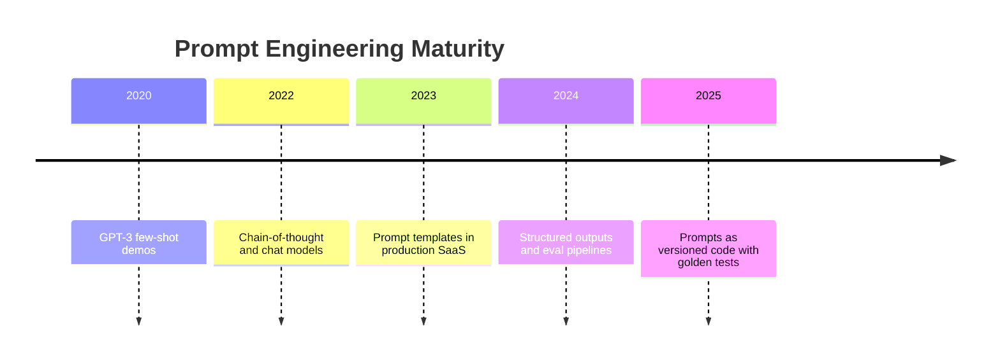

## Summary
Advanced prompting is about **consistency**, not cleverness.

Examples, rubrics, schemas, and clear role boundaries make prompts dependable in real-world use. Critique loops and chain-of-thought add quality when used deliberately—but code validation and test cases remain essential. Once you treat prompts as reusable system components, they become much easier to test, maintain, and trust.

Tomorrow on Day 6, these prompts become **API request payloads**—the bridge between instruction design and executable software.

[Previous: Day 4 - Prompt Engineering Fundamentals](../day_04/day_04_prompt_engineering_fundamentals.md) | [Next: Day 6 - LLM APIs](../day_06/day_06_llm_apis.md)

## Further Reading
- https://www.promptingguide.ai/techniques/fewshot
- https://www.promptingguide.ai/techniques/cot
- https://cookbook.openai.com/
- https://docs.anthropic.com/en/docs/build-with-claude/prompt-engineering/overview
- https://www.deeplearning.ai/short-courses/chatgpt-prompt-engineering-for-developers/
