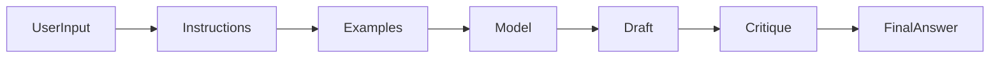
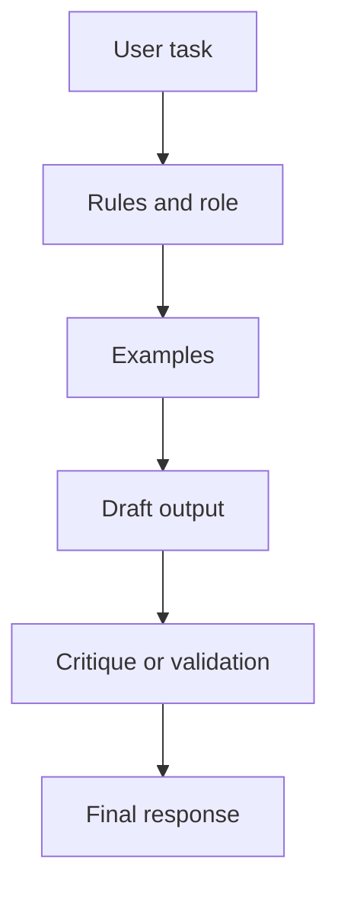
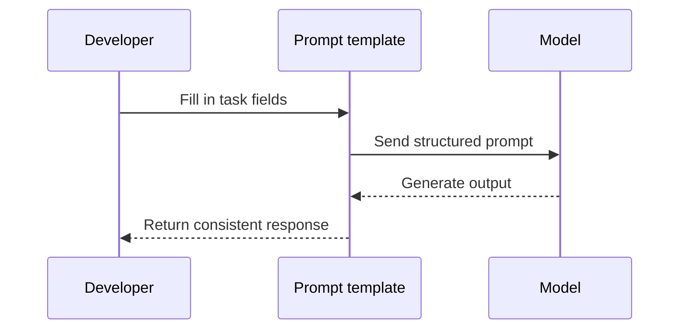
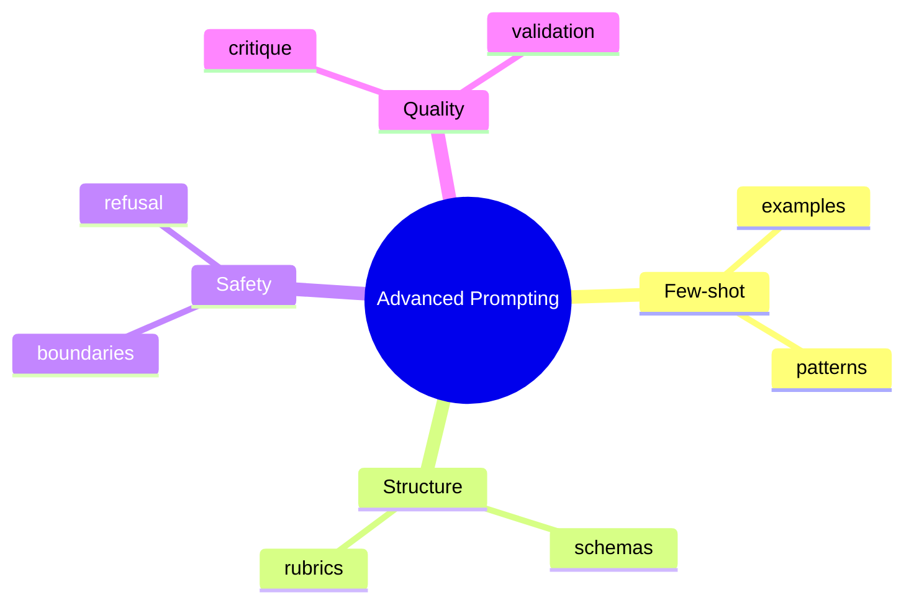

# Day 5 - Advanced Prompt Engineering

[Previous: Day 4 - Prompt Engineering Fundamentals](../day_04/day_04_prompt_engineering_fundamentals.md) | [Next: Day 6 - LLM APIs](../day_06/day_06_llm_apis.md)

## Introduction
Day 4 taught you how to write a good prompt. Day 5 teaches you how to make prompts dependable.

Advanced prompt engineering is about designing prompts that work reliably across different inputs, tasks, and failure cases. The goal is not only a good demo, but consistent behavior.


Once a prompt is being used in a real product, consistency matters more than clever wording. That is why this lesson focuses on patterns, tests, and maintainable prompt design.

## Learning Objectives
By the end of this day, you should be able to:

- use few-shot prompting effectively
- design prompts with role and policy boundaries
- reduce hallucinations with better context design
- ask for self-checking and structured reasoning safely
- build prompt patterns for reusable workflows
- create prompts that are easier to test and maintain
- recognize when prompt engineering alone is not enough

## Prerequisites
You should already understand:

- Day 4: prompt fundamentals
- Day 3: token and context limits
- Day 2: how LLMs generate text

Advanced prompting makes more sense when you already know that prompts are constrained by context size and model behavior is probabilistic.

## Big Picture
As prompts get more complex, you need more than one instruction sentence. You may need examples, rubrics, output schemas, and fallback instructions.

Common advanced patterns include:

- few-shot prompting
- task decomposition with hidden reasoning kept internal
- critique and refine loops
- extraction with schemas
- role separation for system and user messages



## Why Advanced Prompting Exists
Simple prompts work for simple tasks. Real products usually need more.

Advanced prompting exists because you may need to:

- teach the model a pattern through examples
- constrain a response into a predictable structure
- separate policy from user content
- add a review step before returning the result
- keep the prompt reusable across many inputs

## Deep Theory

### What makes a prompt advanced?
A prompt becomes advanced when it does more than issue one instruction.

It may include:

- multiple examples
- structured output requirements
- internal critique or verification steps
- task-specific rules
- fallback or refusal behavior

### Few-shot prompting
Few-shot prompting gives the model a small number of examples so it can imitate the desired pattern.

This is useful when the task is easier to show than to describe.

### Schema extraction
Sometimes the job is not to generate freeform text.

Instead, the prompt should extract data into a predictable structure such as JSON or bullet points with labels.

### Critique and refine loops
In a critique and refine workflow, the model first drafts an answer and then reviews or improves it.

This can help with quality, but it must not replace independent validation when correctness matters.

### Role and policy boundaries
The system message or top-level instruction should define the role and safety rules.

User content should not be allowed to overwrite those rules.

### Why hidden reasoning matters
Sometimes a task benefits from internal step-by-step reasoning, but the useful output does not need to expose every intermediate thought.

In product settings, it is usually better to expose the final answer, the reasoning summary, or the result structure rather than verbose hidden reasoning.

### Advantages
- improves consistency across inputs
- supports reusable workflows
- makes outputs easier to validate
- helps guide complex tasks with examples and rubrics

### Limitations
- prompts can become long and fragile
- examples can accidentally teach the wrong pattern
- critique loops do not guarantee correctness
- too many instructions can confuse the model

### Alternatives
- fine-tuning for repeated patterns at scale
- tool use or retrieval for external facts
- deterministic code for exact transformations

### When should you use advanced prompting?
Use it when:

- the task needs more than one instruction
- output consistency matters
- examples can teach the behavior better than plain text

### When should you stop adding prompt complexity?
Stop when:

- the prompt becomes hard to understand
- the task is better solved by code or retrieval
- maintenance becomes harder than the value gained

## Visual Learning

### Advanced Prompt Pipeline


### Reusable Prompt Template Flow


### Prompt Design Mind Map


## Code Walkthrough

These examples show how prompt patterns are built in application code.

### Python Example
```python
examples = [
    {"input": "2+2", "output": "4"},
    {"input": "3+5", "output": "8"},
]

prompt = "Use the examples to answer new math questions.\n"
for item in examples:
    prompt += f"Input: {item['input']} -> Output: {item['output']}\n"

print(prompt)
```

#### Code Explanation
- the examples show the expected pattern.
- the prompt is built programmatically so it can be reused.
- the model can infer the transformation from the examples.

### TypeScript Example
```typescript
const examples = [
  { input: '2+2', output: '4' },
  { input: '3+5', output: '8' },
];

let prompt = 'Use the examples to answer new math questions.\n';
for (const item of examples) {
  prompt += `Input: ${item.input} -> Output: ${item.output}\n`;
}

console.log(prompt);
```

#### Code Explanation
- the same idea works in TypeScript.
- a template can assemble repeated sections.
- structured prompt generation helps maintainability.

### Python Example: Add a rubric
```python
rubric = [
    "Use short sentences.",
    "Include every action item.",
    "Do not invent deadlines.",
]

prompt = "Summarize the meeting notes.\n" + "\n".join(rubric)
print(prompt)
```

#### Code Explanation
- rubrics describe what good output looks like.
- they are useful when style or quality matters.

### TypeScript Example: Schema extraction prompt
```typescript
const prompt = `
Extract the following fields as JSON:
- title
- owner
- deadline
- status
`;

console.log(prompt.trim());
```

#### Code Explanation
- the instruction is explicit about the output shape.
- structured extraction is easier to use in downstream code.

### Python Example: Prompt test cases
```python
test_inputs = [
    "Summarize this short note.",
    "Summarize this messy note with missing dates.",
    "Summarize and translate this note.",
]

for item in test_inputs:
    print("Testing:", item)
```

#### Code Explanation
- advanced prompts should be tested with realistic variation.
- edge cases often reveal weak assumptions.

## Practical Examples

### Beginner Example: Few-shot classification
You can show the model examples of labels and then ask it to classify new inputs.

Why this works:

- the model learns the mapping from examples
- the output can be more stable than a vague instruction

### Intermediate Example: Summarization with a rubric
You can summarize a document with rules like "keep it under 100 words" and "include action items only."

Why this matters:

- the rubric gives a definition of quality
- the output becomes easier to compare across runs

### Professional Example: Meeting note extraction
A company may need notes turned into action items, owners, and deadlines.

Why professionals use this pattern:

- the output needs to be structured
- it is used by other software or workflows
- consistency is more important than creativity

### Real-World Company Example
Support, operations, and finance teams often use prompt templates to standardize outputs. They want repeatable results that can be reviewed, audited, and automated.

## Best Practices
- use examples that represent the real task, not toy edge cases only
- define success clearly with a rubric when possible
- separate system rules from user content
- ask for verification or citations when correctness matters
- keep sensitive reasoning internal and expose only the useful answer
- version prompt templates like code
- test prompts before putting them into a product

## Common Mistakes
- making prompts so long that they become hard to maintain
- using examples that accidentally teach the wrong pattern
- asking the model to do too many transformations at once
- trusting self-checks without independent validation
- forgetting to preserve task constraints when refining outputs
- changing examples without checking whether they still match the task

### Debugging Strategy
When an advanced prompt fails, check these things first:

1. Are the examples representative?
2. Is the schema unambiguous?
3. Are the instructions conflicting?
4. Is the task split into too many steps?
5. Did you test the worst-case inputs?

## Performance

### Prompt Size
More examples and instructions consume more tokens.

### Output Reliability
Better structure often reduces retries and manual cleanup.

### Maintenance Cost
Complex prompts need testing and versioning or they become hard to trust.

## Security
Advanced prompts should still respect boundaries.

- do not let user input override top-level policies
- do not ask the model to reveal sensitive internal reasoning
- do not assume critique loops remove the need for safety checks

## Evaluation
Advanced prompts need test cases, not just intuition.

### What to measure
- consistency across examples
- schema validity
- rubric adherence
- resistance to tricky inputs
- maintainability of the prompt itself

### Useful questions
- Does the prompt work on the real task?
- Are the examples helping or hurting?
- Is the response structured enough for downstream use?
- Can another developer understand and update the prompt?

## Exercises

### Easy
1. Write two few-shot examples for a classification task.
2. Explain why examples help prompts.
3. Identify one reason prompt length can be a problem.
4. Describe what a rubric is.

### Medium
5. Add a rubric to a prompt for summarization.
6. Separate policy rules from user content in a sample prompt.
7. Explain why schema extraction is useful.
8. Describe when a critique loop might help.

### Hard
9. Design a prompt that extracts structured fields from messy text.
10. Explain how you would test an advanced prompt with edge cases.
11. Describe how you would version a prompt template in a team.
12. Explain why hidden reasoning should not always be exposed.

### Challenge
13. Create a critique-and-rewrite prompt pair.
14. Build a rubric for a note summarization workflow.
15. Design a reusable prompt template for multiple document types.
16. Explain when prompt complexity should be replaced by code or retrieval.

## Mini Project
Build a reusable prompt template for turning meeting notes into action items, owners, and deadlines.

### Goal
Create a prompt that can be reused on many meetings and still produce a consistent structure.

### Required Sections
- role
- goal
- output schema
- formatting rules
- quality rubric
- fallback behavior

### Suggested structure
```text
meeting-template/
├── prompt.md
├── rubric.md
└── test-cases.md
```

### Project Steps
1. define what counts as a useful meeting summary
2. write a few example inputs and outputs
3. define the schema for action items
4. specify how missing information should be handled
5. test the template with messy notes
6. refine the examples and rubric based on failures

### What You Learn
- how to build a reusable prompt system
- how examples and rubrics improve consistency
- how to structure prompts for real workflows

## Summary
Advanced prompting is about consistency, not cleverness.

Examples, rubrics, and clear boundaries make prompts more dependable in real-world use. Once you treat prompts as reusable system components, they become much easier to test, maintain, and trust.

[Previous: Day 4 - Prompt Engineering Fundamentals](../day_04/day_04_prompt_engineering_fundamentals.md) | [Next: Day 6 - LLM APIs](../day_06/day_06_llm_apis.md)

## Additional Resources
- https://www.promptingguide.ai/techniques/fewshot
- https://cookbook.openai.com/
- https://docs.anthropic.com/en/docs/build-with-claude/prompt-engineering/overview
- https://www.deeplearning.ai/short-courses/chatgpt-prompt-engineering-for-developers/
