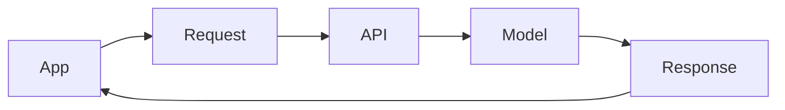

# Day 6 - LLM APIs

## Introduction
An LLM API is the bridge between your app and a hosted model. Instead of training your own model, you send a request, receive a response, and build product logic around that exchange. This is the point where prompt design becomes software design.


## Learning Objectives
By the end of this day, you should be able to:

- explain what an LLM API request contains
- describe the role of system, developer, and user instructions
- understand temperature, max tokens, and streaming at a high level
- build a simple request flow for a text generation app
- choose when an API is better than local inference

## Theory
An API call usually includes the model name, the messages or prompt, and generation settings. The app may also attach tools, metadata, or retrieval context. The model then returns a completion or streamed output.

The job of an AI engineer is to decide:

- what the model should see
- what it should not see
- how much freedom it should have
- how the response should be validated

### Visual Diagram


## Code Examples

### Python
```python
request = {
    "model": "example-model",
    "messages": [
        {"role": "system", "content": "You are a concise tutor."},
        {"role": "user", "content": "Explain APIs in one paragraph."},
    ],
    "temperature": 0.2,
    "max_tokens": 200,
}

print(request)
```

### TypeScript
```typescript
const request = {
  model: 'example-model',
  messages: [
    { role: 'system', content: 'You are a concise tutor.' },
    { role: 'user', content: 'Explain APIs in one paragraph.' },
  ],
  temperature: 0.2,
  maxTokens: 200,
};

console.log(request);
```

## Best Practices
- use small, explicit prompts
- keep generation settings intentional
- separate product logic from model logic
- log requests and responses for debugging
- design retries and fallbacks for network failures

## Common Mistakes
- sending the entire app state to the model
- using high temperature for tasks that need consistency
- ignoring request timeouts
- assuming the model can reliably infer hidden business rules
- coupling UI code directly to raw API payloads

## Exercises
- Easy: List the parts of an API request.
- Medium: Explain why max tokens matters.
- Hard: Design a request structure for a summarizer.
- Challenge: Describe how you would retry a failed request safely.

## Mini Project
Write the request spec for a text assistant that answers in three bullet points and keeps responses under 120 words.

## Summary
LLM APIs turn model capability into a programmable service. Good API use depends on clear requests, predictable output settings, and reliable app-side handling.

## Additional Resources
- https://platform.openai.com/docs
- https://docs.anthropic.com/
- https://ai.google.dev/
