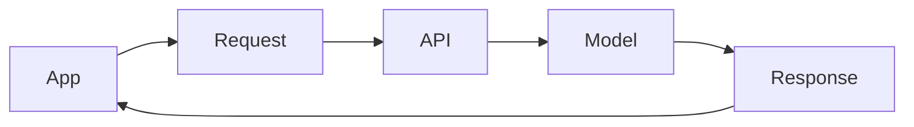
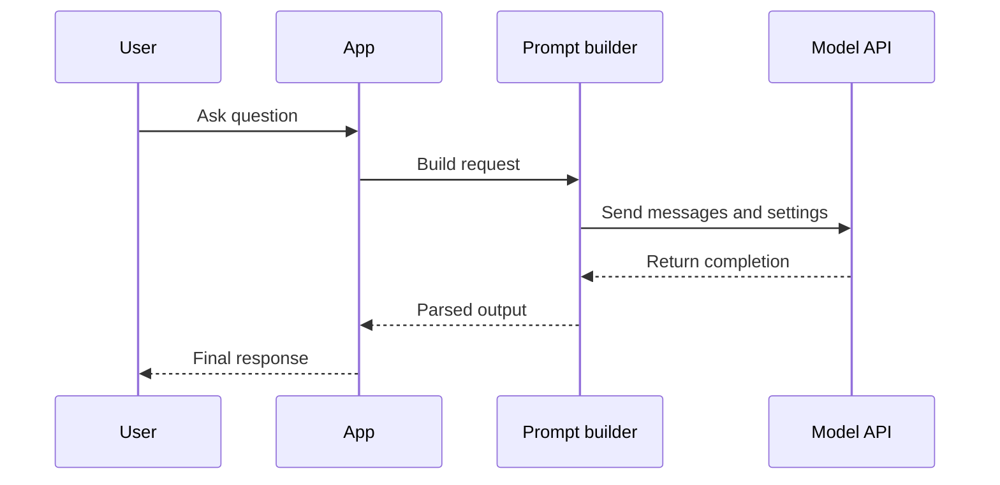
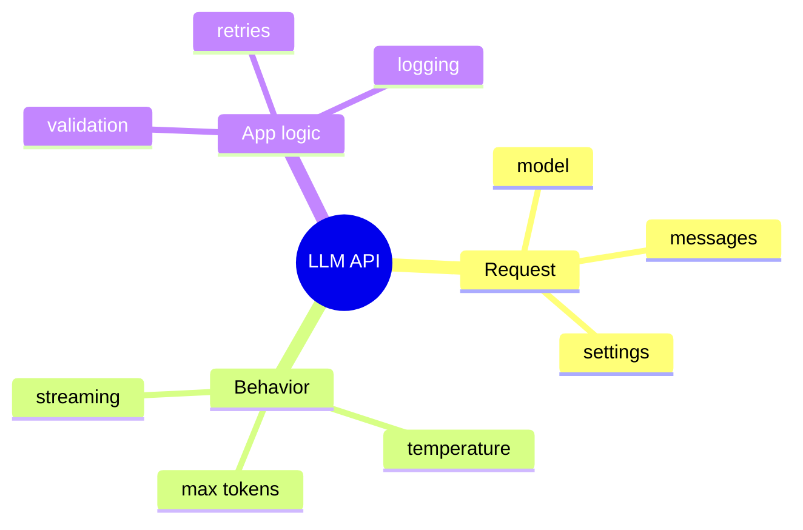
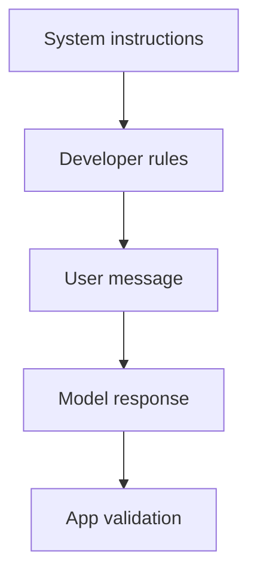

# Day 6 - LLM APIs

[Previous: Day 5 - Advanced Prompt Engineering](../day_05/day_05_advanced_prompt_engineering.md) | [Next: Day 7 - Mini Project: Prompt Helper](../day_07/day_07_mini_project_prompt_helper.md)

## Introduction
Day 5 taught you how to make prompts dependable. Day 6 shows how those prompts are sent to a real model.

An LLM API is the bridge between your app and a hosted model. Instead of training your own model, you send a request, receive a response, and build product logic around that exchange. This is the point where prompt design becomes software design.


Once you call an API, you are no longer just writing text. You are designing request objects, setting generation behavior, handling errors, and deciding how the application responds to the model’s output.

## Learning Objectives
By the end of this day, you should be able to:

- explain what an LLM API request contains
- describe the role of system, developer, and user instructions
- understand temperature, max tokens, and streaming at a high level
- build a simple request flow for a text generation app
- choose when an API is better than local inference
- describe how application code wraps a model call
- explain why retries, logging, and validation matter

## Prerequisites
You should already understand:

- Day 5: advanced prompting
- Day 4: prompt fundamentals
- Day 3: tokens and context windows

APIs make more sense once you already understand how prompts and output limits affect model behavior.

## Big Picture
An API call usually includes the model name, the messages or prompt, and generation settings. The app may also attach tools, metadata, or retrieval context. The model then returns a completion or streamed output.

The job of an AI engineer is to decide:

- what the model should see
- what it should not see
- how much freedom it should have
- how the response should be validated



## Why APIs Matter
APIs are how AI capability becomes a product feature.

They let you:

- send structured instructions
- control generation behavior
- swap models without rewriting the whole app
- add business logic around the model call
- handle failures like any other network dependency

## Deep Theory

### What is in an LLM API request?
A request usually contains:

- a model name
- instructions or messages
- optional context
- generation settings
- optional tool definitions or metadata

### Instruction hierarchy
Many modern APIs separate instructions by role.

- system instructions define the highest-level behavior
- developer instructions define application policy or product rules
- user instructions describe the immediate request

That hierarchy helps the application keep control over what the model should do.

### Generation settings
Common settings include:

- temperature, which influences randomness
- max tokens, which limits response length
- streaming, which sends output incrementally

### Why temperature matters
Lower temperature usually means more consistent output.

Higher temperature usually means more variation and creativity.

For factual or structured tasks, lower temperature is often safer.

### Why max tokens matters
Max tokens controls how long the response can be.

This matters because:

- it affects cost
- it affects latency
- it prevents unexpectedly long responses

### Why streaming matters
Streaming lets the app show output as it is generated.

This can improve perceived responsiveness, especially for longer answers.

### Advantages
- makes model usage programmable
- supports product logic and control
- integrates with networked application systems
- allows flexible model swapping and configuration

### Limitations
- API calls can fail or time out
- network costs and latency add complexity
- the app still needs validation and fallback behavior

### Alternatives
- local inference for offline or privacy-sensitive cases
- batch processing for non-interactive workloads
- rule-based systems for exact deterministic tasks

### When should you use an API?
Use an API when:

- you want quick access to a capable hosted model
- you need a production-ready service interface
- you want to focus on application design instead of model training

### When should you consider local inference?
Consider local inference when:

- privacy or offline use matters
- you need full control over the runtime
- the model workload is predictable and constrained

## Visual Learning

### Request Lifecycle


### Request Anatomy Mind Map


### Instruction Flow


## Code Walkthrough

The examples below model a request payload and the surrounding application behavior.

### Python Example
```python
request = {
    "model": "example-model",
    "messages": [
        {"role": "system", "content": "You are a concise tutor."},
        {"role": "user", "content": "Explain APIs in one paragraph."},
    ],
    "temperature": 0.2,
    "max_tokens": 200,
}

print(request)
```

#### Code Explanation
- the `model` field chooses the hosted model.
- the messages define the conversation and instruction hierarchy.
- temperature and max tokens control generation behavior.

### TypeScript Example
```typescript
const request = {
  model: 'example-model',
  messages: [
    { role: 'system', content: 'You are a concise tutor.' },
    { role: 'user', content: 'Explain APIs in one paragraph.' },
  ],
  temperature: 0.2,
  maxTokens: 200,
};

console.log(request);
```

#### Code Explanation
- the TypeScript version mirrors a real request object.
- strong structure makes requests easier to inspect and modify.

### Python Example: Retry wrapper
```python
def send_request(request):
    try:
        return {"status": "ok", "response": "example answer"}
    except Exception:
        return {"status": "error", "response": None}


print(send_request({"model": "example-model"}))
```

#### Code Explanation
- the application should handle failure instead of crashing.
- a real implementation would add logging and retry rules.

### TypeScript Example: Response validation
```typescript
type ApiResponse = {
  status: 'ok' | 'error';
  response: string | null;
};

const result: ApiResponse = {
  status: 'ok',
  response: 'example answer',
};

console.log(result);
```

#### Code Explanation
- structured response types make downstream handling safer.
- the app can check the status before showing the output.

### Python Example: Streaming idea
```python
chunks = ["Hello", ", ", "this ", "is ", "streamed."]
for chunk in chunks:
    print(chunk, end="")
```

#### Code Explanation
- streaming sends partial output in chunks.
- the user sees the response appear gradually instead of waiting for the full result.

## Practical Examples

### Beginner Example: A text assistant request
A simple text assistant may send a system prompt, a user prompt, and a low temperature setting.

Why this works:

- the app keeps the request focused
- the generation behavior is more predictable

### Intermediate Example: A summarizer request
A summarizer might require a shorter max token limit and a specific output style.

Why this matters:

- the output length stays under control
- the user gets a predictable format

### Professional Example: A support-drafting API call
A support tool may include ticket context, a policy prompt, and response validation.

Why professionals care:

- the app must follow business rules
- the model output is only one step in a larger workflow

### Real-World Company Example
Most production AI tools wrap the API call in service code that handles retries, logging, rate limits, and parsing. The API is only one piece of the system.

## Best Practices
- use small, explicit prompts
- keep generation settings intentional
- separate product logic from model logic
- log requests and responses for debugging
- design retries and fallbacks for network failures
- validate output before displaying it
- keep a clear boundary between app code and model payloads

## Common Mistakes
- sending the entire app state to the model
- using high temperature for tasks that need consistency
- ignoring request timeouts
- assuming the model can reliably infer hidden business rules
- coupling UI code directly to raw API payloads
- skipping validation because the API response looked fine in testing

### Debugging Strategy
If an API-powered feature behaves strangely, check:

1. Is the request shaped correctly?
2. Are the instructions in the right order?
3. Is the temperature appropriate for the task?
4. Is the response being parsed and validated correctly?
5. Are you handling failures, timeouts, and retries?

## Performance

### Latency
The network and model both add time.

### Cost
Long prompts and long outputs usually cost more.

### Reliability
Retries, timeouts, and fallbacks are part of good API design.

### Scalability
An API-based app should be able to handle repeated requests without leaking model logic into the UI.

## Security
API usage should respect security boundaries.

- do not expose secrets in client code
- do not trust user input blindly
- do not log sensitive request content without a reason
- do not assume the provider handles your business rules

## Evaluation
API-driven features should be checked for both functionality and robustness.

### What to measure
- request success rate
- response quality
- latency
- cost
- retry frequency
- parsing or validation failures

### Useful questions
- Did the request send the right information?
- Did the model return the expected shape?
- Did the app recover from failures gracefully?
- Is the response consistent enough for users?

## Exercises

### Easy
1. List the parts of an API request.
2. Explain what temperature does at a high level.
3. Describe why max tokens matters.
4. Name one reason an app should validate API output.

### Medium
5. Explain the role of system, developer, and user instructions.
6. Compare streaming and non-streaming responses.
7. Describe when an API is better than local inference.
8. Explain why logging matters in API-based apps.

### Hard
9. Design a request structure for a summarizer.
10. Explain how you would retry a failed request safely.
11. Describe how you would validate the API response before showing it.
12. Explain why product logic should stay separate from model logic.

### Challenge
13. Create an API request spec for a support assistant.
14. Design a fallback path for when the API is unavailable.
15. Explain how you would stream a long answer to the user.
16. Describe a case where local inference might be better than an API.

## Mini Project
Write the request spec for a text assistant that answers in three bullet points and keeps responses under 120 words.

### Goal
Define a complete request shape that another developer could implement against.

### Required Sections
- model
- instructions
- user input
- generation settings
- output constraints
- fallback behavior

### Suggested structure
```text
text-assistant-spec/
├── request.md
├── response.md
└── tests.md
```

### Project Steps
1. choose the task and audience
2. define the system instruction
3. define the user instruction
4. set the generation settings
5. describe the response shape
6. define what to do if the model fails

### What You Learn
- how prompts become request payloads
- how to shape model behavior through settings
- how to think about the app around the API call

## Summary
LLM APIs turn model capability into a programmable service.

Good API use depends on clear requests, predictable output settings, and reliable app-side handling. This lesson sets up the first mini project and prepares you for the more application-oriented work in the next chapter.

[Previous: Day 5 - Advanced Prompt Engineering](../day_05/day_05_advanced_prompt_engineering.md) | [Next: Day 7 - Mini Project: Prompt Helper](../day_07/day_07_mini_project_prompt_helper.md)

## Additional Resources
- https://platform.openai.com/docs
- https://docs.anthropic.com/
- https://ai.google.dev/
- https://www.rfc-editor.org/rfc/rfc9110
