# Day 6 - LLM APIs

[Previous: Day 5 - Advanced Prompt Engineering](../day_05/day_05_advanced_prompt_engineering.md) | [Next: Day 7 - Mini Project: Prompt Helper](../day_07/day_07_mini_project_prompt_helper.md)

## Introduction
Day 5 taught you how to make prompts dependable. Day 6 shows how those prompts are sent to a real model.

Think of an LLM API like ordering from a restaurant kitchen you cannot enter. You write a clear ticket (the request), pass it through the service window (HTTP), and receive a plated dish (the response). You do not control the stove—you control the order, the portion size, how you handle wrong orders, and what you serve to the customer.

An LLM API is the bridge between your app and a hosted model. Instead of training your own model, you send a request, receive a response, and build product logic around that exchange. This is the point where prompt design becomes **software design**.


By the end of today, you will understand request anatomy, message roles, generation settings, streaming, error handling, and the application patterns that turn a model call into a reliable product feature.

## Learning Objectives
By the end of this day, you should be able to:

- explain what an LLM API request contains and how responses are structured
- describe the role of system, developer, user, and assistant messages
- configure temperature, max tokens, and streaming for predictable behavior
- build a simple request flow for a text generation application
- choose when a hosted API is better than local inference
- describe how application code wraps a model call with validation and retries
- explain why logging, timeouts, and fallbacks matter from day one
- sketch prototype vs production patterns for API integration
- connect Day 5 prompt templates to Day 6 request payloads
- prepare for Day 7 by understanding how a prompt helper feeds the API layer

## How to Use This Lesson

This lesson is designed for **all skill levels**. Pick one path and follow it consistently.

| Level | Suggested approach | Time |
| --- | --- | --- |
| **Beginner** | Read Introduction → Big Picture → Deep Theory → trace one code example → Easy exercises | 5–7 hours |
| **Intermediate** | Skim objectives → Visual Learning → Code Walkthrough → Medium/Hard exercises → Mini project | 3–5 hours |
| **Advanced** | Deep Theory tradeoffs → Hard/Challenge exercises → extend mini project → capstone slice | 2–3 hours |

### Apply Today
Complete at least one item before moving to the next day:
- [ ] Trace one code example in **Python or TypeScript** (one language is enough)
- [ ] Complete exercises for your level (see Exercises section)
- [ ] Update [`projects/CAPSTONE.md`](../../projects/CAPSTONE.md) with today's capstone item
- [ ] Write one sentence in your own words explaining today's main idea.

> **Stuck?** Re-read Big Picture, review Prerequisites, or see [SYLLABUS.md](../../SYLLABUS.md) for path guidance.

## Prerequisites
You should already understand:

- Day 5: advanced prompting (few-shot, schemas, role boundaries, templates)
- Day 4: prompt engineering fundamentals
- Day 3: tokens and context windows

APIs make more sense once you understand how prompts and output limits affect model behavior. Your Day 5 templates will become the `messages` array in today's request objects.

## Big Picture
An API call usually includes the model name, messages or prompt text, and generation settings. The app may also attach tools, metadata, or retrieval context. The model returns a completion—or streams it token by token.

The job of an AI engineer is to decide:

- **what the model should see** (prompt assembly)
- **what it should not see** (secrets, irrelevant state)
- **how much freedom it should have** (temperature, max tokens)
- **how the response should be validated** before reaching users

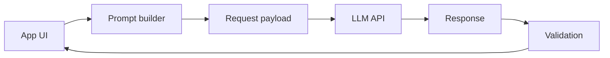

Four layers every API-powered feature needs:

1. **Prompt builder** — assembles messages from Day 5 templates
2. **API client** — sends HTTP/SDK request, handles errors
3. **Response parser** — extracts text, usage, finish reason
4. **Product logic** — validates, logs, formats for UI

## Why APIs Matter
APIs are how AI capability becomes a product feature.

They let you:

- send structured instructions programmatically
- control generation behavior per request
- swap models without rewriting the whole application
- add business logic around the model call
- handle failures like any other network dependency

Before hosted APIs, using a large language model meant training or hosting your own infrastructure. That was slow, expensive, and hard to maintain. APIs democratized access: your team focuses on product, the provider handles GPUs and model updates.

The mental model you learn today transfers across OpenAI, Claude, Gemini, and open-weight stacks—you will specialize on OpenAI in Day 8 and Claude in Day 9, but the patterns remain the same.

## Deep Theory

### What is in an LLM API request?
A typical chat-style request contains:

| Field | Purpose | Example |
| --- | --- | --- |
| `model` | Which model to invoke | `gpt-4.1-mini` |
| `messages` | Role-based conversation | system, user, assistant |
| `temperature` | Randomness of output | `0.2` for factual tasks |
| `max_tokens` | Output length cap | `300` |
| `stream` | Incremental delivery | `true` / `false` |
| `response_format` | Structured output hint | `{ "type": "json_object" }` |

Optional fields may include tools, metadata, seed (for reproducibility), and stop sequences.

### Instruction hierarchy
Many modern APIs separate instructions by role:

| Role | Purpose | Analogy |
| --- | --- | --- |
| `system` | Highest-level behavior and safety | Company handbook |
| `developer` | Application/product rules | Feature spec |
| `user` | End-user request and data | Customer ticket |
| `assistant` | Prior model turns in the thread | Chat history |

That hierarchy helps the application keep control. Policy in `system` should survive regardless of what the user types.

**Common mistake:** putting everything in one user message. That works in demos but makes behavior harder to test, version, and audit.

### Generation settings in depth

#### Temperature
Temperature influences randomness. Internally, the model assigns probabilities to next tokens. Higher temperature flattens the distribution—less likely tokens get chosen more often.

| Range | Behavior | Typical use |
| --- | --- | --- |
| 0.0–0.3 | Consistent, factual | Extraction, support, classification |
| 0.4–0.7 | Balanced | General assistants, tutoring |
| 0.8–1.0+ | Creative, varied | Brainstorming, creative writing |

For structured or factual tasks, start low. Increase only when evaluation shows you need more variety.

#### max_tokens
`max_tokens` caps **output** length—not input. It protects against runaway responses and controls cost.

If your UI shows three bullet points, do not allow 2,000 tokens of output. Tie `max_tokens` to product constraints.

Also watch `finish_reason`:
- `stop` — natural completion
- `length` — hit the cap (answer may be truncated)

#### Streaming
Streaming sends partial output as tokens are generated. The user sees text appear gradually instead of waiting for the full response.

Benefits:
- better perceived latency for long answers
- ability to cancel mid-generation

Tradeoffs:
- slightly more complex client code
- harder to validate until stream completes

Use streaming for chat UX; skip it for short structured JSON responses.

### Request/response lifecycle (Feynman version)
1. Your app builds a request payload from prompt templates.
2. The client sends HTTPS POST to the provider.
3. The provider tokenizes input and runs the model.
4. The model generates output tokens until stop or max_tokens.
5. The API returns JSON with choices, usage, and metadata.
6. Your app parses, validates, and displays the result.

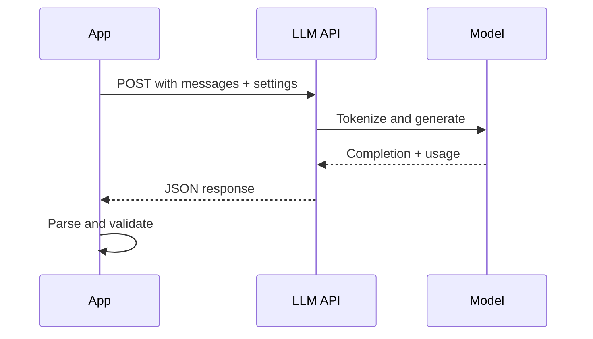

### SDK vs raw HTTP
You can call LLM APIs with:

- **Official SDK** — faster development, typed helpers, built-in conveniences
- **Raw HTTP** — maximum control, any language, custom middleware

Use SDKs for most applications. Use raw HTTP when you need custom transport, proxies, or languages without official clients.

### Prototype vs production patterns

| Prototype | Production |
| --- | --- |
| API key in notebook | Environment variables or secret manager |
| Single try, no retry | Exponential backoff for 429/5xx |
| Print response | Structured logging with request IDs |
| One hard-coded model | Config per task or tenant |
| Trust model output | Validation, guardrails, fallbacks |
| No cost tracking | Token usage metrics and alerts |

Production assumes failure is normal: network blips, rate limits, malformed output, refusals.

### Advantages
- makes model usage programmable and testable
- supports product logic and fine-grained control
- integrates with standard application architecture
- allows model swapping without rewriting prompts
- provides usage metadata for cost monitoring

### Limitations
- network dependency and variable latency
- per-token cost at scale
- rate limits and quota management
- provider policy and model deprecation changes
- data handling rules may matter for sensitive workloads

### Alternatives
- **Local inference (Ollama, vLLM)** — privacy, offline, fixed compute cost
- **Batch processing** — non-interactive workloads, lower cost
- **Rule-based systems** — exact deterministic tasks

### When should you use an API?
Use an API when:

- you want quick access to a capable hosted model
- you need a production-ready service interface
- you want to focus on application design instead of GPU ops

### When should you consider local inference?
Consider local inference when:

- privacy or offline use is mandatory
- you need full control over the runtime
- workload is predictable and cost at scale favors owned hardware

## Visual Learning

### Request Lifecycle
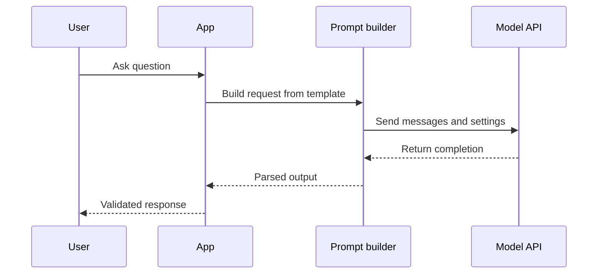

### Request Anatomy Mind Map
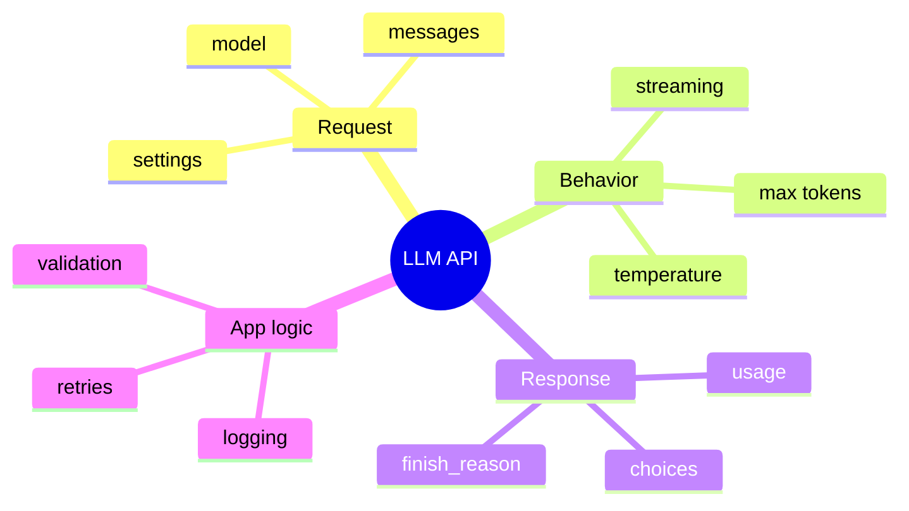

### Instruction Flow
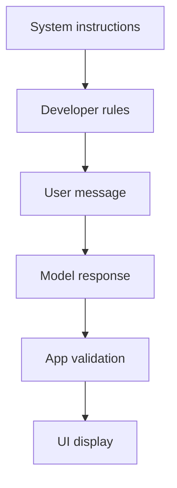

### Error Handling Flow
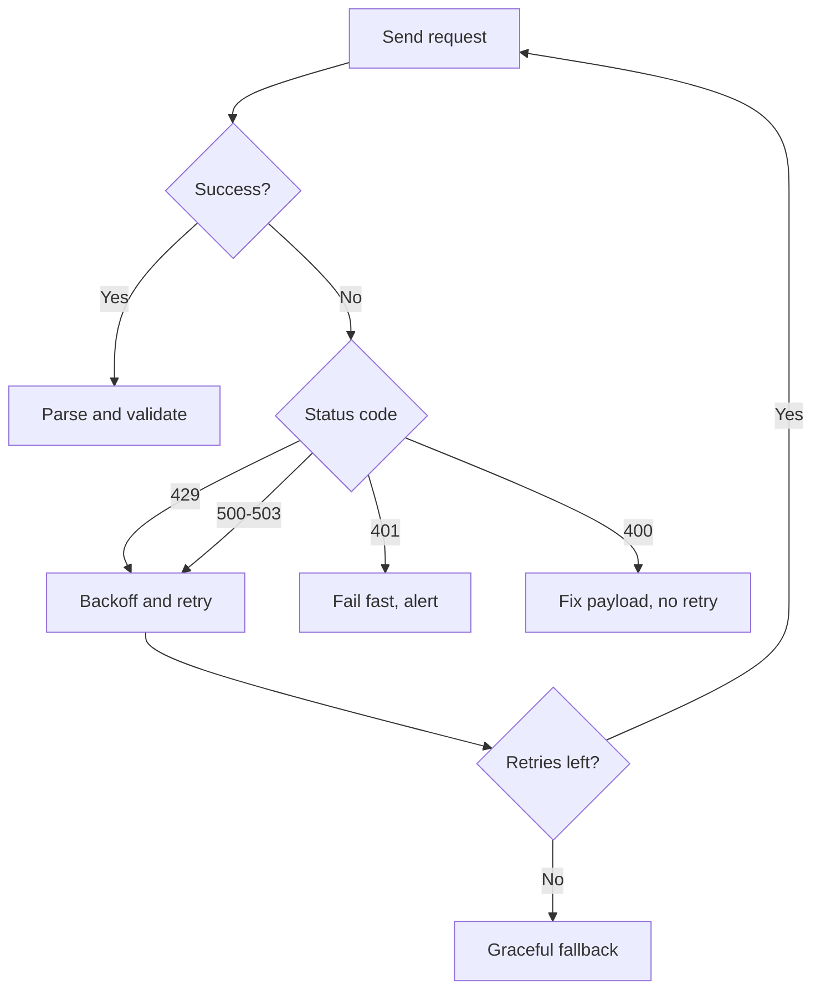

### Streaming vs Non-Streaming
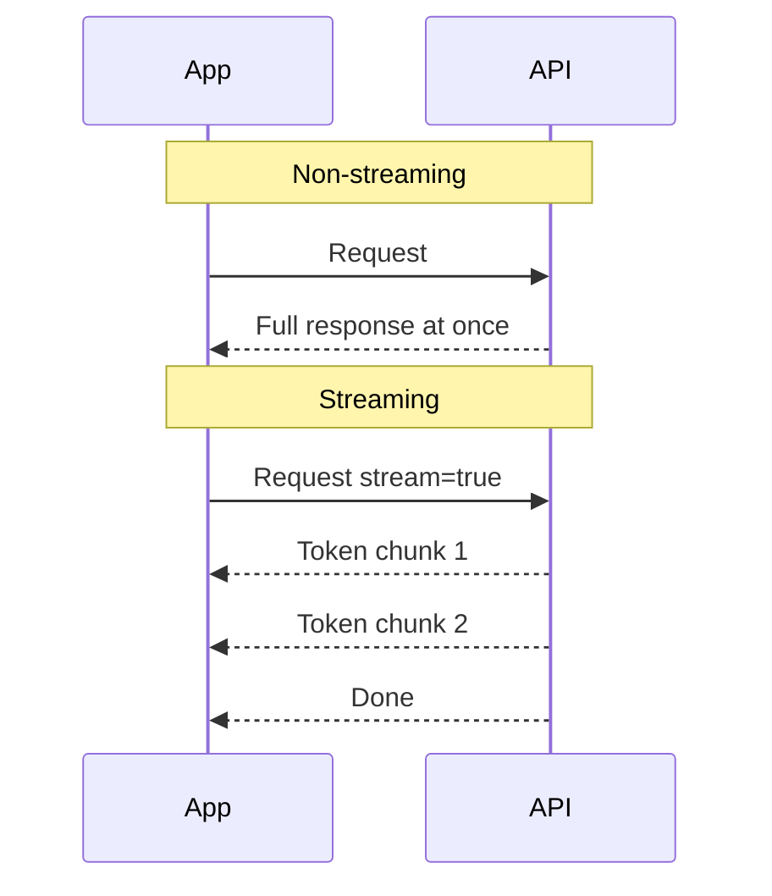

### Day 5 Template to Day 6 Request
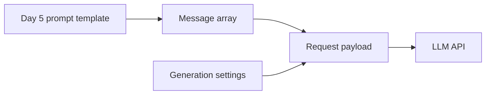

### Prototype to Production Path
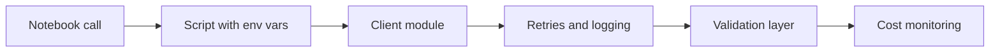

### API Client Architecture
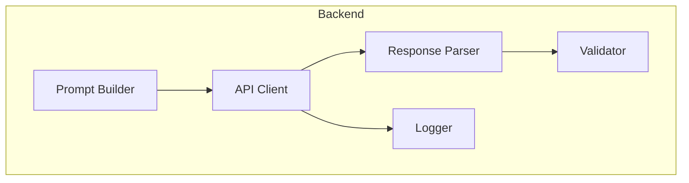

## Code Walkthrough

The examples below model request payloads and application behavior. No real API keys are required to trace the logic.

### Example 1: Python — Minimal request payload
```python
request = {
    "model": "example-model",
    "messages": [
        {"role": "system", "content": "You are a concise tutor."},
        {"role": "user", "content": "Explain APIs in one paragraph."},
    ],
    "temperature": 0.2,
    "max_tokens": 200,
}

print(request["model"])
print(len(request["messages"]))
```

#### Code Explanation
- `model` selects which hosted model to invoke.
- `messages` is an ordered list with role and content.
- `temperature=0.2` favors consistent, factual output.
- `max_tokens=200` caps response length and cost.

### Example 2: TypeScript — Typed request object
```typescript
type ChatMessage = { role: 'system' | 'user' | 'assistant'; content: string };

type ChatRequest = {
  model: string;
  messages: ChatMessage[];
  temperature: number;
  maxTokens: number;
};

const request: ChatRequest = {
  model: 'example-model',
  messages: [
    { role: 'system', content: 'You are a concise tutor.' },
    { role: 'user', content: 'Explain APIs in one paragraph.' },
  ],
  temperature: 0.2,
  maxTokens: 200,
};

console.log(request.messages.length);
```

#### Code Explanation
- TypeScript types catch role typos at compile time.
- `maxTokens` mirrors camelCase SDK conventions (snake_case in raw JSON).
- Strong typing makes refactors safer as requests grow.

### Example 3: Python — All four roles
```python
messages = [
    {"role": "system", "content": "You are a helpful assistant. Refuse unsafe requests."},
    {"role": "developer", "content": "Answer in exactly three bullet points."},
    {"role": "user", "content": "What is an LLM API?"},
    {"role": "assistant", "content": "An LLM API is a hosted interface for model calls."},
    {"role": "user", "content": "Give me an everyday analogy."},
]
```

#### Code Explanation
- `assistant` messages preserve multi-turn history.
- The model reads the full thread to stay coherent.
- Developer rules apply to this feature only; system rules are global.

### Example 4: TypeScript — Prompt builder from Day 5 template
```typescript
type TemplateVars = { topic: string; audience: string };

const TEMPLATE = `
Explain {{topic}} for {{audience}} in three bullet points.
`;

function buildUserMessage(vars: TemplateVars): string {
  return TEMPLATE.replace('{{topic}}', vars.topic).replace('{{audience}}', vars.audience);
}

function buildMessages(vars: TemplateVars) {
  return [
    { role: 'system' as const, content: 'You are a study tutor.' },
    { role: 'user' as const, content: buildUserMessage(vars) },
  ];
}
```

#### Code Explanation
- Day 5 templates feed directly into Day 6 message arrays.
- `buildMessages` is the bridge between prompt design and API calls.
- Separating template rendering from transport code aids testing.

### Example 5: Python — Response parsing
```python
mock_response = {
    "choices": [
        {
            "message": {"role": "assistant", "content": "An API is a service interface."},
            "finish_reason": "stop",
        }
    ],
    "usage": {"prompt_tokens": 42, "completion_tokens": 12, "total_tokens": 54},
}

text = mock_response["choices"][0]["message"]["content"]
finish = mock_response["choices"][0]["finish_reason"]
tokens = mock_response["usage"]["total_tokens"]
```

#### Code Explanation
- Always extract from structured response objects—do not assume shape.
- `finish_reason` reveals truncation (`length`) vs natural stop.
- `usage` enables cost tracking from day one.

### Example 6: TypeScript — Response with truncation check
```typescript
type ChatResponse = {
  choices: Array<{
    message: { content: string };
    finishReason: 'stop' | 'length' | string;
  }>;
  usage: { totalTokens: number };
};

function parseResponse(res: ChatResponse): { text: string; truncated: boolean } {
  const choice = res.choices[0];
  return {
    text: choice.message.content,
    truncated: choice.finishReason === 'length',
  };
}
```

#### Code Explanation
- Surfacing `truncated` lets the UI warn users or request continuation.
- Typed finish reasons document expected provider values.
- Parsing logic belongs in one module, not scattered in UI code.

### Example 7: Python — Retry wrapper with backoff
```python
import time

def send_with_retry(send_fn, payload, max_retries=3):
    delay = 1.0
    for attempt in range(max_retries + 1):
        result = send_fn(payload)
        if result["status"] == "ok":
            return result
        if result["status_code"] == 429 and attempt < max_retries:
            time.sleep(delay)
            delay *= 2
            continue
        if result["status_code"] in (500, 502, 503) and attempt < max_retries:
            time.sleep(delay)
            delay *= 2
            continue
        return result  # fail fast on 400, 401, etc.
    return {"status": "error", "message": "max retries exceeded"}
```

#### Code Explanation
- Exponential backoff doubles wait time between retries.
- Retry 429 (rate limit) and 5xx (server errors)—not 400 (bad request).
- Cap retries to avoid hammering a struggling provider.

### Example 8: TypeScript — Safe result type
```typescript
type ApiResult =
  | { ok: true; text: string; totalTokens: number }
  | { ok: false; error: string };

async function safeComplete(messages: ChatMessage[]): Promise<ApiResult> {
  try {
    // const res = await client.chat.completions.create({ ... });
    const res = { text: 'mock answer', totalTokens: 100 };
    return { ok: true, text: res.text, totalTokens: res.totalTokens };
  } catch (err) {
    return { ok: false, error: err instanceof Error ? err.message : 'Unknown error' };
  }
}
```

#### Code Explanation
- Discriminated unions (`ok: true | false`) simplify caller logic.
- UI components branch on `ok` without try/catch everywhere.
- Preserving token counts supports cost dashboards.

### Example 9: Python — Streaming consumer
```python
def stream_mock(chunks):
    """Simulate streaming by yielding token chunks."""
    for chunk in chunks:
        yield chunk

full = ""
for piece in stream_mock(["Hello", ", ", "world", "!"]):
    print(piece, end="", flush=True)
    full += piece
```

#### Code Explanation
- Streaming accumulates chunks into the full response.
- `flush=True` prints incrementally for live UX.
- Validation often runs after the stream completes.

### Example 10: TypeScript — Environment config
```typescript
type LlmConfig = {
  apiKey: string;
  model: string;
  timeoutMs: number;
  maxTokens: number;
};

function loadConfig(): LlmConfig {
  const apiKey = process.env.LLM_API_KEY;
  if (!apiKey) throw new Error('Missing LLM_API_KEY');
  return {
    apiKey,
    model: process.env.LLM_MODEL ?? 'example-model',
    timeoutMs: Number(process.env.LLM_TIMEOUT_MS ?? 30000),
    maxTokens: Number(process.env.LLM_MAX_TOKENS ?? 500),
  };
}
```

#### Code Explanation
- Fail fast at startup if secrets are missing.
- Defaults for model, timeout, and max_tokens simplify local dev.
- Central config prevents magic numbers scattered in code.

### Example 11: Python — Request spec document as code
```python
SUMMARIZER_SPEC = {
    "model": "example-model",
    "temperature": 0.1,
    "max_tokens": 150,
    "system": "Summarize in three bullet points. Do not invent facts.",
    "output_constraints": {
        "max_words": 120,
        "format": "markdown bullets",
    },
    "fallback": "Summary unavailable. Please try again.",
}
```

#### Code Explanation
- Specs can live as data structures before SDK integration.
- `output_constraints` document product rules beyond API fields.
- Fallback messages should be defined upfront—not improvised in catch blocks.

### Example 12: TypeScript — Logging metadata safely
```typescript
function logCompletion(meta: {
  model: string;
  latencyMs: number;
  promptTokens: number;
  completionTokens: number;
  finishReason: string;
}) {
  console.info('llm_completion', meta);
  // Production: send to observability platform—avoid logging full prompts
}
```

#### Code Explanation
- Log metrics (latency, tokens, finish reason)—not full user content unless policy allows.
- Structured logs enable dashboards and alerts.
- Request IDs (added in production) tie logs to user sessions.

## Practical Examples

### Beginner Example: Text assistant request
A student app sends a system prompt ("You are a tutor"), the user's question, `temperature=0.2`, and `max_tokens=300`.

Why this works:
- minimal request shape
- predictable settings for learning use cases
- easy to test without streaming or tools

### Intermediate Example: Summarizer with strict limits
A news summarizer sets `max_tokens=100`, low temperature, and a developer message requiring three bullets.

Why this matters:
- output length matches UI design
- developer role encodes format separate from user article text

### Advanced Example: Support draft with validation
A support tool sends ticket history, policy instructions, and the customer's question. The model drafts a reply. Backend code checks for forbidden promises before an agent sees it.

Why professionals care:
- the model is a draft engine, not final authority
- business rules live in validation code

### Production Example: Multi-tenant writing assistant
Each customer has tone guides and token budgets. Requests include tenant ID, model choice, and usage logging. Rate limits apply per tenant.

Why this is production-shaped:
- configuration is data-driven
- cost and abuse controls are first-class

### Real-World Company Example
**Notion AI**, **GitHub Copilot**, and **Intercom** all wrap LLM API calls in service layers that handle context assembly, retries, logging, and output filtering. The API is one dependency in a larger system.

Universal pattern: **assemble context → call model → validate → present**.

## Comparison Tables

### Temperature by Task
| Task | Temperature | Why |
| --- | --- | --- |
| Classification | 0.0–0.2 | Deterministic labels |
| Summarization | 0.1–0.3 | Factual compression |
| Tutoring | 0.2–0.5 | Clear but not robotic |
| Brainstorming | 0.7–0.9 | Variety desired |

### Streaming vs Non-Streaming
| Aspect | Non-streaming | Streaming |
| --- | --- | --- |
| UX | Wait, then full text | Text appears gradually |
| Complexity | Lower | Higher client code |
| Validation | Immediate | After stream ends |
| Best for | Short JSON, batch | Chat, long prose |

### SDK vs Raw HTTP
| Aspect | SDK | Raw HTTP |
| --- | --- | --- |
| Setup | Fast | Manual |
| Types | Strong (TS) | Manual |
| Portability | Per language | Universal |
| Best for | Most backends | Custom stacks |

### Error Retry Policy
| Status | Meaning | Retry? |
| --- | --- | --- |
| 400 | Bad payload | No—fix request |
| 401 | Auth failure | No—fix credentials |
| 429 | Rate limit | Yes with backoff |
| 500–503 | Server error | Limited retry |
| Timeout | Slow/network | Maybe once |

### Prototype vs Production
| Feature | Prototype | Production |
| --- | --- | --- |
| Secrets | `.env` locally | Secret manager |
| Errors | Crash or print | Typed results + fallback |
| Logging | Console | Structured + metrics |
| Validation | Minimal | Required before display |

## Best Practices
- keep prompts in templates, not embedded in UI code
- set temperature intentionally per task type
- cap max_tokens to product constraints
- separate prompt building from API transport
- log latency, status, and token usage
- retry transient errors with exponential backoff
- validate output before displaying to users
- use environment variables for secrets—never commit keys
- define fallback messages before you need them
- test with mocked responses for success and failure paths

## Common Mistakes
- sending entire app state in every request
- using high temperature for extraction or classification
- ignoring `finish_reason` and showing truncated answers
- retrying 400-level errors blindly
- coupling UI components directly to raw API responses
- skipping validation because demo responses looked fine
- hard-coding models with no config override
- exposing API keys in frontend JavaScript

### Debugging Strategy
If an API-powered feature behaves strangely:

1. Is the request payload shaped correctly?
2. Are instructions in the right roles and order?
3. Is temperature appropriate for the task?
4. Is the response parsed and validated correctly?
5. Are failures, timeouts, and retries handled?
6. Did token usage spike (prompt too long)?

## Performance

### Latency
End-to-end latency includes network round trip, provider queue time, token generation, and your validation step. It grows with longer context, larger output, and bigger models.

Improve perceived speed with streaming, shorter prompts, and smaller models when quality allows.

### Cost
Cost is driven by input and output tokens. Long system prompts repeated every request add up. Mitigate with concise prompts, history summarization, and appropriate max_tokens caps.

### Reliability
Assume requests fail. Retries, timeouts, fallbacks, and circuit breakers are standard—not optional—for production.

## Security
- never expose API keys in client-side code
- treat user input as untrusted in prompts
- avoid logging sensitive content without policy approval
- do not assume the provider enforces your business rules
- sanitize model output before rendering in HTML

## Evaluation
API-driven features need measurable quality.

### What to measure
- request success rate
- p50/p95 latency
- average input and output tokens
- retry and timeout frequency
- validation failure rate
- user satisfaction signals

### Evaluation checklist
1. Does the request include correct roles and settings?
2. Does output pass schema validation?
3. Does the app recover from 429 and 5xx?
4. Are costs within budget at expected traffic?
5. Are unsafe outputs caught before display?

## Exercises

### Easy
1. List five fields commonly found in an LLM API request.
2. Explain what temperature does at a high level.
3. Describe why max_tokens matters for cost and UX.
4. Name one reason an app should validate API output.
5. What are the four common message roles?
6. What does `finish_reason: length` indicate?
7. Why should API keys live in environment variables?

### Medium
8. Write a complete request payload for a tutoring app (three bullet answers).
9. Convert a Day 5 prompt template into a messages array.
10. Compare streaming and non-streaming for a chat app.
11. Explain when a hosted API beats local inference.
12. Describe what to log without leaking user secrets.
13. Design environment variable names for model, timeout, and API key.
14. Explain exponential backoff in your own words.
15. What is the difference between input tokens and output tokens?

### Hard
16. Design a request spec for a meeting summarizer with fallback behavior.
17. Implement pseudocode for retry logic that handles 429 but not 400.
18. Describe validation rules for a support draft assistant.
19. Explain why product logic should stay separate from the API client.
20. Design a typed `ApiResult` for success and failure paths.
21. Write a streaming handler pseudocode that accumulates chunks safely.
22. Estimate relative cost impact of doubling max_tokens.

### Challenge
23. Create a full API request spec for a support assistant (all required sections).
24. Design a fallback path when the API is unavailable for five minutes.
25. Write integration test cases for success, 429, 500, and timeout scenarios.
26. Design a multi-tenant config schema (model, budget, tone per tenant).
27. Sketch observability metrics for an LLM feature dashboard.

### Reflection Questions
28. What changes when a prompt moves from chat box to API payload?
29. Which failure mode hurts users most: latency, cost, or wrong answers?
30. How does Day 5 connect to Day 6 in your own words?
31. What would you mock-test before getting an API key?
32. How will today's spec work feed into Day 7's prompt helper?

## Quizzes

### Quiz 1
1. What field selects the hosted model?
2. Which role holds global safety policy?
3. What setting controls randomness?
4. What caps output length?

**Answers:** 1. `model`  2. `system`  3. `temperature`  4. `max_tokens`

### Quiz 2
1. Why use streaming?
2. Name one field in the usage object.
3. Should you retry HTTP 400?
4. Where should API keys live?

**Answers:** 1. Better perceived latency for long responses  2. `prompt_tokens`, `completion_tokens`, or `total_tokens`  3. No—fix the payload  4. Environment variables or secret manager

### Quiz 3
1. What is finish_reason?
2. Name one prototype vs production difference.
3. What does the developer role contain?
4. Why validate model output in code?

**Answers:** 1. Why generation stopped (e.g., stop, length)  2. Examples: retries, logging, secret management  3. Product/feature-specific rules  4. Models can be wrong or malformed

### Quiz 4
1. What status code indicates rate limiting?
2. When prefer local inference over API?
3. What is exponential backoff?
4. Why separate prompt builder from API client?

**Answers:** 1. 429  2. Privacy, offline, or cost/control requirements  3. Increasing wait between retries  4. Testability, maintainability, clear boundaries

### Quiz 5
1. What messages preserve chat history?
2. Low temperature is best for what tasks?
3. Name one thing to avoid logging.
4. What is a graceful fallback?

**Answers:** 1. `assistant` (and prior turns)  2. Factual, extraction, classification  3. Full prompts with PII/secrets  4. User-friendly message when API fails

## Interview Questions

### Conceptual
- Explain the anatomy of an LLM API request and response.
- What is the difference between system, developer, and user roles?
- How do temperature and max_tokens affect product behavior?
- When would you use streaming?
- How do you choose between SDK and raw HTTP?

### Practical
- Walk through storing and loading API keys safely.
- How would you retry a rate-limited request?
- How would you validate model output before display?
- Describe connecting a Day 5 template to an API client.

### System Design
- Design an LLM client layer for a multi-tenant SaaS app.
- Design observability for latency, cost, and error rates.
- Design a fallback strategy for provider outages.

### Debugging
- Responses are empty intermittently. What do you check?
- Costs jumped after a release. Likely causes?
- Users see truncated answers. Which fields do you inspect?

## Mini Project
Write the **request spec** for a text assistant that answers in three bullet points and keeps responses under 120 words.

### Goal
Define a complete request shape that another developer could implement without guessing.

### Features
- model selection with rationale
- system, developer, and user message definitions
- temperature and max_tokens with justification
- output constraints (format, word limit)
- response parsing rules (fields to extract)
- fallback behavior for API failure and empty output
- at least three test scenarios

### Suggested Folder Structure
```text
text-assistant-spec/
├── request.md           # Full request specification
├── response.md          # Expected response shape
├── settings.md          # Generation settings rationale
├── fallback.md          # Error and empty-output handling
└── tests.md             # Test scenarios with expected behavior
```

### Project Steps
1. choose the task and audience (e.g., study tips for beginners)
2. write system and developer instructions
3. define how user input is inserted
4. set temperature and max_tokens with written rationale
5. document expected response JSON for the UI
6. define fallback messages for failure modes
7. write three test scenarios including one edge case

### Acceptance Criteria
- spec is implementable without follow-up questions
- settings match the task (low temperature for factual bullets)
- fallbacks defined for timeout, empty response, and rate limit
- test scenarios cover happy path, long input, and API failure

### What You Learn
- how prompts become request payloads
- how to shape model behavior through settings
- how to design the application layer around the API call

## Cumulative Capstone Update

Add to [`projects/CAPSTONE.md`](../../projects/CAPSTONE.md):

- **Paper schema for LLM request/response** — document the JSON shape StudySpark will use:
  - request: `model`, `messages[]`, `temperature`, `max_tokens`
  - response: `text`, `finish_reason`, `usage { prompt_tokens, completion_tokens }`
- **Error-handling rules** — define behavior for:
  - timeout → retry once, then fallback message
  - empty response → return "No answer generated"
  - rate limit (429) → exponential backoff, max 3 retries
- **Prompt builder interface** — sketch a function signature:

```python
def build_study_request(user_question: str) -> dict:
    """Return a provider-ready request payload from user input."""
```

This schema becomes the contract between Day 7's prompt helper and Day 8's OpenAI client.

## Historical Background

Hosted LLM APIs emerged when research labs productized model inference. OpenAI's GPT-3 API (2020) showed developers could integrate language models via HTTP without training infrastructure. Chat-style message arrays (2022–2023) replaced single-shot completions as the dominant pattern.

By 2024–2025, production teams treated API clients as standard backend modules—with retries, observability, and cost controls matching any critical third-party service.

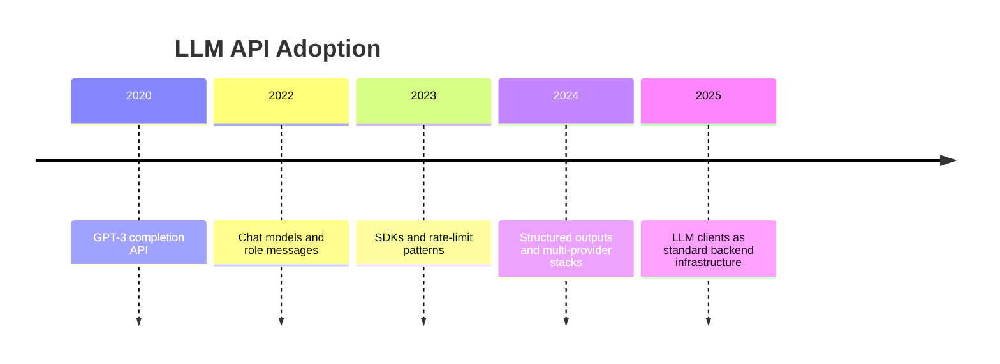

The patterns you learn today apply regardless of which provider wins any given benchmark.

## Summary
LLM APIs turn model capability into a **programmable service**.

Good API use depends on clear requests, intentional generation settings, and reliable application-side handling—validation, retries, logging, and fallbacks. Your Day 5 prompt templates become today's message arrays; tomorrow on Day 7 you will build a prompt helper that improves those messages before they ever reach an API.

[Previous: Day 5 - Advanced Prompt Engineering](../day_05/day_05_advanced_prompt_engineering.md) | [Next: Day 7 - Mini Project: Prompt Helper](../day_07/day_07_mini_project_prompt_helper.md)

## Further Reading
- https://platform.openai.com/docs
- https://docs.anthropic.com/
- https://ai.google.dev/
- https://www.rfc-editor.org/rfc/rfc9110
- https://sdk.vercel.ai/docs
