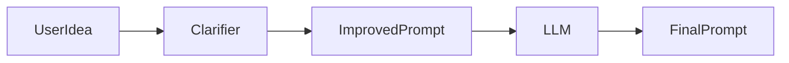
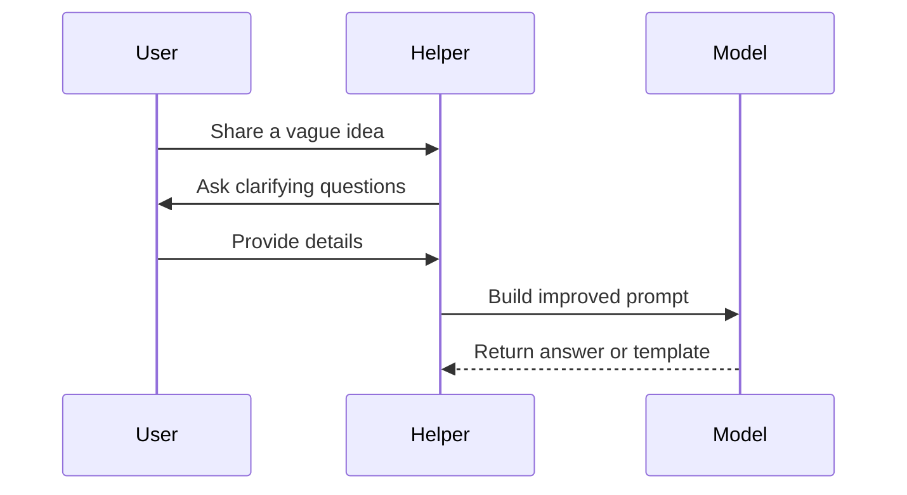
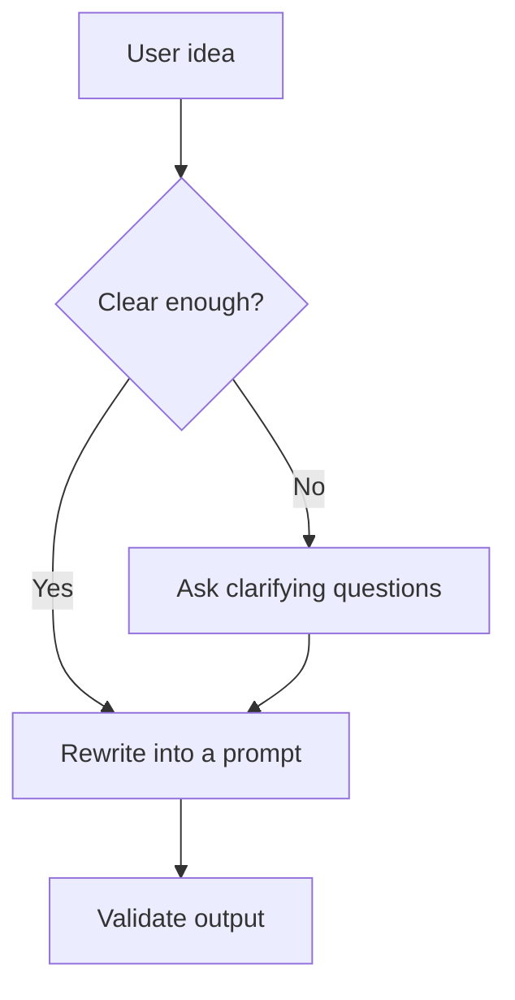
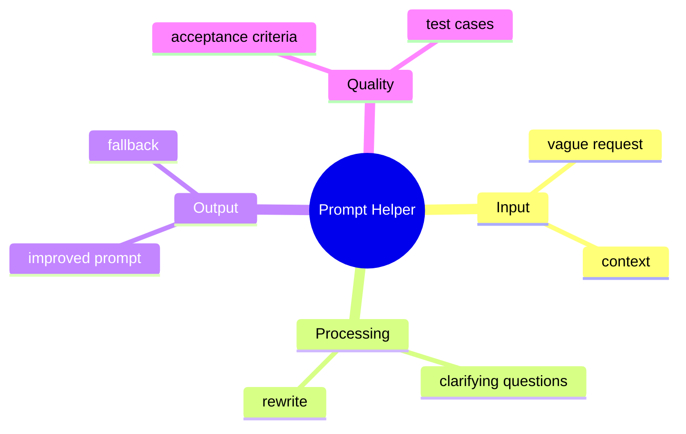

# Day 7 - Mini Project: Prompt Helper

[Previous: Day 6 - LLM APIs](../day_06/day_06_llm_apis.md) | [Next: Day 8 - OpenAI API](../day_08/day_08_openai_api.md)

## Introduction
Today you will combine the first week into one small but useful project.

The goal is to design a prompt helper that rewrites vague requests into clear prompts. This is the first point in the course where you build a full user-facing flow instead of just studying concepts.


Mini projects matter because they force you to make tradeoffs. You must decide what the user needs, what the system should do, what the output should look like, and how you will know the result is good.

## Learning Objectives
By the end of this day, you should be able to:

- combine prompting, context, and output structure into one flow
- explain how a user-facing AI feature is designed
- define project scope before coding
- create a simple evaluation checklist
- plan a small deliverable that is realistic in one day
- describe a text-only version of a prompt helper
- explain how a prompt helper can reduce ambiguity before the model is called

## Prerequisites
You should already understand:

- Day 4: prompt engineering fundamentals
- Day 5: advanced prompt patterns
- Day 6: LLM API request structure

This project is easiest when you already know how prompts are shaped and how they become request payloads.

## Big Picture
A mini project is where knowledge becomes skill.

The point is not to build the biggest app. The point is to build a complete loop: input, processing, output, and validation.

A prompt helper can take a rough idea like "write me something about marketing" and transform it into a sharper instruction with audience, tone, length, and format.



## Why This Project Exists
Many AI apps fail because users are vague.

A prompt helper improves the front door of the system by asking clarifying questions or rewriting the user idea into a better prompt.

That means the project teaches you how to:

- capture user intent
- reduce ambiguity
- improve output quality before model generation
- design a helpful user experience around a language model

## Deep Theory

### What is a prompt helper?
A prompt helper is a small tool that improves or structures a user request before it reaches the model.

It may:

- ask clarifying questions
- rewrite the request into a stronger prompt
- add audience, tone, and format constraints
- produce a reusable prompt template

### Why this is a good first project
This project is small enough to finish but rich enough to teach real AI product thinking.

It gives you practice with:

- prompt design
- UX thinking
- output structure
- acceptance criteria
- test cases for vague input

### Advantages
- easy to explain
- useful in real workflows
- reinforces prompting discipline
- can be built as text-only first

### Limitations
- does not solve every prompt problem
- still depends on the user answering clarifying questions honestly
- can only help if the helper itself is designed clearly

### Alternatives
- a static prompt template library
- a full chat assistant
- manual prompt writing with no helper

### When should you use a prompt helper?
Use it when:

- users often start with vague ideas
- prompt quality strongly affects output quality
- you want to standardize request creation

### When should you not overbuild it?
Avoid overbuilding when:

- the task is already precise
- the helper would add more friction than value
- the project needs to stay small and finishable

## Visual Learning

### Prompt Helper Flow


### Project Decision Tree


### Prompt Helper Mind Map


## Code Walkthrough

The code examples below show the shape of the helper’s inputs and questions.

### Python Example
```python
user_idea = "write me something about marketing"
clarifying_questions = [
    "Who is the audience?",
    "What is the goal?",
    "What format do you want?",
]

print(user_idea)
print(clarifying_questions)
```

#### Code Explanation
- `user_idea` is the vague starting point.
- `clarifying_questions` are the missing pieces the helper should ask for.

### TypeScript Example
```typescript
const userIdea = 'write me something about marketing';
const clarifyingQuestions = [
  'Who is the audience?',
  'What is the goal?',
  'What format do you want?',
];

console.log(userIdea);
console.log(clarifyingQuestions);
```

#### Code Explanation
- the same concept can be represented as data in TypeScript.
- a helper can render these questions in a UI or CLI.

### Python Example: Rewrite rule
```python
def rewrite_prompt(idea, audience, goal, format_type):
    return (
        f"Write for {audience}. "
        f"Goal: {goal}. "
        f"Format: {format_type}. "
        f"Topic: {idea}."
    )


print(rewrite_prompt("marketing", "small business owners", "teach basics", "bullet points"))
```

#### Code Explanation
- the helper turns vague input into a structured instruction.
- named fields keep the rewrite predictable.

### TypeScript Example: Acceptance criteria
```typescript
type AcceptanceCriteria = {
  hasAudience: boolean;
  hasGoal: boolean;
  hasFormat: boolean;
  isConcise: boolean;
};

const criteria: AcceptanceCriteria = {
  hasAudience: true,
  hasGoal: true,
  hasFormat: true,
  isConcise: true,
};

console.log(criteria);
```

#### Code Explanation
- acceptance criteria define what success looks like.
- they make the project testable instead of subjective.

## Practical Examples

### Beginner Example: Marketing prompt helper
The user says: "write me something about marketing."

The helper asks:

- Who is the audience?
- What is the goal?
- What format do you want?

Then it rewrites the prompt into something like:

- "Write a beginner-friendly marketing explanation for small business owners in 3 bullet points."

### Intermediate Example: Study prompt helper
A student types: "help me study AI."

The helper asks:

- Which topic?
- What level are you at?
- Do you want a summary, quiz, or explanation?

This is more useful because the assistant now has the missing context.

### Professional Example: Internal documentation helper
A team member types: "make this doc better."

The helper asks:

- Who is the document for?
- Is the goal clarity, brevity, or persuasion?
- What sections should remain?

This mirrors a real workplace workflow where quality depends on context.

### Real-World Company Example
Teams often build prompt helpers or prompt templates before they build a larger assistant, because better input quality usually improves the whole system downstream.

## Best Practices
- keep the project small enough to finish
- focus on one user problem
- define a useful output format
- write a short test list before building
- make the app helpful even when input is vague
- separate clarifying questions from final rewrite logic
- define what counts as a good prompt before implementation

## Common Mistakes
- building too many features at once
- skipping the design step
- not defining what "better" means
- hiding the output format from the user
- forgetting to test with vague and messy inputs
- making the helper so strict that it becomes annoying

### Debugging Strategy
If the helper is not useful, ask:

1. Is the input too vague for the helper to improve?
2. Are the clarifying questions actually useful?
3. Does the rewritten prompt include enough context?
4. Is the output format easy to reuse?
5. Did you define success clearly enough?

## Performance

### Latency
A text-only helper should feel quick and lightweight.

### Complexity
The best first version keeps logic simple and predictable.

### Maintainability
A small specification is easier to improve than a large unfinished prototype.

## Security
Even a prompt helper should respect user content boundaries.

- do not treat user input as trusted instructions
- do not mix helper rules with raw user text without care
- keep future API keys and secrets out of the design

## Evaluation
The helper should be evaluated with realistic vague prompts.

### What to measure
- does it ask the right clarifying questions?
- does it produce a clearer prompt?
- is the output easier to use than the original input?
- does it stay helpful for different kinds of vague input?

### Useful questions
- Did the helper improve the request?
- Were the questions relevant?
- Is the final prompt specific enough to use?
- Would another person understand the result?

## Exercises

### Easy
1. Describe what the prompt helper should do.
2. Name one kind of vague input it should improve.
3. Explain why a prompt helper is useful.
4. Identify one output field it should preserve.

### Medium
5. Write three clarification questions.
6. Define the helper’s input and output.
7. Explain how acceptance criteria help the project.
8. Describe one test case with a vague input.

### Hard
9. Define a success checklist for the project.
10. Explain how the helper should behave when the input is too vague.
11. Design a simple output schema for the rewritten prompt.
12. Describe how you would know the helper is improving prompt quality.

### Challenge
13. Add a fallback when the input is too vague.
14. Design a version that supports multiple tones or audiences.
15. Explain how the helper could be turned into a reusable component.
16. Write a test list for messy real-world prompts.

## Mini Project
Build a prompt helper specification with input, questions, output, and acceptance criteria.

### Goal
Design a text-first prompt helper that could be implemented in a day.

### Required Sections
- input examples
- clarifying questions
- output format
- acceptance criteria
- fallback behavior

### Suggested structure
```text
prompt-helper/
├── spec.md
├── test-cases.md
└── notes.md
```

### Project Steps
1. define the user problem
2. list the clarifying questions
3. define the shape of the final prompt
4. write acceptance criteria
5. add a fallback for vague input
6. test the spec with several rough ideas

### What You Learn
- how to move from concept to specification
- how to build a user-facing AI workflow
- how to define success before coding
- how to keep the first version text-only and realistic

## Summary
Mini projects help you connect concepts into a working system.

A small, polished project is more valuable than a large unfinished one. This prompt helper is your first opportunity in the course to practice the full product loop in a controlled and realistic way.

[Previous: Day 6 - LLM APIs](../day_06/day_06_llm_apis.md) | [Next: Day 8 - OpenAI API](../day_08/day_08_openai_api.md)

## Additional Resources
- https://www.promptingguide.ai/
- https://platform.openai.com/docs/guides/prompt-engineering
- https://developer.mozilla.org/en-US/docs/Web/JavaScript
- https://www.nngroup.com/articles/using-ux-to-improve-chatgpt-prompts/
