# Day 7 - Mini Project: Prompt Helper

[Previous: Day 6 - LLM APIs](../day_06/day_06_llm_apis.md) | [Next: Day 8 - OpenAI API](../day_08/day_08_openai_api.md)

## Introduction
Today you combine the first week into one small but useful project.

The goal is to design a **prompt helper** that rewrites vague requests into clear, structured prompts. This is the first point in the course where you build a full user-facing flow instead of studying concepts in isolation.

Think of vague user input like a blurry photo. The prompt helper is the autofocus: it asks what's missing (audience? format? goal?), then produces a sharp instruction the model can execute reliably. Without this step, even strong models produce inconsistent results because the task was never defined.


Mini projects matter because they force tradeoffs. You must decide what the user needs, what the system should do, what the output should look like, and how you will know the result is good. Day 7 is specification-first—you can complete the core deliverable **without an API key** by writing a thorough spec and test cases.

By the end of today, you will have a prompt helper specification that becomes the front door for StudySpark and connects directly to Day 8's OpenAI client.

## Learning Objectives
By the end of this day, you should be able to:

- combine prompting, context, and output structure into one user-facing flow
- explain how a prompt helper improves downstream model quality
- define project scope before coding
- create a detailed specification another developer could implement
- write acceptance criteria and test cases for vague inputs
- plan a deliverable realistic for one day
- describe a text-only version of a prompt helper
- link the prompt helper to the StudySpark capstone architecture
- evaluate your spec against a provided rubric
- prepare messages for Day 6/8 API request payloads from helper output

## How to Use This Lesson

This lesson is designed for **all skill levels**. Pick one path and follow it consistently.

| Level | Suggested approach | Time |
| --- | --- | --- |
| **Beginner** | Read Introduction → Big Picture → Spec Template → fill Beginner rubric → Easy exercises | 5–7 hours |
| **Intermediate** | Skim objectives → Visual Learning → Code Walkthrough → complete full spec → Medium/Hard exercises | 3–5 hours |
| **Advanced** | Extend spec with evaluation plan + edge cases → Challenge exercises → capstone integration | 2–4 hours |

### Apply Today
Complete at least one item before moving to the next day:
- [ ] Trace one code example in **Python or TypeScript** (one language is enough)
- [ ] Complete exercises for your level (see Exercises section)
- [ ] Update [`projects/CAPSTONE.md`](../../projects/CAPSTONE.md) with today's capstone item
- [ ] **Submit your spec** against the rubric at [`solutions/day_07_prompt_helper_rubric.md`](../solutions/day_07_prompt_helper_rubric.md)

> **Stuck?** Re-read Big Picture, review Prerequisites, or see [SYLLABUS.md](../../SYLLABUS.md) for path guidance.

## Prerequisites
You should already understand:

- Day 4: prompt engineering fundamentals (clarity, audience, format)
- Day 5: advanced prompt patterns (templates, rubrics, role separation)
- Day 6: LLM API request structure (messages, settings)

This project is easiest when you already know how prompts are shaped and how they become request payloads. Review Day 6's message roles if the spec template section feels unfamiliar.

## Big Picture
A mini project is where knowledge becomes skill.

The point is not to build the biggest app. The point is to build a **complete loop**: input → clarification → rewrite → validation → output.

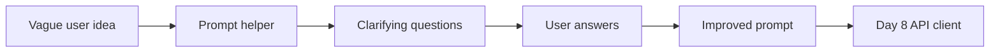

A prompt helper transforms rough input like "write me something about marketing" into a sharper instruction:

> "Write a beginner-friendly marketing overview for small business owners. Goal: teach marketing basics. Format: 5 bullet points under 120 words. Tone: practical, no jargon."

That improved prompt becomes the `user` or `developer` message in your Day 6 request payload—dramatically improving Day 8 results.

## Why This Project Exists
Many AI apps fail because users are vague.

Users type short, ambiguous requests and expect perfect answers. A prompt helper improves the **front door** of the system by:

- asking clarifying questions when information is missing
- rewriting the request with audience, tone, length, and format
- producing a reusable prompt template the user can edit before sending

This project teaches:

- capturing user intent under uncertainty
- reducing ambiguity before model generation
- designing helpful UX around AI limitations
- defining success with rubrics instead of gut feel

Teams at Notion, Jasper, and internal tooling groups often ship prompt helpers or template libraries **before** full assistants—because better input quality improves everything downstream.

## Deep Theory

### What is a prompt helper?
A prompt helper is a tool that improves or structures a user request **before** it reaches the model.

It may:

- ask clarifying questions (interactive mode)
- rewrite the request into a stronger prompt (automatic mode)
- add audience, tone, length, and format constraints
- produce output matching a fixed schema for downstream code
- refuse or fallback when input is insufficient

A prompt helper is **not** the model itself. It is application logic—forms, templates, validation—that surrounds the model call.

### Spec-first development
Day 7 emphasizes specification before implementation because:

1. **Clarity** — writing the spec exposes gaps in your thinking
2. **Testability** — test cases can be written before any code exists
3. **Accessibility** — beginners complete the project without API keys
4. **Handoff** — specs are how real teams collaborate

Your deliverable is a folder of markdown/JSON files another developer could implement in Python or TypeScript on Day 8.

### Modes of operation

| Mode | Behavior | Best for |
| --- | --- | --- |
| Interactive | Ask questions, wait for answers, then rewrite | High ambiguity |
| Automatic | Infer defaults, rewrite immediately | Low friction UX |
| Hybrid | Rewrite with defaults, offer optional refinements | Most products |

Start with **interactive** for your spec—it is easier to test and explain.

### Output schema design
Your helper should output structured data, not only prose. Example:

```json
{
  "improved_prompt": "Write a beginner-friendly...",
  "audience": "small business owners",
  "goal": "teach marketing basics",
  "format": "5 bullet points",
  "tone": "practical, no jargon",
  "confidence": "high"
}
```

Structured output lets Day 8 code map fields directly to API messages.

### Why this is a good first project
This project is small enough to finish in one day but rich enough to teach real AI product thinking:

- prompt design (Days 4–5)
- request structure (Day 6)
- user experience and acceptance criteria
- capstone integration (StudySpark front door)

### Advantages
- easy to explain and demo
- useful in real personal workflows
- reinforces prompting discipline
- completable without API keys (spec + test cases)
- directly connects to Day 8 OpenAI integration

### Limitations
- does not solve every prompt problem
- depends on users answering clarifying questions honestly
- can add friction if over-designed
- automatic inference of audience/tone can be wrong

### Alternatives
- static prompt template library (no dynamic rewrite)
- full chat assistant (much larger scope)
- manual prompt editing with no helper

### When should you use a prompt helper?
Use it when:

- users often start with vague ideas
- prompt quality strongly affects output quality
- you want to standardize request creation across a team

### When should you not overbuild it?
Avoid overbuilding when:

- the task is already precise ("Translate this sentence to French")
- the helper would ask too many questions
- you need to ship and iterate—start with three questions, not twelve

## Visual Learning

### Prompt Helper Flow
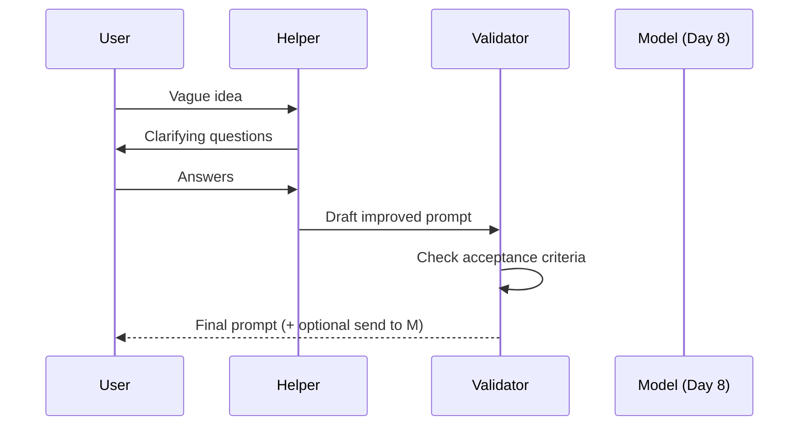

### Project Decision Tree
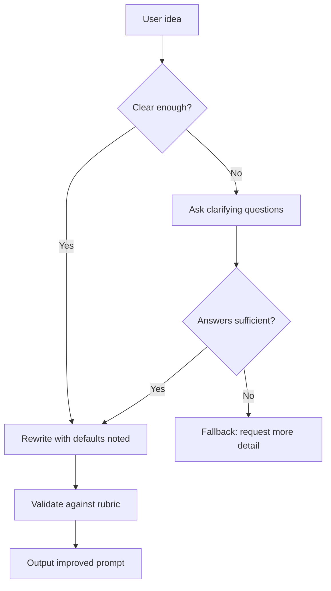

### Prompt Helper Mind Map
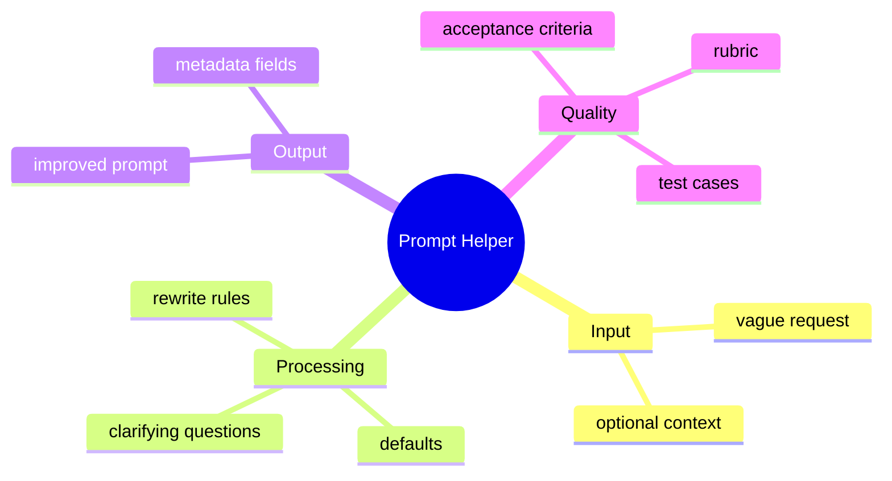

### StudySpark Integration
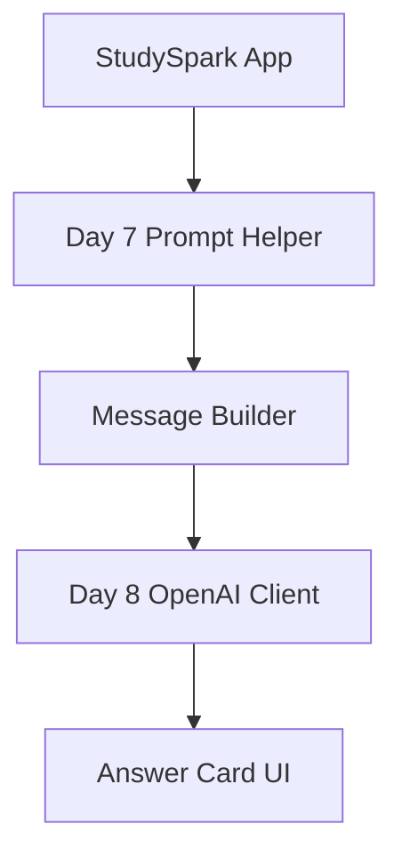

### Spec Document Structure
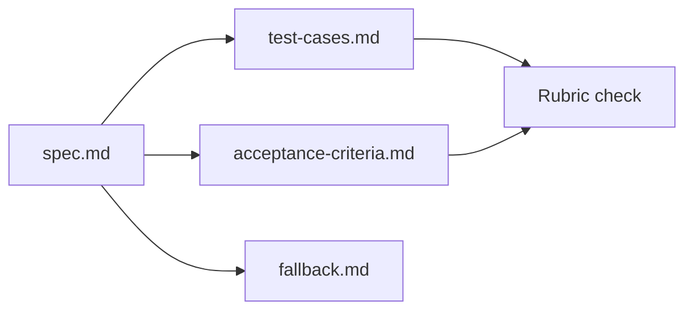

### User Journey Timeline
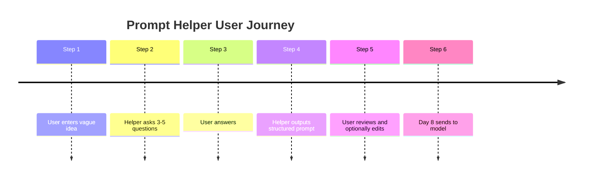

### Confidence Levels
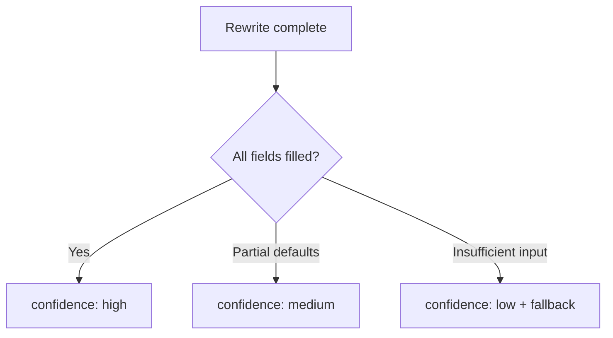

### Edge Case Handling
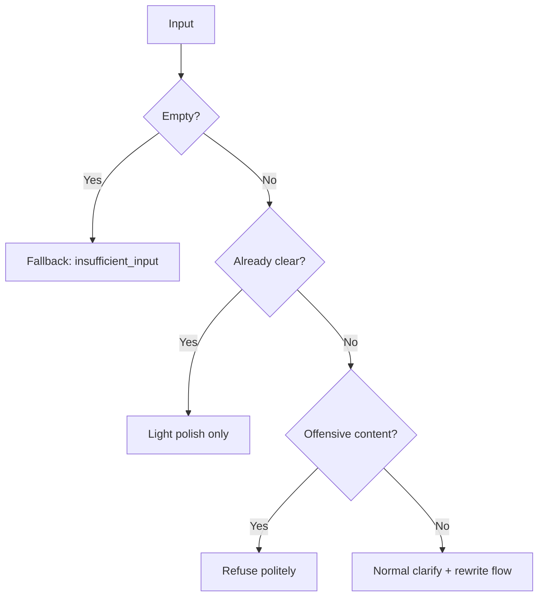

## Detailed Spec Template

Copy this template into your project folder and fill every section. Do not skip `[TODO]` markers.

### File: `prompt-helper/spec.md`

```markdown
# Prompt Helper Specification

## 1. Problem Statement
[TODO: Who is the user? What vague input do they provide? What pain does the helper solve?]

**Example:**
- User: college student using StudySpark
- Vague input: "help me study AI"
- Pain: model gives generic answers without level, topic, or format

## 2. Scope

### In scope
- [TODO: e.g., text-only CLI or form flow]
- [TODO: 3–5 clarifying questions]
- [TODO: structured JSON output]

### Out of scope
- [TODO: e.g., no API calls on Day 7, no user accounts]

## 3. Input Schema

| Field | Type | Required | Description |
| --- | --- | --- | --- |
| raw_idea | string | yes | User's initial vague request |
| context | string | no | Optional extra context |

## 4. Clarifying Questions

Ask these when information is missing:

1. [TODO: e.g., Who is the audience?]
2. [TODO: e.g., What is the goal?]
3. [TODO: e.g., What format do you want?]
4. [TODO: optional fourth question]
5. [TODO: optional fifth question]

**Rules:**
- Skip questions already answered in raw_idea
- Maximum 5 questions per session
- Use plain language, no jargon

## 5. Rewrite Rules

[TODO: Describe how answers combine into the improved prompt]

Template:
"""
Write for {{audience}}.
Goal: {{goal}}.
Format: {{format}}.
Tone: {{tone}}.
Topic: {{raw_idea}}.
Constraints: {{constraints}}
"""

## 6. Output Schema

```json
{
  "improved_prompt": "string",
  "audience": "string",
  "goal": "string",
  "format": "string",
  "tone": "string",
  "constraints": "string or null",
  "confidence": "high | medium | low",
  "questions_asked": ["string"]
}
```

## 7. Acceptance Criteria

| Criterion | Required |
| --- | --- |
| improved_prompt mentions audience | yes |
| improved_prompt mentions goal | yes |
| improved_prompt mentions format | yes |
| improved_prompt is under [N] words | yes |
| no invented facts about the user | yes |

## 8. Fallback Behavior

| Condition | Response |
| --- | --- |
| Empty raw_idea | `{ "error": "insufficient_input", "message": "..." }` |
| One-word answers | Ask one follow-up OR apply defaults and set confidence: low |
| Already-clear input | Skip questions; light polish; confidence: high |
| Offensive input | Refuse with `{ "error": "policy_violation", "message": "..." }` |

## 9. Defaults (when user skips questions)

| Field | Default value |
| --- | --- |
| audience | [TODO: e.g., general learner] |
| goal | [TODO: e.g., explain clearly] |
| format | [TODO: e.g., short paragraph] |
| tone | [TODO: e.g., friendly and concise] |

## 10. Day 8 Integration

Map output to API messages:

- system: [TODO: fixed tutor role string]
- developer: improved_prompt from helper
- user: raw_idea or condensed question

## 11. Version
- spec_version: 1.0.0
- author: [TODO]
- last_updated: [TODO]
```

### File: `prompt-helper/test-cases.md`

```markdown
# Test Cases

| ID | Input | Expected behavior |
| --- | --- | --- |
| TC-01 | "write me something about marketing" | Ask audience, goal, format |
| TC-02 | "" (empty) | Fallback insufficient_input |
| TC-03 | "Explain binary search for CS101 students in 3 bullets" | Skip most questions; confidence high |
| TC-04 | "help" (one word) | Follow-up or low-confidence defaults |
| TC-05 | [TODO: messy real-world input] | [TODO: expected output fields] |
```

### File: `prompt-helper/acceptance-criteria.md`

Copy the acceptance criteria table from spec.md and add checkboxes for manual testing.

### Rubric Check
Before submitting, verify your spec against:
**[`solutions/day_07_prompt_helper_rubric.md`](../solutions/day_07_prompt_helper_rubric.md)**

The rubric defines Minimum Pass (Beginner), Standard (Intermediate), and Stretch (Advanced) levels.

## Code Walkthrough

These examples show the shape of helper logic you will implement on Day 8—not required for today's spec deliverable.

### Example 1: Python — Detect vague input
```python
VAGUE_PATTERNS = ["something about", "help me", "write me", "stuff on"]

def is_vague(text: str) -> bool:
    lowered = text.lower().strip()
    if len(lowered.split()) <= 3:
        return True
    return any(pattern in lowered for pattern in VAGUE_PATTERNS)
```

#### Code Explanation
- Heuristics flag vague input before asking the model.
- Short inputs (three words or fewer) are often underspecified.
- Pattern lists are tunable as you collect real user data.

### Example 2: TypeScript — Clarifying question bank
```typescript
type QuestionKey = 'audience' | 'goal' | 'format' | 'tone';

const QUESTIONS: Record<QuestionKey, string> = {
  audience: 'Who is the audience?',
  goal: 'What is the goal of this content?',
  format: 'What format do you want (bullets, paragraph, quiz)?',
  tone: 'What tone should it have (formal, casual, practical)?',
};

function missingFields(answers: Partial<Record<QuestionKey, string>>): QuestionKey[] {
  return (Object.keys(QUESTIONS) as QuestionKey[]).filter((k) => !answers[k]?.trim());
}
```

#### Code Explanation
- Question keys map to output schema fields.
- `missingFields` supports skip-if-already-answered logic.
- Central question bank keeps copy consistent across UI and CLI.

### Example 3: Python — Rewrite function
```python
def rewrite_prompt(idea: str, audience: str, goal: str, format_type: str, tone: str) -> str:
    return (
        f"Write for {audience}. "
        f"Goal: {goal}. "
        f"Format: {format_type}. "
        f"Tone: {tone}. "
        f"Topic: {idea.strip()}"
    )
```

#### Code Explanation
- Named parameters match the output schema fields.
- Order matches the spec template for consistency.
- Strip whitespace on user input before insertion.

### Example 4: TypeScript — Structured output type
```typescript
type HelperOutput = {
  improvedPrompt: string;
  audience: string;
  goal: string;
  format: string;
  tone: string;
  confidence: 'high' | 'medium' | 'low';
  questionsAsked: string[];
};

type HelperError = {
  error: 'insufficient_input' | 'policy_violation';
  message: string;
};
```

#### Code Explanation
- Discriminate success vs error in implementation (union types).
- `confidence` signals when to show defaults warning in UI.
- `questionsAsked` aids debugging and analytics.

### Example 5: Python — Acceptance criteria checker
```python
def meets_criteria(output: dict) -> bool:
    prompt = output.get("improved_prompt", "")
    required_words = ["audience", "goal", "format"]  # or check fields directly
    has_fields = all(output.get(k) for k in ["audience", "goal", "format"])
    under_limit = len(prompt.split()) <= 80
    return has_fields and under_limit
```

#### Code Explanation
- Automated checks mirror your spec acceptance table.
- Run against every test case before marking spec complete.
- Word limits enforce concise prompts suitable for API calls.

### Example 6: TypeScript — Map helper output to API messages
```typescript
function toApiMessages(output: HelperOutput, rawIdea: string) {
  return [
    { role: 'system' as const, content: 'You are a helpful study assistant.' },
    { role: 'developer' as const, content: output.improvedPrompt },
    { role: 'user' as const, content: rawIdea },
  ];
}
```

#### Code Explanation
- Bridges Day 7 output to Day 6/8 request shape.
- System role stays fixed; developer carries the improved instruction.
- User message preserves original intent for context.

### Example 7: Python — Fallback for empty input
```python
def handle_input(raw_idea: str) -> dict:
    if not raw_idea or not raw_idea.strip():
        return {
            "error": "insufficient_input",
            "message": "Please describe what you want help with.",
        }
    return {"status": "ok", "raw_idea": raw_idea.strip()}
```

#### Code Explanation
- Fallbacks match the schema defined in your spec.
- Deterministic handling saves API calls for empty input.
- Error messages should be user-actionable.

### Example 8: TypeScript — Default values when user skips
```typescript
const DEFAULTS = {
  audience: 'general learner',
  goal: 'explain clearly',
  format: 'short paragraph',
  tone: 'friendly and concise',
};

function withDefaults(partial: Partial<HelperOutput>): HelperOutput {
  return {
    improvedPrompt: partial.improvedPrompt ?? '',
    audience: partial.audience ?? DEFAULTS.audience,
    goal: partial.goal ?? DEFAULTS.goal,
    format: partial.format ?? DEFAULTS.format,
    tone: partial.tone ?? DEFAULTS.tone,
    confidence: 'low',
    questionsAsked: partial.questionsAsked ?? [],
  };
}
```

#### Code Explanation
- Defaults prevent blocked UX when users skip questions.
- `confidence: low` tells the UI to suggest review/editing.
- Defaults must be documented in spec section 9.

### Example 9: Python — Test case runner (offline)
```python
TEST_CASES = [
    {"input": "write me something about marketing", "expect_vague": True},
    {"input": "", "expect_error": "insufficient_input"},
    {"input": "Explain binary search for CS101 in 3 bullets", "expect_vague": False},
]

for case in TEST_CASES:
    result = handle_input(case["input"])
    if case.get("expect_error"):
        assert result.get("error") == case["expect_error"]
    print("PASS:", case["input"][:40])
```

#### Code Explanation
- Offline tests validate spec logic without API keys.
- Run before submitting against the rubric.
- Add your five test cases from `test-cases.md`.

### Example 10: TypeScript — Already-clear input fast path
```typescript
function shouldSkipQuestions(rawIdea: string): boolean {
  const hasAudience = /for \w+/i.test(rawIdea);
  const hasFormat = /bullet|paragraph|quiz|list/i.test(rawIdea);
  return rawIdea.length > 40 && hasAudience && hasFormat;
}
```

#### Code Explanation
- Fast path reduces friction for detailed inputs.
- Heuristics are imperfect—document limitations in spec.
- `confidence: high` when skipping questions with rich input.

## Practical Examples

### Beginner Example: Marketing prompt helper
**Input:** "write me something about marketing."

**Questions:**
1. Who is the audience?
2. What is the goal?
3. What format do you want?

**Answers:** small business owners, teach basics, bullet points

**Output:**
"Write a beginner-friendly marketing overview for small business owners. Goal: teach marketing basics. Format: 5 bullet points under 120 words. Tone: practical, no jargon."

### Intermediate Example: Study prompt helper
**Input:** "help me study AI."

**Questions:** Which topic? What level? Summary, quiz, or explanation?

**Output includes:** `confidence: high`, structured fields, `improved_prompt` ready for Day 8.

### Advanced Example: Internal documentation helper
**Input:** "make this doc better."

**Questions:** Who is the document for? Goal: clarity, brevity, or persuasion? Which sections must stay?

**Why it mirrors real work:** workplace requests are vague; helpers standardize quality.

### Production Example: StudySpark front door
StudySpark receives "explain transformers" → helper adds level (undergrad), format (analogy + diagram description), tone (curious beginner) → Day 8 client sends structured messages → answer card renders with metadata.

### Real-World Company Example
**Notion AI** infers document context before generation.**Jasper** asks brand voice and audience before writing.**GitHub Copilot** uses file context as implicit clarification.

Pattern: **reduce ambiguity before the expensive model call**.

## Comparison Tables

### Interactive vs Automatic Helper
| Mode | Pros | Cons |
| --- | --- | --- |
| Interactive | Higher quality, educates user | More friction |
| Automatic | Faster | May guess wrong |
| Hybrid | Balanced | More complex spec |

### Spec Completeness Levels
| Level | Deliverable | Rubric section |
| --- | --- | --- |
| Beginner | spec.md + 3 questions + 1 example | Minimum Pass |
| Intermediate | + test-cases.md + acceptance table | Standard |
| Advanced | + evaluation plan + StudySpark link | Stretch |

### Confidence Levels
| Level | Meaning | UI suggestion |
| --- | --- | --- |
| high | All fields from user | Enable "Send to model" |
| medium | Some defaults used | Show "Review prompt" |
| low | Mostly defaults | Require edit before send |

### Helper Output vs Raw Input
| Aspect | Raw input | Helper output |
| --- | --- | --- |
| Audience | Missing | Explicit |
| Format | Missing | Explicit |
| Testability | Subjective | Schema + rubric |
| API-ready | No | Yes |

## Best Practices
- keep the project small enough to finish today
- focus on one user persona (e.g., student)
- define output schema before clarifying questions
- write test cases before implementation
- use the [rubric](../solutions/day_07_prompt_helper_rubric.md) as your definition of done
- separate questions, rewrite rules, and fallback logic in the spec
- document defaults explicitly—never implicit assumptions
- limit to 3–5 questions to avoid form fatigue
- show the improved prompt to the user before Day 8 sending
- version your spec (`spec_version: 1.0.0`)

## Common Mistakes
- building too many features (API, auth, database) on Day 7
- skipping the spec and jumping to code
- not defining what "better prompt" means
- hiding the output format from the user
- forgetting empty-input and one-word test cases
- making the helper so strict it annoys users
- no link between helper output and Day 6 message roles
- ignoring the rubric until the end

### Debugging Strategy
If the helper spec feels weak, ask:

1. Could another developer implement from this spec alone?
2. Do test cases cover empty, vague, clear, and messy inputs?
3. Does every output field have a defined source (user answer or default)?
4. Is fallback behavior explicit for each failure mode?
5. Does the improved prompt meet the acceptance criteria table?

## Performance

### Latency
A text-only spec/helper should feel instant. Clarifying questions are human-paced; rewrite logic is deterministic and fast.

### Complexity
The best Day 7 version keeps logic simple: question bank + template + validation. Avoid calling an LLM to write prompts on Day 7—that is Day 8's job.

### Maintainability
A clear spec in markdown diff better than a half-finished app. Invest in test cases—they become Day 8 unit tests.

## Security
Even a prompt helper spec should address:

- do not treat user input as trusted instructions in system prompts
- define behavior for offensive or policy-violating input
- keep future API keys out of the spec repository
- warn users when defaults guess sensitive attributes (medical, legal)

## Evaluation

Evaluate your spec against [`solutions/day_07_prompt_helper_rubric.md`](../solutions/day_07_prompt_helper_rubric.md).

### What to measure
- does the spec ask the right clarifying questions?
- does the improved prompt include audience, goal, and format?
- is output easier to use than raw input?
- do test cases cover realistic vagueness?

### Self-check before Day 8
- [ ] Rubric Minimum Pass complete
- [ ] Five test cases documented
- [ ] Output schema matches Day 6 message builder plan
- [ ] Fallbacks defined for empty and one-word input
- [ ] One worked example: vague → questions → improved prompt

## Exercises

### Easy
1. Describe what the prompt helper should do in two sentences.
2. Name one kind of vague input the helper should improve.
3. Explain why a prompt helper is useful before an LLM call.
4. List three clarifying questions from the spec template.
5. What fields belong in the output schema?
6. What is the fallback for empty input?
7. Copy the spec template into a new folder and fill section 1 (Problem Statement).

### Medium
8. Write five clarifying questions for a study-assistant helper.
9. Define input and output schemas in JSON shape.
10. Explain how acceptance criteria make the project testable.
11. Write test case TC-05 with messy real-world input.
12. Fill spec sections 4–6 (questions, rewrite rules, output schema).
13. Define defaults for all four fields when users skip questions.
14. Map helper output to system/developer/user messages.
15. Complete the Standard section of the [rubric](../solutions/day_07_prompt_helper_rubric.md).

### Hard
16. Define a success checklist with eight criteria.
17. Specify behavior when the user gives one-word answers.
18. Design output schema with confidence levels and questions_asked.
19. Write acceptance criteria for "no invented user facts."
20. Create fallback for already-clear input (fast path).
21. Document offensive-input handling in spec section 8.
22. Add Day 8 integration section with exact role strings.

### Challenge
23. Design tone/audience variants (formal vs casual) in rewrite rules.
24. Explain how the helper becomes a reusable npm/PyPI module on Day 8.
25. Write an evaluation plan: how to know the helper improves prompts.
26. Add edge cases: non-English input, extremely long input, copy-paste JSON.
27. Complete the Stretch section of the [rubric](../solutions/day_07_prompt_helper_rubric.md).

### Reflection Questions
28. What tradeoff did you make between friction (questions) and quality?
29. When would you skip the helper entirely?
30. How does Day 7 output connect to Day 8 in one sentence?
31. What was hardest to specify—questions, rewrite, or fallbacks?
32. What would you A/B test if this shipped to real users?

## Quizzes

### Quiz 1
1. What is a prompt helper?
2. Why build a spec before code on Day 7?
3. Name two output schema fields.
4. What rubric file should you check?

**Answers:** 1. Tool that improves vague requests before model calls  2. Clarity, testability, no API key required  3. e.g., improved_prompt, audience, goal, format  4. `solutions/day_07_prompt_helper_rubric.md`

### Quiz 2
1. What is the fallback for empty input?
2. How many clarifying questions maximum?
3. What does confidence: low mean?
4. Which Day connects helper to API?

**Answers:** 1. insufficient_input error  2. 5 (recommended 3–5)  3. Mostly defaults used; user should review  4. Day 8

### Quiz 3
1. Interactive vs automatic helper?
2. What is the StudySpark connection?
3. Why structured JSON output?
4. Name one edge case to test.

**Answers:** 1. Interactive asks questions; automatic infers defaults  2. Helper is front door before model calls  3. Downstream code maps fields to API messages  4. empty, one-word, already-clear, offensive

### Quiz 4
1. What goes in the developer message on Day 8?
2. Why show improved prompt to user?
3. What is a fast path?
4. Name one common mistake on Day 7.

**Answers:** 1. improved_prompt from helper  2. Transparency and edit opportunity  3. Skip questions when input already detailed  3. Overbuilding or skipping spec

### Quiz 5
1. What is spec_version for?
2. Name one acceptance criterion.
3. What is rewrite rules section?
4. Why defaults in the spec?

**Answers:** 1. Track spec changes over time  2. e.g., must mention audience  3. How answers combine into improved_prompt  4. Document behavior when users skip questions

## Interview Questions

### Conceptual
- What is a prompt helper and why use one?
- How do clarifying questions improve downstream model quality?
- Spec-first vs code-first development for AI features?
- When would a prompt helper add too much friction?

### Practical
- Walk through vague input → improved prompt flow.
- How would you define acceptance criteria for a helper?
- How does helper output map to LLM API messages?
- What test cases would you write before implementation?

### System Design
- Design a prompt helper as a microservice in StudySpark.
- How would you A/B test helper vs no-helper?
- Design analytics to track which questions users skip.

### Debugging
- Users abandon the helper form. What do you check?
- Improved prompts still produce bad answers. Is the helper at fault?
- One-word answers break output quality. How do you fix?

## Mini Project

Build a **Prompt Helper specification** with input, questions, output, acceptance criteria, and test cases.

### Goal
Design a text-first prompt helper that you (or another developer) could implement in one day on Day 8.

### Required Deliverables
| File | Contents |
| --- | --- |
| `spec.md` | Full spec using the Detailed Spec Template above |
| `test-cases.md` | Minimum 5 test cases with expected behavior |
| `acceptance-criteria.md` | Checklist derived from spec section 7 |
| `fallback.md` | Expanded fallback rules for all edge cases |
| `examples.md` | At least 2 worked examples (vague → improved) |

### Suggested Folder Structure
```text
prompt-helper/
├── spec.md
├── test-cases.md
├── acceptance-criteria.md
├── fallback.md
├── examples.md
└── README.md              # How to use and how to run against rubric
```

### Project Steps
1. copy the Detailed Spec Template from this lesson into `spec.md`
2. choose user persona (student recommended for StudySpark alignment)
3. write 3–5 clarifying questions with skip rules
4. define output JSON schema and rewrite template
5. write acceptance criteria table (minimum 5 rows)
6. document fallbacks: empty, one-word, clear input, offensive
7. create five test cases including TC-01 through TC-04 from template
8. add two worked examples to `examples.md`
9. self-grade against [`solutions/day_07_prompt_helper_rubric.md`](../solutions/day_07_prompt_helper_rubric.md)
10. update [`projects/CAPSTONE.md`](../../projects/CAPSTONE.md) with helper spec summary

### Acceptance Criteria (Project Level)
- spec is complete with no remaining `[TODO]` markers
- rubric Minimum Pass achieved (Beginner) or higher
- output schema includes `improved_prompt`, `confidence`, and metadata fields
- Day 8 integration section maps to system/developer/user roles
- README links to the rubric file

### Optional Code Stretch (Day 8 preview)
If you finish early, implement `rewrite_prompt()` and `handle_input()` in Python or TypeScript using the Code Walkthrough examples. Do not call external APIs yet.

### What You Learn
- how to move from concept to implementable specification
- how to build a user-facing AI workflow on paper first
- how to define success with rubrics and test cases
- how the prompt helper becomes StudySpark's front door

## Cumulative Capstone Update

Add to [`projects/CAPSTONE.md`](../../projects/CAPSTONE.md):

- **Prompt Helper spec** — paste or link your `prompt-helper/spec.md`
  - input schema (`raw_idea`, optional `context`)
  - clarifying questions (3–5)
  - output schema (`improved_prompt`, `audience`, `goal`, `format`, `tone`, `confidence`)
- **Front door architecture** — document that StudySpark runs the prompt helper **before** any LLM API call
- **Rubric status** — note which rubric level you achieved (Minimum / Standard / Stretch)
- **Day 8 handoff** — list the function signature you will implement:

```python
def improve_user_prompt(raw_idea: str, answers: dict | None = None) -> dict:
    """Return structured helper output ready for message builder."""
```

Capstone flow after Day 7:

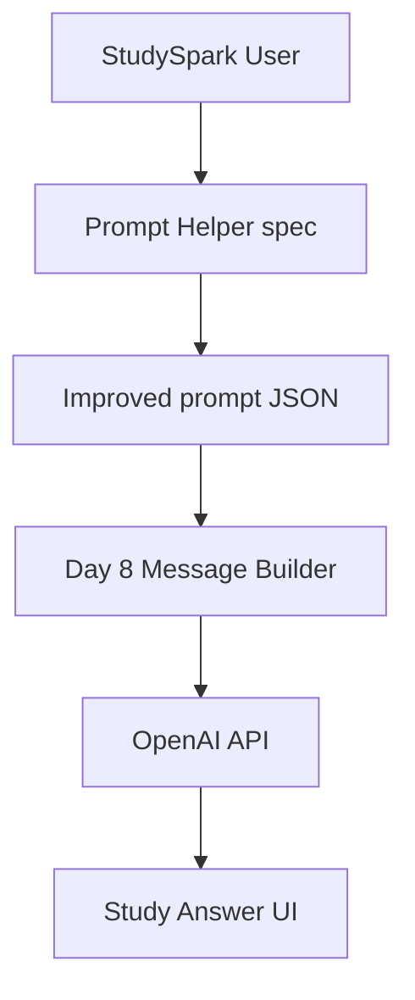

## Historical Background

Prompt helpers emerged from a simple observation: **GPT demos worked best when experts wrote the prompts**. Products like Jasper (2021–2022) productized templates and questionnaires so non-experts could get expert-quality instructions.

As chat UIs proliferated, teams discovered that a few clarifying questions often beat a longer system prompt. The pattern—**clarify, structure, then generate**—is now standard in writing assistants, code tools, and education apps.

Day 7 captures this pattern as a spec because the thinking transfers even when the UI changes (form, chat, CLI, browser extension).

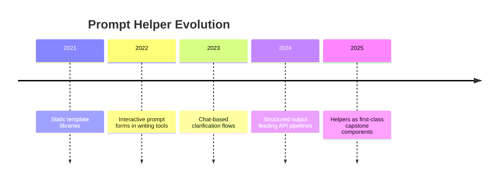

## Summary
Mini projects connect concepts into a **working system design**.

A small, complete specification is more valuable than a large unfinished prototype. Your prompt helper spec defines StudySpark's front door—turning vague learner requests into structured prompts ready for Day 8's OpenAI client. Grade your work against the [rubric](../solutions/day_07_prompt_helper_rubric.md), update the capstone, and tomorrow you will send your first real API request.

[Previous: Day 6 - LLM APIs](../day_06/day_06_llm_apis.md) | [Next: Day 8 - OpenAI API](../day_08/day_08_openai_api.md)

## Further Reading
- [`solutions/day_07_prompt_helper_rubric.md`](../solutions/day_07_prompt_helper_rubric.md) — project rubric (required)
- https://www.promptingguide.ai/
- https://platform.openai.com/docs/guides/prompt-engineering
- https://www.nngroup.com/articles/using-ux-to-improve-chatgpt-prompts/
- https://developer.mozilla.org/en-US/docs/Learn/Forms
