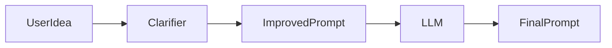

# Day 7 - Mini Project: Prompt Helper

## Introduction
Today you will combine the first week into one small but useful project. The goal is to design a prompt helper that rewrites vague requests into clear prompts.


## Learning Objectives
By the end of this day, you should be able to:

- combine prompting, context, and output structure into one flow
- explain how a user-facing AI feature is designed
- define project scope before coding
- create a simple evaluation checklist
- plan a small deliverable that is realistic in one day

## Theory
A mini project is where knowledge becomes skill. The point is not to build the biggest app. The point is to build a complete loop: input, processing, output, and validation.

A prompt helper can take a rough idea like "write me something about marketing" and transform it into a sharper instruction with audience, tone, length, and format.

### Visual Diagram


## Code Examples

### Python
```python
user_idea = "write me something about marketing"
clarifying_questions = [
    "Who is the audience?",
    "What is the goal?",
    "What format do you want?",
]

print(user_idea)
print(clarifying_questions)
```

### TypeScript
```typescript
const userIdea = 'write me something about marketing';
const clarifyingQuestions = [
  'Who is the audience?',
  'What is the goal?',
  'What format do you want?',
];

console.log(userIdea);
console.log(clarifyingQuestions);
```

## Best Practices
- keep the project small enough to finish
- focus on one user problem
- define a useful output format
- write a short test list before building
- make the app helpful even when input is vague

## Common Mistakes
- building too many features at once
- skipping the design step
- not defining what "better" means
- hiding the output format from the user
- forgetting to test with vague and messy inputs

## Exercises
- Easy: Describe what the prompt helper should do.
- Medium: Write three clarification questions.
- Hard: Define a success checklist for the project.
- Challenge: Add a fallback when the input is too vague.

## Mini Project
Build a prompt helper specification with input, questions, output, and acceptance criteria. If you implement it, keep the first version text-only.

## Summary
Mini projects help you connect concepts into a working system. A small, polished project is more valuable than a large unfinished one.

## Additional Resources
- https://www.promptingguide.ai/
- https://platform.openai.com/docs/guides/prompt-engineering
- https://developer.mozilla.org/en-US/docs/Web/JavaScript
