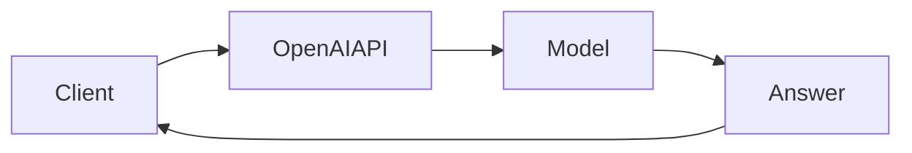

# Day 8 - OpenAI API

[Previous: Day 7 - Mini Project: Prompt Helper](../day_07/day_07_mini_project_prompt_helper.md) | [Next: Day 9 - Claude API](../day_09/day_09_claude_api.md)

## Introduction
The OpenAI API gives you access to hosted models through a simple request and response pattern. For many AI products, this is the fastest path from an idea to a working prototype.


## Learning Objectives
By the end of this day, you should be able to:

- describe the basic structure of an OpenAI API call
- understand chat-style message formatting
- choose a model for a simple use case
- handle responses safely in your code
- distinguish prototyping from production design

## Theory
The OpenAI API is just one example of an LLM service, but it illustrates the common shape of modern AI APIs well. You send instructions and content, and the service returns model output that your app can post-process.

Good application design still matters more than model access. You need rate limits, retries, clear prompts, and output checks.

### Visual Diagram


## Code Examples

### Python
```python
from typing import Any, Dict

request: Dict[str, Any] = {
    "model": "example-model",
    "messages": [{"role": "user", "content": "Summarize AI engineering."}],
}

print(request)
```

### TypeScript
```typescript
type RequestPayload = {
  model: string;
  messages: Array<{ role: string; content: string }>;
};

const request: RequestPayload = {
  model: 'example-model',
  messages: [{ role: 'user', content: 'Summarize AI engineering.' }],
};

console.log(request);
```

## Best Practices
- store API keys in environment variables
- keep requests minimal
- validate the response before showing it to users
- build timeouts and retries into the client
- test the app with rate limits and error responses

## Common Mistakes
- committing secrets to source control
- using the model output directly without validation
- overcomplicating the first prototype
- assuming API access guarantees good product quality
- ignoring cost per request

## Exercises
- Easy: Describe the shape of a chat request.
- Medium: Explain why API keys should not live in code.
- Hard: Design a safe response handling flow.
- Challenge: Draft a retry policy for transient failures.

## Mini Project
Create a design for a short-answer API client that submits a prompt and displays the model response in a formatted card.

## Summary
The OpenAI API is a practical example of LLM integration. The important lesson is not the endpoint itself, but the app discipline around requests, keys, output checks, and costs.

[Previous: Day 7 - Mini Project: Prompt Helper](../day_07/day_07_mini_project_prompt_helper.md) | [Next: Day 9 - Claude API](../day_09/day_09_claude_api.md)

## Additional Resources
- https://platform.openai.com/docs
- https://platform.openai.com/docs/guides/text
- https://platform.openai.com/docs/guides/production-best-practices
