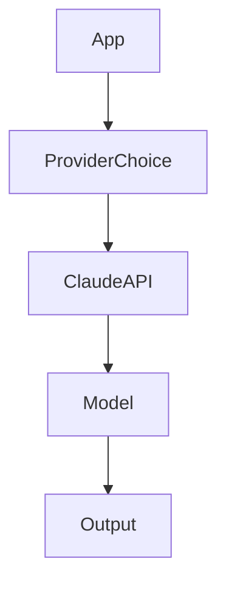

# Day 9 - Claude API

[Previous: Day 8 - OpenAI API](../day_08/day_08_openai_api.md) | [Next: Day 10 - Structured Outputs](../day_10/day_10_structured_outputs.md)

## Introduction
Claude is another powerful model family used through an API. Studying a second provider helps you see which design ideas are universal and which are vendor-specific.


## Learning Objectives
By the end of this day, you should be able to:

- describe how Claude API usage is similar to other LLM APIs
- understand why provider comparison is useful
- write a provider-agnostic request shape
- think about safety and instruction hierarchy
- compare model choice by product need

## Theory
Different model providers expose different APIs, but the same engineering questions remain: What is the task? What context is needed? How should output be structured? How should failure be handled?

Claude is often used with strong instruction-following and long-context workflows, which makes it a good example for document-heavy and assistant-style applications.

### Visual Diagram


## Code Examples

### Python
```python
provider = "Claude"
prompt = "Explain the difference between instructions and context."

print({"provider": provider, "prompt": prompt})
```

### TypeScript
```typescript
const provider = 'Claude';
const prompt = 'Explain the difference between instructions and context.';

console.log({ provider, prompt });
```

## Best Practices
- compare providers using the same test prompts
- build an abstraction around your app's request format
- keep safety policies separate from the prompt body when possible
- test long-context behavior carefully
- choose the provider that fits the use case, not the one with the loudest marketing

## Common Mistakes
- rewriting the app for every provider detail
- assuming all models behave the same
- not comparing cost, latency, and quality together
- putting provider-specific logic everywhere in the codebase
- ignoring prompt portability

## Exercises
- Easy: Explain why comparing providers matters.
- Medium: List three things you would test across providers.
- Hard: Design a provider-neutral message format.
- Challenge: Write a migration plan from one API provider to another.

## Mini Project
Create a provider comparison sheet for a summarizer app. Include quality, speed, cost, and ease of integration.

## Summary
Provider APIs look different on the surface, but the engineering questions remain the same. Good abstractions make it easier to compare and switch models later.

[Previous: Day 8 - OpenAI API](../day_08/day_08_openai_api.md) | [Next: Day 10 - Structured Outputs](../day_10/day_10_structured_outputs.md)

## Additional Resources
- https://docs.anthropic.com/
- https://docs.anthropic.com/en/docs/build-with-claude
- https://docs.anthropic.com/en/docs/test-and-evaluate
