# Day 11 - Tool Calling

[Previous: Day 10 - Structured Outputs](../day_10/day_10_structured_outputs.md) | [Next: Day 12 - Function Calling](../day_12/day_12_function_calling.md)

## Introduction

Yesterday we learned how to make model output predictable with structured schemas. Today we take the next step: giving the model a controlled way to request actions from your application.

Tool calling lets a language model ask your code to do things it cannot do on its own—search a database, read a calendar, run a calculation, fetch live data, or update a record. The model does not execute the tool. Your application does. That separation is the foundation of safe, useful AI systems.


Think of the model as a coordinator, not an operator. It understands the user's intent, decides whether a tool is needed, chooses which tool to call, and fills in arguments. Your app owns the registry of allowed tools, validates every request, runs the code, and returns results back into the conversation.

This pattern appears everywhere: search assistants, support copilots, coding agents, and enterprise internal tools. Day 11 teaches the concepts. Day 12 goes deeper into function-calling APIs. Day 25 introduces MCP as a standard way to expose tools across applications.

## Learning Objectives

By the end of this day, you should be able to:

- explain the model-as-coordinator pattern and why the app keeps execution authority
- design a tool registry with clear schemas and permission boundaries
- describe the model → tool → model loop step by step
- decide when a tool is better than pure text generation
- compare parallel and sequential tool execution strategies
- manage tool output size so context windows stay healthy
- implement auditing and human-in-the-loop gates for dangerous tools
- preview how MCP standardizes tool access for future agent systems
- build a note search assistant that uses a search tool before answering

## How to Use This Lesson

This lesson is designed for **all skill levels**. Pick one path and follow it consistently.

| Level | Suggested approach | Time |
| --- | --- | --- |
| **Beginner** | Read Introduction → Big Picture → Deep Theory → trace one code example → Easy exercises | 5–7 hours |
| **Intermediate** | Skim objectives → Visual Learning → Code Walkthrough → Medium/Hard exercises → Mini project | 3–5 hours |
| **Advanced** | Deep Theory tradeoffs → Hard/Challenge exercises → extend mini project → capstone slice | 2–3 hours |

### Apply Today
Complete at least one item before moving to the next day:
- [ ] Trace one code example in **Python or TypeScript** (one language is enough)
- [ ] Complete exercises for your level (see Exercises section)
- [ ] Update [`projects/CAPSTONE.md`](../../projects/CAPSTONE.md) with today's capstone item
- [ ] Add today's component to `projects/studyspark/` or update `projects/CAPSTONE.md`.

> **Stuck?** Re-read Big Picture, review Prerequisites, or see [SYLLABUS.md](../../SYLLABUS.md) for path guidance.

## Prerequisites

You should already understand:

- Day 10: Structured Outputs
- basic Python or TypeScript syntax
- how LLM APIs accept messages and return responses
- the difference between generation and application logic

If structured outputs feel unfamiliar, review Day 10 first. Tool calling builds directly on the idea that machine-readable contracts make AI systems safer and more reliable.

## Big Picture

Tool calling sits between user intent and real-world action.

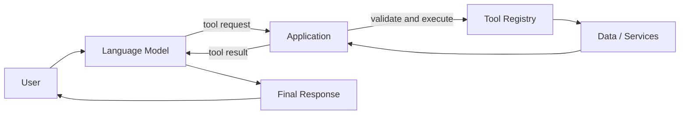

The important idea is this:

- the model proposes actions in a structured format
- the application decides whether to allow them
- tools connect the model to fresh or private data
- results flow back so the model can finish the answer

Without tools, the model can only reason from its training data and whatever you put in the prompt. With tools, it can act on the present moment.

## Deep Theory

### The model-as-coordinator pattern

A language model is excellent at understanding language, planning steps, and synthesizing information. It is not a database, a web browser, or a payment processor.

The coordinator pattern assigns roles clearly:

| Role | Owner | Responsibility |
| --- | --- | --- |
| Intent understanding | Model | Parse the user request and decide next steps |
| Action selection | Model | Choose a tool and propose arguments |
| Execution | Application | Validate, authorize, run, and log |
| Data access | Application | Enforce permissions and scope |
| Final answer | Model | Turn tool results into a helpful response |

This is not a limitation. It is a safety feature. The model suggests; the app executes.

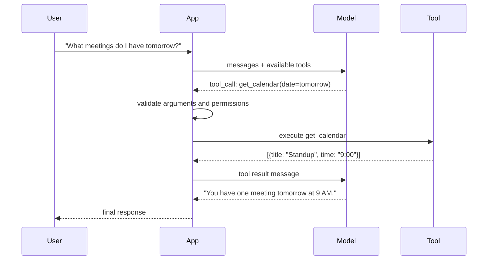

### The tool loop: model → tool → model

Every tool-enabled conversation follows a loop:

1. Send the user message and tool definitions to the model.
2. The model either replies directly or returns a structured tool request.
3. Your app validates the request against schemas and policies.
4. Your app executes the matching tool function.
5. Your app sends the tool output back to the model as a tool result message.
6. The model may call another tool or produce the final answer.
7. Repeat until the model stops requesting tools or a max iteration limit is hit.

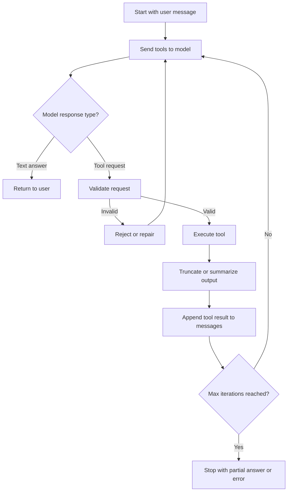

The loop can run once or many times. A travel assistant might call `search_flights`, then `get_hotel_prices`, then answer. Your application must cap iterations to prevent runaway cost and latency.

### Tool registry

A tool registry is the catalog of capabilities your app exposes to the model. It is not just a list of function names. It is a contract.

Each registered tool should include:

- a unique name the model will reference
- a human-readable description the model uses to decide when to call it
- an input schema defining allowed arguments
- an output shape or description of what gets returned
- permission level and scope rules
- optional rate limits or cost metadata

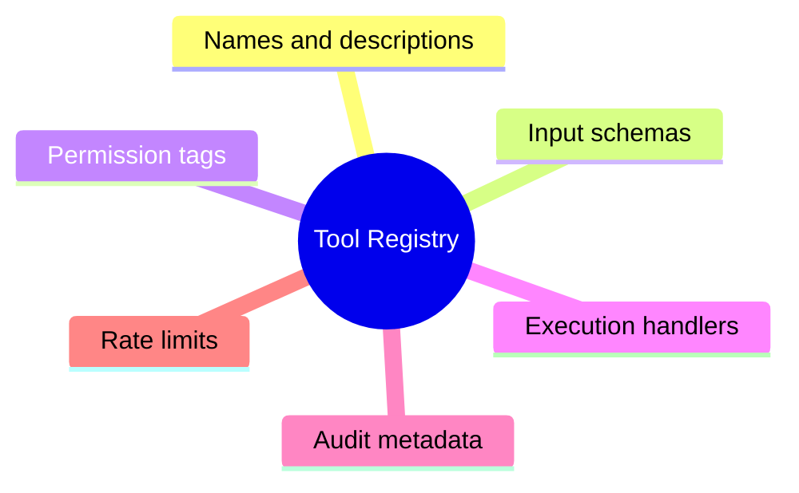

The registry lives in your application code, not in the model weights. You can add, remove, or disable tools without retraining anything.

| Registry field | Purpose | Example |
| --- | --- | --- |
| `name` | Stable identifier for the model | `search_notes` |
| `description` | When the model should use it | "Search user notes by keyword or topic" |
| `parameters` | JSON Schema for arguments | `{ "query": string, "limit": integer }` |
| `permission` | Who may invoke it | `read_only`, `write`, `admin` |
| `handler` | Function your app runs | `search_notes_handler(args, ctx)` |

Keep the registry small and purposeful. Ten well-designed tools beat fifty vague ones.

### Tool schemas

Tool schemas tell the model exactly what shape a request must have. Most providers accept JSON Schema or a close variant.

A good schema is:

- narrow: one responsibility per tool
- explicit: required fields are marked required
- constrained: use enums, min/max, and patterns where possible
- documented: descriptions on every field help the model fill them correctly

Example schema for a note search tool:

```json
{
  "name": "search_notes",
  "description": "Search the user's saved notes by keyword. Use when the user asks about past notes or stored information.",
  "parameters": {
    "type": "object",
    "properties": {
      "query": {
        "type": "string",
        "description": "Search terms from the user's question"
      },
      "limit": {
        "type": "integer",
        "description": "Maximum number of results",
        "minimum": 1,
        "maximum": 10
      }
    },
    "required": ["query"]
  }
}
```

Schemas connect directly to Day 10 structured outputs. The model emits structured tool calls; your app validates them the same way you validate JSON responses.

### Permission boundaries

Tools are power. Permission boundaries define who can trigger what, on which resources, under which conditions.

Common boundary layers:

| Layer | Question it answers | Example |
| --- | --- | --- |
| Tool visibility | Which tools exist for this user/session? | Guests see `search_public_docs` only |
| Argument scope | Can this query reach other users' data? | `user_id` must match authenticated user |
| Action class | Is this read-only or mutating? | `delete_file` requires admin role |
| Environment | Prod vs staging vs sandbox? | Payment tools disabled in demo mode |
| Rate and cost | How often can this run? | Max 5 search calls per minute |

Never trust the model to enforce permissions. It may hallucinate argument values or follow malicious instructions in retrieved text. Your handler must re-check identity and scope at execution time.

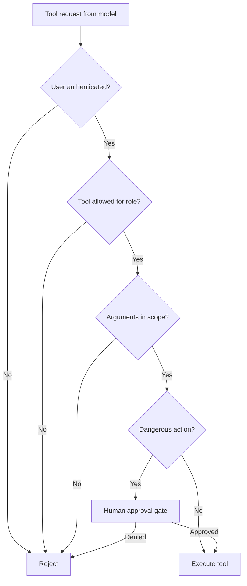

### When tools beat pure generation

Pure generation is enough when:

- the answer is general knowledge with low stakes
- no fresh data is required
- no private or user-specific data is needed
- the task is creative or explanatory

Tools are better when:

- data must be current (weather, stock prices, ticket status)
- data is private (user notes, internal docs, CRM records)
- computation must be exact (math, code execution, unit conversion)
- actions must happen (send email, create ticket, book meeting)
- grounding reduces hallucination risk

| Situation | Pure generation | Tool calling |
| --- | --- | --- |
| "Explain recursion" | Strong fit | Unnecessary |
| "What is my order status?" | Weak—model lacks live data | Required |
| "Summarize these 50 PDFs" | Weak—context limits | Retrieve + summarize |
| "Delete my account" | Dangerous if simulated | Requires real guarded tool |
| "What happened in the news today?" | Often stale or wrong | Search tool needed |

The rule of thumb: if the correct answer depends on data your model does not have at inference time, you need a tool or retrieval path.

### Parallel vs sequential tools

When the model requests multiple tools, your app chooses how to run them.

**Sequential execution** runs one tool after another. Use it when:

- later tools depend on earlier results
- side effects must happen in order
- you need strict audit ordering

**Parallel execution** runs independent tools at the same time. Use it when:

- queries are independent (search docs + search calendar)
- latency matters and tools are I/O bound
- no shared mutable state is involved

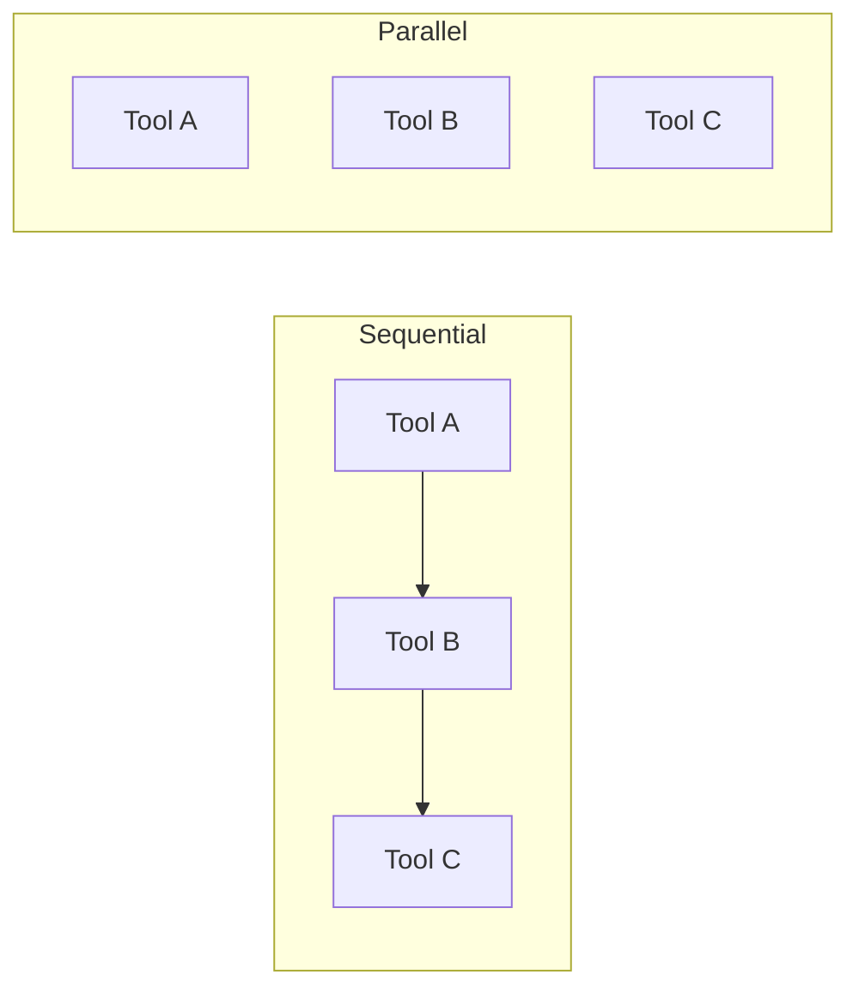

| Strategy | Latency | Complexity | Best for |
| --- | --- | --- | --- |
| Sequential | Higher | Lower | Dependent steps, writes |
| Parallel | Lower | Higher | Independent reads |
| Mixed | Balanced | Highest | Real production agents |

Return parallel results to the model in a consistent order—usually by tool call ID—so the model can map outputs to requests.

### Tool output size limits

Tool outputs become part of the conversation context. A database query that returns ten thousand rows can blow your token budget in one turn.

Strategies to control size:

- set hard row/character limits in the tool itself
- return summaries instead of raw payloads
- paginate and expose `offset` or `cursor` parameters
- truncate with a clear message: "Showing 5 of 312 results"
- store large blobs externally and return IDs or URLs
- compress structured data to only the fields the model needs

| Output type | Risk | Mitigation |
| --- | --- | --- |
| Search results | Too many chunks | Top-k with scores only |
| SQL query | Full table dump | LIMIT + selected columns |
| File read | Entire large file | Chunk by section or line range |
| API response | Verbose JSON | Map to a slim schema |
| Logs | Unbounded text | Time window + max lines |

The model only needs enough to answer the question—not a complete data export.

### Auditing tool use

Production systems log every tool invocation. Auditing answers questions like:

- Who triggered this action?
- What arguments were proposed vs what was executed?
- Was the call allowed or blocked?
- How long did it take and what did it cost?
- Did the outcome match policy?

Minimum audit record:

```json
{
  "timestamp": "2026-07-07T10:15:00Z",
  "user_id": "user-42",
  "session_id": "sess-9f3a",
  "tool_name": "search_notes",
  "arguments": { "query": "project timeline", "limit": 5 },
  "status": "success",
  "latency_ms": 120,
  "result_count": 3
}
```

Auditing is separate from debugging logs. Audit trails support security reviews, compliance, and incident response. Never log secrets, full payment details, or raw health data in plain text.

### Human-in-the-loop for dangerous tools

Some tools should never run on model authority alone:

- deleting data
- sending messages to external parties
- moving money
- changing permissions
- deploying code
- modifying medical or legal records

The pattern is: model proposes → app presents confirmation → human approves or denies → app executes or cancels.

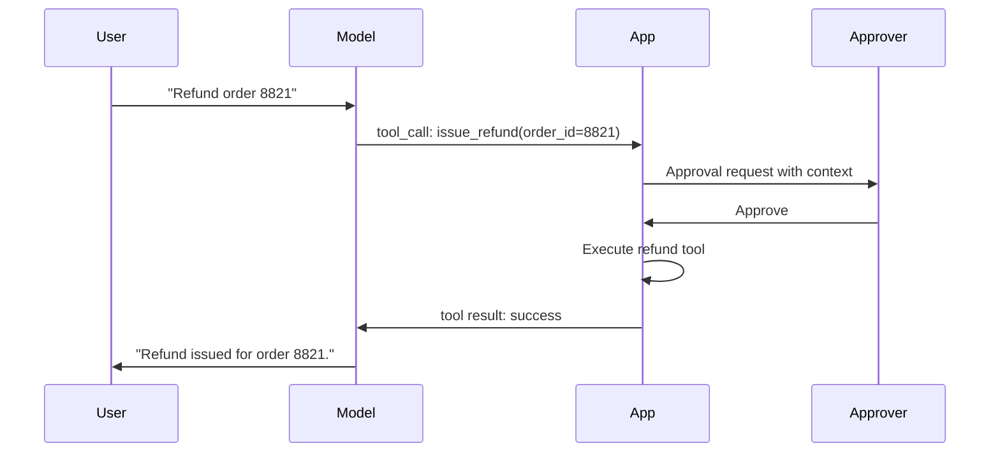

Design approval UX with enough context for a human to decide in seconds: what will happen, to which resource, and why the model requested it.

### MCP: a preview for Day 25

The Model Context Protocol (MCP) standardizes how AI applications discover and use tools across clients and servers. You do not need MCP to learn tool calling, but you should recognize the problem it solves.

Without a standard, every app builds custom integrations for every data source. MCP defines:

- a client in the AI application
- a server that exposes tools and resources
- a common discovery and invocation format

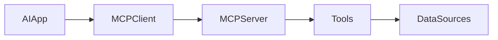

Day 11 focuses on the concepts inside your app: registry, schemas, loop, permissions. Day 25 shows how MCP packages those ideas for reuse across teams and products.

## Case Studies

### ChatGPT plugins era (2023)

OpenAI's plugins were an early mainstream tool-calling model. Each plugin exposed a structured API; ChatGPT decided when to call it. Developers learned quickly:

- tool descriptions mattered as much as code quality
- users blamed the assistant for bad plugin results
- permission and auth models were hard to communicate
- too many plugins made selection unreliable

The lesson for engineers: curation beats abundance. A focused registry with strong schemas outperforms a marketplace of vague endpoints.

### Perplexity and search-augmented answers

Perplexity built its product around the idea that many questions need fresh web data, not parametric memory. Search is the core tool. The model coordinates: interpret the question, run search, read results, synthesize an answer with citations.

Why it works:

- search fills the freshness gap
- citations reduce trust problems
- the tool loop is narrow and well practiced

The lesson: one excellent tool, tightly integrated, can define an entire product category.

### Uber internal tools

Large companies deploy internal copilots connected to ticketing systems, dashboards, and runbooks. Uber and similar organizations emphasize:

- strict permission boundaries per employee role
- read-only tools for most users
- audited write actions with approval flows
- small, testable tool surfaces instead of "full API access"

The lesson: enterprise tool calling is mostly governance engineering. The model is the interface; policy is the product.

## Visual Learning

### Coordinator vs executor split

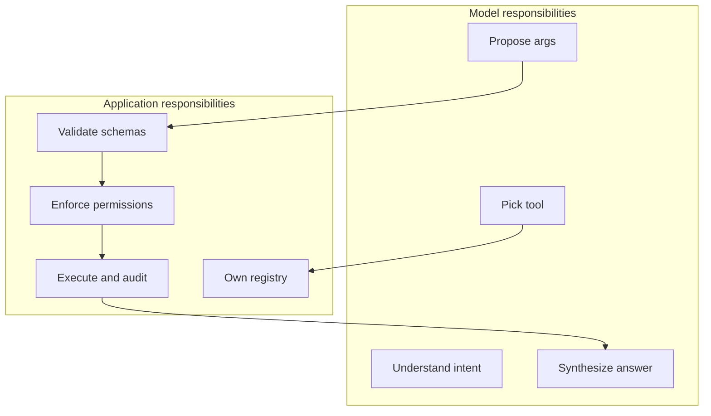

### Decision tree: tool or no tool?

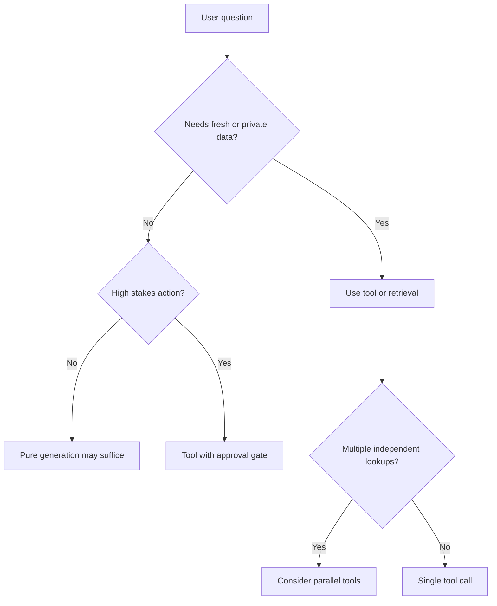

## Code Walkthrough

The examples below are intentionally simple. The goal is to understand the moving parts, not to hide them behind a framework.

### Python Example: Minimal tool registry

```python
TOOL_REGISTRY = {
    "search_notes": {
        "description": "Search saved notes by keyword.",
        "parameters": {
            "type": "object",
            "properties": {
                "query": {"type": "string"},
                "limit": {"type": "integer", "minimum": 1, "maximum": 10},
            },
            "required": ["query"],
        },
        "permission": "read_only",
        "handler": "handlers.search_notes",
    },
    "get_note": {
        "description": "Fetch one note by ID.",
        "parameters": {
            "type": "object",
            "properties": {"note_id": {"type": "string"}},
            "required": ["note_id"],
        },
        "permission": "read_only",
        "handler": "handlers.get_note",
    },
}


def list_tools_for_model():
    return [
        {
            "name": name,
            "description": spec["description"],
            "parameters": spec["parameters"],
        }
        for name, spec in TOOL_REGISTRY.items()
    ]
```

#### Code Explanation

- `TOOL_REGISTRY` is the single source of truth for exposed capabilities.
- Each entry separates model-facing metadata from app-internal fields like `permission` and `handler`.
- `list_tools_for_model()` strips internal fields before sending definitions to the LLM.

### TypeScript Example: Tool definition type

```typescript
type ToolDefinition = {
  name: string;
  description: string;
  parameters: Record<string, unknown>;
  permission: 'read_only' | 'write' | 'admin';
  handler: (args: Record<string, unknown>, ctx: RequestContext) => Promise<string>;
};

const toolRegistry: Record<string, ToolDefinition> = {
  search_notes: {
    name: 'search_notes',
    description: 'Search saved notes by keyword.',
    parameters: {
      type: 'object',
      properties: {
        query: { type: 'string' },
        limit: { type: 'integer', minimum: 1, maximum: 10 },
      },
      required: ['query'],
    },
    permission: 'read_only',
    handler: async (args, ctx) => searchNotes(String(args.query), ctx),
  },
};
```

### Python Example: Argument validation

```python
def validate_tool_call(tool_name, arguments):
    if tool_name not in TOOL_REGISTRY:
        raise ValueError(f"Unknown tool: {tool_name}")

    schema = TOOL_REGISTRY[tool_name]["parameters"]
    required = schema.get("required", [])

    for field in required:
        if field not in arguments:
            raise ValueError(f"Missing required field: {field}")

    limit = arguments.get("limit", 5)
    max_limit = schema["properties"]["limit"]["maximum"]
    if limit > max_limit:
        raise ValueError(f"limit cannot exceed {max_limit}")

    return True
```

Validation happens in your code even if the model "usually" gets it right.

### Python Example: Search notes handler

```python
NOTES = [
    {"id": "n1", "title": "Project timeline", "body": "Phase 1 ends Friday."},
    {"id": "n2", "title": "Grocery list", "body": "Milk, eggs, coffee."},
    {"id": "n3", "title": "Meeting notes", "body": "Discussed Q3 roadmap."},
]


def search_notes(arguments, user_context):
    query = arguments["query"].lower()
    limit = arguments.get("limit", 5)

    matches = [
        note for note in NOTES
        if query in note["title"].lower() or query in note["body"].lower()
    ]

    return matches[:limit]
```

This is the function the application runs—not the model.

### TypeScript Example: Truncating tool output

```typescript
function truncateToolResult(data: unknown, maxChars = 4000): string {
  const text = JSON.stringify(data);

  if (text.length <= maxChars) {
    return text;
  }

  return `${text.slice(0, maxChars)}... [truncated ${text.length - maxChars} chars]`;
}
```

Always bound what goes back into the model context.

### Python Example: Tool loop skeleton

```python
MAX_TOOL_ITERATIONS = 5


def run_tool_loop(messages, model_client):
    for _ in range(MAX_TOOL_ITERATIONS):
        response = model_client.chat(messages, tools=list_tools_for_model())

        if not response.tool_calls:
            return response.text

        for call in response.tool_calls:
            validate_tool_call(call.name, call.arguments)
            result = execute_tool(call.name, call.arguments)
            messages.append({"role": "tool", "name": call.name, "content": result})

    raise RuntimeError("Tool loop exceeded max iterations")
```

The loop is the heart of tool-enabled applications.

### Python Example: Sequential dependent tools

```python
def plan_sequential_calls(tool_calls):
    ordered = []

    if any(call["name"] == "search_notes" for call in tool_calls):
        ordered.append("search_notes")

    if any(call["name"] == "get_note" for call in tool_calls):
        ordered.append("get_note")

    return ordered
```

When `get_note` needs an ID from `search_notes`, run them in order—not in parallel.

### TypeScript Example: Parallel independent tools

```typescript
async function runParallelTools(calls: ToolCall[]): Promise<ToolResult[]> {
  return Promise.all(
    calls.map(async (call) => ({
      id: call.id,
      name: call.name,
      content: await executeTool(call.name, call.arguments),
    })),
  );
}
```

Use parallel execution only when calls do not depend on each other.

### Python Example: Audit log entry

```python
def log_tool_call(user_id, tool_name, arguments, status, latency_ms):
    record = {
        "user_id": user_id,
        "tool_name": tool_name,
        "arguments": arguments,
        "status": status,
        "latency_ms": latency_ms,
    }
    audit_logger.info(record)
```

Keep audit logs structured for querying and alerting.

### Python Example: Human approval gate

```python
DANGEROUS_TOOLS = {"delete_note", "send_email", "issue_refund"}


def requires_approval(tool_name):
    return tool_name in DANGEROUS_TOOLS


def execute_with_policy(tool_name, arguments, user_context):
    if requires_approval(tool_name):
        if not user_context.get("approved_actions", {}).get(tool_name):
            return {"status": "pending_approval", "tool": tool_name}

    return execute_tool(tool_name, arguments, user_context)
```

Dangerous tools pause until a human confirms.

### TypeScript Example: Permission check at execution time

```typescript
function canUseTool(tool: ToolDefinition, ctx: RequestContext): boolean {
  if (tool.permission === 'read_only') {
    return true;
  }

  if (tool.permission === 'write') {
    return ctx.roles.includes('editor');
  }

  return ctx.roles.includes('admin');
}
```

Check permissions in the handler path, not only at registry setup.

### Pseudocode Example: Tool result message shape

```text
messages = [
  { role: "user", content: "Find my notes about the roadmap" },
  { role: "assistant", tool_calls: [{ name: "search_notes", arguments: {...} }] },
  { role: "tool", name: "search_notes", content: "[{ id: n3, title: ... }]" },
  { role: "assistant", content: "You have a note titled Meeting notes about the Q3 roadmap." }
]
```

This mirrors what providers expect when you feed results back to the model.

### Python Example: Mock model tool request

```python
mock_model_response = {
    "tool_calls": [
        {
            "name": "search_notes",
            "arguments": {"query": "roadmap", "limit": 3},
        }
    ]
}
```

In tests, simulate tool requests without calling a live model.

## Comparison Tables

### Tool design quality

| Signal | Well-designed tool | Poorly designed tool |
| --- | --- | --- |
| Name | `search_notes` | `doStuff` |
| Scope | One clear job | Many unrelated jobs |
| Schema | Required fields explicit | Vague or missing types |
| Output | Small, structured | Raw dump |
| Permissions | Tagged and enforced | Assumed |

### Execution strategies

| Pattern | When to use | Watch out for |
| --- | --- | --- |
| Single call | Simple lookup | None |
| Sequential chain | Dependent steps | Latency adds up |
| Parallel batch | Independent reads | Result ordering |
| Loop until done | Multi-step agents | Runaway iterations |

### Risk classes

| Tool type | Risk level | Typical control |
| --- | --- | --- |
| Read search | Low | Rate limit |
| Read private data | Medium | User scope check |
| Write data | High | Confirm or role gate |
| External send | High | Human approval |
| Financial action | Critical | Multi-factor approval |

### Tools vs retrieval vs pure generation

| Need | Best approach |
| --- | --- |
| Static docs in your index | Retrieval (RAG) |
| Live API or database query | Tool calling |
| General explanation | Pure generation |
| Action with side effects | Tool + policy |

### Observability signals

| Metric | Why it matters |
| --- | --- |
| Tool call rate | Cost and abuse detection |
| Validation failure rate | Schema or model drift |
| Approval denial rate | UX or policy tuning |
| p95 tool latency | User experience |
| Truncation frequency | Output sizing health |

## Best Practices

- keep one responsibility per tool
- write descriptions for the model, not for developers only
- validate every argument before execution
- enforce permissions in application code, not prompts
- cap tool loop iterations and output size
- log tool calls for audit and debugging separately
- use human approval for irreversible or high-impact actions
- test tools without the model first, then test the full loop
- start with read-only tools before adding writes
- document what each tool cannot do

## Common Mistakes

- exposing raw database or admin APIs as a single mega-tool
- trusting model-generated IDs or user IDs without verification
- returning unbounded tool output into the context window
- skipping validation because "the model usually gets it right"
- giving the model tools it does not need, increasing wrong selection
- no max iteration limit on the tool loop
- logging sensitive arguments in plain text
- treating tool calling as autonomous agency with no governance

### Debugging strategy

When tool calling misbehaves, check in this order:

1. Is the right tool in the registry with a clear description?
2. Is the schema too loose or too strict?
3. Did validation fail silently?
4. Is the tool output too large or malformed?
5. Is the model looping because the result did not answer its need?
6. Are permissions blocking execution without a clear user message?

## Exercises

### Easy

1. Define tool calling in one sentence.
2. Name the three roles in the model-as-coordinator pattern.
3. List four fields every tool registry entry should have.
4. Give one example where pure generation is enough.
5. Give one example where a tool is required.

### Medium

6. Draw the model → tool → model loop from memory.
7. Write a JSON schema for a `get_weather` tool with `city` and optional `units`.
8. Explain why permission checks belong in application code.
9. Compare sequential and parallel tool execution with one example each.
10. Describe three ways to limit tool output size.

### Hard

11. Design a tool registry for a support assistant with read and write tools.
12. Explain how you would audit delete operations across users and sessions.
13. Design a human-in-the-loop flow for `send_email`.
14. A model keeps calling `search_notes` with empty queries. How do you fix it?
15. Propose iteration and timeout limits for a multi-tool travel planner.

### Challenge

16. Build a mock tool loop without a live LLM using canned tool requests.
17. Add parallel execution for two independent read tools.
18. Implement truncation that preserves JSON validity.
19. Design an MCP-style server outline for your note assistant.
20. Create a policy matrix mapping roles to tools.

### Reflection

21. Where should the application say no to the model?
22. What makes a tool description good enough for reliable selection?
23. When does adding more tools hurt more than it helps?
24. How is tool calling different from giving the model a long prompt with all data?
25. What would you audit first after a user reports an unauthorized action?

## Mini Project

Build a note search assistant called **NoteSeek**.

### Goal

Create a small assistant that searches the user's notes with a `search_notes` tool before answering questions about stored information.

### Features

- in-memory or file-backed note store
- tool registry with at least `search_notes` and `get_note`
- JSON schemas for each tool
- argument validation and permission checks
- tool loop with a max iteration limit
- truncated tool results fed back to a mock or live model
- audit log entry for every tool invocation

### Suggested Folder Structure

```text
noteseek/
├── app/
│   ├── registry.py
│   ├── handlers.py
│   ├── validator.py
│   ├── tool_loop.py
│   └── main.py
├── data/
│   └── notes.json
├── tests/
│   └── test_tool_loop.py
└── README.md
```

### Project Steps

1. create sample notes in `data/notes.json`
2. define the tool registry with schemas and handlers
3. implement `search_notes` with query matching and limit
4. implement `get_note` by ID
5. build validation and permission helpers
6. write the tool loop that handles mock model responses
7. test with questions like "What did I write about the roadmap?"
8. add audit logging and output truncation

### What You Learn

- how registries, schemas, and handlers connect
- why search runs before synthesis
- how the tool loop shapes assistant behavior
- how to prepare for function-calling APIs on Day 12

## Interview Questions

### Conceptual

- What is the model-as-coordinator pattern?
- Why should the application—not the model—execute tools?
- What belongs in a tool schema?
- When is pure generation better than tool calling?
- What is the difference between a tool registry and a prompt?

### System Design

- Design a tool system for an internal HR assistant.
- How would you add human approval for destructive tools?
- Design auditing for a multi-tenant SaaS copilot.
- How would you choose between parallel and sequential tool runs?

### Debugging

- The model never calls tools. What do you check?
- The model calls the wrong tool repeatedly. What do you change?
- Tool results are correct but the final answer is wrong. Where is the bug?

## Quizzes

### Quiz 1

1. Who executes a tool—the model or the application?
2. What three pieces define a tool for the model?
3. Why validate arguments if the model produced them?
4. What is the tool loop?

### Quiz 2

1. Name two cases where tools beat pure generation.
2. When should tools run in parallel?
3. Why truncate tool output?
4. What is human-in-the-loop for?

### Quiz 3

1. What problem does MCP address?
2. What should an audit log capture?
3. Why cap tool loop iterations?
4. What did the ChatGPT plugins era teach about tool design?

## Cumulative Capstone Update

Your capstone should now include a **tool registry with at least two tools**. This connects user-facing intelligence to real actions and data in your product.

Add these items to your capstone plan:

- a `tool_registry` module listing every exposed tool with name, description, and schema
- at least two tools—for example `search_knowledge` (read) and `create_ticket` or `save_note` (write)
- argument validation before any handler runs
- permission tags per tool (`read_only`, `write`, `admin`) enforced from user context
- a tool loop with a configurable max iteration count
- output truncation so tool results stay within context limits
- structured audit logs for each tool call (user, tool, arguments, status, latency)
- human approval gate for any destructive or external-facing write tool

Example starting pair for many capstone projects:

| Tool | Purpose | Permission |
| --- | --- | --- |
| `search_knowledge` | Find relevant docs or notes | read_only |
| `save_feedback` or `create_ticket` | Capture user action or issue | write with policy |

This turns the capstone from a chat-only demo into a system that can look up real project data and take bounded actions safely.

## Historical Background

Tool calling did not appear because engineers wanted models to "do more stuff." It appeared because language-only systems kept failing on tasks that require fresh data, private data, or deterministic computation.

### From reasoning papers to product features

The idea has roots in agent research. Early work such as **ReAct** (reasoning + acting) showed that models could alternate between thinking steps and external actions. Frameworks like LangChain popularized "tools" and "agents" for developers, but early implementations were often fragile: too many tools, unclear schemas, and no governance layer.

The **ChatGPT plugins** era (2023) made tool use visible to millions of users. It also exposed the hard parts: discovery, trust, latency, and quality control. Many plugin experiences felt slow or unreliable because the model had to choose among many capabilities without strong application-side policy.

Provider APIs then standardized the pattern. OpenAI function calling, Anthropic tool use, and similar features gave a common shape: the model returns structured tool requests; the application executes them. That shift moved tool calling from experiment to production architecture.

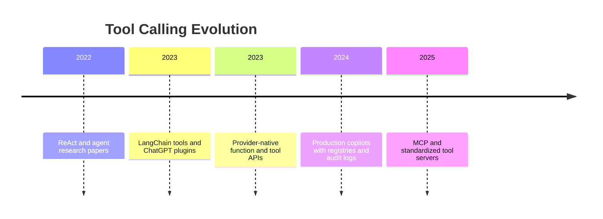

### Why the application must stay in control

History reinforced one lesson repeatedly: when models execute actions directly, mistakes scale quickly. Wrong database queries, accidental emails, and leaked secrets are application failures—not model quirks.

That is why mature systems keep execution in application code with validation, permissions, and logging. The model coordinates; the app governs.

### What this means for your learning path

Day 11 teaches the **pattern** before Day 12 teaches the **provider API**. Day 25 will expand into MCP-style standardized servers. Understanding today's registry-and-loop model makes those later abstractions feel natural instead of magical.

## Expanded Exercises

### Additional Medium

26. List five tools you would *not* expose to a student-facing assistant and explain why.
27. Design a `search_notes` tool description that helps the model choose it over `get_note`.
28. Explain how audit logs help after a user reports "the assistant deleted my note."
29. Compare tool calling to RAG retrieval—when does each win?

### Additional Hard

30. A model calls `search_notes` ten times per question. Propose three fixes at the prompt, schema, and application layers.
31. Design a circuit breaker that disables a failing tool after repeated errors.
32. Write acceptance criteria for a tool registry in a healthcare copilot.
33. Explain how you would test tool selection without a live model.

### Additional Challenge

34. Sketch an MCP server that exposes your capstone's `search_knowledge` tool to multiple clients.
35. Design a tool deprecation plan when renaming `create_ticket` to `open_support_case`.
36. Build a table comparing tool calling, function calling, and hard-coded routing for a billing FAQ bot.

## Summary

Tool calling turns a language model into a coordinator. The model understands intent and proposes structured actions; your application owns the registry, validates requests, enforces permissions, executes code, limits output size, and logs what happened.

The main lessons of this day:

- tools bridge language understanding and real-world data
- schemas and registries make behavior predictable
- the model → tool → model loop is the core execution pattern
- governance—permissions, auditing, human approval—is not optional for production

Day 10 taught structured outputs. Day 11 teaches structured actions. Day 12 will connect these ideas directly to function-calling APIs in OpenAI, Claude, and similar providers.

[Previous: Day 10 - Structured Outputs](../day_10/day_10_structured_outputs.md) | [Next: Day 12 - Function Calling](../day_12/day_12_function_calling.md)

## Further Reading

- https://platform.openai.com/docs/guides/function-calling
- https://docs.anthropic.com/en/docs/build-with-claude/tool-use
- https://modelcontextprotocol.io/
- https://platform.openai.com/docs/guides/tools
