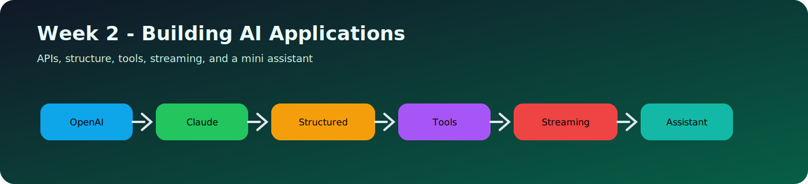
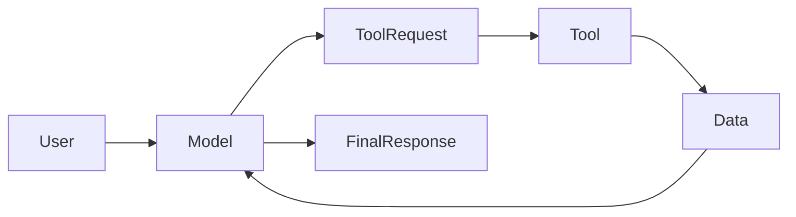

# Day 11 - Tool Calling

[Previous: Day 10 - Structured Outputs](../day_10/day_10_structured_outputs.md) | [Next: Day 12 - Function Calling](../day_12/day_12_function_calling.md)

## Introduction
Tool calling lets the model ask your application to use external capabilities such as search, calculators, calendars, or databases. This is the bridge between language understanding and real-world action.



## Learning Objectives
By the end of this day, you should be able to:

- explain why tools are needed
- describe the model-to-tool-to-model loop
- identify when a tool is better than pure text generation
- design a simple tool interface
- think about tool safety and permission boundaries

## Theory
A model is good at language, but it does not directly read your database or send calendar invites. Tools give the model a controlled way to request actions from your application.

A healthy tool system has clear inputs, clear outputs, and a strict contract. The app decides which tools exist and what they can access.

### Visual Diagram


## Code Examples

### Python
```python
def calculator(expression: str) -> str:
    return f"Result for {expression}"

print(calculator("2 + 2"))
```

### TypeScript
```typescript
function calculator(expression: string): string {
  return `Result for ${expression}`;
}

console.log(calculator('2 + 2'));
```

## Best Practices
- keep tool names descriptive
- validate every tool input
- make tool outputs small and predictable
- log tool use for debugging and audits
- restrict dangerous tools behind explicit policy checks

## Common Mistakes
- letting the model call anything it wants
- exposing sensitive data through a tool
- returning huge tool outputs to the model
- not checking tool parameters
- confusing tool calling with free-form reasoning

## Exercises
- Easy: Name three useful tools for an assistant.
- Medium: Design the input and output for a weather tool.
- Hard: Explain how you would prevent unsafe tool use.
- Challenge: Create a tool registry for a small app.

## Mini Project
Design a note assistant that can call a search tool to find matching notes before answering a question.

## Summary
Tool calling turns an LLM into a coordinator. The model decides when to ask for help, while the application controls what help is available.

[Previous: Day 10 - Structured Outputs](../day_10/day_10_structured_outputs.md) | [Next: Day 12 - Function Calling](../day_12/day_12_function_calling.md)

## Additional Resources
- https://platform.openai.com/docs/guides/function-calling
- https://docs.anthropic.com/en/docs/build-with-claude/tool-use
- https://modelcontextprotocol.io/
