# Day 12 - Function Calling

[Previous: Day 11 - Tool Calling](../day_11/day_11_tool_calling.md) | [Next: Day 13 - Streaming Responses](../day_13/day_13_streaming_responses.md)

## Introduction

Yesterday we learned the tool-calling pattern: the model proposes actions, and your application executes them. Today we go one layer deeper into **function-calling APIs**—the provider-specific contracts, schemas, validation rules, and execution loops that turn that pattern into production code.

Function calling is the structured interface where a language model returns a named operation plus JSON arguments instead of only natural language. OpenAI, Anthropic, Google, and other providers expose this through their APIs using tool or function definitions backed by JSON Schema. Your code defines what is allowed, validates what the model requests, runs the matching handler, and feeds results back into the conversation until the model produces a final answer.


Think of Day 11 as architecture and governance. Day 12 is implementation. You will learn how to write schemas the model can follow, how to validate and coerce arguments safely, how to handle errors and side effects, and how to run multi-turn function loops—including parallel calls—without losing control of your application.

This pattern appears in support copilots, billing assistants, merchant dashboards, and internal ops tools. Uber routes rider issues through structured lookups. Stripe exposes billing operations to agents with strict schemas. Shopify gives merchants tools to query inventory and orders. The lesson below teaches you how to build the same kind of system.

## Learning Objectives

By the end of this day, you should be able to:

- explain the difference between tool calling as a pattern (Day 11) and function-calling APIs on provider SDKs
- define OpenAI-compatible tool and function schemas with JSON Schema parameters
- validate and coerce model-generated arguments before execution
- execute functions safely with permissions, timeouts, and idempotency controls
- return function results to the conversation in the format providers expect
- implement multi-turn function loops with iteration limits
- handle side effects, errors, and partial failures without breaking the user experience
- use strict mode and required-field constraints to reduce invalid calls
- run parallel function calls when operations are independent
- design a support assistant with ticket status and escalation functions

## How to Use This Lesson

This lesson is designed for **all skill levels**. Pick one path and follow it consistently.

| Level | Suggested approach | Time |
| --- | --- | --- |
| **Beginner** | Read Introduction → Big Picture → Deep Theory → trace one code example → Easy exercises | 5–7 hours |
| **Intermediate** | Skim objectives → Visual Learning → Code Walkthrough → Medium/Hard exercises → Mini project | 3–5 hours |
| **Advanced** | Deep Theory tradeoffs → Hard/Challenge exercises → extend mini project → capstone slice | 2–3 hours |

### Apply Today
Complete at least one item before moving to the next day:
- [ ] Trace one code example in **Python or TypeScript** (one language is enough)
- [ ] Complete exercises for your level (see Exercises section)
- [ ] Update [`projects/CAPSTONE.md`](../../projects/CAPSTONE.md) with today's capstone item
- [ ] Add today's component to `projects/studyspark/` or update `projects/CAPSTONE.md`.

> **Stuck?** Re-read Big Picture, review Prerequisites, or see [SYLLABUS.md](../../SYLLABUS.md) for path guidance.

## Prerequisites

You should already understand:

- Day 11: Tool Calling
- Day 10: Structured Outputs
- basic Python or TypeScript syntax
- JSON and JSON Schema fundamentals
- how LLM chat APIs accept `messages` arrays

If the model-as-coordinator pattern feels unfamiliar, review Day 11 first. Function-calling APIs are the concrete implementation of that pattern.

## Big Picture

Function calling connects natural language intent to typed application operations.

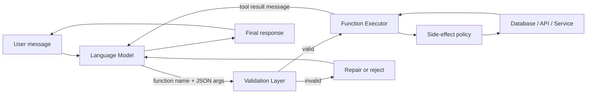

The important idea is this:

- the model chooses from a schema-defined menu
- your application validates every argument
- execution stays in your code, not in the model
- results return as structured messages the model can reason over
- the loop repeats until the model stops calling functions or a limit is reached

Without function calling, the model might describe actions in prose—and hallucinate parameters. With function calling, the request shape is known in advance, which makes automation safer and more reliable.

## Deep Theory

### Tool calling vs function-calling APIs

These terms overlap in conversation, but they are not the same thing in this course.

| Concept | What it is | Where it lives |
| --- | --- | --- |
| Tool calling (Day 11) | Architectural pattern: model coordinates, app executes | Your system design |
| Function calling (Day 12) | API feature: model returns structured call objects | Provider SDKs and response payloads |
| Tools / functions schema | Contract describing allowed operations | Your registry, sent with each request |
| Handler | Real code that performs the operation | Your backend |

Day 11 taught the loop, registry, permissions, and auditing mindset. Day 12 teaches how providers encode that loop in API requests and responses—and how your executor should behave under real-world constraints.

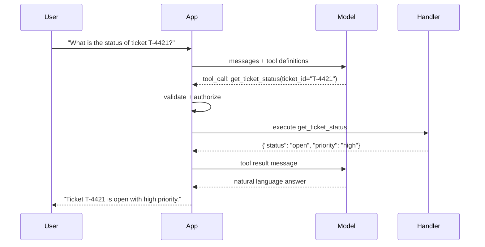

### OpenAI function and tool schema format

Modern OpenAI APIs use a `tools` array. Each entry has `type: "function"` and a nested `function` object. Older examples used a top-level `functions` parameter; the idea is the same—a named callable with a JSON Schema for parameters.

A minimal tool definition looks like this:

```json
{
  "type": "function",
  "function": {
    "name": "get_ticket_status",
    "description": "Look up the current status of a support ticket by ID.",
    "parameters": {
      "type": "object",
      "properties": {
        "ticket_id": {
          "type": "string",
          "description": "Ticket identifier such as T-4421"
        }
      },
      "required": ["ticket_id"],
      "additionalProperties": false
    }
  }
}
```

Key fields and why they matter:

| Field | Purpose |
| --- | --- |
| `name` | Stable identifier the model and your router both use |
| `description` | Helps the model decide when to call this function |
| `parameters` | JSON Schema describing allowed arguments |
| `required` | Forces the model to supply critical fields |
| `additionalProperties: false` | Blocks surprise keys the handler does not expect |

Descriptions are not documentation for humans only. They are selection signals for the model. Write them as instructions: what the function does, when to use it, and what each argument means.

### JSON Schema for parameters

JSON Schema is the contract between the model and your executor. A strong schema reduces invalid calls, improves routing accuracy, and makes validation code simpler.

Common types you will use:

| JSON Schema type | Typical use | Validation note |
| --- | --- | --- |
| `string` | IDs, names, queries | Add `enum` or `pattern` when possible |
| `integer` / `number` | counts, amounts | Set `minimum` and `maximum` |
| `boolean` | feature flags | Coerce carefully from strings |
| `array` | lists of IDs or tags | Define `items` schema |
| `object` | nested structures | Prefer flat args when possible |

Design principles:

- prefer one function per responsibility
- keep argument names explicit (`ticket_id`, not `id`)
- mark fields `required` when the handler cannot run without them
- use `enum` for bounded choices (`priority: low | medium | high`)
- avoid overly deep nesting—the model makes more mistakes in nested objects

### Strict mode

Strict mode (where supported) tells the provider to constrain the model so its tool arguments conform more tightly to your JSON Schema. In OpenAI's Responses API and newer chat models, `strict: true` on a function definition reduces malformed JSON and missing required fields.

Strict mode is not a substitute for server-side validation. It improves first-pass correctness; your application still validates before execution.

| Strict mode on | Strict mode off |
| --- | --- |
| Fewer schema violations from the model | More flexibility, more repair work |
| Better for automation pipelines | Better for exploratory prototypes |
| Pairs well with `additionalProperties: false` | May need looser schemas |

Use strict mode when:

- arguments feed billing, inventory, or ticket systems
- downstream code expects predictable keys and types
- failed validation is costly for user experience

### Argument validation

The model proposes arguments. Your application must validate them. Never trust model output as authoritative input to databases, payment systems, or messaging APIs.

A validation pipeline should check:

1. function name exists in the registry
2. arguments parse as JSON
3. arguments match JSON Schema
4. business rules pass (ownership, role, state)
5. side-effect policies pass (approval, idempotency, rate limits)

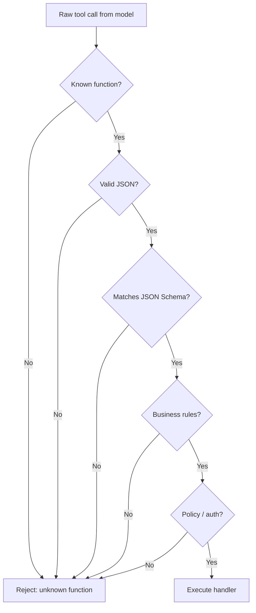

Validation failures should become tool result messages the model can read—not silent crashes. That lets the model apologize, ask the user for a corrected value, or choose a different function.

### Type coercion

Models sometimes return `"5"` when you expected `5`, or `"true"` when you expected a boolean. Type coercion converts values into the types your handlers expect—after schema validation, with explicit rules.

| Incoming value | Target type | Safe coercion rule |
| --- | --- | --- |
| `"42"` | integer | Parse digits; reject non-numeric |
| `"3.14"` | number | Parse float; reject NaN |
| `"true"` / `"false"` | boolean | Accept only those literals |
| `" T-4421 "` | string | Strip whitespace |
| `["a", "b"]` | list of strings | Validate each item |

Coercion is helpful but dangerous when overused. Prefer strict schemas and clear errors. Coerce only for harmless normalization—trimming strings, parsing well-bounded numbers—not for silently fixing semantically wrong values.

### Executing functions safely

Execution is where the real world meets the model. Safe execution means:

- **authorization**: the current user may call this function with these arguments
- **timeouts**: slow APIs do not hang the conversation loop
- **sandboxing**: handlers cannot reach resources outside their scope
- **logging**: record function name, latency, status—not always raw PII
- **rate limiting**: prevent abuse of expensive or sensitive operations

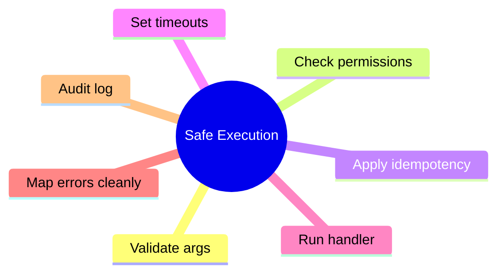

Read-only lookups (`get_ticket_status`) and write operations (`escalate_ticket`) should not share the same trust level. Tag functions by risk class and enforce policy in code, not in prompts.

### Returning results to the conversation

After execution, append a tool result message to the conversation history. The model reads that result on the next turn and synthesizes a user-facing answer.

Provider-shaped message flow:

```text
user:       "Escalate ticket T-4421, the rider has been waiting 40 minutes."
assistant:  tool_calls=[escalate_ticket(ticket_id="T-4421", reason="long wait")]
tool:       {"status": "escalated", "new_priority": "urgent", "sla_deadline": "..."}
assistant:  "I escalated ticket T-4421 to urgent priority. SLA deadline is in 15 minutes."
```

Return concise, structured results:

- include fields the model needs to answer (`status`, `deadline`, `error_code`)
- omit huge raw payloads
- use consistent keys across functions
- stringify JSON for providers that expect string `content` on tool messages

### Multi-turn function loops

Most real tasks require more than one function call. A billing question might call `get_invoice`, then `get_payment_attempts`, then answer. Your executor runs a loop:

1. send messages and tool definitions to the model
2. if the model returns tool calls, validate and execute each
3. append tool results to messages
4. call the model again
5. stop when the model returns text only, or when `max_iterations` is reached

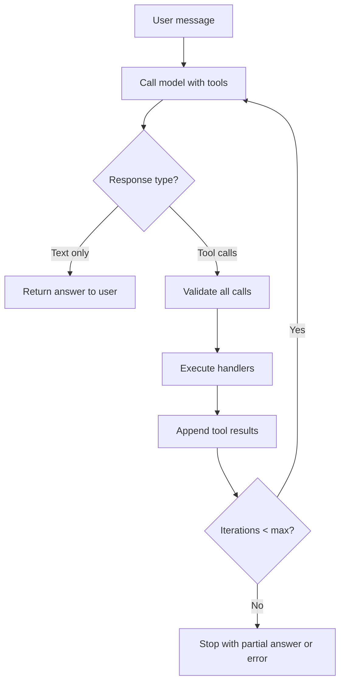

Always cap iterations. Uncapped loops waste tokens, increase latency, and can spiral when the model keeps calling the wrong function.

### Parallel function calls

When the model requests multiple independent reads—ticket status and rider profile, or three invoice lookups—you can execute them in parallel to reduce latency.

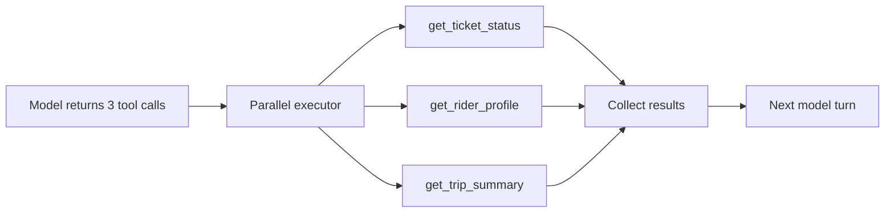

Rules for parallel execution:

- parallelize **independent reads** freely
- run **dependent steps** sequentially (`get_order` before `refund_order`)
- never parallelize conflicting writes without idempotency controls
- preserve tool call IDs so results map back correctly
- fail gracefully: one handler error should not drop unrelated results

### Idempotency

Side-effecting functions—escalations, refunds, sends—must be safe to retry. Networks fail. Models repeat requests. Users double-submit. Idempotency ensures the same logical action does not happen twice.

Patterns:

- accept an `idempotency_key` argument or generate one from `(user_id, function, canonical_args)`
- store keys with execution outcomes in a short-TTL cache or database
- return the original result on duplicate keys instead of re-running the effect

| Function type | Idempotency strategy |
| --- | --- |
| Read lookup | Naturally idempotent |
| Create resource | Client-supplied or server-generated idempotency key |
| Update status | Check current state; no-op if already applied |
| Send notification | Dedupe by key or hash of payload |

### Side effects

Functions fall on a spectrum from safe reads to dangerous writes.

| Class | Examples | Controls |
| --- | --- | --- |
| Read | `get_ticket_status`, `search_orders` | Scope to user tenant |
| Write | `escalate_ticket`, `update_email` | Role check, confirm, audit |
| External | `send_sms`, `charge_card` | Human approval, idempotency |
| Irreversible | `delete_account`, `issue_refund` | Strong approval and logging |

The model should not be the authority on whether a side effect is allowed. Your executor enforces policy before any handler runs.

### Error propagation

Errors are part of the contract. Handlers will fail—ticket not found, permission denied, upstream timeout. Propagate errors as structured tool results so the model can respond helpfully.

Recommended error shape:

```json
{
  "ok": false,
  "error_code": "TICKET_NOT_FOUND",
  "message": "No ticket found with ID T-9999 for this account.",
  "retryable": false
}
```

| Error type | Model-facing message | User experience |
| --- | --- | --- |
| Validation | `INVALID_ARGUMENT` | Ask for corrected input |
| Auth | `FORBIDDEN` | Explain permission limitation |
| Not found | `NOT_FOUND` | Clarify ID or scope |
| Upstream timeout | `TIMEOUT`, `retryable: true` | Offer retry or apology |
| Rate limit | `RATE_LIMITED` | Ask user to wait |

Do not dump stack traces into tool results. Log details server-side; return safe summaries to the model.

## Visual Learning

### Day 11 pattern vs Day 12 API layer

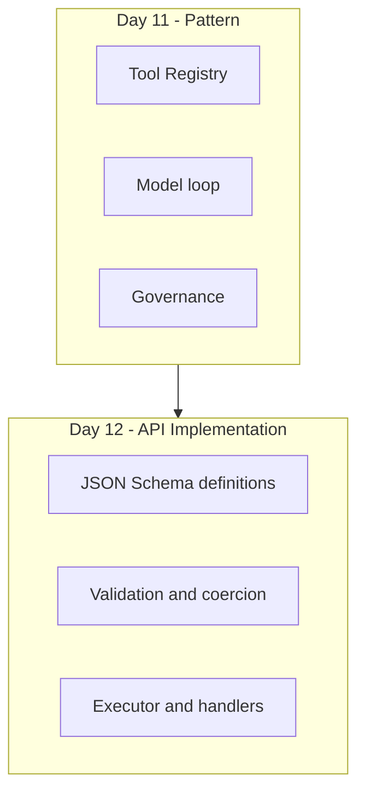

### Strict vs loose schema outcomes

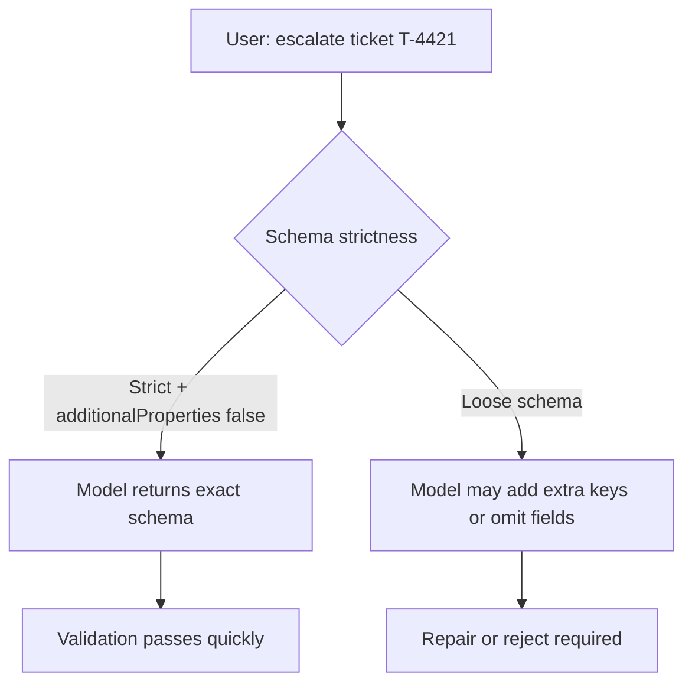

### Write path with approval gate

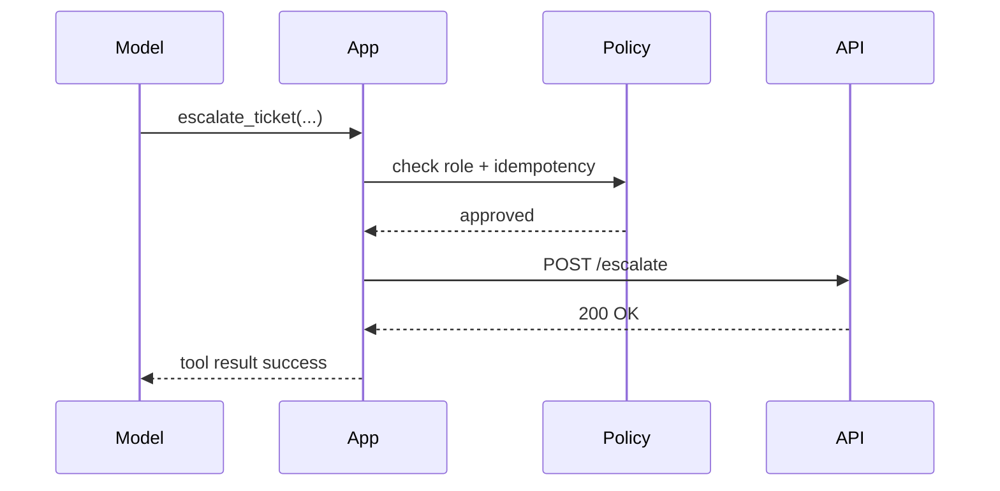

### Error propagation flow

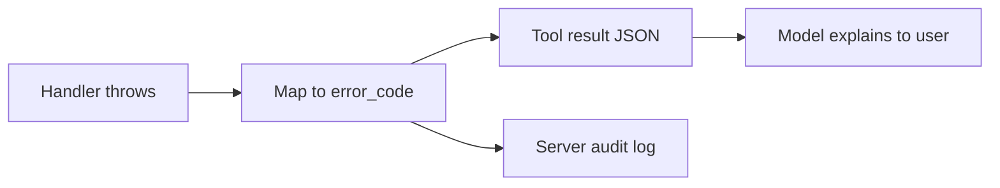

## Code Walkthrough

The examples below are intentionally explicit. The goal is to show each moving part of a function-calling executor—not hide them inside a framework.

### Python Example: Tool schema definitions

```python
TOOLS = [
    {
        "type": "function",
        "function": {
            "name": "get_ticket_status",
            "description": "Look up a support ticket status by ticket ID.",
            "parameters": {
                "type": "object",
                "properties": {
                    "ticket_id": {
                        "type": "string",
                        "description": "Ticket ID like T-4421",
                    }
                },
                "required": ["ticket_id"],
                "additionalProperties": False,
            },
        },
    },
    {
        "type": "function",
        "function": {
            "name": "escalate_ticket",
            "description": "Escalate an urgent support ticket to a higher priority.",
            "parameters": {
                "type": "object",
                "properties": {
                    "ticket_id": {"type": "string"},
                    "reason": {"type": "string"},
                    "idempotency_key": {"type": "string"},
                },
                "required": ["ticket_id", "reason", "idempotency_key"],
                "additionalProperties": False,
            },
        },
    },
]
```

#### Code Explanation

- `TOOLS` is the registry sent to the provider on each model call.
- each entry uses `type: "function"` per OpenAI-compatible APIs.
- `description` helps the model choose between lookup and escalation.
- `required` lists arguments your handler cannot infer.
- `additionalProperties: False` rejects surprise keys during validation.

### TypeScript Example: Strict function schema

```typescript
type ToolDefinition = {
  type: 'function';
  function: {
    name: string;
    description: string;
    strict?: boolean;
    parameters: {
      type: 'object';
      properties: Record<string, unknown>;
      required: string[];
      additionalProperties: false;
    };
  };
};

const getTicketStatusTool: ToolDefinition = {
  type: 'function',
  function: {
    name: 'get_ticket_status',
    description: 'Look up a support ticket status by ticket ID.',
    strict: true,
    parameters: {
      type: 'object',
      properties: {
        ticket_id: {
          type: 'string',
          description: 'Ticket ID like T-4421',
        },
      },
      required: ['ticket_id'],
      additionalProperties: false,
    },
  },
};
```

#### Code Explanation

- `ToolDefinition` encodes the provider tool shape in TypeScript.
- `strict: true` requests tighter schema adherence from supported models.
- `additionalProperties: false` pairs with strict mode for predictable args.
- `ticket_id` includes a description the model uses when filling arguments.

### Python Example: JSON Schema validation

```python
import json
from jsonschema import Draft202012Validator


def validate_arguments(schema, arguments):
    """Validate tool arguments against a JSON Schema."""
    if isinstance(arguments, str):
        arguments = json.loads(arguments)

    validator = Draft202012Validator(schema)
    errors = sorted(validator.iter_errors(arguments), key=lambda e: e.path)

    if errors:
        messages = [error.message for error in errors]
        raise ValueError("; ".join(messages))

    return arguments
```

#### Code Explanation

- `json.loads` handles providers that return argument strings.
- `Draft202012Validator` checks types, required fields, and constraints.
- `iter_errors` collects all violations instead of failing on the first.
- raised `ValueError` becomes a validation failure you map to tool results.

### Python Example: Type coercion helpers

```python
def coerce_string(value):
    if value is None:
        raise ValueError("Expected string, got null")
    return str(value).strip()


def coerce_integer(value):
    if isinstance(value, bool):
        raise ValueError("Boolean is not an integer")
    return int(value)


def normalize_arguments(raw_args):
    return {
        "ticket_id": coerce_string(raw_args["ticket_id"]),
        "limit": coerce_integer(raw_args.get("limit", 5)),
    }
```

#### Code Explanation

- `coerce_string` trims whitespace the model often adds around IDs.
- `coerce_integer` rejects booleans because `bool` subclasses `int` in Python.
- `normalize_arguments` applies coercion after schema validation.
- defaults like `limit: 5` keep handlers simple when args are optional.

### Python Example: Handler registry

```python
def get_ticket_status(ticket_id, user_context):
    ticket = user_context["ticket_store"].get(ticket_id)
    if ticket is None:
        return {"ok": False, "error_code": "NOT_FOUND", "message": "Ticket not found"}
    return {"ok": True, "status": ticket["status"], "priority": ticket["priority"]}


def escalate_ticket(ticket_id, reason, idempotency_key, user_context):
    store = user_context["ticket_store"]
    if idempotency_key in user_context["idempotency_cache"]:
        return user_context["idempotency_cache"][idempotency_key]

    ticket = store.get(ticket_id)
    if ticket is None:
        return {"ok": False, "error_code": "NOT_FOUND", "message": "Ticket not found"}

    ticket["priority"] = "urgent"
    result = {"ok": True, "status": "escalated", "ticket_id": ticket_id}
    user_context["idempotency_cache"][idempotency_key] = result
    return result


HANDLERS = {
    "get_ticket_status": get_ticket_status,
    "escalate_ticket": escalate_ticket,
}
```

#### Code Explanation

- `get_ticket_status` is a read handler returning structured JSON.
- `escalate_ticket` mutates state and requires idempotency protection.
- `idempotency_cache` returns the prior result on duplicate keys.
- `HANDLERS` maps function names to Python callables for routing.

### Python Example: Safe execution wrapper

```python
def execute_function(name, arguments, user_context):
    if name not in HANDLERS:
        return {"ok": False, "error_code": "UNKNOWN_FUNCTION", "message": name}

    schema = next(
        t["function"]["parameters"]
        for t in TOOLS
        if t["function"]["name"] == name
    )

    try:
        clean_args = validate_arguments(schema, arguments)
        if name == "escalate_ticket" and "admin" not in user_context["roles"]:
            return {"ok": False, "error_code": "FORBIDDEN", "message": "Not allowed"}
        return HANDLERS[name](**clean_args, user_context=user_context)
    except ValueError as error:
        return {"ok": False, "error_code": "INVALID_ARGUMENT", "message": str(error)}
    except TimeoutError:
        return {"ok": False, "error_code": "TIMEOUT", "message": "Upstream timeout", "retryable": True}
```

#### Code Explanation

- unknown `name` values never reach handler code.
- schema lookup ties validation to the registered tool definition.
- role checks run after validation and before side effects.
- exceptions map to stable `error_code` values the model can interpret.

### Python Example: Returning tool results to the model

```python
import json


def build_tool_result(tool_call_id, name, result):
    return {
        "role": "tool",
        "tool_call_id": tool_call_id,
        "name": name,
        "content": json.dumps(result),
    }


tool_message = build_tool_result(
    tool_call_id="call_abc123",
    name="get_ticket_status",
    result={"ok": True, "status": "open", "priority": "high"},
)
```

#### Code Explanation

- `tool_call_id` links the result to the model's outgoing tool call.
- `role: "tool"` matches provider message format expectations.
- `content` is JSON text so the model can parse fields reliably.
- including `ok` gives the model a simple success signal.

### Python Example: Multi-turn function loop

```python
MAX_ITERATIONS = 5


def run_function_loop(client, messages, user_context):
    for _ in range(MAX_ITERATIONS):
        response = client.chat.completions.create(
            model="gpt-4.1-mini",
            messages=messages,
            tools=TOOLS,
        )
        assistant_message = response.choices[0].message
        messages.append(assistant_message)

        if not assistant_message.tool_calls:
            return assistant_message.content

        for tool_call in assistant_message.tool_calls:
            result = execute_function(
                name=tool_call.function.name,
                arguments=tool_call.function.arguments,
                user_context=user_context,
            )
            messages.append(
                build_tool_result(tool_call.id, tool_call.function.name, result)
            )

    return "I could not finish within the allowed number of function steps."
```

#### Code Explanation

- `MAX_ITERATIONS` prevents runaway loops and unbounded cost.
- each model response is appended to `messages` to preserve history.
- text-only responses end the loop and return the final answer.
- every tool call produces one tool result message before the next model turn.

### Python Example: Parallel read execution

```python
from concurrent.futures import ThreadPoolExecutor


def execute_tool_calls_parallel(tool_calls, user_context):
    def run_one(tool_call):
        return build_tool_result(
            tool_call.id,
            tool_call.function.name,
            execute_function(
                tool_call.function.name,
                tool_call.function.arguments,
                user_context,
            ),
        )

    with ThreadPoolExecutor(max_workers=4) as pool:
        return list(pool.map(run_one, tool_calls))
```

#### Code Explanation

- `ThreadPoolExecutor` runs independent read handlers concurrently.
- `run_one` keeps validation and execution inside the same code path.
- `max_workers=4` caps parallelism to protect downstream APIs.
- results preserve `tool_call_id` so the model maps answers correctly.

### TypeScript Example: Argument validation with Zod

```typescript
import { z } from 'zod';

const GetTicketStatusSchema = z.object({
  ticket_id: z.string().trim().min(1),
});

const EscalateTicketSchema = z.object({
  ticket_id: z.string().trim().min(1),
  reason: z.string().trim().min(3),
  idempotency_key: z.string().trim().min(8),
});

function validateToolArgs<T>(schema: z.ZodSchema<T>, raw: unknown): T {
  return schema.parse(raw);
}
```

#### Code Explanation

- Zod schemas mirror JSON Schema constraints in application code.
- `.trim().min(1)` normalizes and rejects empty ticket IDs.
- separate schemas per function keep validation focused and testable.
- `parse` throws on failure; catch at the executor boundary and map to tool errors.

### TypeScript Example: Function loop with typed messages

```typescript
type ToolCall = {
  id: string;
  function: { name: string; arguments: string };
};

async function runLoop(
  callModel: (messages: unknown[]) => Promise<{ content?: string; toolCalls?: ToolCall[] }>,
  messages: unknown[],
  ctx: RequestContext,
): Promise<string> {
  const maxIterations = 5;

  for (let step = 0; step < maxIterations; step += 1) {
    const response = await callModel(messages);

    if (!response.toolCalls?.length) {
      return response.content ?? 'No response generated.';
    }

    for (const toolCall of response.toolCalls) {
      const args = JSON.parse(toolCall.function.arguments);
      const result = await dispatchFunction(toolCall.function.name, args, ctx);
      messages.push({
        role: 'tool',
        tool_call_id: toolCall.id,
        name: toolCall.function.name,
        content: JSON.stringify(result),
      });
    }
  }

  return 'Function loop limit reached.';
}
```

#### Code Explanation

- `callModel` abstracts the provider SDK for easier testing.
- early return on text-only responses ends the loop cleanly.
- `JSON.parse` converts argument strings into objects for validation.
- `dispatchFunction` centralizes auth, validation, and handler routing.

### TypeScript Example: Parallel calls with Promise.all

```typescript
async function executeParallelToolCalls(toolCalls: ToolCall[], ctx: RequestContext) {
  return Promise.all(
    toolCalls.map(async (toolCall) => {
      const args = JSON.parse(toolCall.function.arguments);
      const result = await dispatchFunction(toolCall.function.name, args, ctx);

      return {
        role: 'tool',
        tool_call_id: toolCall.id,
        name: toolCall.function.name,
        content: JSON.stringify(result),
      };
    }),
  );
}
```

#### Code Explanation

- `Promise.all` waits for every independent read to finish.
- each mapped task returns a provider-shaped tool message.
- failures should be caught inside `dispatchFunction` and returned as structured errors.
- use parallel execution only when calls do not depend on each other's writes.

### Python Example: Mock model response for tests

```python
mock_assistant_message = {
    "role": "assistant",
    "tool_calls": [
        {
            "id": "call_test_1",
            "type": "function",
            "function": {
                "name": "get_ticket_status",
                "arguments": '{"ticket_id": "T-4421"}',
            },
        }
    ],
}
```

#### Code Explanation

- mock payloads let you test the executor without live API calls.
- argument strings mirror real provider responses.
- keep IDs stable so tool result mapping tests stay deterministic.
- unit-test validation, auth, and idempotency before integrating the model.

## Case Studies

### Uber support: trip and ticket lookups

Uber's support stack must connect rider chat to real trip state—driver location, wait time, fare adjustments. Function calling gives the model a narrow interface:

- `get_trip_status(trip_id)`
- `get_support_ticket(ticket_id)`
- `escalate_to_live_agent(ticket_id, reason, idempotency_key)`

Why function calling fits:

- IDs and enums map cleanly to JSON Schema
- reads can run in parallel (`trip` + `rider profile`)
- escalations are side effects guarded by idempotency and policy
- errors like `TRIP_NOT_FOUND` return structured tool results instead of hallucinated trip data

Lesson for your projects: support assistants fail when the model guesses state. Function calling forces live lookups.

### Stripe billing ops: invoices, payments, refunds

Stripe's dashboard and agent tooling expose billing operations where precision matters. A billing copilot might call:

- `get_invoice(invoice_id)`
- `list_payment_attempts(invoice_id)`
- `create_refund(charge_id, amount, idempotency_key)`

Why strict schemas matter here:

- amounts must be numbers with bounds, not free-form strings
- currency and customer IDs must match patterns
- refunds are irreversible side effects—idempotency keys are mandatory
- validation failures should not partially execute money movement

Lesson: financial functions need strict mode, strong validation, and explicit error codes—not prose apologies alone.

### Shopify merchant tools: inventory and orders

Shopify merchant assistants help store owners check inventory, update listings, and review orders during high-pressure sales events. Typical functions:

- `get_product_inventory(product_id)`
- `list_unfulfilled_orders(limit)`
- `set_inventory_level(variant_id, quantity, idempotency_key)`

Why parallel calls help:

- a merchant asking "What is low stock and do I have urgent orders?" triggers two independent reads
- parallel execution keeps chat responsive during peak traffic
- writes like inventory updates need per-shop authorization and idempotency

Lesson: match execution strategy to business risk—parallelize reads, serialize and guard writes.

## Comparison Tables

### Tool calling pattern vs function-calling API

| Layer | Day 11 focus | Day 12 focus |
| --- | --- | --- |
| Concept | Coordinator pattern | Provider schemas and payloads |
| Contract | Registry design | JSON Schema parameters |
| Execution | Governance mindset | Validation, coercion, handlers |
| Loop | Architectural | Implemented with SDK messages |
| Risk | Permissions model | Idempotency and error codes |

### Function risk classes

| Class | Example | Validation | Idempotency | Parallel OK? |
| --- | --- | --- | --- | --- |
| Read | `get_ticket_status` | Schema + scope | Not required | Yes |
| Derived read | `search_tickets` | Schema + query limits | Not required | Yes |
| State change | `escalate_ticket` | Schema + role | Required | No |
| External | `send_email` | Schema + approval | Required | No |
| Financial | `issue_refund` | Strict schema + limits | Required | No |

### Validation failure handling

| Strategy | When to use | Tradeoff |
| --- | --- | --- |
| Return error tool result | Default | Model can recover conversationally |
| Auto-repair args | Low-risk coercions only | Can hide real bugs |
| Reject call entirely | Unknown functions | Safer, may feel abrupt |
| Ask user | Auth or missing ID | Slower, more accurate |

### Strict mode vs manual repair

| Approach | Pros | Cons |
| --- | --- | --- |
| Strict mode on | Fewer invalid args | Less tolerant of edge models |
| Manual repair | Flexible | More executor complexity |
| Both combined | Best production reliability | Requires disciplined schemas |

### Sequential vs parallel execution

| Scenario | Pattern | Reason |
| --- | --- | --- |
| Two lookups before answer | Parallel | Independent reads |
| Refund after fetching charge | Sequential | Second needs first result |
| Two writes to same record | Sequential | Avoid race conditions |
| Search then summarize | Sequential | Summary depends on search |

## Best Practices

- define one function per clear responsibility
- write descriptions for model selection, not only developer docs
- use JSON Schema `required`, `enum`, and `additionalProperties: false`
- enable strict mode for high-stakes automation when the provider supports it
- validate in application code even when strict mode is on
- coerce only for safe normalization, not semantic guessing
- cap function loop iterations and handler timeouts
- use idempotency keys for every side-effecting function
- return small structured tool results, not raw database rows
- log audit events server-side with redacted sensitive fields
- test handlers without the model before testing full loops
- parallelize independent reads, serialize dependent or conflicting writes

## Common Mistakes

- treating Day 11 governance as optional because strict mode is enabled
- one mega-function that does search, update, and delete
- trusting model-generated user IDs or tenant IDs without scope checks
- returning huge JSON blobs that blow the context window
- no iteration limit on the function loop
- parallelizing writes that mutate the same resource
- skipping idempotency on "small" side effects like escalation emails
- passing stack traces or SQL errors to the model as tool content
- confusing tool calling pattern with autonomous agent authority
- defining schemas that are too nested for reliable model filling

### Debugging strategy

When function calling misbehaves, check in this order:

1. Is the function name and description specific enough for selection?
2. Is the JSON Schema too loose or too strict?
3. Are validation errors returned as tool messages the model can read?
4. Is the handler result small and structured?
5. Is the model looping because results omit fields it needs?
6. Are write functions missing idempotency or permission checks?
7. Did parallel execution introduce race conditions on shared state?

## Exercises

### Easy

1. Define function calling in one sentence.
2. What is the difference between Day 11 tool calling and Day 12 function-calling APIs?
3. Name the four key fields inside an OpenAI `function` tool definition.
4. Why should `additionalProperties` be `false` in production schemas?
5. Who executes the function—the model or the application?

### Medium

6. Write a JSON Schema for `get_weather(city, units?)`.
7. Explain why validation must happen after the model proposes arguments.
8. Give two safe type coercions and one unsafe coercion example.
9. What is an idempotency key and when is it required?
10. Draw the multi-turn function loop from memory.

### Hard

11. Design schemas for `get_ticket_status` and `escalate_ticket` with strict constraints.
12. Implement error propagation for `NOT_FOUND`, `FORBIDDEN`, and `TIMEOUT`.
13. Explain when parallel function calls are safe and when they are not.
14. Write a policy table mapping roles to function permissions.
15. How would you test a function loop without calling a live model?

### Challenge

16. Build a mock executor that handles validation, auth, and idempotency.
17. Add parallel execution for two read functions in the same loop.
18. Design strict schemas for a Stripe-style `create_refund` function.
19. Create an audit log format for function calls with redaction rules.
20. Implement repair logic that only normalizes whitespace and bounded integers.

### Reflection

21. Where should function execution refuse the model even after a valid tool call?
22. What makes a function description good enough for reliable routing?
23. When does strict mode help—and when does it frustrate development?
24. How is returning structured errors different from returning plain text failures?
25. What would you inspect first if users report duplicate escalations?

## Mini Project

Build a support assistant called **SupportDesk** that uses function calling for ticket operations.

### Goal

Create a small assistant that answers support questions by calling real functions for ticket status lookup and urgent escalation—without letting the model invent ticket state.

### Features

- in-memory ticket store seeded with sample tickets
- `get_ticket_status(ticket_id)` read function
- `escalate_ticket(ticket_id, reason, idempotency_key)` write function
- JSON Schema tool definitions with `additionalProperties: false`
- argument validation before handler execution
- role-based permission check on escalation
- idempotency cache for escalation requests
- multi-turn function loop with `max_iterations = 5`
- structured error results for not-found and forbidden cases
- optional parallel reads if you add a second lookup function (e.g., `get_customer_profile`)

### Suggested Folder Structure

```text
supportdesk/
├── app/
│   ├── schemas.py
│   ├── handlers.py
│   ├── validator.py
│   ├── executor.py
│   ├── loop.py
│   └── main.py
├── data/
│   └── sample_tickets.json
├── tests/
│   ├── test_validation.py
│   ├── test_idempotency.py
│   └── test_loop.py
└── README.md
```

### Project Steps

1. define tool schemas for both functions
2. implement handlers against `sample_tickets.json`
3. validate arguments with JSON Schema or Zod
4. block escalation for non-admin roles
5. store idempotency results for repeated escalation keys
6. build the function loop that appends tool results to messages
7. test with mock assistant tool-call payloads
8. try prompts like "Status of T-1001" and "Escalate T-1001, rider waiting 45 minutes"

### What You Learn

- how function schemas connect to real handlers
- why validation and idempotency belong in the executor
- how tool results shape the model's final answer
- how to structure a support copilot you can extend on Day 13 and beyond

## Interview Questions

### Conceptual

- What is the difference between tool calling and function calling in provider APIs?
- Why validate arguments if the model already returned JSON?
- What is strict mode and what does it not replace?
- Explain idempotency in the context of LLM-driven side effects.
- How should errors be returned to the model?

### System Design

- Design function schemas for a ride-support assistant with lookup and escalation.
- How would you add human approval to a `issue_refund` function?
- Design parallel execution rules for a merchant inventory assistant.
- How would you audit function calls in a multi-tenant SaaS product?
- Design an idempotency strategy for email-sending functions.

### Debugging

- The model never calls your functions. What do you check?
- The model calls the right function with invalid IDs repeatedly. What do you change?
- Duplicate escalations appear in logs. Where is the bug?
- Tool results are correct but the final answer is wrong. What layer failed?
- Parallel reads sometimes return stale data. What happened?

## Quizzes

### Quiz 1

1. What JSON object type wraps OpenAI tool definitions in modern APIs?
2. Which field tells the model when to select a function?
3. Why set `additionalProperties` to `false`?
4. Who runs the actual Python or TypeScript handler?

### Quiz 2

1. What is strict mode designed to improve?
2. Name two safe type coercions.
3. What message role carries execution results back to the model?
4. Why cap multi-turn function loops?

### Quiz 3

1. When should you execute function calls in parallel?
2. What is an idempotency key used for?
3. How should handler timeouts appear to the model?
4. Name one read function and one write function from the SupportDesk project.

## Quiz Answer Key

### Quiz 1 Answers

1. A `tools` array with entries of `type: "function"`.
2. The function `description` (and to a lesser extent the name and parameter descriptions).
3. To block unexpected argument keys the handler did not define.
4. The application executes handlers; the model only proposes calls.

### Quiz 2 Answers

1. Conformance of model-generated arguments to your JSON Schema.
2. Trimming whitespace on strings; parsing bounded numeric strings to integers.
3. The `tool` role (with `tool_call_id` linking back to the call).
4. To prevent runaway cost, latency, and infinite retry loops.

### Quiz 3 Answers

1. When calls are independent reads with no conflicting writes.
2. To ensure retried or duplicate requests do not repeat side effects.
3. As a structured tool error such as `TIMEOUT` with `retryable: true`.
4. Examples: `get_ticket_status` (read) and `escalate_ticket` (write).

## Cumulative Capstone Update

Your capstone should now include **two function-calling flows** wired through a real executor—not just tool definitions on paper. Day 11 gave you the registry mindset; Day 12 connects it to provider schemas, validation, and safe execution.

Add these items to your capstone plan:

- two function definitions with JSON Schema parameters and `additionalProperties: false`
- one **read flow** (e.g., `search_knowledge` or `get_item_status`) safe for parallel execution
- one **write or escalate flow** (e.g., `save_feedback`, `create_ticket`, or `escalate_issue`) with role checks and idempotency keys
- a `validate_arguments` step before every handler runs
- structured tool error objects (`ok`, `error_code`, `message`, optional `retryable`)
- a function loop with configurable `max_iterations` and handler timeouts
- tool result messages appended with correct `tool_call_id` linkage
- audit logging for function name, latency, status, and redacted arguments
- tests using mock tool-call payloads without a live model

Example capstone function pairs:

| Flow | Function | Type | Controls |
| --- | --- | --- | --- |
| Read | `search_project_knowledge` | Read | Scope filter, output truncation |
| Write | `create_follow_up_ticket` | Write | Idempotency key, role gate |

This turns the capstone from a coordinator sketch into an application that can look up real project state and take bounded actions with provider-grade function calling.

## Historical Background

"Function calling" as a product feature name is newer than the underlying idea. Engineers always needed models to trigger code—they first tried to parse natural language into commands, with unreliable results.

### From brittle parsing to provider-native schemas

Before function calling APIs, teams used regex, slot filling, or fine-tuned classifiers to map user text to actions. These systems were rigid and expensive to maintain.

Provider-native function calling changed the contract: the model returns **machine-readable tool name + arguments** aligned to a JSON Schema. Your code executes. The model never touches your database driver directly.

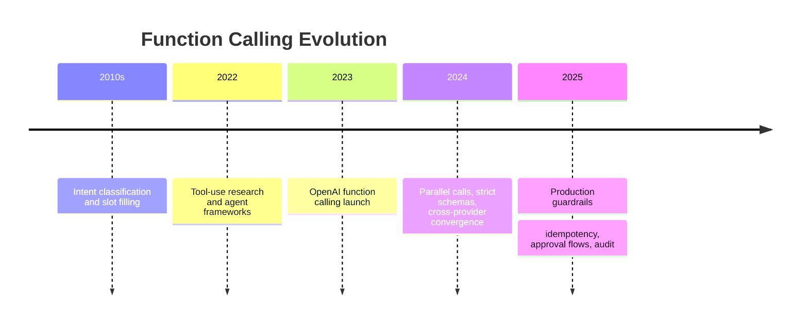

### Relationship to Day 11

Day 11 taught the coordinator pattern and registry thinking. Day 12 wires that thinking into **concrete API payloads** you will recognize in OpenAI and Anthropic documentation. If Day 11 is architecture, Day 12 is implementation.

## Summary

Function calling makes model actions explicit, typed, and executable by your application. Day 11 taught the coordinator pattern; Day 12 taught the API contracts and executor discipline that make the pattern reliable in production.

The main lessons of this day:

- tool calling is the architecture; function calling is the provider-facing implementation
- JSON Schema defines what the model may request; your code defines what actually runs
- validation, coercion, idempotency, and error propagation are not optional extras
- multi-turn loops and parallel reads need limits, linkage, and risk-aware execution
- support, billing, and merchant systems all depend on the same safe function executor pattern

Day 11 taught structured actions. Day 12 taught how to implement them. Day 13 will add streaming so users see responses while function loops still run behind the scenes.

[Previous: Day 11 - Tool Calling](../day_11/day_11_tool_calling.md) | [Next: Day 13 - Streaming Responses](../day_13/day_13_streaming_responses.md)

## Further Reading

- https://platform.openai.com/docs/guides/function-calling
- https://platform.openai.com/docs/guides/tools
- https://docs.anthropic.com/en/docs/build-with-claude/tool-use
- https://json-schema.org/
- https://json-schema.org/understanding-json-schema/
