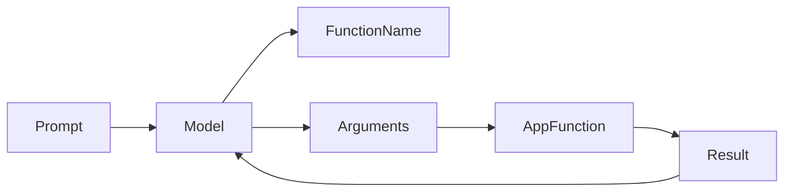

# Day 12 - Function Calling

[Previous: Day 11 - Tool Calling](../day_11/day_11_tool_calling.md) | [Next: Day 13 - Streaming Responses](../day_13/day_13_streaming_responses.md)

## Introduction
Function calling is a structured way for the model to select a named function with arguments instead of producing only natural language. It is especially useful when the app needs exact actions.


## Learning Objectives
By the end of this day, you should be able to:

- explain the difference between a message and a function call
- define a function schema for the model
- validate arguments before execution
- return function results back into the conversation
- use functions to connect the model to your application logic

## Theory
Function calling gives the model a menu of allowed operations. The model chooses one function and supplies arguments. Your code executes the function and returns the result.

This design is safer than asking the model to invent actions in plain text because the shape of the request is known in advance.

### Visual Diagram


## Code Examples

### Python
```python
def get_order_status(order_id: str) -> str:
    return f"Order {order_id} is being prepared."

print(get_order_status("A-1024"))
```

### TypeScript
```typescript
function getOrderStatus(orderId: string): string {
  return `Order ${orderId} is being prepared.`;
}

console.log(getOrderStatus('A-1024'));
```

## Best Practices
- define one function per responsibility
- keep argument names simple and explicit
- validate types before execution
- return concise results to the model
- keep side-effecting functions heavily guarded

## Common Mistakes
- making functions too broad
- trusting model-generated arguments without checks
- using function calling for tasks that do not need structure
- returning raw database dumps
- mixing execution logic with prompt text

## Exercises
- Easy: Define a function for checking the weather.
- Medium: Explain why argument validation matters.
- Hard: Design a function schema for booking a meeting.
- Challenge: Write a policy for functions that can change data.

## Mini Project
Create a function-calling design for a support assistant that can fetch ticket status and escalate urgent issues.

## Summary
Function calling makes model action explicit and controlled. The application keeps authority over execution while the model supplies intent and arguments.

[Previous: Day 11 - Tool Calling](../day_11/day_11_tool_calling.md) | [Next: Day 13 - Streaming Responses](../day_13/day_13_streaming_responses.md)

## Additional Resources
- https://platform.openai.com/docs/guides/function-calling
- https://docs.anthropic.com/en/docs/build-with-claude/tool-use
- https://json-schema.org/
