# Day 13 - Streaming Responses

[Previous: Day 12 - Function Calling](../day_12/day_12_function_calling.md) | [Next: Day 14 - Mini AI Assistant](../day_14/day_14_mini_ai_assistant.md)

## Introduction
Yesterday we learned how models can call functions with structured arguments. Today we focus on a different engineering problem: how the answer reaches the user. Most modern AI products do not wait for the full response before showing anything. They stream output token by token, creating the familiar typing effect you see in ChatGPT, Claude, and Cursor.

Streaming does not make the model smarter. It changes delivery. That change sounds simple, but it affects latency perception, UI state, error handling, cancellation, tool use, and how you assemble the final message on the server. A chat app that streams well feels fast and alive. One that streams poorly feels broken, even if the underlying model is excellent.


Think of streaming like a live broadcast instead of a recorded video. The audience sees content as it is produced. That creates a better experience, but it also means you need rules for interruptions, reconnections, and incomplete data.

## Learning Objectives
By the end of this day, you should be able to:

- explain Server-Sent Events (SSE) and token-by-token delivery
- distinguish perceived latency from actual latency
- compare buffered and streamed response patterns
- design UI state for partial, in-progress, and final messages
- implement cancellation and basic reconnection behavior
- handle streaming with tool calls and partial JSON safely
- understand backpressure and why it matters
- choose between WebSockets and SSE for AI applications
- build streaming endpoints in FastAPI and Express
- apply client rendering patterns that stay smooth under load
- recover gracefully from errors mid-stream
- assemble and persist the final message after streaming completes

## How to Use This Lesson

This lesson is designed for **all skill levels**. Pick one path and follow it consistently.

| Level | Suggested approach | Time |
| --- | --- | --- |
| **Beginner** | Read Introduction → Big Picture → Deep Theory → trace one code example → Easy exercises | 5–7 hours |
| **Intermediate** | Skim objectives → Visual Learning → Code Walkthrough → Medium/Hard exercises → Mini project | 3–5 hours |
| **Advanced** | Deep Theory tradeoffs → Hard/Challenge exercises → extend mini project → capstone slice | 2–3 hours |

### Apply Today
Complete at least one item before moving to the next day:
- [ ] Trace one code example in **Python or TypeScript** (one language is enough)
- [ ] Complete exercises for your level (see Exercises section)
- [ ] Update [`projects/CAPSTONE.md`](../../projects/CAPSTONE.md) with today's capstone item
- [ ] Add today's component to `projects/studyspark/` or update `projects/CAPSTONE.md`.

> **Stuck?** Re-read Big Picture, review Prerequisites, or see [SYLLABUS.md](../../SYLLABUS.md) for path guidance.

## Prerequisites
You should already understand:

- Day 8–9: OpenAI and Claude API basics
- Day 11–12: Tool and function calling
- basic HTTP request/response flow
- async programming in Python or TypeScript

If those feel shaky, review Day 8 and Day 12 first. Streaming builds directly on API calls you already know.

## Big Picture
Streaming sits between the model and the user interface.

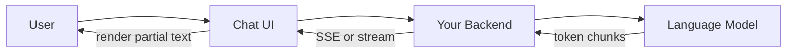

The important idea is this:

- the model generates tokens over time
- your backend forwards those chunks as they arrive
- the client renders partial output immediately
- when the stream ends, the client commits the final message

Without streaming, the user waits in silence until the entire answer is ready. With streaming, the user sees progress within the first second. That difference is often larger than any model upgrade for user satisfaction.

## Deep Theory

### What is streaming in LLM applications?
Streaming means the model sends output incrementally instead of returning one complete string at the end. Each chunk is usually a few characters or tokens. Your application receives many small updates and displays them as they arrive.

This is not the same as "faster generation." Total generation time may be nearly identical. What changes is when the user first sees useful output.

### Token-by-token delivery
Language models generate one token at a time internally. A token might be a word, part of a word, or punctuation. Providers expose this as a sequence of delta events.

Typical event flow:

1. stream starts
2. content delta arrives repeatedly
3. optional tool-call delta arrives
4. stream ends with a finish reason

Your job is to append each delta to the visible message and to a buffer that will become the final stored message.

### Perceived latency vs actual latency
These two numbers measure different things.

| Metric | What it measures | User impact |
| --- | --- | --- |
| Actual latency | Total time until the full answer is complete | Affects throughput and cost |
| Perceived latency | Time until the user sees the first useful output | Affects satisfaction and engagement |
| Time to first token (TTFT) | Time from request to first streamed chunk | Strong predictor of "feels fast" |

A response that takes 8 seconds total but shows the first words in 400 milliseconds feels much faster than a response that takes 6 seconds but shows nothing until the end.

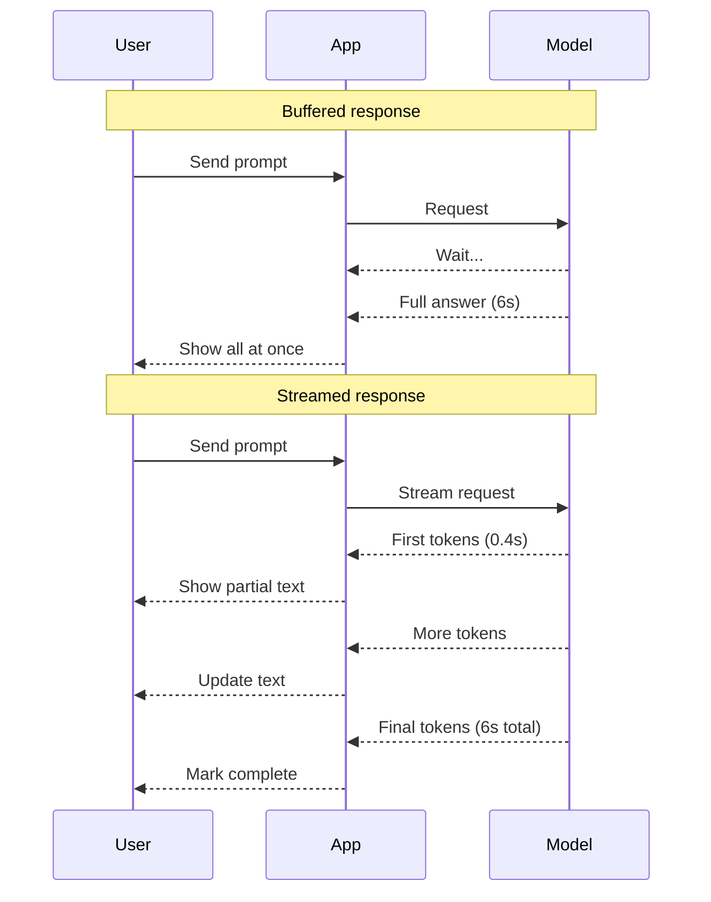

Perceived latency is a UX metric. Actual latency is a systems metric. Good streaming optimizes both, but TTFT is often the highest-leverage improvement.

### Buffered vs streamed responses

| Aspect | Buffered | Streamed |
| --- | --- | --- |
| User feedback | None until complete | Immediate partial output |
| Error handling | Single success or failure | Errors can occur mid-stream |
| UI complexity | Low | Medium to high |
| Tool use | Easier to parse final JSON | Requires incremental parsing |
| Caching | Simple | Must store assembled result |
| Best for | Short answers, batch jobs | Chat, code gen, long answers |

Buffered mode is fine for background tasks, cron jobs, and internal pipelines. Streamed mode is expected for interactive assistants.

### Server-Sent Events (SSE)
SSE is a standard way for a server to push updates over HTTP. The connection stays open. The server sends text events. The client reads them as they arrive.

An SSE message looks like this:

```text
event: message
data: {"delta": "Hello"}

event: message
data: {"delta": " world"}

event: done
data: {"finish_reason": "stop"}
```

Why SSE is popular for LLM apps:

- works over normal HTTP
- easy to proxy and debug
- one-directional flow matches model output
- supported by browsers through `EventSource` or fetch streams
- simpler than WebSockets for many chat use cases

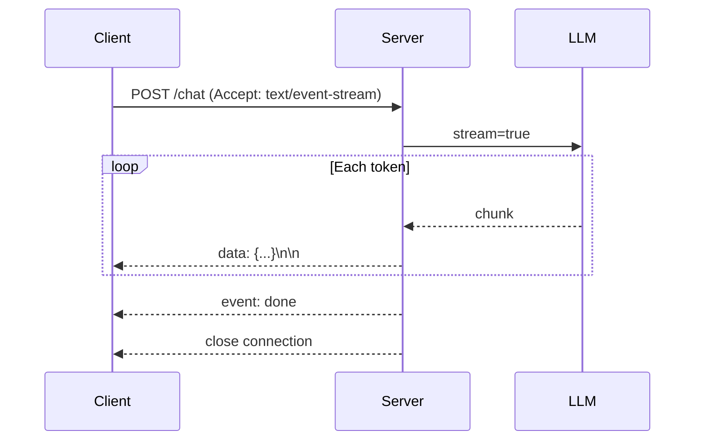

### WebSockets vs SSE

| Feature | SSE | WebSockets |
| --- | --- | --- |
| Direction | Server to client | Bidirectional |
| Protocol | HTTP | Separate upgrade |
| Reconnection | Built-in retry patterns | Manual |
| Browser support | Excellent | Excellent |
| Proxy compatibility | Usually good | Sometimes harder |
| Best for LLM chat | Yes, when user sends one request at a time | Yes, when you need live two-way events |
| Complexity | Lower | Higher |

For most chat assistants, SSE is enough. Use WebSockets when the same connection must carry typing indicators, live collaboration, voice, or multiple concurrent event types in both directions.

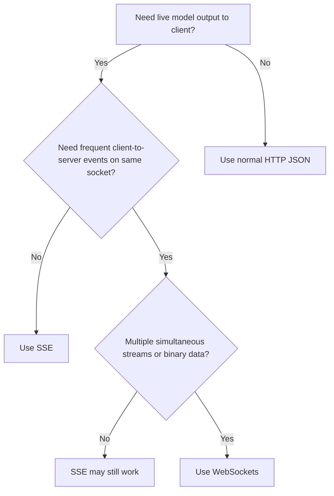

### UI state management
Streaming forces you to track message lifecycle explicitly. A single assistant reply is not one state. It is a sequence of states.

Recommended message states:

| State | Meaning | UI behavior |
| --- | --- | --- |
| `idle` | No active generation | Input enabled |
| `submitting` | Request sent, no tokens yet | Show spinner or typing indicator |
| `streaming` | Tokens arriving | Append text, disable send or allow stop |
| `complete` | Stream finished successfully | Persist message, re-enable input |
| `cancelled` | User stopped generation | Keep partial text, mark as stopped |
| `error` | Stream failed | Show retry option, preserve partial if useful |

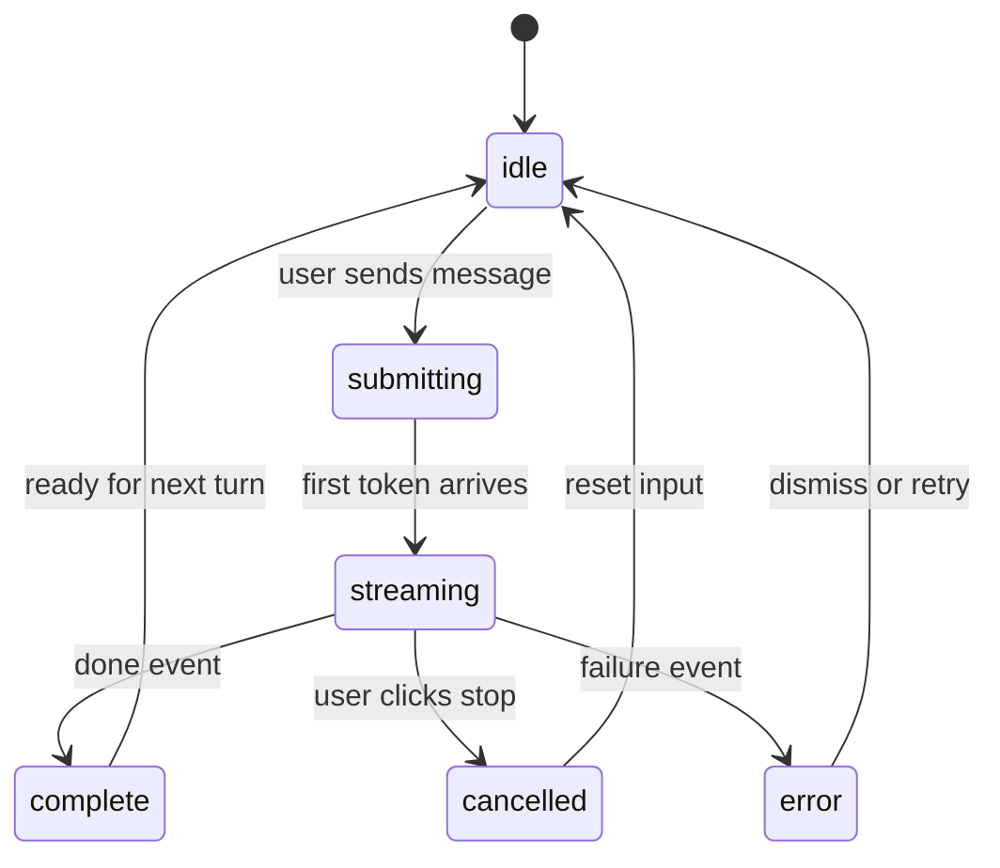

Keep two copies of the in-progress assistant message:

- `displayText` for what the user sees right now
- `committedText` for what you save after completion

Do not treat partial text as final until the stream ends cleanly.

### Cancellation
Users expect a Stop button. Cancellation must abort three layers:

1. client read loop
2. backend request to the provider
3. provider-side generation when supported

Use `AbortController` in the browser. Propagate cancellation to your backend. Close the SSE connection. Mark the message as cancelled, not complete.

Never silently discard partial output unless the product requires it. Most chat apps keep what was already streamed.

### Reconnection
Networks fail. SSE connections drop. A production system needs a plan.

Common strategies:

| Strategy | How it works | Tradeoff |
| --- | --- | --- |
| Fail with retry button | User manually retries | Simple, may lose partial output |
| Resume from last event ID | Server tracks event sequence | More complex, better UX |
| Poll fallback | Switch to polling after disconnect | Higher latency |
| Idempotent regenerate | Restart generation from last user message | Costs extra tokens |

For most learning projects, a clear error state plus retry is enough. For production, store stream event IDs and support resume when the provider allows it.

### Streaming with tools
When tools are enabled, the stream may contain:

- normal text deltas
- tool call name fragments
- tool call argument JSON fragments
- tool result messages after your code executes
- a second model pass after tool results

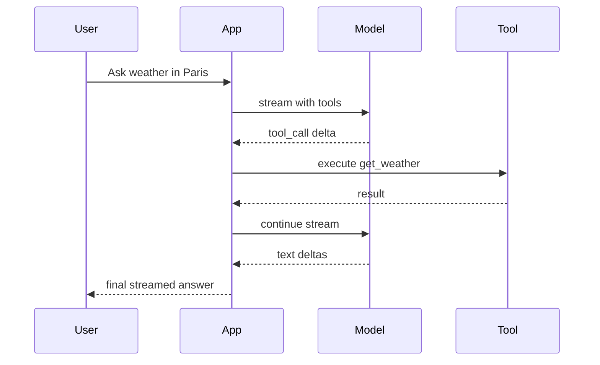

Your UI should not show raw tool JSON to users unless the product is developer-focused. Instead:

- show a "Using tool..." status
- execute the tool server-side
- resume streaming the natural language answer

### Partial JSON challenges
Tool arguments often arrive as incomplete JSON strings across many chunks. You cannot parse them with a normal JSON parser until the object is complete.

Problems:

- `{"city": "Par` is invalid JSON
- UI may flicker if you parse too early
- duplicate keys or malformed fragments can crash naive parsers

Solutions:

- accumulate argument strings in a buffer
- parse only when the tool call chunk is marked complete
- use incremental JSON parsers for advanced cases
- validate before executing any tool

Never execute a tool from partial arguments.

### Backpressure
Backpressure happens when the producer sends data faster than the consumer can handle it.

In LLM streaming:

- the model may emit tokens quickly
- the client may re-render on every token
- the browser may struggle with hundreds of DOM updates per second

Without backpressure control, the UI can stutter or freeze.

Mitigations:

| Layer | Technique |
| --- | --- |
| Client | Batch renders every 16–50 ms |
| Client | Use requestAnimationFrame for updates |
| Server | Avoid forwarding every micro-chunk if unnecessary |
| Server | Set sane buffer sizes on HTTP streams |
| UI | Render plain text first, markdown later |

Backpressure is often ignored in demos. Real apps must handle it.

### Error mid-stream
Errors can happen after the user already saw partial output.

Common causes:

- network disconnect
- provider rate limit
- timeout
- content policy block late in generation
- backend crash

Handling rules:

1. preserve partial content
2. show a clear error banner
3. do not mark the message as complete
4. offer retry or continue when possible
5. log the request ID and stream position for debugging

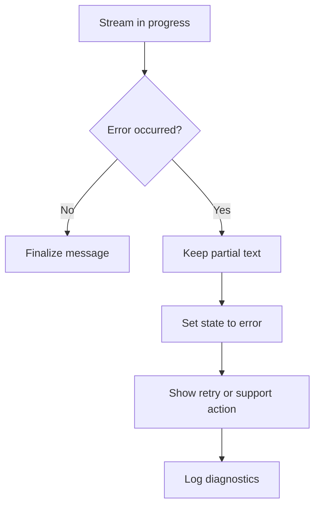

### Final message assembly
The visible stream is not your source of truth until it is finalized. Always assemble a complete message object at the end.

Final assembly checklist:

- concatenate all text deltas
- attach tool call records if any
- store finish reason and token usage
- save timestamps for start and end
- persist to database only after validation
- replace in-memory partial state with the committed record

This prevents partial garbage from entering conversation history.

## Case Studies

### ChatGPT typing effect
ChatGPT popularized token streaming for mainstream users. The typing effect works because first tokens appear quickly, markdown renders progressively, and the Stop button is always visible during generation.

Engineering lessons:

- TTFT matters more than total length for satisfaction
- render plain text immediately, format later
- show generation state clearly
- commit the message only when the stream completes

### Cursor inline completion
Cursor streams code completions into the editor as the model writes. This is streaming at a different granularity: small inline edits rather than chat bubbles.

Engineering lessons:

- partial output must not break editor state
- cancellation must be instant because users keep typing
- streaming must coexist with local user edits
- final assembly must merge cleanly into the document

### Claude streaming
Claude supports streaming with text and tool events through its Messages API. Anthropic emits structured events such as content block deltas and message deltas.

Engineering lessons:

- event types are explicit, not one generic chunk
- tool use requires careful handling of separate block types
- providers differ, so build a provider-agnostic stream layer in your app

## Visual Learning

### End-to-end streaming architecture
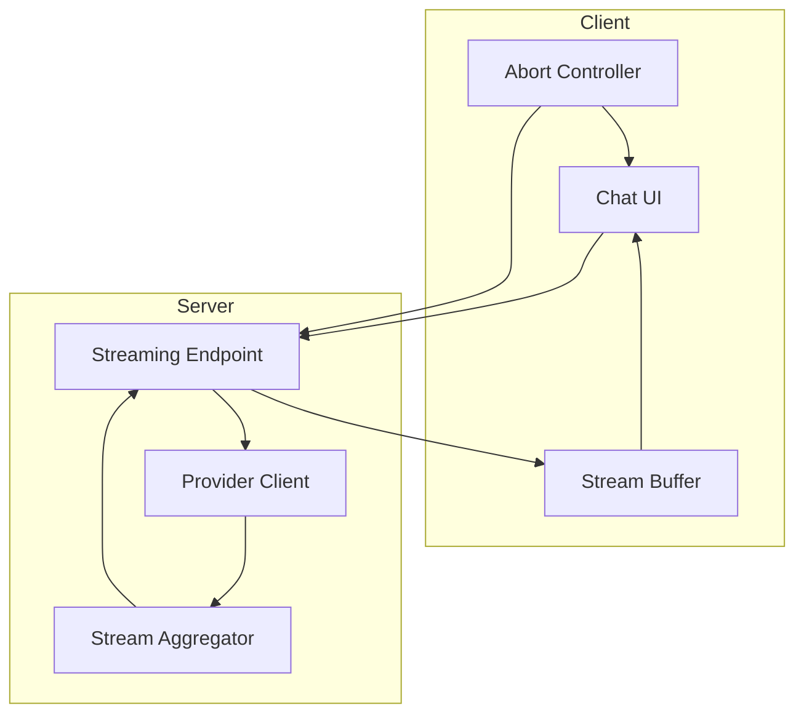

### Client rendering pipeline
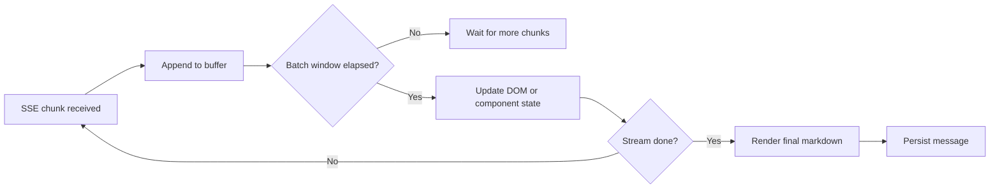

### Mental model
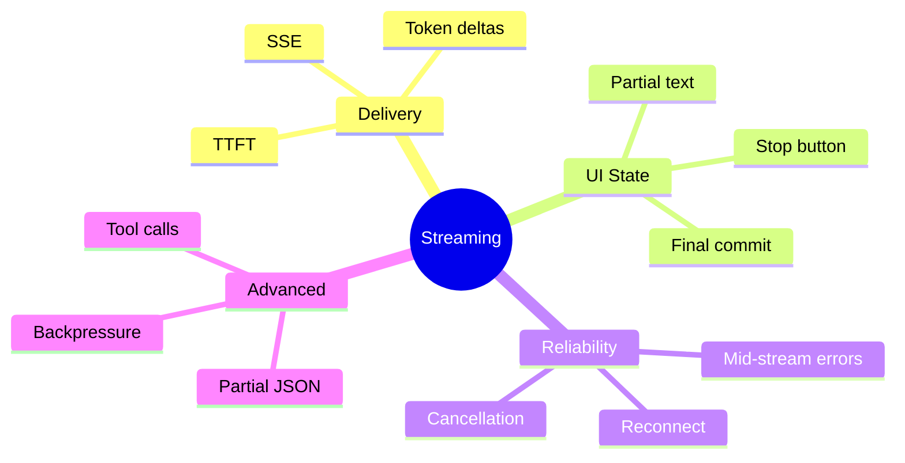

## Code Walkthrough

The examples below are simplified so you can see the moving parts clearly.

### Python Example: Simulating token streaming
```python
import time


def simulate_stream(tokens, delay=0.05):
    """Yield tokens one at a time like an LLM stream."""
    for token in tokens:
        time.sleep(delay)
        yield token


message = []
print("Assistant: ", end="", flush=True)

for chunk in simulate_stream(["Streaming ", "makes ", "apps ", "feel ", "fast."]):
    message.append(chunk)
    print(chunk, end="", flush=True)

final_text = "".join(message)
print("\nFinal length:", len(final_text))
```

#### Code Explanation
- `simulate_stream` mimics provider token delivery.
- `yield` sends one chunk at a time.
- `flush=True` forces immediate terminal output.
- `message` accumulates the final assembled string.
- `final_text` is what you would save to history.

### TypeScript Example: Simulating token streaming
```typescript
async function simulateStream(tokens: string[], delayMs = 50): Promise<void> {
  const message: string[] = [];

  for (const token of tokens) {
    await new Promise((resolve) => setTimeout(resolve, delayMs));
    message.push(token);
    process.stdout.write(token);
  }

  const finalText = message.join('');
  console.log(`\nFinal length: ${finalText.length}`);
}

simulateStream(['Streaming ', 'makes ', 'apps ', 'feel ', 'fast.']);
```

#### Code Explanation
- `simulateStream` mirrors the Python example in async TypeScript.
- `message` collects all chunks.
- `process.stdout.write` prints without extra newlines.
- `finalText` becomes the committed message.

### Python Example: OpenAI streaming
```python
from openai import OpenAI

client = OpenAI()
stream = client.chat.completions.create(
    model="gpt-4o-mini",
    messages=[{"role": "user", "content": "Explain SSE in one paragraph."}],
    stream=True,
)

parts = []
for event in stream:
    delta = event.choices[0].delta.content
    if delta:
        parts.append(delta)
        print(delta, end="", flush=True)

final_message = "".join(parts)
```

#### Code Explanation
- `stream=True` enables token streaming from OpenAI.
- each `event` may contain a small `delta`.
- `parts` accumulates the full assistant message.
- always handle `None` deltas because not every event has text.

### TypeScript Example: OpenAI streaming
```typescript
import OpenAI from 'openai';

const client = new OpenAI();

async function streamCompletion(): Promise<string> {
  const stream = await client.chat.completions.create({
    model: 'gpt-4o-mini',
    messages: [{ role: 'user', content: 'Explain SSE in one paragraph.' }],
    stream: true,
  });

  const parts: string[] = [];

  for await (const event of stream) {
    const delta = event.choices[0]?.delta?.content;
    if (delta) {
      parts.push(delta);
      process.stdout.write(delta);
    }
  }

  return parts.join('');
}

streamCompletion().then((finalMessage) => {
  console.log(`\nFinal length: ${finalMessage.length}`);
});
```

#### Code Explanation
- `for await...of` reads async iterable stream events.
- optional chaining avoids crashes on empty deltas.
- the function returns the assembled final message.

### Python Example: FastAPI SSE endpoint
```python
from fastapi import FastAPI
from fastapi.responses import StreamingResponse
import json
import asyncio

app = FastAPI()


async def token_generator():
    tokens = ["Hello ", "from ", "FastAPI ", "streaming."]
    for token in tokens:
        payload = json.dumps({"delta": token})
        yield f"data: {payload}\n\n"
        await asyncio.sleep(0.1)
    yield "event: done\ndata: {}\n\n"


@app.get("/stream")
async def stream():
    return StreamingResponse(
        token_generator(),
        media_type="text/event-stream",
        headers={"Cache-Control": "no-cache", "Connection": "keep-alive"},
    )
```

#### Code Explanation
- `StreamingResponse` sends SSE over HTTP.
- each chunk uses the `data:` SSE format.
- `text/event-stream` sets the correct media type.
- cache and connection headers help proxies behave correctly.

### TypeScript Example: Express SSE endpoint
```typescript
import express from 'express';

const app = express();

app.get('/stream', async (_req, res) => {
  res.setHeader('Content-Type', 'text/event-stream');
  res.setHeader('Cache-Control', 'no-cache');
  res.setHeader('Connection', 'keep-alive');
  res.flushHeaders();

  const tokens = ['Hello ', 'from ', 'Express ', 'streaming.'];

  for (const token of tokens) {
    res.write(`data: ${JSON.stringify({ delta: token })}\n\n`);
    await new Promise((resolve) => setTimeout(resolve, 100));
  }

  res.write('event: done\ndata: {}\n\n');
  res.end();
});

app.listen(3000, () => {
  console.log('Streaming server running on http://localhost:3000');
});
```

#### Code Explanation
- Express writes SSE frames directly to the response.
- `flushHeaders` starts the stream immediately.
- each token is a separate SSE event.
- `res.end()` closes the stream cleanly.

### Python Example: Client-side stream reader with requests
```python
import json
import requests


def read_sse_stream(url):
    buffer = []
    with requests.post(url, json={"prompt": "Hello"}, stream=True) as response:
        response.raise_for_status()
        for line in response.iter_lines(decode_unicode=True):
            if not line or not line.startswith("data: "):
                continue
            payload = json.loads(line.removeprefix("data: "))
            delta = payload.get("delta")
            if delta:
                buffer.append(delta)
                print(delta, end="", flush=True)
    return "".join(buffer)
```

#### Code Explanation
- `stream=True` keeps the HTTP connection open.
- SSE lines begin with `data:` and must be parsed.
- the buffer assembles the final message.
- always skip empty keep-alive lines.

### TypeScript Example: Browser fetch stream reader
```typescript
export async function readSseStream(
  response: Response,
  onDelta: (text: string) => void,
): Promise<string> {
  const reader = response.body?.getReader();
  if (!reader) {
    throw new Error('Response body is not readable.');
  }

  const decoder = new TextDecoder();
  let buffer = '';
  let finalText = '';

  while (true) {
    const { done, value } = await reader.read();
    if (done) break;

    buffer += decoder.decode(value, { stream: true });
    const lines = buffer.split('\n');
    buffer = lines.pop() ?? '';

    for (const line of lines) {
      if (!line.startsWith('data: ')) continue;
      const payload = JSON.parse(line.slice(6)) as { delta?: string };
      if (payload.delta) {
        finalText += payload.delta;
        onDelta(payload.delta);
      }
    }
  }

  return finalText;
}
```

#### Code Explanation
- `getReader()` consumes a fetch response stream in the browser.
- incomplete lines stay in `buffer` until the next chunk arrives.
- `onDelta` updates UI state incrementally.
- the function returns the final assembled text.

### Python Example: Cancellation with AbortController pattern
```python
import asyncio


async def stream_with_cancel(provider_stream, cancel_event: asyncio.Event):
    parts = []
    try:
        async for chunk in provider_stream:
            if cancel_event.is_set():
                break
            if chunk:
                parts.append(chunk)
                print(chunk, end="", flush=True)
    finally:
        await provider_stream.aclose()

    status = "cancelled" if cancel_event.is_set() else "complete"
    return {"text": "".join(parts), "status": status}
```

#### Code Explanation
- `cancel_event` represents a user clicking Stop.
- the loop exits early when cancellation is requested.
- `aclose()` releases provider resources.
- return status tells the UI whether the message finished or was stopped.

### TypeScript Example: AbortController in the browser
```typescript
export async function streamChat(prompt: string, signal: AbortSignal): Promise<string> {
  const response = await fetch('/api/chat/stream', {
    method: 'POST',
    headers: { 'Content-Type': 'application/json' },
    body: JSON.stringify({ prompt }),
    signal,
  });

  if (!response.ok) {
    throw new Error(`Stream failed with status ${response.status}`);
  }

  let finalText = '';

  await readSseStream(response, (delta) => {
    finalText += delta;
  });

  return finalText;
}

// Usage
const controller = new AbortController();
streamChat('Explain backpressure', controller.signal).catch(console.error);
// controller.abort(); // call this when the user clicks Stop
```

#### Code Explanation
- `AbortSignal` connects the Stop button to fetch cancellation.
- fetch abort stops the network read immediately.
- partial text remains in `finalText` if abort happens mid-stream.

### Python Example: Streaming with tool calls
```python
import json


def handle_stream_event(event, tool_buffer, text_parts):
    delta = event.choices[0].delta

    if delta.content:
        text_parts.append(delta.content)

    if delta.tool_calls:
        for tool_call in delta.tool_calls:
            index = tool_call.index
            tool_buffer.setdefault(index, {"name": "", "arguments": ""})
            if tool_call.function.name:
                tool_buffer[index]["name"] += tool_call.function.name
            if tool_call.function.arguments:
                tool_buffer[index]["arguments"] += tool_call.function.arguments

    return tool_buffer, text_parts


def parse_completed_tools(tool_buffer):
    completed = []
    for item in tool_buffer.values():
        if item["name"] and item["arguments"]:
            completed.append({
                "name": item["name"],
                "arguments": json.loads(item["arguments"]),
            })
    return completed
```

#### Code Explanation
- tool call data arrives in fragments across events.
- `tool_buffer` accumulates name and argument strings by index.
- parse JSON only after the tool call is complete.
- keep text deltas separate from tool metadata.

### TypeScript Example: Partial JSON accumulation
```typescript
type ToolBuffer = Record<number, { name: string; arguments: string }>;

export function accumulateToolDelta(
  buffer: ToolBuffer,
  toolCall: { index: number; function?: { name?: string; arguments?: string } },
): ToolBuffer {
  const current = buffer[toolCall.index] ?? { name: '', arguments: '' };

  return {
    ...buffer,
    [toolCall.index]: {
      name: current.name + (toolCall.function?.name ?? ''),
      arguments: current.arguments + (toolCall.function?.arguments ?? ''),
    },
  };
}

export function parseCompletedTool(bufferItem: { name: string; arguments: string }) {
  if (!bufferItem.name || !bufferItem.arguments) {
    return null;
  }

  return {
    name: bufferItem.name,
    arguments: JSON.parse(bufferItem.arguments) as Record<string, unknown>,
  };
}
```

#### Code Explanation
- never parse partial JSON directly.
- accumulate strings until the provider marks the tool call complete.
- return `null` until the buffer is ready.

### Python Example: Backpressure-friendly batching
```python
import time


def batched_render(chunks, batch_interval=0.03):
    bucket = []
    last_flush = time.time()

    for chunk in chunks:
        bucket.append(chunk)
        now = time.time()
        if now - last_flush >= batch_interval:
            yield "".join(bucket)
            bucket = []
            last_flush = now

    if bucket:
        yield "".join(bucket)
```

#### Code Explanation
- re-render every chunk only in toy demos.
- batching reduces UI update frequency.
- 30 ms is a common starting point for smooth typing.

### TypeScript Example: UI state hook pattern
```typescript
type StreamState = 'idle' | 'submitting' | 'streaming' | 'complete' | 'cancelled' | 'error';

type Message = {
  id: string;
  role: 'assistant';
  content: string;
  state: StreamState;
};

export function applyDelta(message: Message, delta: string): Message {
  if (message.state === 'submitting') {
    return { ...message, state: 'streaming', content: delta };
  }

  return { ...message, content: message.content + delta };
}

export function finalizeMessage(message: Message): Message {
  return { ...message, state: 'complete' };
}
```

#### Code Explanation
- explicit states prevent UI bugs.
- first delta moves the message from submitting to streaming.
- finalize converts the partial message into a committed one.

## Practical Examples

### Beginner Example: Study assistant chat
A student asks, "Explain overfitting in one paragraph." The app streams the answer into a chat bubble. The first sentence appears in under a second. The student reads while the rest arrives.

Why streaming helps:

- the app feels responsive
- the student can stop early if the answer is enough
- long answers are less intimidating

### Intermediate Example: Support bot with Stop
A support assistant streams policy guidance. The user realizes they asked the wrong question and clicks Stop. The UI keeps the partial answer, marks it as cancelled, and re-enables the input.

Why it matters:

- cancellation must be immediate
- partial content should not corrupt conversation history
- the next request should start from a clean idle state

### Professional Example: Tool-enabled travel assistant
The user asks, "Find flights to Tokyo next Friday." The model streams a tool call, the server executes a flight search, then the model streams a natural language summary of results.

Why it matters:

- the UI needs a non-text status during tool execution
- partial JSON must not trigger premature tool runs
- the final message includes both tool metadata and user-facing text

## Best Practices
- optimize time to first token, not only total response time
- separate partial UI state from committed history
- show a Stop button during generation
- batch DOM or component updates to reduce render thrash
- parse tool arguments only when complete
- use standard SSE headers and event formats
- log request IDs, stream duration, and finish reason
- persist the assembled message only after success
- render plain text first, formatted markdown second
- test mid-stream disconnect and provider errors
- provide a retry path that does not duplicate user messages
- abstract provider stream differences behind one internal event model

## Common Mistakes
- treating partial streamed text as final too early
- parsing incomplete tool JSON and crashing
- re-rendering markdown on every single token
- ignoring cancellation at the provider layer
- losing partial output when an error occurs
- mixing control events and content events in one unstructured channel
- failing to flush SSE headers promptly
- storing empty assistant messages after failed streams
- exposing raw tool payloads to non-technical users
- assuming WebSockets are always better than SSE

### Debugging Strategy
When streaming feels broken, check in this order:

1. Is time to first token slow, or is rendering slow?
2. Are chunks arriving but not displayed?
3. Is the client parsing SSE lines correctly?
4. Is the UI state machine wrong?
5. Is a tool call stuck in partial JSON?
6. Is the connection closing too early behind a proxy?

## Performance

Streaming performance has four common bottlenecks:

| Bottleneck | Symptom | Fix |
| --- | --- | --- |
| Slow TTFT | Long blank wait before text | warm models, shorter prompts, closer region |
| Render thrash | UI freezes during typing | batch updates, avoid markdown on every delta |
| Proxy buffering | chunks arrive all at once | disable buffering, set SSE headers |
| Tool latency | pause mid-stream | show tool status, execute tools server-side quickly |

### Latency
Measure:

- request start to first chunk
- first chunk to last chunk
- total stream duration
- UI paint time per update

### Cost
Streaming does not usually reduce token cost by itself. It reduces user-visible wait time. Stop buttons can reduce cost if users cancel low-value generations early.

## Security
- do not expose provider API keys to the browser
- stream through your backend unless you fully accept client-side key exposure
- sanitize partial output before rendering if content comes from untrusted workflows
- validate tool arguments before executing anything
- rate limit streaming endpoints to prevent abuse
- log and monitor abnormally long streams

## Exercises

### Easy
1. Explain why streaming improves perceived latency.
2. Define SSE in one sentence.
3. Name the six message states used in this lesson.
4. What is time to first token?
5. Why should partial text not be saved as final history immediately?

### Medium
6. Compare buffered and streamed responses in a table.
7. Draw the UI state machine for a chat app.
8. Explain why partial JSON is dangerous for tool calls.
9. Describe what happens when a user clicks Stop.
10. Why is SSE often enough for chat assistants?

### Hard
11. Design a retry strategy after a mid-stream disconnect.
12. Explain backpressure and give one client-side fix.
13. Compare WebSockets and SSE for a collaborative editor.
14. Design a provider-agnostic internal stream event format.
15. Write a plan for rendering markdown safely during a stream.

### Challenge
16. Add tool status UI to a streaming chat design.
17. Implement stream event IDs for reconnect support.
18. Design a batching strategy that keeps 60 fps UI updates.
19. Create a logging schema for stream diagnostics.
20. Build a fallback from SSE to polling when proxies buffer events.

### Reflection Questions
21. When does streaming help UX the most?
22. When is buffered output the better engineering choice?
23. What is harder: cancellation or reconnection?
24. Why do tool calls complicate streaming?
25. What would you test first if users say the app feels slow?

## Mini Project
Plan a streaming chat interface for a study assistant.

### Goal
Design a chat UI that renders assistant responses token by token, supports Stop, handles errors mid-stream, and commits the final message cleanly.

### Features
- chat message list with user and assistant roles
- streaming assistant bubble with typing state
- Stop button during generation
- error banner if the stream fails
- final message persistence after completion
- optional tool status indicator for future tool use

### Suggested UI States
```text
idle -> submitting -> streaming -> complete
                     streaming -> cancelled
                     streaming -> error
```

### Suggested Folder Structure
```text
streaming-chat/
├── client/
│   ├── components/ChatWindow.tsx
│   ├── hooks/useStreamChat.ts
│   ├── lib/sse.ts
│   └── state/messageReducer.ts
├── server/
│   ├── routes/chat.ts
│   ├── services/providerStream.ts
│   └── utils/assembleMessage.ts
└── README.md
```

### Project Steps
1. define the message state machine
2. build a backend SSE endpoint
3. connect the client with fetch and a readable stream
4. append deltas to the active assistant message
5. add Stop with abort propagation
6. finalize and persist the message on done
7. test a forced network failure mid-stream

### What You Learn
- how streaming changes frontend state design
- why SSE is a strong default for chat
- how to recover from partial failures without losing user trust

## Interview Questions

### Conceptual
- What is the difference between perceived latency and actual latency?
- Why does streaming not necessarily reduce total generation time?
- When would you choose SSE over WebSockets?
- Why should tool arguments be parsed only after completion?
- What is backpressure in a streaming UI?

### System Design
- Design a streaming chat API for one million daily users.
- Design cancellation across browser, backend, and model provider.
- Design a stream layer that supports OpenAI and Claude with one interface.
- Design reconnect behavior for mobile clients on unstable networks.

### Debugging
- Users see the full answer appear all at once. What do you check?
- The app freezes while streaming long code blocks. Why?
- Tool calls sometimes execute with empty arguments. Why?
- Streams fail only in production behind a proxy. Why?

## Quizzes

### Quiz 1
1. What protocol pattern is common for one-way server-to-client LLM output?
2. What metric captures how quickly a user sees the first tokens?
3. Name two states an assistant message can be in during generation.
4. Why should you keep a buffer separate from the rendered DOM text?

### Quiz 2
1. What is partial JSON and why is it a problem?
2. What does an AbortController do in a browser streaming client?
3. Why can markdown rendering during streaming cause performance issues?
4. When is buffered output still a good choice?

### Quiz 3
1. What belongs in a final assembled message object?
2. Why should partial output be preserved on mid-stream error?
3. What is one difference between ChatGPT-style chat streaming and Cursor inline completion?
4. Why is provider abstraction useful in a streaming layer?

## Cumulative Capstone Update
Your capstone study assistant should now expose a streaming chat endpoint. Day 14 will turn this into a fuller mini assistant, but today you add the delivery layer that makes the product feel real.

Add these items to your capstone plan:

- a `/chat/stream` endpoint that returns `text/event-stream`
- a provider client configured with `stream=True`
- a server-side assembler that builds the final assistant message
- a Stop route or shared abort mechanism
- frontend state for `submitting`, `streaming`, `complete`, `cancelled`, and `error`
- logging for TTFT, total stream duration, and finish reason
- a retry UX that does not duplicate the user message

Suggested capstone flow:

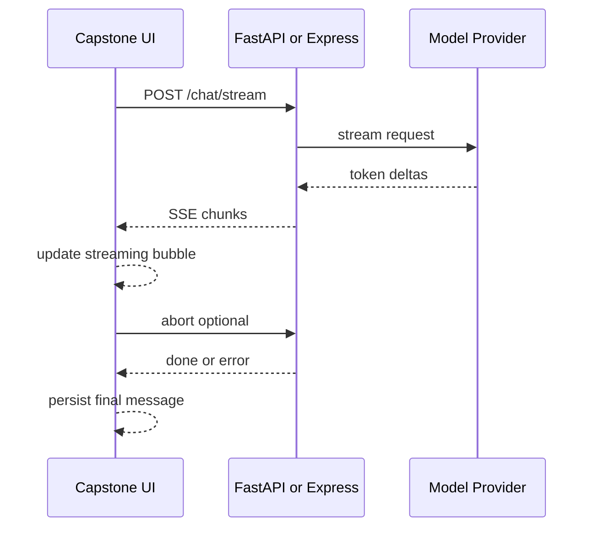

This turns the capstone from a request-response demo into an interactive assistant that feels modern and responsive.

## Historical Background

Streaming UX became mainstream when ChatGPT showed answers appearing word by word. Users did not care that the model had already "thought" of the answer—they cared that they could **read while waiting**.

### From batch completions to token streams

Early API integrations used blocking HTTP: send request, wait seconds, receive full completion. That was simple to implement but felt sluggish for long answers.

Server-Sent Events (SSE) and chunked transfer encoding made it practical to forward partial tokens from provider to browser. Frameworks added first-class streaming support. Streaming became the default expectation for chat interfaces.

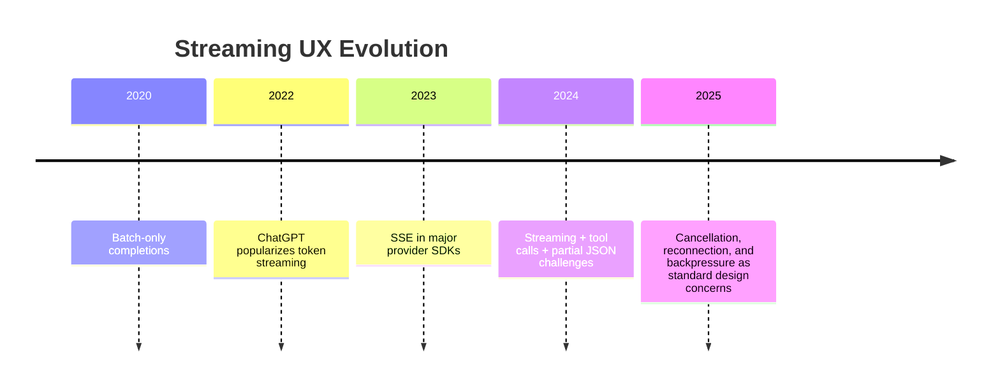

### Streaming is not free

Streaming improves perceived latency but complicates state management, error handling, and validation. Day 13 teaches you to treat streaming as a **product feature with engineering cost**, not a checkbox.

## Summary
Streaming is one of the highest-impact UX improvements in AI application engineering. It does not change model quality. It changes how quickly users see value, how responsive the interface feels, and how carefully you must manage state, errors, and final message assembly.

The main lesson of this day is simple:

- tokens arrive over time, not all at once
- perceived latency often matters more than total latency
- SSE is the default pattern for many chat apps
- partial output requires its own state, cancellation, and error rules
- the final committed message must be assembled deliberately

If Day 12 was about structured actions through function calling, Day 13 is about delivering answers in a way that feels alive. Tomorrow, on Day 14, you will combine these ideas into your first mini AI assistant.

[Previous: Day 12 - Function Calling](../day_12/day_12_function_calling.md) | [Next: Day 14 - Mini AI Assistant](../day_14/day_14_mini_ai_assistant.md)

## Further Reading
- https://platform.openai.com/docs/guides/streaming
- https://docs.anthropic.com/en/docs/build-with-claude/streaming
- https://developer.mozilla.org/en-US/docs/Web/API/Server-sent_events
- https://developer.mozilla.org/en-US/docs/Web/API/Streams_API
- https://fastapi.tiangolo.com/advanced/custom-response/#streamingresponse
- https://expressjs.com/
