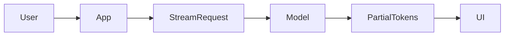

# Day 13 - Streaming Responses

## Introduction
Streaming lets the model send output token by token instead of waiting for the entire answer. This makes AI apps feel faster, more interactive, and more natural.


## Learning Objectives
By the end of this day, you should be able to:

- explain why streaming improves user experience
- describe the difference between buffered and streamed output
- design a basic streaming UI behavior
- handle partial responses safely
- think about streaming with tool use and long outputs

## Theory
Without streaming, the app waits until the full answer is ready. With streaming, the user sees progress immediately. This is especially useful for long answers, assistants, and code generation.

Streaming does not change the model's intelligence. It changes how the answer is delivered.

### Visual Diagram


## Code Examples

### Python
```python
chunks = ["AI ", "engineering ", "is ", "practical."]
for chunk in chunks:
    print(chunk, end="")
```

### TypeScript
```typescript
const chunks = ['AI ', 'engineering ', 'is ', 'practical.'];
for (const chunk of chunks) {
  process.stdout.write(chunk);
}
```

## Best Practices
- show progress early
- handle stream interruption cleanly
- separate final data from partial UI state
- make sure partial output is safe to display
- combine streaming with good cancellation behavior

## Common Mistakes
- treating streamed output like finished output too early
- failing to reset the UI after errors
- ignoring cancellation when the user navigates away
- mixing content chunks with control messages
- forgetting to handle the final completion event

## Exercises
- Easy: Explain why streaming improves UX.
- Medium: Compare buffered and streamed answers.
- Hard: Design UI state for a stream that fails halfway.
- Challenge: Describe a stream that also uses tools.

## Mini Project
Plan a chat interface that prints assistant text as it arrives and supports stopping the response.

## Summary
Streaming makes AI experiences feel responsive. It is mainly a delivery improvement, but it changes how you design UI state and error handling.

## Additional Resources
- https://platform.openai.com/docs/guides/streaming
- https://docs.anthropic.com/en/docs/build-with-claude/streaming
- https://developer.mozilla.org/en-US/docs/Web/API/ReadableStream
