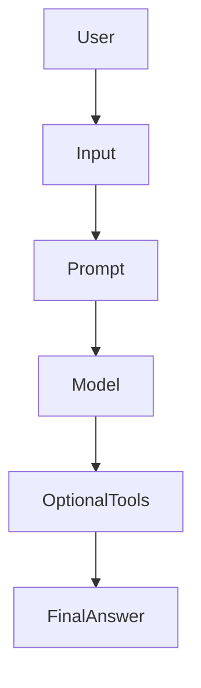

# Day 14 - Mini AI Assistant

[Previous: Day 13 - Streaming Responses](../day_13/day_13_streaming_responses.md) | [Next: Day 15 - Embeddings](../day_15/day_15_embeddings.md)

## Introduction
Today you will combine APIs, prompting, and output control into a first assistant project. A mini assistant is a small but complete product that answers a specific user need.


## Learning Objectives
By the end of this day, you should be able to:

- define a narrow assistant use case
- design conversation flow and fallback behavior
- combine prompts with structured output
- choose one or two tools for the assistant
- write a small product spec before coding

## Theory
A useful assistant does not try to do everything. It solves one clear problem well. That could be study help, meeting summaries, or FAQ support.

The most important design question is not "Can the model answer?" It is "What is the smallest helpful behavior that makes the product valuable?"

### Visual Diagram


## Code Examples

### Python
```python
def assistant_reply(user_message: str) -> str:
    return f"I can help with: {user_message}"

print(assistant_reply("summarize my notes"))
```

### TypeScript
```typescript
function assistantReply(userMessage: string): string {
  return `I can help with: ${userMessage}`;
}

console.log(assistantReply('summarize my notes'));
```

## Best Practices
- choose one narrow use case
- define the assistant's tone and limits
- add a fallback if the model is uncertain
- keep the first version text-only if needed
- test with realistic user prompts

## Common Mistakes
- trying to build a general-purpose assistant too early
- forgetting the user flow around the model
- not specifying what the assistant should not do
- using too many tools on the first version
- failing to test unclear or conflicting requests

## Exercises
- Easy: Pick a single assistant use case.
- Medium: Write a short assistant persona and limit list.
- Hard: Design a fallback message for unsupported requests.
- Challenge: Draft the assistant's first version as a product spec.

## Mini Project
Build a one-page design for a study assistant that can summarize notes, answer questions, and refuse unrelated tasks.

## Summary
A mini assistant is the first moment where multiple AI engineering ideas come together. Scope, prompt design, and control flow matter as much as the model itself.

[Previous: Day 13 - Streaming Responses](../day_13/day_13_streaming_responses.md) | [Next: Day 15 - Embeddings](../day_15/day_15_embeddings.md)

## Additional Resources
- https://platform.openai.com/docs
- https://docs.anthropic.com/
- https://www.deeplearning.ai/short-courses/
