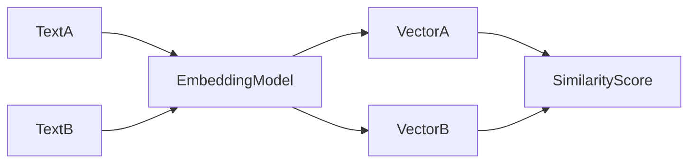

# Day 15 - Embeddings

[Previous: Day 14 - Mini AI Assistant](../day_14/day_14_mini_ai_assistant.md) | [Next: Day 16 - Vector Databases](../day_16/day_16_vector_databases.md)

## Introduction
Embeddings convert text or other content into vectors that capture meaning. They are one of the most important tools in modern AI applications because they power search, clustering, and retrieval.


## Learning Objectives
By the end of this day, you should be able to:

- explain what an embedding is
- understand why similar meanings produce nearby vectors
- compare keyword search and semantic search
- describe how embeddings support RAG systems
- design a simple embedding workflow

## Theory
An embedding model takes input and produces a dense numeric vector. The vector does not describe the text word by word. Instead, it captures semantic relationships so related items can be found more easily.

If two sentences mean something similar, their embeddings are usually close together in vector space.

### Visual Diagram


## Code Examples

### Python
```python
sentence = "The assistant summarizes study notes."
vector = [0.21, 0.84, 0.37, 0.92]
print(sentence)
print(vector)
```

### TypeScript
```typescript
const sentence = 'The assistant summarizes study notes.';
const vector = [0.21, 0.84, 0.37, 0.92];

console.log(sentence);
console.log(vector);
```

## Best Practices
- use embeddings for similarity, not for generation
- store metadata alongside vectors
- choose chunk sizes that preserve meaning
- test retrieval with real user queries
- version your embedding strategy when changing models

## Common Mistakes
- assuming embeddings explain the text in human terms
- using too many or too few chunks
- mixing unrelated content in one vector
- forgetting metadata filters
- not measuring retrieval quality

## Exercises
- Easy: Define an embedding in one sentence.
- Medium: Explain semantic search.
- Hard: Propose a chunking strategy for technical docs.
- Challenge: Compare embeddings to keyword indexing.

## Mini Project
Design an embedding pipeline for study notes. Include ingestion, chunking, vector storage, and search.

## Summary
Embeddings turn meaning into numbers. That allows AI systems to search by similarity instead of only by exact words.

[Previous: Day 14 - Mini AI Assistant](../day_14/day_14_mini_ai_assistant.md) | [Next: Day 16 - Vector Databases](../day_16/day_16_vector_databases.md)

## Additional Resources
- https://platform.openai.com/docs/guides/embeddings
- https://www.pinecone.io/learn/
- https://huggingface.co/blog/embeddings
