# Day 15 - Embeddings

[Previous: Day 14 - Mini AI Assistant](../day_14/day_14_mini_ai_assistant.md) | [Next: Day 16 - Vector Databases](../day_16/day_16_vector_databases.md)

## Introduction

Welcome to Week 3: Retrieval. Over the next several days, you will learn how AI systems find the right information before they generate an answer. Today is the foundation of that entire week.

Embeddings convert text, images, or other content into dense numeric vectors that capture meaning. They are one of the most important tools in modern AI engineering because they power semantic search, clustering, deduplication, recommendations, and the retrieval layer behind RAG systems.


If Day 14 was about building a small assistant, Day 15 is about giving that assistant a way to search by meaning instead of only by exact words. Tomorrow, on Day 16, you will store and search those vectors at scale in a vector database. Today you learn what those vectors are, how they are created, and how to design a reliable embedding pipeline.

Think of embeddings as coordinates on a meaning map. Two pieces of content that mean similar things end up near each other. Two unrelated pieces end up far apart. That simple idea unlocks a huge amount of practical AI engineering.

## Learning Objectives

By the end of this day, you should be able to:

- explain what an embedding is mathematically and intuitively
- describe cosine similarity and why it is used for semantic search
- compare keyword search and semantic search
- choose between commercial and open-source embedding models
- design chunking strategies for documents and notes
- build an embedding ingestion pipeline with batching and normalization
- explain use cases such as search, clustering, deduplication, and RAG preparation
- recognize limitations such as no reasoning, stale vectors, and cost
- decide when embeddings are the right tool and when they are not

## How to Use This Lesson

This lesson is designed for **all skill levels**. Pick one path and follow it consistently.

| Level | Suggested approach | Time |
| --- | --- | --- |
| **Beginner** | Read Introduction → Big Picture → Deep Theory → trace one code example → Easy exercises | 5–7 hours |
| **Intermediate** | Skim objectives → Visual Learning → Code Walkthrough → Medium/Hard exercises → Mini project | 3–5 hours |
| **Advanced** | Deep Theory tradeoffs → Hard/Challenge exercises → extend mini project → capstone slice | 2–4 hours |

### Apply Today
Complete at least one item before moving to the next day:
- [ ] Trace one code example in **Python or TypeScript** (one language is enough)
- [ ] Complete exercises for your level (see Exercises section)
- [ ] Update [`projects/CAPSTONE.md`](../../projects/CAPSTONE.md) with today's capstone item
- [ ] Update the retrieval or memory section in `projects/CAPSTONE.md`.

> **Stuck?** Re-read Big Picture, review Prerequisites, or see [SYLLABUS.md](../../SYLLABUS.md) for path guidance.

## Prerequisites

You should already understand:

- Day 3: tokens, context windows, and embeddings at a high level
- Day 6–9: calling LLM and embedding APIs
- Day 14: designing a small assistant with a clear use case
- basic Python or TypeScript syntax

If cosine similarity or vector dimensionality feel unfamiliar, do not worry. This lesson builds intuition first and math second.

## Big Picture

Embeddings sit at the center of retrieval systems.

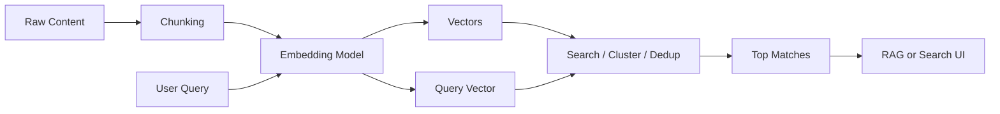

The important idea is this:

- embeddings convert meaning into numbers
- similarity functions compare those numbers
- retrieval systems use the best matches as context, recommendations, or search results

Without embeddings, many modern AI products would still depend on brittle keyword matching. With embeddings, systems can match paraphrases, synonyms, and related concepts.

## Deep Theory

### What is an embedding, mathematically?

An embedding is a fixed-length vector of real numbers:

$$\mathbf{v} = [v_1, v_2, v_3, \ldots, v_d]$$

where $d$ is the dimensionality of the model.

Each dimension is not a human-readable feature like "contains the word billing." Instead, the dimensions work together as a learned representation of meaning. The model learns these numbers during training so that semantically similar inputs produce vectors that are close together in high-dimensional space.

A useful mental model:

- each text becomes a point in space
- nearby points are semantically related
- faraway points are usually unrelated

In practice, modern text embedding models often produce vectors with hundreds or thousands of dimensions. OpenAI `text-embedding-3-small` can use 1536 dimensions by default, while `text-embedding-3-large` supports up to 3072. Open-source models such as `bge-small-en-v1.5` or `e5-large-v2` also use high-dimensional representations.

You do not need to interpret each dimension. You need to understand that the entire vector acts as a semantic fingerprint.

### Feynman analogy: the library with invisible shelves

Richard Feynman was famous for explaining hard ideas with simple pictures. Imagine a giant library where books are not sorted by title or author. They are sorted by meaning.

- a book about "resetting your password" sits near a book about "recovering account access"
- a cookbook sits far from a database manual
- two books can use completely different words and still sit on the same shelf

An embedding model is the librarian who decides where each book belongs. Cosine similarity is how you measure whether two books are on the same shelf.

This analogy is not perfect, but it is good enough for engineering decisions:

- embeddings organize by meaning, not spelling
- search becomes "find the nearest shelf"
- bad chunking is like tearing a book into random pages before shelving it

### Cosine similarity intuition

The most common similarity metric in embedding search is cosine similarity:

$$\text{cosine}(\mathbf{a}, \mathbf{b}) = \frac{\mathbf{a} \cdot \mathbf{b}}{\|\mathbf{a}\| \|\mathbf{b}\|}$$

In plain language:

- the dot product measures how much two vectors point in the same direction
- normalization removes the effect of vector length
- the result ranges from -1 to 1, though text embeddings are usually between 0 and 1

Why direction matters more than length:

- two sentences with similar meaning often point in similar directions
- a longer text does not automatically deserve a higher score just because its vector has larger magnitude
- cosine similarity focuses on semantic alignment

| Metric | What it measures | Common use |
| --- | --- | --- |
| Cosine similarity | Angle between vectors | Semantic search |
| Dot product | Alignment plus magnitude | Some ranking systems |
| Euclidean distance | Straight-line distance | Clustering, some nearest-neighbor tasks |

For retrieval engineering, cosine similarity is the default choice because it is stable, interpretable, and works well with normalized embedding outputs.

### Embedding models

An embedding model is not a chat model. It does not generate answers. It maps input into a vector space optimized for similarity tasks.

Common families include:

| Model family | Examples | Strengths | Tradeoffs |
| --- | --- | --- | --- |
| OpenAI embeddings | `text-embedding-3-small`, `text-embedding-3-large` | Strong quality, simple API, good MTEB scores | Paid API, external dependency |
| Sentence Transformers | `all-MiniLM-L6-v2`, `bge-small-en-v1.5` | Free, local, fast for prototypes | You manage infra and upgrades |
| E5 and BGE families | `e5-large-v2`, `bge-large-en-v1.5` | Strong open-source retrieval performance | Heavier compute, more setup |
| Cohere / Voyage / other hosted | Provider-specific models | Good enterprise options | Vendor lock-in, pricing |

When choosing a model, ask:

1. What language or domain am I searching?
2. Do I need local privacy or cloud convenience?
3. What dimensionality and latency can I afford?
4. Will I re-embed often as content changes?

A strong engineering rule: pick one embedding model per collection and keep it consistent. Mixing vectors from different models in the same index breaks search.

### Semantic search vs keyword search

Keyword search looks for overlapping terms. Semantic search looks for overlapping meaning.

| Dimension | Keyword search | Semantic search |
| --- | --- | --- |
| Match type | Exact or stemmed words | Meaning and paraphrase |
| Strength | SKUs, IDs, rare terms | Support docs, notes, policies |
| Weakness | Misses synonyms | Can blur distinct entities |
| Example query | `invoice_id:88421` | "Why was my payment declined?" |

Neither approach replaces the other. Production systems often combine both. Day 18 will go deeper into hybrid search. Today, focus on what semantic search gives you: the ability to find relevant text even when the words do not match.

### Chunking strategies

Embeddings are usually created per chunk, not per entire library.

Why chunking matters:

- models have input limits
- smaller chunks improve retrieval precision
- oversized chunks dilute meaning with unrelated sentences

Common strategies:

| Strategy | How it works | Best for |
| --- | --- | --- |
| Fixed-size chunks | Split by token or character count | General-purpose docs |
| Sentence-aware chunks | Split on sentence boundaries | Articles and notes |
| Paragraph chunks | One or more paragraphs per chunk | Policy docs, essays |
| Semantic chunking | Split when topic shifts | Long mixed documents |
| Structure-aware chunking | Respect headings, tables, code blocks | Technical manuals |

Practical starting points:

- 300–800 tokens per chunk for many text apps
- 10–20% overlap between chunks to preserve context across boundaries
- keep titles, section headers, and metadata attached to each chunk

Bad chunking is one of the most common hidden causes of bad retrieval.

### Embedding pipelines

A production embedding pipeline usually has six stages:

1. ingest raw content
2. clean and normalize text
3. chunk with a consistent policy
4. batch-embed chunks
5. store vectors with metadata
6. version and monitor the pipeline

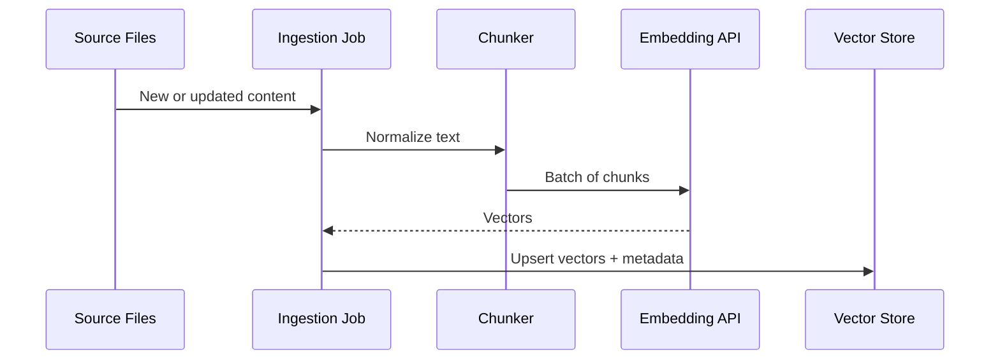

Good pipelines are boring in the right ways:

- idempotent: running twice does not create duplicates
- traceable: every vector links back to source
- versioned: model changes are explicit
- observable: failures and latency are logged

### Batching

Embedding APIs are priced and rate-limited per request. Batching improves throughput and lowers overhead.

Guidelines:

- batch dozens or hundreds of chunks per request when the API allows it
- respect token limits per request
- retry transient failures with backoff
- store the original text alongside the vector so you do not need to re-chunk during re-embedding

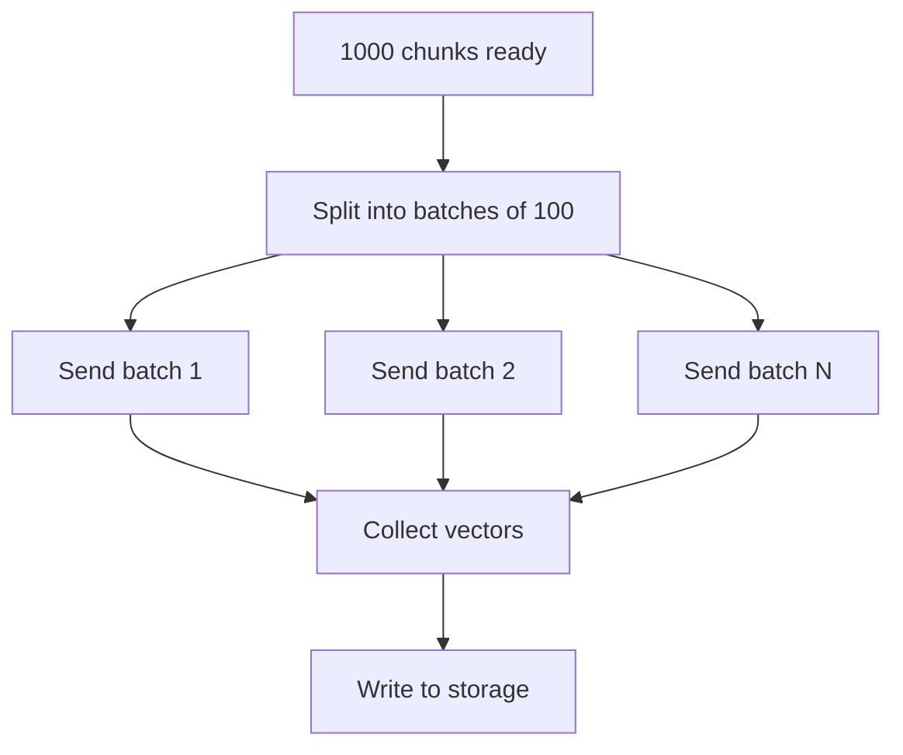

### Normalization

Many systems normalize vectors before storage or comparison.

Why normalize:

- cosine similarity becomes a simple dot product on unit vectors
- vector magnitude differences interfere less with ranking
- some databases assume normalized inputs

Normalization means scaling a vector so its length equals 1. This is especially useful when you store millions of vectors and want consistent scoring behavior.

### Dimensionality

Higher dimensionality can capture more nuance, but it also increases storage and compute.

| Dimension | Effect |
| --- | --- |
| Lower | Cheaper storage, faster search, less nuance |
| Higher | Better semantic separation, more memory and cost |

Some APIs let you reduce dimensions with only modest quality loss. That can be a smart cost optimization after you measure retrieval quality.

Do not choose dimensionality randomly. Benchmark with real queries from your product.

### Use cases

Embeddings are the right abstraction for many retrieval-adjacent tasks.

| Use case | What embeddings do | Example |
| --- | --- | --- |
| Semantic search | Rank content by meaning | Help center search |
| Clustering | Group similar items | Support ticket themes |
| Deduplication | Detect near-duplicates | FAQ cleanup |
| Recommendations | Find similar users or items | Playlist suggestions |
| RAG preparation | Retrieve context for generation | Internal knowledge assistant |
| Classification support | Compare to labeled examples | Routing support requests |

### Limitations

Embeddings are powerful, but they are not intelligence.

Important limitations:

- **No reasoning:** similar vectors do not guarantee factual correctness
- **Stale embeddings:** if the source document changes, old vectors lie
- **Entity confusion:** distinct items with similar wording can appear close
- **Domain drift:** a general model may underperform on legal, medical, or internal jargon
- **No permissions by themselves:** vectors do not enforce access control
- **Opacity:** it is harder to explain why a match occurred than with keyword search

If a system needs multi-step logic, arithmetic, or strict symbolic lookup, embeddings alone are not enough.

### Cost

Embedding cost usually comes from four places:

1. API fees per token or per request
2. compute for self-hosted models
3. storage for vectors and metadata
4. re-embedding when content or models change

Cost control strategies:

- chunk only what you need
- batch aggressively
- cache embeddings for unchanged content
- use smaller models when quality remains acceptable
- avoid re-embedding entire collections without a migration plan

### When should you use embeddings?

Use embeddings when:

- users search with natural language
- paraphrases and synonyms matter
- you need similarity, clustering, or retrieval
- you are preparing a RAG system

### When should you not use embeddings?

Do not use embeddings when:

- exact identifiers are the primary lookup key
- the dataset is tiny and a simple keyword index is enough
- the task is mostly symbolic or rule-based
- explainability and exact matching are more important than semantic recall
- content changes constantly and you cannot afford fresh vectors

## Visual Learning

### Meaning Space

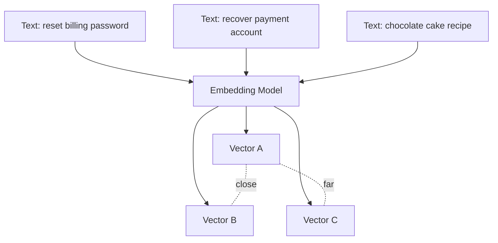

### Semantic vs Keyword Search

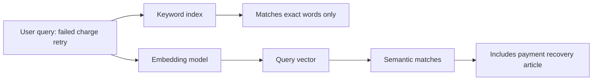

### Chunking Pipeline

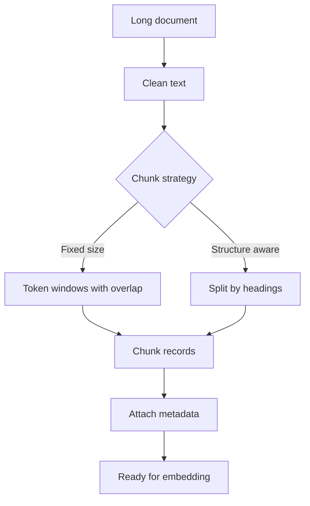

### Decision Tree

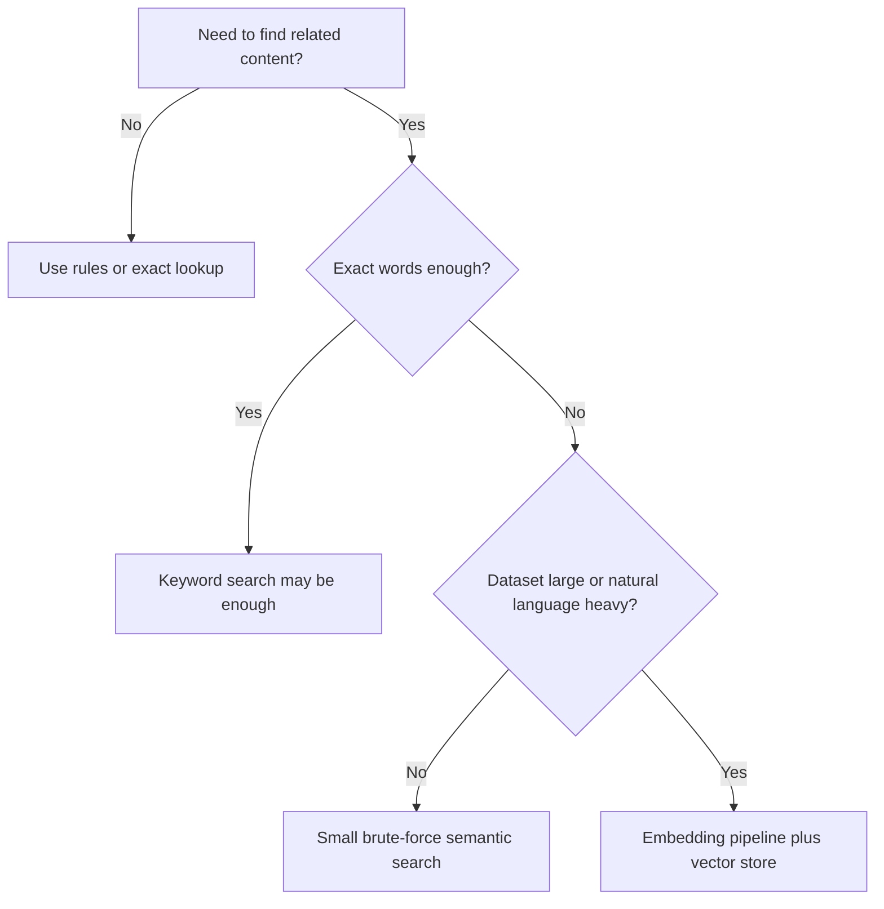

### Mental Model

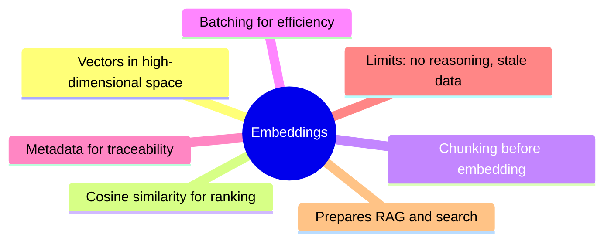

## Code Walkthrough

The examples below are intentionally explicit. The goal is to understand the moving parts before you hide them inside frameworks.

### Python Example: Cosine Similarity

```python
from math import sqrt


def cosine_similarity(vector_a, vector_b):
    """Return cosine similarity between two equal-length vectors."""
    dot_product = sum(a * b for a, b in zip(vector_a, vector_b))
    magnitude_a = sqrt(sum(a * a for a in vector_a))
    magnitude_b = sqrt(sum(b * b for b in vector_b))

    if magnitude_a == 0 or magnitude_b == 0:
        return 0.0

    return dot_product / (magnitude_a * magnitude_b)


query = [0.90, 0.10, 0.20]
doc_password = [0.88, 0.12, 0.18]
doc_recipe = [0.05, 0.20, 0.95]

print(cosine_similarity(query, doc_password))
print(cosine_similarity(query, doc_recipe))
```

#### Code Explanation

- `cosine_similarity` computes the core ranking function used in semantic search.
- `dot_product` measures directional alignment between vectors.
- `magnitude_a` and `magnitude_b` normalize for vector length.
- `query` stands in for an embedded user question.
- `doc_password` and `doc_recipe` simulate two stored chunks.
- the first print should be higher, showing meaning-based closeness.

### TypeScript Example: Cosine Similarity

```typescript
function cosineSimilarity(vectorA: number[], vectorB: number[]): number {
  let dotProduct = 0;
  let magnitudeA = 0;
  let magnitudeB = 0;

  for (let index = 0; index < vectorA.length; index += 1) {
    dotProduct += vectorA[index] * vectorB[index];
    magnitudeA += vectorA[index] * vectorA[index];
    magnitudeB += vectorB[index] * vectorB[index];
  }

  if (magnitudeA === 0 || magnitudeB === 0) {
    return 0;
  }

  return dotProduct / (Math.sqrt(magnitudeA) * Math.sqrt(magnitudeB));
}

const query = [0.9, 0.1, 0.2];
const docPassword = [0.88, 0.12, 0.18];
const docRecipe = [0.05, 0.2, 0.95];

console.log(cosineSimilarity(query, docPassword));
console.log(cosineSimilarity(query, docRecipe));
```

#### Code Explanation

- `cosineSimilarity` mirrors the Python ranking function.
- the `for` loop keeps the math easy to read and debug.
- `query`, `docPassword`, and `docRecipe` simulate retrieval candidates.
- this function is the heart of many demo retrieval systems before a vector database is added.

### Python Example: Normalize a Vector

```python
from math import sqrt


def normalize(vector):
    """Scale a vector to unit length."""
    magnitude = sqrt(sum(value * value for value in vector))

    if magnitude == 0:
        return vector

    return [value / magnitude for value in vector]


raw_vector = [3.0, 4.0]
unit_vector = normalize(raw_vector)

print(unit_vector)
print(sqrt(sum(value * value for value in unit_vector)))
```

#### Code Explanation

- `normalize` scales a vector so its length becomes 1.
- `magnitude` is the vector length before scaling.
- `raw_vector` uses simple numbers so the result is easy to inspect.
- the final print should be close to `1.0`, confirming normalization.

### TypeScript Example: Normalize a Vector

```typescript
function normalize(vector: number[]): number[] {
  let magnitude = 0;

  for (const value of vector) {
    magnitude += value * value;
  }

  magnitude = Math.sqrt(magnitude);

  if (magnitude === 0) {
    return vector;
  }

  return vector.map((value) => value / magnitude);
}

const rawVector = [3, 4];
const unitVector = normalize(rawVector);

console.log(unitVector);
```

#### Code Explanation

- `normalize` prepares vectors for cosine-like comparisons.
- `map` applies the same scale factor to every dimension.
- storing normalized vectors can simplify later ranking logic.

### Python Example: Chunk Text with Overlap

```python
def chunk_text(text, chunk_size=40, overlap=10):
    """Split text into fixed-size chunks with overlap."""
    chunks = []
    start = 0

    while start < len(text):
        end = start + chunk_size
        chunks.append(text[start:end])
        start += chunk_size - overlap

    return chunks


note = (
    "Embeddings turn meaning into vectors. "
    "Chunking keeps retrieval precise. "
    "Metadata makes results traceable."
)

for index, chunk in enumerate(chunk_text(note, chunk_size=35, overlap=8)):
    print(index, chunk)
```

#### Code Explanation

- `chunk_text` breaks long content into retrievable pieces.
- `chunk_size` controls how much text each vector will represent.
- `overlap` helps preserve context across boundaries.
- `note` simulates a study note with multiple ideas.
- the loop prints chunk index and content for inspection.

### TypeScript Example: Chunk Text with Overlap

```typescript
function chunkText(text: string, chunkSize = 40, overlap = 10): string[] {
  const chunks: string[] = [];
  let start = 0;

  while (start < text.length) {
    const end = start + chunkSize;
    chunks.push(text.slice(start, end));
    start += chunkSize - overlap;
  }

  return chunks;
}

const note =
  'Embeddings turn meaning into vectors. Chunking keeps retrieval precise. Metadata makes results traceable.';

chunkText(note, 35, 8).forEach((chunk, index) => {
  console.log(index, chunk);
});
```

#### Code Explanation

- `chunkText` follows the same policy as the Python version.
- `slice` extracts each chunk from the original note.
- consistent chunking rules matter as much as the embedding model itself.

### Python Example: Batch Embeddings with OpenAI

```python
import os
from openai import OpenAI

client = OpenAI(api_key=os.environ["OPENAI_API_KEY"])

chunks = [
    "How to reset your billing password.",
    "How to retry a failed payment.",
    "Course schedule for week 3.",
]

response = client.embeddings.create(
    model="text-embedding-3-small",
    input=chunks,
)

for item in response.data:
    print(item.index, len(item.embedding), item.embedding[:4])
```

#### Code Explanation

- `OpenAI` creates the API client used for embedding requests.
- `chunks` is a batch of texts embedded in one call.
- `model` must stay consistent across the collection.
- `response.data` returns one vector per input item.
- printing the first few values helps verify that vectors were generated.

### TypeScript Example: Batch Embeddings with OpenAI

```typescript
import OpenAI from 'openai';

const client = new OpenAI({
  apiKey: process.env.OPENAI_API_KEY,
});

const chunks = [
  'How to reset your billing password.',
  'How to retry a failed payment.',
  'Course schedule for week 3.',
];

const response = await client.embeddings.create({
  model: 'text-embedding-3-small',
  input: chunks,
});

for (const item of response.data) {
  console.log(item.index, item.embedding.length, item.embedding.slice(0, 4));
}
```

#### Code Explanation

- `embeddings.create` sends a batch request to the provider.
- `input` accepts an array, which is more efficient than one request per chunk.
- `item.embedding.length` shows the dimensionality chosen by the model.
- production code should also store metadata and handle rate limits.

### Python Example: Simple Semantic Search

```python
def search(query_vector, records, top_k=3):
    """Return top-k records ranked by cosine similarity."""
    ranked = []

    for record in records:
        score = cosine_similarity(query_vector, record["vector"])
        ranked.append({**record, "score": score})

    ranked.sort(key=lambda item: item["score"], reverse=True)
    return ranked[:top_k]


records = [
    {
        "id": "chunk-1",
        "text": "Retry a failed payment from billing settings.",
        "vector": [0.91, 0.10, 0.19],
    },
    {
        "id": "chunk-2",
        "text": "Chocolate cake recipe with cocoa powder.",
        "vector": [0.08, 0.18, 0.94],
    },
]

results = search([0.90, 0.11, 0.21], records)

for result in results:
    print(result["id"], f"{result['score']:.3f}", result["text"])
```

#### Code Explanation

- `search` implements the simplest possible semantic retrieval loop.
- `records` simulates a vector collection before Day 16 storage tooling.
- `top_k` limits how many results the app returns.
- `ranked.sort` orders results by meaning-based similarity.
- this is the logic later accelerated by vector databases.

### TypeScript Example: Simple Semantic Search

```typescript
type RecordItem = {
  id: string;
  text: string;
  vector: number[];
};

function search(queryVector: number[], records: RecordItem[], topK = 3) {
  return records
    .map((record) => ({
      ...record,
      score: cosineSimilarity(queryVector, record.vector),
    }))
    .sort((left, right) => right.score - left.score)
    .slice(0, topK);
}

const records: RecordItem[] = [
  {
    id: 'chunk-1',
    text: 'Retry a failed payment from billing settings.',
    vector: [0.91, 0.1, 0.19],
  },
  {
    id: 'chunk-2',
    text: 'Chocolate cake recipe with cocoa powder.',
    vector: [0.08, 0.18, 0.94],
  },
];

console.log(search([0.9, 0.11, 0.21], records));
```

#### Code Explanation

- `search` ranks items by semantic similarity.
- `map` adds a `score` field to each record.
- `slice` returns only the top results.
- this pattern is the bridge between raw embeddings and user-facing search.

### Python Example: Deduplication by Similarity

```python
def is_duplicate(vector_a, vector_b, threshold=0.92):
    """Return True when two chunks are near-duplicates."""
    return cosine_similarity(vector_a, vector_b) >= threshold


candidate = [0.90, 0.12, 0.18]
existing = [0.91, 0.11, 0.19]

print(is_duplicate(candidate, existing))
```

#### Code Explanation

- `is_duplicate` uses a similarity threshold instead of exact string matching.
- `threshold` should be tuned on real data.
- deduplication prevents bloated indexes and repeated search results.

### TypeScript Example: Embedding Pipeline Record

```typescript
type ChunkRecord = {
  id: string;
  text: string;
  vector: number[];
  metadata: {
    source: string;
    lesson: string;
    chunkIndex: number;
    embeddingModel: string;
    createdAt: string;
  };
};

const chunkRecord: ChunkRecord = {
  id: 'day15-chunk-03',
  text: 'Cosine similarity measures directional alignment between vectors.',
  vector: [0.12, 0.44, 0.81],
  metadata: {
    source: 'day_15_embeddings.md',
    lesson: 'day_15',
    chunkIndex: 3,
    embeddingModel: 'text-embedding-3-small',
    createdAt: '2026-07-07T00:00:00Z',
  },
};

console.log(chunkRecord);
```

#### Code Explanation

- `ChunkRecord` shows the minimum useful storage shape.
- `metadata` makes vectors debuggable and filterable later.
- `embeddingModel` documents which model produced the vector.
- good records are traceable from search result back to source text.

## Practical Examples

### Beginner Example: Search study notes by meaning

A student asks, "What did we learn about context limits?" even though the note says "context window."

A keyword search may fail. An embedding search can still return the right chunk because the concepts are close in vector space.

Why it works:

- the query and note share meaning
- exact wording is not required
- chunk size stays small enough to be precise

### Intermediate Example: Support article retrieval

A SaaS company embeds help articles about billing, SSO, and API usage. A user asks, "My charge failed twice."

The system retrieves payment-recovery content even if the article never uses the phrase "charge failed."

What could go wrong:

- one article covers multiple topics in a single huge chunk
- outdated pricing text remains embedded after a product change
- the wrong language version is stored in the same collection

### Professional Example: Enterprise knowledge base

A company indexes policies, contracts, and internal runbooks. The embedding pipeline must:

- preserve document IDs and section titles
- batch thousands of chunks overnight
- version the embedding model explicitly
- skip confidential content that should never be indexed

Here, embeddings are not a demo feature. They are part of the information architecture.

## Best Practices

- chunk before embedding, not after storing whole files
- keep one embedding model per collection
- store source text, metadata, and model version with every vector
- batch requests to reduce cost and latency overhead
- normalize vectors when your scoring strategy expects it
- evaluate with real user queries, not toy paraphrases only
- re-embed content when the source changes materially
- separate ingestion jobs from online query traffic
- log chunk counts, token counts, and failures per ingestion run
- design for idempotent upserts so retries are safe

## Common Mistakes

- treating embeddings like miniature language models
- embedding entire PDFs as one vector
- mixing vectors from different models in one index
- forgetting overlap near section boundaries
- skipping metadata and then wondering why debugging is hard
- assuming high similarity means factual correctness
- never re-embedding after content or model changes
- building search without a manual inspection step

### Debugging Strategy

When semantic search feels weak, inspect in this order:

1. Are chunks the right size and scope?
2. Is the embedding model appropriate for the domain?
3. Are vectors fresh and from one consistent model?
4. Are queries too vague or too short?
5. Is keyword search actually the better tool for this lookup?

## Performance

Embedding systems are usually judged by latency, cost, quality, and freshness.

### Latency

Latency comes from:

- embedding the query at search time
- comparing or retrieving vectors
- any reranking after initial retrieval

You can reduce latency by:

- caching frequent query embeddings
- precomputing document vectors during ingestion
- using smaller models when quality remains acceptable

### Cost

Track cost per:

- million tokens embedded
- chunk stored
- query embedded
- full re-embedding event

A migration from one model to another can be expensive. Plan it like a database migration, not a casual config change.

### Scalability

As collections grow:

- batch ingestion becomes mandatory
- storage size rises with dimensionality
- stale-content detection becomes a scheduled job
- brute-force similarity stops being acceptable, which is why Day 16 matters

## Security

Embeddings do not remove security responsibilities.

- do not embed secrets or credentials
- treat retrieved text as untrusted input for downstream models
- enforce access control outside the vector itself
- define retention and deletion rules for embedded personal data
- log who searched what when the content is sensitive

## Exercises

### Easy

Explain what an embedding is in one sentence.

### Medium

Describe the difference between semantic search and keyword search.

### Hard

Propose a chunking strategy for technical documentation with code blocks.

### Challenge

Design a re-embedding plan for a collection after a model upgrade.

### Reflection Questions

- When do embeddings feel magical, and when do they feel unreliable?
- Why is chunking a retrieval decision rather than just a preprocessing step?
- What is more dangerous: stale embeddings or weak generation?
- Why should every vector keep a link back to its source text?

## Mini Project

Design an embedding pipeline for a study notes assistant called NoteIndex.

### Goal

Create a complete ingestion design that turns raw notes into searchable vectors.

### Features

- ingest notes from a folder or note export format
- clean text and preserve titles or section headers
- chunk notes with overlap and consistent sizing
- batch-embed chunks with a chosen model
- store vectors with metadata such as subject, week, source file, and model version
- expose a simple search interface that ranks by cosine similarity
- log ingestion stats and failures

### Suggested Folder Structure

```text
noteindex/
├── app/
│   ├── ingest.py
│   ├── chunking.py
│   ├── embeddings.py
│   ├── search.py
│   └── main.py
├── data/
│   └── notes/
├── tests/
│   └── test_chunking.py
└── README.md
```

### Project Steps

1. define supported note formats and metadata fields
2. implement chunking with overlap and section awareness
3. choose an embedding model and document why
4. batch-embed chunks and store records
5. build a query flow that embeds the question and returns top matches
6. test with realistic student questions
7. write a short evaluation note with five good queries and five failure cases

### What You Learn

- how ingestion quality shapes retrieval quality
- why metadata and versioning matter
- how semantic search behaves before a vector database is introduced
- how to prepare for Day 16 storage and indexing

## Historical Background

Embeddings did not begin with ChatGPT. They emerged from decades of work on how to represent language numerically.

### From sparse vectors to dense meaning

Early search systems used sparse representations such as bag-of-words or TF-IDF vectors. These methods were useful, but they treated text more like a list of words than a representation of meaning.

Word2Vec in 2013 showed that neural models could place related words near each other in vector space. GloVe and fastText extended similar ideas. Later, transformer-based models produced contextual embeddings that changed by sentence context, not just by word identity.

That progression led directly to modern sentence and document embeddings used in retrieval systems.

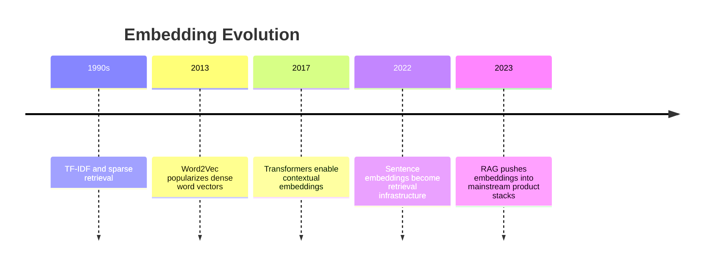

### Why the field evolved this way

The pattern is consistent:

1. search by exact terms
2. search by weighted terms
3. search by learned dense vectors
4. search by vectors plus metadata, filters, and hybrid ranking

Each step solved a weakness of the previous one.

## Case Studies

### Spotify recommendations

Spotify does not only recommend songs with the same genre label. It uses listening behavior, audio features, and embeddings of content relationships to place users and items in meaningful neighborhoods.

The lesson for engineers:

- embeddings help when similarity is fuzzy
- metadata and user behavior still matter
- recommendations are retrieval plus ranking, not magic

### Google semantic search

Google's search experience combines many signals. Over time, semantic understanding became more important for matching queries to useful pages even when the words differ.

The lesson:

- embeddings and semantic retrieval are how large systems handle paraphrase
- keyword signals still matter for exact entities and names
- hybrid systems beat pure semantic or pure lexical search in production

### Notion Q&A

Notion Q&A must find relevant workspace content written in inconsistent styles: meeting notes, docs, tasks, project pages.

The common pattern:

- chunk user content
- embed each chunk
- retrieve the most relevant pieces for a question
- generate an answer grounded in those pieces

The lesson:

- embeddings are the retrieval layer, not the product by themselves
- chunk and metadata quality determine whether Q&A feels smart or sloppy
- stale workspace content produces stale answers

## More Comparison Tables

### Chunking Policy Choices

| Policy | Strength | Risk |
| --- | --- | --- |
| Small chunks | High precision | May lose broader context |
| Large chunks | More context per result | Lower precision, noisier matches |
| Overlap | Better boundary recall | More storage and embedding cost |
| Structure-aware | Respects headings and docs | More parser complexity |

### Embedding Pipeline Maturity

| Stage | What you have | What changes next |
| --- | --- | --- |
| Demo | Manual scripts | Add batching and metadata |
| Prototype | Scheduled ingestion | Add monitoring and retries |
| Production | Versioned re-embedding | Add hybrid search and evaluation |
| Mature platform | Tenant-aware pipelines | Add continuous quality measurement |

### Cost Drivers

| Driver | Why it matters | Control strategy |
| --- | --- | --- |
| Token volume | Direct API cost | Chunk only useful content |
| Dimensionality | Storage and compute | Benchmark smaller dimensions |
| Re-embedding | Migration and refresh cost | Use shadow collections |
| Query volume | Search-time embedding cost | Cache frequent queries |

## More Visual Learning

### RAG Preparation Flow

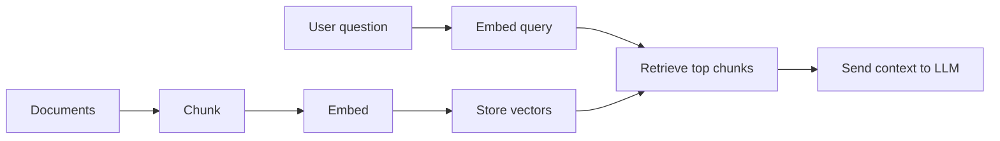

### Ingestion vs Query Path


### Re-embedding Migration

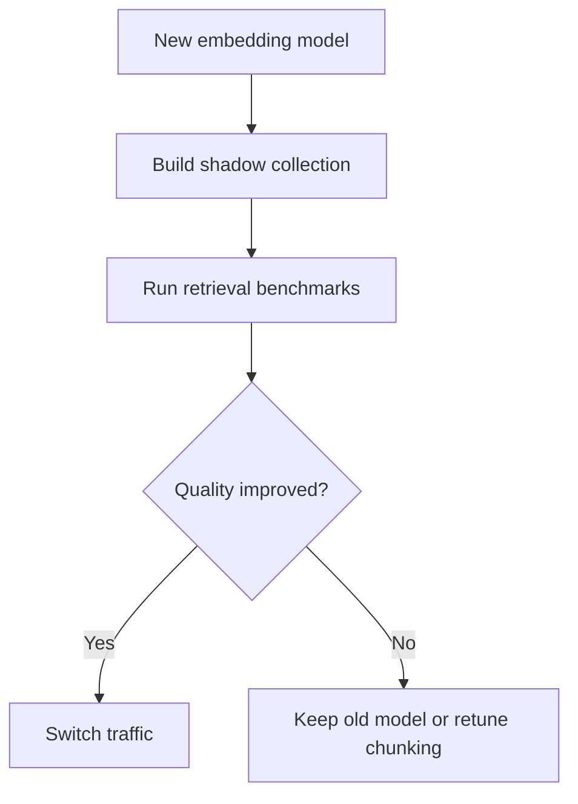

## Additional Code Examples

### Python Example: Similarity Threshold Tuning

```python
def classify_similarity(score):
    if score >= 0.85:
        return "very similar"
    if score >= 0.70:
        return "related"
    return "weak match"


print(classify_similarity(0.91))
print(classify_similarity(0.74))
print(classify_similarity(0.42))
```

#### Why this example matters

- production systems need human-readable bands around raw scores
- thresholds should be calibrated on real data, not copied from tutorials

### TypeScript Example: Batch Builder

```typescript
function buildBatches<T>(items: T[], batchSize: number): T[][] {
  const batches: T[][] = [];

  for (let index = 0; index < items.length; index += batchSize) {
    batches.push(items.slice(index, index + batchSize));
  }

  return batches;
}

const chunks = ['a', 'b', 'c', 'd', 'e'];
console.log(buildBatches(chunks, 2));
```

#### Why this example matters

- ingestion pipelines need predictable batching logic
- separating batch construction from API calls simplifies retries

### Python Example: Hash-Gated Re-embedding

```python
import hashlib


def content_hash(text):
    return hashlib.sha256(text.encode("utf-8")).hexdigest()


def needs_embedding(text, previous_hash):
    return content_hash(text) != previous_hash


print(needs_embedding("Updated billing policy", "old-hash-value"))
```

#### Why this example matters

- re-embedding everything on every run is wasteful
- content hashes help you embed only changed chunks

## Tradeoffs and Tuning

### Chunk Size vs Precision

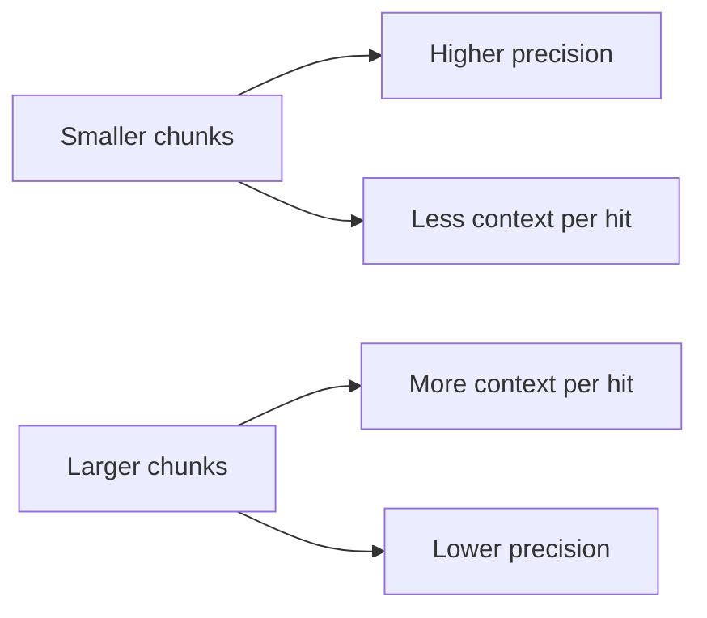

### Model Size vs Cost

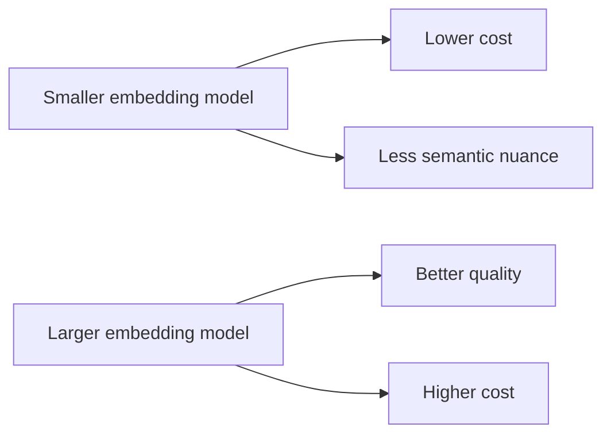

### Freshness vs Throughput

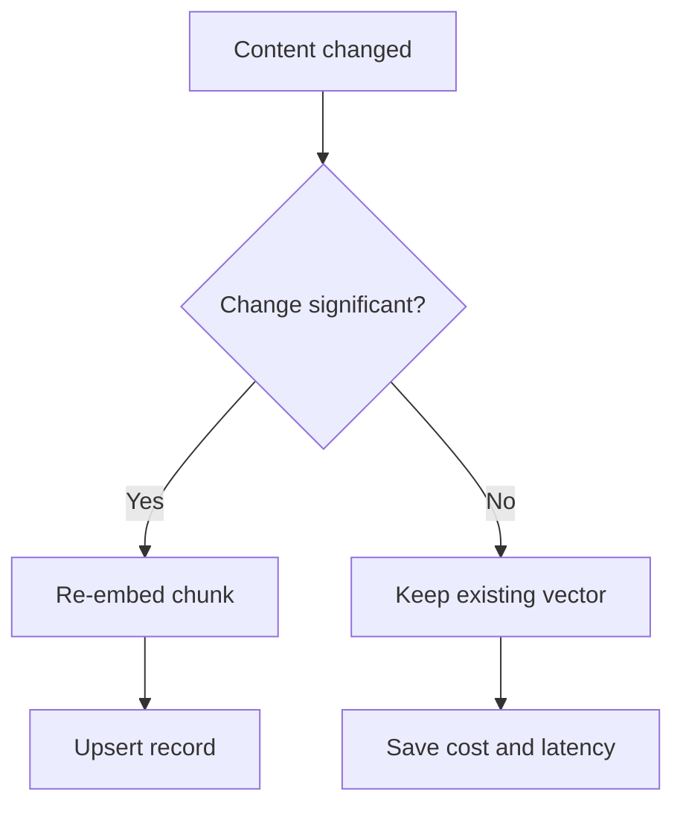

## Production Troubleshooting Checklist

When search quality is disappointing, inspect these items:

1. confirm one embedding model per collection
2. inspect five bad queries manually
3. verify chunk boundaries and overlap
4. check whether source content changed without re-embedding
5. compare semantic results with keyword results
6. measure whether queries are too short or too ambiguous
7. ensure metadata filters are not hiding the right records

## Interview Questions

### Conceptual

- What is an embedding?
- Why is cosine similarity popular for semantic search?
- What is the difference between a chat model and an embedding model?
- Why does chunking affect retrieval quality?
- When would you choose keyword search instead of embeddings?

### System Design

- Design an embedding ingestion pipeline for internal docs.
- How would you migrate from one embedding model to another safely?
- How would you deduplicate FAQ entries using embeddings?
- How would you prepare embeddings for a RAG assistant?

### Debugging

- Why can two chunks look semantically similar but still be wrong retrieval results?
- How do you detect stale embeddings in production?
- How do you evaluate whether the embedding model or the chunking policy is the problem?

## Quizzes

### Quiz 1

1. What does an embedding model output?
2. Why do similar meanings produce nearby vectors?
3. What does cosine similarity measure?
4. Why do we chunk text before embedding?

### Quiz 2

1. What is one advantage of semantic search over keyword search?
2. What is one weakness of semantic search?
3. Why is batching useful in ingestion pipelines?
4. Why should metadata be stored with each vector?

### Quiz 3

1. What happens if you mix vectors from two different embedding models?
2. Why are stale embeddings dangerous?
3. When should you not use embeddings?
4. What is the relationship between embeddings and RAG?

## Expanded Exercises

### Easy

1. Define an embedding in one sentence.
2. Name two embedding use cases.
3. State one limitation of embeddings.
4. What is cosine similarity used for?
5. Why is normalization sometimes helpful?

### Medium

6. Compare keyword search and semantic search with one example each.
7. Explain why chunk overlap can improve retrieval.
8. Describe what metadata should be stored with a chunk vector.
9. Compare OpenAI and open-source embedding options.
10. Explain why embeddings do not guarantee factual correctness.

### Hard

11. Design a chunking policy for legal policies with sections and clauses.
12. Propose a batch ingestion plan for 100,000 note chunks.
13. Describe how to detect near-duplicate FAQ entries with embeddings.
14. Design a shadow migration plan for a new embedding model.
15. Explain how you would evaluate retrieval quality before adding an LLM.

### Challenge

16. Build a small semantic search demo with mock vectors and cosine similarity.
17. Add content-hash based re-embedding to an ingestion script.
18. Create a benchmark set of 20 real user queries with expected source notes.
19. Design a hybrid-ready schema that can support keyword plus vector retrieval later.
20. Estimate embedding cost for a 50,000-chunk knowledge base.

### Reflection

21. What is the most important preprocessing step before embedding?
22. When do embeddings create a false sense of understanding?
23. Why is retrieval evaluation separate from answer evaluation?
24. What would make you choose a local embedding model over a hosted one?
25. Which failure mode is more likely in your own project: bad chunks, bad model, or stale data?
26. How will embeddings change your capstone architecture on Day 16?

## Cumulative Capstone Update

Your capstone should now include an embedding ingestion pipeline that prepares knowledge for retrieval.

Add these items to your capstone plan:

- a document or note ingestion flow for your capstone domain
- a chunking policy with size, overlap, and section handling
- a chosen embedding model with a written justification
- batch embedding jobs for initial content load and updates
- storage records that include source ID, chunk index, model version, and timestamps
- a simple semantic search function that returns top-k chunks with scores
- a re-embedding rule for changed content or model upgrades
- a short retrieval benchmark with real capstone queries

This prepares your capstone for Day 16, when those vectors move into a vector database with indexing, filtering, and scalable search.

## Summary

Embeddings turn meaning into vectors so AI systems can search, cluster, deduplicate, and retrieve content by similarity instead of only by exact words. The core engineering work is not just calling an embedding API. It is designing chunking, batching, normalization, metadata, and freshness rules that make retrieval trustworthy.

The main lesson of this day is simple:

- embeddings give us meaning as numbers
- cosine similarity gives us ranking
- pipelines give us repeatable retrieval preparation

If Day 14 was about building an assistant, Day 15 is about teaching that assistant how to find the right information. Day 16 will teach you how to store and search those vectors at scale.

[Previous: Day 14 - Mini AI Assistant](../day_14/day_14_mini_ai_assistant.md) | [Next: Day 16 - Vector Databases](../day_16/day_16_vector_databases.md)

## Further Reading

- https://platform.openai.com/docs/guides/embeddings
- https://huggingface.co/blog/getting-started-with-embeddings
- https://www.sbert.net/docs/pretrained_models.html
- https://www.pinecone.io/learn/vector-embeddings/
- https://weaviate.io/blog/vector-embeddings-explained
- https://platform.openai.com/docs/guides/embeddings/embedding-models
