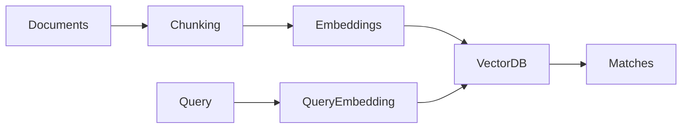

# Day 16 - Vector Databases

[Previous: Day 15 - Embeddings](../day_15/day_15_embeddings.md) | [Next: Day 17 - RAG](../day_17/day_17_rag.md)

## Introduction
A vector database stores embeddings and makes it fast to search by meaning. This is the retrieval layer that powers modern knowledge assistants, semantic search, and many RAG systems.


## Learning Objectives
By the end of this day, you should be able to:

- explain why vector databases exist
- describe indexing and similarity search at a high level
- understand metadata filtering
- compare local and hosted vector stores
- choose a vector database for a small project

## Theory
When you have many embeddings, you need a way to find the closest ones quickly. A vector database handles storage, indexing, and search over high-dimensional vectors.

It often also stores metadata such as source, date, category, or user ID. That makes it possible to combine meaning-based search with business rules.

### Visual Diagram


## Code Examples

### Python
```python
vectors = [
    {"id": "doc-1", "values": [0.1, 0.2, 0.3]},
    {"id": "doc-2", "values": [0.9, 0.4, 0.2]},
]
print(vectors)
```

### TypeScript
```typescript
const vectors = [
  { id: 'doc-1', values: [0.1, 0.2, 0.3] },
  { id: 'doc-2', values: [0.9, 0.4, 0.2] },
];

console.log(vectors);
```

## Best Practices
- keep metadata clean and queryable
- choose an index that matches your scale
- test search quality with real queries
- store source references for traceability
- measure latency as collection size grows

## Common Mistakes
- treating vector search as magic search
- ignoring metadata design
- indexing text that should have been cleaned first
- picking a database before understanding the use case
- not evaluating retrieval results manually

## Exercises
- Easy: Explain what a vector database stores.
- Medium: Describe metadata filtering.
- Hard: Compare a local vector store with a hosted service.
- Challenge: Design a vector schema for research notes.

## Mini Project
Plan a vector database setup for a study assistant. Include chunk IDs, metadata fields, and search behavior.

## Summary
Vector databases make semantic search practical at scale. They are the storage and retrieval backbone for many retrieval-heavy AI applications.

[Previous: Day 15 - Embeddings](../day_15/day_15_embeddings.md) | [Next: Day 17 - RAG](../day_17/day_17_rag.md)

## Additional Resources
- https://www.pinecone.io/learn/
- https://docs.trychroma.com/
- https://qdrant.tech/documentation/
