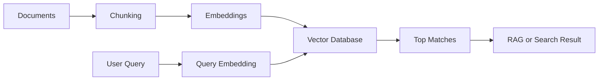
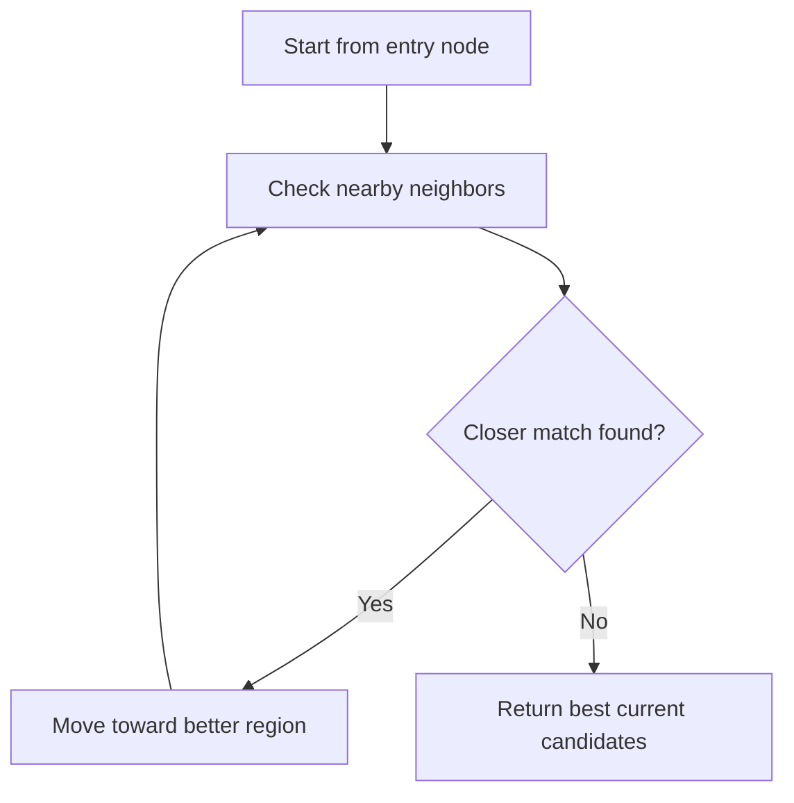
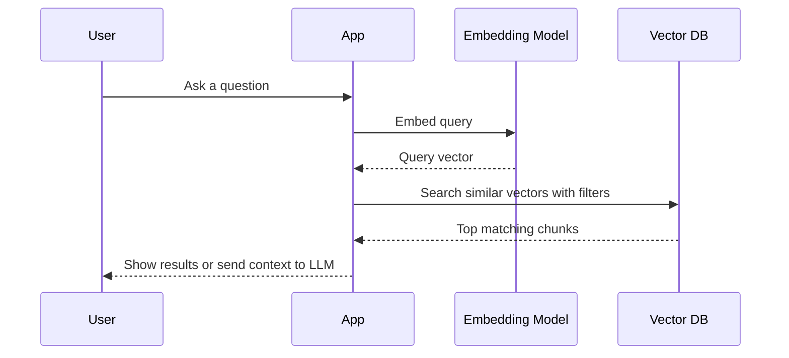
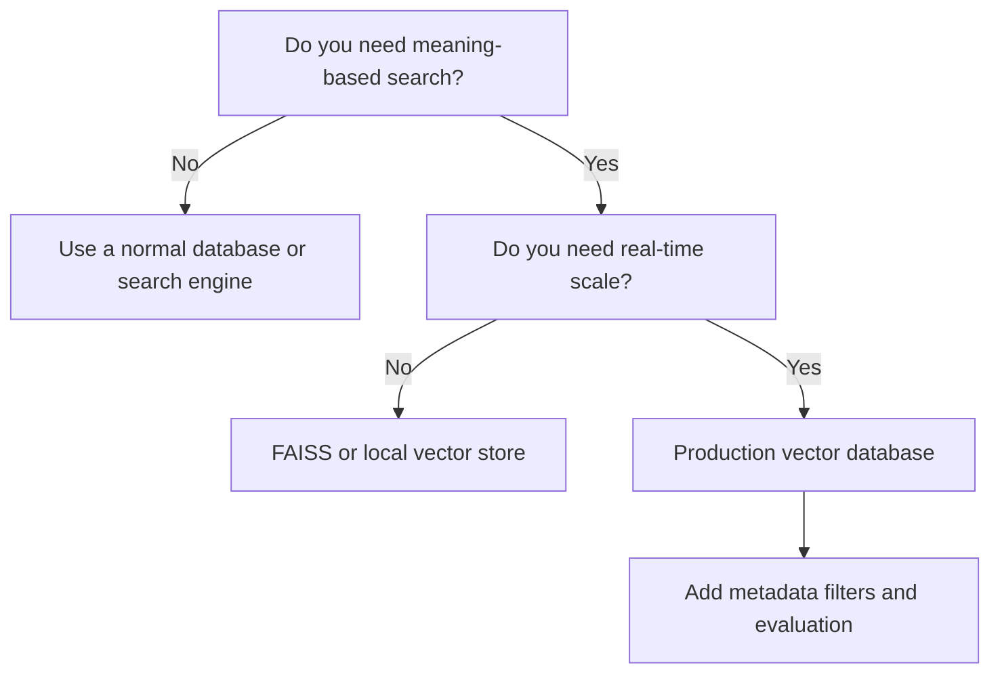
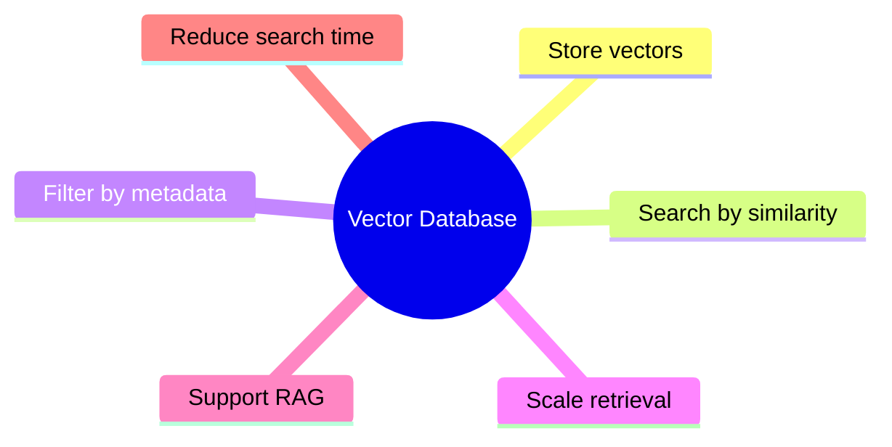

# Day 16 - Vector Databases

[Previous: Day 15 - Embeddings](../day_15/day_15_embeddings.md) | [Next: Day 17 - RAG](../day_17/day_17_rag.md)

## Introduction
Yesterday we learned that embeddings turn meaning into numbers. Today we answer the next question: where do we store those numbers, how do we search them, and how do we do it fast enough for real applications?

A vector database is a system that stores vectors, indexes them, filters them with metadata, and returns the most similar matches for a query. This is the retrieval engine behind semantic search, knowledge assistants, recommendation systems, and most RAG pipelines.


Think of it like a very large library with two kinds of labels:

- the normal library labels such as title, author, date, and category
- the meaning labels, which are embeddings that capture what the content is about

A regular database is good at exact matches. A vector database is good at meaning-based matches. In production, we often need both.

## Learning Objectives
By the end of this day, you should be able to:

- explain what a vector database is and why it exists
- describe brute-force search and approximate nearest neighbor search
- understand how indexes like HNSW and IVF help speed up retrieval
- use metadata filters to narrow search results
- compare local and hosted vector stores
- choose a vector database for a small or medium AI project
- explain when vector search is the right tool and when it is not

## Prerequisites
You should already understand:

- Day 15: Embeddings
- basic Python or TypeScript syntax
- the idea of similarity search
- why chunking matters in retrieval systems

If any of those feel new, go back and review Day 15 first. Vector databases make much more sense after you understand embeddings.

## Big Picture
Vector databases sit between content ingestion and answer generation.



The important idea is this:

- embeddings convert text into vectors
- the vector database stores and searches those vectors
- retrieval systems use the matches to ground answers, rank content, or recommend items

Without a vector database, you can still compute similarities, but only by scanning everything one by one. That becomes too slow as your collection grows.

## Deep Theory

### What problem does a vector database solve?
Suppose you have 10,000 support articles. A user asks, “How do I reset my billing account after a failed payment?”

A keyword search may miss the answer if the article uses different words like “payment retry” or “account recovery.” A vector search can still find it because the query and the article may be close in meaning.

Now imagine doing that for 1 million chunks. If you compare the query vector with every stored vector, the search will eventually become too slow.

That is the core reason vector databases exist:

1. store vectors efficiently
2. search them quickly
3. combine meaning with metadata rules
4. scale beyond tiny demos

### How vector search works internally
At a high level, the process is:

1. create an embedding for each document chunk
2. store the vector plus metadata
3. create an embedding for the user query
4. compare the query vector with stored vectors using a similarity metric
5. return the best matches

The similarity metric is usually one of these:

| Metric | What it measures | Common use |
| --- | --- | --- |
| Cosine similarity | Angle between vectors | Semantic search |
| Dot product | Alignment and magnitude | Retrieval and ranking |
| Euclidean distance | Straight-line distance | Some clustering and nearest-neighbor tasks |

Cosine similarity is popular because it focuses on direction rather than raw vector length. In embeddings, direction often matters more than magnitude.

### Why not just scan everything?
Brute-force search checks every vector. That is simple, accurate, and easy to understand. The problem is speed.

If you have $N$ vectors, brute-force search is roughly $O(N)$ per query. That means the cost grows linearly as your collection grows.

Vector databases usually use approximate nearest neighbor indexes to reduce search time. The result is not always mathematically perfect, but it is usually good enough and dramatically faster.

### Approximate Nearest Neighbor search
ANN search trades a little accuracy for a lot of speed.

Instead of comparing the query with every vector, the database uses an index that narrows the search space. Common approaches include:

- HNSW, which builds a graph of nearby vectors
- IVF, which clusters vectors and searches only the most relevant clusters
- PQ, which compresses vectors to reduce memory use

The right index depends on your scale, latency needs, and accuracy goals.

### HNSW in simple terms
HNSW means Hierarchical Navigable Small World.

The idea is to create a graph where each vector is connected to nearby vectors. To find a good match, the system starts from a useful entry point and walks through the graph toward better neighbors.



Why it helps:

- it avoids checking every vector
- it works well for dynamic datasets
- it often gives strong recall with good speed

### IVF in simple terms
IVF means Inverted File Index.

It groups vectors into clusters first. When a query arrives, the system searches only the most relevant clusters.

This is like asking a librarian to check only the right shelf area instead of the whole building.

### Compression and quantization
Large vector collections can consume a lot of memory. Compression techniques reduce storage cost by representing vectors more compactly.

That helps when:

- your dataset is very large
- memory is expensive
- you need higher throughput

The tradeoff is usually a small drop in precision.

### Metadata is not optional
Vectors alone are not enough.

Metadata lets you ask questions like:

- only search documents from 2025
- only search content tagged as finance
- only search chunks from one customer account
- only search results the current user is allowed to see

This is why the best systems treat vector search and metadata filtering as one combined retrieval strategy.

### When should you use a vector database?
Use one when you need any of these:

- semantic search
- RAG
- recommendation or similarity matching
- deduplication by meaning
- clustering and organization of content
- multimodal retrieval such as image or audio similarity

### When should you not use one?
Do not use one when:

- you only need exact lookups by ID
- your dataset is tiny and brute force is simpler
- a normal SQL query already solves the problem
- you need strict transactional reporting, not similarity search

Vector search is powerful, but it is not a replacement for every database.

### Advantages
- semantic search works better than keyword search for many tasks
- retrieval can scale to large collections
- metadata filtering adds business control
- many databases support hybrid search and filters
- vector stores fit naturally into RAG systems

### Limitations
- approximate search can miss some results
- vector quality depends on embedding quality
- poor chunking leads to poor retrieval
- indexes add complexity
- storage and query costs can rise with scale

### Alternatives
- PostgreSQL with pgvector for teams that already use Postgres
- FAISS for local or research setups
- Elasticsearch or OpenSearch for hybrid keyword and vector search
- Chroma for small prototypes and local development
- Qdrant, Weaviate, Pinecone, and Milvus for more production-focused retrieval

### Best fit by scenario
| Scenario | Better choice |
| --- | --- |
| Quick prototype | Chroma or FAISS |
| Existing SQL stack | PostgreSQL with pgvector |
| Strong filtering and production retrieval | Qdrant or Weaviate |
| Managed cloud service | Pinecone |
| Hybrid keyword plus vector search | OpenSearch or Elasticsearch |

## Visual Learning

### Retrieval Pipeline


### Decision Tree


### Mental Model


## Code Walkthrough

The examples below are intentionally simple. The goal is to understand the moving parts, not to hide them behind a framework.

### Python Example: Local Vector Search with Metadata
```python
from math import sqrt


def cosine_similarity(vector_a, vector_b):
    """Return cosine similarity between two equal-length vectors."""
    dot_product = sum(a * b for a, b in zip(vector_a, vector_b))
    magnitude_a = sqrt(sum(a * a for a in vector_a))
    magnitude_b = sqrt(sum(b * b for b in vector_b))

    if magnitude_a == 0 or magnitude_b == 0:
        return 0.0

    return dot_product / (magnitude_a * magnitude_b)


documents = [
    {
        "id": "doc-1",
        "text": "How to reset your billing password.",
        "vector": [0.92, 0.10, 0.18],
        "metadata": {"topic": "billing", "source": "help-center"},
    },
    {
        "id": "doc-2",
        "text": "How to update your email address.",
        "vector": [0.15, 0.88, 0.12],
        "metadata": {"topic": "account", "source": "help-center"},
    },
    {
        "id": "doc-3",
        "text": "How to retry a failed payment.",
        "vector": [0.88, 0.12, 0.20],
        "metadata": {"topic": "billing", "source": "faq"},
    },
]

query_vector = [0.90, 0.11, 0.21]
topic_filter = "billing"

matches = []

for document in documents:
    if document["metadata"]["topic"] != topic_filter:
        continue

    score = cosine_similarity(query_vector, document["vector"])
    matches.append({"id": document["id"], "text": document["text"], "score": score})

matches.sort(key=lambda item: item["score"], reverse=True)

print("Top matches:")
for match in matches:
    print(f"{match['id']}: {match['score']:.3f} - {match['text']}")
```

#### Code Explanation
- `cosine_similarity` measures how close two vectors point in the same direction.
- `documents` acts like a tiny vector collection.
- each item has an `id`, a `text` field, a `vector`, and `metadata`.
- `query_vector` represents the user question after embedding.
- `topic_filter` shows how metadata filters narrow search before ranking.
- the `for` loop skips documents that do not match the filter.
- `score` computes semantic closeness.
- `matches.sort(...)` puts the most relevant result first.
- the final loop prints the ranked search result.

This is the logic a vector database automates for you at scale.

### TypeScript Example: Query Preparation and Ranking
```typescript
type DocumentItem = {
  id: string;
  text: string;
  vector: number[];
  metadata: {
    topic: string;
    source: string;
  };
};

function cosineSimilarity(vectorA: number[], vectorB: number[]): number {
  let dotProduct = 0;
  let magnitudeA = 0;
  let magnitudeB = 0;

  for (let index = 0; index < vectorA.length; index += 1) {
    dotProduct += vectorA[index] * vectorB[index];
    magnitudeA += vectorA[index] * vectorA[index];
    magnitudeB += vectorB[index] * vectorB[index];
  }

  if (magnitudeA === 0 || magnitudeB === 0) {
    return 0;
  }

  return dotProduct / (Math.sqrt(magnitudeA) * Math.sqrt(magnitudeB));
}

const documents: DocumentItem[] = [
  {
    id: 'doc-1',
    text: 'How to reset your billing password.',
    vector: [0.92, 0.1, 0.18],
    metadata: { topic: 'billing', source: 'help-center' },
  },
  {
    id: 'doc-2',
    text: 'How to update your email address.',
    vector: [0.15, 0.88, 0.12],
    metadata: { topic: 'account', source: 'help-center' },
  },
];

const queryVector = [0.9, 0.11, 0.21];
const results = documents
  .filter((document) => document.metadata.topic === 'billing')
  .map((document) => ({
    id: document.id,
    text: document.text,
    score: cosineSimilarity(queryVector, document.vector),
  }))
  .sort((left, right) => right.score - left.score);

console.log(results);
```

#### Code Explanation
- `DocumentItem` defines the shape of one stored item.
- `cosineSimilarity` is the ranking function.
- `documents` simulates a small in-memory collection.
- `filter(...)` applies metadata constraints first.
- `map(...)` computes similarity scores for the remaining items.
- `sort(...)` ranks the most relevant result first.

In a real app, the vector database does the filtering, ranking, and index lookup for you.

## Practical Examples

### Beginner Example
You are building a study notes search app for a class. The user types “exam schedule for week 4.” The system embeds the query, searches the note embeddings, and returns the most similar note chunks.

Why this helps:

- students do not need exact wording
- notes can be searched by meaning
- the app becomes much more useful than keyword search alone

### Intermediate Example
You are building a customer support assistant. Each ticket is stored with metadata such as product line, language, and creation date.

When a user asks a question, you first filter by language and product, then rank the most relevant vector matches. This reduces noise and improves answer quality.

### Professional Example
You are building a legal research assistant for an enterprise. The system must:

- store millions of chunks
- enforce access control per user group
- support fast retrieval with low latency
- keep source references for every answer
- evaluate recall and precision regularly

In this case, the vector database is not a nice extra. It is part of the core product architecture.

### Real-World Company Example
A SaaS company may store help articles, product docs, release notes, and support history in a vector database. Their assistant can then answer questions like:

- “How do I connect SSO?”
- “Why was my invoice rejected?”
- “What changed in the latest API version?”

The system uses semantic search to find relevant context, then a language model to generate a helpful response.

## Best Practices
- chunk content before embedding it
- store stable IDs for every chunk
- keep metadata clean and consistent
- choose the simplest index that meets your latency target
- test retrieval with real user questions, not only toy examples
- separate retrieval evaluation from generation evaluation
- store source references so answers can be traced back
- cache frequent queries when the data does not change often
- version your embedding model and index settings
- monitor recall, latency, and cost together

## Common Mistakes
- treating vector search like magic search
- skipping metadata design
- using one giant chunk for everything
- choosing a database before understanding the workload
- forgetting to re-embed content after changing the embedding model
- ignoring access control and data privacy
- asking the model to compensate for weak retrieval
- not checking whether the top result is actually useful

### Debugging Strategy
When retrieval quality is bad, check the system in this order:

1. Are the chunks clean and meaningful?
2. Are the embeddings from the right model?
3. Are metadata filters too strict or too loose?
4. Is the index configured for the right scale?
5. Are you evaluating with real user queries?

This order matters because the problem is often not the database itself. It is usually the data going into it.

## Performance

Vector databases are often judged by four numbers:

- latency
- cost
- memory use
- retrieval quality

### Latency
Latency is the time between the user query and the returned matches.

You can improve latency by:

- using an ANN index
- reducing collection size with filters
- caching common queries
- storing vectors with the right dimension
- avoiding unnecessary post-processing

### Cost
Cost grows when:

- you store many vectors
- you re-embed content often
- you use a managed service at large scale
- your index is memory heavy

The cheapest system is not always the best system. The right question is whether the retrieval quality justifies the cost.

### Memory
Vector collections can grow fast.

If you store millions of chunks, memory becomes a major concern. That is why systems use compression, sharding, and compact indexes.

### Scalability
To scale retrieval, teams often:

- shard by tenant or domain
- keep hot data in faster storage
- use hybrid search to reduce noise
- add separate indexes for different collections
- batch ingestion jobs instead of writing one vector at a time

### Token Optimization
Vector databases help reduce token waste downstream.

Instead of sending an entire document to the model, you retrieve only the most relevant chunks. That lowers context size, speeds up generation, and cuts API cost.

## Security

Security matters in retrieval systems because they often handle private content.

### Prompt Injection
If retrieved documents contain malicious instructions, the language model may follow them unless your system is careful.

Protect against this by:

- separating retrieved facts from instructions
- using system prompts that define trust boundaries
- sanitizing untrusted text
- limiting what the model can do with retrieved content

### Secrets and API Keys
Do not store secrets in vector content.

If a secret gets embedded and indexed, it can become searchable in ways you did not intend.

### Authentication and Authorization
Users should only retrieve data they are allowed to access.

Metadata filters are often used to enforce tenant or role-based access. That is useful, but it is not enough by itself. Access control should also exist at the application and service layer.

### Data Privacy
If you index customer data, personal information, or internal documents, make sure your retention and deletion policies are clear.

### Hallucinations and Model Safety
Even with a great vector database, the final answer can still be wrong if the language model overstates what it found.

To reduce that risk:

- show sources
- keep the generation prompt grounded
- ask the model to say when it is unsure
- evaluate answers against source documents

## Exercises

### Easy
Explain what a vector database stores and why it is useful.

### Medium
Describe how metadata filters improve retrieval quality.

### Hard
Compare brute-force search, HNSW, and IVF in simple words.

### Challenge
Design a vector retrieval schema for a company knowledge base. Include chunk IDs, metadata fields, filters, and source tracking.

### Reflection Questions
- When is vector search better than keyword search?
- When is keyword search still the better choice?
- What happens if your chunks are too large?
- What happens if your metadata is messy?
- Why is ANN search a tradeoff rather than a perfect solution?

## Mini Project
Build the retrieval layer for a study assistant called NoteFinder.

### Goal
Create a small system that stores note chunks, tags them with metadata, and returns the most relevant chunks for a user question.

### Features
- ingest study notes from a folder
- split notes into chunks
- create or mock embeddings for each chunk
- store vectors with metadata such as subject, date, and source file
- search by query vector
- filter by subject
- return the top 3 results with scores

### Suggested Folder Structure
```text
notefinder/
├── app/
│   ├── ingest.py
│   ├── embeddings.py
│   ├── retrieval.py
│   └── main.py
├── data/
│   └── notes/
├── tests/
│   └── test_retrieval.py
└── README.md
```

### Project Steps
1. read note files from `data/notes`
2. split them into chunks of a reasonable size
3. generate embeddings for each chunk
4. store each chunk with metadata
5. build a search function that ranks similar chunks
6. add a filter for subject or course
7. test the system with real student questions

### What You Learn
- how retrieval pipelines are assembled
- why metadata matters
- how search quality depends on data quality
- how vector search prepares you for RAG in Day 17

## Summary
Vector databases make semantic search fast, scalable, and useful in real products. They store embeddings, search by similarity, and combine vectors with metadata filters so AI systems can retrieve the right information at the right time.

The main lesson of this day is simple:

- embeddings give us meaning
- vector databases give us retrieval
- retrieval gives AI applications the context they need

If Day 15 was about turning text into vectors, Day 16 is about turning vectors into a working search system.

[Previous: Day 15 - Embeddings](../day_15/day_15_embeddings.md) | [Next: Day 17 - RAG](../day_17/day_17_rag.md)

## Further Reading
- https://docs.trychroma.com/
- https://qdrant.tech/documentation/
- https://www.pinecone.io/learn/
- https://weaviate.io/developers/weaviate
- https://github.com/facebookresearch/faiss
- https://www.postgresql.org/docs/current/pgvector.html
