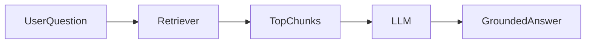

# Day 17 - RAG

## Introduction
Retrieval-Augmented Generation, or RAG, combines search and generation. The app first finds relevant information, then gives that information to the model so the answer is grounded in source material.


## Learning Objectives
By the end of this day, you should be able to:

- explain the RAG pipeline
- describe why retrieval improves answer quality
- identify the role of chunking and ranking
- understand grounding and citations
- design a basic RAG architecture

## Theory
RAG helps models answer with information that is specific, private, or changing. Instead of depending only on model memory, the app retrieves relevant context from your data.

The retrieval step is not optional. If the retrieval is poor, the generation step will be poor too.

### Visual Diagram


## Code Examples

### Python
```python
question = "What does our onboarding process include?"
retrieved_chunks = ["Step 1: create an account.", "Step 2: verify your email."]
print(question)
print(retrieved_chunks)
```

### TypeScript
```typescript
const question = 'What does our onboarding process include?';
const retrievedChunks = ['Step 1: create an account.', 'Step 2: verify your email.'];

console.log(question);
console.log(retrievedChunks);
```

## Best Practices
- retrieve only the most relevant chunks
- include source references in the answer when possible
- tune chunking and ranking together
- keep the generation prompt focused on the retrieved context
- evaluate retrieval separately from answer generation

## Common Mistakes
- passing too many chunks to the model
- assuming retrieval automatically fixes bad data
- not separating search quality from answer quality
- forgetting to cite or trace the source
- using RAG when a simple lookup would be better

## Exercises
- Easy: Define RAG in one sentence.
- Medium: Explain why retrieval is necessary.
- Hard: Sketch a RAG pipeline for internal documentation.
- Challenge: Add a citation strategy to the pipeline.

## Mini Project
Design a RAG assistant for company docs. Include ingestion, retrieval, answer synthesis, and citation behavior.

## Summary
RAG grounds model answers in external data. It is one of the most practical ways to make AI useful for real knowledge work.

## Additional Resources
- https://python.langchain.com/docs/concepts/rag/
- https://docs.llamaindex.ai/
- https://www.pinecone.io/learn/retrieval-augmented-generation/
