# Day 18 - Hybrid Search

[Previous: Day 17 - RAG](../day_17/day_17_rag.md) | [Next: Day 19 - Memory](../day_19/day_19_memory.md)

## Introduction
Yesterday we built the mental model for RAG. Today we improve the retrieval part of that pipeline.

Hybrid search combines keyword search with semantic search so the system can handle exact terms, fuzzy meaning, product codes, names, abbreviations, and natural language in the same retrieval layer. This matters because real users do not search in just one way.


One user types a precise error code. Another user asks a vague natural-language question. A third user searches for a feature name they saw in a meeting. A single retrieval strategy rarely handles all of those well.

Hybrid search is the practical answer. It treats retrieval as a multi-signal problem instead of pretending there is only one kind of relevance.

For [`StudySpark`](../../projects/studyspark/), hybrid search means a student can find "Day 17 RAG" by exact lesson title while another student can ask "how do I ground answers in course notes?" and still reach the same material. Track your implementation in [`projects/CAPSTONE.md`](../../projects/CAPSTONE.md).

## Learning Objectives
By the end of this day, you should be able to:

- explain the difference between lexical and semantic retrieval
- describe why hybrid search often beats either method alone
- understand score fusion and rank fusion at a high level
- design a retrieval strategy that uses multiple signals
- choose hybrid search for ambiguous, mixed, or enterprise queries
- evaluate tradeoffs between precision, recall, and latency
- build a small hybrid search prototype in Python or TypeScript
- implement query routing to save cost on simple lookups
- connect hybrid retrieval to the StudySpark knowledge base

## How to Use This Lesson

This lesson is designed for **all skill levels**. Pick one path and follow it consistently.

| Level | Suggested approach | Time |
| --- | --- | --- |
| **Beginner** | Read Introduction → Big Picture → Deep Theory → trace one code example → Easy exercises | 5–7 hours |
| **Intermediate** | Skim objectives → Visual Learning → Code Walkthrough → Medium/Hard exercises → Mini project | 3–5 hours |
| **Advanced** | Deep Theory tradeoffs → Hard/Challenge exercises → extend mini project → capstone slice | 2–4 hours |

### Apply Today
Complete at least one item before moving to the next day:
- [ ] Trace one code example in **Python or TypeScript** (one language is enough)
- [ ] Complete exercises for your level (see Exercises section)
- [ ] Update [`projects/CAPSTONE.md`](../../projects/CAPSTONE.md) with today's capstone item
- [ ] Update the retrieval or memory section in `projects/CAPSTONE.md`.

> **Stuck?** Re-read Big Picture, review Prerequisites, or see [SYLLABUS.md](../../SYLLABUS.md) for path guidance.

## Prerequisites
You should already understand:

- Day 15: Embeddings
- Day 16: Vector Databases
- Day 17: RAG
- the idea of query ranking

If those topics are fuzzy, revisit them first. Hybrid search depends on both keyword logic and vector retrieval, so it sits directly on top of the last two days.

## Big Picture
Hybrid search is a retrieval architecture, not a single algorithm.

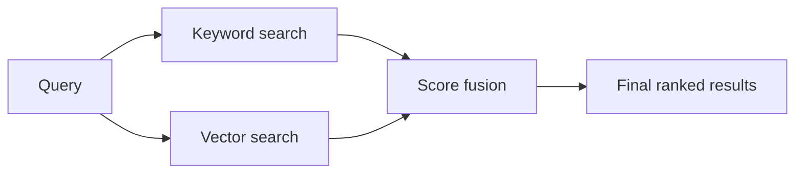

The idea is simple:

- keyword search is excellent when the exact terms matter
- vector search is excellent when meaning matters
- hybrid search uses both and then merges the results

This is why hybrid search is so common in production knowledge systems, documentation portals, support search, and enterprise AI assistants.

In a RAG pipeline like StudySpark's, hybrid search improves the retriever that Day 17 depends on. Better retrieval means better grounded answers.

## Why Hybrid Search Exists
Hybrid search exists because human search behavior is mixed.

Sometimes users search with exact language:

- error codes
- package names
- file names
- product SKUs
- API method names

Sometimes they search with fuzzy language:

- "how do I reset access?"
- "where is the billing thing?"
- "the note about deployment from yesterday"

Keyword search is strong for the first type. Vector search is strong for the second type. Real systems need both.

### What problem does it solve?
Hybrid search solves the mismatch between:

- what the user says
- what the document literally contains
- what the document actually means

If a query includes the exact term "pgvector," keyword search can rank the document highly even if the vector similarity is moderate. If a query says "vector database for Postgres," semantic search can surface content even when the exact words differ.

### Historical background
Search systems started with keywords because they were simpler and explainable. Later, semantic retrieval improved recall and paraphrase handling. Eventually, teams realized that neither was enough alone.

That led to hybrid retrieval architectures that combine both styles.

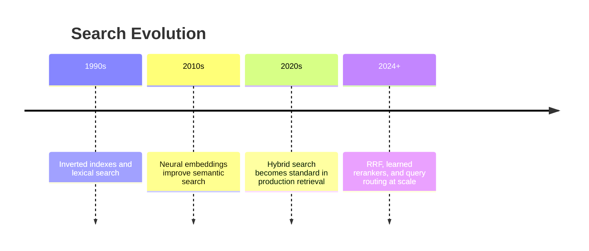

## Deep Theory

### Lexical search
Lexical search matches words, tokens, stems, and phrases.

It is powerful because exact terms often matter a lot. For example:

- package names must match exactly
- product codes must match exactly
- API paths often need exact matching
- user names and identifiers often require precision

Lexical search usually works through inverted indexes, which map terms to documents that contain them.

BM25 is a common lexical scoring function. It rewards term frequency but penalizes documents that are long or contain common words.

### Semantic search
Semantic search matches meaning.

It uses embeddings to compare the query with documents in vector space. That makes it good at:

- paraphrases
- synonyms
- concept-level matching
- fuzzy natural language questions

### Why one method alone is not enough
If you only use keyword search, you miss meaning when the user and document use different words.

If you only use vector search, you may miss exact terms that should matter a lot, such as version numbers, bug IDs, or abbreviations.

Hybrid search helps by letting each method cover the other's blind spots.

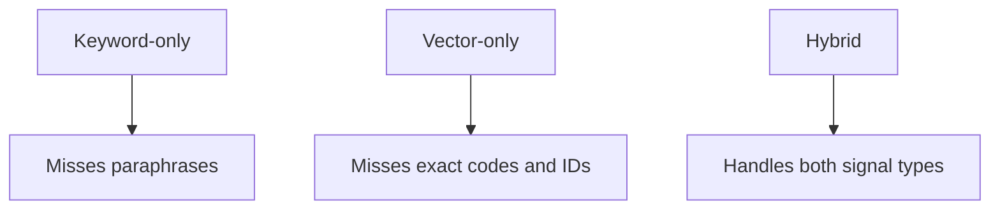

### Internal mechanics of hybrid search
The pipeline usually looks like this:

1. receive the query
2. send it to a keyword retriever
3. send it to a vector retriever
4. normalize the scores from both systems
5. fuse the rankings
6. optionally rerank the fused candidates
7. return the final results

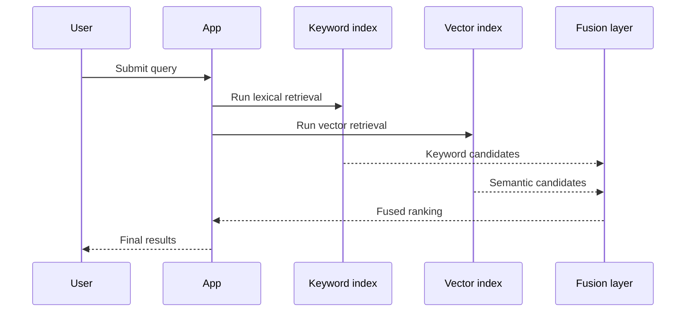

### Score fusion
The simplest idea is to combine scores into one number.

For example:

$$
\text{final score} = \alpha \cdot \text{keyword score} + \beta \cdot \text{vector score}
$$

where $\alpha$ and $\beta$ control the balance.

This is intuitive, but it is not always easy because keyword and vector scores may live on different scales. That is why normalization matters.

### Rank fusion
Sometimes it is better to combine rankings instead of raw scores.

One common pattern is Reciprocal Rank Fusion, or RRF. RRF gives higher weight to documents that appear near the top of multiple ranked lists.

The RRF formula for document $d$ is often written as:

$$
\text{RRF}(d) = \sum_{i} \frac{1}{k + \text{rank}_i(d)}
$$

where $k$ is a smoothing constant (commonly 60) and $\text{rank}_i(d)$ is the rank of document $d$ in list $i$.

Conceptually:

- document A is ranked high by keyword search and also high by vector search
- document B is only high in one system
- document A should usually win

That makes RRF robust when score scales differ.

### Why normalization matters
Keyword scores and vector scores are often not directly comparable.

One system may output a score between 0 and 1. Another may output a distance. Another may output a BM25 relevance score. If you combine them blindly, you may amplify the wrong signal.

This is why hybrid retrieval systems usually normalize, rerank, or use rank-based fusion.

| Fusion method | Pros | Cons |
| --- | --- | --- |
| Weighted score sum | simple, tunable | needs normalization |
| RRF | robust across scales | less intuitive weights |
| Learned reranker | highest quality | cost and complexity |

### Query routing
Not every query needs both retrievers.

A short exact query like "PG-124" may route to keyword search only. A vague question routes to hybrid. Routing saves latency and cost.

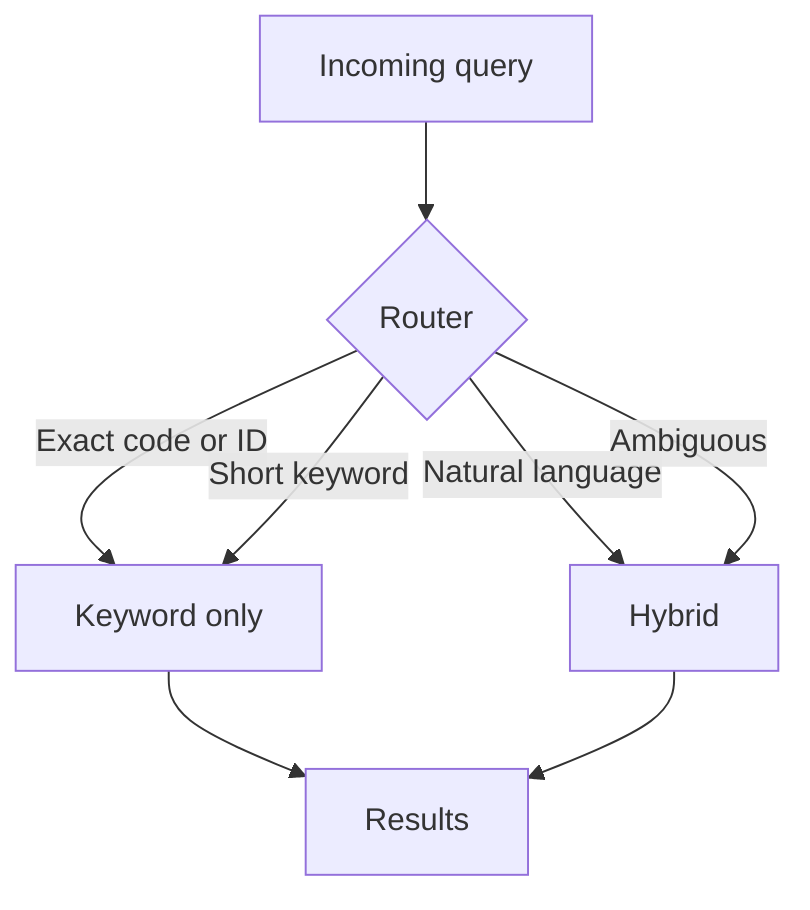

### When should you use hybrid search?
Use it when:

- exact terms matter and semantic meaning matters
- queries are ambiguous or mixed
- the dataset includes codes, names, and natural language
- users search with inconsistent wording
- you need high recall and decent precision

### When should you not use hybrid search?
Do not use it when:

- the problem is a tiny exact lookup
- the overhead is not worth the extra complexity
- a simple database query already solves the problem
- your latency budget is too tight for multiple retrieval stages

### Advantages
- handles both exact and fuzzy search behavior
- improves recall without losing all precision
- useful for enterprise search and assistant systems
- works well with filters and reranking
- less brittle than keyword-only or vector-only retrieval

### Limitations
- more moving parts
- more tuning required
- harder to debug than a single retriever
- extra latency from multiple retrieval paths
- score fusion can be tricky

### Alternatives
- keyword search only
- vector search only
- database filtering with exact matches
- reranking on top of a single retrieval strategy

## Visual Learning

### Hybrid Retrieval Architecture
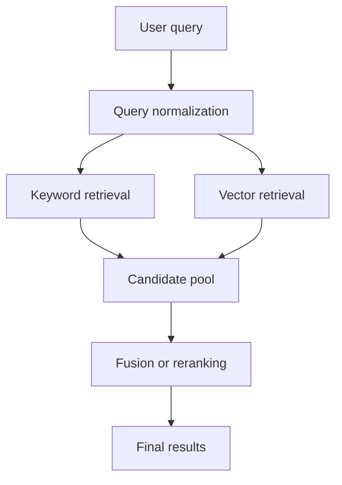

### Decision Tree
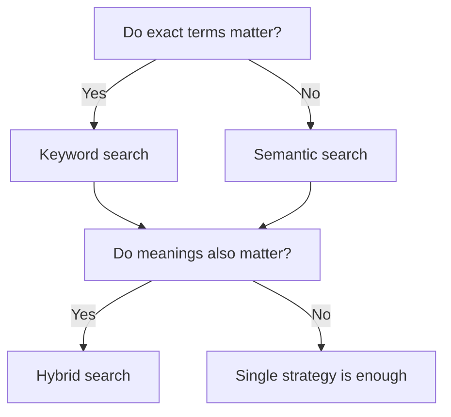

### Query Examples Map
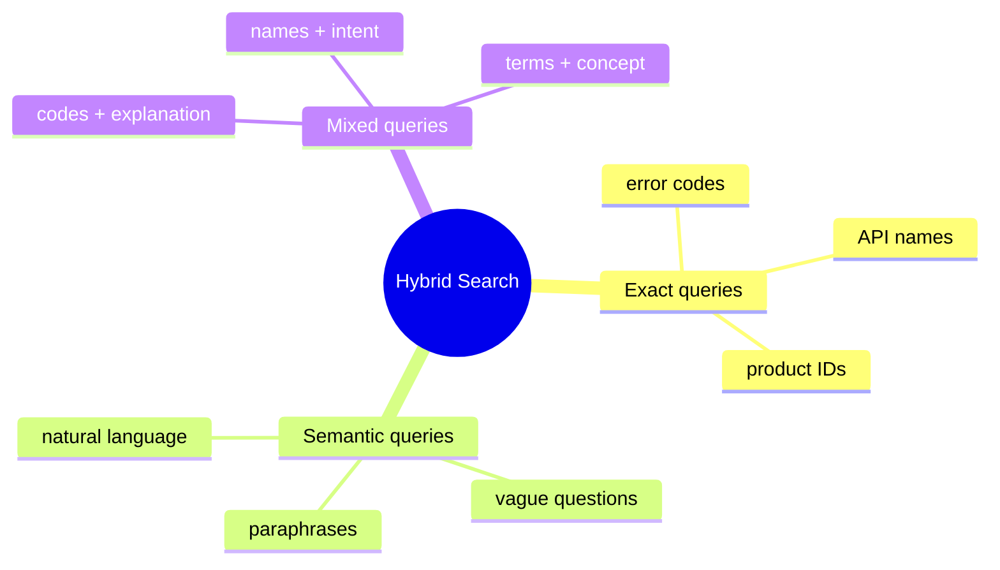

### StudySpark Hybrid Layer
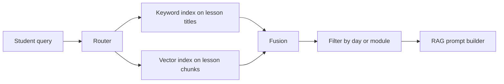

### Parallel vs Sequential Retrieval
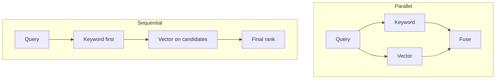

### Latency Tradeoff
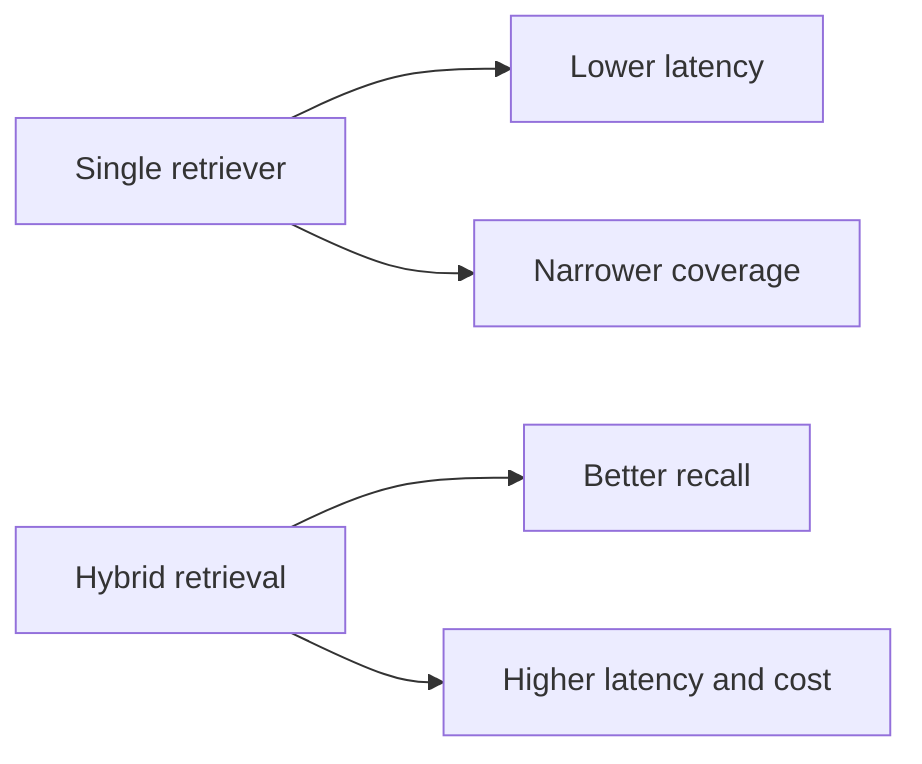

### Filter Consistency
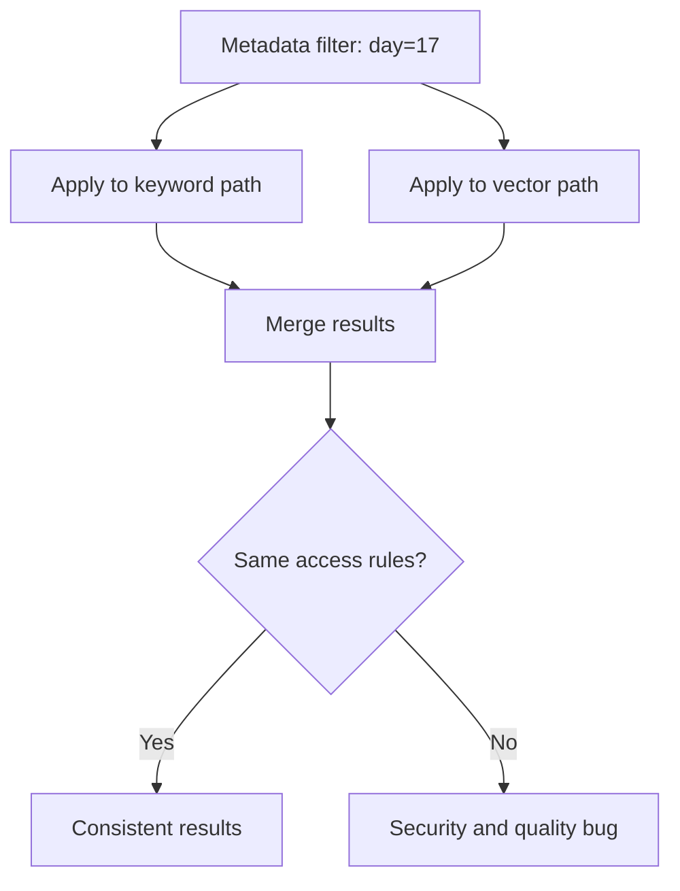

### RRF Intuition
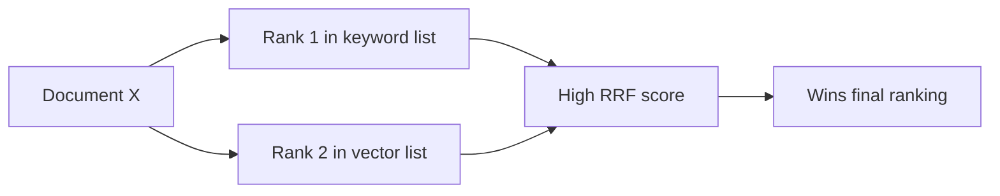

## Code Walkthrough

The examples below are small on purpose. They show the mechanics of hybrid retrieval without hiding the important parts in a framework. Place production code under `app/rag/` in [`projects/studyspark/`](../../projects/studyspark/).

### Python Example: Combine keyword and vector scores
```python
from math import sqrt


def cosine_similarity(vector_a, vector_b):
        dot_product = sum(a * b for a, b in zip(vector_a, vector_b))
        magnitude_a = sqrt(sum(a * a for a in vector_a))
        magnitude_b = sqrt(sum(b * b for b in vector_b))

        if magnitude_a == 0 or magnitude_b == 0:
                return 0.0

        return dot_product / (magnitude_a * magnitude_b)


def keyword_score(query, text):
        query_terms = set(query.lower().split())
        text_terms = set(text.lower().split())
        overlap = query_terms.intersection(text_terms)

        if not query_terms:
                return 0.0

        return len(overlap) / len(query_terms)


def normalize_scores(items, key):
        values = [item[key] for item in items]
        min_value = min(values)
        max_value = max(values)

        if max_value == min_value:
                for item in items:
                        item[f"{key}_norm"] = 0.0
                return items

        for item in items:
                item[f"{key}_norm"] = (item[key] - min_value) / (max_value - min_value)

        return items


documents = [
        {"id": "doc-1", "text": "How to use pgvector in PostgreSQL", "vector": [0.92, 0.10, 0.18]},
        {"id": "doc-2", "text": "How to store notes for semantic search", "vector": [0.81, 0.16, 0.22]},
        {"id": "doc-3", "text": "PostgreSQL vector database setup guide", "vector": [0.90, 0.11, 0.20]},
]

query = "pgvector setup guide"
query_vector = [0.91, 0.10, 0.19]

results = []

for document in documents:
        lexical = keyword_score(query, document["text"])
        semantic = cosine_similarity(query_vector, document["vector"])
        results.append({
                "id": document["id"],
                "text": document["text"],
                "lexical": lexical,
                "semantic": semantic,
        })

results = normalize_scores(results, "lexical")
results = normalize_scores(results, "semantic")

for item in results:
        item["final_score"] = (0.45 * item["lexical_norm"]) + (0.55 * item["semantic_norm"])

results.sort(key=lambda item: item["final_score"], reverse=True)
print(results)
```

#### Code Explanation
- `cosine_similarity` measures semantic closeness.
- `keyword_score` measures literal word overlap.
- `normalize_scores` puts both signals on a comparable scale before fusion.
- `final_score` blends both signals with tunable weights.
- `results.sort(...)` ranks the most relevant document first.

This is the simplest possible hybrid search pattern.

### TypeScript Example: Rank fusion structure
```typescript
type SearchResult = {
    id: string;
    text: string;
    keywordRank: number;
    vectorRank: number;
};

function reciprocalRankFusion(result: SearchResult, k = 60): number {
    const keywordContribution = 1 / (k + result.keywordRank);
    const vectorContribution = 1 / (k + result.vectorRank);

    return keywordContribution + vectorContribution;
}

const candidates: SearchResult[] = [
    { id: 'a', text: 'pgvector setup guide', keywordRank: 1, vectorRank: 3 },
    { id: 'b', text: 'semantic search tutorial', keywordRank: 4, vectorRank: 1 },
    { id: 'c', text: 'database indexing notes', keywordRank: 2, vectorRank: 2 },
];

const fused = candidates
    .map((item) => ({ ...item, fusionScore: reciprocalRankFusion(item) }))
    .sort((left, right) => right.fusionScore - left.fusionScore);

console.log(fused);
```

#### Code Explanation
- `SearchResult` stores the two separate rankings.
- `reciprocalRankFusion` rewards documents that appear near the top in both lists.
- the constant `k` smooths the score differences.
- `sort(...)` returns the final ranking order.

### Python Example: Query routing
```python
def route_query(query):
        query_lower = query.lower()

        if any(token in query_lower for token in ["error", "code", "version", "id"]):
                return "hybrid"

        if len(query.split()) <= 3:
                return "keyword"

        return "hybrid"


print(route_query("PG-124 error code"))
print(route_query("vector database"))
print(route_query("how do I connect the API to my app"))
```

#### Code Explanation
- `route_query` chooses a retrieval strategy based on query shape.
- exact-looking queries often need keyword precision.
- ambiguous or longer questions often benefit from hybrid search.
- routing is a practical way to save cost and latency.

### TypeScript Example: Metadata filter on both paths
```typescript
type LessonChunk = {
  id: string;
  day: number;
  text: string;
};

function applyModuleFilter(chunks: LessonChunk[], moduleDay: number): LessonChunk[] {
  return chunks.filter((chunk) => chunk.day === moduleDay);
}

const allChunks: LessonChunk[] = [
  { id: '1', day: 17, text: 'RAG combines retrieval and generation.' },
  { id: '2', day: 18, text: 'Hybrid search merges keyword and vector signals.' },
];

console.log(applyModuleFilter(allChunks, 18));
```

#### Code Explanation
- metadata filters must apply consistently before fusion
- StudySpark can filter by course day or module
- inconsistent filters between paths create confusing or unsafe results

### Python Example: Reciprocal Rank Fusion from two lists
```python
def reciprocal_rank_fusion(rank_lists, k=60):
        scores = {}

        for ranked_ids in rank_lists:
                for rank, doc_id in enumerate(ranked_ids, start=1):
                        scores[doc_id] = scores.get(doc_id, 0.0) + (1 / (k + rank))

        return sorted(scores.items(), key=lambda item: item[1], reverse=True)


keyword_ranking = ["doc-1", "doc-3", "doc-2"]
vector_ranking = ["doc-3", "doc-2", "doc-1"]

print(reciprocal_rank_fusion([keyword_ranking, vector_ranking]))
```

#### Code Explanation
- RRF aggregates rank positions from multiple retrievers
- documents strong in both lists rise to the top
- this avoids comparing incompatible raw scores directly

## Comparison Tables

### BM25 vs dense vector retrieval

| Property | BM25 (lexical) | Dense vectors |
| --- | --- | --- |
| Index type | inverted index | vector index (HNSW, IVF) |
| Strength | rare terms, exact IDs | paraphrase, concept match |
| Weakness | vocabulary mismatch | rare token precision |
| Typical score range | unbounded relevance | similarity or distance |
| Update cost | low for text edits | re-embed on content change |

### Enterprise search query types

| Query type | Example | Best signal |
| --- | --- | --- |
| Identifier | `ERR-5021` | keyword |
| How-to | "how to reset billing" | hybrid |
| Concept | "making answers trustworthy" | vector |
| Mixed | "Day 17 RAG citations" | hybrid with metadata filter |

### Keyword vs Vector vs Hybrid

| Signal | Strength | Weakness | Example query |
| --- | --- | --- | --- |
| Keyword | exact terms | paraphrases | `pgvector` |
| Vector | meaning | rare exact IDs | "database for embeddings" |
| Hybrid | both | more complexity | "pgvector setup for Postgres" |

### Fusion strategy selection

| Situation | Recommended fusion |
| --- | --- |
| Scores on different scales | RRF |
| Tunable business weights | normalized weighted sum |
| High-stakes final ranking | reranker after fusion |
| Tight latency budget | route simple queries away from hybrid |

## Practical Examples

### Beginner Example: Notes search
A student searches for "AI note summarizer."

Keyword search returns pages that literally contain those words. Vector search returns pages about study notes, summaries, and assistant tools. Hybrid search merges both and finds the most useful result.

Why it works:

- the query has both exact terms and a concept
- keyword search catches the literal wording
- semantic search catches the meaning

### Intermediate Example: Product documentation search
A developer asks, "How do I configure the OpenAI API in TypeScript?"

The words "OpenAI API" and "TypeScript" are important exact terms. The phrase "configure" may appear in different forms across docs. Hybrid search keeps the technical term precision while still finding the right how-to guide.

What could go wrong:

- if keyword weight is too high, synonym-rich docs may be missed
- if vector weight is too high, exact version-specific docs may be buried

### Professional Example: Internal enterprise search
An enterprise search tool must find:

- policy documents
- meeting notes
- code snippets
- ticket histories
- acronyms and department names

Hybrid search works well because a user may search both exact identifiers and fuzzy natural language in the same query.

### Real-World Company Example
Products like GitHub, Notion, and enterprise search tools benefit from hybrid retrieval because users search code, docs, tasks, and knowledge with mixed precision. Exact terms matter for names and identifiers, while semantic matching matters for intent and paraphrase.

### StudySpark Example
A student searches "Day 18 hybrid search RRF."

Keyword search matches the lesson title and headings. Vector search finds related content in Day 16 and Day 17 about retrieval and ranking. Hybrid fusion returns Day 18 first while still surfacing useful prerequisite material for the RAG pipeline.

## Best Practices
- combine retrieval methods instead of treating one as universally best
- tune lexical and semantic weights with real queries
- apply the same access filters in both retrieval paths
- use reranking for the final candidate set when needed
- monitor latency and result quality together
- keep a small benchmark of exact, fuzzy, and mixed queries
- inspect top results manually during tuning
- log which retrieval path was used for each query
- document your fusion weights and re-evaluate after content changes

## Common Mistakes
- assuming hybrid search is automatically better without tuning
- using inconsistent filters across retrieval paths
- ignoring exact terms that matter to users
- overfitting the fusion weights to a tiny test set
- forgetting to measure latency increase
- treating hybrid search as a product label instead of an engineering design
- running fusion before applying metadata filters
- using raw BM25 and cosine scores without normalization in weighted fusion

### Debugging Strategy
When hybrid search feels weak, check the system in this order:

1. Are keyword and vector results both individually reasonable?
2. Are scores normalized properly?
3. Is the fusion formula biased too heavily in one direction?
4. Are filters consistent across both retrieval paths?
5. Are the test queries representative of real usage?

## Performance

Hybrid search often improves quality at the cost of extra work.

### Latency
Running two retrievers is slower than running one.

You can reduce latency by:

- using smaller candidate sets
- caching frequent queries
- routing simple queries to a single strategy
- keeping retrieval indexes in memory
- running keyword and vector searches in parallel

### Cost
Cost rises when:

- you run multiple retrieval paths
- you rerank many candidates
- you maintain separate indexes
- you re-embed content often

### Memory
You may need to store both an inverted index and a vector index, which increases storage and memory use.

### Scalability
Hybrid systems scale best when retrieval, ranking, and filtering are modular.

Common scaling patterns include:

- separate services for keyword and vector search
- shared metadata filters
- async reranking
- query routing by intent

### Reliability
Hybrid search can be more reliable because one retrieval method can compensate when the other struggles.

That said, more components mean more places for failure, so observability matters.

## Security

Hybrid search still needs the same safety thinking as any retrieval system.

### Prompt Injection
If hybrid search feeds RAG, the retrieved content may contain instructions that should not be trusted.

### Secrets and API Keys
Do not let secret values be indexed as searchable content.

### Authentication and Authorization
Both keyword and vector retrieval must obey the same access rules.

### Data Privacy
If the system stores private knowledge, retrieval logs and result caches must also be protected.

### Hallucinations and Model Safety
Better retrieval reduces hallucination risk, but the model can still overstate what it found. Keep answers grounded.

## Evaluation
You should evaluate hybrid search with mixed query types.

### What to measure
- exact-match queries
- paraphrase queries
- acronym queries
- misspelled queries
- mixed natural-language and code queries

### Useful metrics
- precision@k
- recall@k
- result diversity
- click-through or task success rate
- latency per retrieval path
- fusion win rate (how often hybrid beats single-strategy baselines)

## Tradeoffs and Tuning

### Precision vs Recall in fusion weights
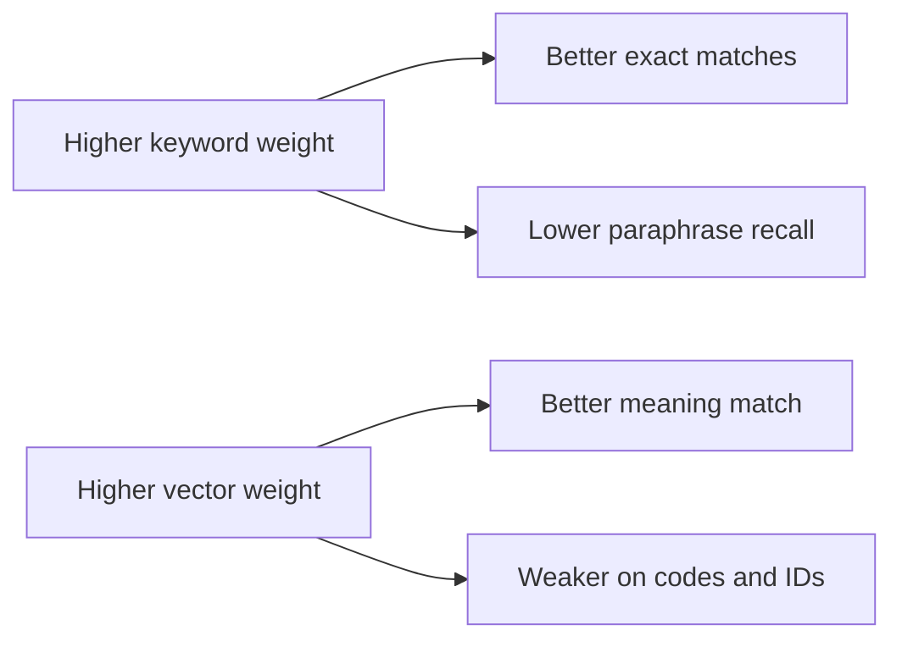

### When to add a reranker
Use a reranker when fusion gets you close but final ordering still matters—for example, choosing between three similarly scored lesson chunks in StudySpark.

## Production Troubleshooting Checklist

1. run keyword-only and vector-only baselines separately
2. compare top-5 results side by side for failing queries
3. verify metadata filters on both paths
4. check whether routing sends queries to the wrong strategy
5. inspect score distributions before changing fusion weights
6. measure p95 latency for parallel vs sequential retrieval
7. re-benchmark after embedding model or index changes

## Common Production Patterns

### Pattern 1: Parallel dual retrieval
Run keyword and vector search concurrently, fuse with RRF, then pass to RAG.

### Pattern 2: Filter-first hybrid
Apply tenant, day, or access filters before retrieval to shrink candidate sets.

### Pattern 3: Route-then-fuse
Use a lightweight router to skip hybrid for obvious exact lookups.

## Exercises

### Easy
1. Define lexical search.
2. Define semantic search.
3. Give one reason users need both.
4. Name one example of an exact query.
5. Explain why hybrid search helps RAG systems.
6. Name one situation where keyword-only search is enough.

### Medium
7. Explain how score fusion works.
8. Describe why normalization is needed.
9. Compare keyword search and vector search on a product documentation query.
10. Explain why hybrid search is useful in enterprise search.
11. Describe Reciprocal Rank Fusion in plain language.
12. Explain why metadata filters must be consistent across paths.
13. Give an example query that would break vector-only search.

### Hard
14. Design a query router that chooses lexical, semantic, or hybrid search.
15. Propose a score fusion formula for your own dataset.
16. Explain how to evaluate hybrid search on real logs.
17. Describe how access control should be enforced in both retrieval paths.
18. Design hybrid retrieval for StudySpark with day-level metadata filters.
19. Compare weighted fusion and RRF for a mixed query benchmark.

### Challenge
20. Build a hybrid search prototype for course notes.
21. Add query routing based on query length and keywords.
22. Add a reranking stage on the final candidates.
23. Compare the output of keyword-only, vector-only, and hybrid search.
24. Create a dashboard for latency and retrieval quality.
25. Integrate hybrid retrieval into `projects/studyspark/app/rag/retrieval.py`.

### Reflection Questions
26. Which types of queries would break keyword-only search in your project?
27. Which types of queries would break vector-only search?
28. Why is query diversity important when evaluating search systems?
29. What is the biggest tradeoff in hybrid search?
30. How does hybrid search prepare you for memory systems in Day 19?

## Quizzes

### Quiz 1
1. What is the main difference between lexical and semantic search?
2. Why does hybrid search exist?
3. What does score fusion do?
4. Give one example of an exact-match query.

### Quiz 2
1. Why is normalization important before weighted fusion?
2. What is Reciprocal Rank Fusion?
3. Why should filters be applied consistently on both paths?
4. When might query routing skip hybrid search?

### Quiz 3
1. What happens if vector weight is too high for API name queries?
2. What happens if keyword weight is too high for paraphrases?
3. Why does hybrid search add latency?
4. How does hybrid search improve a RAG pipeline?

## Interview Questions

### Conceptual
- Explain hybrid search to a product manager in one minute.
- When would you use keyword-only, vector-only, or hybrid retrieval?
- What is RRF and why is it popular?
- Why is hybrid search harder to debug than single-strategy retrieval?

### System Design
- Design a hybrid search layer for an internal documentation portal.
- How would you enforce access control across two retrieval indexes?
- Design query routing for a support assistant.
- How would you benchmark fusion weights for StudySpark lesson search?

### Debugging
- Hybrid results look worse than vector-only. What do you check?
- Exact product codes rank too low. What likely changed?
- Latency doubled after enabling hybrid search. What are your options?

## Mini Project
Build a hybrid search layer for a product documentation site called DocBridge. Or extend [`projects/studyspark/`](../../projects/studyspark/) retrieval directly.

### Goal
Return the best docs for both exact technical searches and fuzzy intent-based questions.

### Features
- store documents with both text and embeddings
- implement keyword retrieval
- implement vector retrieval
- fuse the rankings into one result list
- route easy exact queries to keyword search only when appropriate
- compare the output of each strategy
- apply metadata filters for note subjects or course modules

### Suggested Folder Structure
```text
studyspark/
├── app/
│   ├── rag/
│   │   ├── keyword_search.py
│   │   ├── vector_search.py
│   │   ├── fusion.py
│   │   ├── router.py
│   │   └── retrieval.py
│   └── main.py
├── data/
│   └── lessons/
├── tests/
│   └── test_hybrid_search.py
└── README.md
```

### Project Steps
1. prepare a small docs collection from course lessons
2. build a keyword index or keyword scorer
3. build a vector-based scorer
4. fuse the rankings with RRF or weighted normalization
5. test with exact, vague, and mixed queries
6. tune the score weights using a benchmark set
7. compare latency and quality against single-strategy search
8. update [`projects/CAPSTONE.md`](../../projects/CAPSTONE.md) for Day 18

### What You Learn
- how hybrid search balances precision and recall
- how query routing can save cost
- how exact terms and meaning work together
- how this retrieval design supports the memory work in Day 19

## Cumulative Capstone Update

Add to [`projects/CAPSTONE.md`](../../projects/CAPSTONE.md):
- hybrid search strategy (when keyword vs vector wins)
- metadata filters for note subjects or course modules

## Summary
Hybrid search combines lexical and semantic retrieval so search systems can handle exact terms and meaning at the same time. It is one of the most practical retrieval designs for real products because users search in mixed ways and data contains both structured terms and natural language.

The most important ideas from today are:

- keyword search is good at exact matches
- vector search is good at meaning
- hybrid search uses both strengths
- fusion, routing, and reranking make the system useful in practice
- StudySpark retrieval becomes more robust when hybrid search backs the RAG layer

If Day 16 gave us vector retrieval and Day 17 turned it into RAG, Day 18 makes the retriever smarter and more robust.

[Previous: Day 17 - RAG](../day_17/day_17_rag.md) | [Next: Day 19 - Memory](../day_19/day_19_memory.md)

## Historical Background

Hybrid search did not appear fully formed. It emerged from decades of information retrieval practice.

### From inverted indexes to neural retrieval

In the 1990s and 2000s, enterprise search was dominated by inverted indexes, TF-IDF, and BM25. Search engineers tuned analyzers, stemmers, and stopword lists because exact term matching was the primary tool available.

Neural embeddings changed the game. Teams could match meaning even when vocabulary differed. But production systems quickly discovered a painful lesson: **semantic search alone regressed on the queries that keyword search handled effortlessly**.

Product codes, legal citations, function names, and SKU lookups still needed lexical precision. Hybrid architectures became the compromise that respected both realities.

### Why RRF spread so quickly

Reciprocal Rank Fusion gained popularity because it solved an annoying engineering problem: **you often cannot normalize BM25 scores and cosine similarity into one fair scale**. Rank-based fusion sidesteps that fight. Documents that both retrievers trust rise naturally.

For StudySpark, RRF is a sensible default when you combine a title keyword index with a lesson-chunk vector index—you get strong matches on "Day 18" headings without sacrificing paraphrase recall.

### Hybrid search inside RAG pipelines

Day 17 taught you that retrieval quality controls answer quality. Hybrid search is one of the highest-leverage upgrades to that retriever because it improves recall on the messy queries real users actually type.

The architecture pattern looks like this:

1. user asks a question
2. router decides keyword, vector, or hybrid
3. both indexes return candidates with shared metadata filters
4. fusion produces a final ranked list
5. top chunks feed the RAG prompt builder from Day 17

That means hybrid search is not a separate product feature—it is an **upgrade to the retriever** your grounded assistant already depends on.

## More Practical Examples

### Beginner follow-up: searching course filenames
A student types `day_17_rag.md`.

Keyword search wins immediately because the filename and heading contain the exact token. Vector search alone might rank a semantically related Day 16 lesson higher. Hybrid fusion keeps the correct file on top while still allowing related prerequisite chunks in the reranked tail.

### Intermediate follow-up: acronym-heavy queries
A developer searches `MCP tool calling`.

"MCP" is an exact acronym that lexical search handles well. "tool calling" benefits from semantic breadth because docs may say "function calling" or "tool use." Hybrid retrieval captures both signals and produces a stronger candidate set for RAG than either method alone.

### Advanced follow-up: tuning with query logs
Professional teams maintain a spreadsheet or dashboard of real queries classified as exact, fuzzy, or mixed. They measure precision@5 for keyword-only, vector-only, and hybrid baselines weekly.

When hybrid underperforms on exact queries, they increase keyword weight or improve the analyzer. When hybrid underperforms on paraphrases, they increase vector weight or add query expansion. This eval loop is how hybrid search stops being a demo and becomes infrastructure.

## Additional Code Examples

### Python Example: Apply metadata filter before fusion
```python
def filter_by_day(documents, day):
    return [doc for doc in documents if doc.get("day") == day]


keyword_hits = [
    {"id": "a", "day": 18, "score": 0.9},
    {"id": "b", "day": 17, "score": 0.85},
]

vector_hits = [
    {"id": "b", "day": 17, "score": 0.92},
    {"id": "c", "day": 18, "score": 0.88},
]

day_filter = 18
keyword_hits = filter_by_day(keyword_hits, day_filter)
vector_hits = filter_by_day(vector_hits, day_filter)
```

#### Code Explanation
- filters must run on both retrieval paths before fusion
- inconsistent filtering is a common source of hybrid bugs
- StudySpark can filter by course week, module, or visibility

### TypeScript Example: Strategy comparison helper
```typescript
type Strategy = 'keyword' | 'vector' | 'hybrid';

function compareStrategies(
  query: string,
  results: Record<Strategy, string[]>,
): void {
  for (const strategy of Object.keys(results) as Strategy[]) {
    console.log(strategy, results[strategy].slice(0, 3));
  }
}
```

#### Code Explanation
- comparing strategies side by side is essential during tuning
- keep a fixed benchmark query set in version control
- log results whenever fusion weights change

## Further Reading
- https://www.elastic.co/what-is/hybrid-search
- https://www.pinecone.io/learn/hybrid-search/
- https://qdrant.tech/documentation/concepts/hybrid-queries/
- https://bm25s.github.io/
- https://arxiv.org/abs/2405.04588
- [`projects/studyspark/README.md`](../../projects/studyspark/README.md)
- [`projects/CAPSTONE.md`](../../projects/CAPSTONE.md)
