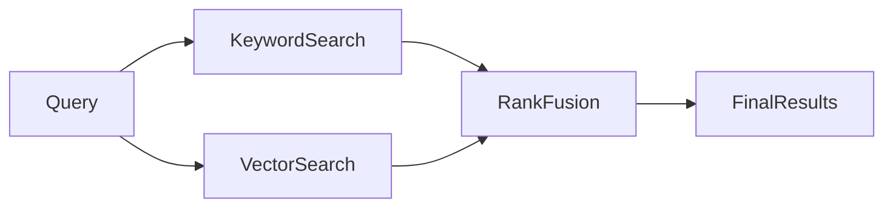

# Day 18 - Hybrid Search

## Introduction
Hybrid search combines keyword search with vector search. This approach is useful because exact words and semantic meaning both matter in real retrieval systems.


## Learning Objectives
By the end of this day, you should be able to:

- explain the difference between lexical and semantic search
- describe why hybrid search is often better than one method alone
- understand rank fusion at a high level
- design a retrieval strategy that uses multiple signals
- choose hybrid search for ambiguous queries

## Theory
A user may search for an exact product code, a specific phrase, or a vague idea. Keyword search is strong for exact matches. Vector search is strong for meaning. Hybrid search combines them so the system is more robust.

### Visual Diagram


## Code Examples

### Python
```python
query = "AI note summarizer"
keyword_results = ["note summarizer", "AI summarizer"]
vector_results = ["study note assistant", "document summary tool"]
print(query, keyword_results, vector_results)
```

### TypeScript
```typescript
const query = 'AI note summarizer';
const keywordResults = ['note summarizer', 'AI summarizer'];
const vectorResults = ['study note assistant', 'document summary tool'];

console.log(query, keywordResults, vectorResults);
```

## Best Practices
- combine signals instead of assuming one search method is enough
- test with exact, vague, and misspelled queries
- tune ranking for your domain
- inspect results manually before trusting metrics alone
- keep filters consistent across search methods

## Common Mistakes
- using only one retrieval strategy for all queries
- forgetting that exact terms can matter a lot
- overfitting ranking to a tiny test set
- not measuring query diversity
- treating hybrid search as a marketing term rather than a retrieval design

## Exercises
- Easy: Explain lexical search.
- Medium: Explain semantic search.
- Hard: Describe a hybrid ranking strategy.
- Challenge: Design a query router that chooses search strategies.

## Mini Project
Plan a hybrid search system for product documentation. Include exact keyword matching, semantic retrieval, and reranking.

## Summary
Hybrid search is practical because users search in different ways. Combining signals usually produces better results than relying on a single retrieval method.

## Additional Resources
- https://www.elastic.co/what-is/hybrid-search
- https://www.pinecone.io/learn/hybrid-search/
- https://qdrant.tech/documentation/concepts/hybrid-queries/
