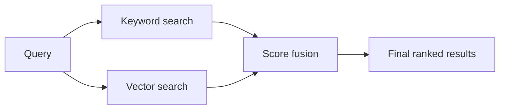
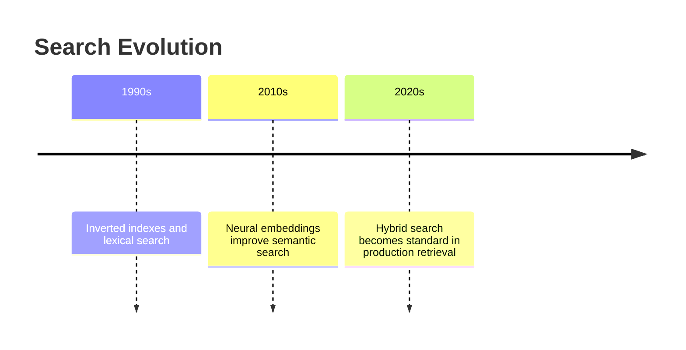
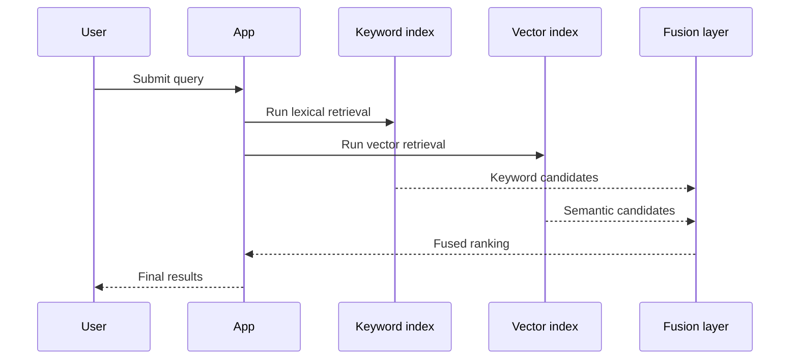
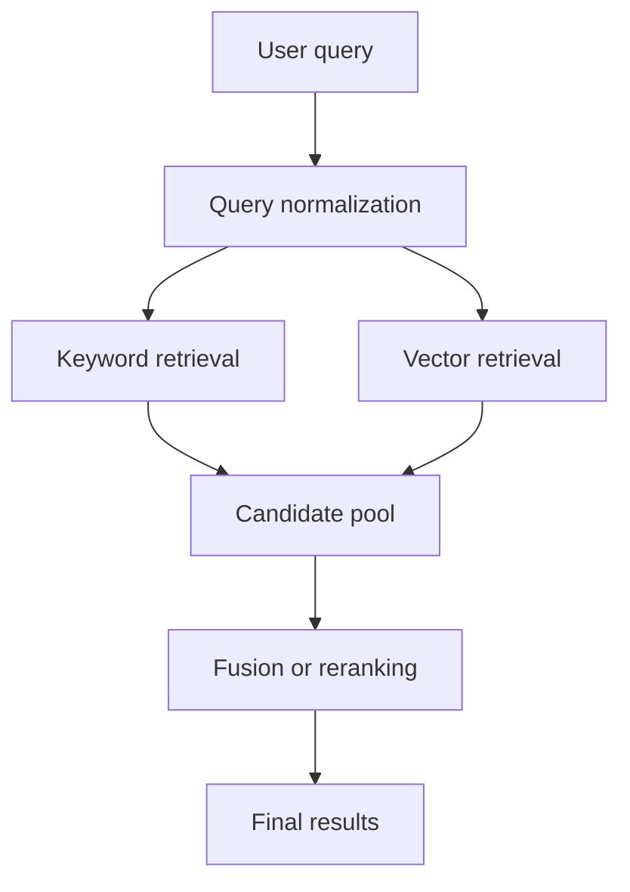
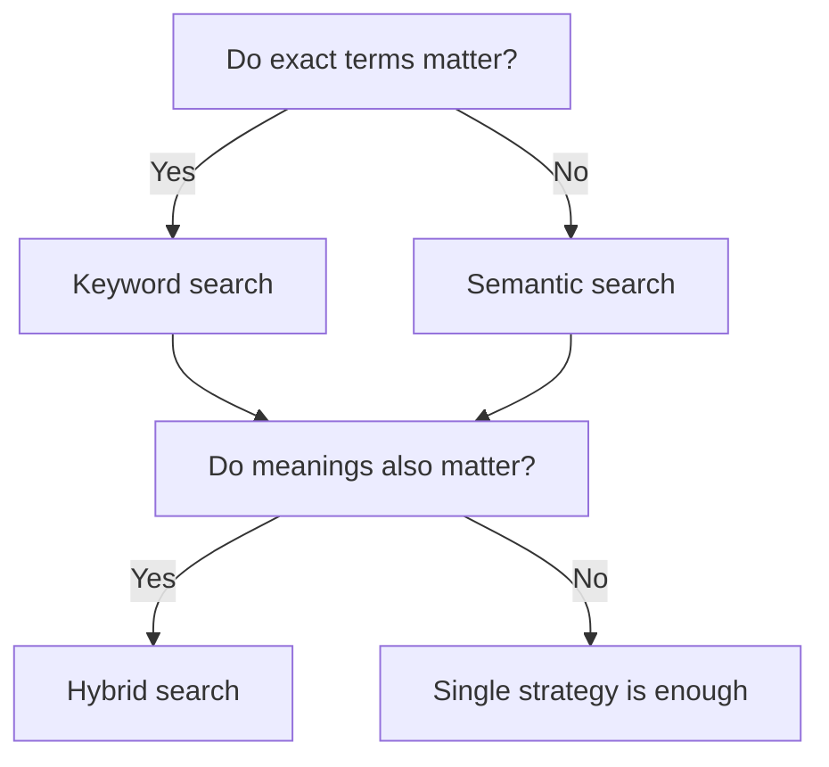
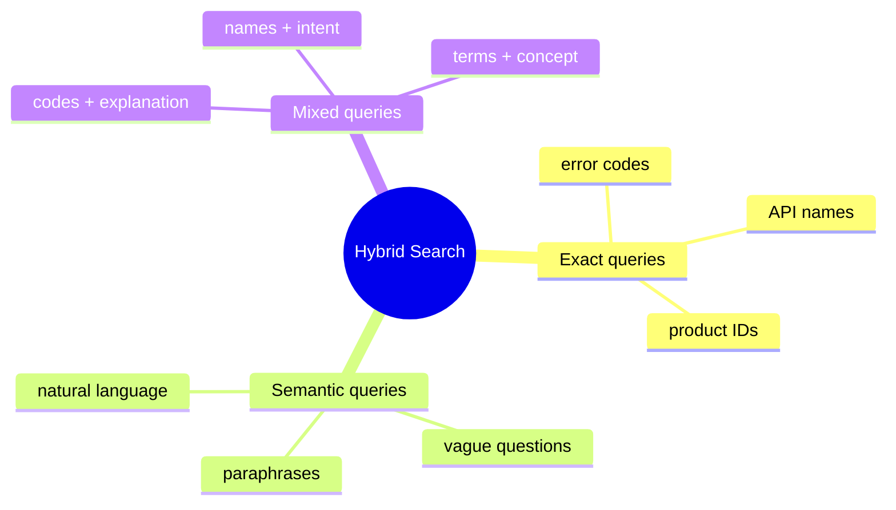

# Day 18 - Hybrid Search

[Previous: Day 17 - RAG](../day_17/day_17_rag.md) | [Next: Day 19 - Memory](../day_19/day_19_memory.md)

## Introduction
Yesterday we built the mental model for RAG. Today we improve the retrieval part of that pipeline.

Hybrid search combines keyword search with semantic search so the system can handle exact terms, fuzzy meaning, product codes, names, abbreviations, and natural language in the same retrieval layer. This matters because real users do not search in just one way.


One user types a precise error code. Another user asks a vague natural-language question. A third user searches for a feature name they saw in a meeting. A single retrieval strategy rarely handles all of those well.

Hybrid search is the practical answer. It treats retrieval as a multi-signal problem instead of pretending there is only one kind of relevance.

## Learning Objectives
By the end of this day, you should be able to:

- explain the difference between lexical and semantic retrieval
- describe why hybrid search often beats either method alone
- understand score fusion and rank fusion at a high level
- design a retrieval strategy that uses multiple signals
- choose hybrid search for ambiguous, mixed, or enterprise queries
- evaluate tradeoffs between precision, recall, and latency
- build a small hybrid search prototype in Python or TypeScript

## Prerequisites
You should already understand:

- Day 15: Embeddings
- Day 16: Vector Databases
- Day 17: RAG
- the idea of query ranking

If those topics are fuzzy, revisit them first. Hybrid search depends on both keyword logic and vector retrieval, so it sits directly on top of the last two days.

## Big Picture
Hybrid search is a retrieval architecture, not a single algorithm.



The idea is simple:

- keyword search is excellent when the exact terms matter
- vector search is excellent when meaning matters
- hybrid search uses both and then merges the results

This is why hybrid search is so common in production knowledge systems, documentation portals, support search, and enterprise AI assistants.

## Why Hybrid Search Exists
Hybrid search exists because human search behavior is mixed.

Sometimes users search with exact language:

- error codes
- package names
- file names
- product SKUs
- API method names

Sometimes they search with fuzzy language:

- “how do I reset access?”
- “where is the billing thing?”
- “the note about deployment from yesterday”

Keyword search is strong for the first type. Vector search is strong for the second type. Real systems need both.

### What problem does it solve?
Hybrid search solves the mismatch between:

- what the user says
- what the document literally contains
- what the document actually means

If a query includes the exact term “pgvector,” keyword search can rank the document highly even if the vector similarity is moderate. If a query says “vector database for Postgres,” semantic search can surface content even when the exact words differ.

### Historical background
Search systems started with keywords because they were simpler and explainable. Later, semantic retrieval improved recall and paraphrase handling. Eventually, teams realized that neither was enough alone.

That led to hybrid retrieval architectures that combine both styles.



## Deep Theory

### Lexical search
Lexical search matches words, tokens, stems, and phrases.

It is powerful because exact terms often matter a lot. For example:

- package names must match exactly
- product codes must match exactly
- API paths often need exact matching
- user names and identifiers often require precision

Lexical search usually works through inverted indexes, which map terms to documents that contain them.

### Semantic search
Semantic search matches meaning.

It uses embeddings to compare the query with documents in vector space. That makes it good at:

- paraphrases
- synonyms
- concept-level matching
- fuzzy natural language questions

### Why one method alone is not enough
If you only use keyword search, you miss meaning when the user and document use different words.

If you only use vector search, you may miss exact terms that should matter a lot, such as version numbers, bug IDs, or abbreviations.

Hybrid search helps by letting each method cover the other’s blind spots.

### Internal mechanics of hybrid search
The pipeline usually looks like this:

1. receive the query
2. send it to a keyword retriever
3. send it to a vector retriever
4. normalize the scores from both systems
5. fuse the rankings
6. optionally rerank the fused candidates
7. return the final results



### Score fusion
The simplest idea is to combine scores into one number.

For example:

$$
	ext{final score} = \alpha \cdot \text{keyword score} + \beta \cdot \text{vector score}
$$

where $\alpha$ and $\beta$ control the balance.

This is intuitive, but it is not always easy because keyword and vector scores may live on different scales. That is why normalization matters.

### Rank fusion
Sometimes it is better to combine rankings instead of raw scores.

One common pattern is Reciprocal Rank Fusion, or RRF. RRF gives higher weight to documents that appear near the top of multiple ranked lists.

Conceptually:

- document A is ranked high by keyword search and also high by vector search
- document B is only high in one system
- document A should usually win

That makes RRF robust when score scales differ.

### Why normalization matters
Keyword scores and vector scores are often not directly comparable.

One system may output a score between 0 and 1. Another may output a distance. Another may output a BM25 relevance score. If you combine them blindly, you may amplify the wrong signal.

This is why hybrid retrieval systems usually normalize, rerank, or use rank-based fusion.

### When should you use hybrid search?
Use it when:

- exact terms matter and semantic meaning matters
- queries are ambiguous or mixed
- the dataset includes codes, names, and natural language
- users search with inconsistent wording
- you need high recall and decent precision

### When should you not use hybrid search?
Do not use it when:

- the problem is a tiny exact lookup
- the overhead is not worth the extra complexity
- a simple database query already solves the problem
- your latency budget is too tight for multiple retrieval stages

### Advantages
- handles both exact and fuzzy search behavior
- improves recall without losing all precision
- useful for enterprise search and assistant systems
- works well with filters and reranking
- less brittle than keyword-only or vector-only retrieval

### Limitations
- more moving parts
- more tuning required
- harder to debug than a single retriever
- extra latency from multiple retrieval paths
- score fusion can be tricky

### Alternatives
- keyword search only
- vector search only
- database filtering with exact matches
- reranking on top of a single retrieval strategy

### Best practices
- test exact, vague, and mixed queries
- keep the same filters across both retrieval paths
- normalize or fuse ranks carefully
- inspect real query logs before finalizing weights
- keep latency monitoring in place

## Visual Learning

### Hybrid Retrieval Architecture


### Decision Tree


### Query Examples Map


## Code Walkthrough

The examples below are small on purpose. They show the mechanics of hybrid retrieval without hiding the important parts in a framework.

### Python Example: Combine keyword and vector scores
```python
from math import sqrt


def cosine_similarity(vector_a, vector_b):
        dot_product = sum(a * b for a, b in zip(vector_a, vector_b))
        magnitude_a = sqrt(sum(a * a for a in vector_a))
        magnitude_b = sqrt(sum(b * b for b in vector_b))

        if magnitude_a == 0 or magnitude_b == 0:
                return 0.0

        return dot_product / (magnitude_a * magnitude_b)


def keyword_score(query, text):
        query_terms = set(query.lower().split())
        text_terms = set(text.lower().split())
        overlap = query_terms.intersection(text_terms)

        if not query_terms:
                return 0.0

        return len(overlap) / len(query_terms)


documents = [
        {"id": "doc-1", "text": "How to use pgvector in PostgreSQL", "vector": [0.92, 0.10, 0.18]},
        {"id": "doc-2", "text": "How to store notes for semantic search", "vector": [0.81, 0.16, 0.22]},
        {"id": "doc-3", "text": "PostgreSQL vector database setup guide", "vector": [0.90, 0.11, 0.20]},
]

query = "pgvector setup guide"
query_vector = [0.91, 0.10, 0.19]

results = []

for document in documents:
        lexical = keyword_score(query, document["text"])
        semantic = cosine_similarity(query_vector, document["vector"])
        final_score = (0.45 * lexical) + (0.55 * semantic)
        results.append({"id": document["id"], "text": document["text"], "score": final_score})

results.sort(key=lambda item: item["score"], reverse=True)
print(results)
```

#### Code Explanation
- `cosine_similarity` measures semantic closeness.
- `keyword_score` measures literal word overlap.
- `documents` is our small test collection.
- `query` is the user’s text query.
- `query_vector` is the embedded version of the query.
- `lexical` gives weight to exact terms.
- `semantic` gives weight to meaning.
- `final_score` blends both signals.
- `results.sort(...)` ranks the most relevant document first.

This is the simplest possible hybrid search pattern.

### TypeScript Example: Rank fusion structure
```typescript
type SearchResult = {
    id: string;
    text: string;
    keywordRank: number;
    vectorRank: number;
};

function reciprocalRankFusion(result: SearchResult): number {
    const keywordContribution = 1 / (50 + result.keywordRank);
    const vectorContribution = 1 / (50 + result.vectorRank);

    return keywordContribution + vectorContribution;
}

const candidates: SearchResult[] = [
    { id: 'a', text: 'pgvector setup guide', keywordRank: 1, vectorRank: 3 },
    { id: 'b', text: 'semantic search tutorial', keywordRank: 4, vectorRank: 1 },
    { id: 'c', text: 'database indexing notes', keywordRank: 2, vectorRank: 2 },
];

const fused = candidates
    .map((item) => ({ ...item, fusionScore: reciprocalRankFusion(item) }))
    .sort((left, right) => right.fusionScore - left.fusionScore);

console.log(fused);
```

#### Code Explanation
- `SearchResult` stores the two separate rankings.
- `reciprocalRankFusion` rewards documents that appear near the top in both lists.
- the denominator constant smooths the score differences.
- `candidates.map(...)` adds the fusion score.
- `sort(...)` returns the final ranking order.

### Python Example: Query routing
```python
def route_query(query):
        query_lower = query.lower()

        if any(token in query_lower for token in ["error", "code", "version", "id"]):
                return "hybrid"

        if len(query.split()) <= 3:
                return "keyword"

        return "hybrid"


print(route_query("PG-124 error code"))
print(route_query("vector database"))
print(route_query("how do I connect the API to my app"))
```

#### Code Explanation
- `route_query` chooses a retrieval strategy based on query shape.
- exact-looking queries often need keyword precision.
- ambiguous or longer questions often benefit from hybrid search.
- routing is a practical way to save cost and latency.

### TypeScript Example: Normalizing scores
```typescript
function normalizeScore(score: number, min: number, max: number): number {
    if (max === min) {
        return 0;
    }

    return (score - min) / (max - min);
}

console.log(normalizeScore(8.2, 0, 10));
```

#### Code Explanation
- normalization puts scores on a shared scale.
- this helps when combining different retrieval systems.
- it becomes important when one method returns a distance and another returns a relevance score.

## Practical Examples

### Beginner Example: Notes search
A student searches for “AI note summarizer.”

Keyword search returns pages that literally contain those words. Vector search returns pages about study notes, summaries, and assistant tools. Hybrid search merges both and finds the most useful result.

Why it works:

- the query has both exact terms and a concept
- keyword search catches the literal wording
- semantic search catches the meaning

### Intermediate Example: Product documentation search
A developer asks, “How do I configure the OpenAI API in TypeScript?”

The words “OpenAI API” and “TypeScript” are important exact terms. The phrase “configure” may appear in different forms across docs. Hybrid search keeps the technical term precision while still finding the right how-to guide.

What could go wrong:

- if keyword weight is too high, synonym-rich docs may be missed
- if vector weight is too high, exact version-specific docs may be buried

### Professional Example: Internal enterprise search
An enterprise search tool must find:

- policy documents
- meeting notes
- code snippets
- ticket histories
- acronyms and department names

Hybrid search works well because a user may search both exact identifiers and fuzzy natural language in the same query.

### Real-World Company Example
Products like GitHub, Notion, and enterprise search tools benefit from hybrid retrieval because users search code, docs, tasks, and knowledge with mixed precision. Exact terms matter for names and identifiers, while semantic matching matters for intent and paraphrase.

## Best Practices
- combine retrieval methods instead of treating one as universally best
- tune lexical and semantic weights with real queries
- apply the same access filters in both retrieval paths
- use reranking for the final candidate set when needed
- monitor latency and result quality together
- keep a small benchmark of exact, fuzzy, and mixed queries
- inspect top results manually during tuning

## Common Mistakes
- assuming hybrid search is automatically better without tuning
- using inconsistent filters across retrieval paths
- ignoring exact terms that matter to users
- overfitting the fusion weights to a tiny test set
- forgetting to measure latency increase
- treating hybrid search as a product label instead of an engineering design

### Debugging Strategy
When hybrid search feels weak, check the system in this order:

1. Are keyword and vector results both individually reasonable?
2. Are scores normalized properly?
3. Is the fusion formula biased too heavily in one direction?
4. Are filters consistent across both retrieval paths?
5. Are the test queries representative of real usage?

## Performance

Hybrid search often improves quality at the cost of extra work.

### Latency
Running two retrievers is slower than running one.

You can reduce latency by:

- using smaller candidate sets
- caching frequent queries
- routing simple queries to a single strategy
- keeping retrieval indexes in memory

### Cost
Cost rises when:

- you run multiple retrieval paths
- you rerank many candidates
- you maintain separate indexes
- you re-embed content often

### Memory
You may need to store both an inverted index and a vector index, which increases storage and memory use.

### Scalability
Hybrid systems scale best when retrieval, ranking, and filtering are modular.

Common scaling patterns include:

- separate services for keyword and vector search
- shared metadata filters
- async reranking
- query routing by intent

### Reliability
Hybrid search can be more reliable because one retrieval method can compensate when the other struggles.

That said, more components mean more places for failure, so observability matters.

## Security

Hybrid search still needs the same safety thinking as any retrieval system.

### Prompt Injection
If hybrid search feeds RAG, the retrieved content may contain instructions that should not be trusted.

### Secrets and API Keys
Do not let secret values be indexed as searchable content.

### Authentication and Authorization
Both keyword and vector retrieval must obey the same access rules.

### Data Privacy
If the system stores private knowledge, retrieval logs and result caches must also be protected.

### Hallucinations and Model Safety
Better retrieval reduces hallucination risk, but the model can still overstate what it found. Keep answers grounded.

## Evaluation
You should evaluate hybrid search with mixed query types.

### What to measure
- exact-match queries
- paraphrase queries
- acronym queries
- misspelled queries
- mixed natural-language and code queries

### Useful metrics
- precision@k
- recall@k
- result diversity
- click-through or task success rate
- latency

## Exercises

### Easy
1. Define lexical search.
2. Define semantic search.
3. Give one reason users need both.
4. Name one example of an exact query.

### Medium
5. Explain how score fusion works.
6. Describe why normalization is needed.
7. Compare keyword search and vector search on a product documentation query.
8. Explain why hybrid search is useful in enterprise search.

### Hard
9. Design a query router that chooses lexical, semantic, or hybrid search.
10. Propose a score fusion formula for your own dataset.
11. Explain how to evaluate hybrid search on real logs.
12. Describe how access control should be enforced in both retrieval paths.

### Challenge
13. Build a hybrid search prototype for course notes.
14. Add query routing based on query length and keywords.
15. Add a reranking stage on the final candidates.
16. Compare the output of keyword-only, vector-only, and hybrid search.
17. Create a dashboard for latency and retrieval quality.

### Reflection Questions
18. Which types of queries would break keyword-only search in your project?
19. Which types of queries would break vector-only search?
20. Why is query diversity important when evaluating search systems?
21. What is the biggest tradeoff in hybrid search?
22. How does hybrid search prepare you for memory systems in Day 19?

## Mini Project
Build a hybrid search layer for a product documentation site called DocBridge.

### Goal
Return the best docs for both exact technical searches and fuzzy intent-based questions.

### Features
- store documents with both text and embeddings
- implement keyword retrieval
- implement vector retrieval
- fuse the rankings into one result list
- route easy exact queries to keyword search only when appropriate
- compare the output of each strategy

### Suggested Folder Structure
```text
docbridge/
├── app/
│   ├── keyword_search.py
│   ├── vector_search.py
│   ├── fusion.py
│   ├── router.py
│   └── main.py
├── data/
│   └── docs/
├── tests/
│   └── test_hybrid_search.py
└── README.md
```

### Project Steps
1. prepare a small docs collection
2. build a keyword index or keyword scorer
3. build a vector-based scorer
4. fuse the rankings
5. test with exact, vague, and mixed queries
6. tune the score weights
7. compare latency and quality against single-strategy search

### What You Learn
- how hybrid search balances precision and recall
- how query routing can save cost
- how exact terms and meaning work together
- how this retrieval design supports the memory work in Day 19

## Summary
Hybrid search combines lexical and semantic retrieval so search systems can handle exact terms and meaning at the same time. It is one of the most practical retrieval designs for real products because users search in mixed ways and data contains both structured terms and natural language.

The most important ideas from today are:

- keyword search is good at exact matches
- vector search is good at meaning
- hybrid search uses both strengths
- fusion, routing, and reranking make the system useful in practice

If Day 16 gave us vector retrieval and Day 17 turned it into RAG, Day 18 makes the retriever smarter and more robust.

[Previous: Day 17 - RAG](../day_17/day_17_rag.md) | [Next: Day 19 - Memory](../day_19/day_19_memory.md)

## Further Reading
- https://www.elastic.co/what-is/hybrid-search
- https://www.pinecone.io/learn/hybrid-search/
- https://qdrant.tech/documentation/concepts/hybrid-queries/
- https://bm25s.github.io/
- https://arxiv.org/abs/2405.04588
