# Day 19 - Memory

[Previous: Day 18 - Hybrid Search](../day_18/day_18_hybrid_search.md) | [Next: Day 20 - Long-Term Memory](../day_20/day_20_long_term_memory.md)

## Introduction
Yesterday we improved retrieval with hybrid search. Today we move one step higher in the stack: memory.

Memory lets an AI system keep useful information across turns, conversations, or sessions so it can behave more consistently, feel more personalized, and avoid repeating the same questions again and again.


Without memory, every conversation starts from zero. The assistant forgets preferences, repeats explanations, and acts like a brand-new system each time. With memory, the assistant can remember stable, useful facts such as tone preference, project context, recurring goals, and user-approved details.

But memory is not a simple "save everything" feature. Good memory design is selective, auditable, privacy-aware, and easy to update.

Think of memory like a student's notebook margin—not a transcript of every lecture. You write down what will help you later: definitions you always forget, the professor's grading preferences, the name of your group project. You do not copy every word spoken in class.

In this chapter, you will learn how memory works, how it differs from retrieval, what should and should not be remembered, and how to design memory policies that help users instead of surprising them. You will also connect these ideas to [`StudySpark`](../../projects/studyspark/) and [`projects/CAPSTONE.md`](../../projects/CAPSTONE.md).

## Learning Objectives
By the end of this day, you should be able to:

- explain what memory means in an AI application
- distinguish short-term memory from persistent memory
- understand why memory needs rules, limits, and user control
- design a read policy and write policy for memory
- identify privacy, security, and safety concerns in memory systems
- compare memory storage strategies for assistants and agents
- build a simple memory lifecycle for a learning assistant
- explain how memory complements RAG and hybrid retrieval
- implement a basic session memory policy for StudySpark

## How to Use This Lesson

This lesson is designed for **all skill levels**. Pick one path and follow it consistently.

| Level | Suggested approach | Time |
| --- | --- | --- |
| **Beginner** | Read Introduction → Big Picture → Deep Theory → trace one code example → Easy exercises | 5–7 hours |
| **Intermediate** | Skim objectives → Visual Learning → Code Walkthrough → Medium/Hard exercises → Mini project | 3–5 hours |
| **Advanced** | Deep Theory tradeoffs → Hard/Challenge exercises → extend mini project → capstone slice | 2–4 hours |

### Apply Today
Complete at least one item before moving to the next day:
- [ ] Trace one code example in **Python or TypeScript** (one language is enough)
- [ ] Complete exercises for your level (see Exercises section)
- [ ] Update [`projects/CAPSTONE.md`](../../projects/CAPSTONE.md) with today's capstone item
- [ ] Update the retrieval or memory section in `projects/CAPSTONE.md`.

> **Stuck?** Re-read Big Picture, review Prerequisites, or see [SYLLABUS.md](../../SYLLABUS.md) for path guidance.

## Prerequisites
You should already understand:

- Day 17: Retrieval-Augmented Generation
- Day 18: Hybrid Search
- the ideas of metadata and retrieval filters
- basic prompt engineering

If those are unclear, review them first. Memory often uses retrieval under the hood, so the earlier retrieval lessons make this day much easier.

## Big Picture
Memory is the layer that helps an assistant carry context forward.

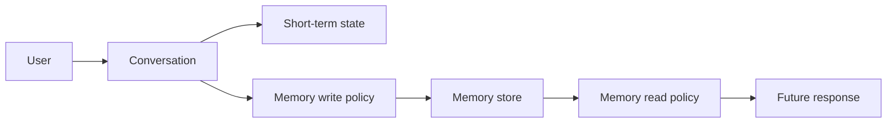

There are two important questions:

1. What should the assistant remember?
2. How should it use that memory later?

The answer is different for every product. A learning assistant may remember topics, tone, and goals. A medical assistant may remember almost nothing unless the user explicitly approves it. A sales assistant may remember product interest, company size, and follow-up timing.

That is why memory is a product design problem as much as a technical problem.

For StudySpark, memory might remember that a student prefers concise explanations, is preparing for Week 3 exams, and wants Python examples. It should not remember unrelated chat, sensitive personal data, or stale goals the student has moved past.

## Why Memory Exists
Memory exists because language models are stateless by default.

They generate responses based on the current prompt and context window. Once a turn ends, the model does not automatically keep a durable understanding of the user unless the application stores and reuses that information.

Memory solves several practical problems:

- repeated explanations
- lost user preferences
- broken multi-turn workflows
- poor continuity between sessions
- assistants that feel cold or forgetful

Imagine a tutoring app. If a student says "keep the explanations short" in one session, the app should not force them to repeat that preference every day. Memory lets the app remember this safely.

### Memory vs retrieval vs conversation history

| Layer | Question it answers | Example in StudySpark |
| --- | --- | --- |
| Conversation history | What was said in this thread? | last 10 chat turns |
| RAG retrieval | What do course docs say? | Day 17 chunk on citations |
| Memory | What should we remember about this user? | prefers concise answers |

## Historical Background
Early chat systems were mostly stateless. They used the current prompt and maybe a short conversation buffer.

As assistants became more useful, teams started adding:

- conversation history
- summaries
- user profile data
- retrieval over previous interactions
- persistent memory stores

This evolution happened because users wanted continuity. A good assistant should not only answer correctly, it should also remember helpful context.

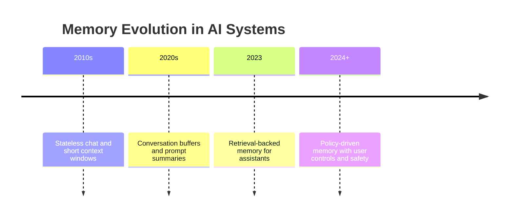

## Deep Theory

### What is memory in an AI app?
Memory is stored information that helps future interactions.

This information might include:

- user preferences
- project names
- prior goals
- summaries of past conversations
- recurring facts the user explicitly wants remembered
- state needed to continue an unfinished task

Memory is not the same as logs. Logs are for debugging and analytics. Memory is for future user benefit.

### Why memory is not just retrieval
Retrieval finds relevant existing knowledge. Memory creates and maintains useful user-specific knowledge over time.

That distinction matters.

- retrieval answers: "what documents are relevant?"
- memory answers: "what should I remember about this user or task?"

Memory may use retrieval as a tool, but it has its own policy, lifecycle, and privacy concerns.

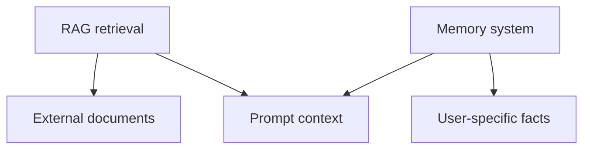

### Memory types
There are several practical memory types in AI systems:

| Memory Type | What it stores | Time horizon | Example |
| --- | --- | --- | --- |
| Short-term state | Current conversation context | Minutes | "We are debugging a Python app." |
| Session memory | Facts for one session | Hours | "User wants short answers today." |
| Preference memory | Stable user preferences | Weeks or months | "Prefers TypeScript examples." |
| Summary memory | Compressed history | Varies | "The user is building a course assistant." |
| Episodic memory | Events or interactions | Varies | "Last week the user asked about RAG." |
| Long-term memory | Durable user-approved facts | Long term | "Works on AI engineering curriculum." |

Day 20 will go deeper on long-term memory. Today we focus on session memory and the policies that govern what gets stored.

### Internal mechanics
Good memory systems usually follow a pipeline like this:

1. observe an interaction
2. decide whether anything should be remembered
3. transform raw information into a concise memory item
4. store the memory with metadata and timestamps
5. retrieve the memory later if it is still relevant
6. optionally revise or delete it

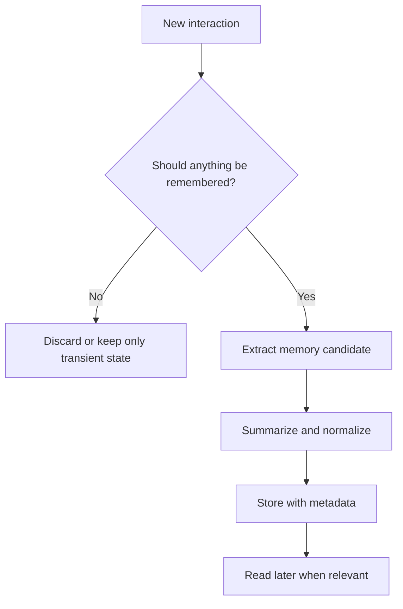

### Write policy vs read policy
**Write policy** decides what gets stored.

**Read policy** decides what gets injected into the prompt.

They are not the same. You might store ten memory items but only read the three most relevant to the current question. StudySpark might store a student's exam date but only surface it when the student asks about study planning.

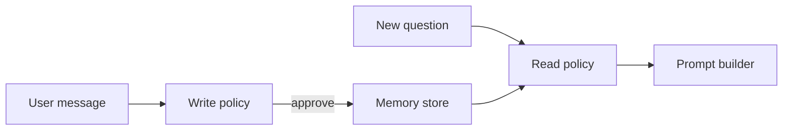

### Why memory needs policy
If a system saves every message, memory becomes noisy, unsafe, and expensive.

Policies define:

- what qualifies as memory
- how long memory stays valid
- who can see it
- how to update or delete it
- when to ask for user consent

Without policy, memory becomes a liability.

### Token budget and session limits
Memory competes with conversation history and RAG context for the same context window.

A practical session policy might keep:

- the last N messages (for example 12 turns)
- up to M tokens of summarized session memory
- only the top K relevant persistent memory items

This prevents the prompt from growing without bound.

### Advantages
- improves continuity across turns and sessions
- reduces repetitive questions
- supports personalization
- helps long-running tasks and agents
- makes assistants feel more helpful and consistent

### Limitations
- stale memory can mislead the assistant
- privacy and consent risks are real
- memory can be wrong or incomplete
- memory storage adds operational complexity
- poor policy design can surprise users

### Alternatives
- use conversation history only
- use session summaries without persistent storage
- ask the user for context each time
- use retrieval from documents instead of user memory

### When should you use memory?
Use memory when the assistant benefits from remembering:

- preferences
- recurring goals
- ongoing tasks
- project context
- stable user-approved facts

### When should you not use memory?
Do not store memory when:

- the information is sensitive and not needed
- the fact is too temporary to matter
- the user did not consent
- the memory would likely become stale quickly
- the system cannot explain or edit it safely

## Visual Learning

### Read-Write Cycle
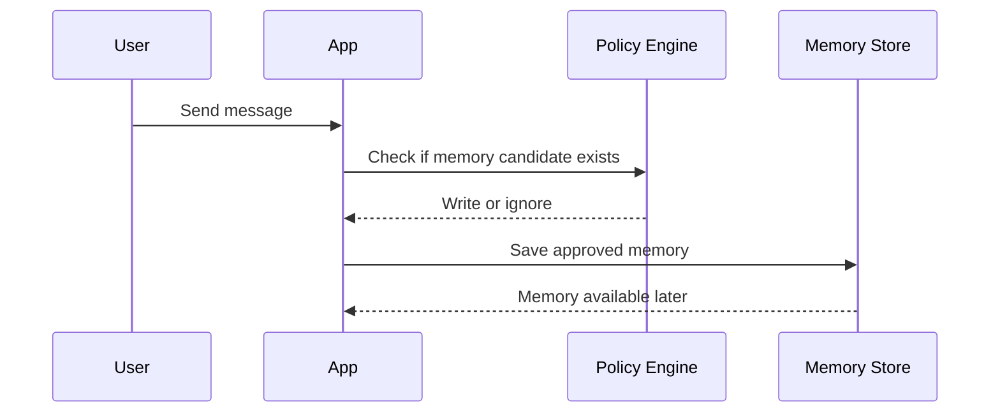

### Memory Architecture
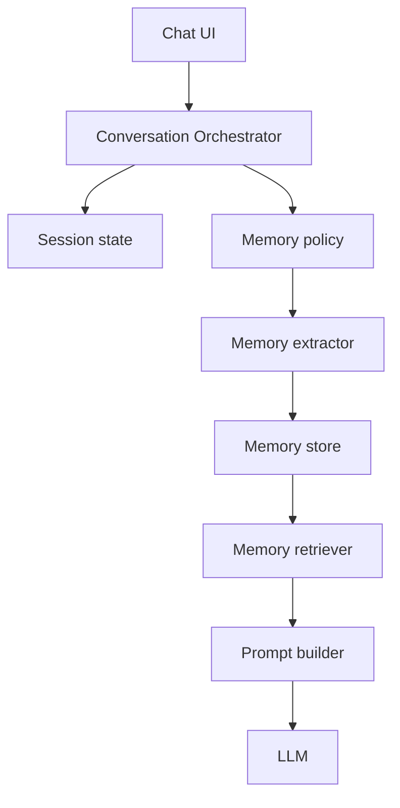

### Memory Decision Tree
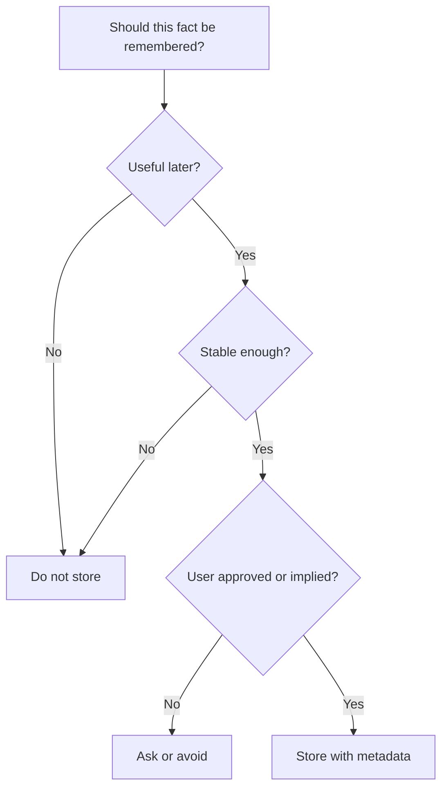

### Memory Categories Map
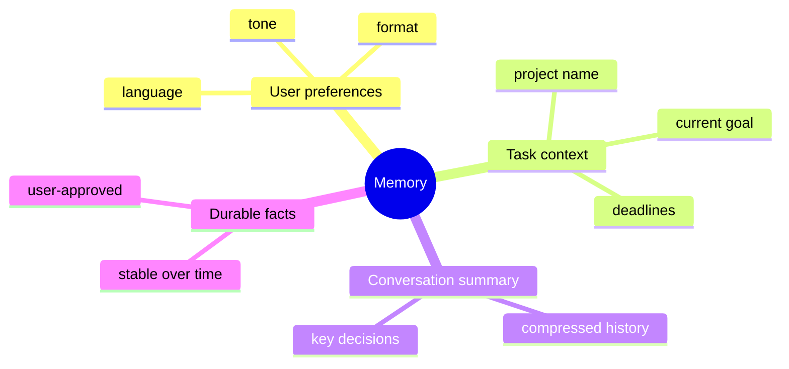

### StudySpark Memory Stack
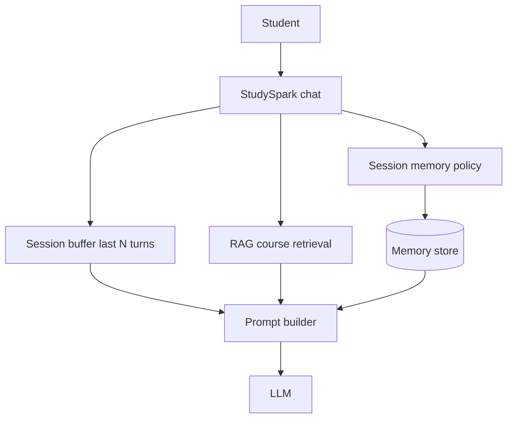

### Stale Memory Lifecycle
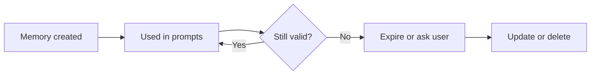

### Context Window Budget
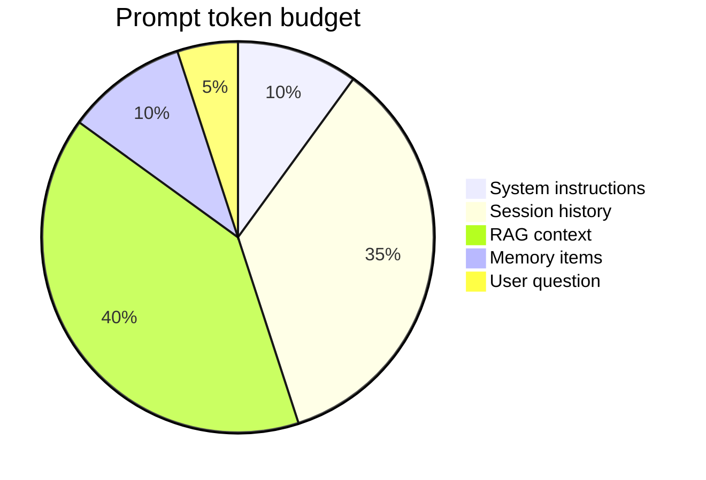

### Memory vs Logs
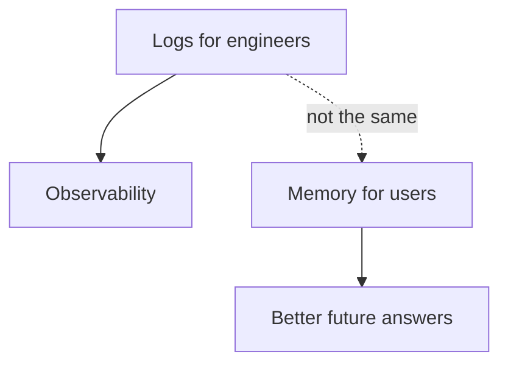

## Code Walkthrough

The examples below use small in-memory data structures so the flow is easy to follow. Production code belongs in `app/memory/` under [`projects/studyspark/`](../../projects/studyspark/).

### Python Example: Simple memory policy
```python
def should_store_memory(message):
    """Return True when a message contains a useful, stable memory candidate."""
    keywords = ["prefer", "always", "remember", "my goal is", "I am building"]
    message_lower = message.lower()

    return any(keyword in message_lower for keyword in keywords)


messages = [
    "I prefer concise explanations.",
    "The weather is nice today.",
    "I am building a course assistant.",
]

for message in messages:
    print(message, "->", should_store_memory(message))
```

#### Code Explanation
- `should_store_memory` is the first policy gate.
- `keywords` approximate the kinds of messages that might contain memory-worthy facts.
- `message_lower` makes the check case-insensitive.
- `any(...)` returns `True` when one of the keywords is present.
- `messages` is a tiny test set.
- the loop shows which messages would be stored.

This is not a production memory engine. It is a teaching model for the policy idea.

### TypeScript Example: Memory record shape
```typescript
type MemoryRecord = {
  id: string;
  userId: string;
  category: 'preference' | 'task' | 'summary' | 'fact';
  content: string;
  createdAt: string;
  updatedAt: string;
  source: string;
  expiresAt?: string;
};

const memory: MemoryRecord = {
  id: 'mem-1',
  userId: 'user-42',
  category: 'preference',
  content: 'Prefers concise explanations.',
  createdAt: new Date().toISOString(),
  updatedAt: new Date().toISOString(),
  source: 'conversation',
};

console.log(memory);
```

#### Code Explanation
- `MemoryRecord` defines a clear memory schema.
- `category` keeps memory types separate.
- `createdAt` and `updatedAt` support auditing and freshness.
- `expiresAt` supports session or time-bound memory.
- `source` tells us where the memory came from.

### Python Example: Session buffer with token limit
```python
MAX_TURNS = 12

session_history = []


def add_turn(role, content):
    session_history.append({"role": role, "content": content})

    if len(session_history) > MAX_TURNS:
        session_history.pop(0)


add_turn("user", "Explain RAG.")
add_turn("assistant", "RAG combines retrieval and generation.")
print(len(session_history))
```

#### Code Explanation
- `MAX_TURNS` caps how much conversation stays in session state.
- `add_turn` appends and trims oldest messages.
- this is short-term memory, not durable long-term storage.

### Python Example: Summarizing conversation into memory
```python
def summarize_conversation(turns):
    summary_parts = []

    for turn in turns:
        if "prefer" in turn.lower() or "building" in turn.lower():
            summary_parts.append(turn)

    return " | ".join(summary_parts)


turns = [
    "The user is building an AI engineering course.",
    "The user prefers concise explanations.",
    "The user discussed their favorite movie.",
]

print(summarize_conversation(turns))
```

#### Code Explanation
- `summarize_conversation` compresses noisy turns into useful memory content.
- only memory-relevant lines are kept.
- the summary is shorter and easier to store than raw conversation text.

### TypeScript Example: Reading memory into a prompt
```typescript
function buildPromptWithMemory(question: string, memoryItems: string[]): string {
  const memoryBlock = memoryItems.length
    ? memoryItems.map((item) => `- ${item}`).join('\n')
    : '- none';

  return [
    'You are a helpful assistant.',
    'Use the memory only if it is relevant and helpful.',
    'If memory conflicts with retrieved course material, prefer the retrieved material.',
    '',
    'Memory:',
    memoryBlock,
    '',
    `Question: ${question}`,
    'Answer:',
  ].join('\n');
}

console.log(buildPromptWithMemory('Help me plan today.', ['Prefers concise explanations.', 'Building an AI course.']));
```

#### Code Explanation
- `buildPromptWithMemory` inserts memory items into the prompt.
- the prompt tells the model to use memory only when relevant.
- memory stays separate from RAG context and the user question.

### Python Example: Memory update policy
```python
def update_memory(store, message):
    if not should_store_memory(message):
        return store

    store.append({
        "content": message,
        "category": "preference" if "prefer" in message.lower() else "task",
        "source": "conversation",
    })

    return store


memory_store = []
memory_store = update_memory(memory_store, "I prefer concise explanations.")
memory_store = update_memory(memory_store, "The weather is nice today.")

print(memory_store)
```

#### Code Explanation
- `update_memory` applies the write policy.
- messages that are not memory-worthy are ignored.
- memory entries are tagged with a category and source.
- the store remains small and relevant.

### TypeScript Example: User memory review
```typescript
type MemoryStore = MemoryRecord[];

function listUserMemory(store: MemoryStore, userId: string): MemoryRecord[] {
  return store.filter((item) => item.userId === userId);
}

function deleteMemory(store: MemoryStore, memoryId: string): MemoryStore {
  return store.filter((item) => item.id !== memoryId);
}
```

#### Code Explanation
- users should be able to inspect and delete memory
- `listUserMemory` supports a review screen in StudySpark settings
- `deleteMemory` implements the right to remove stored facts

## More Deep Theory

### The memory lifecycle in production
Memory is not "write once, read forever." Healthy systems treat each item as having a lifecycle:

1. **capture** — detect a candidate fact from conversation
2. **validate** — apply write policy and consent rules
3. **normalize** — summarize into a compact, labeled record
4. **store** — persist with user ID, category, timestamps, source
5. **retrieve** — read policy selects relevant items for the current turn
6. **revise** — update when the user corrects a fact
7. **expire** — remove or archive when stale or no longer useful

Skipping any step creates product risk. Capture without validation stores noise. Store without expire accumulates stale facts. Retrieve without read policy bloats every prompt.

### Memory extraction strategies

| Strategy | How it works | Risk |
| --- | --- | --- |
| Keyword triggers | store when user says "remember" | misses implicit preferences |
| LLM extraction | model proposes memory items | may over-extract |
| Explicit UI | user clicks "save this" | lower volume, higher trust |
| Hybrid | triggers + confirmation | best balance for StudySpark |

For a learning assistant, a hybrid approach works well: auto-detect obvious preferences, but ask confirmation before storing goals or personal context.

### How memory interacts with RAG and tools
A complete assistant prompt may include four context sources:

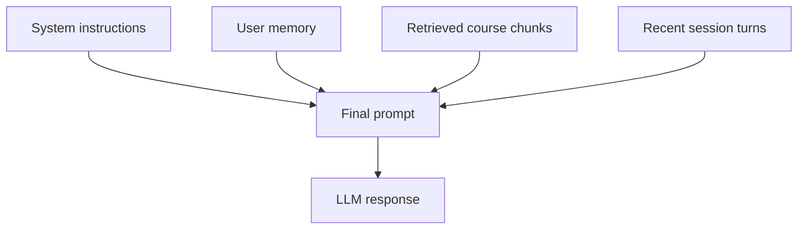

Priority rules matter. Course facts from RAG should usually override stale user assumptions. Memory should personalize tone and goals, not invent curriculum content. Session history provides immediate continuity but should be trimmed aggressively.

## Comparison Tables

### What to remember vs what to ignore

| Message | Store? | Why |
| --- | --- | --- |
| "I prefer short answers" | Yes | stable preference |
| "I'm studying for Week 3 exam" | Yes | useful task context |
| "It's raining today" | No | temporary, not useful later |
| "My password is abc123" | Never | sensitive, unsafe |

### Session memory vs long-term memory

| Property | Session memory | Long-term memory |
| --- | --- | --- |
| Duration | hours | weeks or months |
| Update frequency | every turn | selective |
| User visibility | often implicit | should be explicit |
| Day 20 focus | preview today | deep dive tomorrow |

## Practical Examples

### Beginner Example: Remembering tone preference
A user says, "I like short answers."

The assistant stores that preference and uses it next time. This is a simple memory feature, but it has a large effect on user experience.

Why it works:

- the memory is stable and useful
- it improves future conversations
- the user benefits immediately

### Intermediate Example: Ongoing project memory
A developer is building a study assistant and mentions the project name, the target audience, and the preferred stack.

The assistant remembers the project context so later answers can stay aligned with the same goal.

What could go wrong:

- if the project changes, old memory may become stale
- if the assistant remembers too much, it may surface irrelevant details

### Professional Example: Customer support assistant
A support assistant remembers that a customer is on the enterprise plan, prefers email follow-ups, and is currently working through onboarding.

This lets the assistant provide better help without asking the same setup questions every time.

Why professionals like this:

- fewer repeated steps
- better continuity
- smoother support workflows

### Real-World Company Example
Products like Notion-style assistants, CRM copilots, and customer support tools all benefit from memory when the memory is carefully scoped.

For example, a sales assistant may remember that a lead is interested in a product demo, but it should not remember sensitive information that is irrelevant to future support.

### StudySpark Example
A student tells StudySpark: "I'm focusing on Week 3 retrieval topics and want Python examples."

StudySpark stores this as session/task memory. Later, when the student asks for practice exercises, StudySpark tailors suggestions without re-asking. When the student opens a new topic in Week 4, stale Week 3 focus memory should expire or be updated.

## Best Practices
- store only useful, stable, user-approved information
- separate session state from persistent memory
- summarize before storing when possible
- let users inspect, correct, and delete memory
- add timestamps, source information, and categories
- expire or revalidate old facts
- keep memory writes auditable
- treat memory as user data, not a hidden log
- use clear labels for preference, task, and factual memory
- define max messages or tokens for session context
- prefer retrieved course facts over stale user memory when they conflict

## Common Mistakes
- saving everything by default
- storing sensitive data without consent
- confusing memory with retrieval
- never pruning old or irrelevant facts
- using memory in ways that surprise the user
- mixing temporary conversation state with durable memory
- not recording why a memory was created
- stuffing all memory into every prompt regardless of relevance
- forgetting that memory competes with RAG for context window space

### Debugging Strategy
When memory behavior feels wrong, check the system in this order:

1. Was the memory candidate actually useful?
2. Did the policy store the right category?
3. Is the memory stale or incorrect?
4. Was the memory read at the right time?
5. Did the prompt overuse memory instead of treating it as supporting context?

This order helps separate bad policy from bad retrieval or prompt design.

## Performance

Memory affects latency, cost, storage, and trust.

### Latency
Memory lookups should be fast, especially during chat.

You can reduce latency by:

- storing compact memory items
- indexing by user and category
- caching recent memory reads
- limiting how much memory is inserted into prompts

### Cost
Costs grow when:

- you store too much memory
- you repeatedly summarize the same content
- you fetch large memory sets on every turn

### Memory
Memory stores can become large if the system never prunes old data.

Use expiration, review, and compaction to keep the store healthy.

### Scalability
To scale memory systems, teams often:

- partition by user or tenant
- separate hot session data from long-term memory
- compress summaries
- store metadata for efficient filtering

### Token Optimization
Good memory reduces prompt bloat.

Instead of sending the entire conversation history every time, the assistant can include only the most useful memory items plus a trimmed session buffer.

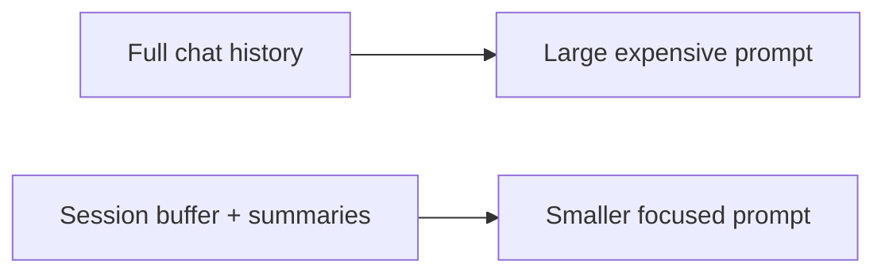

### Reliability
The assistant should behave consistently when memory is missing, stale, or unavailable.

That means the system must degrade gracefully instead of failing unpredictably.

## Security

Memory is deeply personal data, so safety matters.

### Prompt Injection
Do not let memory content become a vehicle for malicious instructions. Treat stored user text as untrusted when re-inserted into prompts.

### Secrets and API Keys
Never store credentials, tokens, or sensitive secrets as memory.

### Authentication and Authorization
Memory should be scoped to the correct user or tenant.

### Data Privacy
Users should know what is remembered and should be able to remove it.

### Hallucinations and Model Safety
The model may overtrust memory even when it is wrong.

To reduce risk:

- label memory by type and freshness
- keep memory separate from factual retrieval when possible
- allow the system to say "I may be using old memory"

## Evaluation
Memory should be evaluated on usefulness, correctness, and user trust.

### Useful questions to ask
- Did memory reduce repeated questions?
- Did it help the user complete a task faster?
- Did it avoid storing anything sensitive?
- Was the memory still correct later?
- Did the user understand why it was stored?

### Important metrics
- memory hit rate
- memory usefulness score
- deletion success rate
- stale memory rate
- user correction rate
- token savings vs full history baseline

## Tradeoffs and Tuning

### More memory vs less memory
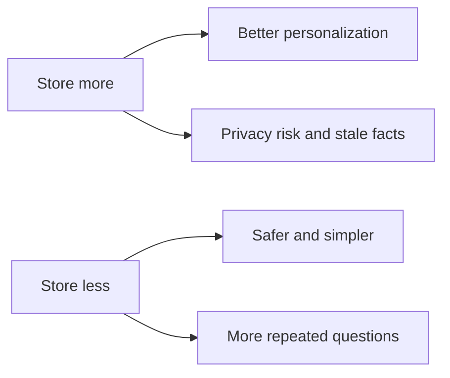

### Automatic vs explicit memory
Automatic extraction is convenient but risky. Explicit "remember this" commands give users control. StudySpark can support both with clear UI labels.

## Production Troubleshooting Checklist

1. list all memory items for a test user and inspect categories
2. verify write policy rejects temporary or sensitive messages
3. check read policy only surfaces relevant items per query
4. confirm session buffer respects max turn and token limits
5. test deletion and verify memory stays gone
6. compare answers with memory on vs off
7. check for conflicts between memory and RAG context

## Common Production Patterns

### Pattern 1: Session buffer + selective persistence
Keep recent turns in session state; persist only explicit preferences and goals.

### Pattern 2: Summarize then store
Compress conversation into a short summary memory item instead of raw transcripts.

### Pattern 3: Memory review screen
Let users see, edit, and delete what the assistant remembers.

## Exercises

### Easy
1. Define memory in an AI app.
2. List three things worth remembering.
3. Give one thing that should not be stored.
4. Explain why memory is different from logs.
5. Name two types of memory from today's table.
6. Explain why models are stateless by default.

### Medium
7. Draw the flow from conversation to memory store to future response.
8. Explain why summaries are often better than raw transcripts.
9. Describe one privacy risk in memory systems.
10. Compare session memory and persistent memory.
11. Explain the difference between write policy and read policy.
12. Describe how memory competes with RAG for context window space.
13. Give an example of stale memory in a tutoring app.

### Hard
14. Design a write policy for a tutoring assistant.
15. Design a read policy for memory retrieval.
16. Explain how you would expire stale memory safely.
17. Describe how user deletion should work end to end.
18. Define StudySpark session limits (max messages or tokens).
19. Design a conflict rule when memory disagrees with retrieved course content.

### Challenge
20. Build a memory policy for a learning assistant.
21. Add categories for preference, task, and summary memory.
22. Add timestamps and source tracking.
23. Add a user-facing memory review action.
24. Add a fallback when memory is unavailable.
25. Implement a prototype in `projects/studyspark/app/memory/`.

### Reflection Questions
26. Why is "remember everything" a bad strategy?
27. What makes memory useful rather than creepy?
28. How does memory improve continuity across sessions?
29. What is the difference between memory and retrieval again?
30. Which memory item would you be most careful about storing?

## Quizzes

### Quiz 1
1. What problem does memory solve that raw chat history does not?
2. Why do memory systems need a write policy?
3. What is session memory?
4. Why should users be able to delete memory?

### Quiz 2
1. How is memory different from RAG retrieval?
2. Why are summaries useful before storage?
3. What is a read policy?
4. Why can stale memory be dangerous?

### Quiz 3
1. Why should secrets never be stored as memory?
2. What happens if you save every message?
3. How does memory affect token cost?
4. What will Day 20 add beyond today's session focus?

## Interview Questions

### Conceptual
- What is memory in an AI application?
- Explain the difference between memory and retrieval.
- Why is "remember everything" a bad default?
- What belongs in session memory vs long-term memory?

### System Design
- Design a memory system for a tutoring assistant.
- How would you let users review and delete stored memory?
- Design session context limits for a chat product.
- How would memory, RAG, and tools coexist in one prompt?

### Debugging
- Users say the assistant "remembers wrong things." What do you check?
- Memory helped early but hurts later. Why?
- How do you detect stale memory automatically?

## Mini Project
Create a memory policy system for a learning assistant called StudyBuddy. Or implement the Day 19 slice in [`projects/studyspark/`](../../projects/studyspark/).

### Goal
Decide what the assistant should remember, what it should ignore, how it should store memory, and how the user can control it.

### Features
- detect memory-worthy messages
- classify memories into categories
- store only stable, useful facts
- read memory back into a prompt when relevant
- allow user review and deletion
- log why each memory was created
- enforce max messages or tokens in session context

### Suggested Folder Structure
```text
studyspark/
├── app/
│   ├── memory/
│   │   ├── policy.py
│   │   ├── extractor.py
│   │   ├── store.py
│   │   ├── retriever.py
│   │   └── session.py
│   └── main.py
├── data/
│   └── memory.json
├── tests/
│   └── test_policy.py
└── README.md
```

### Project Steps
1. define what counts as memory
2. classify messages into memory or non-memory
3. create a memory schema with category and source
4. add a read step that inserts memory into a prompt
5. add a deletion and review pathway
6. set session buffer limits (turns or tokens)
7. test the policy with sample conversations
8. update [`projects/CAPSTONE.md`](../../projects/CAPSTONE.md) for Day 19

### What You Learn
- how memory differs from plain conversation history
- how policy prevents over-collection
- how memory improves future responses
- how Day 20 will extend this idea into longer-lived memory

## Cumulative Capstone Update

Add to [`projects/CAPSTONE.md`](../../projects/CAPSTONE.md):
- session memory policy: what to remember vs forget each turn
- max messages or tokens kept in session context

## Summary
Memory gives an AI system continuity, but only when it is intentional.

The main lessons from today are:

- memory is not the same as retrieval
- not every fact should be remembered
- memory needs policy, user control, and auditing
- good memory improves continuity without creating privacy problems
- StudySpark becomes smarter when it remembers preferences and goals—not every chat message

If Day 18 taught us how to retrieve more intelligently, Day 19 teaches us how to remember responsibly.

[Previous: Day 18 - Hybrid Search](../day_18/day_18_hybrid_search.md) | [Next: Day 20 - Long-Term Memory](../day_20/day_20_long_term_memory.md)

## Historical Background

### From chat logs to intentional memory

The first generation of chatbots kept no durable state. Every request was independent. As context windows grew, teams started stuffing entire conversations into the prompt. That worked until conversations got long, expensive, and noisy.

Summarization was the next step: compress older turns into a short recap. That helped, but summaries alone are not memory—they lack structure, categories, and user control.

Modern assistants add **structured memory records** with policies. The shift mirrors how good software handles user preferences: explicit, editable, and scoped—not an accidental byproduct of debug logging.

### Why users distrust "creepy" memory

Users tolerate memory when it saves them effort. They reject memory when it feels surveillance-like.

The difference usually comes down to:

- **transparency** — can the user see what is stored?
- **control** — can they edit or delete it?
- **proportionality** — is the stored fact actually useful?
- **surprise** — does the assistant reference something the user forgot sharing?

StudySpark should surface a simple memory panel: "I remember that you prefer concise explanations and are focusing on Week 3." That one UI element converts memory from creepy to helpful.

## More Practical Examples

### Beginner follow-up: exam prep context
A student says, "My exam on retrieval topics is Friday."

StudySpark stores this as task memory with an `expiresAt` date after the exam. Before Friday, planning questions trigger helpful scheduling answers. After Friday, the memory expires automatically so the assistant does not keep referencing an outdated deadline.

### Intermediate follow-up: conflicting preferences
Early in a session the student says, "Give me detailed explanations." Later they say, "Actually, keep it short."

A good write policy **updates** the preference memory rather than storing both conflicting facts. Memory systems need upsert logic, not blind append.

### Professional follow-up: support handoff
A customer support bot remembers that the user already verified their account and uploaded logs. When the conversation escalates to a human agent, memory reduces repeated steps.

But the handoff export must exclude anything the user did not consent to share with agents. Memory portability requires the same privacy rules as the live assistant.

## Additional Code Examples

### Python Example: Upsert preference memory
```python
def upsert_preference(store, user_id, content):
    for item in store:
        if item["user_id"] == user_id and item["category"] == "preference":
            item["content"] = content
            item["updated_at"] = "2026-07-07T00:00:00Z"
            return store

    store.append({
        "user_id": user_id,
        "category": "preference",
        "content": content,
        "created_at": "2026-07-07T00:00:00Z",
        "updated_at": "2026-07-07T00:00:00Z",
        "source": "conversation",
    })
    return store
```

#### Code Explanation
- preferences should update in place, not duplicate
- timestamps support auditing and stale detection
- upsert logic prevents contradictory memory piles

### TypeScript Example: Read policy by category
```typescript
function selectMemoryForQuestion(
  memories: MemoryRecord[],
  question: string,
): MemoryRecord[] {
  const lower = question.toLowerCase();

  if (lower.includes('explain') || lower.includes('style')) {
    return memories.filter((m) => m.category === 'preference');
  }

  if (lower.includes('plan') || lower.includes('goal')) {
    return memories.filter((m) => m.category === 'task' || m.category === 'summary');
  }

  return memories.slice(0, 2);
}
```

#### Code Explanation
- read policy avoids dumping all memory into every prompt
- category-aware selection saves tokens and reduces confusion
- default cap (slice) prevents runaway context growth

### Python Example: Expire stale task memory
```python
from datetime import datetime


def expire_old_tasks(store, now_iso):
    now = datetime.fromisoformat(now_iso)
    fresh = []

    for item in store:
        expires = item.get("expires_at")
        if expires and datetime.fromisoformat(expires) < now:
            continue
        fresh.append(item)

    return fresh
```

#### Code Explanation
- task memory with deadlines should expire automatically
- expiration keeps the store trustworthy without manual cleanup
- combine with user-visible "memory expired" logs for transparency

## Further Reading
- https://www.langchain.com/langgraph
- https://docs.mem0.ai/
- https://modelcontextprotocol.io/
- https://learn.microsoft.com/en-us/azure/architecture/guide/ai/memory-patterns
- https://arxiv.org/abs/2308.08762
- [`projects/studyspark/README.md`](../../projects/studyspark/README.md)
- [`projects/CAPSTONE.md`](../../projects/CAPSTONE.md)
