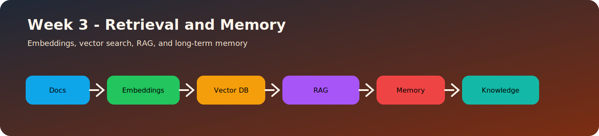
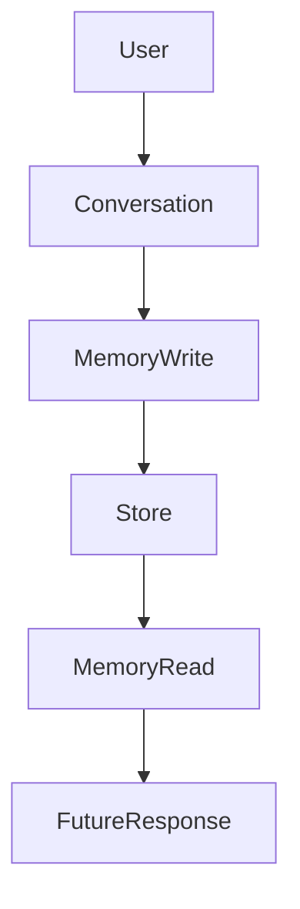

# Day 19 - Memory

## Introduction
Memory lets an AI system keep useful information across turns or sessions. It is what makes an assistant feel less forgetful and more personalized.



## Learning Objectives
By the end of this day, you should be able to:

- explain what memory means in an AI app
- distinguish short-term from long-term memory
- understand why memory needs rules and limits
- design a memory write and read policy
- identify privacy and safety concerns

## Theory
Not every fact should be remembered. Memory should store useful, stable, and user-approved information. Good memory systems are selective, auditable, and easy to update.

There are many kinds of memory: conversational state, user preferences, summaries, retrieved facts, and durable knowledge stores.

### Visual Diagram


## Code Examples

### Python
```python
memory = {
    "preferred_tone": "concise",
    "favorite_topic": "AI engineering",
}
print(memory)
```

### TypeScript
```typescript
const memory = {
  preferredTone: 'concise',
  favoriteTopic: 'AI engineering',
};

console.log(memory);
```

## Best Practices
- store only useful information
- let users inspect and edit memory when possible
- separate temporary context from persistent memory
- write summaries rather than raw conversation dumps
- treat memory as user data, not a free-for-all log

## Common Mistakes
- saving everything by default
- storing sensitive data without consent
- confusing memory with retrieval
- never pruning old or irrelevant facts
- using memory in ways that surprise the user

## Exercises
- Easy: Define memory in an AI app.
- Medium: List three things worth remembering.
- Hard: Design a memory update policy.
- Challenge: Describe how a user could delete memory safely.

## Mini Project
Create a memory policy for a learning assistant. Decide what it remembers, what it ignores, and how the user can manage it.

## Summary
Memory improves continuity, but it must be intentional. A strong memory system balances usefulness, control, and privacy.

## Additional Resources
- https://www.langchain.com/langgraph
- https://docs.mem0.ai/
- https://modelcontextprotocol.io/
