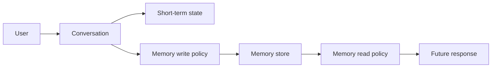
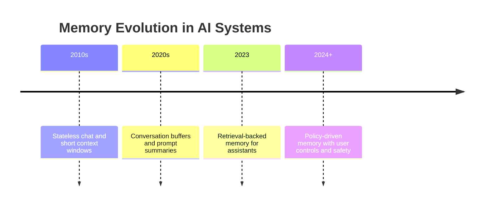
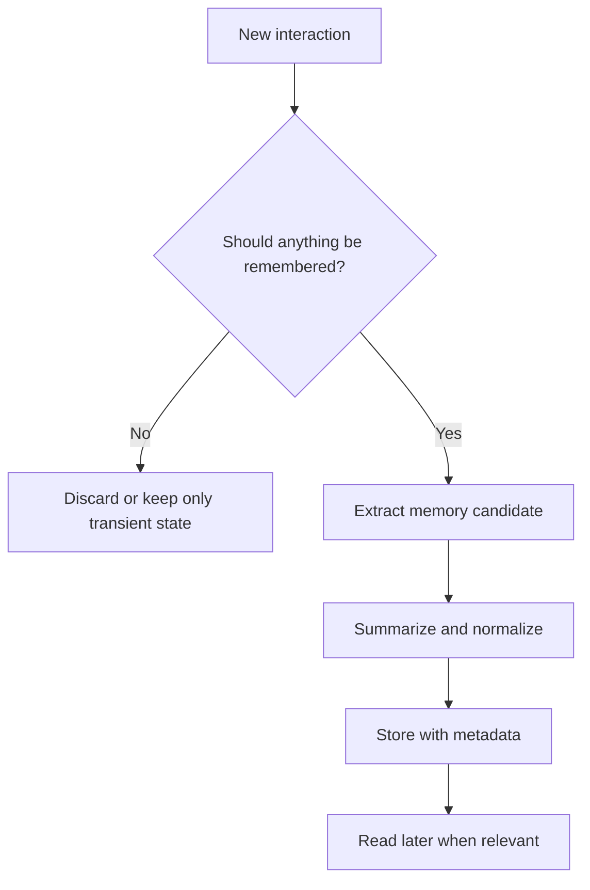
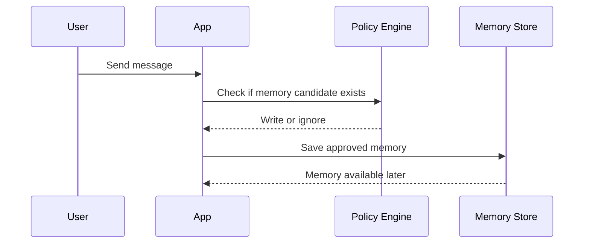
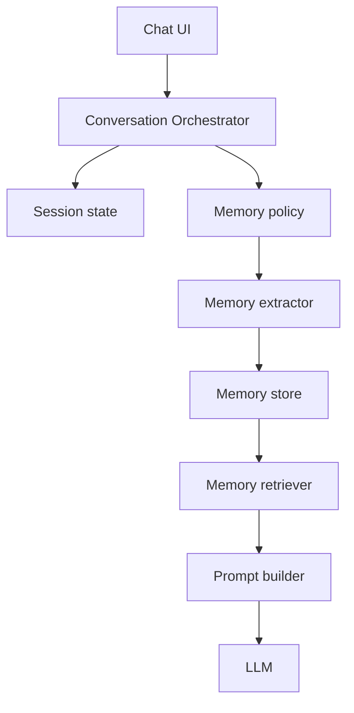
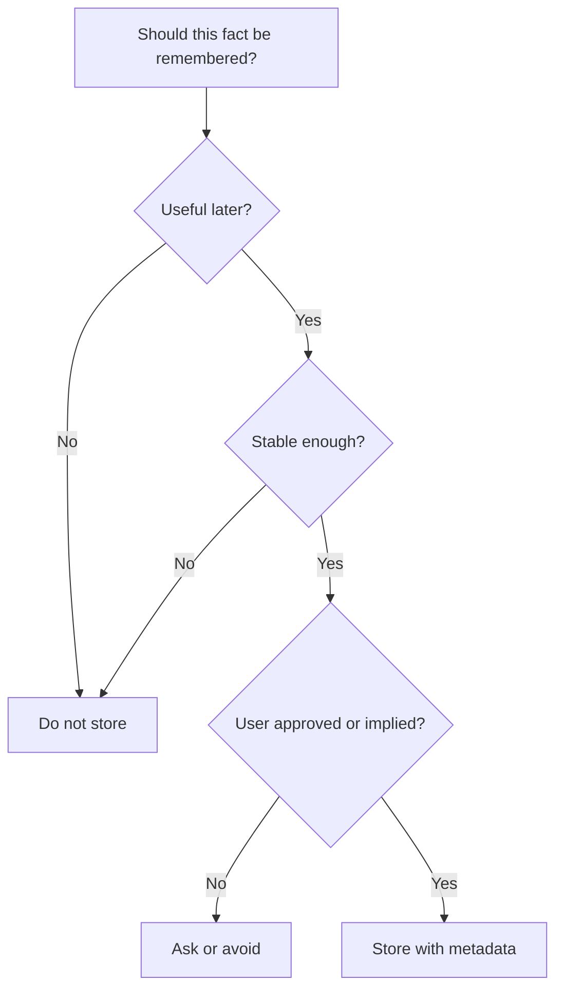
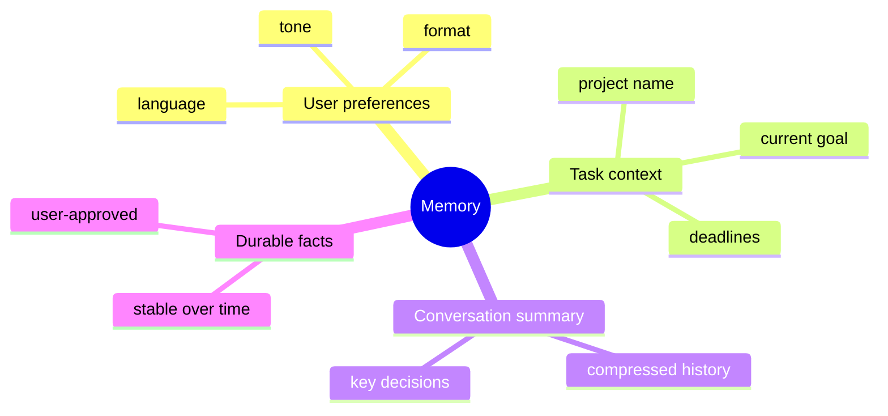

# Day 19 - Memory

[Previous: Day 18 - Hybrid Search](../day_18/day_18_hybrid_search.md) | [Next: Day 20 - Long-Term Memory](../day_20/day_20_long_term_memory.md)

## Introduction
Yesterday we improved retrieval with hybrid search. Today we move one step higher in the stack: memory.

Memory lets an AI system keep useful information across turns, conversations, or sessions so it can behave more consistently, feel more personalized, and avoid repeating the same questions again and again.


Without memory, every conversation starts from zero. The assistant forgets preferences, repeats explanations, and acts like a brand-new system each time. With memory, the assistant can remember stable, useful facts such as tone preference, project context, recurring goals, and user-approved details.

But memory is not a simple “save everything” feature. Good memory design is selective, auditable, privacy-aware, and easy to update.

In this chapter, you will learn how memory works, how it differs from retrieval, what should and should not be remembered, and how to design memory policies that help users instead of surprising them.

## Learning Objectives
By the end of this day, you should be able to:

- explain what memory means in an AI application
- distinguish short-term memory from persistent memory
- understand why memory needs rules, limits, and user control
- design a read policy and write policy for memory
- identify privacy, security, and safety concerns in memory systems
- compare memory storage strategies for assistants and agents
- build a simple memory lifecycle for a learning assistant

## Prerequisites
You should already understand:

- Day 17: Retrieval-Augmented Generation
- Day 18: Hybrid Search
- the ideas of metadata and retrieval filters
- basic prompt engineering

If those are unclear, review them first. Memory often uses retrieval under the hood, so the earlier retrieval lessons make this day much easier.

## Big Picture
Memory is the layer that helps an assistant carry context forward.



There are two important questions:

1. What should the assistant remember?
2. How should it use that memory later?

The answer is different for every product. A learning assistant may remember topics, tone, and goals. A medical assistant may remember almost nothing unless the user explicitly approves it. A sales assistant may remember product interest, company size, and follow-up timing.

That is why memory is a product design problem as much as a technical problem.

## Why Memory Exists
Memory exists because language models are stateless by default.

They generate responses based on the current prompt and context window. Once a turn ends, the model does not automatically keep a durable understanding of the user unless the application stores and reuses that information.

Memory solves several practical problems:

- repeated explanations
- lost user preferences
- broken multi-turn workflows
- poor continuity between sessions
- assistants that feel cold or forgetful

Imagine a tutoring app. If a student says “keep the explanations short” in one session, the app should not force them to repeat that preference every day. Memory lets the app remember this safely.

## Historical Background
Early chat systems were mostly stateless. They used the current prompt and maybe a short conversation buffer.

As assistants became more useful, teams started adding:

- conversation history
- summaries
- user profile data
- retrieval over previous interactions
- persistent memory stores

This evolution happened because users wanted continuity. A good assistant should not only answer correctly, it should also remember helpful context.



## Deep Theory

### What is memory in an AI app?
Memory is stored information that helps future interactions.

This information might include:

- user preferences
- project names
- prior goals
- summaries of past conversations
- recurring facts the user explicitly wants remembered
- state needed to continue an unfinished task

Memory is not the same as logs. Logs are for debugging and analytics. Memory is for future user benefit.

### Why memory is not just retrieval
Retrieval finds relevant existing knowledge. Memory creates and maintains useful user-specific knowledge over time.

That distinction matters.

- retrieval answers: “what documents are relevant?”
- memory answers: “what should I remember about this user or task?”

Memory may use retrieval as a tool, but it has its own policy, lifecycle, and privacy concerns.

### Memory types
There are several practical memory types in AI systems:

| Memory Type | What it stores | Time horizon | Example |
| --- | --- | --- | --- |
| Short-term state | Current conversation context | Minutes | “We are debugging a Python app.” |
| Session memory | Facts for one session | Hours | “User wants short answers today.” |
| Preference memory | Stable user preferences | Weeks or months | “Prefers TypeScript examples.” |
| Summary memory | Compressed history | Varies | “The user is building a course assistant.” |
| Episodic memory | Events or interactions | Varies | “Last week the user asked about RAG.” |
| Long-term memory | Durable user-approved facts | Long term | “Works on AI engineering curriculum.” |

### Internal mechanics
Good memory systems usually follow a pipeline like this:

1. observe an interaction
2. decide whether anything should be remembered
3. transform raw information into a concise memory item
4. store the memory with metadata and timestamps
5. retrieve the memory later if it is still relevant
6. optionally revise or delete it



### Why memory needs policy
If a system saves every message, memory becomes noisy, unsafe, and expensive.

Policies define:

- what qualifies as memory
- how long memory stays valid
- who can see it
- how to update or delete it
- when to ask for user consent

Without policy, memory becomes a liability.

### Advantages
- improves continuity across turns and sessions
- reduces repetitive questions
- supports personalization
- helps long-running tasks and agents
- makes assistants feel more helpful and consistent

### Limitations
- stale memory can mislead the assistant
- privacy and consent risks are real
- memory can be wrong or incomplete
- memory storage adds operational complexity
- poor policy design can surprise users

### Alternatives
- use conversation history only
- use session summaries without persistent storage
- ask the user for context each time
- use retrieval from documents instead of user memory

### When should you use memory?
Use memory when the assistant benefits from remembering:

- preferences
- recurring goals
- ongoing tasks
- project context
- stable user-approved facts

### When should you not use memory?
Do not store memory when:

- the information is sensitive and not needed
- the fact is too temporary to matter
- the user did not consent
- the memory would likely become stale quickly
- the system cannot explain or edit it safely

## Visual Learning

### Read-Write Cycle


### Memory Architecture


### Memory Decision Tree


### Memory Categories Map


## Code Walkthrough

The examples below use small in-memory data structures so the flow is easy to follow.

### Python Example: Simple memory policy
```python
def should_store_memory(message):
    """Return True when a message contains a useful, stable memory candidate."""
    keywords = ["prefer", "always", "remember", "my goal is", "I am building"]
    message_lower = message.lower()

    return any(keyword in message_lower for keyword in keywords)


messages = [
    "I prefer concise explanations.",
    "The weather is nice today.",
    "I am building a course assistant.",
]

for message in messages:
    print(message, "->", should_store_memory(message))
```

#### Code Explanation
- `should_store_memory` is the first policy gate.
- `keywords` approximate the kinds of messages that might contain memory-worthy facts.
- `message_lower` makes the check case-insensitive.
- `any(...)` returns `True` when one of the keywords is present.
- `messages` is a tiny test set.
- the loop shows which messages would be stored.

This is not a production memory engine. It is a teaching model for the policy idea.

### TypeScript Example: Memory record shape
```typescript
type MemoryRecord = {
  id: string;
  userId: string;
  category: 'preference' | 'task' | 'summary' | 'fact';
  content: string;
  createdAt: string;
  updatedAt: string;
  source: string;
};

const memory: MemoryRecord = {
  id: 'mem-1',
  userId: 'user-42',
  category: 'preference',
  content: 'Prefers concise explanations.',
  createdAt: new Date().toISOString(),
  updatedAt: new Date().toISOString(),
  source: 'conversation',
};

console.log(memory);
```

#### Code Explanation
- `MemoryRecord` defines a clear memory schema.
- `category` keeps memory types separate.
- `createdAt` and `updatedAt` support auditing and freshness.
- `source` tells us where the memory came from.

### Python Example: Summarizing conversation into memory
```python
def summarize_conversation(turns):
    summary_parts = []

    for turn in turns:
        if "prefer" in turn.lower() or "building" in turn.lower():
            summary_parts.append(turn)

    return " | ".join(summary_parts)


turns = [
    "The user is building an AI engineering course.",
    "The user prefers concise explanations.",
    "The user discussed their favorite movie.",
]

print(summarize_conversation(turns))
```

#### Code Explanation
- `summarize_conversation` compresses noisy turns into useful memory content.
- only memory-relevant lines are kept.
- the summary is shorter and easier to store than raw conversation text.

### TypeScript Example: Reading memory into a prompt
```typescript
function buildPromptWithMemory(question: string, memoryItems: string[]): string {
  const memoryBlock = memoryItems.map((item) => `- ${item}`).join('\n');

  return [
    'You are a helpful assistant.',
    'Use the memory only if it is relevant and helpful.',
    '',
    'Memory:',
    memoryBlock,
    '',
    `Question: ${question}`,
    'Answer:',
  ].join('\n');
}

console.log(buildPromptWithMemory('Help me plan today.', ['Prefers concise explanations.', 'Building an AI course.']));
```

#### Code Explanation
- `buildPromptWithMemory` inserts memory items into the prompt.
- the prompt tells the model to use memory only when relevant.
- memory stays separate from the user question, which keeps the prompt easier to reason about.

### Python Example: Memory update policy
```python
def update_memory(store, message):
    if not should_store_memory(message):
        return store

    store.append({
        "content": message,
        "category": "preference" if "prefer" in message.lower() else "task",
    })

    return store


memory_store = []
memory_store = update_memory(memory_store, "I prefer concise explanations.")
memory_store = update_memory(memory_store, "The weather is nice today.")

print(memory_store)
```

#### Code Explanation
- `update_memory` applies the write policy.
- messages that are not memory-worthy are ignored.
- memory entries are tagged with a category.
- the store remains small and relevant.

## Practical Examples

### Beginner Example: Remembering tone preference
A user says, “I like short answers.”

The assistant stores that preference and uses it next time. This is a simple memory feature, but it has a large effect on user experience.

Why it works:

- the memory is stable and useful
- it improves future conversations
- the user benefits immediately

### Intermediate Example: Ongoing project memory
A developer is building a study assistant and mentions the project name, the target audience, and the preferred stack.

The assistant remembers the project context so later answers can stay aligned with the same goal.

What could go wrong:

- if the project changes, old memory may become stale
- if the assistant remembers too much, it may surface irrelevant details

### Professional Example: Customer support assistant
A support assistant remembers that a customer is on the enterprise plan, prefers email follow-ups, and is currently working through onboarding.

This lets the assistant provide better help without asking the same setup questions every time.

Why professionals like this:

- fewer repeated steps
- better continuity
- smoother support workflows

### Real-World Company Example
Products like Notion-style assistants, CRM copilots, and customer support tools all benefit from memory when the memory is carefully scoped.

For example, a sales assistant may remember that a lead is interested in a product demo, but it should not remember sensitive information that is irrelevant to future support.

## Best Practices
- store only useful, stable, user-approved information
- separate session state from persistent memory
- summarize before storing when possible
- let users inspect, correct, and delete memory
- add timestamps, source information, and categories
- expire or revalidate old facts
- keep memory writes auditable
- treat memory as user data, not a hidden log
- use clear labels for preference, task, and factual memory

## Common Mistakes
- saving everything by default
- storing sensitive data without consent
- confusing memory with retrieval
- never pruning old or irrelevant facts
- using memory in ways that surprise the user
- mixing temporary conversation state with durable memory
- not recording why a memory was created

### Debugging Strategy
When memory behavior feels wrong, check the system in this order:

1. Was the memory candidate actually useful?
2. Did the policy store the right category?
3. Is the memory stale or incorrect?
4. Was the memory read at the right time?
5. Did the prompt overuse memory instead of treating it as supporting context?

This order helps separate bad policy from bad retrieval or prompt design.

## Performance

Memory affects latency, cost, storage, and trust.

### Latency
Memory lookups should be fast, especially during chat.

You can reduce latency by:

- storing compact memory items
- indexing by user and category
- caching recent memory reads
- limiting how much memory is inserted into prompts

### Cost
Costs grow when:

- you store too much memory
- you repeatedly summarize the same content
- you fetch large memory sets on every turn

### Memory
Memory stores can become large if the system never prunes old data.

Use expiration, review, and compaction to keep the store healthy.

### Scalability
To scale memory systems, teams often:

- partition by user or tenant
- separate hot session data from long-term memory
- compress summaries
- store metadata for efficient filtering

### Token Optimization
Good memory reduces prompt bloat.

Instead of sending the entire conversation history every time, the assistant can include only the most useful memory items.

### Reliability
The assistant should behave consistently when memory is missing, stale, or unavailable.

That means the system must degrade gracefully instead of failing unpredictably.

## Security

Memory is deeply personal data, so safety matters.

### Prompt Injection
Do not let memory content become a vehicle for malicious instructions.

### Secrets and API Keys
Never store credentials, tokens, or sensitive secrets as memory.

### Authentication and Authorization
Memory should be scoped to the correct user or tenant.

### Data Privacy
Users should know what is remembered and should be able to remove it.

### Hallucinations and Model Safety
The model may overtrust memory even when it is wrong.

To reduce risk:

- label memory by type and freshness
- keep memory separate from factual retrieval when possible
- allow the system to say “I may be using old memory”

## Evaluation
Memory should be evaluated on usefulness, correctness, and user trust.

### Useful questions to ask
- Did memory reduce repeated questions?
- Did it help the user complete a task faster?
- Did it avoid storing anything sensitive?
- Was the memory still correct later?
- Did the user understand why it was stored?

### Important metrics
- memory hit rate
- memory usefulness score
- deletion success rate
- stale memory rate
- user correction rate

## Exercises

### Easy
1. Define memory in an AI app.
2. List three things worth remembering.
3. Give one thing that should not be stored.
4. Explain why memory is different from logs.

### Medium
5. Draw the flow from conversation to memory store to future response.
6. Explain why summaries are often better than raw transcripts.
7. Describe one privacy risk in memory systems.
8. Compare session memory and persistent memory.

### Hard
9. Design a write policy for a tutoring assistant.
10. Design a read policy for memory retrieval.
11. Explain how you would expire stale memory safely.
12. Describe how user deletion should work end to end.

### Challenge
13. Build a memory policy for a learning assistant.
14. Add categories for preference, task, and summary memory.
15. Add timestamps and source tracking.
16. Add a user-facing memory review action.
17. Add a fallback when memory is unavailable.

### Reflection Questions
18. Why is “remember everything” a bad strategy?
19. What makes memory useful rather than creepy?
20. How does memory improve continuity across sessions?
21. What is the difference between memory and retrieval again?
22. Which memory item would you be most careful about storing?

## Mini Project
Create a memory policy system for a learning assistant called StudyBuddy.

### Goal
Decide what the assistant should remember, what it should ignore, how it should store memory, and how the user can control it.

### Features
- detect memory-worthy messages
- classify memories into categories
- store only stable, useful facts
- read memory back into a prompt when relevant
- allow user review and deletion
- log why each memory was created

### Suggested Folder Structure
```text
studybuddy-memory/
├── app/
│   ├── policy.py
│   ├── extractor.py
│   ├── store.py
│   ├── retriever.py
│   └── main.py
├── data/
│   └── memory.json
├── tests/
│   └── test_policy.py
└── README.md
```

### Project Steps
1. define what counts as memory
2. classify messages into memory or non-memory
3. create a memory schema with category and source
4. add a read step that inserts memory into a prompt
5. add a deletion and review pathway
6. test the policy with sample conversations

### What You Learn
- how memory differs from plain conversation history
- how policy prevents over-collection
- how memory improves future responses
- how Day 20 will extend this idea into longer-lived memory

## Summary
Memory gives an AI system continuity, but only when it is intentional.

The main lessons from today are:

- memory is not the same as retrieval
- not every fact should be remembered
- memory needs policy, user control, and auditing
- good memory improves continuity without creating privacy problems

If Day 18 taught us how to retrieve more intelligently, Day 19 teaches us how to remember responsibly.

[Previous: Day 18 - Hybrid Search](../day_18/day_18_hybrid_search.md) | [Next: Day 20 - Long-Term Memory](../day_20/day_20_long_term_memory.md)

## Further Reading
- https://www.langchain.com/langgraph
- https://docs.mem0.ai/
- https://modelcontextprotocol.io/
- https://learn.microsoft.com/en-us/azure/architecture/guide/ai/memory-patterns
- https://arxiv.org/abs/2308.08762
