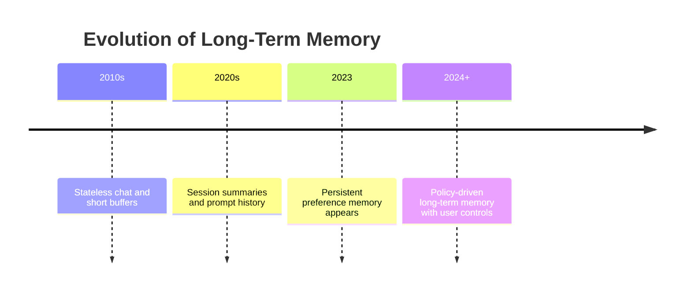
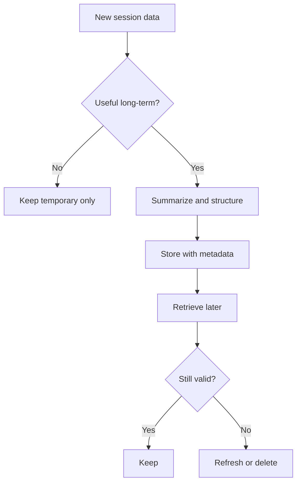
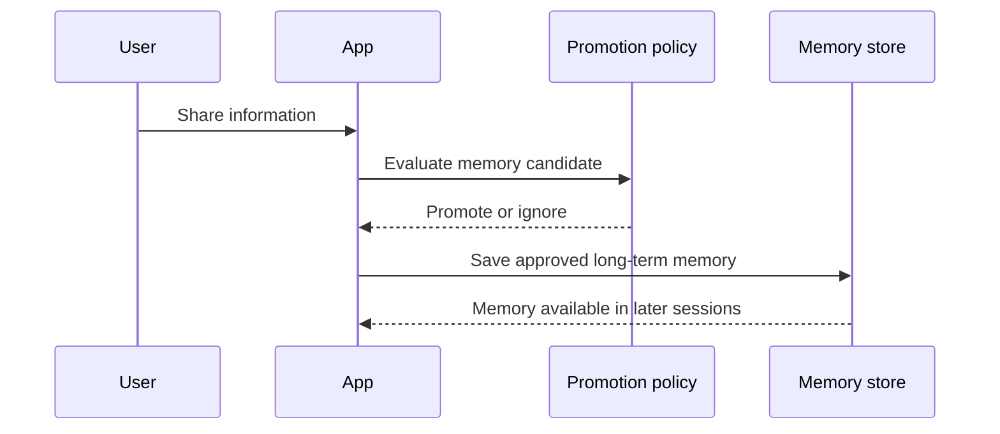
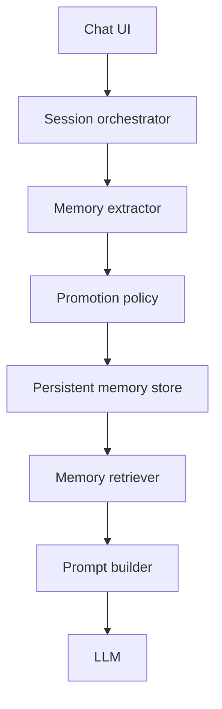
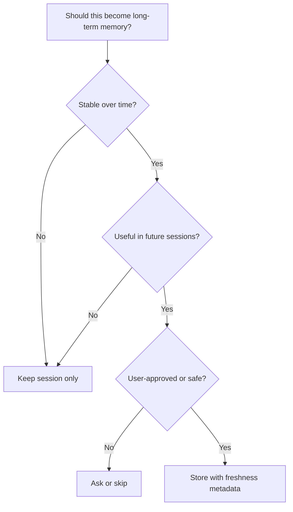
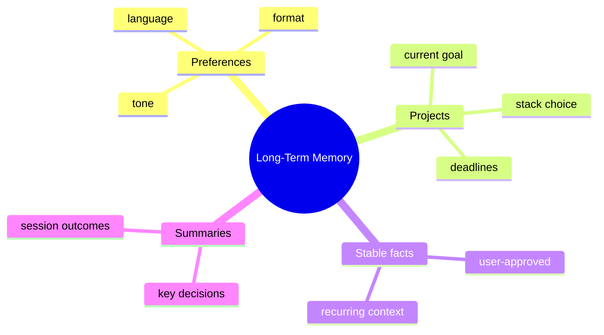

# Day 20 - Long-Term Memory

[Previous: Day 19 - Memory](../day_19/day_19_memory.md) | [Next: Day 21 - Knowledge Assistant Project](../day_21/day_21_knowledge_assistant_project.md)

## Introduction
Yesterday we learned how to design memory policies for an assistant. Today we take the next step: long-term memory.

Long-term memory stores useful information across many sessions so the assistant can behave more consistently over time. It is what makes an assistant feel persistent instead of starting from zero every time.


But persistence is not free. If you store the wrong things, memory becomes stale, noisy, or unsafe. If you store too little, the assistant feels forgetful. The real challenge is not only saving memory. The challenge is deciding what should persist, for how long, and under what rules.

This chapter explains how long-term memory works, how it differs from session memory, how memory is promoted and refreshed, and how to design a lifecycle that supports helpful personalization without overreach.

## Learning Objectives
By the end of this day, you should be able to:

- explain the difference between session memory and long-term memory
- describe why memory promotion and decay rules matter
- design a memory lifecycle with write, read, refresh, and deletion steps
- understand how summaries and retrieval support persistent memory
- think about personalization without crossing privacy boundaries
- plan a long-term memory system for a real assistant
- identify the tradeoffs between convenience, accuracy, and control

## Prerequisites
You should already understand:

- Day 19: Memory
- Day 18: Hybrid Search
- Day 17: RAG
- the idea of policy-driven memory writes

If those lessons are fuzzy, review them first. Long-term memory uses the same retrieval ideas as RAG, but the rules are stricter because the data lives longer.

## Big Picture
Long-term memory sits above session state and below the assistant’s future behavior.


The important design questions are:

- what should be promoted from session memory to long-term memory?
- what should decay or expire?
- when should memory be read back into the prompt?
- how can the user inspect or delete it?

Long-term memory is not just storage. It is a controlled lifecycle.

## Why Long-Term Memory Exists
Long-term memory exists because some information remains useful across time.

Examples include:

- user preferences
- project context
- recurring goals
- stable identity information approved by the user
- ongoing task state
- summaries of important decisions

Without long-term memory, the assistant keeps asking the same questions and loses continuity between sessions.

Imagine a tutoring assistant that remembers the student prefers concise explanations, is learning AI engineering, and is currently working on a knowledge assistant project. That memory makes the future interaction more helpful from the first sentence.

## Historical Background
Early assistants used only short conversation windows. Later, teams added summaries and session buffers. Then persistent memory systems emerged because users wanted continuity across days and weeks.

The progression looked something like this:

1. stateless chat
2. short conversation history
3. session summaries
4. user preference memory
5. retrieval-backed long-term memory
6. policy-driven memory management



## Deep Theory

### What is long-term memory?
Long-term memory is persistent information that remains useful across many sessions.

It is not just a saved transcript. It is usually a condensed, structured, or curated representation of useful facts.

### Why it is different from session memory
Session memory is temporary. It helps the assistant stay coherent within one conversation or one active task.

Long-term memory is durable. It supports continuity after the session ends.

| Aspect | Session Memory | Long-Term Memory |
| --- | --- | --- |
| Time horizon | Minutes to hours | Days to months or longer |
| Typical content | Current goals, recent turns | Preferences, stable facts, summaries |
| Risk of staleness | Lower | Higher |
| User expectation | Temporary context | Persistent continuity |
| Control needs | Basic | Strong review, delete, and refresh support |

### Memory lifecycle
Good long-term memory systems usually follow a lifecycle:

1. observe a candidate fact
2. decide whether it deserves persistence
3. normalize or summarize it
4. store it with metadata and timestamps
5. retrieve it when relevant
6. refresh or revise it if it changes
7. expire or delete it when no longer valid



### Promotion rules
Not every memory candidate should become long-term memory.

Promotion rules decide which session facts deserve persistence. Good candidates are usually:

- stable
- useful later
- approved by the user
- unlikely to confuse future conversations

Bad candidates are usually:

- temporary
- highly sensitive
- already obvious from context
- likely to become stale quickly

### Decay and refresh rules
Long-term memory needs decay because some facts become outdated.

For example:

- a project goal may change
- a preferred format may change
- a current task may finish
- a company role may change

Good systems either expire such memories or ask the user to confirm them again.

### Memory retrieval
Long-term memory is useful only if the system can find and use it correctly.

Common retrieval strategies include:

- exact lookup by category
- filtered retrieval by user and topic
- semantic search over memory items
- recency-aware ranking

Memory retrieval should be narrow. You do not want every old memory in every prompt. The system should retrieve only what is relevant to the current interaction.

### Advantages
- improves continuity across sessions
- reduces repeated setup questions
- supports personalization
- helps assistants feel more useful over time
- can make long-running tasks easier to continue

### Limitations
- stale or incorrect memory can mislead the assistant
- privacy and consent risks increase with persistence
- storing too much memory creates noise and cost
- poor retrieval can surface irrelevant memories
- memory needs maintenance and user controls

### Alternatives
- session summaries only
- no persistent memory at all
- user-provided profile settings
- retrieval from external documents instead of user memory

### When should you use long-term memory?
Use it when the data is:

- stable enough to matter later
- useful for personalization or continuity
- approved by the user or clearly safe to retain
- easy to review, edit, or delete

### When should you not use it?
Do not use long-term memory when:

- the fact is temporary
- the data is sensitive or legally risky
- the system cannot explain how memory is used
- the memory would not improve future help
- the memory is likely to become misleading soon

## Visual Learning

### Memory Promotion Pipeline


### Long-Term Memory Architecture


### Memory Decision Tree


### Memory Categories Map


## Code Walkthrough

The following examples use small data structures so you can focus on the memory lifecycle rather than infrastructure.

### Python Example: Promote session data into long-term memory
```python
def should_promote_to_long_term(message):
    stable_keywords = ["prefer", "always", "remember", "my goal", "I am building"]
    sensitive_keywords = ["password", "token", "secret", "ssn"]
    message_lower = message.lower()

    if any(keyword in message_lower for keyword in sensitive_keywords):
        return False

    return any(keyword in message_lower for keyword in stable_keywords)


session_messages = [
    "I prefer concise explanations.",
    "My password is 123456.",
    "I am building a knowledge assistant.",
]

for message in session_messages:
    print(message, "->", should_promote_to_long_term(message))
```

#### Code Explanation
- `should_promote_to_long_term` decides whether a message should persist.
- `stable_keywords` look for useful long-lived facts.
- `sensitive_keywords` block obvious privacy risks.
- `message_lower` makes matching case-insensitive.
- the loop demonstrates promotion decisions.

This is a simplified example of a promotion policy.

### TypeScript Example: Long-term memory record
```typescript
type LongTermMemory = {
  id: string;
  userId: string;
  category: 'preference' | 'project' | 'summary' | 'fact';
  content: string;
  confidence: number;
  createdAt: string;
  updatedAt: string;
  expiresAt?: string;
  source: string;
};

const memory: LongTermMemory = {
  id: 'ltm-1',
  userId: 'user-42',
  category: 'preference',
  content: 'Prefers concise explanations.',
  confidence: 0.95,
  createdAt: new Date().toISOString(),
  updatedAt: new Date().toISOString(),
  source: 'conversation',
};

console.log(memory);
```

#### Code Explanation
- `LongTermMemory` defines a structured durable memory record.
- `confidence` helps track how certain the system is about the memory.
- `expiresAt` supports decay or review.
- `source` tells us where the memory came from.

### Python Example: Read memory into a prompt
```python
def build_prompt(question, memory_items):
    memory_block = "\n".join(f"- {item}" for item in memory_items)

    return f"""You are a helpful assistant.
Use the memory only when it is relevant and still valid.

Memory:
{memory_block}

Question: {question}
Answer:"""


memory_items = [
    "Prefers concise explanations.",
    "Is building an AI engineering course.",
]

print(build_prompt("Help me plan today.", memory_items))
```

#### Code Explanation
- `build_prompt` inserts only selected memory items.
- the prompt tells the model memory is supportive, not authoritative.
- this keeps memory from overwhelming the user’s actual question.

### TypeScript Example: Refresh expired memory
```typescript
function isExpired(expiresAt?: string): boolean {
  if (!expiresAt) {
    return false;
  }

  return new Date(expiresAt).getTime() < Date.now();
}

const memoryItems = [
  { id: '1', content: 'Prefers concise explanations.', expiresAt: undefined },
  { id: '2', content: 'Works on a temporary project.', expiresAt: '2025-01-01T00:00:00.000Z' },
];

console.log(memoryItems.filter((item) => !isExpired(item.expiresAt)));
```

#### Code Explanation
- `isExpired` checks whether the memory has passed its freshness window.
- memory without `expiresAt` is treated as non-expiring in this simple example.
- expired memories are filtered out before being used.

### Python Example: Memory cleanup routine
```python
def cleanup_memory(store, current_year):
    cleaned_store = []

    for item in store:
        if item.get("expires_year") and item["expires_year"] < current_year:
            continue

        cleaned_store.append(item)

    return cleaned_store


store = [
    {"content": "Prefers concise explanations.", "expires_year": 2027},
    {"content": "Temporary project note.", "expires_year": 2024},
]

print(cleanup_memory(store, 2026))
```

#### Code Explanation
- `cleanup_memory` removes stale items.
- `expires_year` is a simple freshness rule.
- pruning keeps the memory store from growing without control.

## Practical Examples

### Beginner Example: Remembering answer style
A user says, “Please keep your answers short.”

That preference is a good long-term memory candidate because it is stable, useful, and safe to keep.

Why it works:

- it improves future responses
- it is unlikely to become harmful
- the user benefits from not repeating the request

### Intermediate Example: Remembering a project in progress
A learner says they are building a knowledge assistant for course notes.

The assistant remembers the project goal, stack choice, and current challenge so future answers stay aligned.

What could go wrong:

- the learner may later switch projects
- the assistant may overfit its suggestions to an old context

### Professional Example: Sales or support workflow memory
A support assistant remembers a customer’s plan type, current issue, and preferred contact method.

This helps the assistant avoid asking the same onboarding questions repeatedly and makes the workflow smoother.

Why professionals like this:

- better continuity
- less repetitive work
- improved customer experience

### Real-World Company Example
CRM copilots, support assistants, and productivity tools use long-term memory to keep recurring context. The same pattern can power personal assistants, team knowledge tools, and workflow agents.

The important point is that long-term memory must be scoped carefully. A CRM tool may remember business context, but it should not remember sensitive details that are not necessary for future service.

## Best Practices
- store only useful, stable, and approved information
- keep memory categories separate
- attach timestamps and source metadata
- refresh or expire stale memories
- let users inspect, correct, and delete memory
- summarize before storing when possible
- use confidence or freshness scores
- keep read and write policies explicit
- log why memory was created and when it changes

## Common Mistakes
- over-personalizing too early
- failing to correct stale memory
- merging every session into permanent storage
- hiding memory behavior from the user
- confusing preference memory with factual memory
- forgetting to prune expired data
- reading too much memory into every prompt

### Debugging Strategy
When long-term memory feels wrong, inspect it in this order:

1. Was the memory candidate actually worth storing?
2. Was the category correct?
3. Is the memory stale or expired?
4. Is the retrieval scope too broad?
5. Is the prompt overusing memory instead of using it carefully?

This is often enough to separate a policy bug from a retrieval bug.

## Performance

Long-term memory affects latency, storage cost, and trust.

### Latency
Memory should be fast to read because it may appear in every session.

You can improve latency by:

- indexing by user and category
- keeping memory items compact
- caching recent reads
- retrieving only relevant memories

### Cost
Costs rise when:

- too many memories are stored
- summaries are repeatedly regenerated
- the system retrieves large memory sets at each turn

### Memory
Large memory stores need pruning and compaction.

Without cleanup, memory becomes a historical archive instead of a useful assistant feature.

### Scalability
To scale memory systems, teams often:

- separate session memory from persistent memory
- partition by user or tenant
- store summaries instead of raw conversation text
- use retrieval policies that keep prompts small

### Reliability
If memory is unavailable, the assistant should still work.

The system should degrade gracefully by falling back to session context or asking the user again.

## Security

Long-term memory carries privacy responsibilities because it lasts longer and may be reused many times.

### Prompt Injection
Do not let user-stored memory become a source of malicious instructions.

### Secrets and API Keys
Never store passwords, tokens, or secrets as memory.

### Authentication and Authorization
Memory must be scoped to the correct user or tenant.

### Data Privacy
Users should know what is remembered and should be able to delete it.

### Hallucinations and Model Safety
The model may overtrust memory even if it is old or incorrect.

Protect against that by:

- labeling memory freshness
- using confidence scores
- allowing the assistant to say it is using older memory
- periodically asking the user to confirm important facts

## Evaluation
Evaluate memory by asking whether it actually helps.

### Questions to ask
- Did memory reduce repeated questions?
- Did it improve continuity across sessions?
- Did it ever expose stale or wrong facts?
- Could users easily delete or correct it?
- Did memory make the assistant feel more helpful or more invasive?

### Useful metrics
- memory usefulness rate
- stale memory rate
- user correction rate
- memory deletion success rate
- retrieval precision for memory items

## Exercises

### Easy
1. Define long-term memory.
2. List one benefit of persistence.
3. List one risk of persistence.
4. Name one thing that should not be stored long term.

### Medium
5. Compare session memory and long-term memory.
6. Explain why summaries are often better than raw transcripts.
7. Describe one way to expire stale memory.
8. Explain why memory retrieval should be narrow.

### Hard
9. Design a promotion policy for long-term memory.
10. Design a read policy for retrieving memory into prompts.
11. Describe how user deletion should work end to end.
12. Explain how to handle stale project memory.

### Challenge
13. Build a long-term memory system for a tutoring assistant.
14. Add freshness metadata and confidence scores.
15. Add a memory review screen or command.
16. Add a cleanup job for expired memories.
17. Add a fallback when no memory is available.

### Reflection Questions
18. Why is “remember everything” a bad strategy?
19. What makes long-term memory helpful rather than creepy?
20. When should the assistant ask for confirmation before storing something?
21. What is the biggest tradeoff in long-term memory systems?
22. How does long-term memory prepare the learner for the knowledge assistant project?

## Mini Project
Design a long-term memory system for a tutoring assistant called TutorLens.

### Goal
Store useful preferences and project context across sessions so the assistant can continue helping without asking the same questions again.

### Features
- detect memory-worthy information
- promote stable facts to long-term memory
- store category, source, freshness, and confidence
- retrieve only relevant memories into the prompt
- expire or refresh stale memories
- allow user review and deletion

### Suggested Folder Structure
```text
tutorlens-memory/
├── app/
│   ├── extractor.py
│   ├── policy.py
│   ├── store.py
│   ├── retriever.py
│   └── main.py
├── data/
│   └── memory.json
├── tests/
│   └── test_long_term_memory.py
└── README.md
```

### Project Steps
1. define which session facts are promotable
2. assign categories and freshness metadata
3. build a storage format for long-term memory
4. add a read step that filters memory by relevance
5. implement expiry and cleanup rules
6. create a simple review and delete path

### What You Learn
- how memory becomes persistent without becoming chaotic
- how policy protects user trust
- how freshness and retrieval affect assistant behavior
- how this day sets up the knowledge assistant project in Day 21

## Summary
Long-term memory makes assistants feel persistent, but persistence only helps when the stored information is accurate, useful, and user-controlled.

The main lessons from today are:

- session memory and long-term memory are not the same
- memory needs promotion, retrieval, refresh, and deletion rules
- stale memory is dangerous if it is not managed
- good memory improves continuity without crossing privacy boundaries

If Day 19 taught us how to decide what to remember, Day 20 teaches us how to keep those memories healthy over time.

[Previous: Day 19 - Memory](../day_19/day_19_memory.md) | [Next: Day 21 - Knowledge Assistant Project](../day_21/day_21_knowledge_assistant_project.md)

## Further Reading
- https://mem0.ai/
- https://docs.langchain.com/
- https://modelcontextprotocol.io/
- https://learn.microsoft.com/en-us/azure/architecture/guide/ai/memory-patterns
- https://arxiv.org/abs/2308.08762
