# Day 21 - Knowledge Assistant Project

[Previous: Day 20 - Long-Term Memory](../day_20/day_20_long_term_memory.md) | [Next: Day 22 - What are AI Agents?](../day_22/day_22_what_are_ai_agents.md)

## Introduction
This is the **Week 3 checkpoint project**.

You now have the building blocks for a serious knowledge system:

- embeddings to represent meaning
- vector databases to store and search chunks
- RAG to ground answers in source material
- hybrid search to improve retrieval quality
- memory to keep useful context across sessions

Today we bring those ideas together into one practical application: a **knowledge assistant for this repository's curriculum**, integrated into **StudySpark** — the capstone study assistant you have been building since Week 2.


The goal is not to build a toy chatbot that repeats document text. The goal is to build an assistant that can answer curriculum questions from the lessons, show the source day, handle unknown answers honestly, and improve as the repository grows.

This project matters because it looks like a real product. It is grounded in your own content, it needs retrieval discipline, and it introduces evaluation, source tracing, and memory-aware behavior before the course moves into agents in Week 4.

If Week 3 were a single sentence, it would be: **find the right lesson, ground the answer, cite the source, personalize carefully, and admit uncertainty when evidence is missing.**

## Learning Objectives
By the end of this day, you should be able to:

- describe the end-to-end knowledge assistant architecture
- connect ingestion, chunking, embedding, retrieval, memory, and answer generation
- define a realistic evaluation set for curriculum questions
- explain how long-term memory complements RAG without replacing it
- design a citation format that points to source lessons
- scope a project that feels usable, testable, and production-minded
- understand the main risks in a knowledge assistant and how to reduce them
- implement or specify the StudySpark Week 3 MVP in `projects/studyspark/`

## How to Use This Lesson

This lesson is designed for **all skill levels**. Pick one path and follow it consistently.

| Level | Suggested approach | Time |
| --- | --- | --- |
| **Beginner** | Read Introduction → Big Picture → Deep Theory → trace one code example → Easy exercises | 5–7 hours |
| **Intermediate** | Skim objectives → Visual Learning → Code Walkthrough → Medium/Hard exercises → Mini project | 3–5 hours |
| **Advanced** | Deep Theory tradeoffs → Hard/Challenge exercises → extend mini project → capstone slice | 2–4 hours |

### Apply Today
Complete at least one item before moving to the next day:
- [ ] Trace one code example in **Python or TypeScript** (one language is enough)
- [ ] Complete exercises for your level (see Exercises section)
- [ ] Update [`projects/CAPSTONE.md`](../../projects/CAPSTONE.md) with today's capstone item
- [ ] Update the retrieval or memory section in `projects/CAPSTONE.md`.

> **Stuck?** Re-read Big Picture, review Prerequisites, or see [SYLLABUS.md](../../SYLLABUS.md) for path guidance.

## Prerequisites
You should already understand:

- Day 16: Vector Databases
- Day 17: Retrieval-Augmented Generation
- Day 18: Hybrid Search
- Day 19: Memory
- Day 20: Long-Term Memory

If any of those are fuzzy, revisit them first. This chapter assumes you know why retrieval matters and how memory differs from retrieval.

## Big Picture
The knowledge assistant is the practical summary of Week 3.


The assistant should do four things well:

1. find the right lesson chunks
2. use memory only when it helps the current question
3. generate a grounded answer in simple language
4. cite the correct source day or lesson section

That means the assistant is part search engine, part tutor, and part librarian.

### Week 3 checkpoint map
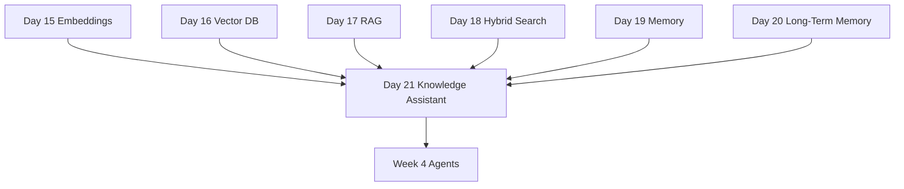

### StudySpark placement
In the capstone architecture, the knowledge assistant lives inside StudySpark as the `app/rag/` and `app/memory/` layers:

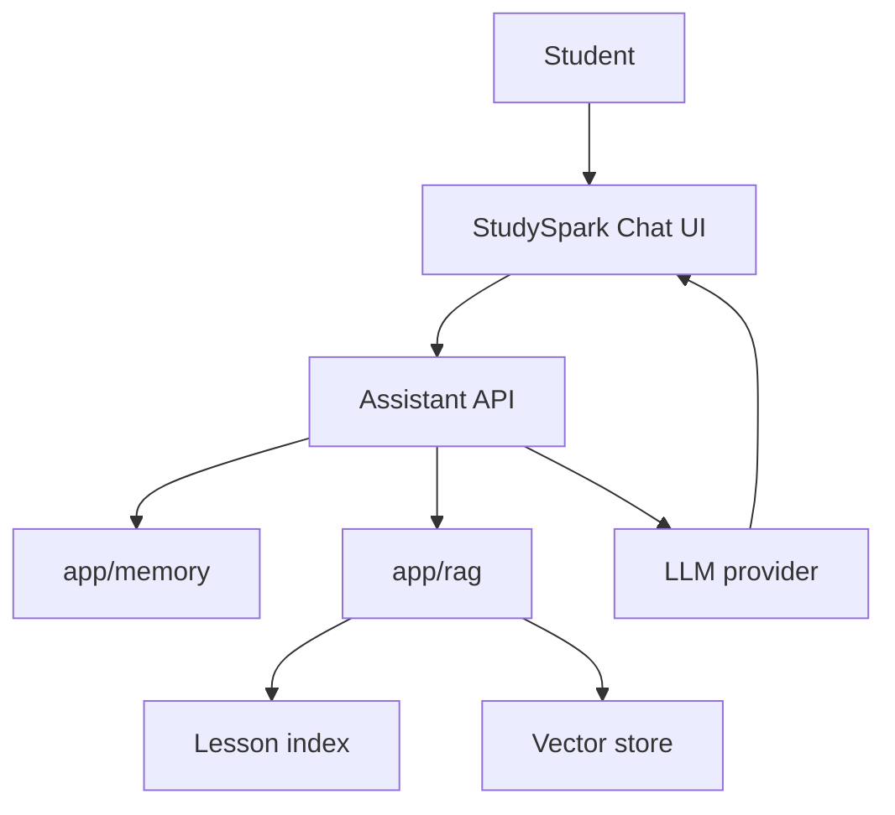

Beginners can design and trace code without API keys using `MockLLMClient`. Intermediate and advanced learners wire the full pipeline in `projects/studyspark/`.

## Project Outcome
At the end of this day, you should have a design — or working MVP — for a knowledge assistant that can:

- answer questions like "What is the difference between embeddings and vector databases?"
- point to the correct day and section
- say when it cannot find enough evidence
- remember user preferences such as "keep answers concise"
- support future expansion into a more advanced AI agent

## Why This Project Matters
A knowledge assistant is one of the most useful AI products you can build because it solves a real information problem.

People already ask questions in natural language. They already search docs, notes, and internal knowledge bases. A knowledge assistant turns that behavior into a better product by adding:

- semantic retrieval
- grounding
- source traceability
- personalization
- reusable architecture

It is also a very good teaching project because it touches almost every retrieval concept you learned in Week 3.

For this course specifically, the assistant becomes a **meta-tutor**: it helps you navigate the very curriculum you are studying. That makes evaluation concrete — you can check whether "What is hybrid search?" retrieves Day 18 and cites the right section.

## Deep Theory

### What is a knowledge assistant?
A knowledge assistant is an AI system that answers questions using a defined set of knowledge sources.

That knowledge may come from:

- Markdown lessons in this repository
- learner notes uploaded to StudySpark
- PDFs or documentation exports
- internal wiki pages
- policy documents

Unlike a generic chatbot, a knowledge assistant has a target corpus. It should stay inside that corpus and avoid pretending it knows more than it does.

### Why it exists
Knowledge assistants exist because users want accurate answers without reading all the source material themselves.

If the repository contains 30 lessons, users should not have to manually scan every file to find the lesson that explains prompt engineering or hybrid search. The assistant can retrieve the right lesson, summarize it, and point to the source.

### The problem it solves
The core problem is information overload.

Even a well-organized repository becomes hard to navigate once it grows. A knowledge assistant helps users:

- ask questions naturally
- get answers faster
- jump directly to the right source
- reduce repeated searching

### Internal mechanics
A serious knowledge assistant usually has these layers:

1. ingestion layer
2. chunking and cleaning layer
3. embedding layer
4. storage and indexing layer
5. retrieval layer
6. ranking or reranking layer
7. memory layer
8. prompt construction layer
9. generation layer
10. citation and response layer

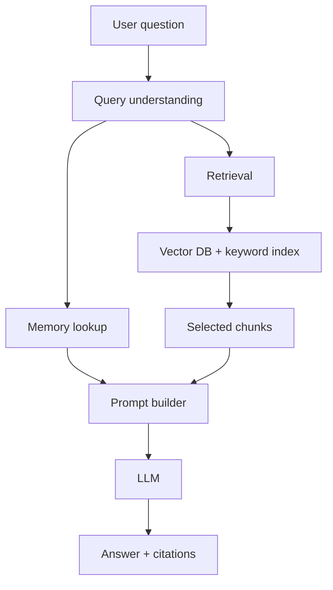

### Why memory complements RAG
RAG solves knowledge access. Memory solves continuity.

For example:

- RAG can find the lesson that explains cosine similarity.
- memory can remember that the user prefers short answers or is working through Week 3.

Those are different jobs.

Memory should not replace retrieval because memory is not the source of truth for the curriculum. The lessons are the source of truth. Memory only helps personalize the experience and reduce repetitive context gathering.

| Layer | Answers | Must cite? |
| --- | --- | --- |
| RAG | What does the curriculum say? | Yes |
| Long-term memory | How should I tailor the answer? | No |
| Session memory | What did we just discuss? | No |

### Architecture choices
There are many reasonable ways to build the project.

| Layer | Simple choice | Stronger production choice |
| --- | --- | --- |
| Ingestion | Local markdown reader | Background ingestion pipeline |
| Chunking | Fixed-size chunks | Section-aware chunking |
| Embeddings | Mock or local model | Hosted embedding API |
| Storage | In-memory array | Qdrant, pgvector, or Pinecone |
| Retrieval | Similarity search | Hybrid search with reranking |
| Memory | Session dictionary | Policy-driven persistent memory |
| Response | Plain text answer | Answer with citations and confidence notes |

### Advantages of this design
- modular and testable
- easy to explain to learners
- useful enough to expand into a product
- aligned with the retrieval week
- directly reusable in the Day 30 capstone

### Limitations
- retrieval quality depends on chunk quality
- citations require good source metadata
- memory can introduce stale context if not controlled
- evaluation takes time and discipline
- lesson updates require re-ingestion or re-embedding

### Alternatives
- a simple search page without generation
- a pure FAQ bot with fixed responses
- a document navigator without semantic ranking
- a generic chatbot with no grounding

### When should you use a knowledge assistant?
Use it when users need:

- answers from your own content
- citations or source links
- natural language search
- continuity across sessions

### When should you not use it?
Do not use it when:

- the knowledge base is tiny and static
- a simple table or FAQ is enough
- the data is highly sensitive and cannot be indexed safely
- you cannot maintain source quality

## Visual Learning

### End-to-End Data Flow
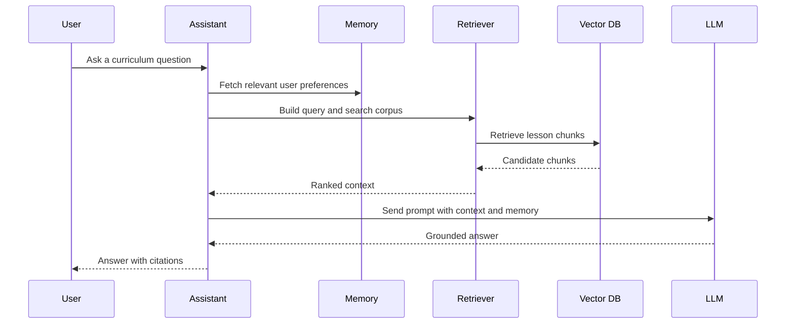

### Decision Tree
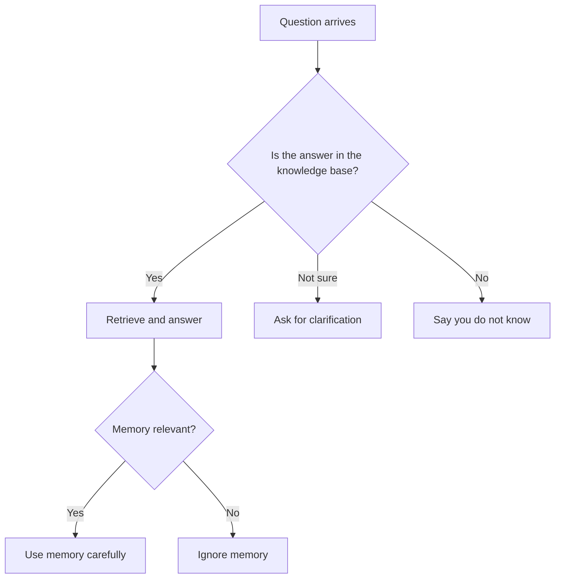

### Knowledge Assistant Mind Map
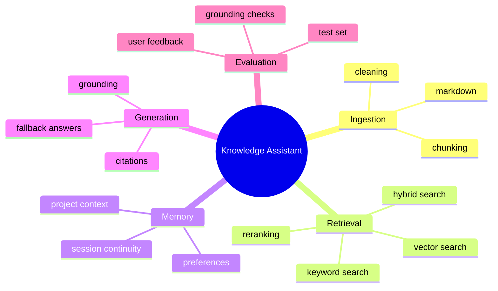

### StudySpark module map
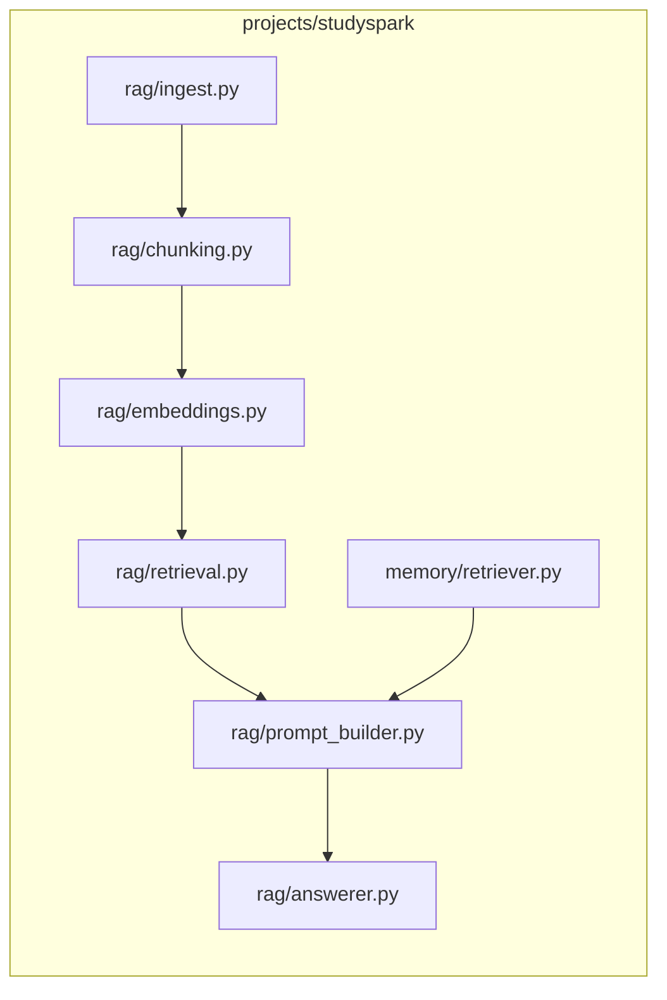

### Ingestion pipeline
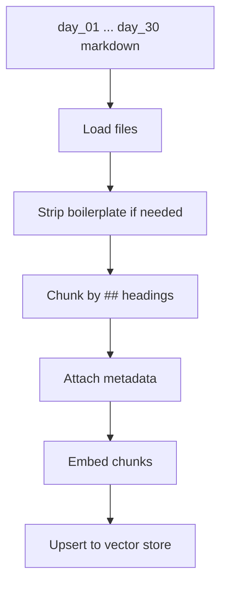

### Evaluation loop
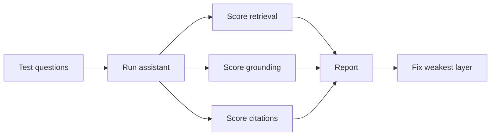

### Hybrid retrieval blend
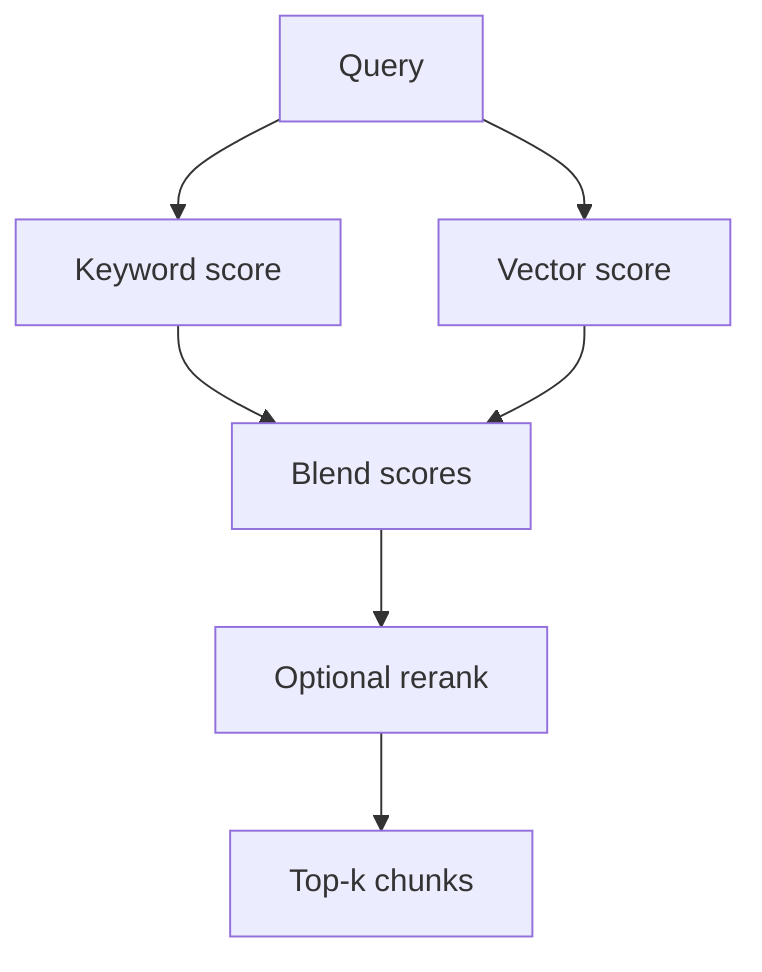

## Code Walkthrough

The code below sketches the major moving parts. It is intentionally lightweight, but it mirrors the production architecture you will add to StudySpark.

### Python Example: Build a lesson index from markdown files
```python
from pathlib import Path


def load_lessons(folder_path):
    lessons = []

    for file_path in sorted(Path(folder_path).glob('day_*/day_*.md')):
        content = file_path.read_text(encoding='utf-8')
        lessons.append({
            'source': str(file_path),
            'content': content,
        })

    return lessons


lessons = load_lessons('d:/30-Days-Of-AI-Engineering')
print(f'Loaded {len(lessons)} lesson files')
```

#### Code Explanation
- `Path(folder_path).glob(...)` walks through the lesson directories.
- the pattern targets files that look like day lesson markdown files.
- `read_text(...)` loads the full markdown content.
- each lesson keeps its `source` path for citation later.
- `lessons` becomes the raw input for chunking and embedding.

### Python Example: Chunk lessons by headings
```python
def chunk_by_headings(markdown_text, source):
    chunks = []
    current_heading = 'Introduction'
    current_lines = []

    for line in markdown_text.splitlines():
        if line.startswith('## '):
            if current_lines:
                chunks.append({
                    'heading': current_heading,
                    'text': '\n'.join(current_lines).strip(),
                    'source': source,
                })
                current_lines = []

            current_heading = line[3:].strip()

        current_lines.append(line)

    if current_lines:
        chunks.append({
            'heading': current_heading,
            'text': '\n'.join(current_lines).strip(),
            'source': source,
        })

    return chunks
```

#### Code Explanation
- `chunk_by_headings` keeps lesson sections semantically coherent.
- it starts a new chunk whenever it sees a new level-two heading.
- this helps the retriever return meaningful sections instead of arbitrary slices.
- `heading` and `source` become citation metadata.

### TypeScript Example: Memory-aware query request
```typescript
type AssistantRequest = {
  question: string;
  userId: string;
  topicHint?: string;
};

type MemoryPreference = {
  preferredTone?: 'concise' | 'detailed';
  preferredLanguage?: 'python' | 'typescript';
};

function buildRequest(question: string, userId: string): AssistantRequest {
  return {
    question,
    userId,
    topicHint: 'retrieval',
  };
}

const request = buildRequest('How does hybrid search work?', 'user-42');
console.log(request);
```

#### Code Explanation
- `AssistantRequest` keeps the user request structured.
- `userId` scopes memory and access control.
- `topicHint` can help route the query to the right part of the knowledge base.

### Python Example: Simple retrieval and citation mapping
```python
def retrieve_chunks(query, chunks, top_k=3):
    query_terms = set(query.lower().split())
    scored = []

    for chunk in chunks:
        chunk_terms = set(chunk['text'].lower().split())
        overlap = len(query_terms.intersection(chunk_terms))
        scored.append({
            'heading': chunk['heading'],
            'text': chunk['text'],
            'score': overlap,
            'source': chunk.get('source', 'unknown'),
        })

    return sorted(scored, key=lambda item: item['score'], reverse=True)[:top_k]


def format_citations(results):
    return [f"[{index + 1}] {item['source']}#{item['heading']}" for index, item in enumerate(results)]
```

#### Code Explanation
- `retrieve_chunks` is a lexical stand-in for hybrid search on Day 18 concepts.
- `score` ranks likely matches.
- `format_citations` turns chunk metadata into readable source references.
- the citation format should point to the exact lesson source and heading.

### Python Example: Hybrid score stub
```python
def hybrid_score(keyword_score, vector_score, alpha=0.5):
    return alpha * keyword_score + (1 - alpha) * vector_score


candidates = [
    {'id': 'c1', 'keyword_score': 0.8, 'vector_score': 0.4},
    {'id': 'c2', 'keyword_score': 0.2, 'vector_score': 0.9},
]

for item in candidates:
    item['score'] = hybrid_score(item['keyword_score'], item['vector_score'])

print(sorted(candidates, key=lambda x: x['score'], reverse=True))
```

#### Code Explanation
- `alpha` controls how much weight keyword vs vector search receives
- production systems tune `alpha` per corpus
- hybrid search often fixes cases where either method alone fails

### Python Example: RAG prompt builder for StudySpark
```python
def build_rag_prompt(question, chunks, memory_items=None):
    context = "\n\n".join(
        f"Source: {chunk['source']}#{chunk['heading']}\n{chunk['text']}"
        for chunk in chunks
    )
    memory_block = ""
    if memory_items:
        memory_block = "User context (not a citation source):\n" + "\n".join(f"- {m}" for m in memory_items)

    return f"""You are StudySpark, a curriculum tutor.
Answer only from the lesson context below.
If evidence is insufficient, say you do not know.
Cite sources using the provided source paths.

{memory_block}

Lesson context:
{context}

Question: {question}
Answer:"""
```

#### Code Explanation
- separates lesson context from memory context explicitly
- instructs the model not to treat memory as evidence
- citation paths come from chunk metadata, not from memory items

### TypeScript Example: Response envelope
```typescript
type AssistantResponse = {
  answer: string;
  citations: string[];
  confidence: 'high' | 'medium' | 'low';
  memoryUsed: boolean;
};

const response: AssistantResponse = {
  answer: 'RAG retrieves relevant context and then asks the model to answer from that context.',
  citations: ['day_17/day_17_rag.md#Theory'],
  confidence: 'high',
  memoryUsed: true,
};

console.log(response);
```

#### Code Explanation
- `AssistantResponse` makes the output predictable.
- `citations` help users trust the answer.
- `confidence` gives a lightweight signal about answer reliability.
- `memoryUsed` helps debug whether personalization affected the result.

### Python Example: Fallback when context is weak
```python
def build_fallback_answer(question, max_score, threshold=1):
    if max_score >= threshold:
        return None

    return {
        'answer': "I could not find enough evidence in the course materials to answer that confidently.",
        'citations': [],
        'confidence': 'low',
    }


print(build_fallback_answer('What is day 40?', max_score=0))
```

#### Code Explanation
- fallback behavior prevents hallucinated answers.
- the assistant should admit uncertainty when evidence is missing.
- threshold tuning is part of evaluation, not guesswork

### Python Example: Curriculum evaluation harness
```python
EVAL_SET = [
    {'question': 'What is an embedding?', 'expected_day': 'day_15'},
    {'question': 'What is RAG?', 'expected_day': 'day_17'},
    {'question': 'How is memory different from retrieval?', 'expected_days': ['day_19', 'day_17']},
]


def retrieval_hit(question_result, expected):
    source = question_result['top_source']
    if 'expected_days' in expected:
        return any(day in source for day in expected['expected_days'])
    return expected['expected_day'] in source
```

#### Code Explanation
- a small eval set makes Week 3 completion measurable
- retrieval hit rate is often the first metric to fix before answer quality
- multi-day questions reflect real curriculum overlap

## Project Design

### Data model
The assistant needs at least these entities:

| Entity | Purpose |
| --- | --- |
| Lesson | Source markdown file and metadata |
| Chunk | Smaller retrievable section of a lesson |
| Embedding | Semantic vector for a chunk |
| Memory item | User preference or project context |
| Citation | Reference to the source chunk or lesson |
| Query log | Debug and evaluation record |

### Suggested folder structure
For a standalone prototype:

```text
knowledge-assistant/
├── app/
│   ├── ingest.py
│   ├── chunking.py
│   ├── embeddings.py
│   ├── retrieval.py
│   ├── memory.py
│   ├── prompt_builder.py
│   ├── answerer.py
│   └── main.py
├── data/
│   ├── lessons/
│   └── memory/
├── tests/
│   ├── test_retrieval.py
│   ├── test_memory.py
│   └── test_citations.py
└── README.md
```

For StudySpark (recommended capstone path):

```text
projects/studyspark/
├── app/
│   ├── rag/
│   │   ├── ingest.py
│   │   ├── chunking.py
│   │   ├── embeddings.py
│   │   ├── retrieval.py
│   │   ├── prompt_builder.py
│   │   └── answerer.py
│   ├── memory/
│   │   ├── store.py
│   │   └── retriever.py
│   └── clients/
│       └── mock_llm.py
├── data/
│   └── curriculum_index/
└── tests/
    ├── test_retrieval.py
    └── test_citations.py
```

### Project flow
1. ingest the lesson markdown files from `day_01/` through `day_30/`
2. chunk the lessons by section
3. generate embeddings for each chunk
4. store chunks with lesson and heading metadata
5. retrieve relevant chunks with keyword or vector search
6. read user memory if it is relevant
7. build a prompt with clear source boundaries
8. generate an answer
9. attach citations and confidence notes
10. log the result for later evaluation

### Beginner path without API keys
1. implement ingestion and chunking only
2. use lexical retrieval from the code examples
3. return top chunks plus a template answer
4. add `MockLLMClient` when you are ready for generation

### Advanced path
1. add hybrid retrieval and optional reranking
2. wire persistent memory from Day 20
3. build an evaluation report over 20+ curriculum questions
4. add query logging with retrieved chunk IDs

## Practical Examples

### Beginner Example: "What is a vector database?"
The assistant should retrieve Day 16, summarize the idea simply, and cite the lesson.

Why it works:

- the question maps directly to one lesson
- the answer can be short and factual
- citations are easy to attach

Expected citation shape: `day_16/day_16_vector_databases.md#Deep Theory`

### Intermediate Example: "How is RAG different from memory?"
The assistant should combine Day 17 and Day 19, explain the difference, and mention that RAG retrieves source material while memory stores user-specific context.

What could go wrong:

- if the retriever only returns one lesson, the explanation may become one-sided
- if memory is overused, the assistant may confuse the concepts

Fix: retrieve top-k from both days or use hybrid search with a reranker.

### Advanced Example: "What should I study before Day 21?"
The assistant should answer with a mini roadmap, cite Days 15 through 20, and possibly remember that the learner prefers concise answers.

Why professionals like this:

- it behaves like a course tutor
- it connects lessons across days
- it feels personalized without being invasive

### Professional Example: Company training assistant
A company training assistant can work the same way for product training, onboarding, or internal engineering documentation.

The system can answer questions like:

- "Where is the deployment checklist?"
- "What changed in the last API release?"
- "Which lesson explains hybrid search?"

This is the same pattern used in many enterprise knowledge systems, support copilots, and documentation assistants.

### StudySpark checkpoint scenario
A learner asks: "How do I add citations to StudySpark?"

Good behavior:

1. retrieve Day 17 and Day 21 chunks on citations
2. read memory: user prefers Python
3. answer with steps referencing `projects/studyspark/app/rag/`
4. cite lesson sections, not memory
5. if the repo structure changed, prefer corpus over memory

## Best Practices
- keep the document set focused and well organized
- use section-aware chunking rather than arbitrary text slices
- attach source metadata to every chunk
- separate ingestion from query-time logic
- return citations or source references whenever possible
- handle unknown answers honestly
- evaluate retrieval and answer quality separately
- keep memory optional and narrow
- log query, retrieved chunks, and final response
- build a fallback for weak or missing context
- version your index when lessons change
- test with real curriculum questions, not only synthetic prompts

## Common Mistakes
- using too many documents at once
- not checking grounding before generating an answer
- ignoring document updates and stale embeddings
- failing to measure retrieval quality
- making the assistant answer outside its knowledge base
- using memory as a substitute for the source corpus
- hiding why a result was chosen
- citing the wrong heading because chunk metadata was missing
- skipping the Week 3 eval set and guessing quality from one demo question

### Debugging Strategy
When the assistant gives a bad answer, check the pipeline in this order:

1. Did ingestion load the right lessons?
2. Did chunking preserve meaning?
3. Did retrieval fetch the right chunks?
4. Did memory add useful context or harmful noise?
5. Did the prompt tell the model to stay grounded?
6. Did the model answer beyond the evidence?

This ordering saves time because many issues come from the data pipeline, not the LLM itself.

## Performance

The assistant should be fast enough to feel interactive.

### Latency
Latency comes from:

- embedding the query
- searching the index
- fetching memory
- generating the answer

You can reduce latency by:

- caching embeddings for repeated queries
- limiting top-k retrieval
- using a small but strong set of chunks
- keeping memory reads narrow

| Stage | Typical bottleneck | Quick win |
| --- | --- | --- |
| Ingestion | Embedding all chunks | Batch offline; cache |
| Query | Vector search | Smaller top-k |
| Generation | Long prompts | Trim context; summarize chunks |
| Memory | Over-fetching | Category-scoped reads |

### Cost
Costs come from:

- embedding generation
- vector storage
- reranking
- LLM token usage
- query logging and evaluation

### Scalability
To scale the system, teams often:

- batch ingestion jobs
- separate the retriever service from the answer service
- shard by content domain or day
- use background re-embedding after lesson updates

### Reliability
The assistant should still work when memory is empty or retrieval is weak.

Graceful degradation is better than overconfident failure.

## Security

Knowledge assistants can expose sensitive content if they are not carefully scoped.

### Prompt Injection
Some retrieved text may try to influence the model. Treat source text as data, not instructions.

Separate system instructions from lesson context in the prompt.

### Secrets and API Keys
Do not place secrets inside the knowledge corpus or memory store.

### Authentication and Authorization
Users should only access the content they are allowed to see.

### Data Privacy
If the assistant stores user preferences or conversation history, explain what is stored and why.

### Hallucinations and Model Safety
The assistant should say "I don't know" when the evidence is missing.

That is not a weakness. It is a production feature.

## Evaluation
This project should be tested with a real question set.

### Build a small evaluation set
Use questions such as:

| Question | Expected signal |
| --- | --- |
| What is an embedding? | Day 15 retrieved |
| How does a vector database differ from SQL? | Day 16 retrieved |
| What is RAG? | Day 17 retrieved |
| How is memory different from retrieval? | Days 17 and 19 |
| What is hybrid search? | Day 18 retrieved |
| What should I study before agents? | Days 15–21 roadmap |

### What to measure
- whether the retrieved sources are correct
- whether the answer is grounded in the sources
- whether the citations are accurate
- whether memory helps or distracts
- whether the assistant knows when to say it does not know

### Useful metrics
- retrieval hit rate
- citation accuracy
- grounded answer rate
- fallback correctness
- user satisfaction on sample questions

### Week 3 completion checklist
Before moving to Day 22, confirm:

- [ ] ingestion loads all `day_*/day_*.md` lesson files
- [ ] chunks carry `source` and `heading` metadata
- [ ] at least one retrieval method works (lexical or vector)
- [ ] answers include citations for curriculum claims
- [ ] fallback triggers on low retrieval score
- [ ] memory affects tone or format, not factual claims
- [ ] five-question eval set passes manual review

### Connecting to Week 4 agents
Agents in Week 4 will add planning, tool use, and multi-step execution on top of this foundation. The knowledge assistant you build today becomes the **retrieval tool** an agent can call:

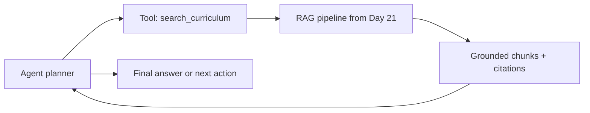

If retrieval is weak now, agents will amplify that weakness—they will confidently plan around bad evidence. That is why Week 3 ends with evaluation, not just implementation. A small, honest eval set is more valuable than a large demo that only works on one question.

For StudySpark, keep the Day 21 module interface stable:

| Function | Input | Output |
| --- | --- | --- |
| `ingest_lessons(root_path)` | Repo path | Chunk count |
| `retrieve(query, top_k)` | User question | Ranked chunks |
| `answer(question, user_id)` | Question + user | Answer, citations, confidence |

Week 4 agents should call `answer()` or `retrieve()` as tools rather than re-implementing RAG inside the agent loop.

## Exercises

### Easy
1. Describe the assistant's data flow in five steps.
2. Name three lesson topics it should answer well.
3. Explain why citations matter.
4. Describe one role of memory in the assistant.
5. What is the Week 3 checkpoint project?
6. Where does the RAG module live in StudySpark?
7. What should the assistant do when evidence is missing?

### Medium
8. Define a test query set of ten questions for this repository.
9. Explain how chunking affects answer quality.
10. Describe how a memory preference should influence the response.
11. Explain how the assistant should behave when it cannot find evidence.
12. Compare lexical-only vs hybrid retrieval for curriculum search.
13. Design citation format `day_XX/file.md#Section`.
14. List three metadata fields every chunk should store.

### Hard
15. Design a citation format that includes day and heading.
16. Propose a memory policy for user preferences.
17. Describe how you would re-embed the repository after editing lessons.
18. Explain how retrieval and memory should stay separate in the architecture.
19. Design an evaluation rubric with retrieval, grounding, and citation scores.
20. Sketch the StudySpark `app/rag/` module interfaces.

### Challenge
21. Build a knowledge assistant design for this repository.
22. Add a fallback answer path for weak or missing context.
23. Add user memory for answer style or preferred language.
24. Add an evaluation checklist for source grounding.
25. Add a logging plan for debugging retrieval failures.
26. Implement ingestion + chunking for all lesson files.
27. Run the eval set and record retrieval hit rate.
28. Wire `MockLLMClient` for grounded answer generation.

### Reflection Questions
29. What makes a knowledge assistant better than a normal chatbot?
30. Why is source grounding more important than fluent wording?
31. Which part of the system is hardest to get right: ingestion, retrieval, memory, or generation?
32. Why should the assistant avoid answering outside its knowledge base?
33. How does this project prepare you for agents in Week 4?

## Mini Project
Build the knowledge assistant for this repository inside **StudySpark**.

### Goal
Create an assistant that answers curriculum questions from the lessons and points the user to the right day, section, or source file.

### Features
- ingest all lesson markdown files
- split them by heading-aware chunks
- store chunk vectors and metadata
- support keyword and vector retrieval
- read user memory for preferences such as tone or language
- build a grounded answer with citations
- return a fallback answer when evidence is missing

### Suggested delivery roadmap
1. create the ingestion pipeline in `app/rag/ingest.py`
2. add chunking and metadata in `app/rag/chunking.py`
3. store chunks in a vector database or local index
4. add hybrid retrieval in `app/rag/retrieval.py`
5. add a memory read layer from Day 20
6. build a citation formatter in `app/rag/prompt_builder.py`
7. add tests with real curriculum questions
8. evaluate the assistant with the benchmark set from this lesson

### Beginner MVP
- lexical retrieval only
- print top chunks and formatted citations
- manual answer from retrieved text

### Advanced MVP
- hybrid retrieval + rerank
- `MockLLMClient` or provider-backed generation
- eval report over 20 questions
- query trace logs

### What you learn
- how a real knowledge assistant is assembled
- how retrieval and memory complement each other
- how to keep answers grounded in source material
- how to prepare the project for later agent features

## Interview Questions

### Conceptual
- What is a knowledge assistant?
- How does RAG differ from long-term memory in this project?
- Why are citations necessary?
- When should the assistant refuse to answer?
- What makes Week 3 a checkpoint rather than a single concept day?

### System Design
- Design a curriculum assistant for 30 markdown lessons.
- How would you re-index content after lesson edits?
- Design logging for retrieval debugging.
- How would you separate memory personalization from grounded answers?

### Debugging
- Retrieval returns Day 15 for a Day 18 question. What do you check?
- Answers sound fluent but citations are wrong. Where is the bug?
- Memory makes answers over-personalized. What policy change helps?

## Quizzes

### Quiz 1
1. Name the four Week 3 retrieval concepts combined in this project.
2. What is the source of truth for curriculum facts?
3. What should citations point to?
4. What is the fallback behavior when evidence is weak?

**Answers:** 1) Embeddings, vector DB, RAG, hybrid search (+ memory). 2) Lesson files in the repo. 3) Day file and section heading. 4) Admit uncertainty; do not hallucinate.

### Quiz 2
1. Why use heading-aware chunking?
2. What does `memoryUsed: true` help you debug?
3. Name two evaluation metrics for this assistant.
4. Where should the RAG code live in StudySpark?

**Answers:** 1) Preserves semantic sections for retrieval and citations. 2) Whether personalization affected the response. 3) Retrieval hit rate and citation accuracy (also grounding rate). 4) `projects/studyspark/app/rag/`.

### Quiz 3
1. How is hybrid search different from vector-only search?
2. Should memory appear in citations? Why or why not?
3. What is the Week 3 checkpoint deliverable?
4. What week comes next and why does this project matter for it?

**Answers:** 1) Combines keyword and vector signals. 2) No — memory is user context, not corpus evidence. 3) Repo/course knowledge assistant MVP. 4) Week 4 agents — this project provides retrieval and grounding backbone.

## Cumulative Capstone Update
This chapter is a direct building block for the final capstone.

Add these ideas to your capstone plan:

- a repository knowledge base with source citations
- memory for user preferences and project continuity
- a retrieval layer that supports both exact and semantic queries
- a fallback strategy for missing evidence
- an evaluation set built from real curriculum questions
- logging for query traces and citations

In [`projects/CAPSTONE.md`](../../projects/CAPSTONE.md), check off **Day 21: Repo/course knowledge assistant MVP**.

In `projects/studyspark/`, add when ready:

```text
app/rag/
├── ingest.py
├── chunking.py
├── retrieval.py
├── prompt_builder.py
└── answerer.py
```

Minimum acceptance tests from the capstone checklist:

- answers cite source lesson when using RAG
- says "I don't know" when evidence is missing
- memory changes tone or format, not cited facts

If you build this well, the final capstone will not start from scratch. It will already have a retrieval backbone and a memory-aware assistant pattern.

## Summary
The knowledge assistant project combines the core retrieval ideas into one practical application.

It shows how embeddings, vector search, RAG, hybrid search, and memory fit together in a real system. It also introduces the habits that matter in production:

- grounding answers in source material
- citing where answers came from
- admitting when evidence is missing
- using memory to help, not to overreach
- testing with real questions instead of only toy examples

This is the Week 3 checkpoint for StudySpark and a strong bridge before moving into agents.

[Previous: Day 20 - Long-Term Memory](../day_20/day_20_long_term_memory.md) | [Next: Day 22 - What are AI Agents?](../day_22/day_22_what_are_ai_agents.md)

## Further Reading
- https://python.langchain.com/docs/concepts/rag/
- https://docs.llamaindex.ai/
- https://www.pinecone.io/learn/
- https://qdrant.tech/documentation/
- https://modelcontextprotocol.io/
