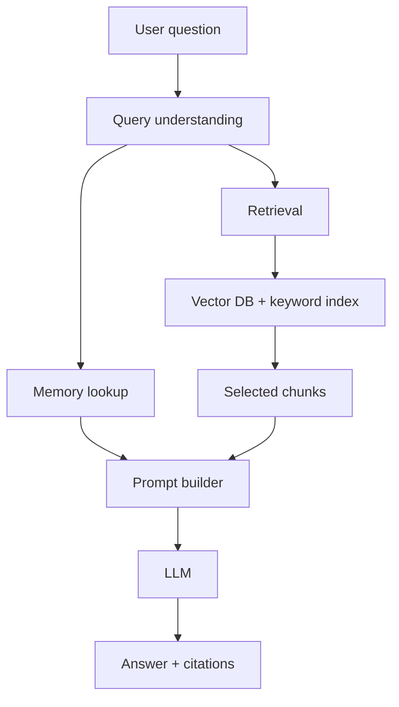
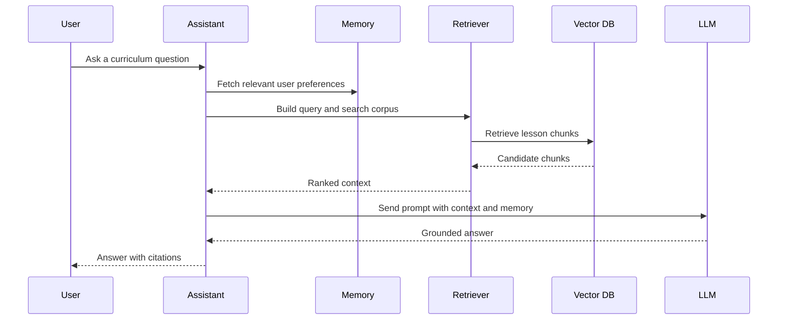
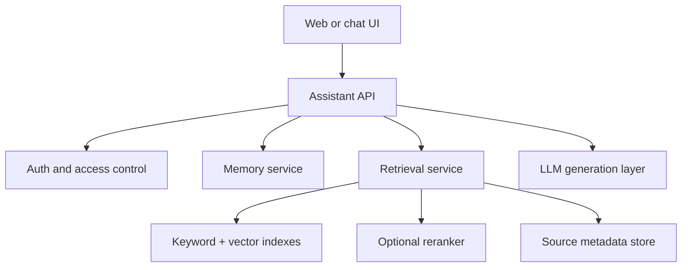
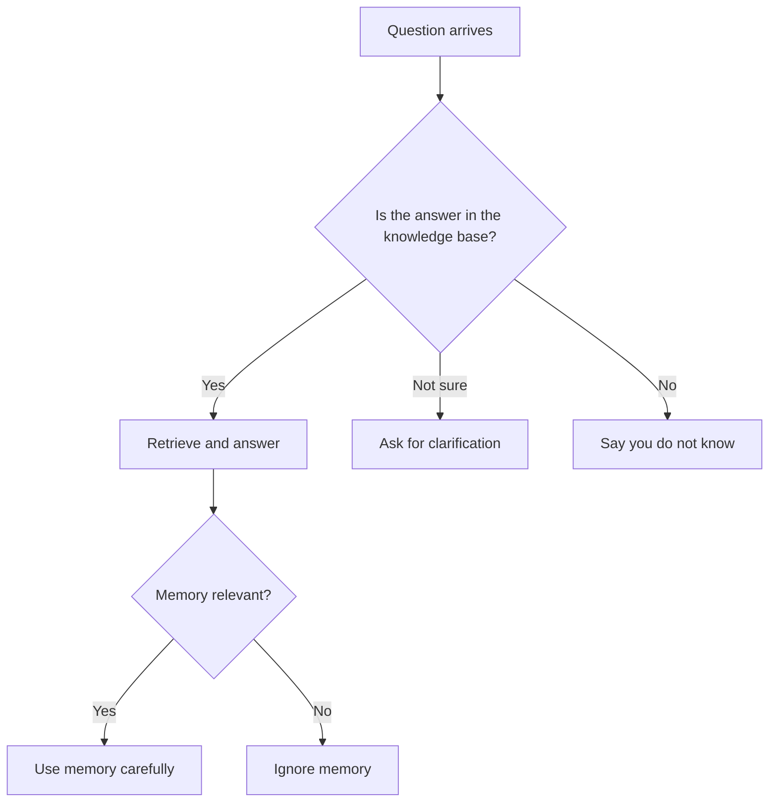
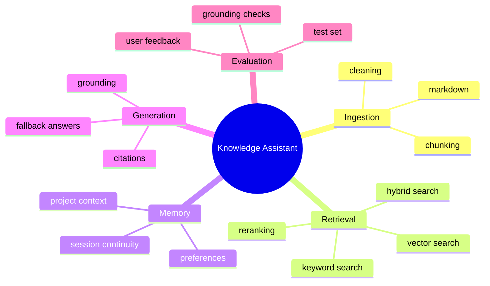

# Day 21 - Knowledge Assistant Project

[Previous: Day 20 - Long-Term Memory](../day_20/day_20_long_term_memory.md) | [Next: Day 22 - What are AI Agents?](../day_22/day_22_what_are_ai_agents.md)

## Introduction
This is the checkpoint project for Week 3.

You now have the building blocks for a serious knowledge system:

- embeddings to represent meaning
- vector databases to store and search chunks
- RAG to ground answers in source material
- hybrid search to improve retrieval quality
- memory to keep useful context across sessions

Today we bring those ideas together into one practical application: a knowledge assistant for this repository.


The goal is not to build a toy chatbot that repeats document text. The goal is to build an assistant that can answer curriculum questions from the lessons, show the source day, handle unknown answers honestly, and improve as the repository grows.

This project matters because it looks like a real product. It is grounded in your own content, it needs retrieval discipline, and it introduces evaluation, source tracing, and memory-aware behavior before the course moves into agents.

## Learning Objectives
By the end of this day, you should be able to:

- describe the end-to-end knowledge assistant architecture
- connect ingestion, chunking, embedding, retrieval, memory, and answer generation
- define a realistic evaluation set for curriculum questions
- explain how long-term memory complements RAG without replacing it
- design a citation format that points to source lessons
- scope a project that feels usable, testable, and production-minded
- understand the main risks in a knowledge assistant and how to reduce them

## Prerequisites
You should already understand:

- Day 16: Vector Databases
- Day 17: Retrieval-Augmented Generation
- Day 18: Hybrid Search
- Day 19: Memory
- Day 20: Long-Term Memory

If any of those are fuzzy, revisit them first. This chapter assumes you know why retrieval matters and how memory differs from retrieval.

## Big Picture
The knowledge assistant is the practical summary of Week 3.


The assistant should do four things well:

1. find the right lesson chunks
2. use memory only when it helps the current question
3. generate a grounded answer in simple language
4. cite the correct source day or lesson section

That means the assistant is part search engine, part tutor, and part librarian.

## Project Outcome
At the end of this day, you should have a design for a knowledge assistant that can:

- answer questions like “What is the difference between embeddings and vector databases?”
- point to the correct day and section
- say when it cannot find enough evidence
- remember user preferences such as “keep answers concise”
- support future expansion into a more advanced AI agent

## Why This Project Matters
A knowledge assistant is one of the most useful AI products you can build because it solves a real information problem.

People already ask questions in natural language. They already search docs, notes, and internal knowledge bases. A knowledge assistant turns that behavior into a better product by adding:

- semantic retrieval
- grounding
- source traceability
- personalization
- reusable architecture

It is also a very good teaching project because it touches almost every retrieval concept you learned in Week 3.

## Deep Theory

### What is a knowledge assistant?
A knowledge assistant is an AI system that answers questions using a defined set of knowledge sources.

That knowledge may come from:

- Markdown lessons
- PDFs
- documentation sites
- internal wiki pages
- policy documents
- meeting notes

Unlike a generic chatbot, a knowledge assistant has a target corpus. It should stay inside that corpus and avoid pretending it knows more than it does.

### Why it exists
Knowledge assistants exist because users want accurate answers without reading all the source material themselves.

If the repository contains 30 lessons, users should not have to manually scan every file to find the lesson that explains prompt engineering or hybrid search. The assistant can retrieve the right lesson, summarize it, and point to the source.

### The problem it solves
The core problem is information overload.

Even a well-organized repository becomes hard to navigate once it grows. A knowledge assistant helps users:

- ask questions naturally
- get answers faster
- jump directly to the right source
- reduce repeated searching

### Internal mechanics
A serious knowledge assistant usually has these layers:

1. ingestion layer
2. chunking and cleaning layer
3. embedding layer
4. storage and indexing layer
5. retrieval layer
6. ranking or reranking layer
7. memory layer
8. prompt construction layer
9. generation layer
10. citation and response layer



### Why memory complements RAG
RAG solves knowledge access. Memory solves continuity.

For example:

- RAG can find the lesson that explains cosine similarity.
- memory can remember that the user prefers short answers or is working through Week 3.

Those are different jobs.

Memory should not replace retrieval because memory is not the source of truth for the curriculum. The lessons are the source of truth. Memory only helps personalize the experience and reduce repetitive context gathering.

### Architecture choices
There are many reasonable ways to build the project.

| Layer | Simple choice | Stronger production choice |
| --- | --- | --- |
| Ingestion | Local markdown reader | Background ingestion pipeline |
| Chunking | Fixed-size chunks | Section-aware chunking |
| Embeddings | Mock or local model | Hosted embedding API |
| Storage | In-memory array | Qdrant, pgvector, or Pinecone |
| Retrieval | Similarity search | Hybrid search with reranking |
| Memory | Session dictionary | Policy-driven persistent memory |
| Response | Plain text answer | Answer with citations and confidence notes |

### Advantages of this design
- modular and testable
- easy to explain to learners
- useful enough to expand into a product
- aligned with the retrieval week

### Limitations
- retrieval quality depends on chunk quality
- citations require good source metadata
- memory can introduce stale context if not controlled
- evaluation takes time and discipline

### Alternatives
- a simple search page without generation
- a pure FAQ bot with fixed responses
- a document navigator without semantic ranking
- a generic chatbot with no grounding

### When should you use a knowledge assistant?
Use it when users need:

- answers from your own content
- citations or source links
- natural language search
- continuity across sessions

### When should you not use it?
Do not use it when:

- the knowledge base is tiny and static
- a simple table or FAQ is enough
- the data is highly sensitive and cannot be indexed safely
- you cannot maintain source quality

## Visual Learning

### End-to-End Data Flow


### System Architecture


### Decision Tree


### Knowledge Assistant Mind Map


## Code Walkthrough

The code below sketches the major moving parts. It is intentionally lightweight, but it mirrors the production architecture.

### Python Example: Build a lesson index from markdown files
```python
from pathlib import Path


def load_lessons(folder_path):
        lessons = []

        for file_path in sorted(Path(folder_path).glob('day_*/day_*.md')):
                content = file_path.read_text(encoding='utf-8')
                lessons.append({
                        'source': str(file_path),
                        'content': content,
                })

        return lessons


lessons = load_lessons('/workspaces/30-Days-OF-AI-Engineering')
print(f'Loaded {len(lessons)} lesson files')
```

#### Code Explanation
- `Path(folder_path).glob(...)` walks through the lesson directories.
- the pattern targets files that look like day lesson markdown files.
- `read_text(...)` loads the full markdown content.
- each lesson keeps its `source` path for citation later.
- `lessons` becomes the raw input for chunking and embedding.

### Python Example: Chunk lessons by headings
```python
def chunk_by_headings(markdown_text):
        chunks = []
        current_heading = 'Untitled'
        current_lines = []

        for line in markdown_text.splitlines():
                if line.startswith('## '):
                        if current_lines:
                                chunks.append({
                                        'heading': current_heading,
                                        'text': '\n'.join(current_lines).strip(),
                                })
                                current_lines = []

                        current_heading = line[3:].strip()

                current_lines.append(line)

        if current_lines:
                chunks.append({
                        'heading': current_heading,
                        'text': '\n'.join(current_lines).strip(),
                })

        return chunks


sample_markdown = """## Introduction
Hello.

## Theory
More text.
"""

print(chunk_by_headings(sample_markdown))
```

#### Code Explanation
- `chunk_by_headings` keeps lesson sections semantically coherent.
- it starts a new chunk whenever it sees a new level-two heading.
- this helps the retriever return meaningful sections instead of arbitrary slices.
- `heading` becomes useful metadata for citations and navigation.

### TypeScript Example: Memory-aware query request
```typescript
type AssistantRequest = {
    question: string;
    userId: string;
    topicHint?: string;
};

type MemoryPreference = {
    preferredTone?: 'concise' | 'detailed';
    preferredLanguage?: 'python' | 'typescript';
};

function buildRequest(question: string, userId: string): AssistantRequest {
    return {
        question,
        userId,
        topicHint: 'retrieval',
    };
}

const request = buildRequest('How does hybrid search work?', 'user-42');
console.log(request);
```

#### Code Explanation
- `AssistantRequest` keeps the user request structured.
- `userId` scopes memory and access control.
- `topicHint` can help route the query to the right part of the knowledge base.

### Python Example: Simple retrieval and citation mapping
```python
def retrieve_chunks(query, chunks):
        query_terms = set(query.lower().split())
        scored = []

        for chunk in chunks:
                chunk_terms = set(chunk['text'].lower().split())
                overlap = len(query_terms.intersection(chunk_terms))
                scored.append({
                        'heading': chunk['heading'],
                        'text': chunk['text'],
                        'score': overlap,
                        'source': chunk.get('source', 'unknown'),
                })

        return sorted(scored, key=lambda item: item['score'], reverse=True)


def format_citations(results):
        return [f"[{index + 1}] {item['source']}#{item['heading']}" for index, item in enumerate(results)]


chunks = [
        {'heading': 'Introduction', 'text': 'Vector databases store embeddings and metadata.', 'source': 'day_16/day_16_vector_databases.md'},
        {'heading': 'Theory', 'text': 'RAG combines retrieval and generation.', 'source': 'day_17/day_17_rag.md'},
]

results = retrieve_chunks('What is RAG?', chunks)
print(results)
print(format_citations(results))
```

#### Code Explanation
- `retrieve_chunks` is a simple lexical stand-in for a real retriever.
- `score` ranks likely matches.
- `format_citations` turns chunk metadata into readable source references.
- the citation format should point to the exact lesson source and heading.

### TypeScript Example: Response envelope
```typescript
type AssistantResponse = {
    answer: string;
    citations: string[];
    confidence: 'high' | 'medium' | 'low';
    memoryUsed: boolean;
};

const response: AssistantResponse = {
    answer: 'RAG retrieves relevant context and then asks the model to answer from that context.',
    citations: ['day_17/day_17_rag.md#Theory'],
    confidence: 'high',
    memoryUsed: true,
};

console.log(response);
```

#### Code Explanation
- `AssistantResponse` makes the output predictable.
- `citations` help users trust the answer.
- `confidence` gives a lightweight signal about answer reliability.
- `memoryUsed` helps debug whether personalization affected the result.

### Python Example: Fallback when context is weak
```python
def build_fallback_answer(question):
        return {
                'answer': "I could not find enough evidence in the course materials to answer that confidently.",
                'citations': [],
                'confidence': 'low',
        }


print(build_fallback_answer('What is day 40?'))
```

#### Code Explanation
- fallback behavior prevents hallucinated answers.
- the assistant should admit uncertainty when evidence is missing.
- this behavior is essential for trustworthy knowledge tools.

## Project Design

### Data model
The assistant needs at least these entities:

| Entity | Purpose |
| --- | --- |
| Lesson | Source markdown file and metadata |
| Chunk | Smaller retrievable section of a lesson |
| Embedding | Semantic vector for a chunk |
| Memory item | User preference or project context |
| Citation | Reference to the source chunk or lesson |
| Query log | Debug and evaluation record |

### Suggested folder structure
```text
knowledge-assistant/
├── app/
│   ├── ingest.py
│   ├── chunking.py
│   ├── embeddings.py
│   ├── retrieval.py
│   ├── memory.py
│   ├── prompt_builder.py
│   ├── answerer.py
│   └── main.py
├── data/
│   ├── lessons/
│   └── memory/
├── tests/
│   ├── test_retrieval.py
│   ├── test_memory.py
│   └── test_citations.py
└── README.md
```

### Project flow
1. ingest the lesson markdown files
2. chunk the lessons by section
3. generate embeddings for each chunk
4. store chunks with lesson and heading metadata
5. retrieve relevant chunks with keyword or vector search
6. read user memory if it is relevant
7. build a prompt with clear source boundaries
8. generate an answer
9. attach citations and confidence notes
10. log the result for later evaluation

## Practical Examples

### Beginner Example: “What is a vector database?”
The assistant should retrieve Day 16, summarize the idea simply, and cite the lesson.

Why it works:

- the question maps directly to one lesson
- the answer can be short and factual
- citations are easy to attach

### Intermediate Example: “How is RAG different from memory?”
The assistant should combine Day 17 and Day 19, explain the difference, and mention that RAG retrieves source material while memory stores user-specific context.

What could go wrong:

- if the retriever only returns one lesson, the explanation may become one-sided
- if memory is overused, the assistant may confuse the concepts

### Professional Example: “What should I study before Day 21?”
The assistant should answer with a mini roadmap, cite Days 15 through 20, and possibly remember that the learner prefers concise answers.

Why professionals like this:

- it behaves like a course tutor
- it connects lessons across days
- it feels personalized without being invasive

### Real-World Company Example
A company training assistant can work the same way for product training, onboarding, or internal engineering documentation.

The system can answer questions like:

- “Where is the deployment checklist?”
- “What changed in the last API release?”
- “Which lesson explains hybrid search?”

This is the same pattern used in many enterprise knowledge systems, support copilots, and documentation assistants.

## Best Practices
- keep the document set focused and well organized
- use section-aware chunking rather than arbitrary text slices
- attach source metadata to every chunk
- separate ingestion from query-time logic
- return citations or source references whenever possible
- handle unknown answers honestly
- evaluate retrieval and answer quality separately
- keep memory optional and narrow
- log query, retrieved chunks, and final response
- build a fallback for weak or missing context

## Common Mistakes
- using too many documents at once
- not checking grounding before generating an answer
- ignoring document updates and stale embeddings
- failing to measure retrieval quality
- making the assistant answer outside its knowledge base
- using memory as a substitute for the source corpus
- hiding why a result was chosen

### Debugging Strategy
When the assistant gives a bad answer, check the pipeline in this order:

1. Did ingestion load the right lessons?
2. Did chunking preserve meaning?
3. Did retrieval fetch the right chunks?
4. Did memory add useful context or harmful noise?
5. Did the prompt tell the model to stay grounded?
6. Did the model answer beyond the evidence?

This ordering saves time because many issues come from the data pipeline, not the LLM itself.

## Performance

The assistant should be fast enough to feel interactive.

### Latency
Latency comes from:

- embedding the query
- searching the index
- fetching memory
- generating the answer

You can reduce latency by:

- caching embeddings for repeated queries
- limiting top-k retrieval
- using a small but strong set of chunks
- keeping memory reads narrow

### Cost
Costs come from:

- embedding generation
- vector storage
- reranking
- LLM token usage
- query logging and evaluation

### Memory
The assistant may need both working memory and persistent memory.

Keep memory compact so it does not inflate every prompt.

### Scalability
To scale the system, teams often:

- batch ingestion jobs
- separate the retriever service from the answer service
- shard by content domain or day
- use background re-embedding after lesson updates

### Reliability
The assistant should still work when memory is empty or retrieval is weak.

Graceful degradation is better than overconfident failure.

## Security

Knowledge assistants can expose sensitive content if they are not carefully scoped.

### Prompt Injection
Some retrieved text may try to influence the model. Treat source text as data, not instructions.

### Secrets and API Keys
Do not place secrets inside the knowledge corpus or memory store.

### Authentication and Authorization
Users should only access the content they are allowed to see.

### Data Privacy
If the assistant stores user preferences or conversation history, explain what is stored and why.

### Hallucinations and Model Safety
The assistant should say “I don’t know” when the evidence is missing.

That is not a weakness. It is a production feature.

## Evaluation
This project should be tested with a real question set.

### Build a small evaluation set
Use questions such as:

- What is an embedding?
- How does a vector database differ from SQL?
- What is RAG?
- How is memory different from retrieval?
- What should I study before agents?

### What to measure
- whether the retrieved sources are correct
- whether the answer is grounded in the sources
- whether the citations are accurate
- whether memory helps or distracts
- whether the assistant knows when to say it does not know

### Useful metrics
- retrieval hit rate
- citation accuracy
- grounded answer rate
- fallback correctness
- user satisfaction on sample questions

## Exercises

### Easy
1. Describe the assistant’s data flow.
2. Name three lesson topics it should answer well.
3. Explain why citations matter.
4. Describe one role of memory in the assistant.

### Medium
5. Define a test query set for the repository.
6. Explain how chunking affects answer quality.
7. Describe how a memory preference should influence the response.
8. Explain how the assistant should behave when it cannot find evidence.

### Hard
9. Design a citation format that includes day and heading.
10. Propose a memory policy for user preferences.
11. Describe how you would re-embed the repository after editing lessons.
12. Explain how retrieval and memory should stay separate in the architecture.

### Challenge
13. Build a knowledge assistant design for this repository.
14. Add a fallback answer path for weak or missing context.
15. Add user memory for answer style or preferred language.
16. Add an evaluation checklist for source grounding.
17. Add a logging plan for debugging retrieval failures.

### Reflection Questions
18. What makes a knowledge assistant better than a normal chatbot?
19. Why is source grounding more important than fluent wording?
20. Which part of the system is hardest to get right: ingestion, retrieval, memory, or generation?
21. Why should the assistant avoid answering outside its knowledge base?
22. How does this project prepare you for agents in Week 4?

## Mini Project
Build the knowledge assistant for this repository.

### Goal
Create an assistant that answers curriculum questions from the lessons and points the user to the right day, section, or source file.

### Features
- ingest all lesson markdown files
- split them by heading-aware chunks
- store chunk vectors and metadata
- support keyword and vector retrieval
- read user memory for preferences such as tone or language
- build a grounded answer with citations
- return a fallback answer when evidence is missing

### Suggested delivery roadmap
1. create the ingestion pipeline
2. add chunking and metadata
3. store chunks in a vector database
4. add hybrid retrieval
5. add a memory read layer
6. build a citation formatter
7. add tests with real curriculum questions
8. evaluate the assistant with a small benchmark set

### What you learn
- how a real knowledge assistant is assembled
- how retrieval and memory complement each other
- how to keep answers grounded in source material
- how to prepare the project for later agent features

## Cumulative Capstone Update
This chapter is a direct building block for the final capstone.

Add these ideas to your capstone plan:

- a repository knowledge base with source citations
- memory for user preferences and project continuity
- a retrieval layer that supports both exact and semantic queries
- a fallback strategy for missing evidence
- an evaluation set built from real curriculum questions
- logging for query traces and citations

If you build this well, the final capstone will not start from scratch. It will already have a retrieval backbone and a memory-aware assistant pattern.

## Summary
The knowledge assistant project combines the core retrieval ideas into one practical application.

It shows how embeddings, vector search, RAG, hybrid search, and memory fit together in a real system. It also introduces the habits that matter in production:

- grounding answers in source material
- citing where answers came from
- admitting when evidence is missing
- using memory to help, not to overreach
- testing with real questions instead of only toy examples

This is a strong checkpoint before moving into agents.

[Previous: Day 20 - Long-Term Memory](../day_20/day_20_long_term_memory.md) | [Next: Day 22 - What are AI Agents?](../day_22/day_22_what_are_ai_agents.md)

## Further Reading
- https://python.langchain.com/docs/concepts/rag/
- https://docs.llamaindex.ai/
- https://www.pinecone.io/learn/
- https://qdrant.tech/documentation/
- https://modelcontextprotocol.io/
