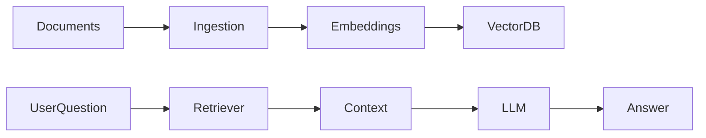

# Day 21 - Knowledge Assistant Project

## Introduction
This project ties together embeddings, vector search, RAG, and memory. The goal is to build a knowledge assistant that can answer questions from a custom document set.


## Learning Objectives
By the end of this day, you should be able to:

- describe the end-to-end knowledge assistant flow
- connect ingestion, retrieval, and generation
- define a small evaluation set
- explain how memory complements RAG
- scope a project that feels realistic and useful

## Theory
A knowledge assistant is most useful when it can answer questions grounded in your own content. That content may be documentation, course notes, policies, or meeting archives.

The assistant should know when to answer from retrieved sources, when to ask for clarification, and when to say it does not know.

### Visual Diagram


## Code Examples

### Python
```python
knowledge_base = ["Day 1 notes", "Day 15 embeddings notes", "Project requirements"]
question = "How does retrieval work?"
print(knowledge_base)
print(question)
```

### TypeScript
```typescript
const knowledgeBase = ['Day 1 notes', 'Day 15 embeddings notes', 'Project requirements'];
const question = 'How does retrieval work?';

console.log(knowledgeBase);
console.log(question);
```

## Best Practices
- keep the document set focused
- test with real questions from the target user
- show sources when possible
- handle unknown answers honestly
- separate ingestion from query-time logic

## Common Mistakes
- using too many documents at once
- not checking answer grounding
- ignoring document updates
- failing to measure retrieval quality
- making the assistant answer outside its knowledge base

## Exercises
- Easy: Describe the assistant's data flow.
- Medium: Define a test query set.
- Hard: Plan a source citation format.
- Challenge: Add a fallback for missing context.

## Mini Project
Design a knowledge assistant for this repository. It should answer curriculum questions from the lessons and point to the right day.

## Summary
The knowledge assistant project combines the core retrieval ideas into one practical application. It is a strong checkpoint before moving into agents.

## Additional Resources
- https://python.langchain.com/docs/concepts/rag/
- https://docs.llamaindex.ai/
- https://www.pinecone.io/learn/
