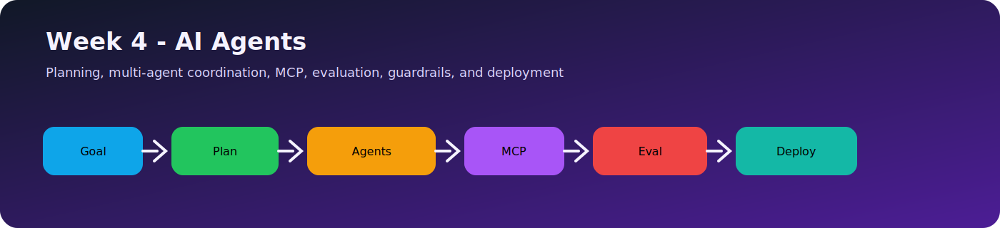
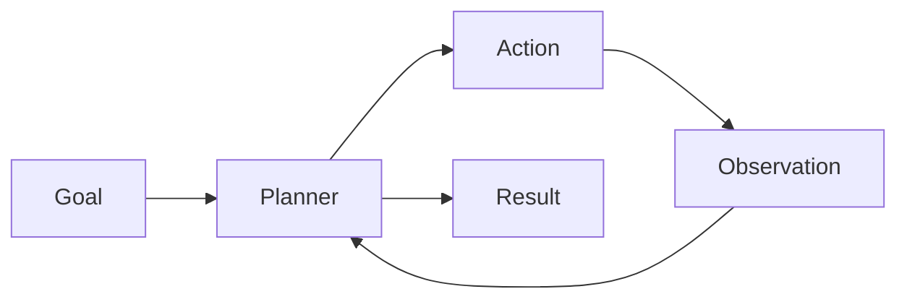
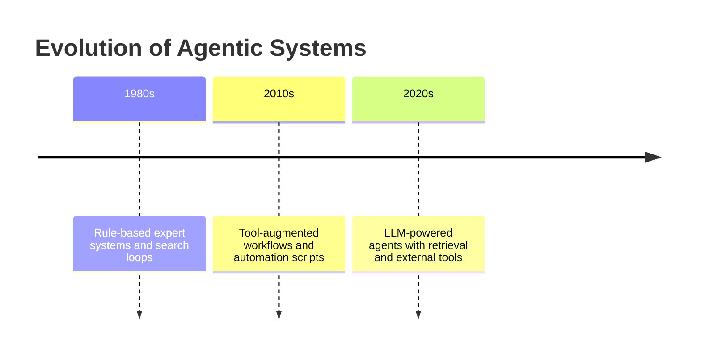
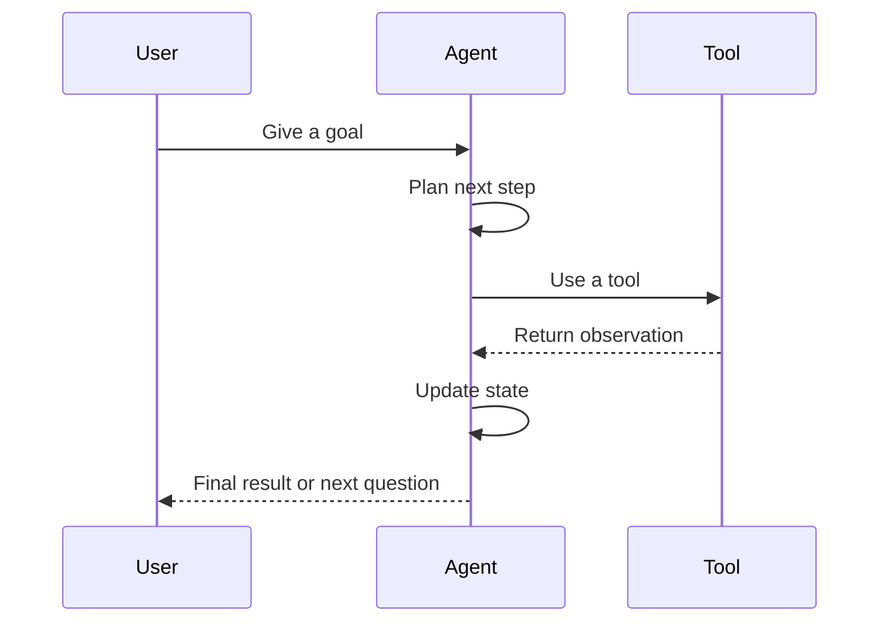
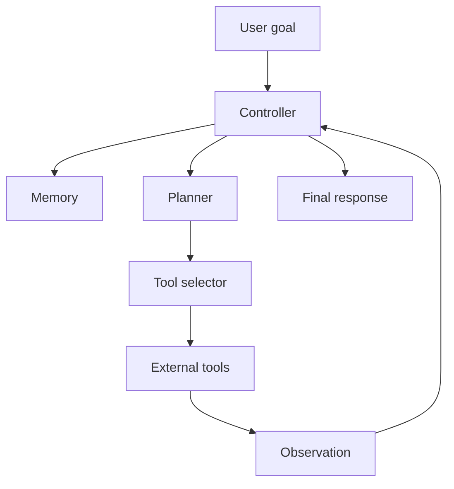
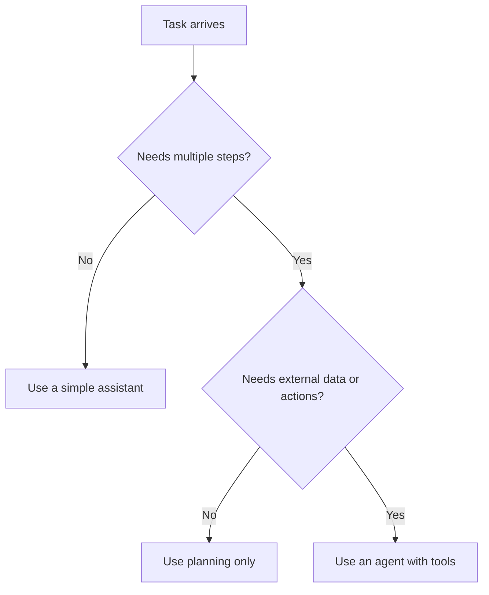
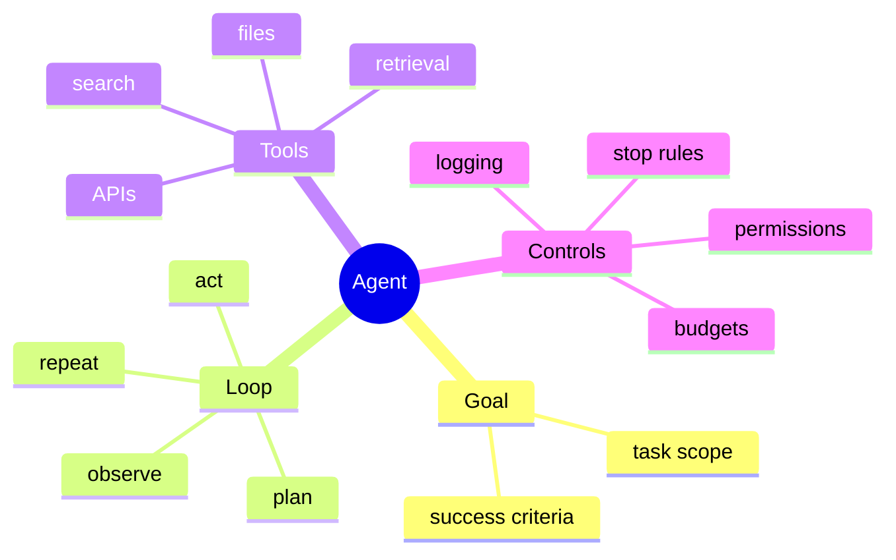

# Day 22 - What are AI Agents?

[Previous: Day 21 - Knowledge Assistant Project](../day_21/day_21_knowledge_assistant_project.md) | [Next: Day 23 - Planning](../day_23/day_23_planning.md)

## Introduction
Week 3 taught us how to retrieve knowledge and remember useful context. Week 4 begins with a new question: what if the model must do more than answer once?

AI agents are systems that use a model to decide actions over time. Instead of answering and stopping, an agent can plan, use tools, observe results, adapt, and continue until a goal is met.



This matters because many real tasks are not one-shot tasks. They need multiple steps, state, retries, tool use, and decision-making. A chatbot may answer a question. An agent may answer, search, verify, refine, and act.

Today you will build the mental model for that difference.

## Learning Objectives
By the end of this day, you should be able to:

- define an AI agent in practical terms
- distinguish an agent from a simple chat model
- explain the agent loop and why it matters
- identify where tools, memory, and planning fit into agent design
- understand why control and guardrails are essential
- recognize when an agent is appropriate and when it is overkill
- sketch a safe first version of a tool-using assistant

## Prerequisites
You should already understand:

- Day 17: Retrieval-Augmented Generation
- Day 19: Memory
- Day 20: Long-Term Memory
- Day 21: Knowledge Assistant Project

If those ideas are still fuzzy, review them first. Agents use retrieval, memory, and tool use together, so they build directly on the work from Week 3.

## Big Picture
An agent is a goal-directed system that can choose actions.



The agent loop is the heart of the system:

1. receive a goal
2. decide what to do next
3. take an action or use a tool
4. observe the result
5. decide whether to continue or stop

That loop is what makes an agent more than a chatbot.

## What Is an AI Agent?
An AI agent is a software system that uses a model to choose actions in pursuit of a goal.

The key words are "choose actions." A chatbot mostly generates text. An agent generates text and also decides what to do with that text.

The action might be:

- calling a search tool
- querying a database
- reading a file
- sending a message
- summarizing a result
- asking a clarification question

The model is not acting in isolation. The application wraps the model with state, tools, and control logic.

## Why Agents Exist
Agents exist because some tasks need more than one pass.

Examples include:

- researching a topic
- finding relevant files across a repository
- checking facts before answering
- filling in missing information
- planning multi-step work
- following up on tool outputs

If a task can be answered in one response, an agent may be unnecessary. If the task needs iteration, adaptation, and tool use, an agent becomes useful.

## Historical Background
The idea of agents did not start with modern LLMs. In earlier AI systems, agents were already used for planning, search, and decision-making.

What changed is that modern language models made the control loop much easier to build. Instead of hand-coding every decision rule, developers can let the model propose the next step and use surrounding software to keep it safe and useful.



## Deep Theory

### Agent versus chatbot
This distinction is essential.

| Aspect | Chatbot | Agent |
| --- | --- | --- |
| Main job | Answer a message | Pursue a goal |
| Control flow | Usually one turn | Multi-step loop |
| Tool use | Optional or absent | Often central |
| State | Limited | Important |
| Adaptation | Low | High |
| Risk | Hallucination | Hallucination plus action risk |

A chatbot is good at conversation. An agent is good at doing work.

### The agent loop
The core loop is often described as think, act, observe, repeat.

But that phrase hides the real engineering detail.

The actual loop often looks like this:

1. interpret the goal
2. check memory and context
3. decide the next step
4. call a tool or produce a response
5. inspect the result
6. update internal state
7. stop when done or when a limit is reached



### Why state matters
Without state, the model cannot remember what it already tried.

State may include:

- the current goal
- steps already completed
- tool results
- memory items
- constraints
- stop conditions

This is why agents are usually built as software systems around the model, not as a single prompt.

### Why tools matter
Tools extend the agent beyond the model’s internal knowledge.

Common tools include:

- search
- retrieval
- calculator
- database query
- file reader
- web request
- task tracker

The model decides when to use a tool. The application decides which tools are allowed.

### Why control matters
Agents can be powerful, but power creates risk.

If an agent can use tools, it may:

- take the wrong action
- repeat the same action
- overuse a tool
- spend too much time or money
- leak data into prompts or logs

That is why the first version of an agent should be narrow, observable, and bounded.

### Where memory fits
Memory helps the agent remember useful facts across turns or sessions.

In practice, memory can help with:

- user preferences
- active goals
- past tool results
- long-running tasks

But memory is not the same as the agent’s working state. Working state is temporary. Memory is durable.

### Planning and agents
Agents often need planning because the model must decide what to do before acting.

Planning can be:

- explicit: the model writes a plan first
- implicit: the model selects steps as it goes
- hybrid: the system plans and then lets the model refine

Planning becomes especially important when a task has dependencies, such as "search before summarizing" or "inspect before replying."

### Advantages
- can handle multi-step tasks
- can use tools and external knowledge
- can adapt to intermediate results
- can continue until a goal is met
- useful for research, automation, and support workflows

### Limitations
- harder to test than simple chat
- tool use increases failure modes
- autonomy can create cost and safety issues
- planning quality may be inconsistent
- debugging requires visibility into the loop

### Alternatives
- a simple chat model
- a workflow engine with fixed steps
- a manual UI with buttons and forms
- a retrieval system without action capability

### When should you use an agent?
Use an agent when the task:

- requires multiple steps
- benefits from tools
- must adapt to new information
- involves research or decision-making
- needs a goal-oriented workflow

### When should you not use an agent?
Do not use an agent when:

- one response is enough
- the task is a simple lookup
- you need strict deterministic behavior
- the action risk is too high
- a fixed workflow would be simpler and safer

## Visual Learning

### Agent Architecture


### Agent Decision Tree


### Loop Control Map


## Code Walkthrough

The code below shows a minimal agent-like loop. It is not a full framework, but it makes the control flow easy to understand.

### Python Example: A tiny agent loop
```python
def plan_next_step(goal, state):
        if not state['searched']:
                return 'search'
        if not state['inspected']:
                return 'inspect'
        return 'respond'


def search_tool(goal):
        return f"Search results for: {goal}"


def inspect_tool(results):
        return f"Inspected: {results}"


goal = 'Find the best note to answer a question'
state = {'searched': False, 'inspected': False}
observations = []

while True:
        next_step = plan_next_step(goal, state)

        if next_step == 'search':
                result = search_tool(goal)
                observations.append(result)
                state['searched'] = True
                print(result)
                continue

        if next_step == 'inspect':
                result = inspect_tool(observations[-1])
                observations.append(result)
                state['inspected'] = True
                print(result)
                continue

        print(f'Final response based on: {observations}')
        break
```

#### Code Explanation
- `plan_next_step` is the simple planner.
- `state` tracks what has already happened.
- `search_tool` represents an external action.
- `inspect_tool` represents a second step that processes the result.
- the `while True` loop repeats until the task is complete.
- `continue` keeps the loop moving through intermediate steps.
- `break` stops the loop when the agent is done.

This is the smallest useful shape of an agent.

### TypeScript Example: Tool registry
```typescript
type Tool = (input: string) => string;

const tools: Record<string, Tool> = {
    search: (input) => `Search results for: ${input}`,
    inspect: (input) => `Inspected: ${input}`,
};

function runTool(name: string, input: string): string {
    const tool = tools[name];

    if (!tool) {
        throw new Error(`Unknown tool: ${name}`);
    }

    return tool(input);
}

console.log(runTool('search', 'agent loops'));
```

#### Code Explanation
- `Tool` defines a common function shape.
- `tools` is a registry of allowed actions.
- `runTool` centralizes permissions and validation.
- the error protects the system from unsupported actions.

### Python Example: Stop conditions
```python
def should_stop(state, step_count, max_steps=3):
        if step_count >= max_steps:
                return True

        if state.get('answer_ready'):
                return True

        return False


print(should_stop({'answer_ready': False}, 2))
print(should_stop({'answer_ready': True}, 1))
```

#### Code Explanation
- `should_stop` prevents runaway loops.
- `max_steps` is a basic budget control.
- `answer_ready` lets the agent stop early when the task is complete.

### TypeScript Example: Agent state object
```typescript
type AgentState = {
    goal: string;
    searched: boolean;
    inspected: boolean;
    answerReady: boolean;
    steps: string[];
};

const state: AgentState = {
    goal: 'Find the best note to answer a question',
    searched: false,
    inspected: false,
    answerReady: false,
    steps: [],
};

console.log(state);
```

#### Code Explanation
- `AgentState` defines the data the loop needs.
- `steps` records the path the agent took.
- this state makes debugging and logging much easier.

### Python Example: Agent logging
```python
def log_event(events, message):
        events.append(message)
        return events


events = []
events = log_event(events, 'Started agent loop')
events = log_event(events, 'Used search tool')
events = log_event(events, 'Prepared final answer')

print(events)
```

#### Code Explanation
- `log_event` collects the agent’s history.
- logging is critical because agents are otherwise hard to inspect.
- every action should leave a trace.

## Practical Examples

### Beginner Example: Note search helper
A student asks the agent to find the best note for a question. The agent searches the notes, checks the result, and returns the answer with sources.

Why it works:

- the task is narrow
- the agent has one main tool
- the loop is simple and observable

### Intermediate Example: Course assistant
An assistant for this repository can answer questions, retrieve lesson sources, and ask for clarification when the query is too broad.

What could go wrong:

- too many tool calls for a simple question
- the agent may repeat searches if stop conditions are weak
- the assistant may answer before checking enough evidence

### Professional Example: Research workflow agent
A research agent may search sources, summarize findings, compare documents, and generate a citation-backed result.

Why professionals like this:

- it reduces repetitive manual work
- it can chain search and summarization
- it fits well with knowledge-heavy workflows

### Real-World Company Example
A support or documentation team may use agent-like behavior to search knowledge bases, check internal policies, and draft responses.

The agent still needs strong constraints. Real companies rarely want uncontrolled autonomy. They want helpful automation with observability and limits.

## Best Practices
- keep the agent goal narrow
- limit the available tools
- log every action and observation
- define stop conditions clearly
- prefer simple flows before advanced autonomy
- make the state visible for debugging
- use memory only when it improves continuity
- separate planning, acting, and response generation
- test the agent with real scenarios before broadening its scope

## Common Mistakes
- letting the agent run forever
- exposing too many tools too early
- not tracking what the agent already tried
- confusing an agent with a chatbot
- making the first version too autonomous
- hiding the intermediate steps from logs
- using a vague goal that the agent cannot resolve

### Debugging Strategy
When an agent fails, inspect it in this order:

1. Was the goal clear enough?
2. Did the planner choose a sensible first step?
3. Did the tool return a usable observation?
4. Did the state update correctly?
5. Did the stop rule trigger at the right time?

This sequence helps isolate whether the problem is planning, tool use, or control flow.

## Performance

Agents are powerful but can be expensive if they are not managed carefully.

### Latency
Latency grows when the agent makes many tool calls.

You can reduce it by:

- keeping the loop short
- limiting search depth
- caching tool outputs when safe
- using a stop condition and a max step budget

### Cost
Costs rise with:

- repeated model calls
- repeated tool calls
- long prompts with too much state
- unbounded autonomous loops

### Memory
Agent state can grow over time.

Keep state focused on the active goal and only retain memory that helps future steps.

### Scalability
To scale agents, teams often:

- split planner and executor responsibilities
- use lightweight tools
- isolate per-user state
- store logs asynchronously

### Reliability
Reliable agents need predictable control.

If the agent cannot explain what it tried, it will be hard to trust or improve.

## Security

Agents enlarge the attack surface because they can take actions.

### Prompt Injection
An agent may read malicious text in a document or tool output. That text could try to redirect the agent’s behavior.

### Secrets and API Keys
Never expose secrets to the model unless absolutely necessary.

### Authentication and Authorization
Tools should only allow actions the user is permitted to take.

### Data Privacy
Agent logs may contain sensitive context. Store them carefully.

### Hallucinations and Model Safety
The model may hallucinate a tool result or overstate what a tool returned.

The answer should be grounded in actual observations, not imagination.

## Evaluation
Evaluate agents by watching the loop, not only the final answer.

### What to measure
- number of steps
- whether the agent chose useful actions
- whether it stopped appropriately
- whether tool use improved the answer
- whether it avoided unsafe actions

### Useful metrics
- task success rate
- average steps per task
- tool failure rate
- stop-condition accuracy
- grounded answer rate

## Exercises

### Easy
1. Define an AI agent.
2. List the steps in the agent loop.
3. Name one tool an agent might use.
4. Explain why stop conditions matter.

### Medium
5. Compare an agent and a chatbot.
6. Explain why state is important in agents.
7. Describe how memory fits into the agent loop.
8. Explain why tool logs help debugging.

### Hard
9. Design a safe agent for a research task.
10. Propose a stop rule for a search agent.
11. Describe how to prevent an agent from repeating the same action.
12. Explain how to scope tool permissions safely.

### Challenge
13. Build a narrow research assistant agent that searches notes and summarizes results.
14. Add a max-step budget.
15. Add logs for every tool call and observation.
16. Add a clarifying-question branch.
17. Add a fallback answer when evidence is missing.

### Reflection Questions
18. Why do agents feel more powerful than chatbots?
19. Why is autonomy risky when the task is not well defined?
20. Which is more important in agent design: tools or control?
21. How does the agent loop connect to Day 23 planning?
22. What is the smallest useful agent you could build?

## Mini Project
Sketch a research assistant agent that searches notes, summarizes findings, and returns sources.

### Goal
Create an assistant that can take a research question, search the knowledge base, inspect the strongest results, and return a grounded summary with citations.

### Features
- accept a goal or question
- decide whether to search notes
- inspect retrieved chunks
- summarize findings
- stop when enough evidence is available
- log all steps and observations

### Suggested folder structure
```text
research-agent/
├── app/
│   ├── planner.py
│   ├── tools.py
│   ├── state.py
│   ├── logger.py
│   └── main.py
├── data/
│   └── notes/
├── tests/
│   └── test_agent_loop.py
└── README.md
```

### Project steps
1. define the research goal
2. decide which tools the agent may use
3. track state across steps
4. add a clear stop condition
5. log every action and observation
6. test with a narrow research question

### What you learn
- how a tool-using system differs from a chatbot
- why planning and state matter
- how to control agent behavior safely
- how the next lesson will formalize planning

## Capstone Update
Add these items to the final capstone plan:

- a small agent that can search the repository knowledge base
- a limited tool set with strong permissions
- step logging for transparency
- a stop rule based on confidence or evidence
- a fallback path when the goal cannot be met

This keeps the final capstone aligned with the rest of the course and prepares it for planning, multi-agent systems, and tool orchestration.

## Summary
AI agents coordinate multiple steps toward a goal.

Their power comes from planning, tool use, and feedback loops, not from raw text generation alone. That power is useful, but it must be controlled.

The main lessons from today are:

- an agent is not just a chatbot
- state, tools, and stop conditions matter
- the loop must be observable and safe
- narrow, controlled agents are easier to trust than broad autonomous ones

If Day 21 gave you a knowledge assistant, Day 22 gives you the decision-making pattern that can extend that assistant into an agent.

[Previous: Day 21 - Knowledge Assistant Project](../day_21/day_21_knowledge_assistant_project.md) | [Next: Day 23 - Planning](../day_23/day_23_planning.md)

## Further Reading
- https://www.langchain.com/langgraph
- https://modelcontextprotocol.io/
- https://openai.com/index/introducing-openai-responses/
- https://arxiv.org/abs/2305.10403
- https://www.anthropic.com/news/tool-use
