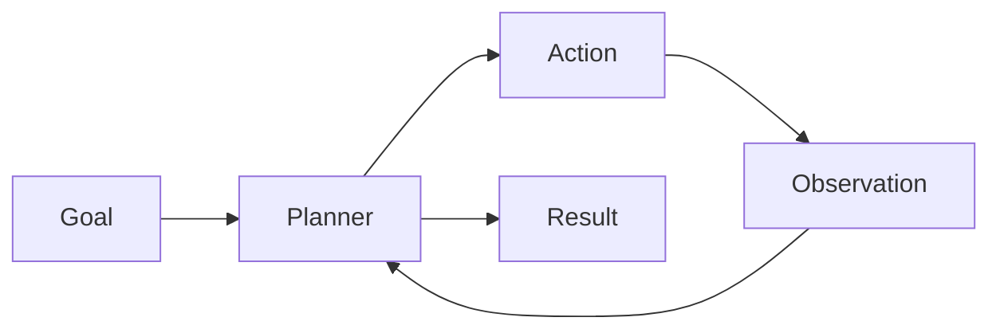

# Day 22 - What are AI Agents?

[Previous: Day 21 - Knowledge Assistant Project](../day_21/day_21_knowledge_assistant_project.md) | [Next: Day 23 - Planning](../day_23/day_23_planning.md)

## Introduction
AI agents are systems that use a model to decide actions over time. Instead of answering once and stopping, an agent can plan, use tools, observe results, and continue until a goal is met.


## Learning Objectives
By the end of this day, you should be able to:

- define an AI agent
- distinguish an agent from a chat model
- explain the agent loop
- identify where tools and memory fit into agent design
- understand why control and guardrails matter

## Theory
An agent is useful when a task needs multiple steps, state, and adaptation. The model does not just reply; it chooses actions based on progress and feedback.

A simple agent loop is: think, act, observe, repeat.

### Visual Diagram


## Code Examples

### Python
```python
goal = "Find the best note to answer a question"
steps = ["plan", "search", "inspect", "respond"]
print(goal)
print(steps)
```

### TypeScript
```typescript
const goal = 'Find the best note to answer a question';
const steps = ['plan', 'search', 'inspect', 'respond'];

console.log(goal);
console.log(steps);
```

## Best Practices
- keep the agent goal narrow
- limit the available tools
- log every action and observation
- define stop conditions clearly
- prefer simple flows before advanced autonomy

## Common Mistakes
- letting the agent run forever
- exposing too many tools too early
- not tracking what the agent already tried
- confusing an agent with a chatbot
- making the first version too autonomous

## Exercises
- Easy: Define an AI agent.
- Medium: Describe the agent loop.
- Hard: Compare an agent and a chatbot.
- Challenge: Design a safe agent for a task you know.

## Mini Project
Sketch a research assistant agent that searches notes, summarizes findings, and returns sources.

## Summary
AI agents coordinate multiple steps toward a goal. Their power comes from planning, tool use, and feedback loops, not from raw text generation alone.

[Previous: Day 21 - Knowledge Assistant Project](../day_21/day_21_knowledge_assistant_project.md) | [Next: Day 23 - Planning](../day_23/day_23_planning.md)

## Additional Resources
- https://www.langchain.com/langgraph
- https://modelcontextprotocol.io/
- https://openai.com/index/introducing-openai-responses/
